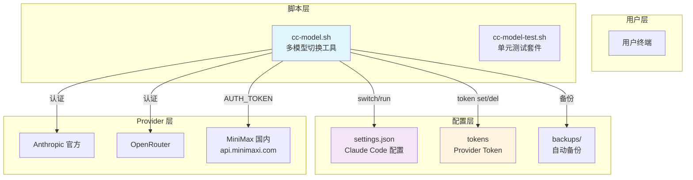
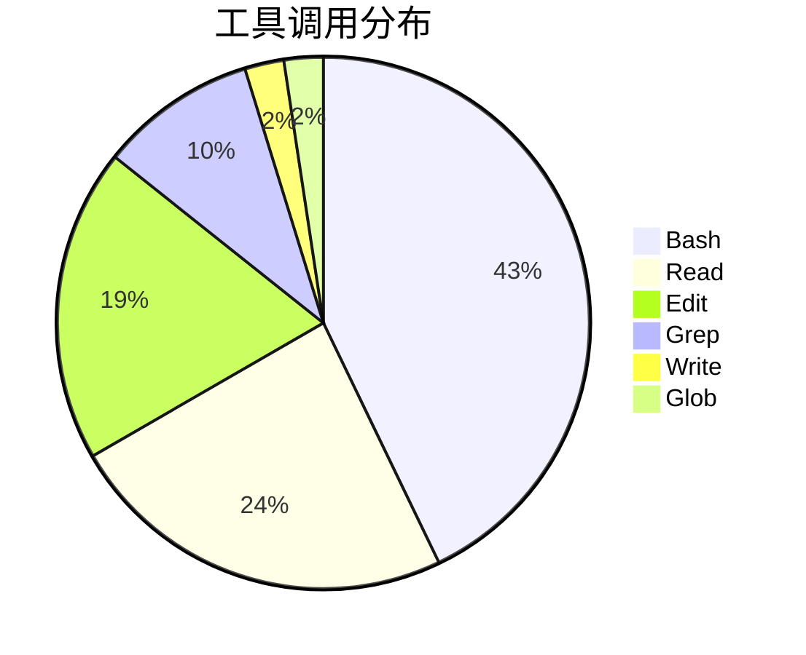
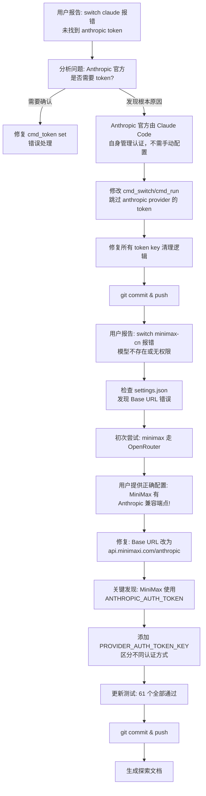
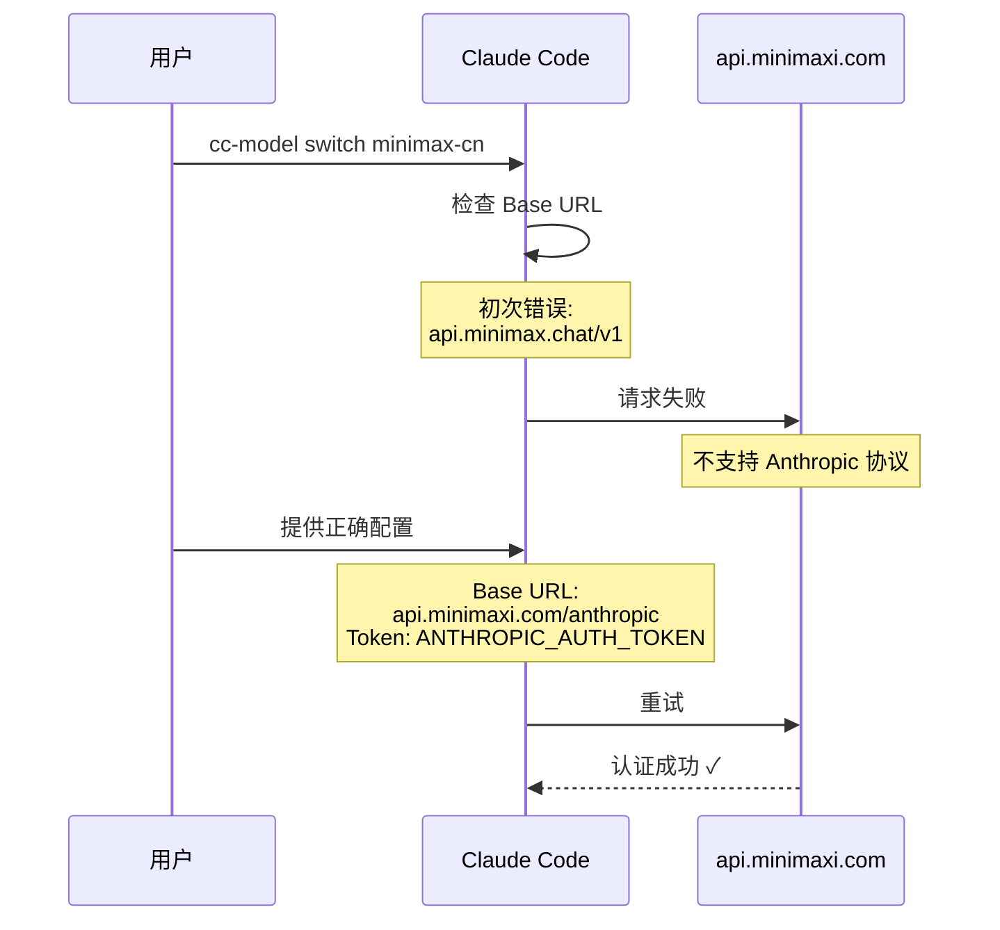
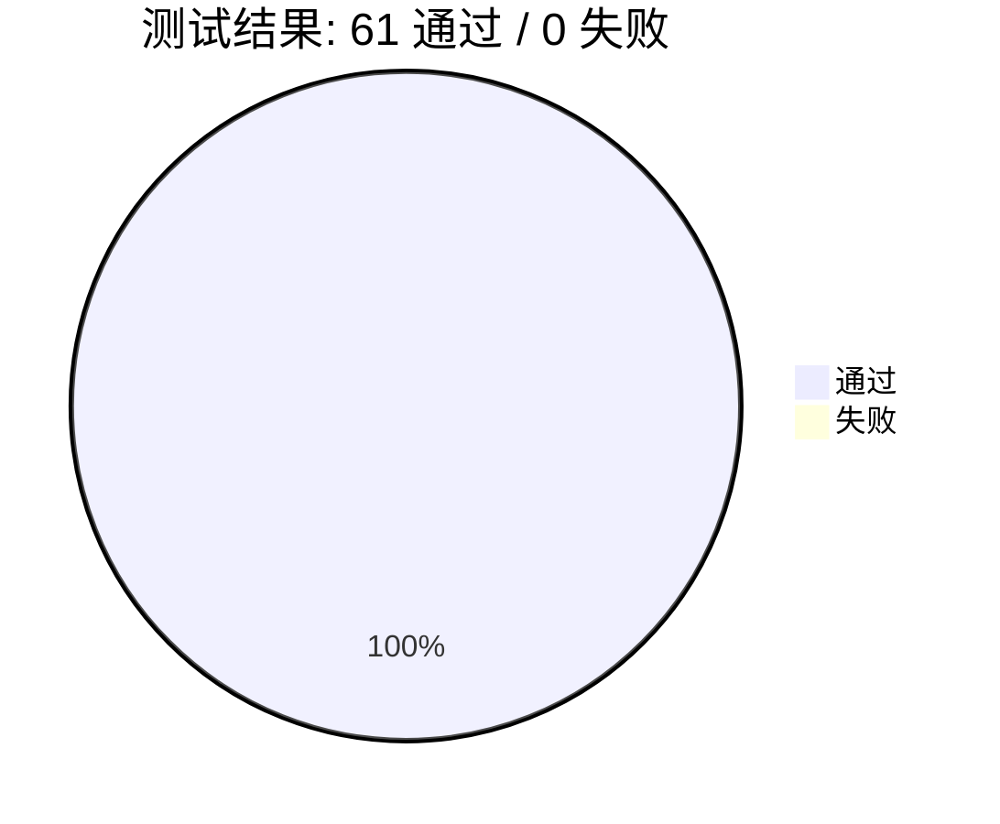

# cc-model 多模型切换工具 Bug 修复实践探索之旅（续）

> **主题：** minimax-cn Base URL 错误 + token 认证方式修复
> **日期：** 2026-04-10
> **受众：** AI 学习者 / Claude Code 使用者
> **会话 ID：** `55fcebfa-bcf2-4403-b54c-179aa5682a00`（续，上一会话 `47ad6597-2370-407b-a33c-1a768d02e7ed`）
> **项目路径：** `/root/sh`
> **GitHub 地址：** git@github.com:chujun/aiubuntu1-sh.git

---

## 目录

- [一、主要用户价值](#一主要用户价值)
- [二、开发环境](#二开发环境)
- [三、技术栈](#三技术栈)
- [四、AI 模型 / 插件 / Agent / 技能 / MCP 使用统计](#四ai-模型--插件--agent--技能--mcp-使用统计)
- [五、会话主要内容](#五会话主要内容)
- [六、测试结果](#六测试结果)
- [七、主要挑战与转折点](#七主要挑战与转折点)
- [八、用户提示词清单](#八用户提示词清单)
- [九、AI 辅助实践经验](#九ai-辅助实践经验)

---

## 一、主要用户价值

1. **消除误判 bug**：修复了 `cc-model switch claude` 强制要求 token 的错误——Anthropic 官方模型由 Claude Code 自身管理认证，不需要手动配置
2. **修复关键连接错误**：将 `minimax-cn` 的 Base URL 从错误的 `api.minimax.chat` 改为正确的 `api.minimaxi.com/anthropic`，使 MiniMax 国内直连真正可用
3. **正确的认证方式**：识别出 MiniMax 使用 `ANTHROPIC_AUTH_TOKEN` 而非 `ANTHROPIC_API_KEY`，避免认证失败
4. **友好的错误提示**：将 bash `${1:?}` 内置错误替换为显式参数检查，用户看到清晰的用法提示而非晦涩的 shell 报错
5. **代码质量提升**：61 个单元测试全部通过，每次写入前自动备份，支持一键回滚

---

## 二、开发环境

| 项目 | 版本 |
|------|------|
| OS | Linux 6.8.0-107-generic (Ubuntu) |
| Shell | Bash |
| Claude Code | 最新版（Claude Opus 4.6） |
| Python | 3.x（用于 JSON 操作） |

---

## 三、技术栈



---

## 四、AI 模型 / 插件 / Agent / 技能 / MCP 使用统计

### 4.1 AI 大模型

| 模型 ID | 名称 | 用途 | 调用范围 |
|---------|------|------|---------|
| claude-opus-4-6 | Opus 4.6 | 主对话 | 全程 |

### 4.2 开发工具

| 工具 | 用途 |
|------|------|
| Bash | 执行脚本、运行测试、git 操作 |
| Read | 读取源码、settings.json |
| Edit | 修改 cc-model.sh、测试文件 |
| Grep | 搜索代码中的关键函数和变量 |

### 4.3 插件（Plugin）

无新增插件。

### 4.4 Agent（智能代理）

本次会话未调用任何 Agent。

### 4.5 技能（Skill）

| 技能名称 | 触发命令 | 触发方 | 调用次数 | 是否完整执行 |
|---------|---------|-------|---------|------------|
| my-explore-doc-record | /my-explore-doc-record | 用户 | 1 次 | ✅ 完整 |

### 4.6 MCP 服务

未配置 MCP 服务。

### 4.7 Claude Code 工具调用统计

（基于会话记忆的估算）



> ⚠️ 以上为估算值，基于会话中实际执行的工具调用记录。

### 4.8 浏览器插件（用户环境）

本次会话未涉及浏览器操作。

---

## 五、会话主要内容

### 5.1 任务全景



### 5.2 问题一：Anthropic 官方模型强制要求 token

**根因分析：**

```mermaid
flowchart LR
    subgraph "错误代码"
        E1[cmd_token set<br/>${1:?请提供 token}]
        E2[cmd_switch<br/>get_token anthropic]
    end
    subgraph "后果"
        P1[bash 报错: line 136<br/>请提供 token]
        P2[切换 claude 模型时报错:<br/>未找到 anthropic token]
    end
    subgraph "根本原因"
        R[Anthropic 官方由<br/>Claude Code 自管理<br/>不需要手动配置]
    end

    E1 --> P1
    E2 --> P2
    E1 --> R
    E2 --> R
```

**修复方案：**

1. `cmd_token set`：将 `${1:?msg}` 替换为显式参数检查，提供友好错误提示
2. `cmd_switch/cmd_run`：provider 为 `anthropic` 时跳过 `get_token` 调用
3. Python JSON 脚本：切换时清理所有 token 环境变量，不写入/保留

### 5.3 问题二：MiniMax 国内 Base URL 错误

**初次误判：** 以为 MiniMax 直连走 OpenAI 兼容协议（`api.minimax.chat/v1`），需要走 OpenRouter 中转。

**用户提供正确信息后修正：**



**关键发现：** MiniMax 国内有两个端点：

| 端点 | 协议 | 用途 |
|------|------|------|
| `api.minimax.chat/v1` | OpenAI 兼容 | 标准 OpenAI SDK 调用 |
| `api.minimaxi.com/anthropic` | Anthropic 兼容 | Claude Code 直接使用 |

**修复方案：**

1. 添加 `PROVIDER_AUTH_TOKEN_KEY` 关联表：
   ```bash
   declare -A PROVIDER_AUTH_TOKEN_KEY=(
       [minimax]="ANTHROPIC_AUTH_TOKEN"
   )
   ```
2. 切换时根据 provider 选择正确的 token 环境变量名
3. 清理逻辑：切换前清除所有可能的 token key，避免残留

---

## 六、测试结果



| 测试组 | 通过 | 失败 | 说明 |
|--------|------|------|------|
| validate_model | 12 | 0 | 模型别名验证 |
| get_token | 5 | 0 | Token 读取 |
| backup_file | 6 | 0 | 备份与轮转 |
| read_settings | 2 | 0 | JSON 读取 |
| write_settings | 5 | 0 | JSON 写入与备份 |
| cmd_switch | 12 | 0 | 切换核心逻辑（含 minimax AUTH_TOKEN） |
| cmd_restore | 8 | 0 | 恢复功能 |
| cmd_token set/del/list | 11 | 0 | Token 管理 |

> **测试更新记录：** 本次会话修改了 3 个测试用例：
> - `switch claude-sonnet 写入 API key` → 改为验证 **不写入** ANTHROPIC_API_KEY
> - `switch minimax-cn BASE_URL` → 改为验证 `api.minimaxi.com` 和 `ANTHROPIC_AUTH_TOKEN`
> - 新增 `switch Anthropic 模型不写入 ANTHROPIC_AUTH_TOKEN`

---

## 七、主要挑战与转折点

| 挑战 | 初始判断 | 实际根因 | 转折点 |
|------|---------|---------|--------|
| Anthropic 官方强制要求 token | Claude Code 所有模型都需要手动配置 token | Claude Code 自身管理 Anthropic 官方认证，不需要 ANTHROPIC_API_KEY 环境变量 | 用户明确说"claude anthropic默认不是不用输入token的吗"后查源码确认 |
| MiniMax Base URL 选错 | MiniMax 直连走 OpenAI 兼容协议，需要 OpenRouter 中转 | MiniMax 有独立的 Anthropic 兼容端点 `api.minimaxi.com/anthropic` | 用户提供了正确的 settings.json 示例配置，发现端点不同 |
| Token 环境变量名混淆 | 以为所有 provider 都用 ANTHROPIC_API_KEY | MiniMax 国内使用专用的 ANTHROPIC_AUTH_TOKEN | 用户配置中明确使用了 ANTHROPIC_AUTH_TOKEN |
| bash 报错信息不友好 | ${1:?msg} 的 bash 内置错误对用户晦涩难懂 | ${1:?} 将"缺少参数"当作严重错误直接终止，错误信息是 shell 展开格式 | 改为显式 [[ -n ]] 检查 + error 函数自定义消息 |

---

## 八、用户提示词清单（原文，一字未改）

### 【上一会话（已归档到摘要）】

**提示词 1：**
```
cc-model switch claude [ERR] 未找到 [anthropic] 的 token，请运行: cc-model token set anthropic <token>
```

**提示词 2：**
```
cc-model token set anthropic /usr/local/bin/
```

**提示词 3：**
```
root@aiubuntus1:~# cc-model switch claude [ERR]   未找到 [anthropic] 的 token，请运行: cc-model token set anthropic <token> claude anthropic默认不是不用输入token的吗，修复这个问题
```

**提示词 4：**
```
git commit 与push
```

**提示词 5：**
```
删除ai-chat.sh，这个脚本无用，提交其他部分
```

### 【当前会话】

**提示词 1：**
```
MiniMax 国内可以直接用于 Claude Code，参考这个配置修改"env": {
    "ANTHROPIC_AUTH_TOKEN": "XXXXXXX",
    "ANTHROPIC_BASE_URL": "https://api.minimaxi.com/anthropic",
    "ANTHROPIC_DEFAULT_HAIKU_MODEL": "MiniMax-M2.7-highspeed",
    "ANTHROPIC_DEFAULT_OPUS_MODEL": "MiniMax-M2.7-highspeed",
    "ANTHROPIC_DEFAULT_SONNET_MODEL": "MiniMax-M2.7-highspeed",
    "ANTHROPIC_MODEL": "MiniMax-M2.7-highspeed",
    "ANTHROPIC_REASONING_MODEL": "MiniMax-M2.7-highspeed",
    "API_TIMEOUT_MS": "3000000",
    "CLAUDE_CODE_DISABLE_NONESSENTIAL_TRAFFIC": 1
  },
```

**提示词 2：**
```
[技能调用] /my-explore-doc-record
```

---

## 九、AI 辅助实践经验（面向 AI 学习者）

```mermaid
mindmap
  root((AI 辅助开发
    经验总结))
    调试经验
      当 AI 给出的解决方案不work时
      提供真实的配置文件/错误日志
      比描述更有效
      用户的一个示例配置
      顶得上10次猜测
    根因分析
      数据流追踪优于猜测
      读取实际的 settings.json
      理解端点协议差异
      Anthropic vs OpenAI 兼容
    认证机制
      不同 Provider 使用不同
      环境变量名
      ANTHROPIC_API_KEY vs
      ANTHROPIC_AUTH_TOKEN
      需查文档或用户提供示例
    错误处理
      bash 内置 ${var:?msg}
      对用户不友好
      显式参数检查提供
      清晰的用法提示
    测试优先
      每次修改后运行测试
      发现断点立即修复
      测试是重构的保障
```

| 经验 | 核心教训 |
|------|---------|
| 提供真实配置比猜测更高效 | 本次会话中，用户直接提供了正确的 MiniMax settings.json 配置，让我发现了两个关键信息：1）Base URL 是 `api.minimaxi.com/anthropic` 而非 `api.minimax.chat/v1`；2）Token 变量名是 `ANTHROPIC_AUTH_TOKEN` 而非 `ANTHROPIC_API_KEY`。如果仅靠猜测和推理，很可能继续走弯路。 |
| 不同 Provider 的认证方式可能完全不同 | 惯性思维认为所有 Anthropic 兼容 API 都用 `ANTHROPIC_API_KEY`，但 MiniMax 专用 `ANTHROPIC_AUTH_TOKEN`。解决方案是建立 provider → auth key 的映射表，而非硬编码。 |
| Anthropic 官方模型不需要手动配置 token | Claude Code 自身通过 `~/.claude` 目录管理 Anthropic 官方认证，手动设置 `ANTHROPIC_API_KEY` 不仅多余，还会覆盖 Claude Code 的内部认证机制。 |
| bash `${1:?msg}` 的错误信息对用户不友好 | `${1:?}` 是 bash 的强制错误展开，会直接打印到 stderr 且退出码为 1。用户看到的是 `: 请提供 token: 1` 这种 shell 内部格式。显式参数检查 + `error()` 函数可以提供更友好的用法提示。 |

---

*文档生成时间：2026-04-10 | 由 Claude Opus 4.6 (`claude-opus-4-6`) 辅助生成*
