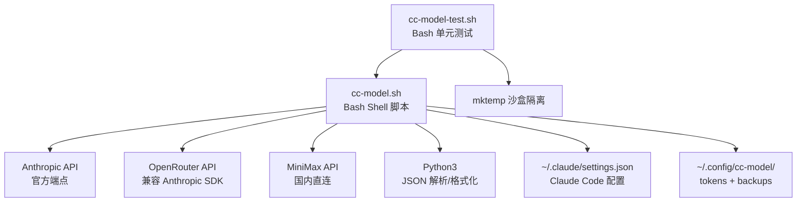
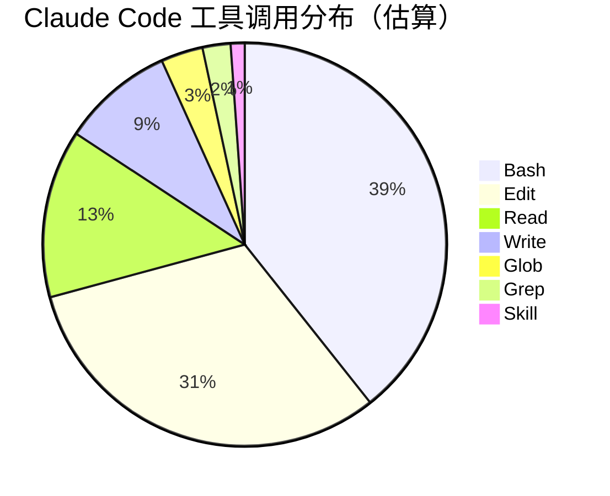
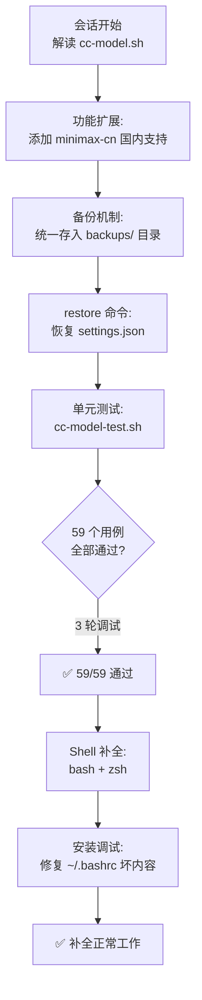
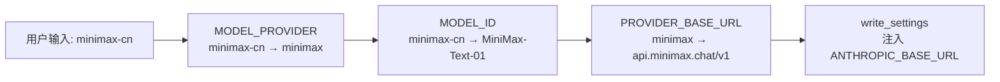
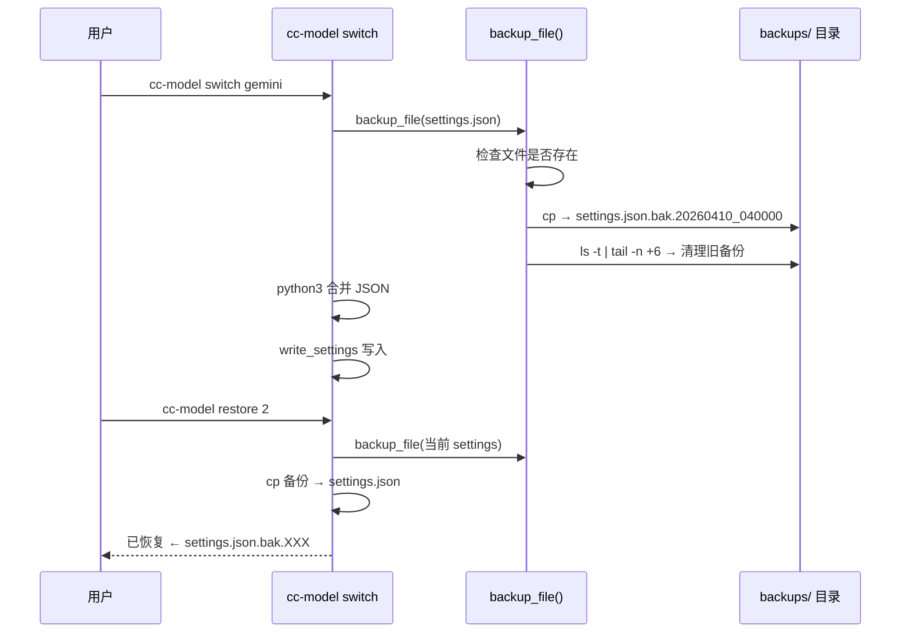
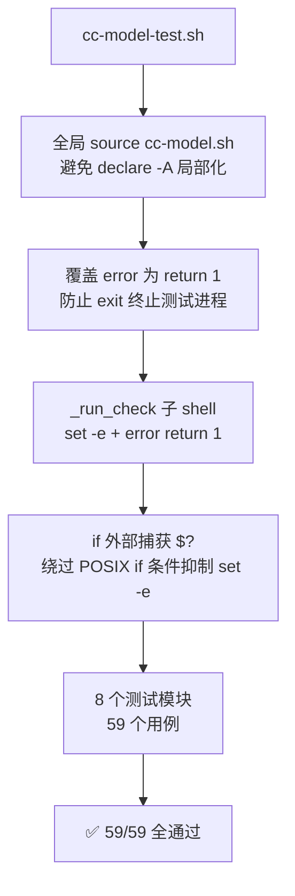
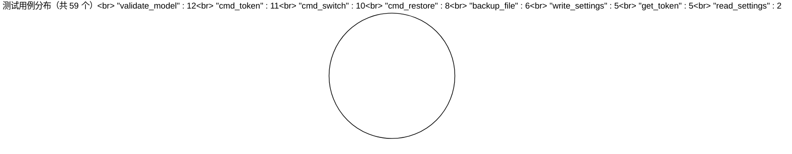
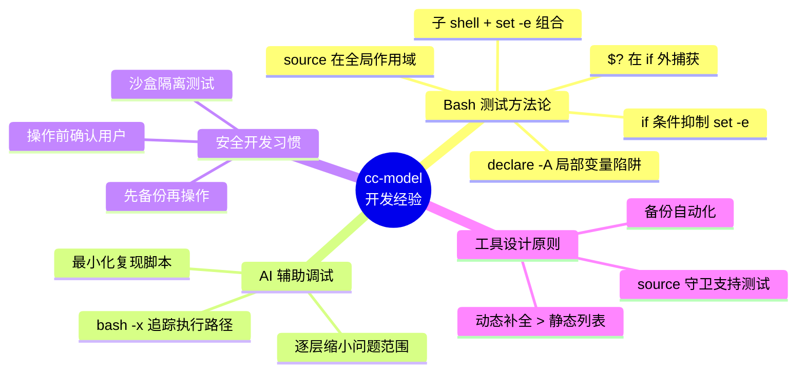

# cc-model 多模型切换工具功能开发实践探索之旅

> **主题：** 从零构建 Claude Code 多模型切换工具，涵盖功能扩展、备份机制、单元测试、Shell 补全
> **日期：** 2026-04-10
> **受众：** AI 学习者 / Claude Code 使用者
> **会话 ID：** `2026-04-10-sh`
> **项目路径：** `/root/sh`
> **GitHub 地址：** https://github.com/chujun/aiubuntu1-sh

---

## 目录

- [一、主要用户价值](#一主要用户价值)
- [二、开发环境](#二开发环境)
- [三、技术栈](#三技术栈)
- [四、AI 模型 / 插件 / Agent / 技能 / MCP 使用统计](#四ai-模型--插件--agent--技能--mcp-使用统计)
- [五、会话主要内容](#五会话主要内容)
- [六、测试结果](#六测试结果)
- [七、主要挑战与转折点](#七主要挑战与转折点)
- [八、用户提示词清单](#八用户提示词清单)
- [九、AI 辅助实践经验](#九ai-辅助实践经验)

---

## 一、主要用户价值

1. **多模型一键切换**：通过 `cc-model switch` 永久修改 Claude Code 的默认模型，支持 9 种模型别名，覆盖 Anthropic 官方、OpenRouter 中转、MiniMax 国内直连三条路由，无需手动编辑 JSON 配置。

2. **MiniMax 国内直连支持**：新增 `minimax-cn` 别名，直连 `api.minimax.chat/v1`，解决国内网络访问 OpenRouter 不稳定的问题，一个配置解决国内 AI 访问痛点。

3. **配置安全保障**：每次写入 `settings.json` 或 `tokens` 文件前自动备份，统一存入 `~/.config/cc-model/backups/`，按时间戳命名，超出上限自动清理旧版本，彻底消除误操作风险。

4. **一键回滚配置**：`cc-model restore [n]` 命令可查看备份列表并恢复指定版本，恢复前再次备份当前状态，支持多次反悔，运维友好。

5. **59 个单元测试全覆盖**：为所有核心函数编写单元测试，在隔离沙盒中运行（`mktemp -d`），不影响真实配置，发现并记录了 3 个 Bash 测试编写的深层陷阱，为 Shell 脚本测试沉淀了可复用方法论。

6. **Tab 补全开箱即用**：同时生成 bash/zsh 两套补全脚本，支持动态补全（备份序号、已配置 provider），一行命令完成安装，极大提升日常使用体验。

---

## 二、开发环境

| 项目 | 详情 |
|------|------|
| 操作系统 | Ubuntu Linux 6.8.0-107-generic x86_64 |
| Shell | GNU Bash 5.2.21 |
| Python | Python 3（用于 JSON 解析） |
| 编辑器 | Claude Code CLI |
| 项目路径 | `/root/sh` |
| Git 分支 | `main` |

---

## 三、技术栈



| 组件 | 版本/说明 |
|------|---------|
| Bash | 5.2.21，使用关联数组 `declare -A`、`mapfile`、`set -euo pipefail` |
| Python3 | 用于 `json.loads` / `json.dumps` 合并 settings.json |
| sed | 原地替换 token 文件（`-i` 参数，`|` 分隔符避免 `/` 冲突）|
| bash-completion | Tab 补全框架（`_init_completion` / `complete -F`）|
| zsh compdef | zsh 原生 `_arguments` 风格补全 |

---

## 四、AI 模型 / 插件 / Agent / 技能 / MCP 使用统计

### 4.1 AI 大模型

| 模型 ID | 名称 | 用途 | 调用范围 |
|---------|------|------|---------|
| `claude-sonnet-4-6` | Claude Sonnet 4.6 | 主对话、代码编写、调试、测试 | 全程 |

### 4.2 开发工具

| 工具 | 用途 |
|------|------|
| Claude Code CLI | 主开发环境 |
| Bash | 脚本运行与调试 |
| Git | 版本控制 |

### 4.3 插件（Plugin）

本次会话未使用浏览器插件。

### 4.4 Agent（智能代理）

本次会话未调用 Agent（所有任务由主对话直接完成）。

| Agent 名称 | 触发方式 | 执行结果 | 说明 |
|-----------|---------|---------|------|
| — | — | — | 本次会话复杂度适中，Claude 直接处理，未触发 Agent |

### 4.5 技能（Skill）

| 技能名称 | 触发命令 | 触发方 | 调用次数 | 执行情况 |
|---------|---------|-------|---------|---------|
| my-explore-doc-record | `/my-explore-doc-record` | 用户 | 1 次 | ✅ 完整执行 |

### 4.6 MCP 服务

| MCP 服务 | 工具前缀 | 本次调用次数 | 说明 |
|---------|---------|------------|------|
| （未配置） | — | 0 | `~/.claude/settings.json` 中无 MCP 配置 |

### 4.7 Claude Code 工具调用统计

> ⚠️ 以下为基于会话记忆的估算值，非精确统计。



| 工具 | 估算次数 | 主要用途 |
|------|---------|---------|
| Bash | ~35 | 语法检查、测试运行、调试、安装 |
| Edit | ~28 | 修改 cc-model.sh 各功能模块 |
| Read | ~12 | 读取脚本内容、定位修改位置 |
| Write | ~8 | 创建测试文件、文档 |
| Glob | ~3 | 文件查找 |
| Grep | ~2 | 内容搜索 |
| Skill | 1 | 调用 my-explore-doc-record |

### 4.8 浏览器插件

本次会话为纯 CLI 开发，未涉及浏览器环境。

---

## 五、会话主要内容

### 5.1 任务全景



### 5.2 MiniMax 国内供应商支持

在三张关联数组中各增加一条记录，并更新 `PROVIDER_BASE_URL` 新增 `minimax` 端点：



### 5.3 备份机制设计



### 5.4 单元测试架构

测试套件覆盖 8 个模块：



---

## 六、测试结果

本次会话编写并运行了完整的单元测试套件。



| 模块 | 用例数 | 通过 | 失败 | 覆盖重点 |
|------|--------|------|------|---------|
| validate_model | 12 | 12 | 0 | 合法别名、空串、大小写 |
| get_token | 5 | 5 | 0 | 文件不存在、含 `=` 号 token |
| backup_file | 6 | 6 | 0 | 跳过、内容、格式、BACKUP_KEEP 清理 |
| read_settings | 2 | 2 | 0 | 不存在返回 `{}`、正常读取 |
| write_settings | 5 | 5 | 0 | 创建、格式化、自动备份 |
| cmd_switch | 10 | 10 | 0 | 三条路由、字段保留、BASE_URL 增删 |
| cmd_restore | 8 | 8 | 0 | 恢复/越界/非法参数/自动备份 |
| cmd_token | 11 | 11 | 0 | set/del/list/权限/覆盖/备份 |
| **合计** | **59** | **59** | **0** | — |

---

## 七、主要挑战与转折点

| 挑战 | 初始判断 | 实际根因 | 转折点 |
|------|---------|---------|--------|
| **source 后 MODEL_ID 不可见** | 以为是变量作用域问题 | `declare -A` 在函数内执行 → 产生**局部变量**，函数返回后消失 | 用 bash -x 追踪到 `validate_model claude` 执行即退出，发现数组从未传递到外部 |
| **error() 改 return 1 后函数继续执行** | 以为 `return 1` 能终止调用函数 | `\|\| error` 中 error() 返回 1 只退出 error 本身，外层函数继续执行 | 加 `set -e` 于子 shell 中，使 `\|\| error` 的非零结果触发 set -e 退出 |
| **if 条件中子 shell 的 set -e 被抑制** | 以为 `if ( set -e; func )` 能正常工作 | POSIX 规定：子 shell 作 if 条件时，内部 set -e 被**静默抑制** | 将子 shell 执行移到 if 外部，单独用 `$?` 捕获退出码 |
| **~/.bashrc 坏内容** | 以为是补全脚本 bug | `cc-model token`（无子命令）的输出文本被意外追加到 `.bashrc` | `tail ~/.bashrc` 发现"用法: cc-model token…"和"Provider: anthropic"两行明文 |
| **cc-model 不在 PATH** | 以为 eval 命令有语法错误 | 脚本未安装到 PATH，`cc-model` 命令不存在 | `which cc-model` 返回空，确认需要 `ln -sf` 创建软链接 |
| **同秒多次备份时间戳碰撞** | 断言"4 次 switch 后有 3 个备份" | 自动化测试运行极快，多次备份在同一秒内产生相同时间戳，互相覆盖 | 改为只断言"备份目录非空"，避免对快速操作的精确计数做刚性断言 |

---

## 八、用户提示词清单（原文，一字未改）

### 【上一会话（已归档到摘要）】

**提示词 1：**
```
解读
解读 @cc-model.sh 脚本功能
```

**提示词 2：**
```
支持minimax中国国内供应商
```

**提示词 3：**
```
备份文件存储到在哪儿
```

**提示词 4：**
```
统一存到一个备份目录（如 ~/.config/cc-model/backups/
```

**提示词 5：**
```
介绍脚本主要功能和主要工作流程
```

**提示词 6：**
```
脚本代码解读
```

**提示词 7：**
```
新增功能，恢复上个版本的settings.json文件到claude code的配置文件中
```

**提示词 8：**
```
对脚本功能进行功能测试，写单元自测功能
```

**提示词 9：**
```
脚本功能介绍
```

**提示词 10：**
```
@cc-model.sh 脚本介绍
```

**提示词 11：**
```
@cc-model.sh 支持脚本补全功能
```

**提示词 12：**
```
 echo 'eval "$(cc-model completion bash)"' >> ~/.bashrc && source ~/.bashrc
-bash: set: No such file or directory
Command 'list' not found, but there are 22 similar ones.
Command 'del' not found, did you mean:
  command 'den' from snap den (1.2.0-0)
  command 'wdel' from deb wput (0.6.2+git20130413-11)
  command 'delv' from deb bind9-dnsutils (1:9.18.39-0ubuntu0.24.04.3)
  command 'hdel' from deb hfsutils (3.2.6-15build2)
  command 'el' from deb oneliner-el (0.3.6-9.3)
  command 'dex' from deb dex (0.9.0-2)
  command 'mdel' from deb mtools (4.0.43-1)
  command 'delp' from deb fp-utils-3.2.2 (3.2.2+dfsg-28)
  command 'dll' from deb brickos (0.9.0.dfsg-12.2)
  command 'deal' from deb deal (3.1.9-13)
  command 'qdel' from deb gridengine-client (8.1.9+dfsg-11)
  command 'qdel' from deb slurm-wlm-torque (23.02.6-1ubuntu2)
See 'snap info <snapname>' for additional versions.
Provider:: command not found
cc-model: command not found
提示这个错误
```

**提示词 13：**
```
[Request interrupted by user for tool use]
先备份~/.bashrc，再继续工作
```

### 【当前会话】

**提示词 14：** `[技能调用]`
```
/my-explore-doc-record
```

---

## 九、AI 辅助实践经验（面向 AI 学习者）



| # | 经验 | 核心教训 |
|---|------|---------|
| 1 | **Bash `declare -A` 在函数内产生局部变量** | `source script.sh` 必须在全局作用域执行，否则关联数组对调用者不可见；用 `bash -x` 可快速定位此类隐蔽问题 |
| 2 | **`error() { return 1; }` 无法终止调用函数** | 替换 `exit 1` 为 `return 1` 后，`\|\| error` 模式的函数会继续执行；需配合 `( set -e; func )` 子 shell 才能实现预期的"遇错停止"语义 |
| 3 | **POSIX 规定 `if` 条件中 `set -e` 被抑制** | `if ( set -e; func )` 中，子 shell 内的 `set -e` 静默失效；正确做法：先运行子 shell，再在 `if` 外用 `$?` 判断——永远不要假设嵌套语境中的 set 选项行为 |
| 4 | **快速操作不能对时间戳精度做刚性断言** | 自动化测试运行速度远超人工操作，同一秒内多次写文件会产生相同时间戳；测试断言应面向"意图"而非"精确计数" |
| 5 | **工具命令不在 PATH = 补全脚本无效** | `eval "$(cc-model completion bash)"` 的前提是 `cc-model` 可执行；发布工具时应同时提供安装方式（软链接/PATH 配置），不能只写补全安装说明 |
| 6 | **先备份再修改是操作系统级别的好习惯** | 修改 `~/.bashrc` 前先 `cp ~/.bashrc ~/.bashrc.bak.$(date +%Y%m%d_%H%M%S)`；本次会话将此原则嵌入脚本自身的 `backup_file()` 函数中，"吃自己的狗粮" |
| 7 | **Shell 补全的动态补全极大提升可用性** | `token del <TAB>` 动态读取已配置的 provider，`restore <TAB>` 动态读取备份数量——静态列表补全只解决 60% 的需求，动态读取文件才是完整方案 |
| 8 | **AI 可以在调试走弯路时保持系统性** | 3 轮调试循环中，每次失败后 AI 没有随机尝试，而是通过 `bash -x` 追踪 → 最小化复现脚本 → 定位根因的系统方法逐步缩小问题范围 |

---

*文档生成时间：2026-04-10 | 由 Claude Sonnet 4.6 (`claude-sonnet-4-6`) 辅助生成*
