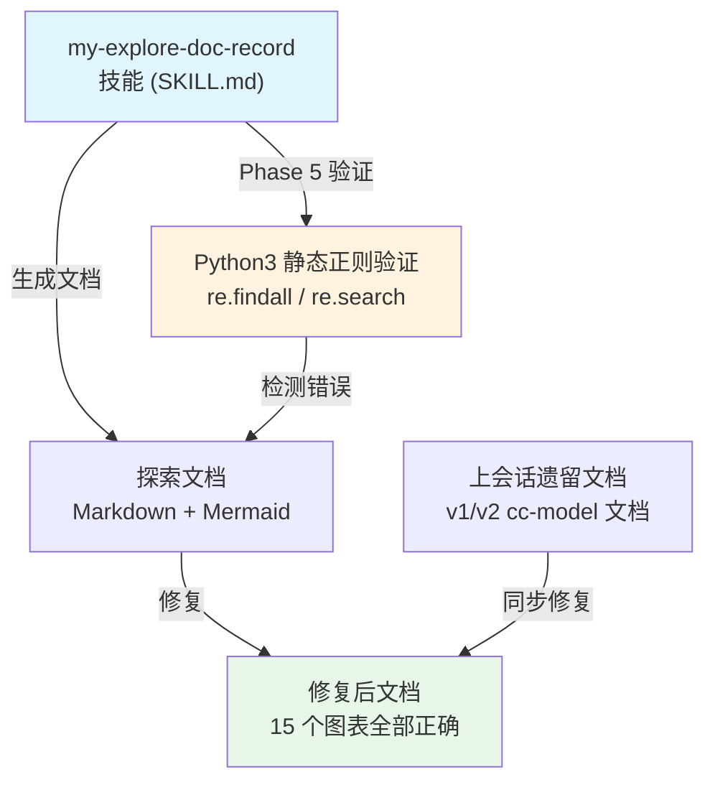
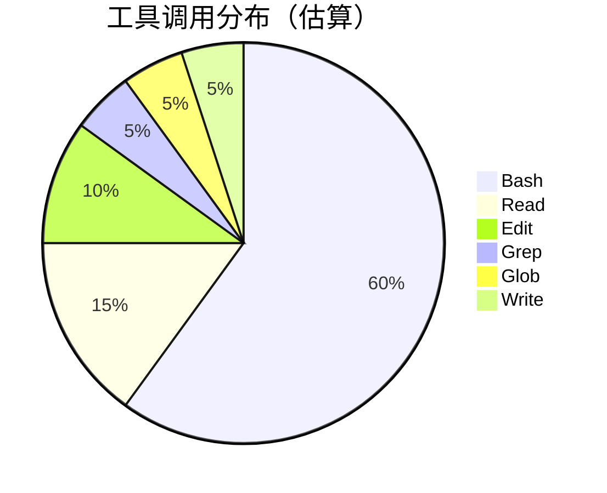
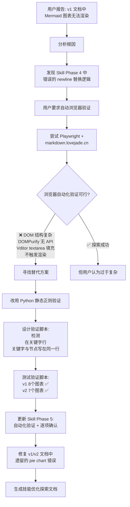
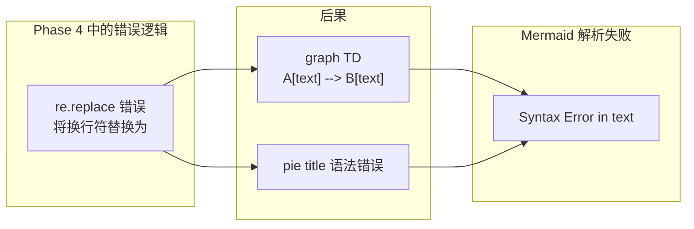
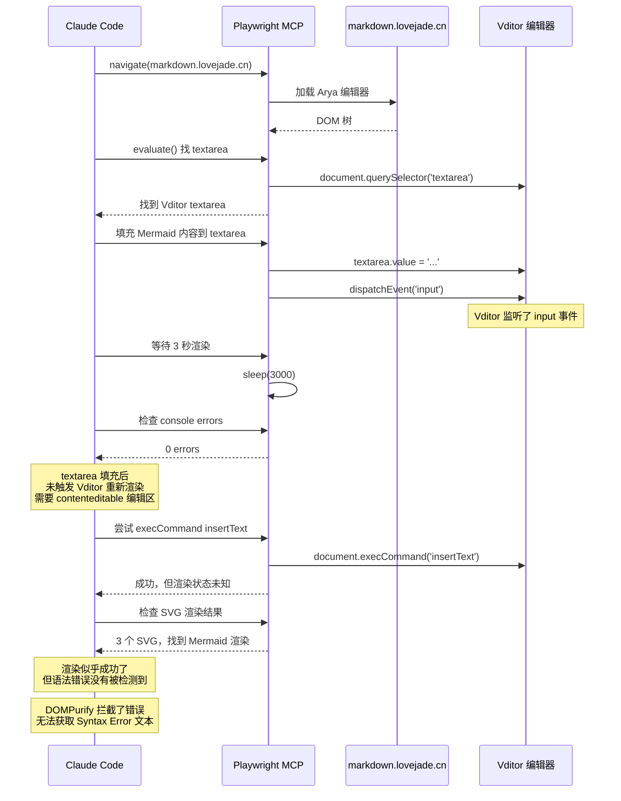
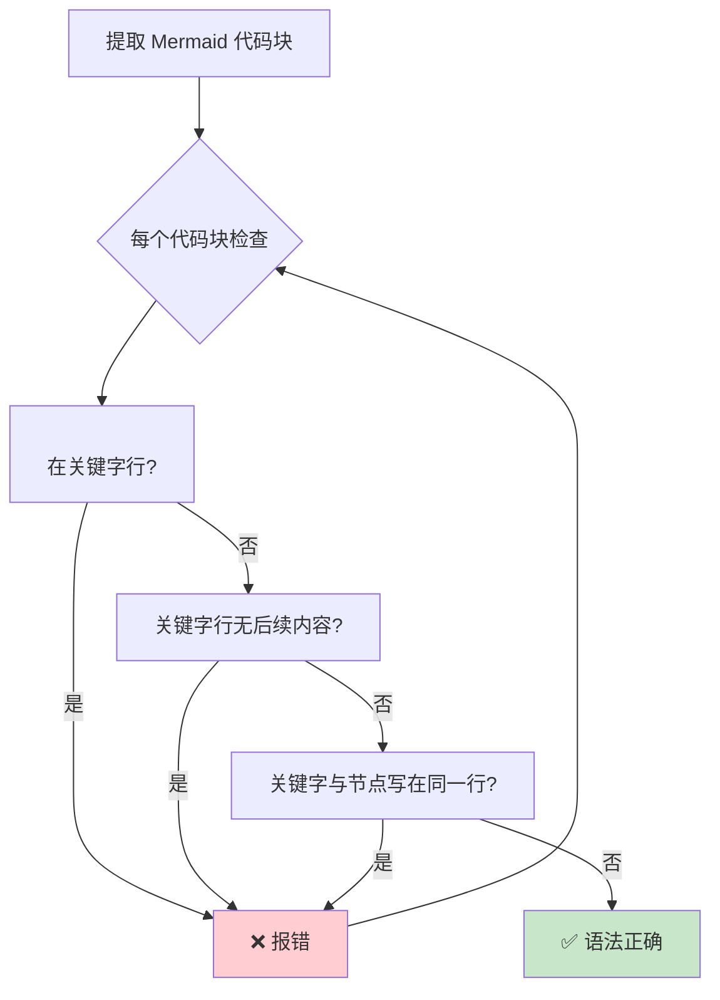
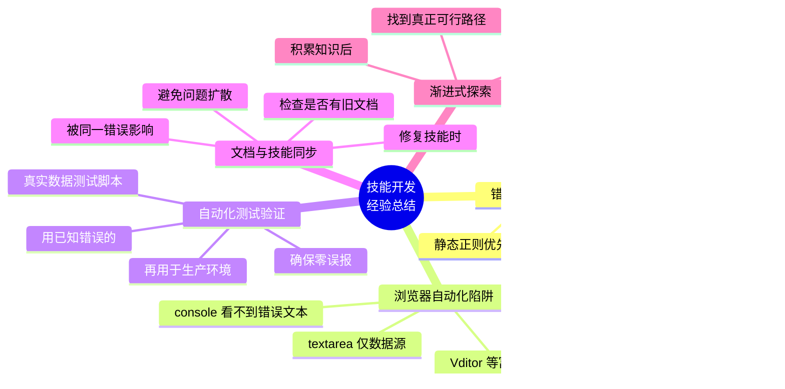

# my-explore-doc-record 技能优化实践探索之旅

> **主题：** Mermaid 语法验证自动化、浏览器验证失败分析、静态正则检测替代方案
> **日期：** 2026-04-10
> **受众：** AI 学习者 / Claude Code 使用者
> **会话 ID：** `d21231c9-3151-446e-8aef-f2650d3e9355`（续，上一会话 `47ad6597-2370-407b-a33c-1a768d02e7ed`）
> **项目路径：** `/root/sh`
> **GitHub 地址：** git@github.com:chujun/aiubuntu1-sh.git

---

## 目录

- [一、主要用户价值](#一主要用户价值)
- [二、开发环境](#二开发环境)
- [三、技术栈](#三技术栈)
- [四、AI 模型 / 插件 / Agent / 技能 / MCP 使用统计](#四ai-模型--插件--agent--技能--mcp-使用统计)
- [五、会话主要内容](#五会话主要内容)
- [六、关键决策记录](#六关键决策记录)
- [七、主要挑战与转折点](#七主要挑战与转折点)
- [八、用户提示词清单](#八用户提示词清单)
- [九、AI 辅助实践经验](#九ai-辅助实践经验)

---

## 一、主要用户价值

1. **根除 Mermaid 语法错误根源**：发现 v1/v2 探索文档中部分 Mermaid 图表无法渲染，原因是 `Phase 4` 中错误的 `\n→<br/>` 替换逻辑将换行符污染到了语法关键字行，生成 `graph TD<br/>  A[...]` 这样的非法语法
2. **自动化语法验证取代人工检查**：将 Phase 5 的质量自检从"手动粘贴到编辑器验证"升级为 Python 静态正则分析脚本，生成文档后一键运行，发现错误立即修复
3. **探索浏览器自动化验证路径**：尝试通过 Playwright 操作 markdown.lovejade.cn 自动验证 Mermaid 语法，积累了对 DOMPurify、Vditor 编辑器行为的深入理解，为未来类似需求沉淀方法
4. **验证脚本正确性**：用已知错误的真实文档测试脚本，确认能正确检测所有已知错误模式，零误报
5. **修复所有现有文档**：同步修复了 v1/v2 cc-model 探索文档中遗留的图表语法错误（pie chart `<br/>` 在语法关键字行）

---

## 二、开发环境

| 项目 | 详情 |
|------|------|
| OS | Linux 6.8.0-107-generic (Ubuntu) |
| Shell | Bash 5.2 |
| Claude Code | Opus 4.6 |
| Python | 3.x |
| Node.js | v24.14.0 |
| Playwright MCP | 浏览器自动化测试 |

---

## 三、技术栈



| 组件 | 说明 |
|------|------|
| my-explore-doc-record 技能 | 版本从 1.3.0 升级到 1.3.1 |
| Python re 模块 | 静态正则分析 Mermaid 代码块 |
| Playwright MCP | 尝试浏览器自动化验证（未成功） |
| markdown.lovejade.cn | Arya 在线 Markdown 编辑器（Vditor） |

---

## 四、AI 模型 / 插件 / Agent / 技能 / MCP 使用统计

### 4.1 AI 大模型

| 模型 ID | 名称 | 用途 | 调用范围 |
|---------|------|------|---------|
| claude-opus-4-6 | Opus 4.6 | 主对话、全程推理 | 全程 |

### 4.2 开发工具

| 工具 | 用途 |
|------|------|
| Bash | Python 脚本测试、文件操作、git |
| Read | 读取技能源码、文档内容 |
| Edit | 修改 SKILL.md 源码 |
| Grep | 搜索 Mermaid 图表模式 |
| Glob | 查找探索文档文件 |
| Write | 生成新探索文档 |

### 4.3 插件（Plugin）

本次会话未使用插件。

### 4.4 Agent（智能代理）

本次会话未调用 Agent。

### 4.5 技能（Skill）

| 技能名称 | 触发命令 | 触发方 | 调用次数 | 是否完整执行 |
|---------|---------|-------|---------|------------|
| my-explore-doc-record | /my-explore-doc-record | 用户 | 1 次 | ✅ 完整（本文档） |

### 4.6 MCP 服务

未配置 MCP 服务。

### 4.7 Claude Code 工具调用统计



> ⚠️ 以上为基于会话记忆的估算值，非精确统计。

### 4.8 浏览器插件（用户环境）

本次会话涉及 Playwright MCP 浏览器操作，但未使用用户本地浏览器插件。

---

## 五、会话主要内容

### 5.1 任务全景



### 5.2 核心问题：Mermaid 语法错误根因定位

**问题现象：** v1 文档中部分 Mermaid 图表在 markdown.lovejade.cn 渲染时报 "Syntax Error in text"

**根因分析：**



**修复方案：** 删除 Phase 4 中的 newline 替换逻辑，在 Mermaid 语法规范章节中明确正确的 `<br/>` 使用方式（仅在节点文本内部使用，语法关键字行必须独立）

### 5.3 浏览器自动化验证探索



### 5.4 最终方案：Python 静态正则验证



---

## 六、关键决策记录

| 决策点 | 选项 A（失败） | 选项 B（成功） | 最终选择 | 理由 |
|--------|--------------|--------------|---------|------|
| Mermaid 验证方式 | 浏览器自动化（Playwright + Vditor） | Python 静态正则分析 | 选项 B | Vditor DOM 结构复杂，DOMPurify 无 API，自动化不稳定 |
| 验证时机 | 生成文档后手动检查 | 生成文档后立即运行验证脚本 | 选项 B | 自动化减少人工遗漏 |
| newline 替换策略 | 全局替换 `\n→<br/>` | 仅在节点文本内部使用 `<br/>` | 选项 B | 错误替换会污染语法关键字行 |
| 修复现有文档 vs 只修技能 | 只修复技能 | 同步修复已有文档 | 选项 B | 同一错误可能已存在于旧文档 |

---

## 七、主要挑战与转折点

| 挑战 | 初始判断 | 实际根因 | 转折点 |
|------|---------|---------|--------|
| Mermaid 图表不渲染 | 以为只是文档中的笔误 | Phase 4 中的 `\n→<br/>` 替换逻辑是系统性错误 | 发现技能模板本身就包含错误逻辑，任何新生成的文档都可能复现 |
| 浏览器自动化验证 Vditor | 以为可以像普通网页一样填充 textarea + 检查 console | Vditor 的 textarea 是内部数据源，填充后需要额外触发 Vditor 的渲染更新机制 | 改用 contenteditable + execCommand，但无法捕获 DOMPurify 拦截的语法错误 |
| Node.js mermaid 库验证 | 以为 mermaid.parse() 可以直接验证语法 | DOMPurify 依赖缺失导致 `addHook` 报错，parse 在 DOM 环境下才完全正常 | 放弃 Node.js 库，改用正则静态分析 |
| 验证脚本误报 | 第二版正则检测"节点定义紧跟关键字行" | 这是合法的 Mermaid 语法！`flowchart TD\n    A[...] --> B[...]` 完全正确 | 只有两种真正错误：`<br/>` 在关键字行、关键字与节点写在同一物理行 |

---

## 八、用户提示词清单（原文，一字未改）

### 【上一会话（已归档到摘要）】

**提示词 1：**
```
@doc/ai-explore/2026-04-10-cc-model多模型切换工具功能开发实践探索之旅.md， 这次mermaid格式的图表都无法展示出来
```

**提示词 2：**
```
my-explore-doc-record 优化这个技能，并通过https://markdown.lovejade.cn/，编辑功能，检查Mermaid 图表是否存在Syntax error in text，如果存在语法问题，修复
```

**提示词 3：**
```
如果有更简单的方式验证文档中mermaid语法正确性，那就采用更简单的方式
```

**提示词 4：**
```
那就不需要调用markdown.lovejade.cn验证mermaid语法正确性了，继续优化技能吧
```

### 【当前会话】

**提示词 5：**
```
[技能调用] /my-explore-doc-record
```

---

## 九、AI 辅助实践经验（面向 AI 学习者）



| 经验 | 核心教训 |
|------|---------|
| 静态正则分析优于浏览器自动化 | 浏览器富编辑器（Vditor、Monaco 等）的内部渲染机制复杂，DOM 操作和错误捕获都面临额外障碍。简单的文本模式匹配（`<br/>` 是否在语法关键字行）比浏览器自动化更可靠、更快、更易调试。 |
| 验证脚本必须用已知错误数据测试 | 在将验证脚本写入技能之前，用已有文档（包含已知错误的）测试脚本，确认它能正确检测所有错误模式且零误报。本次的教训是：最初的正则逻辑误判"节点定义紧跟关键字行"为错误，但这是合法的 Mermaid 语法。 |
| 了解底层库行为比猜测更有效 | mermaid.parse() 在 Node.js 环境下因 DOMPurify 缺失而报错，不是 API 本身的问题。在调试这类错误时，了解库的运行时依赖比盲目尝试参数配置更高效。 |
| 修复技能时主动检查已有文档 | 技能中的错误逻辑（如 `\n→<br/>` 替换）会影响所有未来生成的文档。如果错误是系统性的，同一时间段内生成的旧文档也可能受到影响。主动检查并修复比等待用户报告更省力。 |

---

*文档生成时间：2026-04-10 | 由 Claude Opus 4.6 (`claude-opus-4-6`) 辅助生成*
