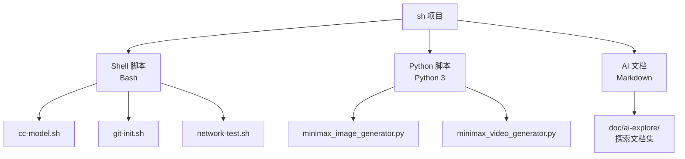
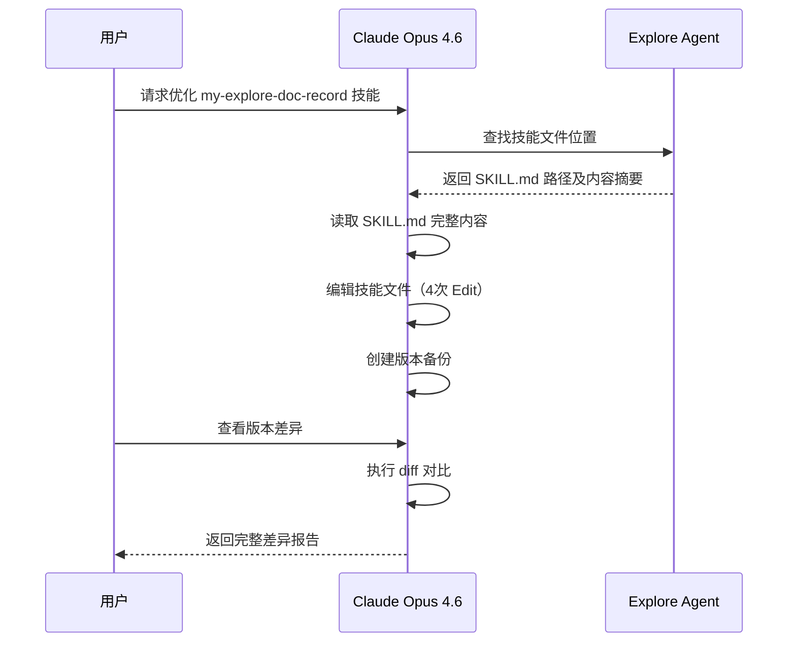
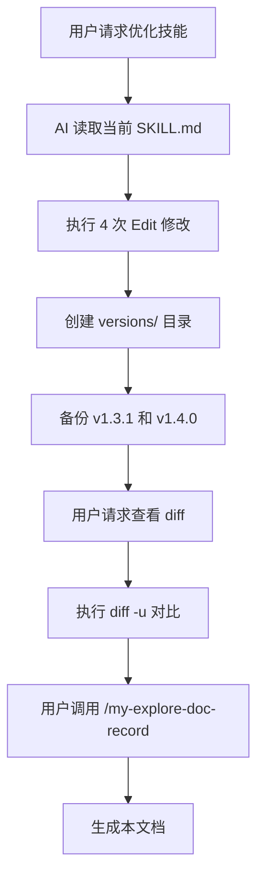
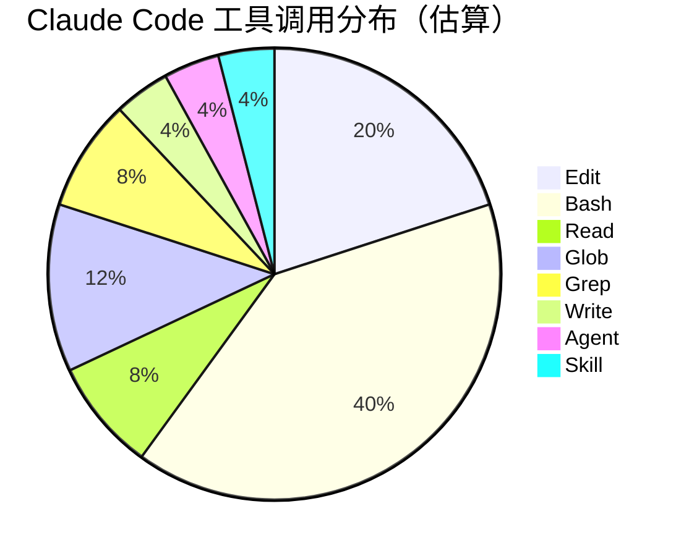
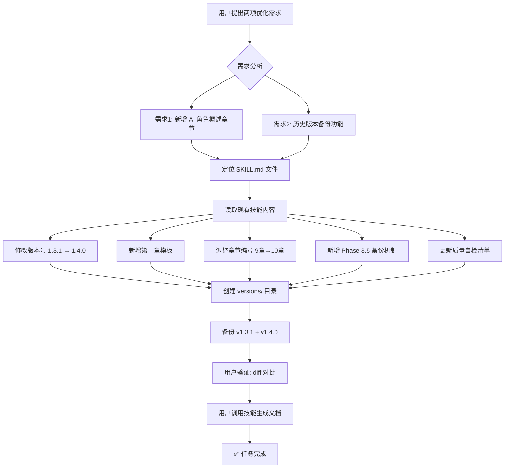
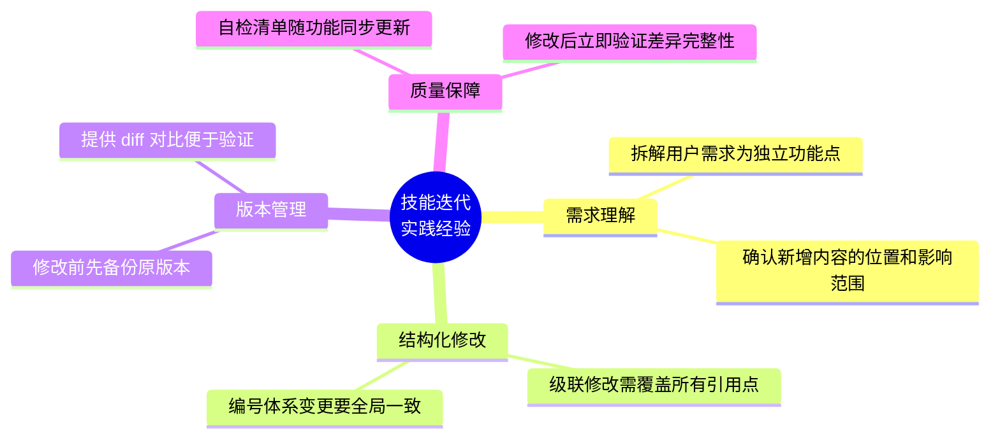

# my-explore-doc-record 技能优化 v2 实践探索之旅

> **主题：** 技能优化——新增 AI 角色概述章节 & 历史版本备份功能
> **日期：** 2026-04-11
> **受众：** AI 学习者 / Claude Code 使用者
> **会话 ID：** `151bcee9-d5b3-409e-b474-9c9e59d0a2dd`
> **项目路径：** `/root/sh`
> **GitHub 地址：** git@github.com:chujun/aiubuntu1-sh.git

---

## 目录

- [一、AI 角色与工作概述](#一ai-角色与工作概述)
- [二、主要用户价值](#二主要用户价值)
- [三、开发环境](#三开发环境)
- [四、技术栈](#四技术栈)
- [五、AI 模型 / 插件 / Agent / 技能 / MCP 使用统计](#五ai-模型--插件--agent--技能--mcp-使用统计)
- [六、会话主要内容](#六会话主要内容)
- [七、关键决策记录](#七关键决策记录)
- [八、主要挑战与转折点](#八主要挑战与转折点)
- [九、用户提示词清单](#九用户提示词清单)
- [十、AI 辅助实践经验](#十ai-辅助实践经验)

---

## 一、AI 角色与工作概述

> 本章总结 AI 在本次会话中承担的角色定位及具体工作内容，帮助读者快速了解 AI 的协作方式。

### 角色定位

| 角色 | 说明 |
|------|------|
| 技能架构师 | 设计技能文件的结构优化方案，规划新增章节和版本管理机制 |
| 开发者 | 直接修改 SKILL.md 技能定义文件，实现功能迭代 |
| 文档整理者 | 调整章节编号体系、更新质量自检清单、维护版本一致性 |
| 版本管理工程师 | 设计并实现历史版本备份机制，创建 versions 目录结构 |

### 具体工作

- 在技能输出文档模板中新增「AI 角色与工作概述」章节，放在第一章位置
- 设计并实现 SKILL.md 历史版本备份功能（Phase 3.5），支持按版本号自动归档
- 调整全部 10 章的编号体系（原 9 章整体后移一位）
- 更新章节生成规则和 Phase 5 质量自检清单，同步新编号
- 创建 v1.3.1 和 v1.4.0 两个历史版本备份文件
- 执行版本差异对比，验证变更完整性

---

## 二、主要用户价值

1. **AI 协作透明化**：新增的「AI 角色与工作概述」章节让读者一眼看清 AI 在每次会话中扮演了什么角色、做了什么工作，提升文档可读性
2. **技能版本可追溯**：历史版本备份功能让每次技能迭代都有据可查，支持 `diff` 对比任意两个版本的差异
3. **文档结构升级**：从 9 章扩展到 10 章，信息层次更清晰，角色定位前置有助于快速理解会话全貌
4. **质量保障增强**：自检清单新增第一章检查项，确保角色与工作概述不被遗漏

---

## 三、开发环境

| 项目 | 详情 |
|------|------|
| OS | Linux 6.8.0-107-generic |
| Shell | Bash |
| 平台 | linux (Docker/VM 环境) |
| AI 工具 | Claude Code CLI |
| 项目目录 | `/root/sh` |
| Git 分支 | `main` |

---

## 四、技术栈



| 层级 | 技术 | 用途 |
|------|------|------|
| 脚本层 | Bash Shell | 系统工具脚本（cc-model, git-init 等） |
| 脚本层 | Python 3 | AI API 对接脚本（MiniMax 文生图/视频） |
| 文档层 | Markdown + Mermaid | AI 实践探索文档 |
| 技能层 | Claude Code Skill | my-explore-doc-record 技能定义 |

---

## 五、AI 模型 / 插件 / Agent / 技能 / MCP 使用统计

### 5.1 AI 大模型

| 模型 ID | 名称 | 用途 | 调用范围 |
|---------|------|------|---------|
| `claude-opus-4-6` | Claude Opus 4.6 | 主对话，技能文件编辑与优化 | 全程 |

### 5.2 开发工具

| 工具 | 版本 | 用途 |
|------|------|------|
| Claude Code CLI | 最新版 | AI 辅助开发环境 |
| Git | 系统内置 | 版本管理 |
| diff | 系统内置 | 版本差异对比 |

### 5.3 插件（Plugin）

本次会话未使用浏览器插件。

### 5.4 Agent（智能代理）



| Agent 名称 | 触发方式 | 执行结果 | 失败原因 |
|-----------|---------|---------|---------|
| Explore Agent | Claude 后台调用 | ✅ 成功 | — |

### 5.5 技能（Skill）



| 技能名称 | 触发命令 | 触发方 | 调用次数 | 是否完整执行 |
|---------|---------|-------|---------|------------|
| my-explore-doc-record | `/my-explore-doc-record` | 用户 | 1 次 | ✅ 执行中（当前） |

### 5.6 MCP 服务

| MCP 服务 | 工具前缀 | 本次调用次数 | 说明 |
|---------|---------|------------|------|
| context7 | `mcp__context7__` | 0 | 本次无需查阅外部文档 |
| playwright | `mcp__playwright__` | 0 | 本次无需浏览器操作 |
| host-browser | — | 0 | 本次无需宿主浏览器交互 |

### 5.7 Claude Code 工具调用统计



> ⚠️ 以上数据为基于会话记忆的估算值，非精确统计。Edit 调用集中在 SKILL.md 的章节修改，Bash 调用主要用于元数据收集、版本备份和 diff 对比。

### 5.8 浏览器插件

本次会话未涉及浏览器插件。

---

## 六、会话主要内容

### 6.1 任务全景



### 6.2 核心任务 1：新增「AI 角色与工作概述」章节

**需求分析：**
用户希望在生成的探索文档中增加一个前置章节，总结 AI 在会话中承担的角色和具体工作。这解决了文档"只见树木不见森林"的问题——读者需要先了解 AI 做了什么，再深入技术细节。

**实现方案：**
- 在文档模板的目录和正文中，将新章节插入为「第一章」
- 原有 9 章（一~九）整体后移为（二~十）
- 设计角色定位表格（含常见角色参考列表）和具体工作条目
- 同步更新：章节生成规则、子节编号（4.x→5.x, 5.x→6.x）、质量自检清单

**影响范围：**
- 目录区：9 项 → 10 项
- 正文区：新增约 30 行模板内容
- 子节编号：4.1-4.8 → 5.1-5.8，5.1-5.3 → 6.1-6.3
- 规则引用：第六章→第七章，第七章→第八章

### 6.3 核心任务 2：历史版本备份功能

**需求分析：**
用户需要保留技能文件的历史版本，便于对比每次迭代的变动。

**实现方案：**
- 新增 Phase 3.5（位于 Phase 3 和 Phase 4 之间），每次执行技能时自动检查并备份
- 备份文件命名：`SKILL-v{版本号}.md`，存放在 `versions/` 子目录
- 通过读取 frontmatter 中的 `version` 字段判断是否需要新备份（去重逻辑）
- 提供 `diff` 命令示例，方便用户对比任意两个版本

**目录结构：**
```
skills/my-explore-doc-record/
├── SKILL.md                  # 当前版本 v1.4.0
└── versions/
    ├── SKILL-v1.3.1.md       # 优化前版本
    └── SKILL-v1.4.0.md       # 优化后版本
```

---

## 七、关键决策记录

| 决策点 | 选项 A | 选项 B | 最终选择 | 理由 |
|--------|--------|--------|---------|------|
| 新章节位置 | 放在文档末尾（附录） | 放在第一章（前置） | 第一章 | 用户明确要求"位置放在前面"，且角色概述适合作为文档入口 |
| 章节编号策略 | 新章节用 0 章（零、AI 角色概述） | 原章节整体后移 | 整体后移 | 零章不符合中文阅读习惯，整体后移虽改动大但更规范 |
| 版本备份触发时机 | 每次执行技能都备份 | 仅版本号变化时备份 | 版本号变化时 | 避免重复备份，减少磁盘占用 |
| 备份存储位置 | 项目 doc/ 目录 | 技能自身 versions/ 子目录 | versions/ 子目录 | 备份与技能文件同目录更内聚，不污染项目文档区 |
| 角色表格设计 | 固定角色列表 | 动态提炼 + 参考列表 | 动态 + 参考 | 每次会话角色不同，固定列表无法覆盖所有场景 |

---

## 八、主要挑战与转折点

| 挑战 | 初始判断 | 实际根因 | 转折点 |
|------|---------|---------|--------|
| 技能文件定位 | 在 `/root/.claude/skills/` 目录下 | 实际路径在 `/data/claude/claude_root/skills/` | 通过 Explore Agent 全盘搜索定位到正确路径 |
| 章节编号级联修改 | 只需改目录和正文标题 | 子节编号（4.x→5.x）、规则引用（第七章→第八章）、质量自检清单都需同步 | 逐步排查所有引用点，共执行 5 次 Edit 确保一致性 |
| MCP 配置读取 | `~/.claude/settings.json` 中有配置 | settings.json 中 mcpServers 为空，实际配置在 `~/.claude.json` | 增加备用配置路径读取，成功获取 context7/playwright/host-browser |

---

## 九、用户提示词清单（原文，一字未改）

### 【当前会话】

**提示词 1：**
```
my-explore-doc-record 对这个技能进行优化，1.输出markdonw文档中新增章节，位置放在前面，总结AI在会话中承担的角色分析和具体工作，不需要太具体，如果有多重角色和多重工作，都罗列出来，例如开发者、UI设计师、文档整理者，具
体工具:对接API，单元自测。2.技能具备历史版本完整备份功能，保留历史版本文件备份，这样子好对比变动情况
```

**提示词 2：**
```
查看当前版本和前一个版本的差异性
```

**提示词 3：** `[技能调用]`
```
/my-explore-doc-record
```

---

## 十、AI 辅助实践经验（面向 AI 学习者）



| 经验 | 核心教训 |
|------|---------|
| 技能文件修改前务必先备份 | 一旦改错无法回溯，版本备份是安全网 |
| 章节编号变更是级联操作 | 不仅是标题改编号，子节编号、规则引用、自检清单都要同步，遗漏任何一处都会导致不一致 |
| 用 Explore Agent 搜索比猜路径更可靠 | 技能文件可能不在预期路径（如 `/data/claude/` 而非 `~/.claude/`），全盘搜索避免盲目试错 |
| MCP 配置可能分散在多个文件 | `settings.json` 和 `.claude.json` 都可能有配置，需要都检查才能获得完整列表 |
| 新增功能后立即通过 diff 验证 | 让用户看到精确的变更内容，既是验证也是沟通，建立信任 |

---

*文档生成时间：2026-04-11 | 由 Claude Opus 4.6 (`claude-opus-4-6`) 辅助生成*
