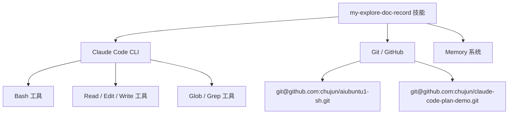
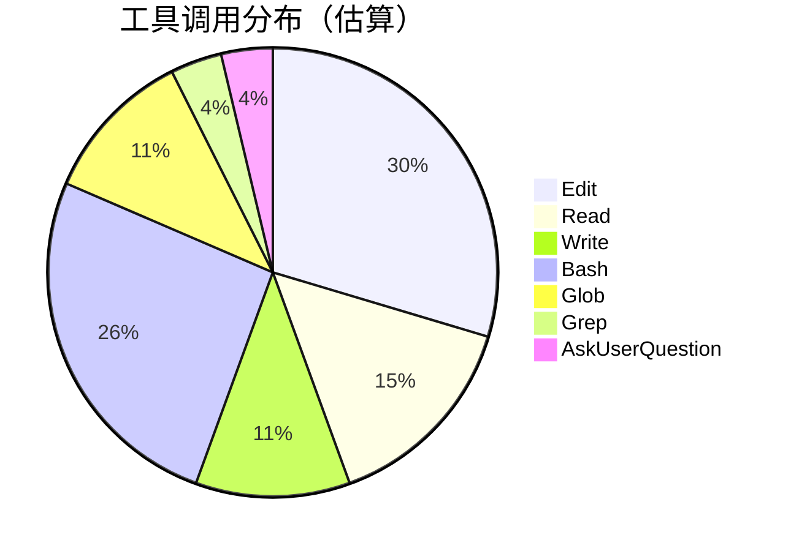
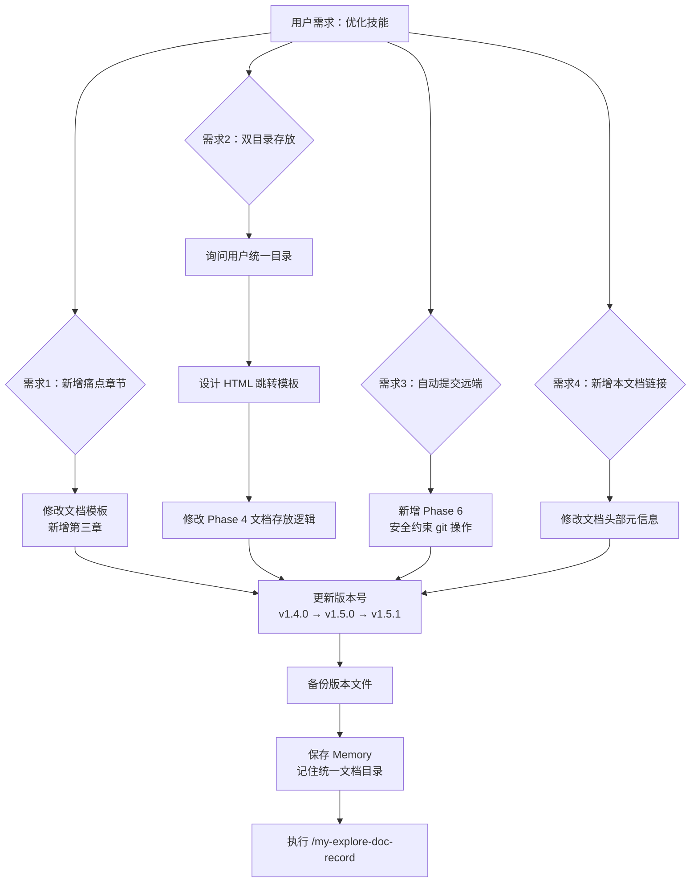
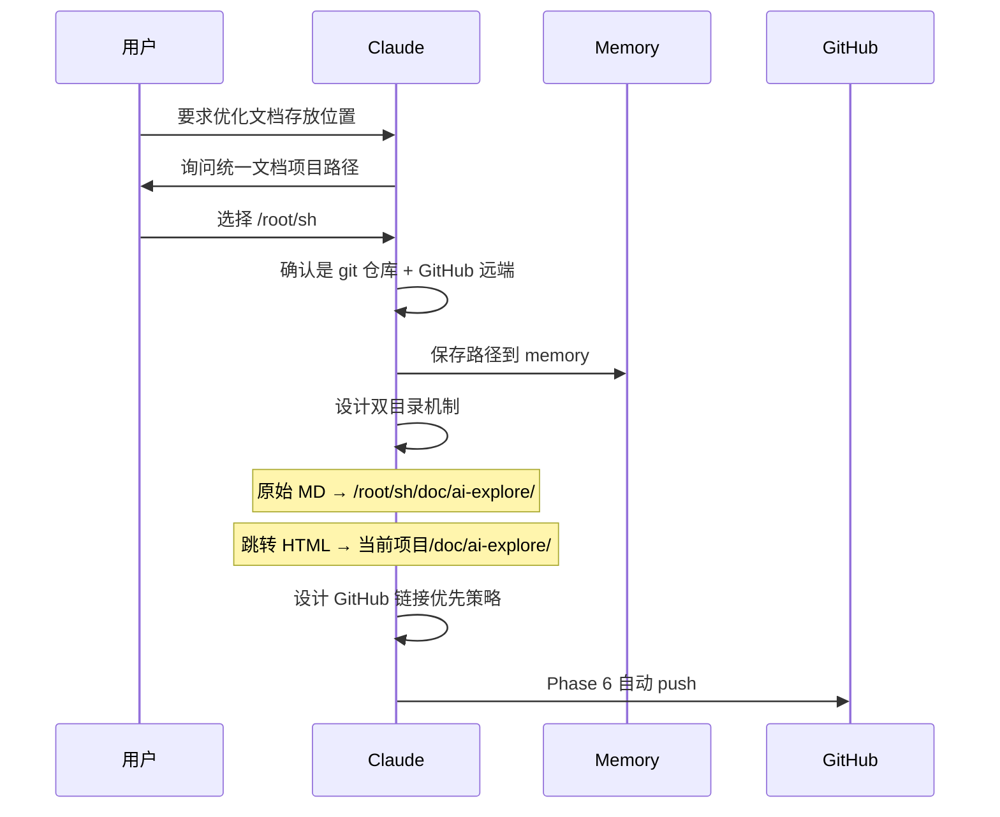
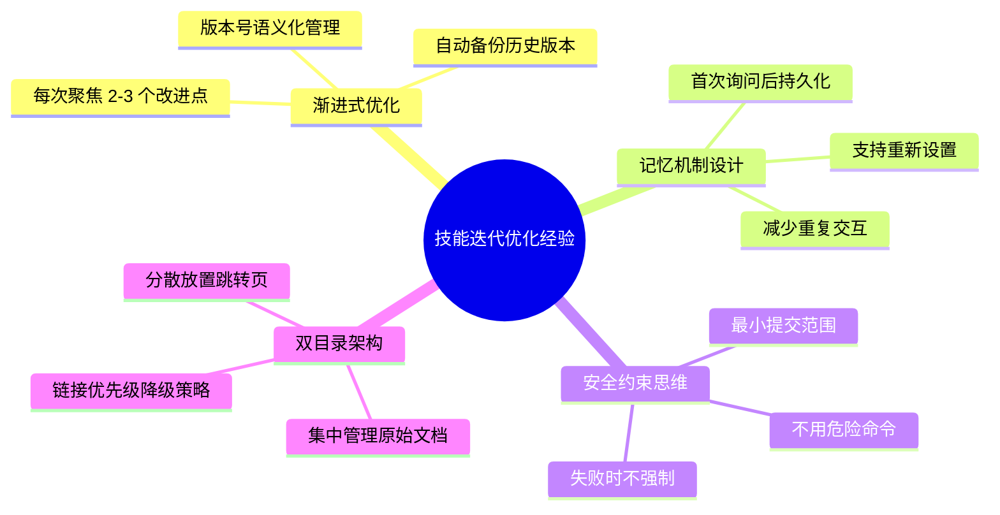

# my-explore-doc-record 技能优化 v3 实践探索之旅

> **主题：** my-explore-doc-record 技能迭代优化（新增痛点章节、双目录存放机制、自动提交远端）
> **日期：** 2026-04-11
> **受众：** AI 学习者 / Claude Code 使用者
> **会话 ID：** `-data-ai-claudecode-claude-code-plan-demo`
> **项目路径：** `/data/ai/claudecode/claude-code-plan-demo`
> **GitHub 地址：** https://github.com/chujun/claude-code-plan-demo
> **本文档链接：** https://github.com/chujun/aiubuntu1-sh/blob/main/doc/ai-explore/2026-04-11-my-explore-doc-record技能优化v3实践探索之旅.md
> **本文档链接（编码版）：** https://github.com/chujun/aiubuntu1-sh/blob/main/doc/ai-explore/2026-04-11-my-explore-doc-record%E6%8A%80%E8%83%BD%E4%BC%98%E5%8C%96v3%E5%AE%9E%E8%B7%B5%E6%8E%A2%E7%B4%A2%E4%B9%8B%E6%97%85.md

---

## 目录

- [一、AI 角色与工作概述](#一ai-角色与工作概述)
- [二、主要用户价值](#二主要用户价值)
- [三、解决的用户痛点](#三解决的用户痛点)
- [四、开发环境](#四开发环境)
- [五、技术栈](#五技术栈)
- [六、AI 模型 / 插件 / Agent / 技能 / MCP 使用统计](#六ai-模型--插件--agent--技能--mcp-使用统计)
- [七、会话主要内容](#七会话主要内容)
- [八、关键决策记录](#八关键决策记录)
- [九、主要挑战与转折点](#九主要挑战与转折点)
- [十、用户提示词清单](#十用户提示词清单)
- [十一、AI 辅助实践经验](#十一ai-辅助实践经验)

---

## 一、AI 角色与工作概述

> 本章总结 AI 在本次会话中承担的角色定位及具体工作内容，帮助读者快速了解 AI 的协作方式。

### 角色定位

| 角色 | 说明 |
|------|------|
| 重构工程师 | 对 my-explore-doc-record 技能文件进行结构化迭代优化 |
| 架构师 | 设计双目录文档存放机制（统一文档项目 + 当前项目跳转 HTML） |
| DevOps 工程师 | 设计并实现自动 git add/commit/push 流程（仅限 doc/ai-explore 目录） |
| 文档整理者 | 生成本次会话的实践探索文档 |

### 具体工作

- 在技能文档模板中新增「三、解决的用户痛点」章节，提供痛点表格模板和参考列表
- 设计并实现双目录文档存放策略：原始 Markdown → 统一文档项目，跳转 HTML → 当前项目
- 新增 Phase 6 自动提交逻辑，安全约束仅提交 doc/ai-explore/ 目录
- 新增「本文档链接」字段到文档头部元信息
- 记忆用户统一文档项目路径配置（/root/sh），避免重复询问
- 版本管理：v1.4.0 → v1.5.0 → v1.5.1，每次自动备份

---

## 二、主要用户价值

1. **技能持续进化** — 通过 3 轮迭代优化，技能从单一文件输出升级为完整的文档管理工作流
2. **一次配置永久生效** — 统一文档目录路径保存到 memory，后续执行无需重复确认
3. **文档可追溯** — 跳转 HTML + GitHub 链接，任何项目都能快速找到原始文档
4. **自动化发布** — 文档生成后自动 commit/push 到 GitHub，无需手动 git 操作
5. **用户视角补充** — 新增痛点章节，让文档更贴近用户实际感受

---

## 三、解决的用户痛点

> 本章从用户视角出发，罗列本次会话中 AI 协作实际解决的痛点问题。

| # | 用户痛点 | 简要描述 |
|---|---------|---------|
| 1 | 文档散落各项目难以统一管理 | 每个项目都有自己的 doc/ai-explore/，跨项目查找文档不方便 |
| 2 | 生成文档后需手动 git 操作 | 每次都要手动 add、commit、push，容易忘记提交 |
| 3 | 文档缺乏从用户角度的痛点分析 | 之前只有"用户价值"缺少"用户痛点"，读者难以产生共鸣 |
| 4 | 跨项目文档无法快速跳转 | 在 A 项目想查看 B 项目生成的文档，需要手动切换目录 |
| 5 | 反复被询问同一配置信息 | 每次执行技能都要回答"文档存放到哪里"，体验差 |
| 6 | 误提交其他正在编辑的文件 | 使用 git add . 可能把用户正在开发的文件一并提交 |

---

## 四、开发环境

| 项目 | 详情 |
|------|------|
| OS | Linux 6.8.0-107-generic |
| Shell | Bash |
| 平台 | Ubuntu Server (headless) |
| Python | 3.x |
| Git | 已配置 SSH |
| 工作目录 | `/data/ai/claudecode/claude-code-plan-demo` |

---

## 五、技术栈



| 层级 | 技术 | 用途 |
|------|------|------|
| 技能定义 | Markdown + YAML frontmatter | 技能结构化描述 |
| 版本管理 | Git + GitHub | 代码/文档版本控制 |
| 持久化 | Claude Code Memory | 记住用户配置 |
| 文档格式 | Markdown + Mermaid | 结构化 + 可视化 |

---

## 六、AI 模型 / 插件 / Agent / 技能 / MCP 使用统计

### 6.1 AI 大模型

| 模型 ID | 名称 | 用途 | 调用范围 |
|---------|------|------|---------|
| claude-opus-4-6 | Claude Opus 4.6 | 主对话 | 全程 |

### 6.2 开发工具

| 工具 | 用途 |
|------|------|
| Claude Code CLI | AI 辅助开发主界面 |
| Git | 版本控制 |

### 6.3 插件（Plugin）

本次会话未使用浏览器插件。

### 6.4 Agent（智能代理）

本次会话未调用 Agent。

### 6.5 技能（Skill）

| 技能名称 | 触发命令 | 触发方 | 调用次数 | 是否完整执行 |
|---------|---------|-------|---------|------------|
| my-explore-doc-record | /my-explore-doc-record | 用户 | 1 次 | ✅ 执行中（当前） |

### 6.6 MCP 服务

| MCP 服务 | 工具前缀 | 本次调用次数 | 说明 |
|---------|---------|------------|------|
| context7 | mcp__context7__ | 0 | 本次无需查阅外部库文档 |
| playwright | mcp__playwright__ | 0 | 本次无浏览器操作需求 |

### 6.7 Claude Code 工具调用统计



> ⚠️ 以上数据为基于会话记忆的估算值，非精确统计。Edit 调用较多是因为技能文件经历了多轮修改。

### 6.8 浏览器插件

本次会话未涉及浏览器环境。

---

## 七、会话主要内容

### 7.1 任务全景



### 7.2 核心任务 1：双目录文档存放机制设计



### 7.3 核心任务 2：安全约束的自动提交

自动提交的关键设计决策：
- **仅 `git add doc/ai-explore/`** — 不使用 `git add .` 或 `git add -A`
- **提交前检查** — `git diff --cached --quiet` 判断是否有实际变更
- **push 失败不强制** — 提示用户手动处理，不使用 `--force`
- **冲突检测** — 有 merge conflict 时跳过并告知

---

## 八、关键决策记录

| 决策点 | 选项 A | 选项 B | 最终选择 | 理由 |
|--------|--------|--------|---------|------|
| 统一文档目录选择 | /root/sh（已有 GitHub 仓库） | 新建专用仓库 | /root/sh | 用户已有习惯使用的仓库，避免增加管理负担 |
| 跳转方式 | 软链接 symlink | HTML 跳转页 | HTML 跳转页 | 跨平台兼容性更好，GitHub 上可直接渲染 |
| 链接优先级 | 始终用本地路径 | GitHub 优先降级本地 | GitHub 优先 | 便于分享和在线查看 |
| 提交范围 | 整个仓库 | 仅 doc/ai-explore/ | 仅 doc/ai-explore/ | 防止误提交用户正在编辑的文件 |
| 版本号策略 | 直接大版本跳 | 语义化版本递增 | 语义化递增 | v1.5.0（功能新增）→ v1.5.1（小改进） |

---

## 九、主要挑战与转折点

| 挑战 | 初始判断 | 实际根因 | 转折点 |
|------|---------|---------|--------|
| 章节编号需要全量更新 | 只需改模板 | 插入新章节后所有后续章节编号都要调整（目录、正文、checklist 引用） | 逐一修改 checklist 中的引用编号 |
| Memory 目录可能不存在 | 直接写文件即可 | 需要先确认 memory 目录是否已创建 | 系统说明该目录已存在，直接写入 |
| 同名文件已存在 | 新文件可以直接覆盖 | v2 文档已存在，需要追加版本号 | 检测到已有 v2 文件，本次命名为 v3 |

---

## 十、用户提示词清单（原文，一字未改）

### 【当前会话】

**提示词 1：**
```
my-explore-doc-record 继续对这个技能进行优化 1.补充生成markdown文档新章节，解决的用户痛点，从用户角度出发，位置放在主要用户价值后面，尽可能罗列出真实的用户痛点清单，对每个用户痛点做简要描述，不要太过详细。2.优化生成markdown文档存放位置，原始markdonw文档放到用户指定的统一文档项目目录下(推荐用户使用github仓库管理的目录),项目目录doc/ai-explore/，并尽可能记住用户首次设置的统一文档目录，便于不反复向用户确认；   当前项目目录doc/ai-explore/目录下放html页面，内容就是跳转链接，链接优先是github链接，没有则是本地链接  3.用户统一文档项目目录doc/ai-explore目录自动提交到远端，如果是github项目，则提供git add，commit、push操作，自动提交到github仓库，注意只提交doc/ai-explore目录内容，其他目录用户可能在编辑，不得提交和push
```

**提示词 2：**
```
my-explore-doc-record 继续优化该技能，新增 本文档链接，位置放在文档开头的"GitHub 地址"后面，如果文档有github链接，则填github链接，没有则填本地文档链接地址
```

**提示词 3：** `[技能调用]`
```
/my-explore-doc-record
```

---

## 十一、AI 辅助实践经验（面向 AI 学习者）



| 经验 | 核心教训 |
|------|---------|
| 技能优化应渐进式迭代 | 不要一次改太多，每轮 2-3 个点更容易验证和回滚 |
| Memory 适合存储用户偏好配置 | 路径、仓库地址等一次性确认的信息应持久化 |
| 自动化操作必须设置安全边界 | git 操作只限定目录范围，push 失败不强制，防止数据丢失 |
| 文档存放策略要考虑跨项目场景 | 单一项目内的文档方案无法满足多项目统一管理需求 |
| 版本备份是技能可维护性的保障 | 每次修改前自动备份，便于对比和回退 |

---

*文档生成时间：2026-04-11 | 由 Claude Opus 4.6 (`claude-opus-4-6`) 辅助生成*
