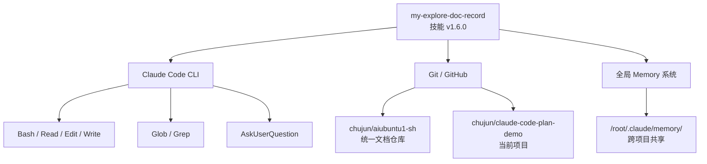
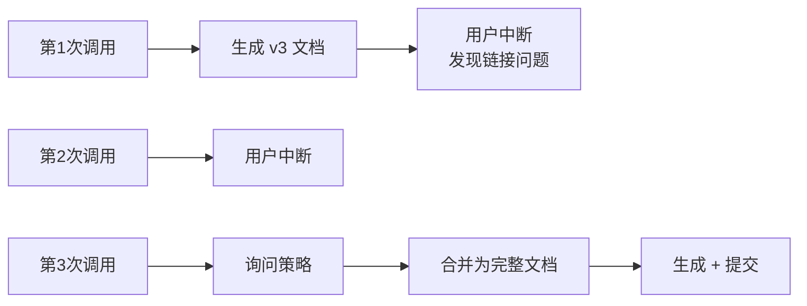
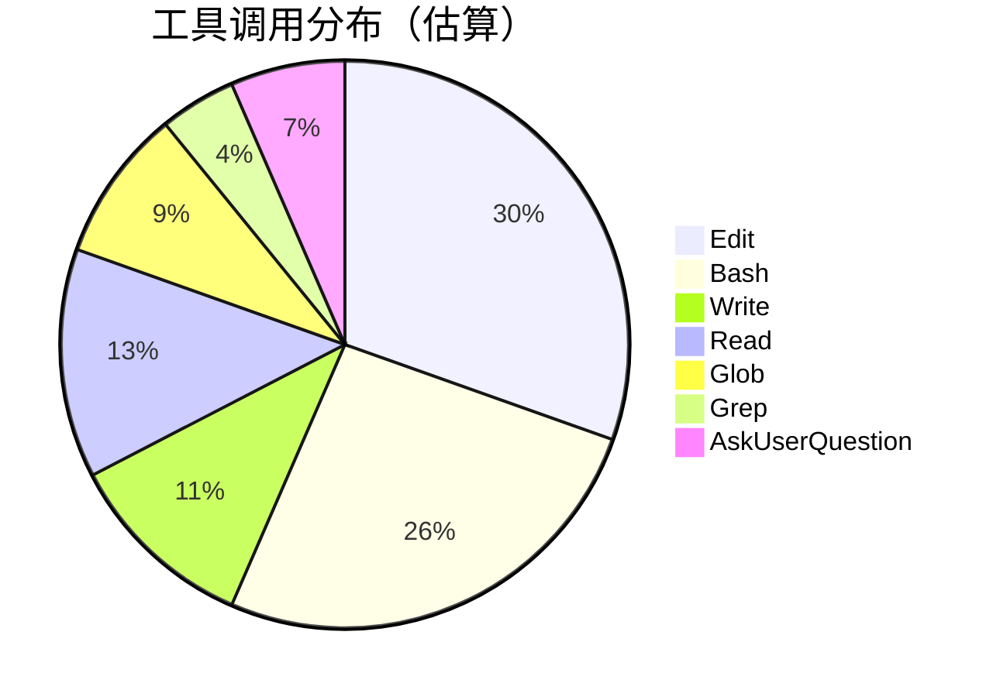
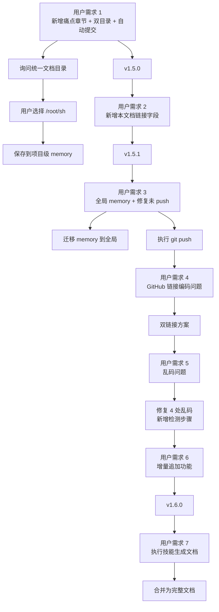
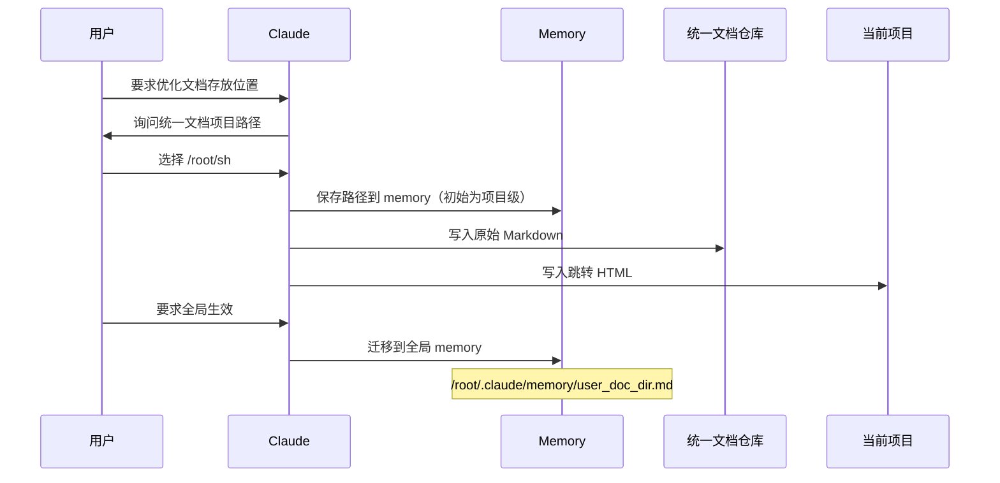
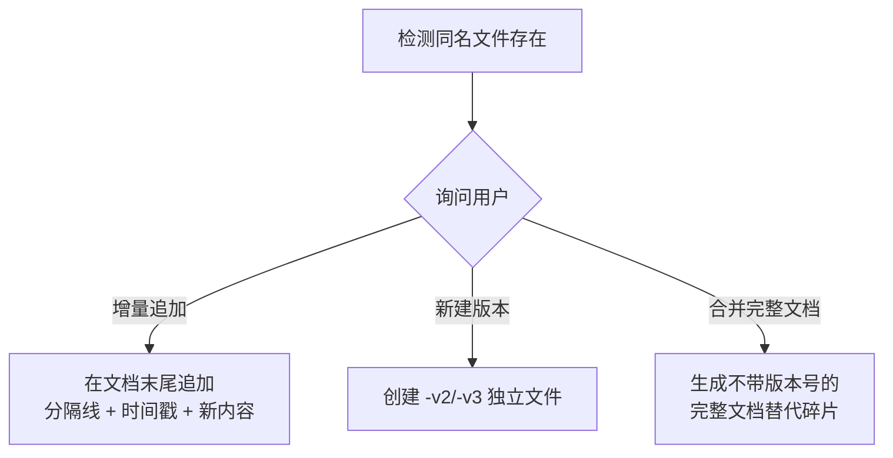
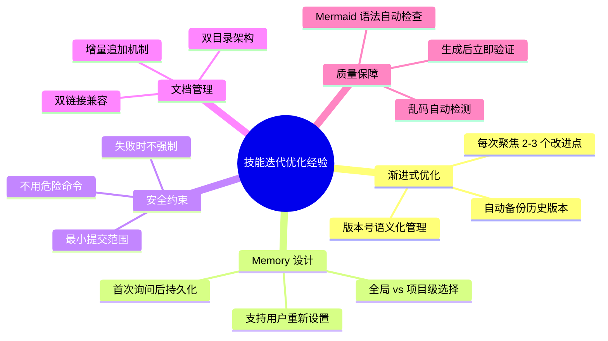

# my-explore-doc-record 技能优化实践探索之旅

> **主题：** my-explore-doc-record 技能迭代优化（v1.4.0 → v1.6.0，6 轮渐进式改进）
> **日期：** 2026-04-11
> **受众：** AI 学习者 / Claude Code 使用者
> **会话 ID：** `-data-ai-claudecode-claude-code-plan-demo`
> **项目路径：** `/data/ai/claudecode/claude-code-plan-demo`
> **GitHub 地址：** https://github.com/chujun/claude-code-plan-demo
> **本文档链接：** https://github.com/chujun/aiubuntu1-sh/blob/main/doc/ai-explore/2026-04-11-my-explore-doc-record技能优化实践探索之旅.md
> **本文档链接（编码版）：** https://github.com/chujun/aiubuntu1-sh/blob/main/doc/ai-explore/2026-04-11-my-explore-doc-record%E6%8A%80%E8%83%BD%E4%BC%98%E5%8C%96%E5%AE%9E%E8%B7%B5%E6%8E%A2%E7%B4%A2%E4%B9%8B%E6%97%85.md

---

## 目录

- [一、AI 角色与工作概述](#一ai-角色与工作概述)
- [二、主要用户价值](#二主要用户价值)
- [三、解决的用户痛点](#三解决的用户痛点)
- [四、开发环境](#四开发环境)
- [五、技术栈](#五技术栈)
- [六、AI 模型 / 插件 / Agent / 技能 / MCP 使用统计](#六ai-模型--插件--agent--技能--mcp-使用统计)
- [七、会话主要内容](#七会话主要内容)
- [八、关键决策记录](#八关键决策记录)
- [九、主要挑战与转折点](#九主要挑战与转折点)
- [十、用户提示词清单](#十用户提示词清单)
- [十一、AI 辅助实践经验](#十一ai-辅助实践经验)

---

## 一、AI 角色与工作概述

> 本章总结 AI 在本次会话中承担的角色定位及具体工作内容，帮助读者快速了解 AI 的协作方式。

### 角色定位

| 角色 | 说明 |
|------|------|
| 重构工程师 | 对 my-explore-doc-record 技能文件进行 6 轮结构化迭代优化 |
| 架构师 | 设计双目录文档存放机制、全局 memory 方案、增量追加机制 |
| DevOps 工程师 | 实现自动 git add/commit/push 流程，修复推送遗漏问题 |
| 调试专家 | 排查并修复文档乱码（UTF-8 截断）和 GitHub 链接编码问题 |
| 文档整理者 | 生成完整的实践探索文档 |

### 具体工作

- 新增"解决的用户痛点"章节，提供痛点表格模板和常见痛点参考列表
- 设计并实现双目录文档存放策略（统一文档项目存 Markdown + 当前项目存跳转 HTML）
- 新增 Phase 6 自动 git 提交逻辑，仅限 doc/ai-explore/ 目录
- 新增"本文档链接"字段（中文友好版 + URL 编码版双链接）
- 将 memory 从项目级迁移到全局级，实现跨项目共享配置
- 修复文档中 4 处 UTF-8 字符截断乱码
- 修复 GitHub 链接中文文件名未 URL 编码的兼容性问题
- 新增增量追加功能，同名文件支持追加而非必须创建新版本
- 在质量自检中新增乱码检测步骤

---

## 二、主要用户价值

1. **技能从单文件输出升级为完整文档管理工作流** — 涵盖生成、存储、跳转、提交全链路
2. **一次配置永久生效** — 统一文档目录路径保存到全局 memory，任何项目都可直接使用
3. **文档可追溯** — 跳转 HTML + GitHub 链接（双格式），任何环境都能快速找到原始文档
4. **自动化发布** — 文档生成后自动 commit/push 到 GitHub，杜绝忘记提交的问题
5. **增量追加避免文档碎片化** — 同一主题在一个文件中看到完整演进，不再 v1/v2/v3 散落
6. **质量保障自动化** — Mermaid 语法检查 + 乱码检测，生成即可用

---

## 三、解决的用户痛点

> 本章从用户视角出发，罗列本次会话中 AI 协作实际解决的痛点问题。

| # | 用户痛点 | 简要描述 |
|---|---------|---------|
| 1 | 文档散落各项目难以统一管理 | 每个项目独立的 doc/ai-explore/，跨项目查找不方便 |
| 2 | 生成文档后需手动 git 操作 | 每次都要手动 add/commit/push，容易忘记导致链接 404 |
| 3 | 文档缺乏用户痛点视角 | 只有"用户价值"缺少"用户痛点"，读者难以产生共鸣 |
| 4 | 跨项目文档无法快速跳转 | 在 A 项目想看 B 项目的文档，需要手动切换目录 |
| 5 | 反复被询问同一配置信息 | 每次执行技能都要回答存放目录，且换项目后又要重新配置 |
| 6 | 误提交其他正在编辑的文件 | 使用 git add . 可能把不相关的文件一并提交 |
| 7 | GitHub 链接在某些环境中断链 | 中文文件名未 URL 编码，在邮件/终端中无法正确打开 |
| 8 | 文档偶发乱码无法自动发现 | UTF-8 字符截断产生的乱码肉眼不易发现 |
| 9 | 同一主题多版本文件碎片化 | v1/v2/v3 散落，用户需要逐个打开对比才能看到完整演进 |

---

## 四、开发环境

| 项目 | 详情 |
|------|------|
| OS | Linux 6.8.0-107-generic (Ubuntu Server) |
| Shell | Bash |
| Python | 3.x |
| Git | 已配置 SSH，双仓库操作 |
| 工作目录 | `/data/ai/claudecode/claude-code-plan-demo` |
| 统一文档项目 | `/root/sh`（GitHub: chujun/aiubuntu1-sh） |

---

## 五、技术栈



| 层级 | 技术 | 用途 |
|------|------|------|
| 技能定义 | Markdown + YAML frontmatter | 技能结构化描述 |
| 版本管理 | Git + GitHub | 代码/文档版本控制 |
| 持久化 | Claude Code 全局 Memory | 记住用户配置（跨项目） |
| 文档格式 | Markdown + Mermaid | 结构化 + 可视化 |
| 链接兼容 | Python urllib.parse | URL 编码中文文件名 |

---

## 六、AI 模型 / 插件 / Agent / 技能 / MCP 使用统计

### 6.1 AI 大模型

| 模型 ID | 名称 | 用途 | 调用范围 |
|---------|------|------|---------|
| claude-opus-4-6 | Claude Opus 4.6 | 主对话 | 全程 |

### 6.2 开发工具

| 工具 | 用途 |
|------|------|
| Claude Code CLI | AI 辅助开发主界面 |
| Git | 版本控制，双仓库操作 |

### 6.3 插件（Plugin）

本次会话未使用浏览器插件。

### 6.4 Agent（智能代理）

本次会话未调用 Agent。

### 6.5 技能（Skill）

| 技能名称 | 触发命令 | 触发方 | 调用次数 | 是否完整执行 |
|---------|---------|-------|---------|------------|
| my-explore-doc-record | /my-explore-doc-record | 用户 | 3 次 | 第1次中断，第2次执行中断（用户打断），第3次完整执行 |



### 6.6 MCP 服务

| MCP 服务 | 工具前缀 | 本次调用次数 | 说明 |
|---------|---------|------------|------|
| context7 | mcp__context7__ | 0 | 本次无需查阅外部库文档 |
| playwright | mcp__playwright__ | 0 | 本次无浏览器操作需求 |

### 6.7 Claude Code 工具调用统计



> 以上数据为基于会话记忆的估算值，非精确统计。Edit 调用最多是因为技能文件经历了 6 轮修改（v1.4.0 到 v1.6.0）。

### 6.8 浏览器插件

本次会话未涉及浏览器环境。

---

## 七、会话主要内容

### 7.1 任务全景



### 7.2 核心任务 1：双目录文档存放机制



### 7.3 核心任务 2：链接兼容性修复

问题：GitHub 链接中文文件名在某些环境中断链。

解决方案：同时提供两个链接格式。

| 格式 | 示例 | 优势 |
|------|------|------|
| 中文友好版 | `.../技能优化实践探索之旅.md` | 阅读友好，一眼看出内容 |
| URL 编码版 | `.../%E6%8A%80%E8%83%BD...md` | 兼容性好，所有环境可用 |

### 7.4 核心任务 3：增量追加机制

解决 v1/v2/v3 文件碎片化问题：



---

## 八、关键决策记录

| 决策点 | 选项 A | 选项 B | 最终选择 | 理由 |
|--------|--------|--------|---------|------|
| 统一文档目录 | /root/sh（已有 GitHub 仓库） | 新建专用仓库 | /root/sh | 用户已有习惯使用的仓库 |
| 跳转方式 | 软链接 symlink | HTML 跳转页 | HTML | 跨平台兼容，GitHub 可渲染 |
| Memory 作用域 | 项目级 | 全局级 | 全局级 | 需要跨项目共享配置 |
| 链接格式 | 仅 URL 编码 | 中文 + 编码双链接 | 双链接 | 中文可读性好，编码兼容性好 |
| 提交范围 | 整个仓库 | 仅 doc/ai-explore/ | 仅 doc/ai-explore/ | 防止误提交用户编辑中的文件 |
| 同名文件策略 | 始终新版本 | 让用户选择 | 让用户选择 | 增量追加更便于统一查看 |

---

## 九、主要挑战与转折点

| 挑战 | 初始判断 | 实际根因 | 转折点 |
|------|---------|---------|--------|
| 文档未 push 到 GitHub | 以为 Phase 6 已执行 | 技能定义了流程但首次生成时未实际执行 push | 用户反馈链接 404，手动执行 push 修复 |
| GitHub 链接不可用 | 以为中文链接 GitHub 能自动处理 | 部分环境无法解析未编码的中文 URL | 改为双链接方案，同时满足可读性和兼容性 |
| 文档乱码 | 以为 Write 工具输出一定是完整 UTF-8 | 长文本输出时偶发多字节字符截断 | 新增 grep 乱码检测步骤到质量自检 |
| Memory 仅项目级生效 | 以为项目级 memory 够用 | 用户希望在所有项目中都能使用 | 迁移到 /root/.claude/memory/ 全局路径 |
| 多版本文件碎片化 | v2/v3 是合理的版本管理 | 用户觉得散落多文件不方便统一查看 | 新增增量追加选项和合并为完整文档选项 |

---

## 十、用户提示词清单（原文，一字未改）

### 【当前会话】

**提示词 1：**
```
my-explore-doc-record 继续对这个技能进行优化 1.补充生成markdown文档新章节，解决的用户痛点，从用户角度出发，位置放在主要用户价值后面，尽可能罗列出真实的用户痛点清单，对每个用户痛点做简要描述，不要太过详细。2.优化生成markdown文档存放位置，原始markdonw文档放到用户指定的统一文档项目目录下(推荐用户使用github仓库管理的目录),项目目录doc/ai-explore/，并尽可能记住用户首次设置的统一文档目录，便于不反复向用户确认；   当前项目目录doc/ai-explore/目录下放html页面，内容就是跳转链接，链接优先是github链接，没有则是本地链接  3.用户统一文档项目目录doc/ai-explore目录自动提交到远端，如果是github项目，则提供git add，commit、push操作，自动提交到github仓库，注意只提交doc/ai-explore目录内容，其他目录用户可能在编辑，不得提交和push
```

**提示词 2：**
```
my-explore-doc-record 继续优化该技能，新增 本文档链接，位置放在文档开头的"GitHub 地址"后面，如果文档有github链接，则填github链接，没有则填本地文档链接地址
```

**提示词 3：** `[技能调用]`
```
/my-explore-doc-record
```

**提示词 4：**
```
*统一文档项目路径的记忆机制：**
      284 +- 首次执行时询问用户统一文档项目路径，保存到 memory 中
      285 +- 后续执行时直接从 memory 读取，不再反复确认
      286 +- 用户可通过 `/my-explore-doc-record --set-doc-dir <path>` 重新设置,对这个memory机制进行介绍
```

**提示词 5：**
```
优化该技能 1.这个配置在所有项目中都生效（而不仅限于当前项目） 2.修复该问题，链接没有找到该文档，本地的统一文档项目仓库没有add、commit、push  https://github.com/chujun/aiubuntu1-sh/blob/main/doc/ai-explore/2026-04-11-my-explore-doc-record技能优化v3实践探索之旅.md
```

**提示词 6：**
```
现在的源端github地址是https://github.com/chujun/aiubuntu1-sh/blob/main/doc/ai-explore/2026-04-11-my-explore-doc-record%E6%8A%80%E8%83%BD%E4%BC%98%E5%8C%96v3%E5%AE%9E%E8%B7%B5%E6%8E%A2%E7%B4%A2%E4%B9%8B%E6%97%85.md，你是不是github链接拼接错误了
```

**提示词 7：**
```
继续优化该技能，关于github链接，中文对用户更好友，编码兼容性更好，两个github链接都保留吧
```

**提示词 8：**
```
为什么生成的markdown文档中有部分乱码问题
```

**提示词 9：**
```
继续优化该技能，生成的文档支持增量功能，在同一个会话中，如果判断出来文档名是同一个文件名，让用户决定新增一个版本的markdown文档，还是采用新增一个版本的markdown文档，现在同一个主题有v1，v2，v3,不方便用户统一查看
```

**提示词 10：** `[技能调用]`
```
/my-explore-doc-record
```

---

## 十一、AI 辅助实践经验（面向 AI 学习者）



| 经验 | 核心教训 |
|------|---------|
| 技能优化应渐进式迭代 | 不要一次改太多，每轮 2-3 个点更容易验证和回滚 |
| Memory 应根据使用范围选择作用域 | 项目级配置放项目 memory，跨项目配置放全局 memory |
| 自动化操作必须设置安全边界 | git 操作只限定目录范围，push 失败不强制 |
| 链接兼容性不能假设环境一致 | 中文 URL 在某些环境会断链，双格式是稳妥方案 |
| 长文本输出需要乱码检测 | UTF-8 多字节字符可能被截断，生成后必须 grep 检查 |
| 文档碎片化比单文件长更难管理 | 增量追加优于多版本散落，用户更希望在一处看到完整演进 |
| 定义流程 ≠ 执行流程 | 技能中写了 Phase 6 自动 push，但首次生成时被中断，必须验证实际执行 |

---

*文档生成时间：2026-04-11 | 由 Claude Opus 4.6 (`claude-opus-4-6`) 辅助生成*
