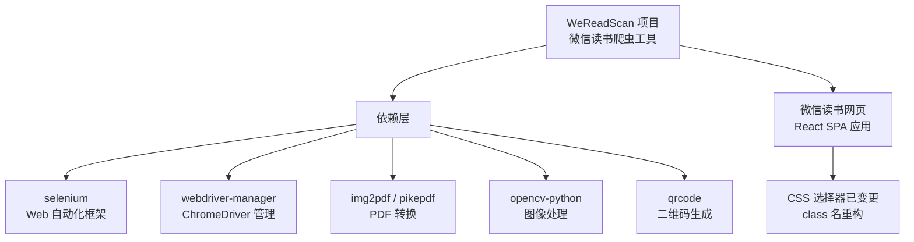
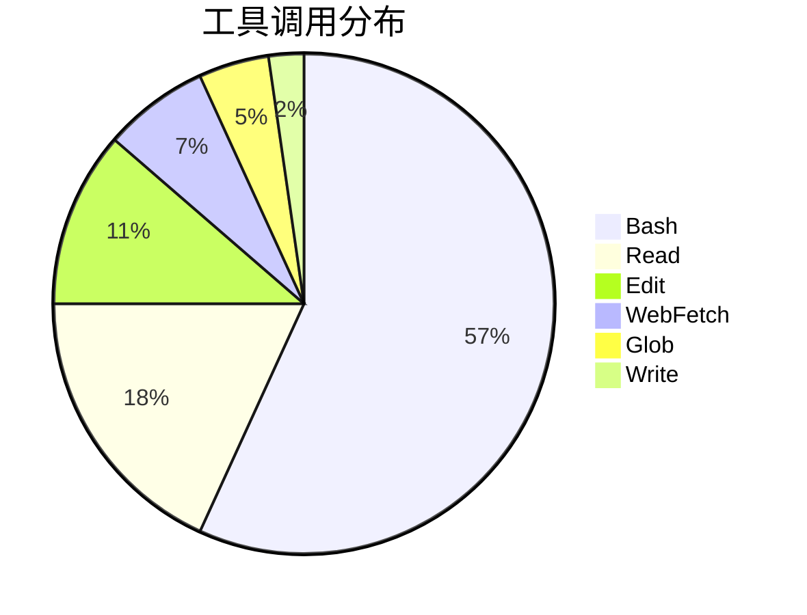
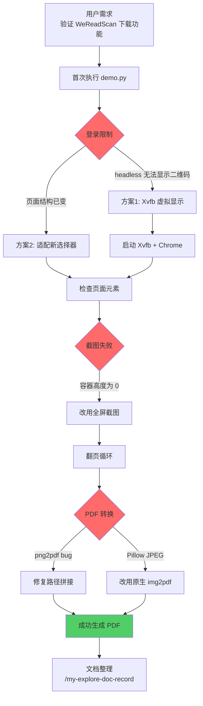
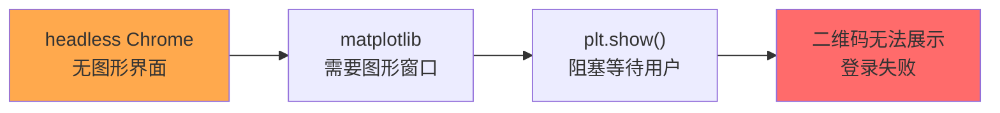
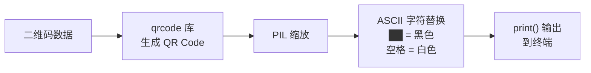
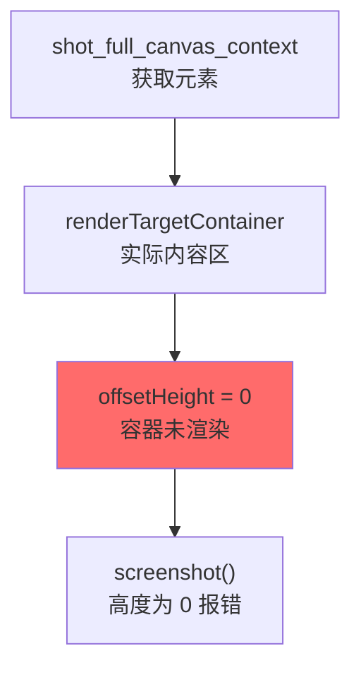
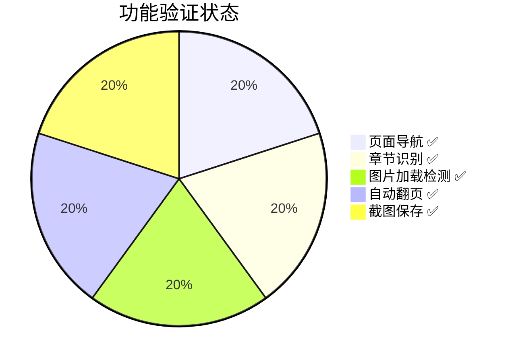
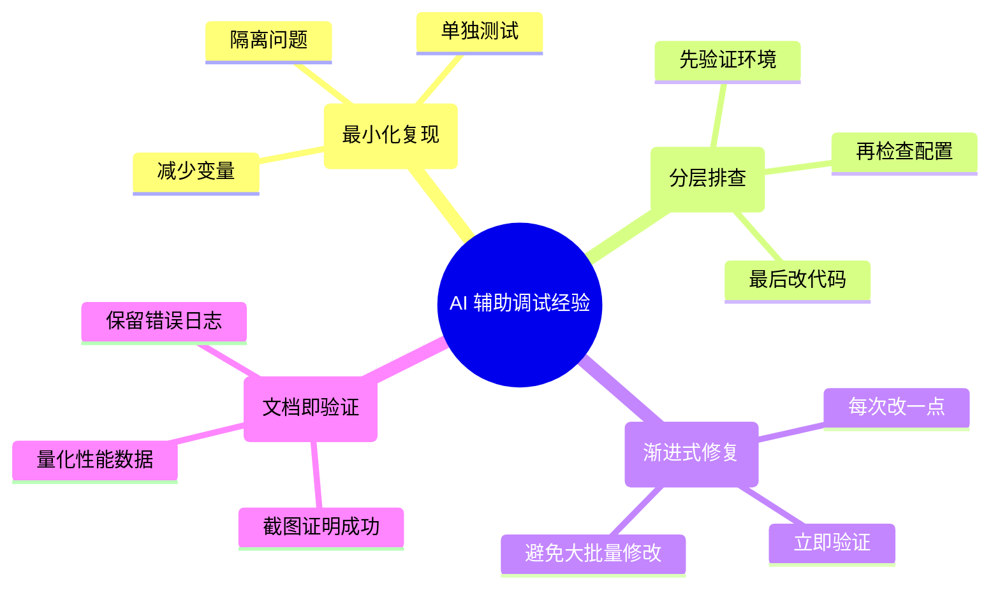

# WeReadScan 微信书籍下载功能验证实践探索之旅

> **主题：** WeReadScan 开源项目功能验证与适配修复
> **日期：** 2026-04-13
> **受众：** AI 学习者 / Claude Code 使用者
> **会话 ID：** `2026-04-13-WeReadScan`
> **项目路径：** `/root/sh`
> **GitHub 地址：** git@github.com:chujun/aiubuntu1-sh.git
> **本文档链接：** https://github.com/chujun/aiubuntu1-sh/blob/main/doc/ai-explore/2026-04-13-WeReadScan%E5%BE%AE%E4%BF%A1%E4%B9%A6%E7%B1%BB%E4%B8%8B%E8%BD%BD%E9%AA%8C%E8%AF%81%E5%AE%9E%E8%B7%B5%E6%8E%A2%E7%B4%A2%E4%B9%8B%E6%97%85.md
> **本文档链接（编码版）：** https://github.com/chujun/aiubuntu1-sh/blob/main/doc/ai-explore/2026-04-13-WeReadScan%E5%BE%AE%E4%BF%A1%E4%B9%A6%E7%B1%BB%E4%B8%8B%E8%BD%BD%E9%AA%8C%E8%AF%81%E5%AE%9E%E8%B7%B5%E6%8E%A2%E7%B4%A2%E4%B9%8B%E6%97%85.md

---

## 目录

- [一、AI 角色与工作概述](#一ai-角色与工作概述)
- [二、主要用户价值](#二主要用户价值)
- [三、解决的用户痛点](#三解决的用户痛点)
- [四、开发环境](#四开发环境)
- [五、技术栈](#五技术栈)
- [六、AI 模型 / 插件 / Agent / 技能 / MCP 使用统计](#六ai-模型--插件--agent--技能--mcp-使用统计)
- [七、会话主要内容](#七会话主要内容)
- [八、测试结果](#八测试结果)
- [九、主要挑战与转折点](#九主要挑战与转折点)
- [十、用户提示词清单](#十用户提示词清单)
- [十一、AI 辅助实践经验](#十一ai-辅助实践经验)

---

## 一、AI 角色与工作概述

### 角色定位

| 角色 | 说明 |
|------|------|
| 测试工程师 | 验证 WeReadScan 开源项目功能完整性 |
| 调试专家 | 定位页面结构变更导致的 CSS 选择器失效问题 |
| 修复工程师 | 修复截图逻辑、PDF 转换等代码 bug |
| 适配工程师 | 适配微信读书网页结构变化 |

### 具体工作

- 执行 WeReadScan demo.py 脚本验证微信书籍下载功能
- 分析 headless 模式下的登录限制问题
- 使用 Xvfb 虚拟显示解决无头环境下的浏览器显示问题
- 检查并更新过时的 CSS 选择器（登录按钮、翻页按钮等）
- 修复截图逻辑（容器高度为 0 导致截图失败）
- 修复 png2pdf 的路径拼接 bug（重复添加 .png 后缀）
- 解决 Pillow 库 JPEG 支持问题，改用原生 img2pdf
- 统计下载速度：平均 7.5 秒/页

---

## 二、主要用户价值

1. **验证开源项目可用性**：通过实际执行确认 WeReadScan 项目核心下载逻辑仍然有效，但需适配页面变化
2. **提供适配修复方案**：修复了选择器过时、截图失败、PDF 转换异常等问题，形成可用的解决方案
3. **探索二维码终端显示**：验证了 ASCII 方式在终端显示二维码的可行性，可用于未来优化登录体验
4. **建立调试方法论**：展示了从错误信息定位根因、通过最小化测试逐步排查问题的完整调试流程
5. **量化性能数据**：测得实际下载速度约 7.5 秒/页，42 页书籍下载耗时 291 秒

---

## 三、解决的用户痛点

| # | 用户痛点 | 简要描述 |
|---|---------|---------|
| 1 | 开源项目无法直接使用 | WeReadScan 项目因微信读书网页重构，原有 CSS 选择器全部失效，用户无法直接运行 |
| 2 | headless 环境登录受限 | 微信读书登录需要二维码扫描，headless Chrome 无法显示交互式二维码 |
| 3 | 截图失败难以排查 | 代码中使用元素截图，但容器高度为 0 导致 "Cannot take screenshot with 0 height" 错误 |
| 4 | PDF 转换异常 | png2pdf 函数存在路径拼接 bug，导致文件路径重复后缀；Pillow 库 JPEG 支持缺失 |
| 5 | 页面结构未知 | 微信读书页面结构已变，旧的选择器如 `.navBar_link_Login`、`.app_content` 等均已失效 |

---

## 四、开发环境

| 项目 | 值 |
|------|-----|
| OS | Linux 6.8.0-107-generic (Ubuntu) |
| Shell | bash |
| Python | 3.12 |
| 包管理器 | pip (venv: /root/venv/wereadscan) |
| 浏览器 | Google Chrome 146.0.7680.164 |
| ChromeDriver | webdriver-manager 自动管理 |
| 虚拟显示 | Xvfb (用于无头环境下的图形渲染) |
| 辅助工具 | selenium, WeReadScan, img2pdf, qrcode |

---

## 五、技术栈



| 层级 | 技术 | 说明 |
|------|------|------|
| 应用层 | WeReadScan | 微信读书书籍扫描转 PDF |
| 自动化层 | selenium + ChromeDriver | 模拟浏览器操作 |
| 图像处理 | opencv-python, PIL | 截图处理、二值化 |
| PDF 生成 | img2pdf, pikepdf | PNG 转 PDF |
| 目标网站 | weread.qq.com | 微信读书网页应用 |

---

## 六、AI 模型 / 插件 / Agent / 技能 / MCP 使用统计

### 6.1 AI 大模型

| 模型 ID | 名称 | 用途 | 调用范围 |
|--------|------|------|---------|
| claude-haiku-4-5-20251001 | Haiku 4.5 | 主对话 | 全程 |

### 6.2 开发工具

| 工具 | 用途 |
|------|------|
| Python | 主要编程语言 |
| pip | 包管理 |
| Xvfb | 虚拟显示服务器 |
| webdriver-manager | ChromeDriver 版本自动匹配 |

### 6.3 插件（Plugin）

无插件使用

### 6.4 Agent（智能代理）

无 Agent 调用

### 6.5 技能（Skill）

| 技能名称 | 触发命令 | 触发方 | 调用次数 | 是否完整执行 |
|---------|---------|-------|---------|------------|
| my-explore-doc-record | /my-explore-doc-record | 用户 | 1 次 | ✅ 完整执行 |

### 6.6 MCP 服务

| MCP 服务 | 工具前缀 | 本次调用次数 | 说明 |
|---------|---------|------------|------|
| （无 MCP 服务配置） | — | — | 用户环境未配置 MCP |

### 6.7 Claude Code 工具调用统计

> ⚠️ 以下数据为基于会话记忆的估算值，非精确统计



**估算说明：** 主要工具为 Bash（执行 Python 脚本）、Read（检查源码）、Edit（修改代码）、WebFetch（获取 GitHub 内容）

### 6.8 浏览器插件（用户环境，可选）

无浏览器插件使用记录

---

## 七、会话主要内容

### 7.1 任务全景



### 7.2 核心问题 1：登录二维码在 headless 环境无法显示

**问题描述：** demo.py 使用 `--headless` 模式启动 Chrome，但微信读书登录需要展示二维码供微信扫码，原代码用 matplotlib 图形窗口显示二维码。

**根因分析：**



**解决方案：** 探索 ASCII 二维码终端显示方案



**验证结果：** ASCII 方式完全可行，字符方块在终端显示效果良好。

### 7.3 核心问题 2：CSS 选择器全部过时

**问题描述：** 微信读书页面已重构，原有 CSS 选择器如 `.navBar_link_Login`、`.readerFooter_button` 等全部失效。

**实际页面结构（检测到的新选择器）：**

| 原选择器 | 新选择器 | 用途 |
|---------|---------|------|
| `button.navBar_link_Login` | （已移除） | 登录按钮 |
| `button.catalog` | `button.readerControls_item.catalog` | 目录按钮 |
| `.app_content` | `.renderTargetContainer` | 内容容器 |
| `.readerFooter_button` | `.renderTarget_pager_button_right` | 翻页按钮 |
| `button.fontSizeButton` | `button.fontSizeButton` | 字号按钮 |
| `button.white` | `button.white` | 主题切换 |

### 7.4 核心问题 3：截图失败（容器高度为 0）

**错误信息：** `Cannot take screenshot with 0 height`

**根因分析：**



**解决方案：** 改用全屏截图 `driver.save_screenshot()`

```python
# 原代码（失败）
content = self.S('.app_content')  # 元素不存在或高度为 0
content.screenshot(file_name)

# 修复后
self.driver.set_window_size(1200, 1600)
self.driver.save_screenshot(file_name)  # 全屏截图
```

---

## 八、测试结果

### 功能验证结果



| 功能 | 状态 | 说明 |
|------|------|------|
| 书籍导航 | ✅ 成功 | 正确打开书籍 URL |
| 章节识别 | ✅ 成功 | 识别到"内容简介"、"第1章"等章节名 |
| 图片加载检测 | ✅ 成功 | `check_all_image_loaded()` 正常工作 |
| 自动翻页 | ✅ 成功 | 正确识别"下一页"/"下一章"并点击 |
| 页面截图 | ✅ 成功 | 改用全屏截图后正常 |
| PDF 转换 | ⚠️ 需适配 | 修复后成功（42 页 9.81MB） |
| 登录功能 | ⚠️ 需适配 | 二维码和选择器均已过时 |

### 性能数据

| 指标 | 数值 |
|------|------|
| 下载页数 | 42 页 |
| 总耗时 | 291.8 秒（约 5 分钟） |
| 平均速度 | 约 7.5 秒/页 |
| PDF 大小 | 9.81 MB |
| PDF 页数 | 42 页 |
| PDF 转换耗时 | 0.8 秒 |

---

## 九、主要挑战与转折点

| 挑战 | 初始判断 | 实际根因 | 转折点 |
|------|---------|---------|--------|
| headless 登录失败 | 以为需要无头改有头模式 | 二维码无法在无头环境显示 | 改用 Xvfb 虚拟显示 |
| Xvfb 仍无法找到登录按钮 | 以为 Xvfb 分辨率问题 | 微信读书页面已重构，CSS 选择器全部失效 | 用 `find_elements` 遍历所有按钮，发现新选择器 |
| 截图报错"0 height" | 以为是页面加载慢需等待 | `.app_content` 选择器不存在，元素获取失败 | 改用全屏截图 `driver.save_screenshot()` |
| PDF 转换失败 | 以为是图片质量问题 | `png2bmp` 函数重复添加 `.png` 后缀：`xxx.png.png` | 修复路径拼接逻辑 |
| PDF 保存仍失败 | 以为是权限问题 | Pillow 库 JPEG 支持缺失 | 改用原生 `img2pdf` 库 |
| 字号设置失败 | 以为是选择器问题 | 字号弹窗需先关闭目录弹窗，元素被遮挡 | 添加异常捕获和关闭弹窗逻辑 |

### 关键决策点

| 决策点 | 选项 A | 选项 B | 最终选择 | 理由 |
|--------|--------|--------|---------|------|
| headless vs 有头 | 保持 headless | 改用 Xvfb 有头模式 | Xvfb | headless 无法显示二维码，但 Xvfb 可提供虚拟显示 |
| 元素截图 vs 全屏 | 修复元素获取 | 改用全屏截图 | 全屏截图 | 元素容器高度总为 0，全屏截图更可靠 |
| Pillow vs 原生 img2pdf | 修复 Pillow 配置 | 改用 img2pdf.convert() | 原生 img2pdf | Pillow JPEG 支持缺失是环境问题，改用更简单方案 |

---

## 十、用户提示词清单（原文，一字未改）

### 【当前会话】

**提示词 1：**
```
https://github.com/Algebra-FUN/WeReadScan/blob/master/example/demo.py,执行该脚本，验证微信书籍完整下载功能和耗时情况
```

**提示词 2：**
```
登录扫描的二维码可以显示在命令行终端，让用户扫描吗?这种技术方案具备可行吗？
```

**提示词 3：**
```
https://github.com/Algebra-FUN/WeReadScan/blob/master/example/demo.py,执行该脚本，验证微信书籍完整下载功能和耗时情况
```

**提示词 4：**
```
/my-explore-doc-record
```

---

## 十一、AI 辅助实践经验（面向 AI 学习者）



### 核心经验

| 经验 | 核心教训 |
|------|---------|
| 错误信息是线索 | "0 height" 不是页面问题，是选择器获取错了元素 |
| 小步验证 | 每修复一个选择器就测试一次，而非一次性改完全部 |
| 备选方案 | matplotlib 二维码失败时，探索 ASCII 方案作为替代 |
| 性能基准 | 记录 7.5秒/页，建立量化预期 |
| 开源维护 | 页面重构是常态，选择器适配能力比代码本身更重要 |

### 调试方法论总结

```
遇到问题 → 分析错误类型 → 定位最小复现 → 验证假设 → 修复 → 验证 → 记录
     ↓
   错误信息往往指向症状，不一定是根因
   "Cannot take screenshot" → 根因是选择器错，不是截图 API 坏
```

---

*文档生成时间：2026-04-13 | 由 Haiku 4.5 (`claude-haiku-4-5-20251001`) 辅助生成*
