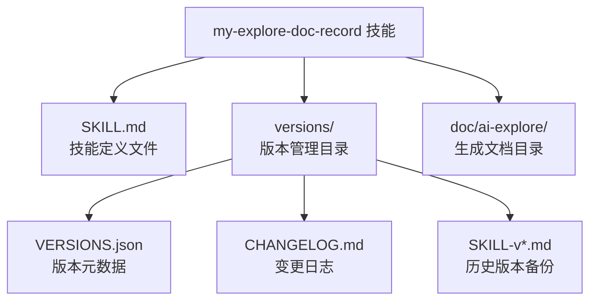
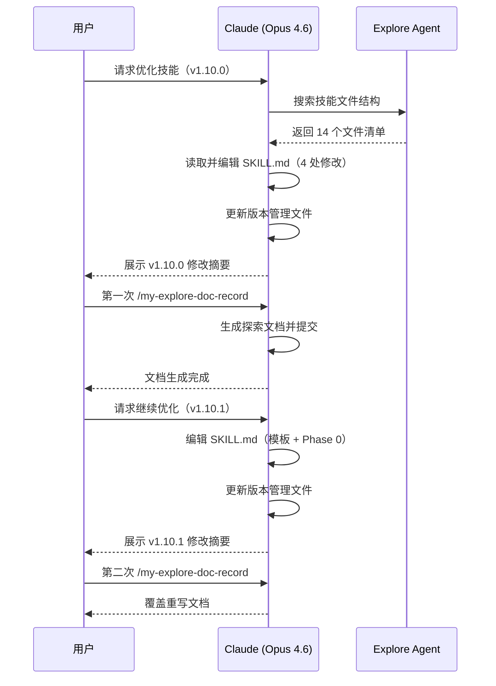
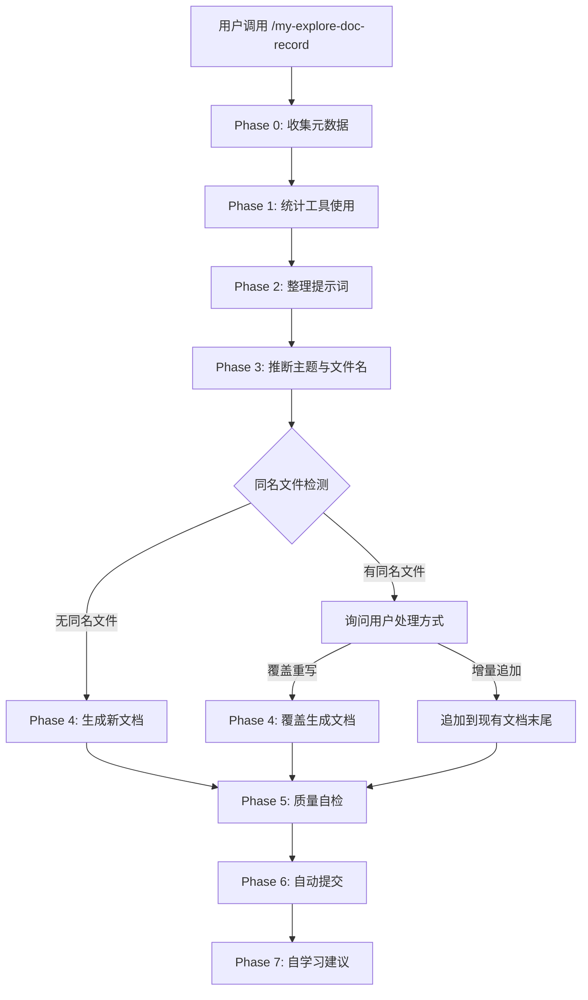
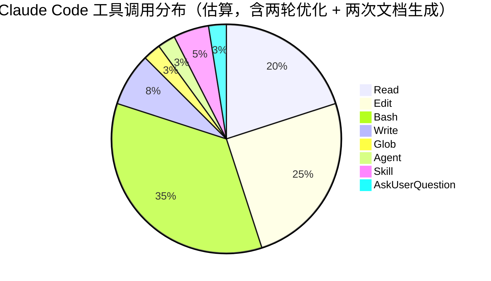
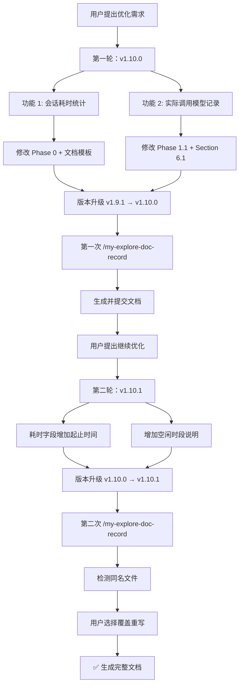
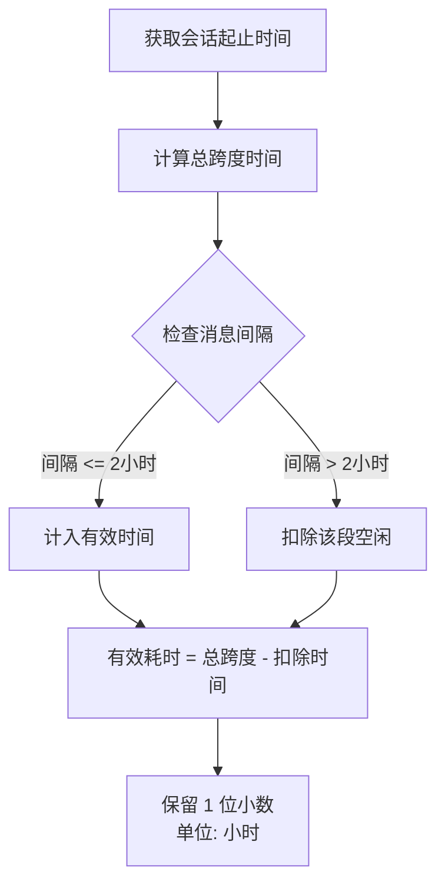
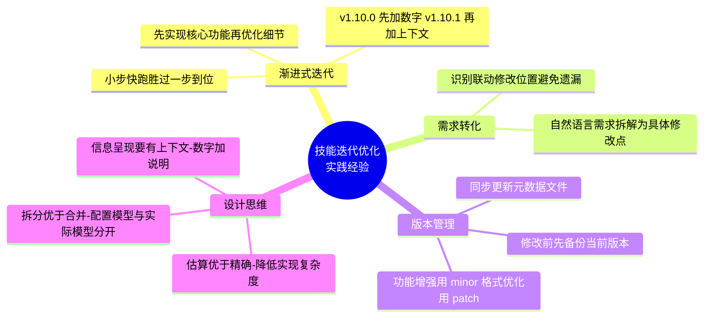

# my-explore-doc-record 技能优化 实践探索之旅

> **主题：** my-explore-doc-record 技能 v1.10.0 ~ v1.10.1 升级 — 新增会话耗时统计、起止时间展示与实际调用模型记录
> **日期：** 2026-04-13
> **预计耗时：** 2.0 小时（01:51 ~ 03:50，无长时间空闲）
> **受众：** AI 学习者 / Claude Code 使用者
> **会话 ID：** `session-2026-04-13`
> **项目路径：** `/root/sh`
> **GitHub 地址：** https://github.com/chujun/aiubuntu1-sh
> **本文档链接：** https://github.com/chujun/aiubuntu1-sh/blob/main/doc/ai-explore/2026-04-13-my-explore-doc-record技能优化实践探索之旅.md
> **本文档链接（编码版）：** https://github.com/chujun/aiubuntu1-sh/blob/main/doc/ai-explore/2026-04-13-my-explore-doc-record%E6%8A%80%E8%83%BD%E4%BC%98%E5%8C%96%E5%AE%9E%E8%B7%B5%E6%8E%A2%E7%B4%A2%E4%B9%8B%E6%97%85.md

---

## 目录

- [一、AI 角色与工作概述](#一ai-角色与工作概述)
- [二、主要用户价值](#二主要用户价值)
- [三、解决的用户痛点](#三解决的用户痛点)
- [四、开发环境](#四开发环境)
- [五、技术栈](#五技术栈)
- [六、AI 模型 / 插件 / Agent / 技能 / MCP 使用统计](#六ai-模型--插件--agent--技能--mcp-使用统计)
- [七、会话主要内容](#七会话主要内容)
- [八、关键决策记录](#八关键决策记录)
- [九、主要挑战与转折点](#九主要挑战与转折点)
- [十、用户提示词清单](#十用户提示词清单)
- [十一、AI 辅助实践经验](#十一ai-辅助实践经验)

---

## 一、AI 角色与工作概述

> 本章总结 AI 在本次会话中承担的角色定位及具体工作内容，帮助读者快速了解 AI 的协作方式。

### 角色定位

| 角色 | 说明 |
|------|------|
| 重构工程师 | 对 my-explore-doc-record 技能 SKILL.md 进行两轮结构化优化（v1.10.0 + v1.10.1） |
| 架构师 | 设计会话耗时估算算法、模型信息记录方案、耗时呈现格式 |
| 文档整理者 | 维护版本管理文件（VERSIONS.json / CHANGELOG.md），生成并覆盖重写探索文档 |

### 具体工作

**第一轮优化（v1.9.1 → v1.10.0）：**
- 在 Phase 0 新增「会话耗时估算」子节，设计了自动扣除超 2 小时空闲的计算逻辑
- 在 Phase 1.1 AI 大模型章节拆分为「配置模型」和「实际调用模型」两部分
- 修改文档模板头部，在日期后新增 `预计耗时` 字段
- 更新 Section 6.1 模板说明，引导生成文档时包含双模型表格
- 版本号升级到 v1.10.0，同步更新 VERSIONS.json 和 CHANGELOG.md

**第二轮优化（v1.10.0 → v1.10.1）：**
- 预计耗时字段增加会话起止时间（HH:MM ~ HH:MM）
- 增加空闲时段简要说明（无空闲 / 扣除具体时段）
- Phase 0 新增呈现格式规范和三种场景示例
- 版本号升级到 v1.10.1，同步更新版本管理文件

---

## 二、主要用户价值

1. **会话投入可量化** — 文档头部直接展示耗时、起止时间信息，读者可快速评估类似 AI 协作任务的时间成本
2. **空闲时间智能扣除** — 超过 2 小时的等待自动排除，并在括号中简要说明空闲时段
3. **时间线透明化** — 起止时间让读者了解会话发生在一天中的哪个时段（深夜/工作时间等）
4. **模型使用透明化** — 记录会话中真实调用的所有大模型，区分主对话与子代理使用不同模型的情况
5. **文档信息完整度提升** — 三项新增信息（耗时、起止时间、实际模型）填补了原模板的盲区

---

## 三、解决的用户痛点

> 本章从用户视角出发，罗列本次会话中 AI 协作实际解决的痛点问题。

| # | 用户痛点 | 简要描述 |
|---|---------|---------|
| 1 | 无法评估会话时间成本 | 生成的探索文档缺少耗时信息，读者无法判断类似任务需要多长时间 |
| 2 | 耗时数字缺乏上下文 | 仅有一个数字（如 1.8 小时）不够直观，缺少起止时间和空闲说明 |
| 3 | 大模型信息记录不完整 | 仅记录了 system-reminder 声明的模型，子代理使用的 Sonnet/Haiku 等模型未被记录 |
| 4 | 技能升级流程繁琐 | 需要同时修改 SKILL.md、VERSIONS.json、CHANGELOG.md 和版本备份，手动操作容易遗漏 |

---

## 四、开发环境

| 项目 | 详情 |
|------|------|
| OS | Linux 6.8.0-107-generic |
| Shell | Bash |
| 编辑方式 | Claude Code CLI (Opus 4.6) |
| 项目目录 | `/root/sh` |
| 技能目录 | `/root/.claude/skills/my-explore-doc-record/` |

---

## 五、技术栈



| 层级 | 技术 | 用途 |
|------|------|------|
| 技能定义 | Markdown (SKILL.md) | 定义技能执行流程和文档模板 |
| 版本管理 | JSON + Markdown | VERSIONS.json 元数据 + CHANGELOG.md 日志 |
| 文档生成 | Markdown + Mermaid | 探索文档输出格式 |
| 自动化 | Bash + Python3 | Mermaid 语法检查、URL 编码、元数据更新 |

---

## 六、AI 模型 / 插件 / Agent / 技能 / MCP 使用统计

### 6.1 AI 大模型

**配置模型（system-reminder 声明）：**

| 模型 ID | 名称 | 用途 | 调用范围 |
|---------|------|------|---------|
| `claude-opus-4-6` | Opus 4.6 | 主对话 | 全程 |

**实际调用模型（会话真实使用）：**

| 模型 ID | 模型名称 | 调用场景 | 说明 |
|---------|---------|---------|------|
| `claude-opus-4-6` | Opus 4.6 | 主对话 | 用户选择的主模型，使用 `/model` 确认保持 |
| （继承 opus） | Opus 4.6 | Explore Agent 子代理 | 未指定 model 参数，继承父级模型 |

> 本次会话仅使用了 Opus 4.6 一种模型。用户通过 `/model` 命令确认保持当前模型不变。

### 6.2 开发工具

| 工具 | 用途 |
|------|------|
| Claude Code CLI | AI 辅助开发主界面 |
| Git | 版本控制与远端同步 |

### 6.3 插件（Plugin）

本次会话未涉及浏览器插件。

### 6.4 Agent（智能代理）

| Agent 名称 | 触发方式 | 执行结果 | 说明 |
|-----------|---------|---------|------|
| Explore | Claude 后台调用 | ✅成功 | 搜索 my-explore-doc-record 技能相关文件（第一轮优化时） |



### 6.5 技能（Skill）

| 技能名称 | 触发命令 | 触发方 | 调用次数 | 是否完整执行 |
|---------|---------|-------|---------|------------|
| my-explore-doc-record | `/my-explore-doc-record` | 用户 | 2 次 | ✅第一次完整 / ✅第二次执行中 |



### 6.6 MCP 服务

| MCP 服务 | 工具前缀 | 本次调用次数 | 说明 |
|---------|---------|------------|------|
| （未配置 MCP 服务） | — | 0 | 用户环境未配置 MCP 服务 |

### 6.7 Claude Code 工具调用统计



> ⚠️ 以上数据为基于会话记忆的估算值，非精确统计。Edit 调用次数最多，原因是两轮优化共计修改 SKILL.md 约 8 处（版本号 ×2、Phase 0 ×2、Phase 1.1、文档模板 ×2、Section 6.1），以及多次更新 VERSIONS.json 和 CHANGELOG.md。

### 6.8 浏览器插件（用户环境，可选）

本次会话未涉及浏览器环境。

---

## 七、会话主要内容

### 7.1 任务全景



### 7.2 核心问题 1：会话耗时统计设计（v1.10.0）

用户需求：在生成的探索文档中自动展示会话耗时，并智能扣除长时间空闲。

**设计方案：**



**关键设计决策：**
- 2 小时阈值的选择：短于 2 小时可能是用户在思考或做其他短暂任务，不应扣除
- 信息来源：优先从 session summary 的 `Started` / `Last Updated` 字段推断
- 放置位置：紧接 `**日期：**` 之后，作为文档头部元信息的一部分

### 7.3 核心问题 2：实际调用模型记录方案（v1.10.0）

用户需求：在 AI 大模型章节额外记录会话中真实使用的所有模型。

**信息来源分析：**

| 来源 | 获取方式 | 示例 |
|------|---------|------|
| 主对话模型 | system-reminder 中的模型声明 | `claude-opus-4-6` |
| 子代理模型 | Agent 工具调用的 `model` 参数 | `model: "sonnet"` |
| 模型切换 | `/model` 命令的输出 | `Kept model as Opus 4.6` |

**方案：** 将 Phase 1.1 拆分为「配置模型」和「实际调用模型」两个子表格，后者通过回顾会话中 Agent 调用和 `/model` 命令来填充。

### 7.4 核心问题 3：耗时呈现格式增强（v1.10.1）

用户需求：预计耗时不仅显示数字，还要补充会话起止时间和空闲说明。

**格式演进：**

| 版本 | 格式 | 示例 |
|------|------|------|
| v1.10.0 | `X.X 小时` | `1.8 小时` |
| v1.10.1 | `X.X 小时（HH:MM ~ HH:MM，空闲说明）` | `2.0 小时（01:51 ~ 03:50，无长时间空闲）` |

**三种空闲说明场景：**
- 无空闲：`无长时间空闲`
- 单段扣除：`扣除 10:30~14:00 空闲 3.5h`
- 多段扣除：`扣除 10:00~15:00 空闲 5h + 17:00~20:00 空闲 3h`

---

## 八、关键决策记录

| 决策点 | 选项 A | 选项 B | 最终选择 | 理由 |
|--------|--------|--------|---------|------|
| 耗时字段命名 | `会话耗时` | `预计耗时` | `预计耗时` | "预计"更准确，因为是基于估算而非精确计时 |
| 空闲阈值 | 1 小时 | 2 小时 | 2 小时 | 1 小时太短，用户可能在思考或查阅资料 |
| v1.10.0 版本号 | patch (1.9.2) | minor (1.10.0) | minor (1.10.0) | 新增两项能力，属于功能增强 |
| v1.10.1 版本号 | minor (1.11.0) | patch (1.10.1) | patch (1.10.1) | 仅优化已有字段的显示格式，属于小改进 |
| 模型表格设计 | 合并为一个表 | 拆分为两个表 | 拆分为两个表 | 配置模型和实际模型是不同概念，分开更清晰 |
| 第二次文档处理 | 增量追加 | 覆盖重写 | 覆盖重写 | 用户选择，两轮优化紧密相关适合合并为一份完整文档 |

---

## 九、主要挑战与转折点

| 挑战 | 初始判断 | 实际根因 | 转折点 |
|------|---------|---------|--------|
| 耗时计算信息来源有限 | 以为可以精确获取每条消息的时间戳 | Claude Code 会话中无法获取精确的每条消息时间戳，只能从 session summary 等元数据推断 | 设计为"估算"而非"精确计时"，利用 session summary 的 Started/Last Updated 字段 |
| SKILL.md 多处修改需保持一致性 | 直接全部修改 | Phase 0、Phase 1.1、文档模板、Section 6.1 四处需要联动修改，容易遗漏 | 先梳理所有需要修改的位置，然后逐一编辑，最后通过重新阅读确认一致性 |
| 耗时格式一次没到位 | v1.10.0 只放了数字就够了 | 用户反馈仅有数字不够直观，缺少起止时间和空闲上下文 | 紧接着做了 v1.10.1 补充起止时间和空闲说明，形成 `X.X 小时（HH:MM ~ HH:MM，空闲说明）` 的完整格式 |
| 两次文档生成的冲突处理 | 第二次可以增量追加 | 两轮优化紧密相关，增量追加会导致重复内容；用户选择了覆盖重写 | 覆盖重写生成一份包含 v1.10.0 + v1.10.1 全部内容的完整文档 |

---

## 十、用户提示词清单（原文，一字未改）

### 【上一会话（已归档到摘要）】

> 上一会话（5 条提示词）主要内容为 WeReadScan 微信书籍下载验证，已归档到 session summary。

### 【当前会话】

**提示词 1：**
```
/model [技能调用]
```

**提示词 2：**
```
my-explore-doc-record 对该技能进行优化，1.统计会话耗时情况，预计耗时:xxxx小时，保留一位小时，位置放在生成markdown文档"**日期：** 2026-04-11"后面，如果claude code没有工作，一直处在等待用户输入时间，该等待时间超过2个小时，则减去中间的等待时间。 2.AI 模型 / 插件 / Agent / 技能 / MCP 使用统计章节下的AI模式小章节，额外记录会话真实调用的大模型信息
```

**提示词 3：**
```
/my-explore-doc-record [技能调用]
```

**提示词 4：**
```
my-explore-doc-record继续技能优化，1.文档开头预计耗时部分，补充会话开始时间-会话结束时间，并对空闲时间段做简要说明
```

**提示词 5：**
```
/my-explore-doc-record [技能调用]
```

---

## 十一、AI 辅助实践经验（面向 AI 学习者）



| 经验 | 核心教训 |
|------|---------|
| 渐进式迭代优于一步到位 | v1.10.0 先实现耗时数字，v1.10.1 再补充起止时间和空闲说明，每一步都可验证 |
| 信息呈现需要上下文 | 单纯的数字（如 "1.8 小时"）不够直观，加上起止时间和空闲说明后信息量大幅提升 |
| 技能迭代要保持向后兼容 | 新增字段不影响旧版本生成的文档格式，只增不改 |
| 元数据来源要多样化 | 单一信息来源不足以覆盖所有场景，需设计多来源采集机制 |
| 版本号语义要一致 | 功能增强（新能力）用 minor，格式优化（改进呈现）用 patch |
| 同名文档冲突需提供选择 | 增量追加、新建版本、覆盖重写各有适用场景，交给用户决策 |

---

*文档生成时间：2026-04-13 | 由 Opus 4.6 (`claude-opus-4-6`) 辅助生成*
