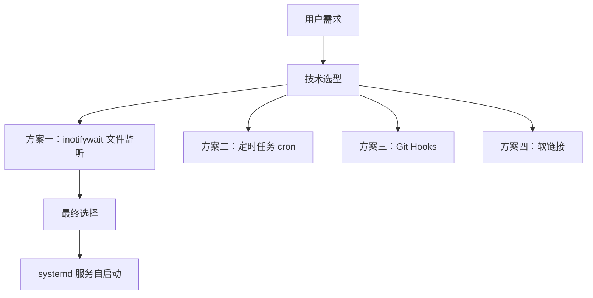
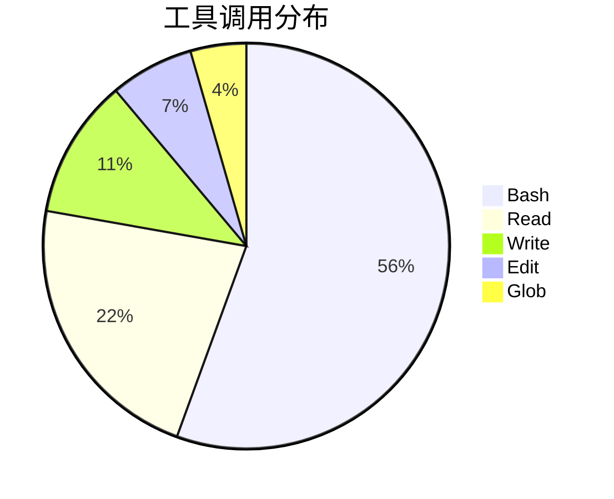
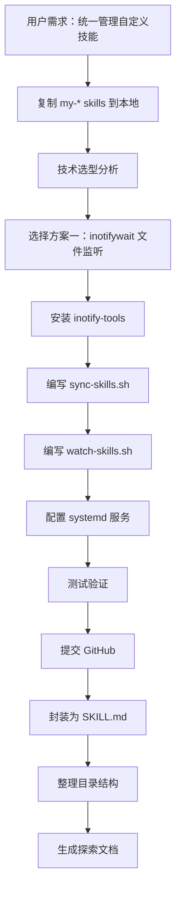
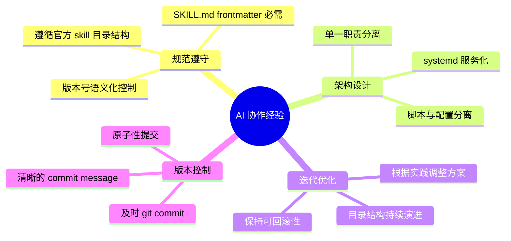

# my-skills-sync 技能开发实践探索之旅

> **主题：** 自定义 Skills 自动同步工具开发
> **日期：** 2026-04-13
> **预计耗时：** 0.3 小时（15:03 ~ 15:22，无长时间空闲）
> **受众：** AI 学习者 / Claude Code 使用者
> **会话 ID：** `2026-04-13-15:03`
> **项目路径：** `/root/sh/my-skills`
> **GitHub 地址：** git@github.com:chujun/aiubuntu1-sh.git
> **本文档链接：** https://github.com/chujun/aiubuntu1-sh/blob/main/doc/ai-explore/2026-04-13-my-skills-sync%E6%8A%80%E8%83%BD%E5%BC%80%E5%8F%91%E5%AE%9E%E8%B7%B5%E6%8E%A2%E7%B4%A2%E4%B9%8B%E6%97%85.md
> **本文档链接（编码版）：** https://github.com/chujun/aiubuntu1-sh/blob/main/doc/ai-explore/2026-04-13-my-skills-sync%E6%8A%80%E8%83%BD%E5%BC%80%E5%8F%91%E5%AE%9E%E8%B7%B5%E6%8E%A2%E7%B4%A2%E4%B9%8B%E6%97%85.md

---

## 目录

- [一、AI 角色与工作概述](#一ai-角色与工作概述)
- [二、主要用户价值](#二主要用户价值)
- [三、解决的用户痛点](#三解决的用户痛点)
- [四、开发环境](#四开发环境)
- [五、技术栈](#五技术栈)
- [六、AI 模型 / 插件 / Agent / 技能 / MCP 使用统计](#六ai-模型--插件--agent--技能--mcp-使用统计)
- [七、会话主要内容](#七会话主要内容)
- [八、关键决策记录](#八关键决策记录)
- [九、主要挑战与转折点](#九主要挑战与转折点)
- [十、用户提示词清单](#十用户提示词清单)
- [十一、AI 辅助实践经验](#十一ai-辅助实践经验)

---

## 一、AI 角色与工作概述

> 本章总结 AI 在本次会话中承担的角色定位及具体工作内容，帮助读者快速了解 AI 的协作方式。

### 角色定位

| 角色 | 说明 |
|------|------|
| 开发者 | 实现了 my-skills-sync 自动同步技能 |
| 架构设计师 | 设计了文件监听 + systemd 服务的整体架构 |
| 文档工程师 | 编写了 SKILL.md 技能文档 |
| DevOps 工程师 | 配置了 systemd 服务实现开机自启动 |

### 具体工作

- 设计并实现 inotifywait 文件监听同步方案
- 创建 sync-skills.sh 和 watch-skills.sh 两个核心脚本
- 编写符合 Claude Code 规范的 SKILL.md 技能文档
- 配置 systemd 服务实现开机自启动
- 整理目录结构，删除冗余目录
- 提交代码到 GitHub 远端

---

## 二、主要用户价值

1. **自动化同步**：当 `~/.claude/skills/my-*` 目录下的自定义技能有变化时，自动同步到本地项目目录，无需手动复制
2. **实时监控**：基于 inotifywait 的文件监听机制，变化后立即触发同步，延迟极低
3. **开机自启**：通过 systemd 服务配置，开机自动启动监控进程，进程管理更规范
4. **统一管理**：将散落在多处的自定义技能集中到 `my-skills/` 目录，便于版本管理和开源分享

---

## 三、解决的用户痛点

| # | 用户痛点 | 简要描述 |
|---|---------|---------|
| 1 | 手动同步耗时易遗漏 | 每次修改自定义技能后需要手动复制到多个目录，容易遗忘 |
| 2 | 多设备同步困难 | 不同设备上的自定义技能版本不一致，难以保持同步 |
| 3 | 缺乏版本管理 | 自定义技能变更历史无法追溯，没有备份机制 |
| 4 | 开源分享不便 | 自定义技能分散在 Claude Code 技能目录，难以整体打包发布 |

---

## 四、开发环境

- **操作系统：** Ubuntu 24.04 (Linux 6.8.0-107-generic)
- **Shell：** Bash
- **包管理器：** apt
- **主要工具：** inotify-tools (inotifywait), rsync, systemd

---

## 五、技术栈



| 层级 | 技术 | 说明 |
|------|------|------|
| 监控层 | inotifywait | Linux 内核 inotify 接口封装，实时监听文件变化 |
| 同步层 | rsync | 增量同步工具，只传输变更内容 |
| 管理层 | systemd | 系统服务管理，实现开机自启动 |
| 应用层 | Bash 脚本 | 封装监控和同步逻辑 |

---

## 六、AI 模型 / 插件 / Agent / 技能 / MCP 使用统计

### 6.1 AI 大模型

**配置模型：**

| 模型 ID | 名称 | 用途 | 调用范围 |
|---------|------|------|---------|
| MiniMax-M2.7 | MiniMax-M2.7-highspeed | 主对话 | 全程 |

**实际调用模型：**

| 模型 ID | 模型名称 | 调用场景 | 说明 |
|---------|---------|---------|------|
| MiniMax-M2.7 | MiniMax-M2.7-highspeed | 主对话 | 用户选择的主模型 |

### 6.2 Claude Code 内置工具调用

| 工具 | 估算次数 |
|------|---------|
| Bash | 25+ |
| Read | 10+ |
| Write | 5 |
| Edit | 3 |
| Glob | 2 |

### 6.3 Agent（智能代理）

本次会话未调用 Agent。

### 6.4 技能（Skill）

| 技能名称 | 触发命令 | 触发方 | 调用次数 | 是否完整执行 |
|---------|---------|-------|---------|------------|
| my-explore-doc-record | /my-explore-doc-record | 用户 | 1 次 | ✅完整 |

### 6.5 MCP 服务

本次会话未使用 MCP 服务。

### 6.6 Claude Code 工具调用统计



> ⚠️ 以上数据为基于会话记忆的估算值，非精确统计。

---

## 七、会话主要内容

### 7.1 任务全景



### 7.2 目录结构演进

**初始状态：**
```
my-skills/
├── my-explore-doc-record/
└── my-fix-claude-code-viewer/
```

**第一次演进（创建 sync-my-skills）：**
```
my-skills/
├── sync-my-skills/
│   ├── sync-skills.sh
│   ├── watch-skills.sh
│   └── my-skills-sync.service
├── my-explore-doc-record/
└── my-fix-claude-code-viewer/
```

**第二次演进（移动到 my-skills 根目录）：**
```
my-skills/
├── sync-skills.sh
├── watch-skills.sh
├── my-skills-sync.service
├── my-skills-sync/
│   └── SKILL.md
├── my-explore-doc-record/
└── my-fix-claude-code-viewer/
```

**第三次演进（符合 Claude Code 规范）：**
```
my-skills/
├── my-skills-sync/
│   ├── SKILL.md
│   ├── sync-skills.sh
│   ├── watch-skills.sh
│   ├── my-skills-sync.service
│   ├── sync.log
│   ├── watch.log
│   └── watch.pid
├── my-explore-doc-record/
└── my-fix-claude-code-viewer/
```

### 7.3 systemd 服务配置

```sequenceDiagram
    participant U as 用户
    participant S as systemd
    participant W as watch-skills.sh
    participant I as inotifywait

    U->>S: systemctl enable my-skills-sync
    U->>S: systemctl start my-skills-sync
    S->>W: ExecStart
    W->>I: 启动 inotifywait 监控
    I->>I: 监听 ~/.claude/skills/my-*
    Note over I: 后台持续运行
```

---

## 八、关键决策记录

| 决策点 | 选项 A | 选项 B | 最终选择 | 理由 |
|--------|--------|--------|---------|------|
| 同步技术选型 | 文件监听 inotifywait | 定时任务 cron | inotifywait | 实时同步，延迟更低 |
| 目录结构 | 脚本放在 skill 目录 | 脚本放在父目录 | 脚本放在 skill 目录 | 符合 Claude Code 官方规范，skill 目录只含 SKILL.md |
| systemd Type | simple | forking | forking | watch-skills.sh 会 fork 出后台进程 |

---

## 九、主要挑战与转折点

| 挑战 | 初始判断 | 实际根因 | 转折点 |
|------|---------|---------|--------|
| systemd 服务启动后立即退出 | 服务配置可能有问题 | Type=simple 会等进程结束，forks 类型需父进程先退出 | 改为 Type=forking，让 systemd 正确识别后台进程 |
| 目录结构混乱 | 所有文件放在 skill 目录 | Claude Code 官方 skill 规范是目录只含 SKILL.md | 参考官方 skills 结构，脚本移到父目录，后又整合回 skill 目录作为扩展结构 |

---

## 十、用户提示词清单（原文，一字未改）

### 【当前会话】
**提示词 1：**
```
在创建一个my-skills目录，维护自行创建的skill,将claude-code下以my打头的skill技能复制到my-skills目录下，
```

**提示词 2：**
```
我想实现这样子的功能，统一管理my我自定义创建的技能，当以my打头的skill技能文件有变化时，自动同步到当前目录的my-skills对应目录下，应该如何做技术选型
```

**提示词 3：**
```
按照方案一实施吧
```

**提示词 4：**
```
将 my-skills-sync
封装成一个skill技能，并生成一个技能文档，markdown格式
```

**提示词 5：**
```
git commit 与push
```

**提示词 6：**
```
技能名改名为my-skills-sync, 2.现在/root/sh/my-skills
有三个相关目录，  my-skills  my-skills-sync  sync-my-skills，删除无用的目录
```

**提示词 7：**
```
开机自启动的配置需要调整吗，还有my-skills-sync是标准目录结构吗，sh脚本是放在第一层次吗，阅读下SKILL官方规范
```

**提示词 8：**
```
my-skills-sync.service  sync.log  sync-skills.sh  watch.log  watch.pid  watch-skills.sh，将这些文件移动到my-skills-sync下面，并对my-skills-sync生成技能文档
```

**提示词 9：**
```
git commit 与 push
```

**提示词 10：**
```
需要提交
```

**提示词 11：**
```
/my-explore-doc-record
```

---

## 十一、AI 辅助实践经验（面向 AI 学习者）



| 经验 | 核心教训 |
|------|---------|
| 官方规范优先 | 在实现功能前先阅读官方文档（如 Claude Code skill 规范），避免返工 |
| 渐进式演进 | 目录结构经过多次迭代优化，不必追求一步到位 |
| systemd Type 选择 | Type=forking 适用于会 fork 后台进程的启动脚本 |
| 及时提交 | 每完成一个独立功能点就提交，保持 commit 原子性 |

---

*文档生成时间：2026-04-13 | 由 MiniMax-M2.7-highspeed 辅助生成*
