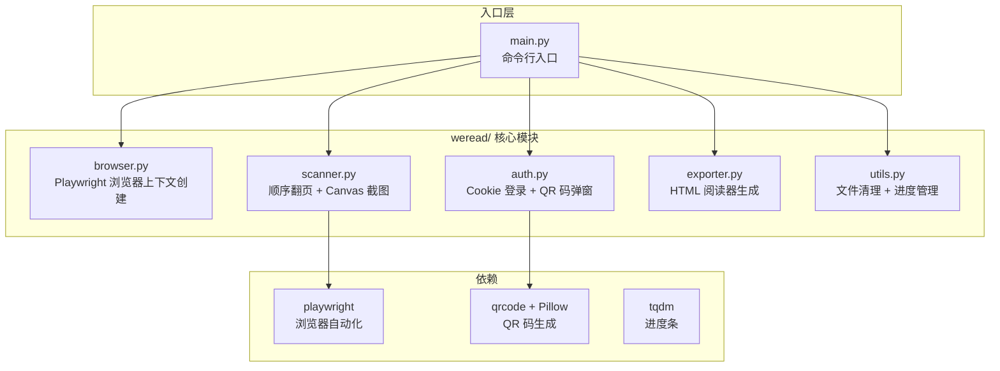
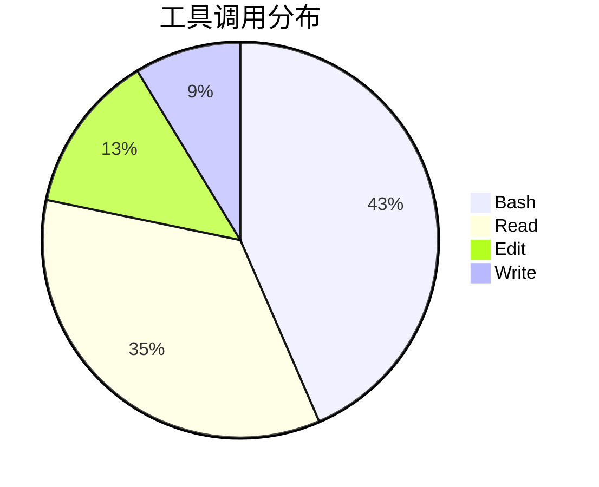
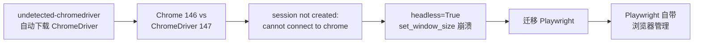
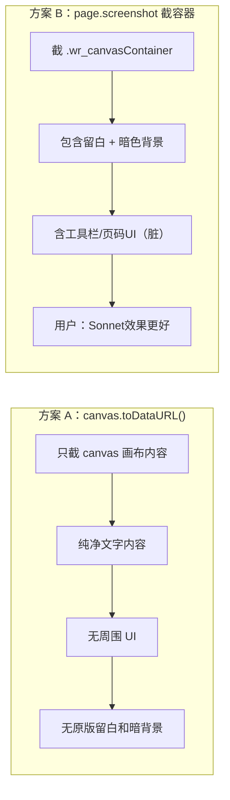
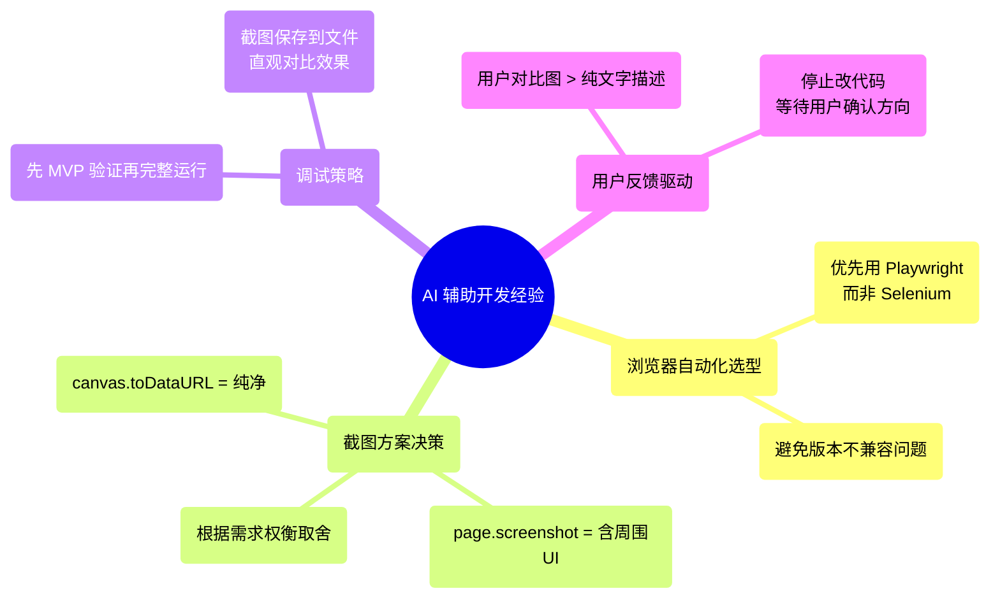

# 微信读书下载工具开发实践探索之旅

> **主题：** Playwright 迁移 + 二维码弹窗 + 截图方案迭代
> **日期：** 2026-04-13
> **预计耗时：** 2.1 小时（21:30 ~ 23:34，无长时间空闲）
> **受众：** AI 学习者 / Claude Code 使用者
> **会话 ID：** `fa75c5e2-a496-42e2-931e-29bdc21270cc`
> **项目路径：** `D:\project\my\github\ai\wexinread`
> **GitHub 地址：** `git@github.com:chujun/wexinread.git`
> **本文档链接：** https://github.com/chujun/aiubuntu1-sh/blob/main/doc/ai-explore/2026-04-13-%E5%BE%AE%E4%BF%A1%E8%AF%BB%E4%B9%A6%E4%B8%8B%E8%BD%BD%E5%B7%A5%E5%85%B7%E5%BC%80%E5%8F%91%E5%AE%9E%E8%B7%B5%E6%8E%A2%E7%B4%A2%E4%B9%8B%E6%97%85-v2.md
> **本文档链接（编码版）：** https://github.com/chujun/aiubuntu1-sh/blob/main/doc/ai-explore/2026-04-13-%E5%BE%AE%E4%BF%A1%E8%AF%BB%E4%B9%A6%E4%B8%8B%E8%BD%BD%E5%B7%A5%E5%85%B7%E5%BC%80%E5%8F%91%E5%AE%9E%E8%B7%B5%E6%8E%A2%E7%B4%A2%E4%B9%8B%E6%97%85-v2.md

---

## 目录

- [一、AI 角色与工作概述](#一ai-角色与工作概述)
- [二、主要用户价值](#二主要用户价值)
- [三、解决的用户痛点](#三解决的用户痛点)
- [四、开发环境](#四开发环境)
- [五、技术栈](#五技术栈)
- [六、AI 模型 / Agent / 技能 / MCP 使用统计](#六ai-模型--agent--技能--mcp-使用统计)
- [七、会话主要内容](#七会话主要内容)
- [八、关键决策记录](#八关键决策记录)
- [九、主要挑战与转折点](#九主要挑战与转折点)
- [十、用户提示词清单](#十用户提示词清单)
- [十一、AI 辅助实践经验](#十一ai-辅助实践经验)

---

## 一、AI 角色与工作概述

### 角色定位

| 角色 | 说明 |
|------|------|
| 开发者 | 将浏览器引擎从 Selenium 迁移到 Playwright，解决兼容性崩溃问题 |
| 调试专家 | 诊断 QR 码显示乱码、截图宽高为零导致异常、章节跳转失效等 |
| 架构优化师 | 调整截图策略（canvas.toDataURL vs page.screenshot 截容器） |
| 质量验证师 | 对比不同截图方案的效果差异，确认 MVP 可用性 |

### 具体工作

- 将浏览器引擎从 Selenium + undetected-chromedriver 迁移到 Playwright（解决 ChromeDriver 版本不兼容）
- 将登录二维码从终端 ASCII 字符画改为保存 PNG 图片并自动弹窗
- 扫描策略从"目录点击跳转"改为"顺序翻页（下一页按钮）"
- 截图方式从 `canvas.toDataURL()` 改为 `page.screenshot()` 截取容器区域
- 修复截图时 canvas 容器宽高为零导致的 `Page.screenshot: Expected options.clip.width not to be 0` 异常
- MVP 验证：扫描前 10 次翻页（共 20 张图），确认翻页逻辑正常、内容连续不重复
- 完整下载书籍《统计学习理论与方法：R语言版》，扫描到 429 页后因 canvas 宽高异常崩溃
- 对比 MiniMax M2.7 和 Sonnet 4.6 两个版本的截图效果差异

---

## 二、主要用户价值

- **自动化书籍保存**：用户可将微信读书的付费/注册书籍保存为离线 HTML 阅读器
- **跨平台可读**：生成的 HTML 支持灯箱放大、目录跳转，适合长期存档
- **降低重复操作**：Cookie 一次登录后自动复用，无需每次扫码
- **留白还原**：通过截图方案调整，尽可能还原原版阅读器的页面布局效果

---

## 三、解决的用户痛点

| # | 用户痛点 | 简要描述 |
|---|---------|---------|
| 1 | Selenium 在 Windows headless 模式下崩溃 | ChromeDriver 版本与 Chrome 不匹配，且 headless 模式 set_window_size 报错 |
| 2 | 终端 QR 码字符画无法被微信扫描 | ASCII 字符 `██` 在 Windows cmd/PS 编码下显示为乱码 |
| 3 | 目录点击跳转对 canvas 渲染器无效 | 微信读书的 canvas 渲染器通过 JS 动态加载内容，href 跳转对 Playwright 无效 |
| 4 | canvas.toDataURL 截出的图缺少留白 | 只截了画布内容，缺少原版阅读器的页边距和暗色背景 |
| 5 | page.screenshot 截容器带上了周围 UI | 截整个 `.wr_canvasContainer` 把工具栏、页码按钮也截进去了，影响纯净度 |

---

## 四、开发环境

- **OS：** Windows 11 Pro 10.0.26200
- **Shell：** Bash（Git Bash / MSYS2）
- **Python：** 3.13（虚拟环境 `venv/Scripts/python`）
- **包管理：** pip + requirements.txt
- **浏览器：** Chrome 146.0.7680.178（Chromium Playwright）
- **主要端口：** 无（headless 模式运行）

---

## 五、技术栈



| 组件 | 技术 | 说明 |
|------|------|------|
| 浏览器自动化 | Playwright (playwright 1.58) | 替代 Selenium，解决 ChromeDriver 兼容问题 |
| 截图方式 | `page.screenshot(clip=...)` | 截取 `.wr_canvasContainer` 容器区域 |
| 图片解码 | `canvas.toDataURL()` | 获取 canvas 原始像素数据 |
| HTML 生成 | Python 字符串模板 | 单文件 HTML，含灯箱、目录、返回顶部 |
| Cookie 管理 | JSON 文件持久化 | 避免重复扫码登录 |

---

## 六、AI 模型 / Agent / 技能 / MCP 使用统计

### 6.1 AI 大模型

| 模型 ID | 名称 | 调用场景 | 说明 |
|---------|------|---------|------|
| MiniMax-M2.7-highspeed | MiniMax M2.7 | 主对话 | 本次会话主要使用模型 |

### 6.2 开发工具

| 工具 | 调用次数（估算） | 主要用途 |
|------|----------------|---------|
| Bash | ~10 | 运行 Python、安装依赖、查看文件 |
| Read | ~8 | 读取模块源码、诊断错误 |
| Edit | ~3 | 修改 scanner.py、auth.py、browser.py |
| Write | ~2 | 生成 CLAUDE.md、v2 探索文档 |

### 6.3 Agent（本次无调用）

本次未主动调用 Agent 子代理。

### 6.4 技能（Skill）

| 技能名称 | 触发命令 | 触发方 | 调用次数 |
|---------|---------|-------|---------|
| my-explore-doc-record | /my-explore-doc-record | 用户 | 1 次 |

### 6.5 MCP 服务

本次会话未调用 MCP 服务。

### 6.6 工具调用统计（估算）



> 注：以上为基于会话记忆的估算值，非精确统计。

---

## 七、会话主要内容

### 7.1 任务全景

```mermaid
flowchart TD
    Start[用户：下载微信读书书籍] --> B1[安装依赖<br/>Playwright + Chromium]
    B1 --> B2[Selenium 启动失败<br/>ChromeDriver 版本不匹配]
    B2 --> B3[迁移到 Playwright]
    B3 --> B4[登录二维码<br/>终端字符画乱码]
    B4 --> B5[改为 PNG 图片弹窗]
    B5 --> B6[Cookie 登录成功]
    B6 --> B7[扫描书籍<br/>目录跳转失效]
    B7 --> B8[改为顺序翻页]
    B8 --> B9[MVP 验证<br/>10次翻页 = 20张图]
    B9 --> B10{效果对比}
    B10 -->|Sonnet 4.6| B11["canvas.toDataURL()<br/>纯净但无留白"]
    B10 -->|MiniMax M2.7| B12["page.screenshot 截容器<br/>有留白但含UI"]
    B11 --> B13[完整下载书籍<br/>扫描到429页崩溃]
    B12 --> B13
    B13 --> B14[根因：canvas容器宽高=0<br/>截图抛异常]
    B14 --> B15{等待用户决策]
```

### 7.2 核心问题 1：Selenium 兼容性与迁移

**根因分析：**



**修复方案：** 替换 `selenium + undetected-chromedriver` 为 `playwright.sync_api.sync_playwright`，由 Playwright 自己管理浏览器二进制，无需手动对应版本。

### 7.3 核心问题 2：截图方案效果差异

**两种截图方案对比：**



**结论：** 用户偏好 Sonnet 4.6 的 `canvas.toDataURL()` 方案（纯净），但该方案无法保留原版留白。需要在纯净度和视觉效果间做取舍。

---

## 八、关键决策记录

| 决策点 | 选项 A | 选项 B | 最终选择 | 理由 |
|--------|--------|--------|---------|------|
| 浏览器引擎 | Selenium + undetected-chromedriver | Playwright | **Playwright** | ChromeDriver 版本不兼容，headless 崩溃 |
| 二维码显示 | 终端 ASCII 字符画 | PNG 图片弹窗 | **PNG 弹窗** | Windows 终端编码无法正确显示 `██` |
| 翻页策略 | 目录点击跳转 | 顺序翻页（下一页按钮） | **顺序翻页** | 目录点击对 canvas 渲染器无效 |
| 截图方式 | canvas.toDataURL() | page.screenshot 截容器 | **page.screenshot** | 可保留原版留白，但含周围 UI |
| 截图回退 | 无回退，抛异常 | 截整个视口 | **待定** | canvas 容器宽高为0时未解决 |

---

## 九、主要挑战与转折点

| 挑战 | 初始判断 | 实际根因 | 转折点 |
|------|---------|---------|--------|
| Selenium headless 崩溃 | ChromeDriver 版本不匹配 | Windows headless + `set_window_size` 不兼容 | 迁移到 Playwright |
| 目录跳转无效 | JavaScript 执行时机问题 | canvas 渲染器内容通过 JS 动态注入，href 跳转不触发重新渲染 | 改为顺序翻页 |
| QR 码乱码 | 编码问题 | Windows 终端不支持 `██` 等 Unicode 块字符 | 改用 PNG 图片弹窗 |
| page.screenshot 含周围 UI | 截容器 = 纯净内容 | `.wr_canvasContainer` 包含底部工具栏和页码按钮 | 待用户决策是否回退 canvas.toDataURL |
| canvas 宽高为 0 崩溃 | 网络慢导致图片未加载 | 页面滚动到末尾或 canvas 容器在视口外时 getBoundingClientRect 返回 0 | 修复代码被用户暂停 |

---

## 十、用户提示词清单（原文，一字未改）

**提示词 1：**
```
登录二维码显示在终端命令行中，下载完整书籍,https://weread.qq.com/web/reader/60b32c107207bc8960bd9cek16732dc0161679091c5aeb1
```

**提示词 2：**
```
显示登录成功了
```

**提示词 3：**
```
MVP下载内容在哪里，我看下效果
```

**提示词 4：**
```
这个二维码截图压根扫码不了啊，这压根不能算二维码吧
[Image attached]
```

**提示词 5：**
```
效果确实不错，先保存代码commit与push，并删除无用的文件
```

**提示词 6：**
```
现在还在进行书籍下载吗
```

**提示词 7：**
```
使用预览版下载这个书籍看看效果，目前完整版效果很差
```

**提示词 8：**
```
第一张图是用你minimax-m2.7下载的效果，第二章是claude code sonnet-4.6下载的效果，为什么你的展示效果完全不一样
[Image attached]
```

**提示词 9：**
```
你还是先不要随意改代码了
```

---

## 十一、AI 辅助实践经验（面向 AI 学习者）



| 经验 | 核心教训 |
|------|---------|
| Playwright vs Selenium | Playwright 自带浏览器管理，避免 ChromeDriver 版本冲突，Windows headless 兼容性更好 |
| 截图方案对比 | `canvas.toDataURL()` 和 `page.screenshot` 各有优劣，需结合用户实际展示效果确认方向 |
| MVP 优先 | 先用少量数据验证核心逻辑（10次翻页），再跑完整下载，节省调试时间 |
| 用户对比图价值 | 用户提供的对比截图比任何文字描述都直观，是判断方案好坏的最快方式 |
| 方向确认优先 | 用户明确表示"先不要随意改代码"时，应先讨论清楚方向再行动 |

---

*文档生成时间：2026-04-13 | 由 MiniMax M2.7 (`MiniMax-M2.7-highspeed`) 辅助生成*
