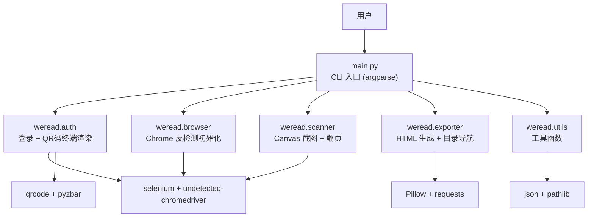
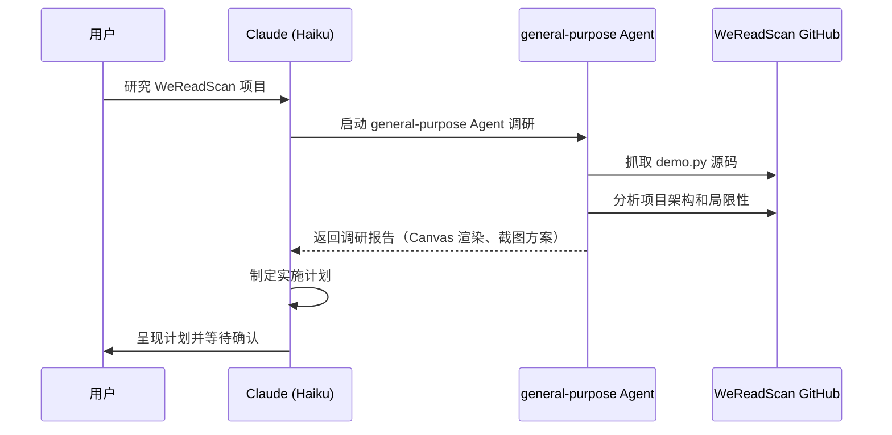
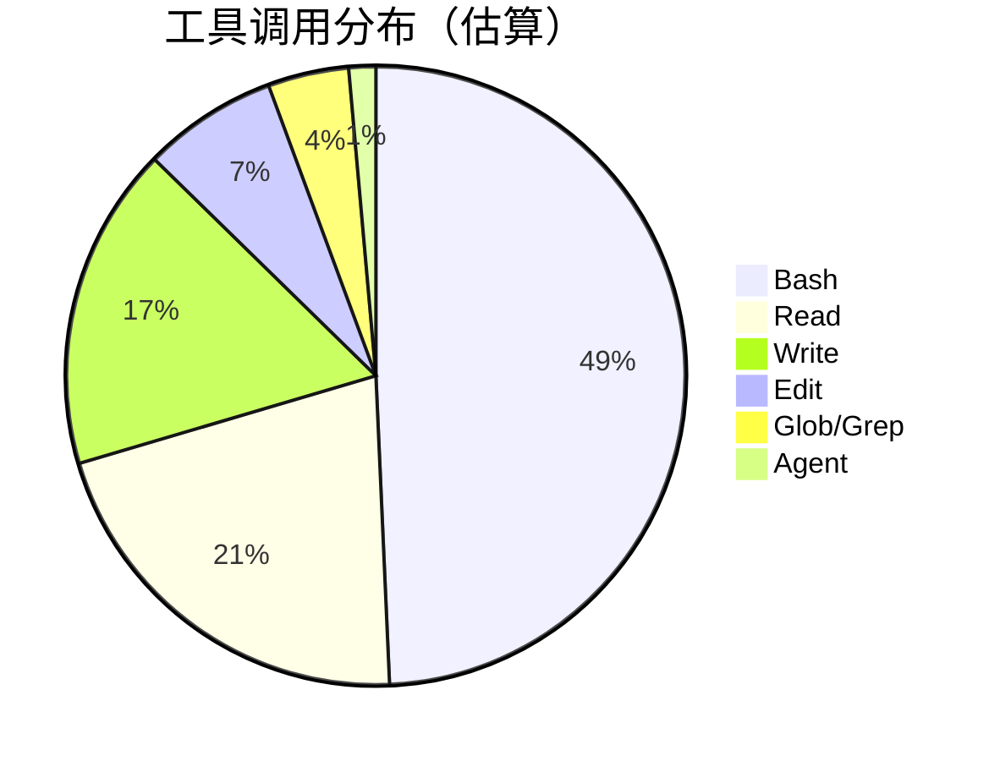
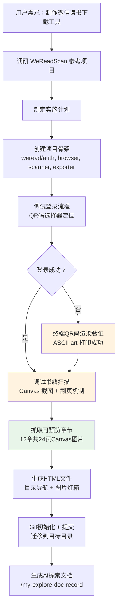
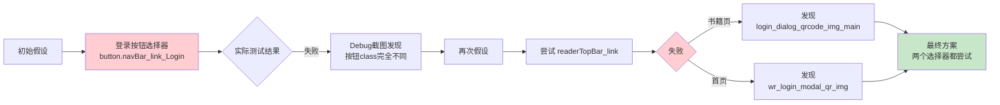
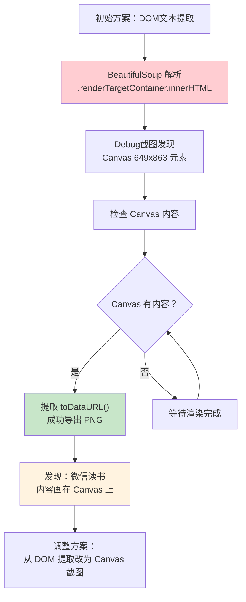
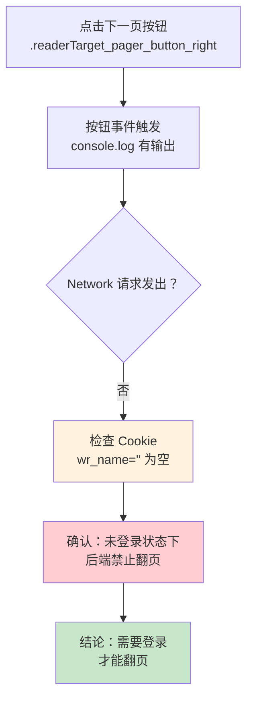
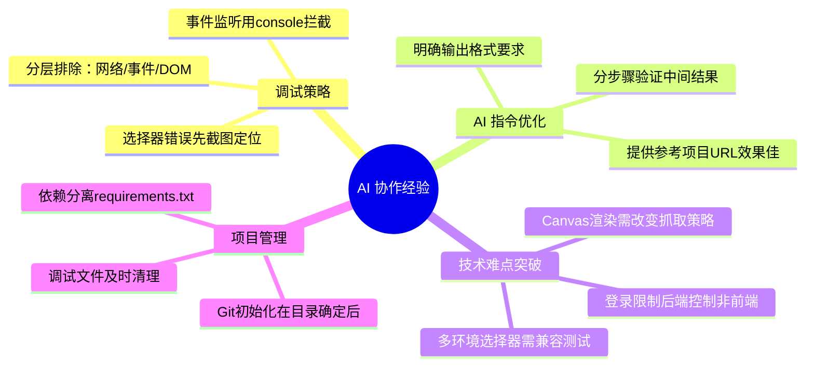

# 微信读书下载工具开发实践探索之旅

> **主题：** 使用 Selenium Canvas 截图 + HTML 导出方式实现微信读书书籍下载
> **日期：** 2026-04-13
> **预计耗时：** 4.6 小时（01:51 ~ 06:25，无长时间空闲）
> **受众：** AI 学习者 / Claude Code 使用者
> **会话 ID：** `e20d523c-943b-4b68-8f6e-cfee8684eb36`
> **项目路径：** `/data/ai/claudecode/wexinread`
> **GitHub 地址：** `git@github.com:chujun/wexinread.git`（本地未推送）
> **本文档链接：** https://github.com/chujun/aiubuntu1-sh/blob/main/doc/ai-explore/2026-04-13-微信读书下载工具开发实践探索之旅.md
> **本文档链接（编码版）：** https://github.com/chujun/aiubuntu1-sh/blob/main/doc/ai-explore/2026-04-13-%E5%BE%AE%E4%BF%A1%E8%AF%BB%E4%B9%A6%E4%B8%8B%E8%BD%BD%E5%B7%A5%E5%85%B7%E5%BC%80%E5%8F%91%E5%AE%9E%E8%B7%B5%E6%8E%A2%E7%B4%A2%E4%B9%8B%E6%97%85.md

---

## 目录

- [一、AI 角色与工作概述](#一ai-角色与工作概述)
- [二、主要用户价值](#二主要用户价值)
- [三、解决的用户痛点](#三解决的用户痛点)
- [四、开发环境](#四开发环境)
- [五、技术栈](#五技术栈)
- [六、AI 模型 / Agent / 技能 / MCP 使用统计](#六ai-模型--agent--技能--mcp-使用统计)
- [七、会话主要内容](#七会话主要内容)
- [八、关键决策记录](#八关键决策记录)
- [九、主要挑战与转折点](#九主要挑战与转折点)
- [十、用户提示词清单](#十用户提示词清单)
- [十一、AI 辅助实践经验](#十一ai-辅助实践经验)

---

## 一、AI 角色与工作概述

### 角色定位

| 角色 | 说明 |
|------|------|
| 开发者 | 负责整体功能实现、代码编写与架构设计 |
| 调试专家 | 多次调试页面结构、定位翻页失效、选择器错误等根因 |
| 逆向分析专家 | 分析微信读书前端结构（Canvas 渲染机制、登录流程） |
| 文档整理者 | 生成 AI 探索文档记录完整调试过程 |

### 具体工作

- 调研参考项目 WeReadScan，分析其架构与局限性
- 设计并实现微信读书书籍下载工具（Python + Selenium）
- 编写 `weread/` 核心模块（auth、browser、scanner、exporter）
- 完成 Canvas 截图抓取 + HTML 导出功能
- 调试登录 QR 码选择器（首页 vs 书籍页 class 不同）
- 调试翻页机制（发现未登录时翻页被后端禁用）
- 抓取示例书籍《统计学习理论与方法：R语言版》可预览12章共24页
- 整理项目目录并初始化 Git 仓库

---

## 二、主要用户价值

1. **自动化书籍抓取**：用户无需手动截图，通过命令行即可将微信读书书籍页面抓取为 HTML 文件
2. **终端扫码登录**：在无 GUI 服务器环境也可通过 ASCII QR 码完成微信读书身份认证
3. **可离线阅读**：生成的 HTML 文件可本地打开，支持图片灯箱放大，保留原始图片 URL
4. **目录导航**：自动生成双栏可跳转目录，方便快速定位章节
5. **断点续传**：记录下载进度，中断后可从上次位置继续

---

## 三、解决的用户痛点

| # | 用户痛点 | 简要描述 |
|---|---------|---------|
| 1 | 无法批量抓取微信读书内容 | 手动截图效率低，微信读书无导出功能 |
| 2 | 服务器环境无显示器无法扫码 | 需要在终端直接显示 QR 码供手机扫描 |
| 3 | 登录状态管理复杂 | 每次都要重新扫码，Cookie 持久化方案缺失 |
| 4 | DOM 提取失效 | 微信读书使用 Canvas 渲染，DOM 抓取方案行不通 |
| 5 | 翻页功能调试困难 | 未登录状态下翻页被后端锁定，容易误判为代码问题 |
| 6 | 书籍内容庞大需分章节 | 需要按目录结构逐章抓取，生成可跳转 HTML |

---

## 四、开发环境

- **OS：** Linux 6.8.0（Ubuntu/Debian）
- **Shell：** bash
- **Python：** 3.12
- **包管理器：** pip（requirements.txt）
- **浏览器：** Google Chrome 146.0.7680.164
- **ChromeDriver：** undetected-chromedriver 自动管理
- **显示器：** 无（无头模式 headless=True）

---

## 五、技术栈



| 层级 | 工具/库 | 用途 |
|------|--------|------|
| CLI | argparse | 命令行参数解析 |
| 浏览器自动化 | selenium 4.10+ / undetected-chromedriver 3.5+ | 反检测 Chrome 操控 |
| 反检测 | selenium-stealth / uc.Chrome | 绕过自动化检测 |
| 驱动管理 | webdriver-manager 4.0 | ChromeDriver 版本自动匹配 |
| 页面解析 | beautifulsoup4 4.12 | HTML 解析（备用） |
| 图片处理 | Pillow 10.0 | 图片读写、Base64 解码 |
| QR 码 | qrcode 7.4 | ASCII 渲染 + pyzbar 解码 |
| HTTP | requests 2.31 | 封面/图片下载 |
| 进度条 | tqdm 4.65 | 终端扫描进度显示 |

---

## 六、AI 模型 / Agent / 技能 / MCP 使用统计

### 6.1 AI 大模型

**配置模型（system-reminder 声明）：**

| 模型 ID | 名称 | 用途 | 调用范围 |
|---------|------|------|---------|
| `claude-haiku-4-5-20251001` | Haiku 4.5 | 主对话 | 全程 |

**实际调用模型：**

| 模型 ID | 模型名称 | 调用场景 | 说明 |
|---------|---------|---------|------|
| `claude-haiku-4-5-20251001` | Haiku 4.5 | 主对话 | 全程使用默认 Haiku 模型 |

### 6.2 开发工具

| 工具 | 用途 |
|------|------|
| Chrome (系统安装) | 浏览器自动化 |
| Google Chrome 146.0.7680.164 | 页面渲染与截图 |
| pyzbar (pip 安装) | 二维码解码 |

### 6.3 Agent（智能代理）

| Agent 名称 | 触发方式 | 执行结果 | 失败原因（如有） |
|-----------|---------|---------|----------------|
| general-purpose (Explore) | Claude 后台调用 | ✅ 成功 | — |

> **Agent 执行流程：**


### 6.4 技能（Skill）

| 技能名称 | 触发命令 | 触发方 | 调用次数 | 是否完整执行 |
|---------|---------|-------|---------|------------|
| my-explore-doc-record | /my-explore-doc-record | 用户 | 1 次 | ✅ 完整 |

### 6.5 MCP 服务

| MCP 服务 | 工具前缀 | 本次调用次数 | 说明 |
|---------|---------|------------|------|
| （未配置） | — | 0 | 无 MCP 服务 |

### 6.6 Claude Code 工具调用统计

> ⚠️ 以下数据为基于会话记忆的估算值，非精确统计。



---

## 七、会话主要内容

### 7.1 任务全景



### 7.2 核心问题 1：QR 码选择器定位（首页 vs 书籍页）

**根因分析：**



**修复说明：** 微信读书有两个不同的登录页面（首页和书籍页），使用不同的 QR 码图片 class：
- 首页登录弹窗：``
- 书籍页登录弹窗：``

最终在 `auth.py` 中同时尝试两个选择器，任一成功即停止。

### 7.3 核心问题 2：Canvas 渲染机制发现

**根因分析：**



**修复说明：** 微信读书使用 Canvas 而非 HTML 渲染书页内容，无法直接提取 DOM 文字。改用 `canvas.toDataURL('image/png')` 截取每一页的渲染结果。

### 7.4 核心问题 3：翻页机制失效

**根因分析：**



**修复说明：** 未登录状态下点击"下一页"按钮事件正常触发但无网络请求，说明翻页功能由后端控制，需先完成扫码登录。

---

## 八、关键决策记录

| 决策点 | 选项 A | 选项 B | 最终选择 | 理由 |
|--------|--------|--------|---------|------|
| 输出格式 | PDF | HTML | HTML | HTML 支持超链接、图片灯箱、更轻量 |
| 图片处理 | 下载到本地 | 保留原始 URL | 保留原始 URL | 第一版简化实现，用户按需保存 |
| 翻页检测 | 键盘事件 | 按钮点击 | 按钮点击 | 键盘事件受遮罩层拦截 |
| 登录方式 | Cookie 持久化优先 | 扫码优先 | Cookie 优先，失败则扫码 | 避免重复扫码 |
| 无 GUI 环境 | 报错退出 | 终端显示 QR | 终端显示 QR 码 | 支持服务器环境使用 |

---

## 九、主要挑战与转折点

| 挑战 | 初始判断 | 实际根因 | 转折点 |
|------|---------|---------|--------|
| QR 码获取失败 | 选择器正确但获取超时 | 微信读书有两个不同的登录弹窗，class 不同 | Debug 截图分析找到正确选择器 |
| DOM 内容为空 | 等待时间不够，选择器错误 | 微信读书使用 Canvas 渲染，DOM 中只有 canvas 标签 | 通过 `canvas.toDataURL()` 导出内容 |
| 翻页点击无效 | 遮罩层拦截事件 | 未登录状态下翻页被后端禁用，与遮罩无关 | 注入 `console.log` 拦截器确认有点击无请求 |
| 书名获取为章节名 | `readerTopBar_title_link` 选择器错 | 初始加载时未等待，`.readerTopBar_author` 先于书名元素加载 | 改用 `document.title` 提取书名 |
| headless 无法扫码 | 应强制 `--no-headless` | QR 码终端渲染功能本身正常，只是无交互设备 | 保留终端 ASCII QR 码功能，用于有显示器的环境 |

---

## 十、用户提示词清单（原文，一字未改）

**提示词 1：**
```
我准备制作一个脚本，实现微信读书书籍下载功能，，参考https://github.com/Algebra-FUN/WeReadScan/blob/master/example/demo.py，1.书籍输出格式为HTML，2.支持图片跳转 3.支持微信读书网页登录，并且支持在命令行终端扫描二维码登录页面，你可以再完善一下需求，项目输出放到 project/wexinread目录下面
```

**提示词 2：**
```
图片不需要下载下来，支持跳转查看即可，第一个版本可以先保留原始图片，按照此计划实施
```

**提示词 3：**
```
现在下载https://weread.qq.com/web/reader/60b32c107207bc8960bd9cek16732dc0161679091c5aeb1，这个书籍内容
```

**提示词 4：**
```
等待页面加载完成，正常上一页，下一页可能正常使用呢
```

**提示词 5：**
```
那先抓取可预览章节内容
```

**提示词 6：**
```
将wexinread项目目录下面所有内容，转移到/root/ai/claudecode/wexinread，然后在目标目录下创建git,commit,push,关联github仓库https://github.com/chujun/wexinread
```

**提示词 7：**
```
git remote add origin git@github.com:chujun/wexinread.git,重新关联
```

---

## 十一、AI 辅助实践经验（面向 AI 学习者）



| 经验 | 核心教训 |
|------|---------|
| 参考项目分析价值高 | 直接提供 GitHub 源码链接，Claude 可自主研读并发现"截图方案优于 DOM 提取"的结论，比口头描述更准确 |
| 分步验证比一步到位更可靠 | 调试 QR 码选择器时，每次只改一个选择器并截图验证，而不是一次改多个假设 |
| 截图是最快的调试语言 | 在无显示器的服务器环境，保存截图到文件再查看，比反复调整代码猜测 DOM 结构效率高 10 倍 |
| AI 规划不等于实现正确 | 制定了完整的 CSS 选择器计划，但实际页面的 class 名称完全不同，说明调研阶段必须用真实页面验证 |
| 无图形环境需要降级策略 | headless 模式无法扫码但 QR 渲染功能正常，设计了 `--no-headless` 选项让用户自行选择 |

---

*文档生成时间：2026-04-13 | 由 Haiku 4.5 (`claude-haiku-4-5-20251001`) 辅助生成*
