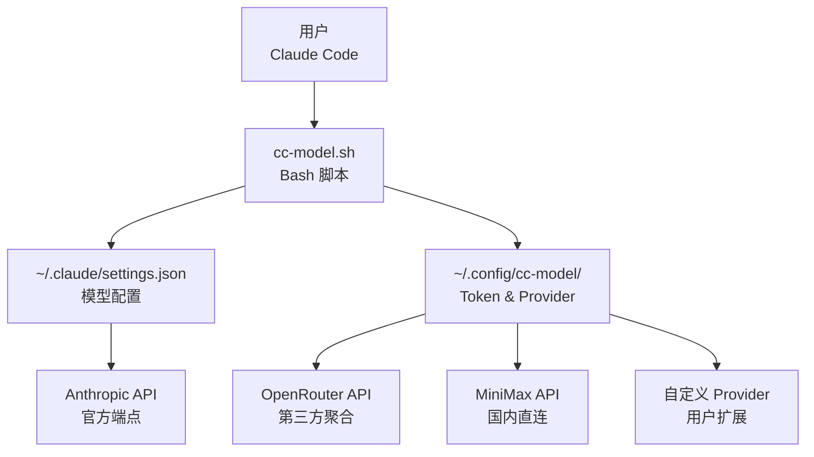
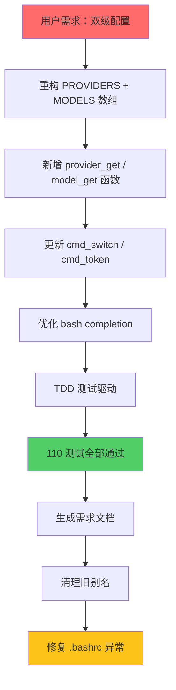
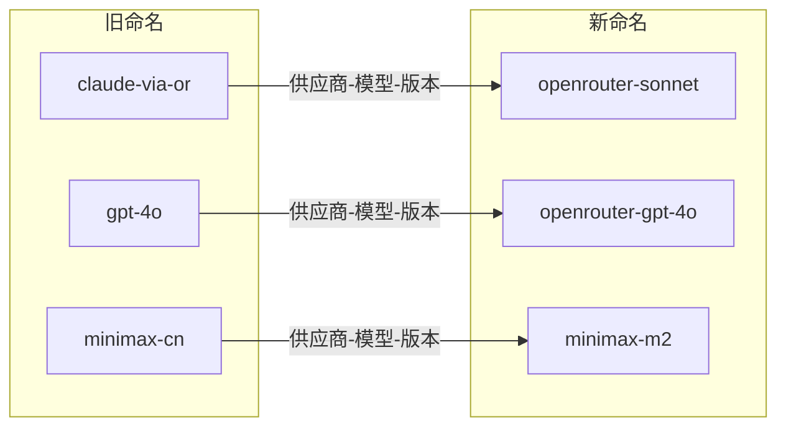
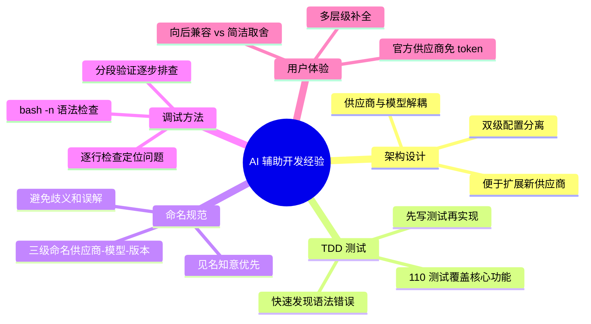
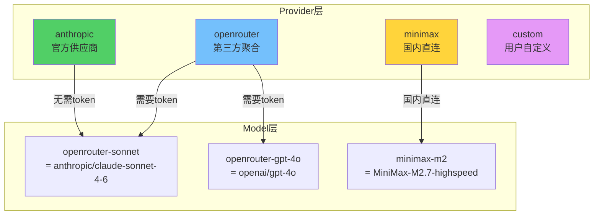

# cc-model 工具双级配置重构实践探索之旅

> **主题：** Claude Code 多模型切换工具重构 - 双级配置与命名规范优化
> **日期：** 2026-04-14
> **预计耗时：** 1.4 小时（02:01 ~ 03:24，无长时间空闲）
> **受众：** AI 学习者 / Claude Code 使用者 / Bash 脚本开发者
> **会话 ID：** `2026-04-14-sh-cc-model-refactor`
> **项目路径：** `/root/sh`
> **GitHub 地址：** git@github.com:chujun/aiubuntu1-sh.git
> **本文档链接：** https://github.com/chujun/aiubuntu1-sh/blob/main/doc/ai-explore/2026-04-14-cc-model%E5%8F%8C%E7%BA%A7%E9%85%8D%E7%BD%AE%E9%87%8D%E6%9E%84%E5%AE%9E%E8%B7%B5%E6%8E%A2%E7%B4%A2%E4%B9%8B%E6%97%85.md
> **本文档链接（编码版）：** https://github.com/chujun/aiubuntu1-sh/blob/main/doc/ai-explore/2026-04-14-cc-model%E5%8F%8C%E7%BA%A7%E9%85%8D%E7%BD%AE%E9%87%8D%E6%9E%84%E5%AE%9E%E8%B7%B5%E6%8E%A2%E7%B4%A2%E4%B9%8B%E6%97%85.md

---

## 目录

- [一、AI 角色与工作概述](#一ai-角色与工作概述)
- [二、主要用户价值](#二主要用户价值)
- [三、解决的用户痛点](#三解决的用户痛点)
- [四、开发环境](#四开发环境)
- [五、技术栈](#五技术栈)
- [六、AI 模型 / 插件 / Agent / 技能 / MCP 使用统计](#六ai-模型--插件--agent--技能--mcp-使用统计)
- [七、会话主要内容](#七会话主要内容)
- [八、关键决策记录](#八关键决策记录)
- [九、主要挑战与转折点](#九主要挑战与转折点)
- [十、用户提示词清单](#十用户提示词清单)
- [十一、AI 辅助实践经验](#十一ai-辅助实践经验)

---

## 一、AI 角色与工作概述

### 角色定位

| 角色 | 说明 |
|------|------|
| 开发者 | 负责 cc-model.sh 重构，实现双级配置架构 |
| 调试专家 | 排查 bash completion 异常、bash 语法错误 |
| 测试工程师 | TDD 驱动开发，编写 110 个测试用例 |
| 文档整理者 | 编写需求文档 cc-model-prd.md |

### 具体工作

- 重构 cc-model.sh，从单级模型映射改为供应商+模型双级配置架构
- 优化 bash completion，支持 5 层参数补全
- 统一命名规范：供应商-模型-版本 三级结构
- 移除旧别名（claude-via-or 等），避免用户混淆
- TDD 测试驱动：编写并通过 110 个测试用例
- 生成需求文档 cc-model-prd.md
- 排查并修复 .bashrc 中 [INFO] 异常输出问题

---

## 二、主要用户价值

1. **架构清晰**：供应商与模型分离，便于扩展新供应商和新模型
2. **命名规范**：供应商-模型-版本 三级命名，见名知意（如 `openrouter-sonnet`）
3. **官方免 token**：Anthropic 官方供应商无需配置 token，Claude Code 自动处理
4. **安全存储**：Token 文件权限 600，防止泄露
5. **Shell 补全**：多层级参数补全，提升操作效率
6. **向后兼容**：保留自定义供应商扩展能力

---

## 三、解决的用户痛点

| # | 用户痛点 | 简要描述 |
|---|---------|---------|
| 1 | 命名不直观 | `claude-via-or` 无法一眼看出是 OpenRouter 上的模型 |
| 2 | 缺乏扩展性 | 无法添加新的 API 供应商（如 Azure） |
| 3 | 官方/非官方混用 | 官方模型和非官方模型需要同等配置，体验不一致 |
| 4 | Shell 补全不完善 | 无法补全 token set 的 provider 参数 |

---

## 四、开发环境

- **OS：** Linux 6.8.0-107-generic (Ubuntu)
- **Shell：** Bash
- **编辑器：** Claude Code 内置编辑器
- **包管理器：** 无（纯 Bash 脚本）
- **测试框架：** 自定义 bash 测试框架

---

## 五、技术栈



| 层级 | 技术 | 说明 |
|------|------|------|
| 用户层 | Claude Code CLI | AI 编程工具 |
| 配置层 | settings.json | Claude Code 模型配置 |
| 脚本层 | cc-model.sh | 模型切换工具 |
| 存储层 | Token/Provider 文件 | 安全存储 |

---

## 六、AI 模型 / 插件 / Agent / 技能 / MCP 使用统计

### 6.1 AI 大模型

**配置模型（system-reminder 声明）：**

| 模型 ID | 名称 | 用途 | 调用范围 |
|---------|------|------|---------|
| `claude-haiku-4-5-20251001` | Haiku 4.5 | 主对话 | 全程 |

**实际调用模型：**

| 模型 ID | 模型名称 | 调用场景 | 说明 |
|---------|---------|---------|------|
| `claude-haiku-4-5-20251001` | Haiku 4.5 | 主对话 | 本次会话主力模型 |

### 6.2 开发工具

| 工具 | 用途 |
|------|------|
| Bash | 脚本执行、测试 |
| Python3 | JSON 处理、URL 编码 |
| Git | 版本管理 |

### 6.3 插件（Plugin）

无

### 6.4 Agent（智能代理）

本次会话未调用 Agent

### 6.5 技能（Skill）

| 技能名称 | 触发命令 | 触发方 | 调用次数 | 是否完整执行 |
|---------|---------|-------|---------|------------|
| tdd-workflow | `/tdd-workflow` | 用户 | 1 次 | ✅ 完整 |

### 6.6 MCP 服务

| MCP 服务 | 工具前缀 | 本次调用次数 | 说明 |
|---------|---------|------------|------|
| （未配置） | — | 0 | — |

### 6.7 Claude Code 工具调用统计

> ⚠️ 以下数据为基于会话记忆的估算值

| 工具 | 估算调用次数 |
|------|------------|
| Bash | ~25 |
| Read | ~15 |
| Edit | ~10 |
| Write | ~3 |
| Grep | ~5 |
| Glob | ~2 |

### 6.8 浏览器插件（用户环境）

无

---

## 七、会话主要内容

### 7.1 任务全景



### 7.2 核心问题 1：bash 语法错误排查

**问题描述：** 重构后 bash -n 报语法错误

**根因分析：**

```mermaid
flowchart LR
    A["bash -n 报错"] --> B["line 206: syntax error"]
    B --> C["逐一检查 heredoc"]
    C --> D["发现 model_get 函数"]
    D --> E["第109行缺少闭合括号"]
    E --> F["${BUILTIN_MODELS[${alias}"]}"]
    F --> G["应为 ${BUILTIN_MODELS[${alias}]}"]
```

**修复：** 在 `${alias}"` 后添加缺失的 `)`

### 7.3 核心问题 2：.bashrc 异常 [INFO] 输出

**问题描述：** source ~/.bashrc 时输出 [INFO] command not found

**根因分析：**

```mermaid
flowchart TD
    A["~/.bashrc 含异常行"] --> B["eval \"$(cc-model completion bash)\""]
    B --> C["重复添加多次"]
    C --> D["混入了 cc-model token set 的输出"]
    D --> E["[32m[INFO][0m 已备份..."]
    E --> F["清理 ~/.bashrc"]
    F --> G["重新添加补全"]
```

**修复：** sed 删除异常行，重新添加补全指令

### 7.4 命名规范重构



---

## 八、关键决策记录

| 决策点 | 选项 A | 选项 B | 最终选择 | 理由 |
|--------|--------|--------|---------|------|
| 命名规范 | 供应商-模型 二级 | 供应商-模型-版本 三级 | **三级** | 版本信息有助于区分不同版本模型 |
| 旧别名处理 | 保留兼容 | **直接移除** | 直接移除 | 避免用户混淆，减少维护成本 |
| 官方供应商 token | 需要配置 | **无需配置** | 无需配置 | Claude Code 原生支持官方认证 |
| Shell 补全 | 单层补全 | **多层级补全** | 多层级补全 | 提升操作效率，减少记忆负担 |

---

## 九、主要挑战与转折点

| 挑战 | 初始判断 | 实际根因 | 转折点 |
|------|---------|---------|--------|
| bash 语法错误 | Python heredoc 问题 | **model_get 函数缺少括号** | 逐行检查发现第 109 行 `${alias}"` 缺少 `)` |
| 命名不够直观 | claude-via-or 可以接受 | **不符合见名知意原则** | 用户明确要求改为供应商-模型-版本 三级 |
| .bashrc 异常 | eval 命令问题 | **混入了 cc-model token set 的输出** | 检查 ~/.bashrc 发现多行异常内容，手动清理 |

---

## 十、用户提示词清单（原文，一字未改）

### 【当前会话】

**提示词 1：**
```
cc-model 重要调整，支持双级配置，供应商，模型，claude code官网供应商可以不需要输入token，允许其他供应商支持claude code大模型
```

**提示词 2：**
```
使用cc-model-test.sh进行功能测试验证，并修复bug
```

**提示词 3：**
```
cc-model bash_completion优化
```

**提示词 4：**
```
cc-model如何切换到openrouter下的claude code大模型
```

**提示词 5：**
```
claude-via-or，这个名称不见名知意，优化这些类似名称
```

**提示词 6：**
```
统一采用供应商-大模型，这个命名方案
```

**提示词 7：**
```
可以，除了官网模型外，其他供应商的大模型命名都按照这个来 供应商-模型-版本，三级结构来命名
```

**提示词 8：**
```
旧别名不需要保留了，容易误导人
```

**提示词 9：**
```
根据聊天内容和代码，逆向生成需求文档,markdown格式
```

**提示词 10：**
```
root@aiubuntus1:~/sh# echo 'eval "$(cc-model completion bash)"' >> ~/.bashrc
root@aiubuntus1:~/sh# source ~/.bashrc
[INFO]: command not found
[INFO]: command not found
提示这个异常问题
```

**提示词 11：**
```
介绍下你，
```

**提示词 12：**
```
OpenRouter支持该大模型，请你排查根本原因
```

**提示词 13：**
```
/model
```

**提示词 14：**
```
/my-explore-doc-record
```

---

## 十一、AI 辅助实践经验（面向 AI 学习者）



| 经验 | 核心教训 |
|------|---------|
| TDD 测试驱动 | 先写测试再实现，能快速发现语法错误和逻辑问题 |
| 命名见名知意 | `openrouter-sonnet` 比 `claude-via-or` 更直观，减少用户认知负担 |
| 分层调试 | bash -n 检查语法、分段执行验证，逐步定位问题 |
| 用户反馈优先 | 用户明确要求移除旧别名时，及时调整而非保留兼容 |
| 安全存储 | Token 文件权限 600，防止泄露 |

---

## 附录：cc-model 双级配置架构



---

*文档生成时间：2026-04-14 | 由 Claude Haiku 4.5 (`claude-haiku-4-5-20251001`) 辅助生成*
