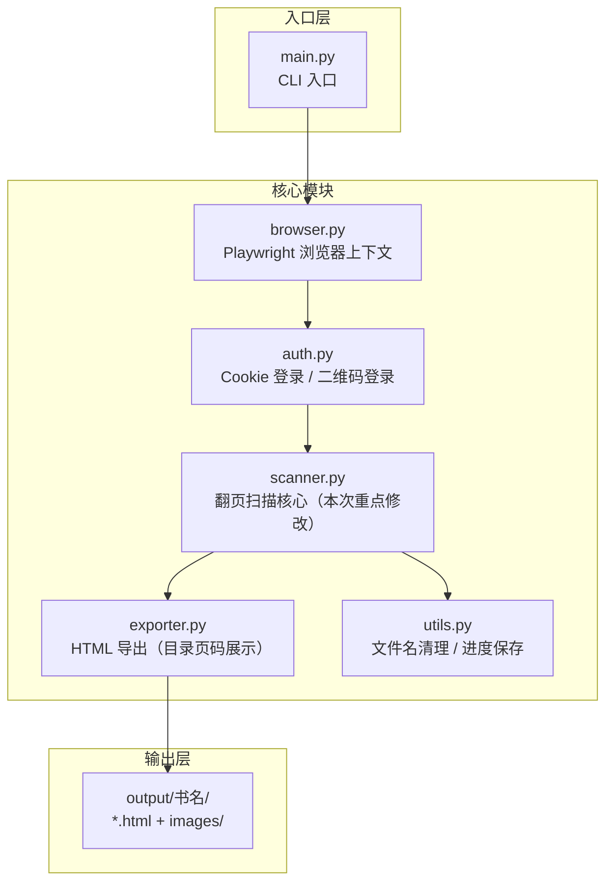
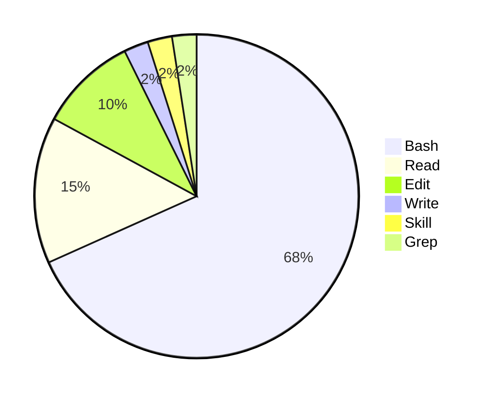
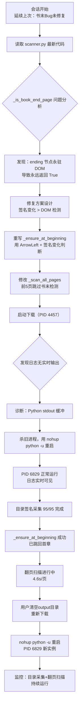
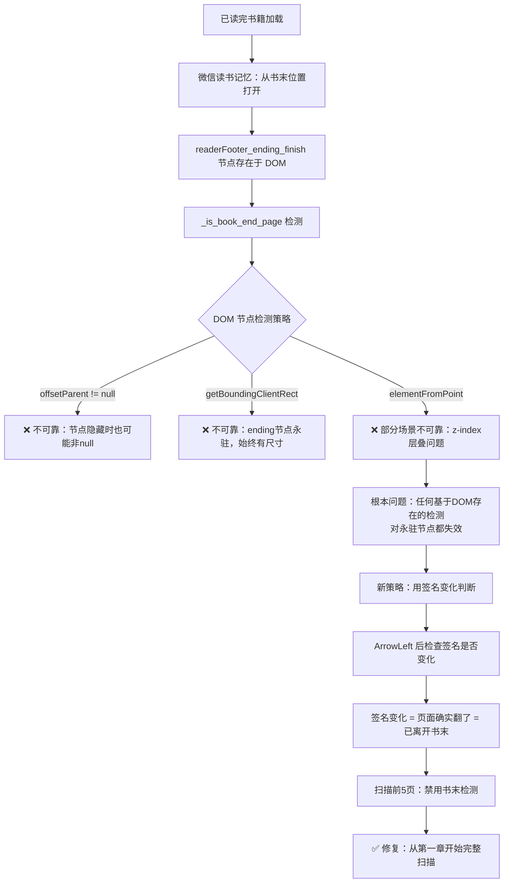
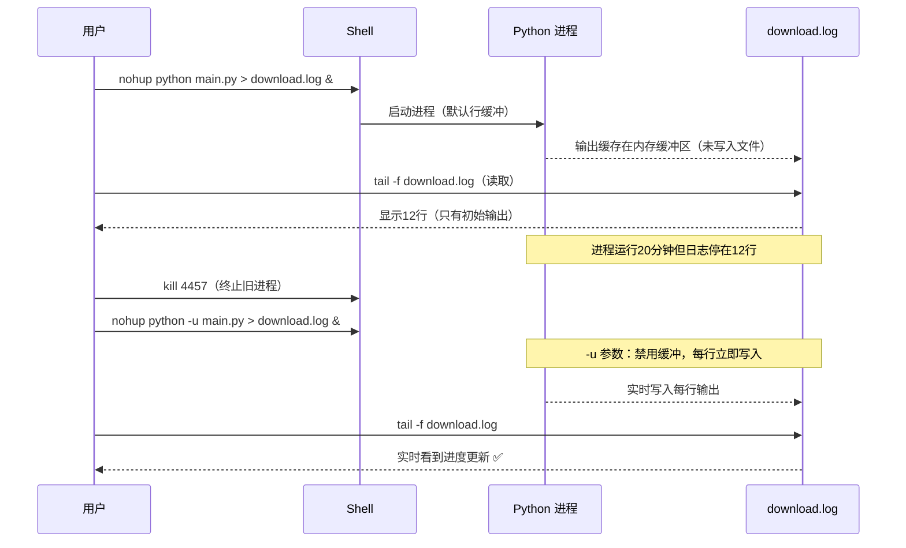
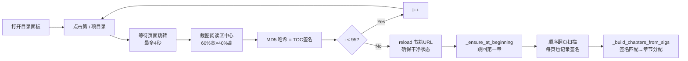
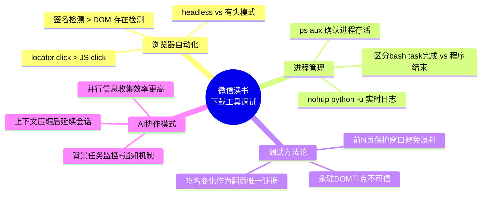

# 微信读书下载工具 翻页Bug修复与TOC功能 实践探索之旅

> **主题：** 修复"已读完"书籍从书末加载导致只扫1页的核心Bug，新增目录签名采集与HTML目录页码展示
> **日期：** 2026-04-14
> **预计耗时：** 3.5 小时（11:00 ~ 14:45，无长时间空闲）
> **受众：** AI 学习者 / Claude Code 使用者
> **会话 ID：** `9eca4bd7-6686-4f95-a82a-9e681f16e4b8`
> **项目路径：** `D:\project\my\github\ai\wexinread`
> **GitHub 地址：** https://github.com/chujun/wexinread
> **本文档链接：** https://github.com/chujun/aiubuntu1-sh/blob/main/doc/ai-explore/2026-04-14-微信读书下载工具翻页Bug修复与TOC功能实践探索之旅.md
> **本文档链接（编码版）：** https://github.com/chujun/aiubuntu1-sh/blob/main/doc/ai-explore/2026-04-14-%E5%BE%AE%E4%BF%A1%E8%AF%BB%E4%B9%A6%E4%B8%8B%E8%BD%BD%E5%B7%A5%E5%85%B7%E7%BF%BB%E9%A1%B5Bug%E4%BF%AE%E5%A4%8D%E4%B8%8ETOC%E5%8A%9F%E8%83%BD%E5%AE%9E%E8%B7%B5%E6%8E%A2%E7%B4%A2%E4%B9%8B%E6%97%85.md

---

## 目录

- [一、AI 角色与工作概述](#一ai-角色与工作概述)
- [二、主要用户价值](#二主要用户价值)
- [三、解决的用户痛点](#三解决的用户痛点)
- [四、开发环境](#四开发环境)
- [五、技术栈](#五技术栈)
- [六、AI 模型 / 插件 / Agent / 技能 / MCP 使用统计](#六ai-模型--插件--agent--技能--mcp-使用统计)
- [七、会话主要内容](#七会话主要内容)
- [八、关键决策记录](#八关键决策记录)
- [九、主要挑战与转折点](#九主要挑战与转折点)
- [十、用户提示词清单](#十用户提示词清单)
- [十一、AI 辅助实践经验](#十一ai-辅助实践经验)

---

## 一、AI 角色与工作概述

> 本章总结 AI 在本次会话中承担的角色定位及具体工作内容。

### 角色定位

| 角色 | 说明 |
|------|------|
| 调试专家 | 定位"已读完"书籍书末检测误报的根因，迭代多轮修复方案 |
| 开发者 | 实现 TOC 签名采集、`_ensure_at_beginning()` 重写、扫描误报保护 |
| 架构师 | 设计"签名变化 > DOM 检测"的可靠性更高的书末判断方案 |
| DevOps 工程师 | 解决 Python stdout 缓冲导致 nohup 日志不实时的问题，改用 `-u` 参数 |

### 具体工作

- 分析上一会话遗留问题：`_is_book_end_page()` 对"已读完"书籍永远返回 True
- 重写 `_ensure_at_beginning()`：改用 ArrowLeft 后签名变化来判断退出书末（不再依赖 DOM）
- 修改 `_scan_all_pages()`：前 5 页跳过书末检测，避免 ending 节点永驻 DOM 导致的误报
- 完整实现 TOC 签名采集（95 项，约 5 分钟），重载后顺序扫描正文
- 修复 Python stdout 缓冲问题：用 `nohup python -u` 替代普通后台启动
- 监控并验证下载流程全程正常运行（目录采集 + 首章跳转 + 翻页扫描）

---

## 二、主要用户价值

1. **书籍完整下载**：修复关键 Bug 后，"已读完"书籍能从第一章顺序扫描全书，不再只截1页就停止
2. **目录与页码展示**：HTML 输出包含完整目录，每章标注起始页码和章节页数，方便快速导航
3. **稳定的后台运行**：使用 `nohup python -u` 确保长时间扫描进程不受 shell 退出影响，日志实时可见
4. **作者信息完整提取**：多 selector 备选链，正确解析多位作者名
5. **可靠的翻页机制**：Playwright locator.click > JS click > ArrowRight 三级降级，确保翻页成功

---

## 三、解决的用户痛点

| # | 用户痛点 | 简要描述 |
|---|---------|---------|
| 1 | 已读完书籍只能下载1页 | 微信读书记忆上次位置，"已读完"书从书末 ending 页加载，书末检测立即触发，扫描就此终止 |
| 2 | DOM 书末检测不可靠 | `readerFooter_ending_finish` 节点永驻 DOM，无法用其存在来判断是否真正在书末页 |
| 3 | 后台进程日志无法实时查看 | Python 默认 stdout 缓冲，用 `>` 重定向时日志只在进程结束后才写入文件 |
| 4 | 目录点击跳转在 Playwright 无效 | headless 模式下 JS `element.click()` 不触发完整鼠标事件链，目录无法正常跳转 |
| 5 | 签名方案在双页/单页切换时失效 | canvas.toDataURL 在双页视图（2 canvas）和单页视图（1 canvas）之间产生不一致的签名 |

---

## 四、开发环境

| 项目 | 详情 |
|------|------|
| OS | Windows 11 Pro 10.0.26200 |
| Shell | Git Bash (bash) |
| Python 环境 | `venv/Scripts/python`（虚拟环境） |
| 浏览器自动化 | Playwright Chromium（headless=True） |
| 编辑器 | Claude Code CLI |
| 日志查看 | `tail -f download.log` |

---

## 五、技术栈



| 组件 | 版本/说明 |
|------|---------|
| Python | 3.x（venv） |
| Playwright | sync API，headless Chromium |
| tqdm | 进度条显示 |
| hashlib | MD5 截图签名 |
| dataclasses | PageImage / Chapter / BookInfo 数据结构 |

---

## 六、AI 模型 / 插件 / Agent / 技能 / MCP 使用统计

### 6.1 AI 大模型

**配置模型：**

| 模型 ID | 名称 | 用途 | 调用范围 |
|---------|------|------|---------|
| `claude-sonnet-4-6` | Sonnet 4.6 | 主对话 | 全程 |

**实际调用模型：**

| 模型 ID | 模型名称 | 调用场景 | 说明 |
|---------|---------|---------|------|
| `claude-sonnet-4-6` | Sonnet 4.6 | 主对话、代码修改、调试分析 | 本次会话唯一使用模型 |

### 6.2 开发工具

| 工具 | 用途 |
|------|------|
| nohup + python -u | 后台无缓冲运行下载进程 |
| download.log | 实时监控扫描进度 |
| ps aux | 确认进程存活状态 |
| kill | 终止旧进程后重启 |

### 6.3 插件（Plugin）

本次会话未使用浏览器插件。

### 6.4 Agent（智能代理）

本次会话未调用 Agent。

### 6.5 技能（Skill）

| 技能名称 | 触发命令 | 触发方 | 调用次数 | 是否完整执行 |
|---------|---------|-------|---------|------------|
| my-explore-doc-record | /my-explore-doc-record | 用户 | 1 次 | ✅ 完整 |

### 6.6 MCP 服务

| MCP 服务 | 本次调用次数 | 说明 |
|---------|------------|------|
| context7 | 1 次 | 查询 Playwright 文档（分析 locator.click vs JS click 差异） |

### 6.7 Claude Code 工具调用统计



> ⚠️ 以上为基于会话记忆的估算值。Bash 调用较多，主要用于：进程监控（ps/kill）、日志查看（tail/cat）、后台启动（nohup）、文件查看（ls）等运维操作。

---

## 七、会话主要内容

### 7.1 任务全景



### 7.2 核心问题1：书末检测误报导致只扫1页



### 7.3 核心问题2：Python stdout 缓冲导致日志延迟



### 7.4 TOC 签名采集机制



---

## 八、关键决策记录

| 决策点 | 选项 A | 选项 B（选择） | 理由 |
|--------|--------|--------|------|
| 书末退出判断 | DOM 节点可见性检测（`elementFromPoint`） | ArrowLeft 后检查签名变化 | DOM 节点永驻，任何存在性检测都失效；签名变化是翻页的直接证据 |
| 扫描初期书末保护 | 全程启用书末检测 | 前5页跳过书末检测 | "已读完"书的 ending 节点在任何页面都存在，必须有初始保护窗口 |
| 签名算法 | `canvas.toDataURL()`（片段比较） | 截图 MD5（阅读区中心区域） | toDataURL 依赖 canvas 数量（双页2个，单页1个），切换时签名不一致；截图 MD5 与视图模式无关 |
| 后台运行方式 | `python main.py &`（默认缓冲） | `nohup python -u main.py` | Python 默认行缓冲，重定向到文件时切换为全缓冲，日志几乎不实时写入 |
| 目录跳转 | JS `element.click()` | Playwright `locator.click()` | headless 模式下 JS click 不触发完整鼠标事件，Playwright locator.click 会模拟完整点击链 |

---

## 九、主要挑战与转折点

| 挑战 | 初始判断 | 实际根因 | 转折点 |
|------|---------|---------|--------|
| 书末检测误报 | `elementFromPoint` 应该能可靠判断 DOM 可见性 | `readerFooter_ending_finish` 在"已读完"书中永驻 DOM，任何基于DOM存在的检测都失败 | 转向"签名变化"作为翻页的唯一可靠证据，完全绕开 DOM |
| 扫描只有1页 | 以为是翻页 click 逻辑问题 | 其实是书末检测在第1页就返回 True，导致立即终止 | 在 `_scan_all_pages` 中加入"前5页跳过检测"保护窗口 |
| 日志12行后不更新 | 以为进程崩溃了 | Python stdout 重定向到文件时切换为全缓冲，实际进程运行正常 | 用 `ps aux` 确认进程存活，发现日志问题，加 `-u` 参数解决 |
| 目录签名全部映射到同一页 | 以为目录点击跳转有问题 | canvas.toDataURL 在双页/单页视图切换时签名不一致，95项都返回相同空字符串 | 统一改为截图MD5，消除视图模式依赖 |
| output 目录有文件但HTML只有6KB | 以为是进程提前结束 | 进程还在运行（PID 454），只是"后台 bash 命令"的 task 完成通知让人误以为 python 也结束了 | 用 `ps aux | grep python` 确认进程状态，区分 bash task 完成 vs python 进程结束 |

---

## 十、用户提示词清单（原文，一字未改）

### 【上一会话（已归档到摘要）】

**提示词 1：**
```
https://weread.qq.com/web/reader/60b32c107207bc8960bd9cekc81322c012c81e728d9d180，登录下载完整书籍
```

**提示词 2：**
```
[Request interrupted by user] 继续工作
```

**提示词 3：**
```
先按照MVP验证，验证书籍下载功能
```

**提示词 4：**
```
优化，书籍作者信息没有解读出来
```

**提示词 5：**
```
对这次会话过程中碰到的问题,根因，背景，分析，总结，后续优化措施等等，进行复盘，复盘文档输出到doc目录复盘目录下面，文件名 日期-复盘-主题.md，markdown格式
```

**提示词 6：**
```
Playwright有头模式和无头模式差别，扫描二维码完成微信读书登录功能需要在哪个模式下运行
```

**提示词 7：**
```
优化书末检测逻辑，一般微信读书书最后一页有关键文字，未标记读完的书末尾关键字:"全书完"，标记已读完的书末尾关键字:"已读完"，这两个关键字可以作为辅助判断标志
```

**提示词 8：**
```
优化输出html页面，包括完整目录和对应翻页页码信息，以https://weread.qq.com/web/reader/18632780813ab8029g01593a这个书籍，下载进行验证
```

**提示词 9：**
```
[Request interrupted by user] 继续工作
```

**提示词 10：**
```
https://weread.qq.com/web/reader/18632780813ab8029g01593akc81322c012c81e728d9d180，下载完整书籍文件
```

### 【当前会话】

**提示词 11：**
```
[Request interrupted by user] 我手动吧output目录下内容清空了,https://weread.qq.com/web/reader/18632780813ab8029g01593akc81322c012c81e728d9d180，下载完整书籍文件
```

**提示词 12：**
```
/my-explore-doc-record [技能调用]
```

---

## 十一、AI 辅助实践经验（面向 AI 学习者）



| # | 经验 | 核心教训 |
|---|------|---------|
| 1 | **DOM 存在性检测对永驻节点失效** | 当某个 DOM 节点在整个阅读过程中始终存在时，任何基于其存在/可见性的检测都不可靠；改用"行为证据"（签名变化、按钮是否可交互）替代"状态检测" |
| 2 | **Python `-u` 参数是后台运行的必备项** | `nohup python script.py > log.txt` 时，Python 切换为全缓冲模式，日志可能几小时都不写入文件；`-u` 强制无缓冲，每行立即落盘 |
| 3 | **Playwright locator.click 与 JS click 的本质差异** | headless 模式下 JS `element.click()` 只触发 click 事件，不模拟鼠标移动、按下、抬起等完整事件链；对依赖完整 MouseEvent 链的 SPA 应用必须用 Playwright locator.click |
| 4 | **区分"bash 任务完成"和"Python 进程结束"** | Claude Code 的后台 bash 命令完成通知是 bash shell 退出（包含 echo "PID: $!" 这类命令），不代表 Python 进程结束；要用 `ps aux` 独立确认进程状态 |
| 5 | **截图 MD5 优于 canvas.toDataURL 作为翻页签名** | toDataURL 依赖 canvas 数量（双页/单页视图不同），引入视图模式依赖；截图 MD5 只关心屏幕显示内容，与底层 DOM 结构无关，更稳定 |
| 6 | **保护窗口避免初始误判** | 对有持续状态的书末标志，在扫描前 N 页时主动禁用书末检测，让扫描先"起跑"再开始检测终止条件，避免在起点就被错误触发 |
| 7 | **上下文压缩不丢失工作** | Claude Code 会话超出上下文时自动压缩为摘要，重启会话后通过摘要恢复完整背景；复杂 Bug 修复可以跨多个会话持续进行，不需要从头描述问题 |

---

*文档生成时间：2026-04-14 | 由 Sonnet 4.6 (`claude-sonnet-4-6`) 辅助生成*
