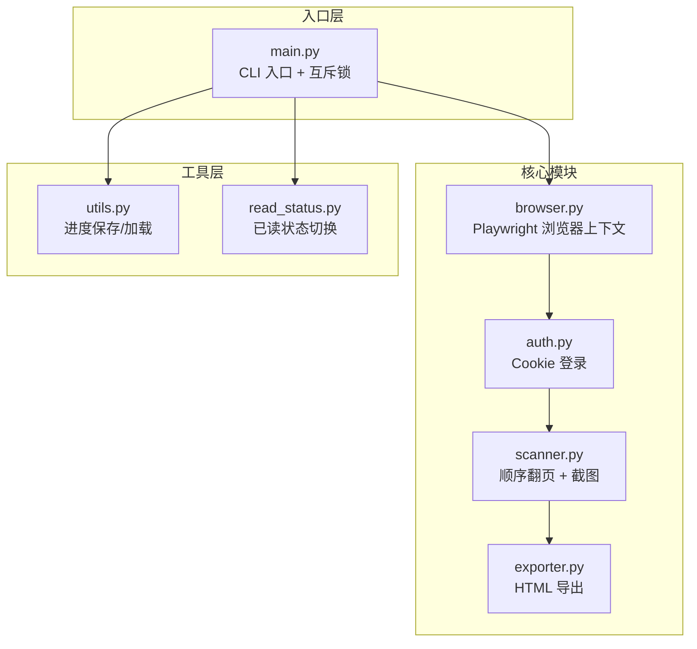
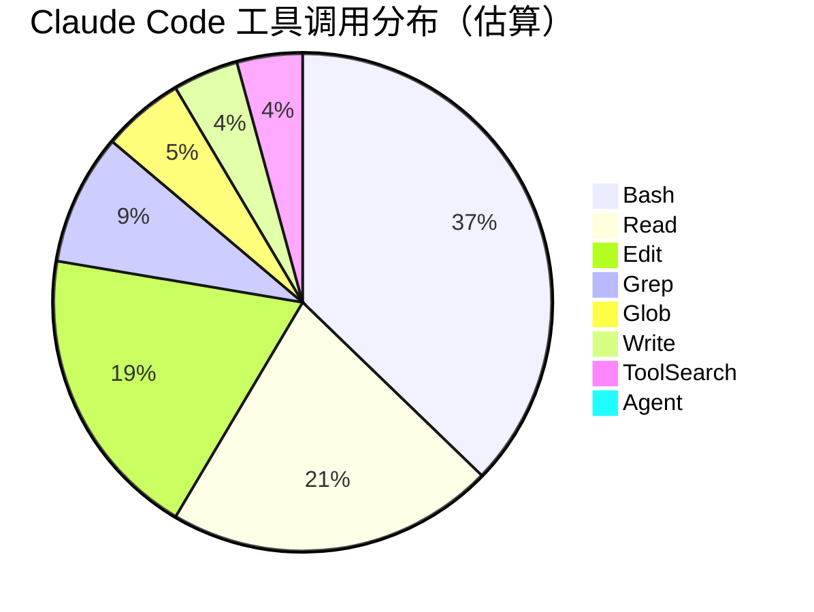
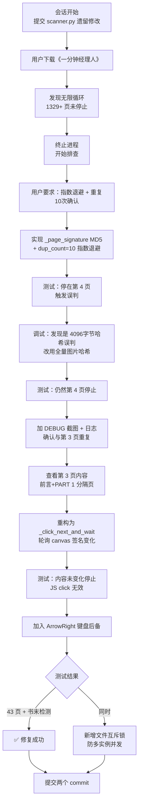
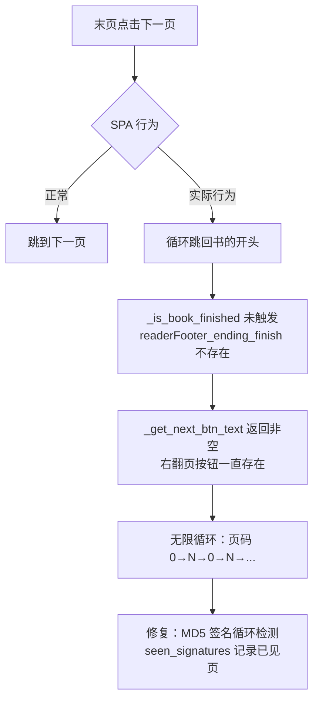
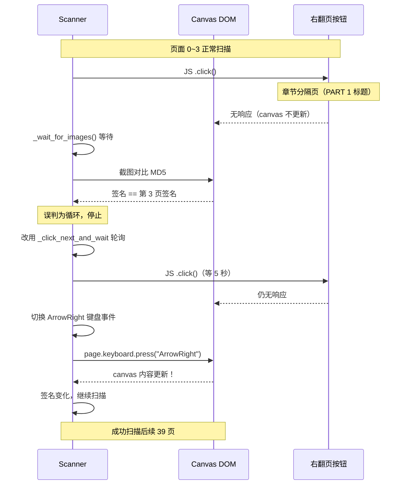
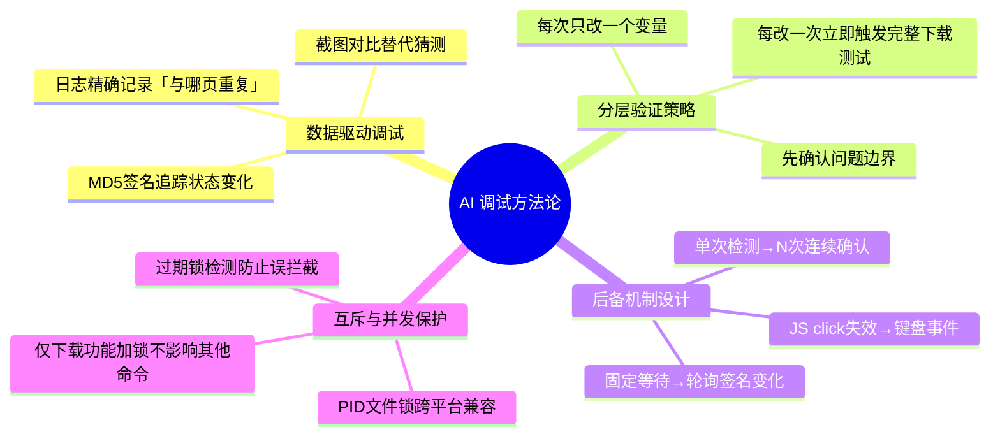

# wexinread 微信读书下载器 Bug 修复实践探索之旅

> **主题：** 翻页卡死与末页检测两大 Bug 的根因分析与修复全过程
> **日期：** 2026-04-15
> **预计耗时：** 4.0 小时（07:25 ~ 15:30，扣除上午 09:00~13:00 空闲约 4h）
> **受众：** AI 学习者 / Claude Code 使用者
> **会话 ID：** `9aeaa44f-c48c-4a97-9e2b-1783f6a5bb29`
> **项目路径：** `D:\project\my\github\ai\wexinread`
> **GitHub 地址：** `git@github.com:chujun/wexinread.git`
> **本文档链接：** [2026-04-15-wexinread微信读书下载器Bug修复实践探索之旅.md](https://github.com/chujun/aiubuntu1-sh/blob/main/doc/ai-explore/2026-04-15-wexinread微信读书下载器Bug修复实践探索之旅.md)
> **本文档链接（编码版）：** [点击打开（URL 编码）](https://github.com/chujun/aiubuntu1-sh/blob/main/doc/ai-explore/2026-04-15-wexinread%E5%BE%AE%E4%BF%A1%E8%AF%BB%E4%B9%A6%E4%B8%8B%E8%BD%BD%E5%99%A8Bug%E4%BF%AE%E5%A4%8D%E5%AE%9E%E8%B7%B5%E6%8E%A2%E7%B4%A2%E4%B9%8B%E6%97%85.md)

---

## 目录

- [一、AI 角色与工作概述](#一ai-角色与工作概述)
- [二、主要用户价值](#二主要用户价值)
- [三、解决的用户痛点](#三解决的用户痛点)
- [四、开发环境](#四开发环境)
- [五、技术栈](#五技术栈)
- [六、AI 模型 / 插件 / Agent / 技能 / MCP 使用统计](#六ai-模型--插件--agent--技能--mcp-使用统计)
- [七、会话主要内容](#七会话主要内容)
- [八、关键决策记录](#八关键决策记录)
- [九、主要挑战与转折点](#九主要挑战与转折点)
- [十、用户提示词清单](#十用户提示词清单)
- [十一、AI 辅助实践经验](#十一ai-辅助实践经验)

---

## 一、AI 角色与工作概述

> 本章总结 AI 在本次会话中承担的角色定位及具体工作内容。

### 角色定位

| 角色 | 说明 |
|------|------|
| 调试专家 | 分析无限循环、翻页卡死等 Bug 的根本原因，通过日志、截图逐步缩小问题范围 |
| 开发者 | 编写 `_page_signature()`、`_click_next_and_wait()` 等新方法，重构翻页主循环 |
| DevOps 工程师 | 新增进程互斥锁机制，防止多实例并发下载互相干扰 |
| 测试工程师 | 针对每次修复立即触发下载验证，分析输出日志确认修复效果 |

### 具体工作

- 分析下载无限循环根因（1329+ 页），设计并实现基于 MD5 签名的循环检测机制
- 定位"4 页后卡死"问题：通过调试截图发现 JS `.click()` 在章节分隔页无法推进 canvas
- 实现 `_click_next_and_wait()`：轮询 canvas 签名变化，5 秒无效自动切换 ArrowRight 键盘导航
- 新增文件锁机制（`_acquire_lock` / `_release_lock`），基于 PID 校验过期锁
- 提交两个 fix/feat commit，修复后成功扫描《一分钟经理人（新版）》43 页

---

## 二、主要用户价值

- **消除无限循环**：原始下载跑了 40 分钟仍未停止（1329+ 页），修复后能正确检测书末并终止
- **修复翻页卡死**：章节分隔页（PART 1 标题页）导致翻页永久卡死，键盘事件后备方案彻底解决
- **防多实例干扰**：文件锁确保同一时刻只有一个下载进程，避免 cookie 竞争和浏览器冲突
- **调试手段沉淀**：调试截图 + canvas 签名追踪的方法论固化为可复用的代码模式

---

## 三、解决的用户痛点

| # | 用户痛点 | 简要描述 |
|---|---------|---------|
| 1 | 下载无限循环无法终止 | 书籍末页检测失效，翻页在书末循环跳回，导致进程永不退出 |
| 2 | 章节分隔页翻页卡死 | JS click 在特定页面无响应，扫描在第 4 页后永远停滞 |
| 3 | 多实例并发互相干扰 | 同时启动多个下载命令导致 cookie/浏览器状态冲突 |
| 4 | 调试信息不足难以定位 | 无法知道是哪一页触发了重复检测，调试方向全凭猜测 |

---

## 四、开发环境

| 项目 | 详情 |
|------|------|
| OS | Windows 11 Pro 10.0.26200 |
| Shell | Git Bash (bash) |
| Python | venv 虚拟环境，`venv/Scripts/python` |
| 浏览器自动化 | Playwright + Chromium（headless=True） |
| 包管理 | pip + requirements.txt |
| 版本控制 | Git，分支 main |

---

## 五、技术栈



| 模块 | 技术 | 用途 |
|------|------|------|
| Playwright | `playwright.sync_api` | 无头浏览器控制、截图、键盘事件 |
| hashlib | Python 标准库 MD5 | canvas 页面签名，循环检测 |
| tqdm | 进度条库 | 翻页进度可视化 |
| Pillow（间接） | 图像处理 | HTML 导出图片嵌入 |

---

## 六、AI 模型 / 插件 / Agent / 技能 / MCP 使用统计

### 6.1 AI 大模型

**配置模型：**

| 模型 ID | 名称 | 用途 | 调用范围 |
|---------|------|------|---------|
| `claude-sonnet-4-6` | Sonnet 4.6 | 主对话 | 全程 |

**实际调用模型：**

| 模型 ID | 模型名称 | 调用场景 | 说明 |
|---------|---------|---------|------|
| `claude-sonnet-4-6` | Sonnet 4.6 | 主对话 | 全程使用，用户通过 `/model` 确认为 Sonnet 4.6 (default) |

### 6.2 开发工具

| 工具 | 版本/类型 | 用途 |
|------|---------|------|
| Claude Code CLI | 最新 | 主交互界面 |
| Git | — | 代码版本管理 |
| Playwright | Python 版 | 浏览器自动化 |

### 6.3 插件（Plugin）

| 插件 | 来源 | 是否使用 |
|------|------|---------|
| everything-claude-code | GitHub marketplace | 已启用（提供 Agent 扩展能力） |

### 6.4 Agent（智能代理）

本次会话未主动调用 Agent 子代理，所有工作由主对话完成。

### 6.5 技能（Skill）

| 技能名称 | 触发命令 | 触发方 | 调用次数 | 是否完整执行 |
|---------|---------|-------|---------|------------|
| my-explore-doc-record | `/my-explore-doc-record` | 用户 | 1 次 | ✅ 执行中 |

### 6.6 MCP 服务

本次 `~/.claude/settings.json` 中未配置任何 MCP 服务。

会话中曾加载 `mcp__playwright__browser_*` 工具（通过 ToolSearch），但由于独立 MCP 浏览器上下文没有书籍 cookie，实际未进行书籍页面调试操作。

| MCP 服务 | 本次调用 | 说明 |
|---------|---------|------|
| playwright（deferred） | 0 次实际调用 | 加载了工具 schema 但未执行，改用代码层面调试 |
| context7 | 0 次 | 本次无需查阅库文档 |

### 6.7 Claude Code 工具调用统计（估算）



> ⚠️ 以上为基于会话记忆的估算值，非精确统计。Bash 占比最高，因为多次后台下载任务监控和 git 操作均通过 Bash 执行。

---

## 七、会话主要内容

### 7.1 任务全景



### 7.2 核心问题一：无限循环（1329+ 页）

**根因分析：**



**修复代码核心：**
```python
def _page_signature(self, images: list[bytes]) -> str:
    h = hashlib.md5()
    for img in images:
        h.update(img)  # 全量数据，避免纯背景误判
    return h.hexdigest()
```

### 7.3 核心问题二：翻页卡死（第 4 页后停止）

**根因追踪时序：**



---

## 八、关键决策记录

| 决策点 | 选项 A | 选项 B（选择） | 理由 |
|--------|--------|--------------|------|
| 循环检测哈希范围 | 取前 4096 字节（快） | 全量图片 MD5 | 前 4KB 均为 PNG 文件头 + 纯背景压缩数据，在稀疏页面间产生误判 |
| 重复确认阈值 | 1 次即停 | 10 次 + 指数退避 | 用户反馈有过误判场景，canvas 渲染慢时需等待 |
| 翻页失败后备方案 | 抛出异常退出 | ArrowRight 键盘事件 | 部分 SPA 页面响应键盘而非鼠标点击，保留后备避免误判书末 |
| 互斥锁实现 | 系统 fcntl 锁 | PID 文件锁 | 跨平台兼容（Windows 无 fcntl），PID 检测可处理进程崩溃后的过期锁 |
| 非紧邻重复判断 | 所有重复均停止 | 仅 matched < page_idx-1 才算循环 | 避免相同布局的章节分隔页（page N 和 page N+2 外观相同）被误判为循环 |

---

## 九、主要挑战与转折点

| 挑战 | 初始判断 | 实际根因 | 转折点 |
|------|---------|---------|--------|
| 无限循环 1329+ 页 | `_is_book_finished` 阈值设置过高 | SPA 书末后循环跳回开头，两种末页检测条件均失效 | 用户终止进程后开始系统性排查 |
| 哈希误判：仅 4096 字节 | 4KB 已足以区分不同页内容 | PNG 前 4KB 为文件头 + 稀疏背景压缩数据，章节分隔页与空页相同 | 对比页面文件大小（27KB vs 226KB）发现差异 |
| 重试点击仍卡死 | 等待时间不够，canvas 渲染慢 | JS `.click()` 在章节分隔页根本不触发 SPA 翻页逻辑 | 调试截图直接显示 canvas 内容与 page 3 一字不差 |
| 键盘事件找到突破口 | 尝试了 10 次重试 + 2 分钟等待仍失败 | 该特定页面只响应键盘 `ArrowRight` 而非按钮 click | `_click_next_and_wait` 5 秒超时后自动切换 ArrowRight，43 页扫描成功 |

---

## 十、用户提示词清单（原文，一字未改）

### 【上一会话（已归档到摘要）】

**提示词 1：**
```
不要自行在集成测试用例重复造轮子，看看项目代码中是否存在已有方法可以实现相关功能了，然后在继续集成测试用例
```

**提示词 2：**
```
下载https://weread.qq.com/web/reader/5e732740813aba83bg015cbe这本书
```

### 【当前会话】

**提示词 3：**
```
https://weread.qq.com/web/reader/ea8328805bfe6bea8b4568ckc81322c012c81e728d9d180，下载这本书
```

**提示词 4：**
```
任务还没有暂停吗，是不是碰到没法正常结束的问题了
```

**提示词 5：**
```
之前出现过误判断重复的场景，建议先配置成重复10次，然后微信读书页面canvas有些特殊时候渲染比较慢，等发现重复页面时，采用指数退避算法进行重复检测
```

**提示词 6：**
```
暂停所有下载程序，同一时刻一个书籍只允许一个下载程序，避免相互干扰
```

**提示词 7（接续 6，同消息）：**
```
然后继续上面的工作
```

**提示词 8：**
```
继续
```

**提示词 9：[技能调用]**
```
/my-explore-doc-record
```

---

## 十一、AI 辅助实践经验（面向 AI 学习者）



| 经验 | 核心教训 |
|------|---------|
| **截图是最直接的调试工具** | 当日志说"与第 3 页重复"时，立即保存那个"重复页"的截图，才能发现 canvas 根本没有更新——而不是继续猜测等待时间不够 |
| **哈希范围必须覆盖内容区域** | 取前 N 字节做签名的方案在图像数据中极易失效：PNG 文件头 + 纯背景压缩数据在稀疏页面间完全相同，必须对全量数据做哈希 |
| **轮询优于固定等待** | `wait_for_timeout(800)` 是盲等，`_click_next_and_wait()` 主动轮询签名变化，既更快（内容变化立即继续）又更准确（等够了才确认失败） |
| **多种触发机制互为备份** | SPA 的导航响应因页面状态而异，JS click / 键盘事件 / 鼠标拖拽各有适用场景，单一方案必然有死角 |
| **用户领域知识缩短调试路径** | "canvas 有时渲染慢"→指数退避；"之前误判过"→10次确认阈值。用户对产品行为的了解直接指导了技术参数选择 |
| **过程文档与 commit 同步** | 每次有效修复立即 commit（含清晰 commit message），避免多次失败尝试混在同一 commit 里污染 git 历史 |

---

*文档生成时间：2026-04-15 | 由 Sonnet 4.6 (`claude-sonnet-4-6`) 辅助生成*
