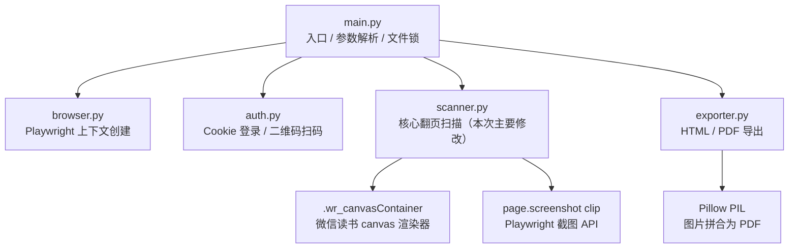
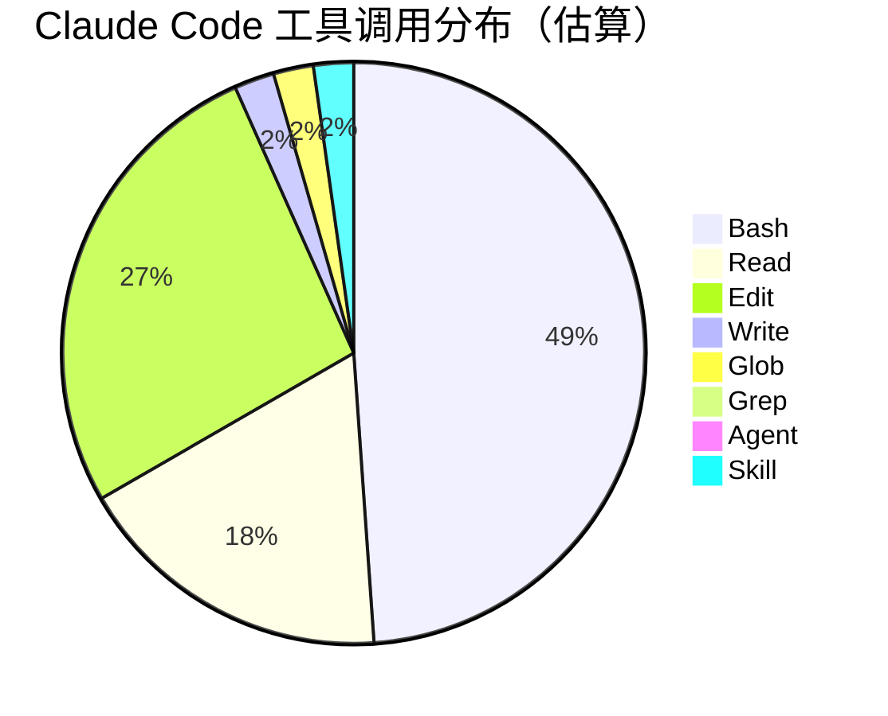
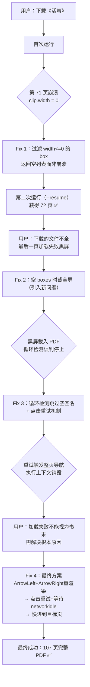
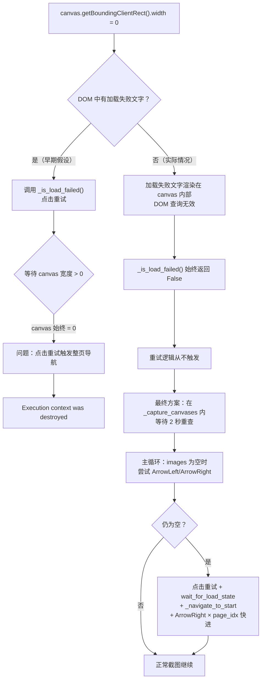
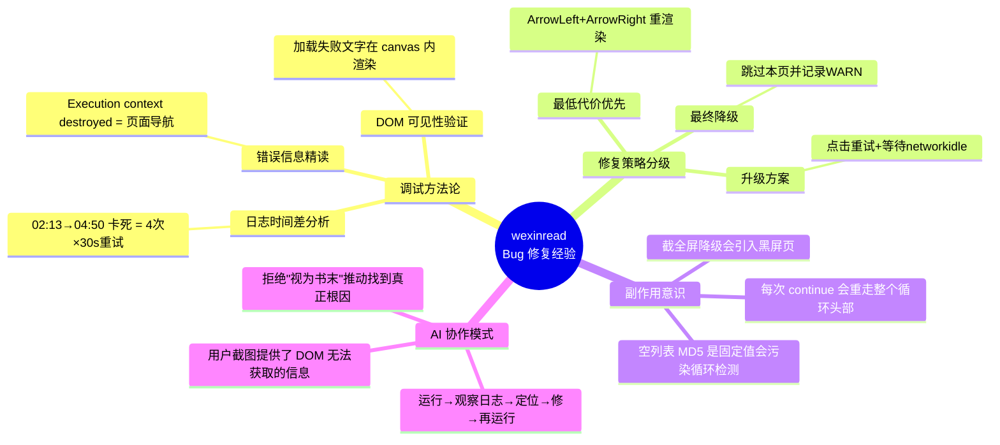

# wexinread 加载失败 Bug 修复实践探索之旅

> **主题：** 微信读书下载器 canvas 加载失败及截图崩溃 Bug 修复
> **日期：** 2026-04-21
> **预计耗时：** 1.5 小时（09:25 ~ 11:00，无长时间空闲）
> **受众：** AI 学习者 / Claude Code 使用者
> **会话 ID：** `6cdcd2e8-0521-4614-aace-a2321887a4e1`
> **项目路径：** `D:\project\my\github\ai\wexinread`
> **GitHub 地址：** https://github.com/chujun/wexinread
> **本文档链接：** https://github.com/chujun/aiubuntu1-sh/blob/main/doc/ai-explore/2026-04-21-wexinread加载失败Bug修复实践探索之旅.md
> **本文档链接（编码版）：** https://github.com/chujun/aiubuntu1-sh/blob/main/doc/ai-explore/2026-04-21-wexinread%E5%8A%A0%E8%BD%BD%E5%A4%B1%E8%B4%A5Bug%E4%BF%AE%E5%A4%8D%E5%AE%9E%E8%B7%B5%E6%8E%A2%E7%B4%A2%E4%B9%8B%E6%97%85.md

---

## 目录

- [一、AI 角色与工作概述](#一ai-角色与工作概述)
- [二、主要用户价值](#二主要用户价值)
- [三、解决的用户痛点](#三解决的用户痛点)
- [四、开发环境](#四开发环境)
- [五、技术栈](#五技术栈)
- [六、AI 模型 / 插件 / Agent / 技能 / MCP 使用统计](#六ai-模型--插件--agent--技能--mcp-使用统计)
- [七、会话主要内容](#七会话主要内容)
- [八、关键决策记录](#八关键决策记录)
- [九、主要挑战与转折点](#九主要挑战与转折点)
- [十、用户提示词清单](#十用户提示词清单)
- [十一、AI 辅助实践经验](#十一ai-辅助实践经验)

---

## 一、AI 角色与工作概述

> 本章总结 AI 在本次会话中承担的角色定位及具体工作内容。

### 角色定位

| 角色 | 说明 |
|------|------|
| 调试专家 | 定位 Playwright canvas 截图崩溃及加载失败的根本原因 |
| 开发者 | 修复 scanner.py 中多处 Bug，新增加载失败恢复机制 |
| 代码审查者 | 分析修复过程中引入的新问题（空签名误判循环、执行上下文销毁） |

### 具体工作

- 执行书籍下载命令，复现并定位首个崩溃（`clip.width not to be 0`）
- 分析 canvas 容器宽度为 0 的多种根因（渲染延迟 vs 加载失败 vs 页面导航）
- 多轮迭代修复加载失败处理逻辑，处理"点击重试"触发整页导航的边界情况
- 修复 `empty_retries` 循环与 `_is_load_failed` 重复调用导致 2 分钟卡死的问题
- 修复空签名被纳入循环检测导致扫描提前终止的 Bug
- 实现最终方案：ArrowLeft/ArrowRight 重渲染 → 点击重试 + 等待 networkidle + 快进翻页

---

## 二、主要用户价值

- 书籍下载不再在特定页面崩溃，Playwright 截图调用不会再收到 `width=0` 错误
- 网络抖动导致的"加载失败"页面可自动重试并恢复，无需用户手动干预
- 恢复机制不会丢失已扫描页面，也不会截入黑屏无效图
- 修复后成功完整下载《活着》107 页并导出为 PDF

---

## 三、解决的用户痛点

| # | 用户痛点 | 简要描述 |
|---|---------|---------|
| 1 | 下载中途崩溃 | 第 71 页截图时 canvas 宽度为 0，Playwright 抛出异常导致整个下载任务失败 |
| 2 | 加载失败无法自愈 | 微信读书 canvas 偶发"加载失败"，程序不知道如何自动点击重试并恢复 |
| 3 | 重试后丢页或截黑屏 | 早期修复版本点击重试后截到黑屏，或由于循环检测误判提前停止扫描 |
| 4 | 调试难以复现 | 加载失败是偶发性网络问题，每次重跑可能正常；日志中没有关键状态信息难以定位 |

---

## 四、开发环境

| 项目 | 说明 |
|------|------|
| OS | Windows 11 Pro 10.0.26200 |
| Shell | Git Bash (unix 语法) |
| Python | venv 虚拟环境，`venv/Scripts/python` |
| 浏览器自动化 | Playwright (headless Chromium) |
| 运行方式 | `PYTHONIOENCODING=utf-8 venv/Scripts/python main.py --url <URL> --format pdf` |

---

## 五、技术栈



| 组件 | 版本/说明 |
|------|---------|
| Python | 3.x（venv 管理） |
| Playwright | sync API，headless Chromium |
| tqdm | 翻页进度条 |
| Pillow (PIL) | PDF 导出 |
| hashlib | canvas MD5 签名，用于循环检测 |

---

## 六、AI 模型 / 插件 / Agent / 技能 / MCP 使用统计

### 6.1 AI 大模型

**配置模型（system-reminder 声明）：**

| 模型 ID | 名称 | 用途 | 调用范围 |
|---------|------|------|---------|
| `claude-sonnet-4-6` | Sonnet 4.6 | 主对话 | 全程 |

**实际调用模型：**

| 模型 ID | 模型名称 | 调用场景 |
|---------|---------|---------|
| `claude-sonnet-4-6` | Sonnet 4.6 | 主对话全程，无子代理 |

### 6.2 开发工具

| 工具 | 说明 |
|------|------|
| Playwright | 浏览器自动化，headless 截图 |
| Git Bash | 命令执行 |
| pip / venv | Python 依赖管理 |

### 6.3 Agent（智能代理）

本次会话未调用任何 Agent。

### 6.4 技能（Skill）

| 技能名称 | 触发命令 | 触发方 | 调用次数 | 是否完整执行 |
|---------|---------|-------|---------|------------|
| my-explore-doc-record | /my-explore-doc-record | 用户 | 1 次 | ✅ 完整 |

### 6.5 MCP 服务

本次会话未配置 MCP 服务，全程使用内置工具。

### 6.6 Claude Code 工具调用统计（估算）



> ⚠️ 以上数据为基于会话记忆的估算值，非精确统计。Bash 调用次数最多，主要用于执行下载命令和观察输出；Edit 次之，用于多轮迭代修改 scanner.py。

---

## 七、会话主要内容

### 7.1 任务全景



### 7.2 根因分析：canvas 宽度为 0



### 7.3 关键副作用：empty_retries 循环放大等待

```mermaid
sequenceDiagram
    participant Loop as _scan_all_pages 主循环
    participant Retry as _retry_load_failure
    participant Cap as _capture_canvases

    Note over Loop: 早期错误版本（导致 2 分钟卡死）

    Loop->>Retry: _is_load_failed() = False（DOM 检测失效）
    Note over Retry: 不触发
    Loop->>Cap: _capture_canvases()
    Cap-->>Loop: [] 空列表
    Loop->>Loop: empty_retries=1，continue
    Loop->>Retry: _is_load_failed() = False（仍失效）
    Loop->>Retry: _retry_load_failure()（30秒等待！）
    Retry-->>Loop: False
    Loop->>Cap: _capture_canvases()
    Cap-->>Loop: [] 空列表
    Loop->>Loop: empty_retries=2，continue
    Note over Loop: 如此循环 4 次 × 30s = 2 分钟卡死
    Loop->>Loop: 最终 _click_next_and_wait → 15s → 停止
```

---

## 八、关键决策记录

| 决策点 | 方案 A | 方案 B（最终选择） | 理由 |
|--------|--------|--------------|------|
| canvas 为空时截图 | 截全屏（全视口截图） | 返回空列表，主循环处理 | 截全屏会把加载失败黑屏截入 PDF；空列表交给上层更灵活 |
| 加载失败检测 | DOM 文字查询（`querySelectorAll`） | 不依赖 DOM，直接检测 canvas 宽度是否为 0 | "加载失败"文字渲染在 canvas 内部，DOM 查不到 |
| 点击重试后处理 | 等固定 3 秒 | 等待 `networkidle` + `_navigate_to_start()` + ArrowRight 快进 | 固定等待时 canvas 未必恢复；整页导航后需重新定位 |
| 重渲染策略 | 只点击重试 | 先 ArrowLeft+ArrowRight，失败再点重试 | ArrowLeft/ArrowRight 不触发导航，代价更低 |
| 空签名循环检测 | 纳入 seen_signatures（会误判） | `if not images: pass`，跳过循环检测 | 空列表 MD5 固定，任意两次加载失败都会"匹配"触发误停 |

---

## 九、主要挑战与转折点

| 挑战 | 初始判断 | 实际根因 | 转折点 |
|------|---------|---------|--------|
| canvas width=0 崩溃 | 直接过滤跳过即可 | 跳过后截全屏会把黑屏截入 PDF，且影响循环检测 | 意识到要返回空列表而非降级截图 |
| "加载失败"文字检测 | DOM querySelectorAll 能找到 | 文字渲染在 canvas 内部，DOM 完全不可见 | 观察到 `_is_load_failed()` 始终返回 False，改为直接用 width=0 作为信号 |
| 点击重试后签名匹配旧页 | 点击后等待 3 秒足够 | 点击重试触发了整页导航，书本位置重置到某个早期页 | 报错 `Execution context was destroyed` 明确了是导航行为 |
| empty_retries 循环卡死 2 分钟 | 加载失败重试最多 3 次 | 每次 `continue` 都重新调用 `_retry_load_failure()`（30 秒/次），4 次 × 30 秒 = 2 分钟 | 分析日志中 02:13→04:50 的卡死时间段，理清调用链 |
| 整页导航后如何回到目标页 | 无法精确定位到第 N 页 | 可以先 `_navigate_to_start()` 回第一页，再 ArrowRight × N 快进 | 参考扫描器自身的翻页逻辑，每次 ArrowRight + 200ms 延迟 |

---

## 十、用户提示词清单（原文，一字未改）

### 【上一会话（已归档到摘要）】

**提示词 1：**
```
https://weread.qq.com/web/reader/33332bf05cbba0333b1efb4k1ff325f02181ff1de7742fc,帮我下载活着这本书
```

### 【当前会话】

**提示词 2：**
```
https://weread.qq.com/web/reader/33332bf05cbba0333b1efb4k1ff325f02181ff1de7742fc,下载这本书
```

**提示词 3：**
```
[Image #1] 下载的文件不全，没有下载完成，最后一页提示加载失败，请点击重试 [截图]
```

**提示词 4：**
```
加载失败，不能视为书末，需要解决根本原因
```

**提示词 5：**
```
git add,commit,push 然后 /my-explore-doc-record
```
`[技能调用：my-explore-doc-record]`

---

## 十一、AI 辅助实践经验（面向 AI 学习者）



| 经验 | 核心教训 |
|------|---------|
| 先看日志时间差，再猜根因 | "02:13 到 04:50 卡了 2 分多钟"直接指向重试循环，避免在代码里盲目猜测 |
| 错误消息是最强信号 | `Execution context was destroyed` 一句话定位了"点击重试触发整页导航"的根因，胜过所有假设 |
| DOM 不是万能的 | 微信读书把"加载失败"渲染在 canvas 内，DOM 查询根本看不到，需要用 canvas 宽度 = 0 作为替代信号 |
| 修复不能引入新问题 | 截全屏降级"解决了崩溃"却截入黑屏；返回空列表才是正确抽象层次 |
| 副作用传播比主逻辑更难 | `empty_retries` 的 `continue` 把重试重新带入循环头，4 次卡死是主逻辑设计缺陷而非单点 Bug |
| 用户截图补充了 AI 的"盲区" | AI 在 headless 模式下看不到页面，用户截图直接告诉了加载失败的视觉形态 |
| 拒绝简化边界条件是推动根因修复的关键 | 用户说"不能视为书末"，才有了后续完整的重试→导航→快进方案，否则 Bug 就被掩盖了 |

---

*文档生成时间：2026-04-21 | 由 Sonnet 4.6 (`claude-sonnet-4-6`) 辅助生成*
