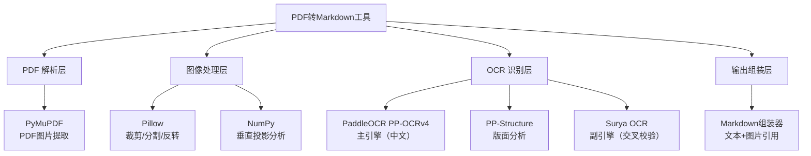
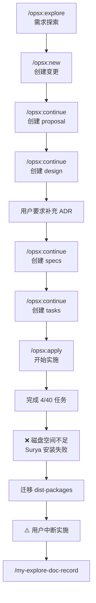
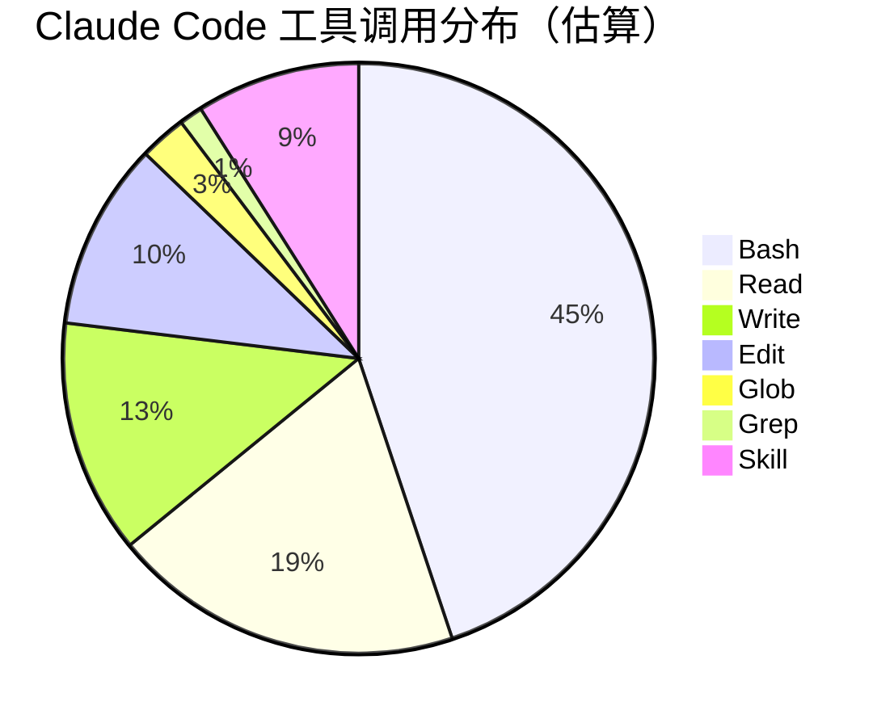
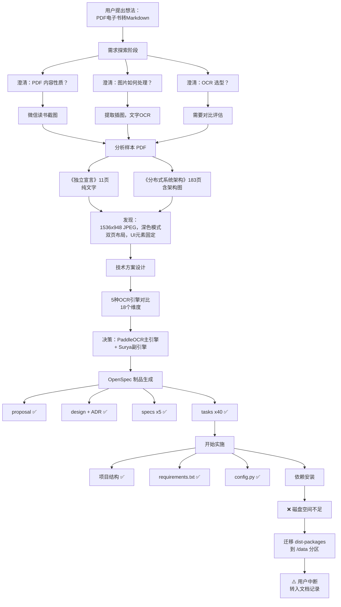
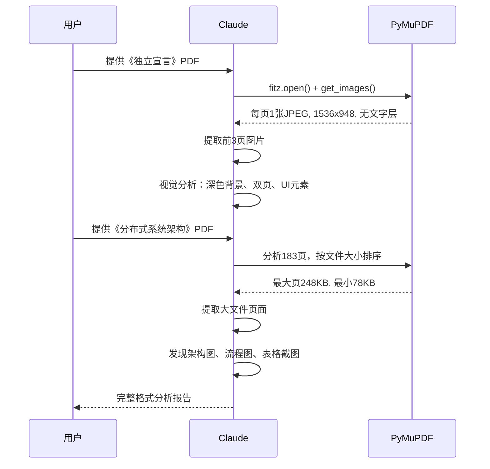
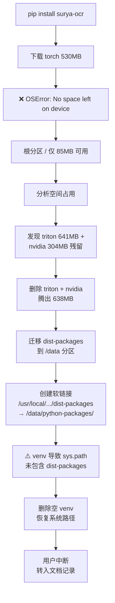
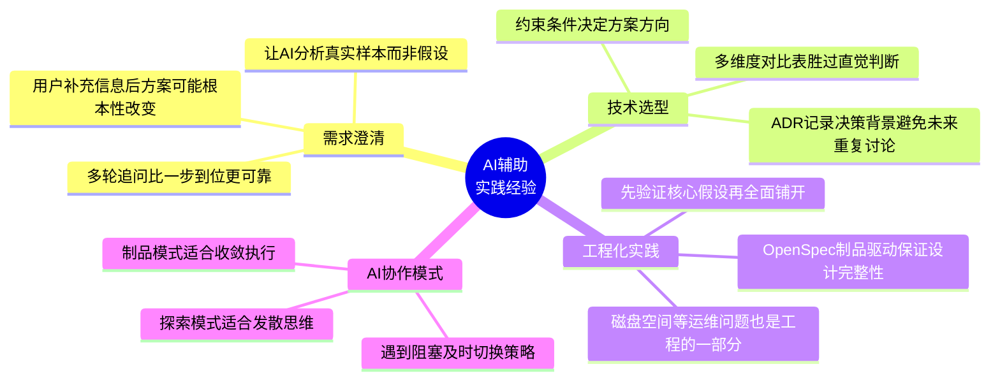

# PDF转Markdown工具 设计规划 实践探索之旅

> **主题：** 微信读书PDF截图转Markdown电子书工具的需求分析、技术选型与架构设计
> **日期：** 2026-04-22
> **预计耗时：** 2.5 小时（09:22 ~ 11:50，无长时间空闲）
> **受众：** AI 学习者 / Claude Code 使用者
> **会话 ID：** `-data-ai-claudecode-pdf-converter`
> **项目路径：** `/data/ai/claudecode/pdf-converter`
> **GitHub 地址：** 暂无
> **本文档链接：** [GitHub 链接](https://github.com/chujun/aiubuntu1-sh/blob/main/doc/ai-explore/2026-04-22-PDF%E8%BD%ACMarkdown%E5%B7%A5%E5%85%B7%E8%AE%BE%E8%AE%A1%E5%AE%9E%E8%B7%B5%E6%8E%A2%E7%B4%A2%E4%B9%8B%E6%97%85.md)
> **本文档链接（编码版）：** `https://github.com/chujun/aiubuntu1-sh/blob/main/doc/ai-explore/2026-04-22-PDF%E8%BD%ACMarkdown%E5%B7%A5%E5%85%B7%E8%AE%BE%E8%AE%A1%E5%AE%9E%E8%B7%B5%E6%8E%A2%E7%B4%A2%E4%B9%8B%E6%97%85.md`

---

## 目录

- [一、AI 角色与工作概述](#一ai-角色与工作概述)
- [二、主要用户价值](#二主要用户价值)
- [三、解决的用户痛点](#三解决的用户痛点)
- [四、开发环境](#四开发环境)
- [五、技术栈](#五技术栈)
- [六、AI 模型 / 插件 / Agent / 技能 / MCP 使用统计](#六ai-模型--插件--agent--技能--mcp-使用统计)
- [七、会话主要内容](#七会话主要内容)
- [八、关键决策记录](#八关键决策记录)
- [九、主要挑战与转折点](#九主要挑战与转折点)
- [十、用户提示词清单](#十用户提示词清单)
- [十一、AI 辅助实践经验](#十一ai-辅助实践经验)

---

## 一、AI 角色与工作概述

> 本章总结 AI 在本次会话中承担的角色定位及具体工作内容，帮助读者快速了解 AI 的协作方式。

### 角色定位

| 角色 | 说明 |
|------|------|
| 产品分析师 | 与用户澄清需求细节，逐步收窄问题域 |
| 架构师 | 技术选型对比、系统架构设计、ADR 决策记录 |
| 技术调研员 | 分析 PDF 样本文件结构，逆向工程微信读书截图格式 |
| 项目规划师 | 使用 OpenSpec 工作流生成 proposal/design/specs/tasks 全套制品 |
| DevOps 工程师 | 项目初始化、依赖安装、磁盘空间问题排查与迁移 |

### 具体工作

- 分析两本样本 PDF（《独立宣言》《分布式系统架构》），逆向工程微信读书截图格式特征
- 对比 5 种 OCR 引擎（Tesseract / PaddleOCR / Surya / EasyOCR / 多模态大模型），从 18 个维度做选型评估
- 设计完整的处理管道：PDF提取 → 预处理 → 版面分析 → 双引擎OCR交叉校验 → Markdown组装
- 使用 OpenSpec 工作流生成 4 个制品：proposal、design（含 ADR）、specs（5个能力模块）、tasks（40个任务）
- 开始实施阶段：创建项目结构、config.py、requirements.txt
- 排查根分区空间不足问题，执行 dist-packages 迁移到 /data 分区

---

## 二、主要用户价值

1. **将不可搜索的 PDF 转为可搜索的 Markdown** — 微信读书截图 PDF 全是图片，无法搜索、编辑、引用，转为 Markdown 后完全可搜索
2. **零成本本地方案** — 完全本地运行，无 API 费用，适合持续使用
3. **双引擎交叉校验提升准确率** — PaddleOCR + Surya 交叉校验，预期准确率从单引擎 ~97% 提升到 99.9%+
4. **自动标记可疑位置** — 差异处插入 `<!-- REVIEW -->` 注释，人工只需审核标记位置，大幅减少校对工作量
5. **完整的工程化设计** — 从需求到任务的全套文档，可复用于 10+ 本书的持续转换

---

## 三、解决的用户痛点

| # | 用户痛点 | 简要描述 |
|---|---------|---------|
| 1 | PDF 电子书不可搜索 | 微信读书截图 PDF 全是图片，无法 Ctrl+F 搜索关键词 |
| 2 | 书中插图无法独立提取 | 图片嵌入在截图中，无法单独保存和引用 |
| 3 | OCR 转换后需大量人工校对 | 单引擎 OCR ~97% 准确率意味着每1000字30个错字 |
| 4 | 现有 OCR 工具不理解双页布局 | 微信读书横屏双页截图需要特殊的分割处理 |
| 5 | 技术选型信息分散 | 市面 OCR 方案众多，缺乏系统对比 |

---

## 四、开发环境

| 项目 | 详情 |
|------|------|
| OS | Linux 6.8.0-107-generic (Ubuntu) |
| Shell | Bash |
| Python | 3.12 |
| 根分区 | 9.8GB（几乎满），已迁移 dist-packages 到 /data |
| /data 分区 | 20GB，13GB 可用 |
| GPU | 无（CPU 模式运行 OCR） |

---

## 五、技术栈



| 层次 | 库/框架 | 版本 | 用途 |
|------|---------|------|------|
| PDF 解析 | PyMuPDF | >=1.24.0 | 无损提取嵌入 JPEG |
| 图像处理 | Pillow | >=10.0.0 | 裁剪、分割、颜色反转 |
| 数值计算 | NumPy | >=1.24.0 | 垂直投影中线检测 |
| 版面分析 | PaddleOCR PP-Structure | >=2.8.0 | 区分文字/图片/表格区域 |
| OCR 主引擎 | PaddleOCR PP-OCRv4 | >=2.8.0 | 中文文字识别 |
| OCR 副引擎 | Surya OCR | >=0.6.0 | 交叉校验 |
| 深度学习框架 | PaddlePaddle | >=2.6.0 | PaddleOCR 运行时 |

---

## 六、AI 模型 / 插件 / Agent / 技能 / MCP 使用统计

### 6.1 AI 大模型

**配置模型：**

| 模型 ID | 名称 | 用途 |
|---------|------|------|
| `claude-opus-4-6` | Opus 4.6 | 主对话模型 |

**实际调用模型：**

| 模型 ID | 模型名称 | 调用场景 | 说明 |
|---------|---------|---------|------|
| `claude-opus-4-6` | Opus 4.6 | 主对话 | 全程使用，包含探索、设计、实施 |

### 6.2 开发工具

| 工具 | 用途 |
|------|------|
| Claude Code CLI | AI 辅助开发主界面 |
| OpenSpec CLI | 制品驱动的变更管理工具 |
| pip | Python 包管理 |

### 6.3 插件（Plugin）

本次会话未使用浏览器插件。

### 6.4 Agent（智能代理）

本次会话未调用 Agent 子代理。

### 6.5 技能（Skill）

| 技能名称 | 触发命令 | 触发方 | 调用次数 | 是否完整执行 |
|---------|---------|-------|---------|------------|
| opsx:explore | `/opsx:explore` | 用户 | 1 次 | ✅ 完整 |
| opsx:new | `/opsx:new` | 用户 | 1 次 | ✅ 完整 |
| opsx:continue | `/opsx:continue` | 用户 | 4 次 | ✅ 完整 |
| opsx:apply | `/opsx:apply` | 用户 | 1 次 | ⚠️ 中断（磁盘空间不足） |
| my-explore-doc-record | `/my-explore-doc-record` | 用户 | 1 次 | 执行中 |



### 6.6 MCP 服务

| MCP 服务 | 工具前缀 | 本次调用次数 | 说明 |
|---------|---------|------------|------|
| context7 | `mcp__context7__` | 0 | 未需要查阅外部文档 |
| playwright | `mcp__playwright__` | 0 | 无浏览器操作需求 |
| host-browser | — | 0 | 无浏览器操作需求 |

### 6.7 Claude Code 工具调用统计



> ⚠️ 以上数据为基于会话记忆的估算值，非精确统计。Bash 调用最多，主要用于 PDF 分析、依赖安装、磁盘管理。Read 主要用于查看 PDF 页面图片和读取制品文件。

---

## 七、会话主要内容

### 7.1 任务全景



### 7.2 核心问题 1：微信读书 PDF 格式逆向分析

用户提供了两本样本书，AI 通过 PyMuPDF 分析了 PDF 内部结构：



**关键发现：**
- 微信读书 iPad 横屏截图格式高度一致：1536x948 JPEG
- 每页 PDF 恰好嵌入一张图片，可无损提取
- UI 元素位置固定：顶部书名、底部翻页提示
- 图表带"图X-Y"格式标注，可用正则匹配

### 7.3 核心问题 2：OCR 引擎技术选型

用户要求零成本且高识别率，AI 进行了系统性对比：

| 引擎 | 中文识别率 | 成本 | 结论 |
|------|-----------|------|------|
| Tesseract 5 | ~85% | $0 | ❌ 排除，准确率不够 |
| PaddleOCR PP-OCRv4 | ~97% | $0 | ✅ 选为主引擎 |
| Surya | ~93% | $0 | ✅ 选为副引擎 |
| EasyOCR | ~90% | $0 | ⚠️ 备选（替代Surya的GPL） |
| 多模态大模型 | ~98-99% | $50-100/10本书 | ❌ 排除（零成本约束） |

**交叉校验预期效果：**
- 单引擎 PaddleOCR：~97% → 每1000字约30个错字
- 双引擎交叉校验：两个不同架构的模型同时犯同一个错误概率极低
- 预期效果：99.9%+ 准确率，人工只需审核 5-8% 的标记位置

### 7.4 核心问题 3：磁盘空间不足

实施阶段安装 Surya OCR 时，其依赖 PyTorch（530MB）导致根分区空间耗尽。



---

## 八、关键决策记录

本次会话未运行测试，以下记录关键技术决策：

| 决策点 | 选项 A | 选项 B | 最终选择 | 理由 |
|--------|--------|--------|---------|------|
| PDF 图片提取方式 | pdf2image (poppler渲染) | PyMuPDF (直接提取嵌入图片) | PyMuPDF | 无损、无额外系统依赖 |
| 双页分割算法 | 固定中点分割 | 垂直投影法检测中线 | 垂直投影法 | 更精确，适应左右页不对称 |
| 版面分析引擎 | LayoutParser | PP-Structure | PP-Structure | 中文训练充分，与PaddleOCR集成 |
| OCR 主引擎 | Tesseract | PaddleOCR PP-OCRv4 | PaddleOCR | 中文识别率最高(~97%) |
| OCR 副引擎 | EasyOCR (Apache 2.0) | Surya (GPL 3.0) | Surya | 架构差异大，交叉校验互补性强 |
| 颜色反转策略 | 全页反转 | 版面分析后仅文字区域反转 | 先反转再分析 | 白底更利于PP-Structure检测 |
| 输出格式 | 按章节多文件 | 单个 book.md | 单个 book.md | 用户需求 |
| 跨页段落拼接 | 激进拼接 | 保守策略（仅明确断句时拼接） | 保守策略 | 避免误拼接，用户可后处理 |

---

## 九、主要挑战与转折点

| 挑战 | 初始判断 | 实际根因 | 转折点 |
|------|---------|---------|--------|
| 用户说"图片内容"含义不清 | 可能是整页作为图片保存 | 用户要实际提取书中嵌入的插图，文字要OCR | 追问后明确是"文字OCR + 图片裁剪保存" |
| PDF 是否包含插图 | 分析前不确定 | 《独立宣言》无图，《分布式系统架构》有架构图 | 按文件大小排序找到大文件页，视觉确认包含架构图 |
| OCR 选型：要不要用大模型 | 大模型识别率最高是首选 | 用户要求零成本 | 改为双引擎开源方案 + 交叉校验 |
| 双引擎是否真的能提升准确率 | 理论上可行 | 关键在于两引擎架构差异足够大（PaddleOCR基于CNN，Surya基于Transformer） | 选择架构差异最大的两个引擎 |
| 根分区磁盘空间不足 | 以为只是pip缓存问题 | 根分区仅9.8GB，triton+nvidia残留占1GB，PyTorch需要530MB | 清理残留 + 迁移 dist-packages 到 /data 分区 |
| 迁移后Python找不到包 | 迁移 dist-packages 并创建软链接应该可以 | 之前创建的空 venv 改变了 sys.path | 删除空 venv，恢复系统级 Python 路径 |

---

## 十、用户提示词清单（原文，一字未改）

### 【当前会话】

**提示词 1：** `[技能调用]`
```
/opsx:explore 我现在有一个想法，现在有一些pdf版本的电子书籍，里面内容是图片，要求输出成markdown格式的电子书，书中包含的图片内容存储下来，markdown文件引用图片链接
```

**提示词 2：**
```
1.PDF 内容的性质，微信读书截图 2."图片内容存储下来"指的是什么？a) 页面中嵌入的插图、图表、照片——提取出来作为独立图片文件，另外补充下信息，微信读书截图是双页截图，并非单页截图，这个处理逻辑可能不一样。 OCR 引擎选型，你进行技术选型对比，我目前也没有特定的选型，需求是识别文本和图片识别率成功率高
```

**提示词 3：**
```
1.持续使用，目前有10本书左右， 2.Markdown文档要求原样输出书籍中的文字内容，一字不改，图片地方引用解析出来的链接 3.这是文件参考文件 /root/ai/claudecode/wexinread/approval-books/独立宣言/独立宣言.pdf，可以供你先行分析 4.图片区域处理，剪裁保存原图，不需要识别图片中的文字。 最后补充诉求，我的本质诉求是将pdf书籍转化为markdown格式书籍
```

**提示词 4：**
```
/root/ai/claudecode/wexinread/approval-books/分布式系统架构：架构策略与难题求解/分布式系统架构：架构策略与难题求解.pdf,我在补充一个包含图片的书籍供你分析， 1.现阶段我希望0成本，可以考虑上面的两种OCR交叉验证 2. a) 99.9% 准确 + 自动标记可疑位置供人工审核？ 4.输出格式偏好， 单个 book.md 文件
```

**提示词 5：** `[技能调用]`
```
/opsx:new 参考上面的讨论内容，准备开始
```

**提示词 6：**
```
有一个疑问， proposal 为什么没有内容呢
```

**提示词 7：** `[技能调用]`
```
/opsx:continue
```

**提示词 8：** `[技能调用]`
```
/opsx:continue
```

**提示词 9：** `[技能调用]`
```
/opsx:continue
```

**提示词 10：**
```
/openspec:continue desigin 补充ADR架构决策记录:OCR 引擎选型对比
```

**提示词 11：** `[技能调用]`
```
/opsx:continue
```

**提示词 12：** `[技能调用]`
```
/opsx:apply
```

**提示词 13：**
```
清理根分区空间，采用软链接方式，迁移到/data目录下面
```

**提示词 14：** `[技能调用]`
```
/my-explore-doc-record
```

---

## 十一、AI 辅助实践经验（面向 AI 学习者）



| # | 经验 | 核心教训 |
|---|------|---------|
| 1 | 让 AI 分析真实样本文件，而非基于用户描述假设 | AI 从《独立宣言》PDF 中发现了深色模式、1536x948分辨率等关键特征，这些信息用户并未主动提供但对方案设计至关重要 |
| 2 | 约束条件（如"零成本"）会根本性改变技术选型方向 | 多模态大模型识别率最高但被零成本约束排除，倒逼出了双引擎交叉校验的创新方案 |
| 3 | 用 ADR 记录选型过程而非只记录结论 | OCR 引擎对比的 18 维度表格和逐方案分析，使未来团队成员或自己能理解决策背景 |
| 4 | 制品驱动的工作流确保设计的完整性 | OpenSpec 的 proposal → design → specs → tasks 流程，避免了"边想边做"导致的设计遗漏 |
| 5 | 运维环境问题（磁盘空间）可能阻塞开发 | PyTorch 530MB 依赖耗尽根分区空间，需要迁移 dist-packages — 这类问题预研阶段容易忽略 |
| 6 | 交叉校验的关键是引擎架构差异 | PaddleOCR(CNN) + Surya(Transformer) 架构差异大，同时犯同一个错误的概率极低，这是交叉校验有效的理论基础 |

---

*文档生成时间：2026-04-22 | 由 Opus 4.6 (`claude-opus-4-6`) 辅助生成*
