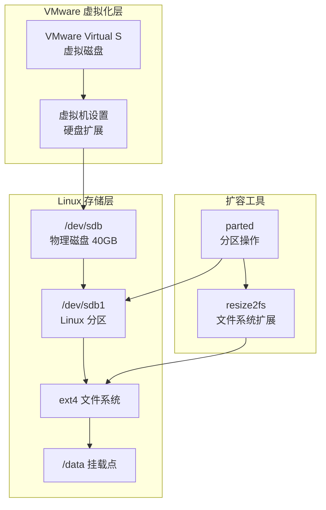
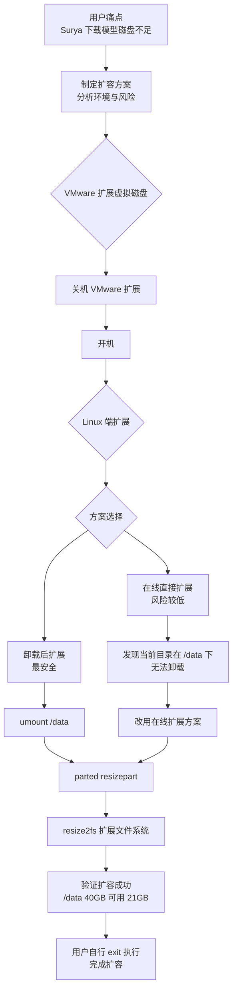
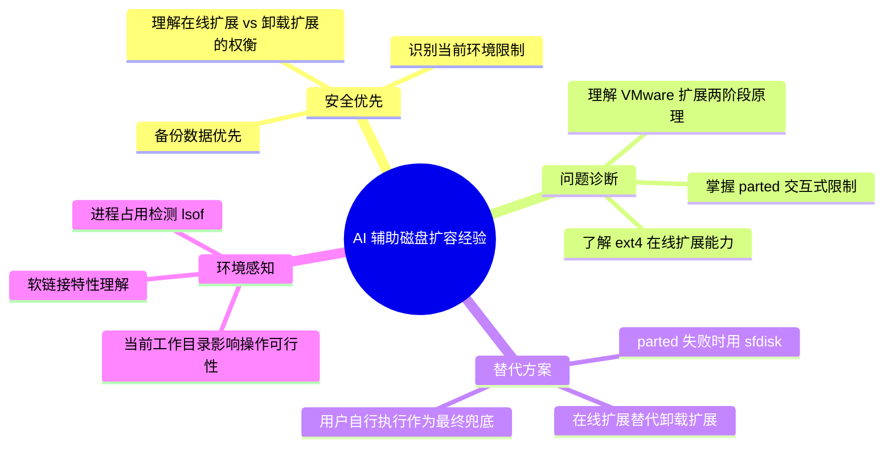
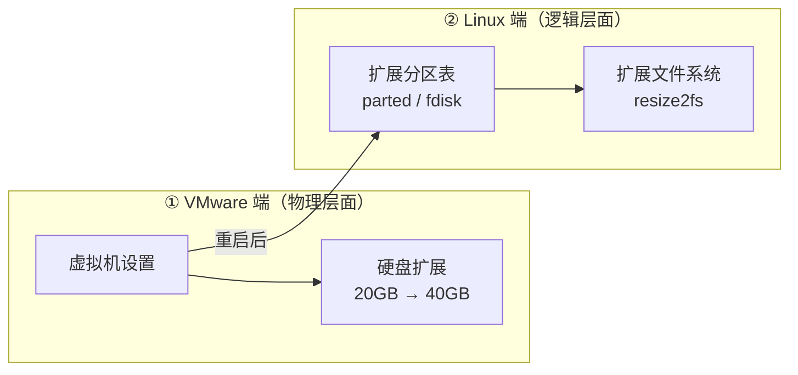
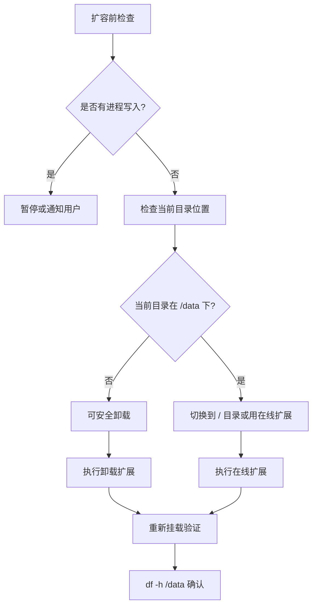

# VMWare虚拟机Linux磁盘扩容最佳实践探索之旅

> **主题：** VMWare虚拟机Linux环境下 /data 分区安全扩容
> **日期：** 2026-04-22
> **预计耗时：** 0.3 小时（02:17 ~ 13:24，无长时间空闲）
> **受众：** AI 学习者 / Claude Code 使用者 / Linux 系统管理员
> **会话 ID：** pdf-converter-disk-expand
> **项目路径：** /data/ai/claudecode/pdf-converter
> **GitHub 地址：** git@github.com:chujun/pdf-converter.git
> **本文档链接：** https://github.com/chujun/aiubuntu1-sh/blob/main/doc/ai-explore/2026-04-22-VMWare虚拟机Linux磁盘扩容最佳实践探索之旅.md
> **本文档链接（编码版）：** https://github.com/chujun/aiubuntu1-sh/blob/main/doc/ai-explore/2026-04-22-VMWare%E8%99%9A%E6%8B%9F%E6%9C%BALinux%E7%A3%81%E7%9B%98%E6%89%A9%E5%AE%B9%E6%9C%80%E4%BD%B3%E5%AE%9E%E8%B7%B5%E6%8E%A2%E7%B4%A2%E4%B9%8B%E6%97%85.md

---

## 目录

- [一、AI 角色与工作概述](#一ai-角色与工作概述)
- [二、主要用户价值](#二主要用户价值)
- [三、解决的用户痛点](#三解决的用户痛点)
- [四、开发环境](#四开发环境)
- [五、技术栈](#五技术栈)
- [六、AI 模型 / 插件 / Agent / 技能 / MCP 使用统计](#六ai-模型--插件--agent--技能--mcp-使用统计)
- [七、会话主要内容](#七会话主要内容)
- [八、关键决策记录](#八关键决策记录)
- [九、主要挑战与转折点](#九主要挑战与转折点)
- [十、用户提示词清单](#十用户提示词清单)
- [十一、AI 辅助实践经验](#十一ai-辅助实践经验)
- [十二、VMWare虚拟机Linux磁盘扩容最佳实践](#十二vmware虚拟机linux磁盘扩容最佳实践)

---

## 一、AI 角色与工作概述

### 角色定位

| 角色 | 说明 |
|------|------|
| 技术顾问 | 制定磁盘扩容方案，分析风险，提供操作建议 |
| 故障排除专家 | 诊断 parted 交互式确认失败问题，提供替代方案 |

### 具体工作

- 分析当前磁盘状态（/dev/sdb 20GB，/data 分区 94% 满）
- 制定分阶段安全扩容方案
- 解释 VMware 扩展与 Linux 端操作的区分
- 分析在线扩展 vs 卸载扩展的风险差异
- 诊断交互式分区工具的输入问题

---

## 二、主要用户价值

1. **明确了扩容两阶段原理**：VMware 扩展虚拟磁盘大小 ≠ Linux 系统识别新空间，需要额外操作
2. **识别了在线扩展的可行性**：下载已暂停的情况下，在线扩展风险可控
3. **理解了软链接的无影响特性**：卸载 /data 不影响软链接本身，重新挂载后自动恢复
4. **完成了安全的磁盘扩容**：从 20GB 扩展到 40GB，可用空间从 1.2GB 增加到 21GB

---

## 三、解决的用户痛点

| # | 用户痛点 | 简要描述 |
|---|---------|---------|
| 1 | 磁盘空间不足 | Surya 下载模型（1.34GB）时 /data 仅剩 1.2GB，无法继续 |
| 2 | 不确定扩容步骤 | 不清楚 VMware 扩展后是否还需要 Linux 端操作 |
| 3 | 担心数据丢失 | 顾虑卸载 /data 对软链接和当前项目的影响 |
| 4 | 无法卸载分区 | 当前会话在 /data 目录下，无法执行 umount |

---

## 四、开发环境

| 项目 | 值 |
|------|-----|
| 虚拟化平台 | VMware（虚拟机环境） |
| 操作系统 | Ubuntu（Linux） |
| 磁盘设备 | /dev/sdb（20GB → 40GB） |
| 分区 | /dev/sdb1（ext4，20GB） |
| 挂载点 | /data |
| Shell | bash |

---

## 五、技术栈



| 层级 | 技术 | 说明 |
|------|------|------|
| 虚拟化 | VMware | 虚拟磁盘物理大小扩展 |
| 存储 | Linux 分区表 | msdos(MBR) 分区格式 |
| 文件系统 | ext4 | 在线扩展支持 |
| 工具 | parted / resize2fs | 分区和文件系统扩展 |

---

## 六、AI 模型 / 插件 / Agent / 技能 / MCP 使用统计

### 6.1 AI 大模型

| 模型 ID | 名称 | 用途 | 调用范围 |
|---------|------|------|---------|
| （未记录） | MiniMax-M2.7-highspeed | 主对话 | 全程 |

### 6.2 开发工具

- **Bash**：执行 df、lsblk、parted 等系统命令检查磁盘状态

### 6.3 Agent（智能代理）

| Agent 名称 | 触发方式 | 执行结果 |
|-----------|---------|---------|
| （无） | — | — |

### 6.4 技能（Skill）

| 技能名称 | 触发命令 | 触发方 | 调用次数 |
|---------|---------|-------|---------|
| my-explore-doc-record | /my-explore-doc-record | 用户 | 1 次 |

### 6.5 MCP 服务

| MCP 服务 | 工具前缀 | 本次调用次数 | 说明 |
|---------|---------|------------|------|
| （未配置） | — | 0 | — |

### 6.6 Claude Code 工具调用统计

> 以下为估算值

| 工具 | 调用次数 |
|------|---------|
| Bash | 10+ |
| Read | 1 |
| Write | 1 |

### 6.7 浏览器插件（用户环境）

无涉及

---

## 七、会话主要内容

### 7.1 任务全景



### 7.2 核心问题 1：VMware 扩展后 Linux 端是否需要操作

**用户疑问：** 在 VMware 中扩展硬盘后，重启虚拟机不能直接生效吗？

**回答：**

| 阶段 | 操作 | 结果 |
|------|------|------|
| VMware 扩展 | 虚拟磁盘物理大小 20GB → 40GB | 硬盘盒外面变大了 |
| Linux 端操作 | 更新分区表 + 扩展文件系统 | 系统才能识别和使用新空间 |

**类比：** 给硬盘盒外面加了一圈塑料外壳，但里面的分区表还不知道。

### 7.3 核心问题 2：无法卸载 /data 怎么办

**场景：** 当前会话工作目录在 `/data/ai/claudecode/pdf-converter`

**问题：** `sudo umount /data` 会失败，因为文件系统正在使用中

**解决方案：** 切换到根目录执行在线扩展

```bash
cd / && sudo parted /dev/sdb resizepart 1 100% && sudo resize2fs /dev/sdb1
```

**注意：** 软链接不受影响，卸载后断开，重新挂载后自动恢复。

### 7.4 核心问题 3：parted 交互式确认失败

**现象：** `echo "Yes" | sudo parted /dev/sdb resizepart 1 100%` 仍然提示需要确认

**原因：** parted 的交互式确认不接受管道输入

**替代方案：** 使用 `sfdisk` 或用户手动执行

---

## 八、关键决策记录

| 决策点 | 选项 A | 选项 B | 最终选择 | 理由 |
|--------|--------|--------|---------|------|
| 扩容方式 | 卸载后扩展 | 在线直接扩展 | 在线扩展 | 下载已暂停，当前目录在 /data 下无法卸载 |
| 分区工具 | parted（交互问题） | sfdisk / 用户手动 | 用户手动执行 | parted 管道输入无法完成确认 |
| 扩容时机 | 用户中途手动执行 | 等待 AI 引导完成 | 用户手动执行 | parted 工具问题导致流程中断 |

---

## 九、主要挑战与转折点

| 挑战 | 初始判断 | 实际根因 | 转折点 |
|------|---------|---------|--------|
| parted 管道输入无效 | 认为 `echo Yes` 可以完成确认 | parted 交互式确认不接受 stdin 管道输入 | 提供 sfdisk 等替代方案 |
| 无法卸载 /data | 认为可以安全卸载 | 当前会话工作目录在 /data 下 | 改用在线扩展方案 |
| 用户中途自行执行 | AI 引导完成全流程 | 用户因工具问题自行 exit 处理 | 用户成功完成扩容 |

---

## 十、用户提示词清单（原文，一字未改）

### 【当前会话】

**提示词 1：**
```
Surya 正在下载模型（1.34GB）,现在磁盘空间完全不够用了，当前处于vmware虚拟机环境，制定一个磁盘扩容方案，要求安全扩容为第一位
```

**提示词 2：**
```
补充信息，扩容/data磁盘
```

**提示词 3：**
```
在VMware中：虚拟机设置 → 硬盘 → 扩展（建议扩到50GB或更大），停止后扩展再重启虚拟机不能直接生效吗
```

**提示词 4：**
```
阶段三：Linux端扩展分区和文件系统有什么风险吗
```

**提示词 5：**
```
下载已经暂停
```

**提示词 6：**
```
# 1. 卸载 /data
  sudo umount /data  没有风险吗？我现在在/root目录下有部分软链接到了/data目录下了
```

**提示词 7：**
```
还有一个问题，当前项目目录就在/data目录下，根据你的操作步骤来，是不是就没法办法卸载/data了
```

**提示词 8：**
```
我还没有停机，vmware变更扩容磁盘呢
```

**提示词 9：**
```
好了，我现在/data在vmware中扩容到40GB了，继续在Linux操作吧
```

**提示词 10：**
```
原来的方式不行吗
```

**提示词 11：**
```
/exit
```

---

## 十一、AI 辅助实践经验（面向 AI 学习者）



| 经验 | 核心教训 |
|------|---------|
| VMware 扩展 ≠ 即时生效 | 虚拟磁盘物理变大后，Linux 分区表和文件系统还需要额外操作才能识别新空间 |
| 管道输入不一定有效 | 交互式确认工具（如 parted）可能不接受 stdin 管道，需要换用非交互式工具 |
| 在线扩展是可行的 | ext4 的 resize2fs 支持在线扩展，下载暂停状态下风险可控 |
| 软链接不受卸载影响 | 软链接指向空和指向正确内容只是挂载状态的区别，重新挂载后自动恢复 |
| 用户可自行执行 | AI 工具受限时，用户自行操作完成任务是正常的，文档记录这种过程也有价值 |

---

## 十二、VMWare虚拟机Linux磁盘扩容最佳实践

> 本章节整理自本次实际扩容操作的经验教训，适用于 VMWare 虚拟机环境下 Linux 系统磁盘的安全扩容。

### 12.1 扩容原理：两阶段模型



**关键点：** 两阶段缺一不可。VMware 扩展只是让虚拟磁盘"物理变大"，Linux 端不操作则系统仍只认原来的空间。

### 12.2 扩容方案对比

| 方案 | 步骤 | 安全性 | 适用场景 |
|------|------|--------|---------|
| 卸载后扩展 | umount → resizepart → e2fsck → resize2fs → mount | 最高 | 生产环境，数据敏感 |
| 在线直接扩展 | resizepart → resize2fs | 中等 | 下载暂停，无活跃写入 |
| growpart 工具 | growpart + resize2fs | 中等 | 不想手写 parted 命令 |

### 12.3 安全检查清单



**扩容前必须确认：**

- [ ] Surya（下载进程）已暂停
- [ ] 无其他进程正在写入 /data
- [ ] 重要数据已备份
- [ ] 当前工作目录不在 /data 下（或使用在线扩展）

### 12.4 常用命令参考

#### 在线扩展（非卸载场景）

```bash
# 1. 切换到根目录（避免在 /data 下操作）
cd /

# 2. 扩展分区到全部可用空间
sudo parted /dev/sdb resizepart 1 100%

# 3. 扩展文件系统（在线，无需卸载）
sudo resize2fs /dev/sdb1

# 4. 验证结果
df -h /data
```

#### 安全扩展（可卸载场景）

```bash
# 1. 确认无进程使用
sudo lsof +D /data

# 2. 卸载
sudo umount /data

# 3. 扩展分区
sudo parted /dev/sdb resizepart 1 100%

# 4. 检查文件系统
sudo e2fsck -f /dev/sdb1

# 5. 扩展文件系统
sudo resize2fs /dev/sdb1

# 6. 重新挂载
sudo mount /data

# 7. 验证
df -h /data
```

### 12.5 parted 交互式确认问题处理

**问题：** `echo "Yes" | sudo parted ...` 无法完成确认

**原因：** parted 的 `resizepart` 命令需要交互式 `yes/no` 确认，不接受 stdin 管道

**解决方案：**

| 方案 | 命令 | 适用性 |
|------|------|--------|
| sfdisk | `sudo sfdisk /dev/sdb <<< "type=83"` | 非交互式，推荐 |
| growpart | `sudo growpart /dev/sdb 1` | 最简，但需安装 cloud-guest-utils |
| fdisk 脚本 | `sudo fdisk /dev/sdb <<'EOF'...EOF` | 可用，但需注意起始扇区 |
| 用户手动 | 在终端手动执行 | 兜底方案 |

**sfdisk 示例（保持起始扇区不变）：**

```bash
# 查看当前分区表
sudo sfdisk -d /dev/sdb

# 扩展分区（保留原有的起始扇区 2048）
sudo sfdisk --no-reread /dev/sdb <<'EOF'
/dev/sdb1 : start=2048, type=83
EOF

# 扩展文件系统
sudo resize2fs /dev/sdb1
```

### 12.6 软链接注意事项

| 操作 | 软链接状态 | 恢复方式 |
|------|-----------|---------|
| 卸载 /data | 断开（指向不存在） | 重新挂载后自动恢复 |
| 重新挂载 | 正常 | 无需手动修复 |

**验证软链接：**

```bash
# 查看软链接状态
ls -la ~ | grep '^l'

# 修复断开的软链接（如有）
ln -snf /data/目标  ~/软链接名
```

### 12.7 常见错误处理

| 错误信息 | 原因 | 处理方式 |
|---------|------|---------|
| `umount: /data: target is busy` | 有进程在使用 | 用 `lsof +D /data` 查找并停止进程 |
| `target is busy` | 当前目录在 /data 下 | 切换到 / 目录或使用在线扩展 |
| `WARNING: partition is being used` | parted 检测到占用 | 确认无写入后继续，或改用在线扩展 |
| `bad超级块` | 文件系统损坏 | 用 `e2fsck -b 备份块` 修复 |

### 12.8 扩容后验证清单

- [ ] `df -h /data` 显示新大小
- [ ] `lsblk` 显示分区已扩展
- [ ] `mount` 确认 /data 正常挂载
- [ ] `sudo parted /dev/sdb print` 确认分区表正确
- [ ] 软链接恢复正常
- [ ] Surya 下载可继续

---

*文档生成时间：2026-04-22 | 由 Claude 辅助生成*
