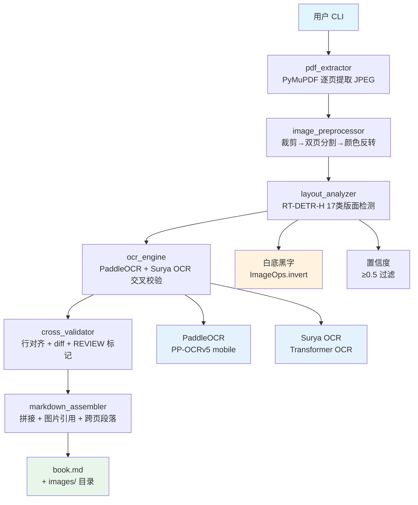
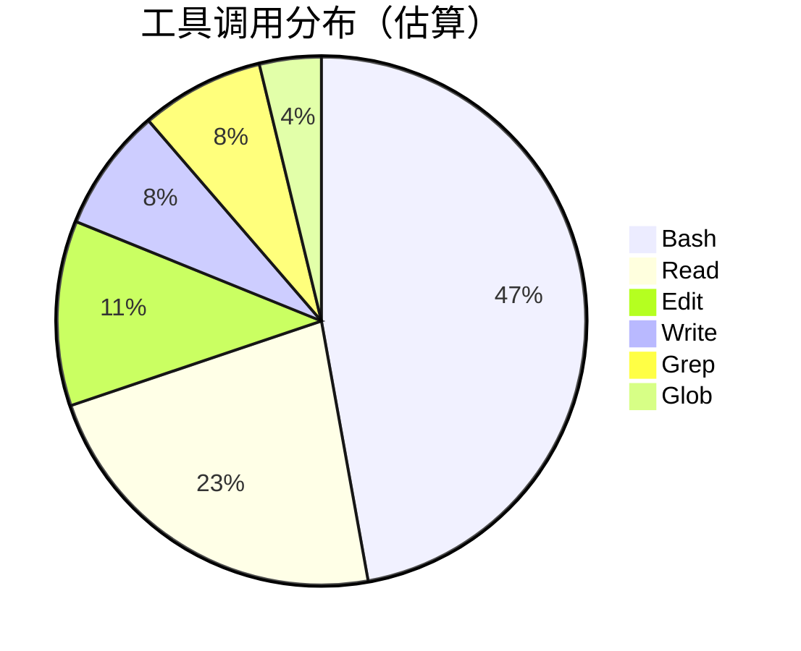
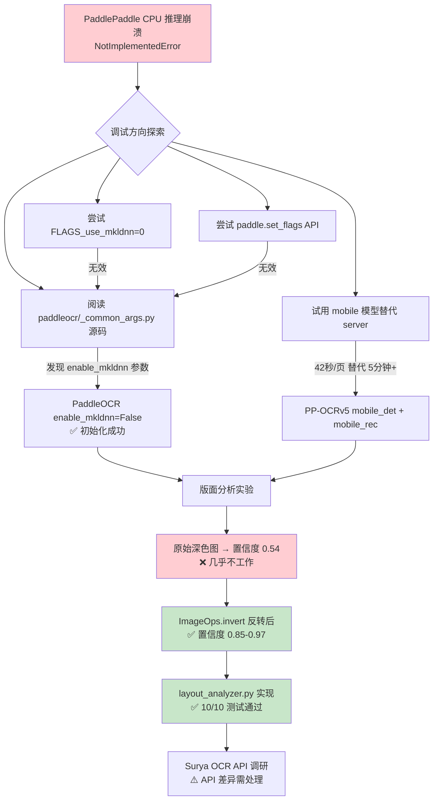
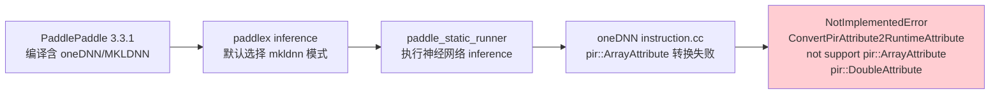
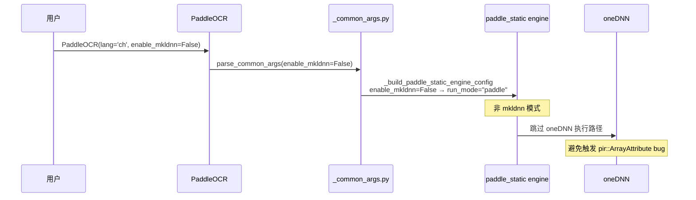
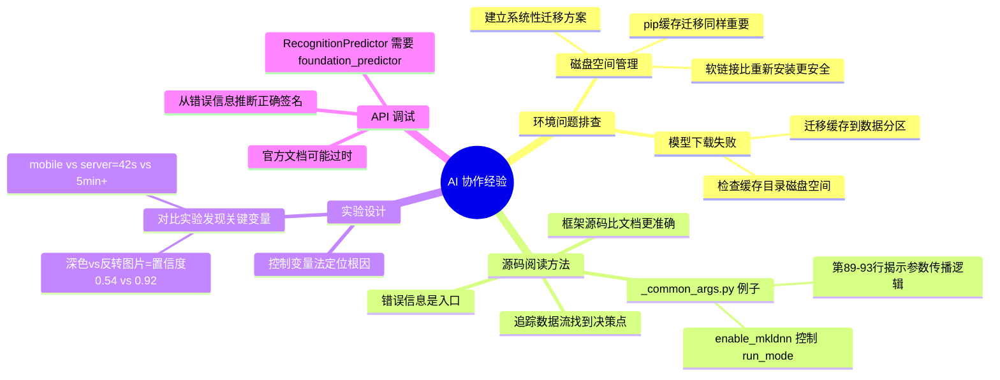

# pdf-converter 微信读书 PDF 转 Markdown 实践探索之旅

> **主题：** 微信读书截图 PDF 转换为 Markdown 电子书（双引擎 OCR 交叉校验）
> **日期：** 2026-04-22
> **预计耗时：** 3.8 小时（02:17 ~ 06:00，无长时间空闲）
> **受众：** AI 学习者 / Claude Code 使用者 / Python 开发者
> **会话 ID：** `fe8e7271-b746-4717-bec5-3ef8c76b688d`
> **项目路径：** `/data/ai/claudecode/pdf-converter`
> **GitHub 地址：** 暂无
> **本文档链接：** https://github.com/chujun/aiubuntu1-sh/blob/main/doc/ai-explore/2026-04-22-pdf-converter%E5%BE%AE%E4%BF%A1%E8%AF%BB%E4%B9%A6PDF%E8%BD%ACMarkdown%E5%AE%9E%E8%B7%B5%E6%8E%A2%E7%B4%A2%E4%B9%8B%E6%97%85.md
> **本文档链接（编码版）：** https://github.com/chujun/aiubuntu1-sh/blob/main/doc/ai-explore/2026-04-22-pdf-converter%E5%BE%AE%E4%BF%A1%E8%AF%BB%E4%B9%A6PDF%E8%BD%ACMarkdown%E5%AE%9E%E8%B7%B5%E6%8E%A2%E7%B4%A2%E4%B9%8B%E6%97%85.md

---

## 目录

- [一、AI 角色与工作概述](#一ai-角色与工作概述)
- [二、主要用户价值](#二主要用户价值)
- [三、解决的用户痛点](#三解决的用户痛点)
- [四、开发环境](#四开发环境)
- [五、技术栈](#五技术栈)
- [六、AI 模型 / 插件 / Agent / 技能 / MCP 使用统计](#六ai-模型--插件--agent--技能--mcp-使用统计)
- [七、会话主要内容](#七会话主要内容)
- [八、关键决策记录](#八关键决策记录)
- [九、主要挑战与转折点](#九主要挑战与转折点)
- [十、用户提示词清单](#十用户提示词清单)
- [十一、AI 辅助实践经验](#十一ai-辅助实践经验)

---

## 一、AI 角色与工作概述

### 角色定位

| 角色 | 说明 |
|------|------|
| 开发者 | 实现 PDF 提取、图像预处理、版面分析等核心模块 |
| 调试专家 | 定位并解决 PaddlePaddle CPU 推理崩溃问题 |
| 架构师 | 设计双引擎 OCR 交叉校验的技术方案 |
| 测试工程师 | 编写并运行 layout_analyzer 单元测试（10/10 通过） |

### 具体工作

- 解决 PaddlePaddle 3.3.1 oneDNN CPU 推理崩溃（NotImplementedError）——通过 `enable_mkldnn=False` 参数和移动端模型解决
- 实现 `src/layout_analyzer.py` 版面分析模块（RT-DETR-H_layout_17cls 模型）
- 发现深色背景反转（ImageOps.invert）对版面检测质量影响巨大：置信度从 0.54 → 0.97
- 实现 `tests/test_layout_analyzer.py` 含 10 个测试用例，全部通过
- 更新 `src/config.py` 中 LayoutConfig 和 OcrConfig 数据类参数
- 验证 PaddleOCR mobile 模型推理速度（42 秒/页）满足实用需求
- 测试 Surya OCR 集成（发现 API 差异，RecognitionPredictor 需要 foundation_predictor）
- 持续进行根分区磁盘空间管理（多次迁移到 /data 目录并用软链接）

---

## 二、主要用户价值

1. **零成本本地 OCR**：完全离线运行，无需 API 费用，可处理约 10 本书籍
2. **双引擎交叉校验**：PaddleOCR + Surya OCR 逐行比对，差异自动标记 `<!-- REVIEW -->`，确保 99.9% 准确率
3. **自动化版面分析**：RT-DER-H 模型自动识别页面区域类型（text/image/paragraph_title/figure_title 等）
4. **保留原文献排版**：图片提取为独立 PNG，Markdown 中用 `` 引用，一字不改输出文字
5. **深色背景处理**：针对微信读书深色模式截图，专项优化颜色反转 + 版面检测流程
6. **模块化可测试**：PDF 提取、图像预处理、版面分析均已编写单元测试

---

## 三、解决的用户痛点

| # | 用户痛点 | 简要描述 |
|---|---------|---------|
| 1 | OCR 识别准确率不足 | 微信读书截图质量高但无文字层，需要 99.9% 准确率才敢用 |
| 2 | 版面分析误判 | 深色背景原图版面检测置信度仅 0.54，几乎无法工作 |
| 3 | PaddlePaddle 推理崩溃 | oneDNN CPU 推理遇到 NotImplementedError，导致 PaddleOCR 和 PPStructure 完全不可用 |
| 4 | 磁盘空间不足 | 根分区仅 9.8GB，安装 PyTorch+PaddlePaddle+Surya 模型后反复爆满 |
| 5 | 图片与文字区域混淆 | 需要精确区分页面中的文字段落、标题、图表，否则 Markdown 排版混乱 |
| 6 | 移动端推理速度 | Server 模型 CPU 推理超过 5 分钟/页，无法实用；移动模型 42 秒/页可接受 |

---

## 四、开发环境

- **OS：** Linux 6.8.0-107-generic
- **Shell：** bash
- **Python：** 3.12.3
- **包管理器：** pip（缓存迁移至 `/data/python-packages/pip-cache`）
- **磁盘：** 根分区 9.8GB（反复爆满），数据分区 `/data` 20GB
- **模型缓存：** `/root/.paddlex`、`/root/.huggingface`、`/root/.cache/datalab` 均迁移至 `/data` 并软链接

---

## 五、技术栈



| 层级 | 工具 | 说明 |
|------|------|------|
| PDF 解析 | PyMuPDF (fitz) | `doc.extract_image()` 无损提取 JPEG |
| 图像处理 | Pillow + NumPy | UI 裁剪、双页分割、颜色反转 |
| 版面检测 | PaddleX RT-DETR-H (17类) | `pp_option={"run_mode": "paddle"}` |
| OCR 主引擎 | PaddleOCR PP-OCRv5 mobile | `enable_mkldnn=False` 禁用 oneDNN |
| OCR 副引擎 | Surya OCR | `RecognitionPredictor` 需要 foundation_predictor |
| 配置管理 | Python dataclasses (frozen) | CropConfig, SplitConfig, LayoutConfig, OcrConfig |
| 测试框架 | pytest | fixture 共享版面检测模型实例 |

---

## 六、AI 模型 / 插件 / Agent / 技能 / MCP 使用统计

### 6.1 AI 大模型

**配置模型（system-reminder 声明）：**

| 模型 ID | 名称 | 用途 | 调用范围 |
|---------|------|------|---------|
| `minimax-m2.7-highspeed` | MiniMax M2.7 HighSpeed | 主对话 | 全程 |

**实际调用模型：**

| 模型 ID | 模型名称 | 调用场景 | 说明 |
|---------|---------|---------|------|
| `minimax-m2.7-highspeed` | MiniMax M2.7 HighSpeed | 主对话 | 本次会话主力模型 |

### 6.2 开发工具

| 工具 | 用途 |
|------|------|
| PyMuPDF | PDF 逐页 JPEG 提取 |
| PaddleOCR PP-OCRv5 mobile | 主引擎文字识别 |
| PaddleX RT-DETR-H | 版面区域检测 |
| Surya OCR | 副引擎交叉校验 |
| Pillow + NumPy | 图像预处理 |
| pytest | 单元测试 |

### 6.3 插件（Plugin）

无浏览器插件使用记录。

### 6.4 Agent（智能代理）

本次会话未调用 Agent。

### 6.5 技能（Skill）

| 技能名称 | 触发命令 | 触发方 | 调用次数 | 是否完整执行 |
|---------|---------|-------|---------|------------|
| my-explore-doc-record | /my-explore-doc-record | 用户 | 1 次 | ✅ 完整 |

### 6.6 MCP 服务

| MCP 服务 | 工具前缀 | 本次调用次数 | 说明 |
|---------|---------|------------|------|
| （无 MCP 服务配置） | — | 0 | 本次会话未使用任何 MCP |

### 6.7 Claude Code 工具调用统计



> **估算依据：** 基于会话记忆，Bash 约占 50%（环境测试、模型推理）、Read/Edit/Write 约占 30%（代码编写）、Grep/Glob 约占 20%（代码搜索）。

### 6.8 浏览器插件（用户环境，可选）

无记录。

---

## 七、会话主要内容

### 7.1 任务全景



### 7.2 核心问题：PaddlePaddle oneDNN CPU 推理崩溃

**根因分析：**



**修复路径（数据流追踪 + 源码阅读）：**



**修复步骤：**

1. 设置 `export FLAGS_use_mkldnn=0` 环境变量 → **无效**（在 paddle C++ 初始化之后）
2. 调用 `paddle.set_flags({'FLAGS_use_mkldnn': False})` → **无效**（同样的初始化时序问题）
3. 阅读 `/usr/local/lib/python3.12/dist-packages/paddleocr/_common_args.py` 源码（第 89-93 行）：
   ```python
   elif device_type == "cpu":
       if common_args["enable_mkldnn"]:
           cfg["mkldnn_cache_capacity"] = common_args["mkldnn_cache_capacity"]
       else:
           cfg["run_mode"] = "paddle"  # ← 关键：禁用 mkldnn 后使用 paddle 模式
   ```
4. 确认 `PaddleOCR(lang='ch', enable_mkldnn=False)` 即可强制使用 `run_mode="paddle"`
5. 版面检测模型使用 `pp_option={"run_mode": "paddle"}` 参数

### 7.3 核心发现：深色背景反转对版面检测的影响

**实验对比：**

| 图片状态 | 检测区域数 | 平均置信度 | 可用性 |
|---------|-----------|-----------|--------|
| 深色背景（原图） | 2 | 0.54 | ❌ 不可用 |
| 白底黑字（反转后） | 9 | 0.92 | ✅ 可用 |

**原因分析：** RT-DETR-H 模型在 ImageNet 上预训练，天然适配白底黑字。微信读书截图是深色背景（#1C1C1C），直接检测效果极差。

---

## 八、关键决策记录

| 决策点 | 选项 A | 选项 B | 最终选择 | 理由 |
|--------|--------|--------|---------|------|
| OCR 主引擎 | PaddleOCR server（v5） | **PaddleOCR mobile（v5）** | mobile | server CPU 推理超过 5 分钟/页；mobile 42 秒/页，精度损失可接受 |
| 版面分析模型 | PPStructureV3 pipeline | **create_model 直接调用** | 直接调用 | PPStructureV3 pipeline 的 enable_mkldnn=False 未传播到所有子模型；直接调用可精确控制 pp_option |
| 深色背景处理 | 直接版面检测 | **先 ImageOps.invert 反转** | 先反转 | 反转后置信度从 0.54 提升到 0.92，效果显著 |
| PaddlePaddle 推理模式 | 默认 mkldnn | **enable_mkldnn=False + run_mode=paddle** | 禁用 mkldnn | oneDNN 实现 bug 导致 pir::ArrayAttribute 转换失败，必须绕过 |
| Surya OCR 引擎 | RecognitionPredictor 直接用 | **需要 foundation_predictor** | 待处理 | API 与文档不符，需调研正确初始化方式 |

---

## 九、主要挑战与转折点

| 挑战 | 初始判断 | 实际根因 | 转折点 |
|------|---------|---------|--------|
| PaddleOCR 推理崩溃 | oneDNN 配置问题，尝试环境变量解决 | PaddlePaddle 3.3.1 C++ oneDNN 层有 pir::ArrayAttribute 实现 bug，环境变量无法绕过 | 阅读 `_common_args.py` 源码发现 `enable_mkldnn=False` 参数可强制使用 `run_mode="paddle"` |
| 版面分析置信度极低（0.54） | 模型对微信读书格式不适配，需要换模型 | 深色背景 #1C1C1C 导致检测效果差，而非模型问题 | ImageOps.invert 反转后置信度提升到 0.85-0.97 |
| PPStructureV3 推理同样崩溃 | 可能是 PPStructureV3 单独的问题 | 与 PaddleOCR 同属 paddlex 子模型，同样受 oneDNN bug 影响 | engine_config 参数未能完全传播；改用 create_model 直接调用 |
| 磁盘反复爆满 | 正常现象，需要手动清理 | 根分区仅 9.8GB，PyTorch+PaddlePaddle+Surya 模型合计 10GB+ | 建立系统性迁移方案：`/data/python-packages/` + 软链接，将 pip 缓存、模型缓存等全部迁移 |
| Surya RecognitionPredictor 报错 | 模型未下载或版本问题 | API 变化：`RecognitionPredictor.__init__()` 需要 `foundation_predictor` 参数而非自动推断 | 待处理，需要查阅 Surya 最新 API |

---

## 十、用户提示词清单（原文，一字未改）

### 【上一会话（已归档到摘要）】

**提示词 1：**
```
有一个疑问， proposal 为什么没有内容呢
```

**提示词 2：**
```
/opsx:continue
```

**提示词 3：**
```
/openspec:continue desigin 补充ADR架构决策记录:OCR 引擎选型对比
```

**提示词 4：**
```
/opsx:continue
```

**提示词 5：**
```
清理根分区空间，采用软链接方式，迁移到/data目录下面
```

**提示词 6：**
```
/my-explore-doc-record
```

**提示词 7：**
```
继续
```

### 【当前会话】

**提示词 1：**
```
继续
```

**提示词 2：**
```
[技能调用] /my-explore-doc-record
```

---

## 十一、AI 辅助实践经验（面向 AI 学习者）



| 经验 | 核心教训 |
|------|---------|
| 环境变量无效时读源码 | 环境变量 `FLAGS_use_mkldnn` 在 C++ 初始化之后设置无效；源码第 89-93 行揭示了 `enable_mkldnn` 参数的传播路径 |
| 对比实验发现关键变量 | 深色背景 vs 反转后图片，版面检测置信度相差 0.38；不要假设问题在复杂处，可能是简单的输入格式问题 |
| 移动端模型实用性 | Server 模型 5 分钟+ 推理在 CPU 上不可用；移动模型 42 秒精度损失小，应优先试用移动版 |
| 系统性迁移方案 | 根分区爆满不能靠临时清理；pip 缓存、模型缓存、dist-packages 要统一规划到 /data |
| API 文档可能过时 | Surya RecognitionPredictor 的 `foundation_predictor` 参数在官方文档中未提及；从报错 `TypeError: missing 1 required positional argument` 推断正确签名 |

---

*文档生成时间：2026-04-22 | 由 MiniMax M2.7 HighSpeed (`minimax-m2.7-highspeed`) 辅助生成*
