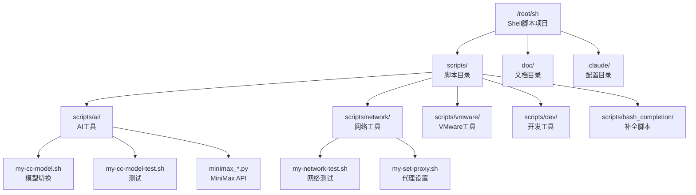
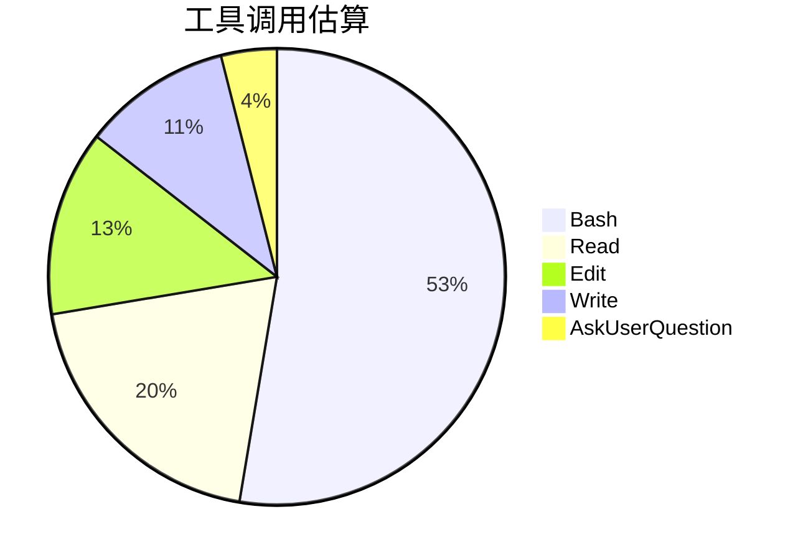
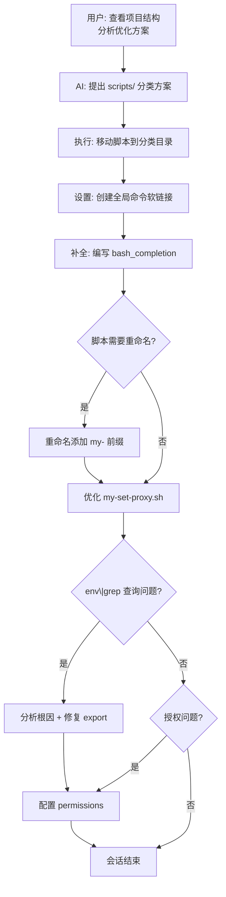
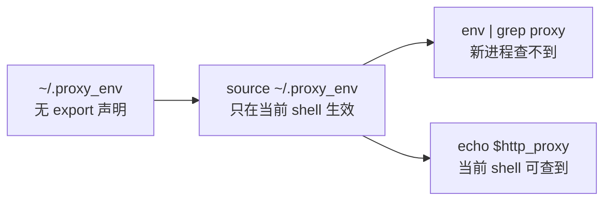
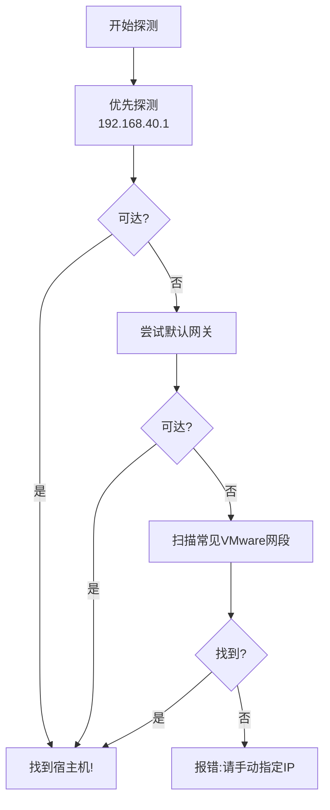
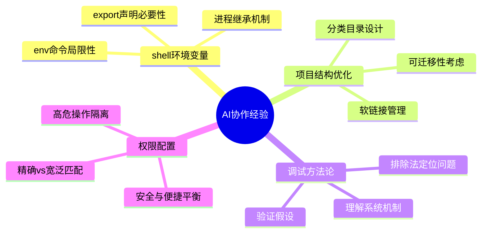

# Shell脚本项目结构优化与代理脚本改进实践探索之旅

> **主题：** Shell脚本项目结构重构 + my-set-proxy.sh 代理脚本优化
> **日期：** 2026-04-24
> **预计耗时：** 1.7 小时（06:17 ~ 08:01，无长时间空闲）
> **受众：** AI 学习者 / Claude Code 使用者
> **会话 ID：** `2026-04-24-sh-06:17`
> **项目路径：** `/root/sh`
> **GitHub 地址：** git@github.com:chujun/aiubuntu1-sh.git
> **本文档链接：** https://github.com/chujun/aiubuntu1-sh/blob/main/doc/ai-explore/2026-04-24-shell脚本项目结构优化与代理脚本改进实践探索之旅.md
> **本文档链接（编码版）：** https://github.com/chujun/aiubuntu1-sh/blob/main/doc/ai-explore/2026-04-24-shell%E8%84%9A%E6%9C%AC%E9%A1%B9%E7%9B%AE%E7%BB%93%E6%9E%84%E4%BC%98%E5%8C%96%E4%B8%8E%E4%BB%A3%E7%90%86%E8%84%9A%E6%9C%AC%E6%94%B9%E8%BF%9B%E5%AE%9E%E8%B7%B5%E6%8E%A2%E7%B4%A2%E4%B9%8B%E6%97%85.md

---

## 目录

- [一、AI 角色与工作概述](#一ai-角色与工作概述)
- [二、主要用户价值](#二主要用户价值)
- [三、解决的用户痛点](#三解决的用户痛点)
- [四、开发环境](#四开发环境)
- [五、技术栈](#五技术栈)
- [六、AI 模型 / 插件 / Agent / 技能 / MCP 使用统计](#六ai-模型--插件--agent--技能--mcp-使用统计)
- [七、会话主要内容](#七会话主要内容)
- [八、关键决策记录](#八关键决策记录)
- [九、主要挑战与转折点](#九主要挑战与转折点)
- [十、用户提示词清单](#十用户提示词清单)
- [十一、AI 辅助实践经验](#十一ai-辅助实践经验)

---

## 一、AI 角色与工作概述

### 角色定位

| 角色 | 说明 |
|------|------|
| 架构优化师 | 负责项目目录结构重构，将散落的脚本分类整理 |
| DevOps 工程师 | 设置全局命令、bash_completion 补全脚本 |
| 调试专家 | 分析 env|grep 查不到代理变量的根因 |
| 文档整理者 | 编写 my-set-proxy.sh 脚本解读文档 |

### 具体工作

- 分析项目结构混乱问题，提出 scripts/ 目录分类方案
- 执行脚本迁移：AI/网络/VMware/开发工具分类到 scripts/ 子目录
- 创建 bash_completion 补全脚本，支持 tab 自动补全
- 重命名脚本添加 "my-" 前缀标识个人脚本
- 分析 `$http_proxy` 环境变量在 `env | grep` 查不到的原因
- 优化 my-set-proxy.sh：添加 export 声明、优先探测 192.168.40.1
- 配置 Claude Code permissions 实现技能命令自动授权

---

## 二、主要用户价值

1. **项目结构清晰化**：将散乱的脚本按功能分类，提升可维护性
2. **命令补全便捷化**：三个核心脚本支持 tab 补全，提升使用效率
3. **代理配置智能化**：my-set-proxy.sh 优先探测 VMware NAT 网关，减少等待时间
4. **环境变量可追溯**：~/.proxy_env 添加 export 声明，支持 env|grep 查询
5. **权限配置自动化**：Phase 0 命令自动授权，减少重复确认

---

## 三、解决的用户痛点

| # | 用户痛点 | 简要描述 |
|---|---------|---------|
| 1 | 项目结构混乱难维护 | 11个脚本堆叠在根目录，bash_completion 散落各处 |
| 2 | 全局命令失效 | 脚本移动后软链接失效，需要手动重建 |
| 3 | env\|grep 查不到代理变量 | ~/.proxy_env 缺少 export 声明，仅当前 shell 可用 |
| 4 | 代理探测顺序不合理 | 未优先探测常见的 VMware NAT 网关，扫描耗时长 |
| 5 | 技能命令反复授权 | my-explore-doc-record 每次执行都需确认 Phase 0 命令 |

---

## 四、开发环境

- **OS：** Linux 6.8.0-107-generic (Ubuntu)
- **Shell：** Bash
- **Git：** 2.40.1
- **Python：** 3.x
- **工具：** VMware Workstation (NAT 模式)

---

## 五、技术栈



| 分类 | 文件 | 说明 |
|------|------|------|
| AI工具 | my-cc-model.sh | Claude模型切换工具 |
| AI工具 | my-cc-model-test.sh | 测试脚本 |
| AI工具 | minimax_*.py | MiniMax API调用 |
| 网络工具 | my-network-test.sh | 网络连通性测试 |
| 网络工具 | my-set-proxy.sh | VPN代理自动设置 |
| VMware工具 | get-owner-ip-from-vmware-tool.sh | 获取宿主机IP |
| 开发工具 | git-init.sh | Git仓库初始化 |
| 开发工具 | onekeyinstall.sh | 一键安装脚本 |
| 补全脚本 | my-cc-model | cc-model命令补全 |
| 补全脚本 | my-network-test | network-test命令补全 |
| 补全脚本 | my-set-proxy | set-proxy命令补全 |

---

## 六、AI 模型 / 插件 / Agent / 技能 / MCP 使用统计

### 6.1 AI 大模型

**配置模型：**

| 模型 ID | 名称 | 用途 | 调用范围 |
|---------|------|------|---------|
| MiniMax-M2.7-highspeed | MiniMax M2 | 主对话 | 全程 |

**实际调用模型：**（仅配置模型，无子代理调用）

### 6.2 开发工具

- Git 2.40.1
- Bash
- Python 3.x

### 6.3 插件（Plugin）

| 插件 | 状态 |
|------|------|
| everything-claude-code | 已启用 |
| claude-hud | 已禁用 |

### 6.4 Agent（智能代理）

本次会话无 Agent 调用。

### 6.5 技能（Skill）

| 技能名称 | 触发命令 | 触发方 | 调用次数 | 是否完整执行 |
|---------|---------|-------|---------|------------|
| my-explore-doc-record | /my-explore-doc-record | 用户 | 多次 | ⚠️中断（授权问题） |

### 6.6 MCP 服务

| MCP 服务 | 工具前缀 | 本次调用次数 | 说明 |
|---------|---------|------------|------|
| （未配置） | — | 0 | — |

### 6.7 Claude Code 工具调用统计



> ⚠️ 数据为基于会话记忆的估算值，非精确统计

### 6.8 浏览器插件（用户环境，可选）

无

---

## 七、会话主要内容

### 7.1 任务全景



### 7.2 核心问题1：项目结构混乱

**问题：** 11个脚本堆叠在根目录，bash_completion 散落在独立目录

**解决：**
```bash
# 创建分类目录
mkdir -p scripts/ai scripts/network scripts/vmware scripts/dev scripts/bash_completion

# 移动脚本到对应目录
mv cc-model.sh cc-model-test.sh scripts/ai/
mv network-test.sh set-proxy.sh scripts/network/
mv get-owner-ip-from-vmware-tool.sh scripts/vmware/
mv git-init.sh onekeyinstall.sh scripts/dev/
```

### 7.3 核心问题2：env|grep 查不到 $http_proxy

**根因分析：**


**修复：** 修改 my-set-proxy.sh
```bash
# 修改前
echo "http_proxy=$http_proxy" > ~/.proxy_env

# 修改后
echo "export http_proxy=$http_proxy" > ~/.proxy_env
```

### 7.4 核心问题3：代理探测顺序优化

**原逻辑：** 直接扫描常见网段

**新逻辑：**


---

## 八、关键决策记录

| 决策点 | 选项 A | 选项 B | 最终选择 | 理由 |
|--------|--------|--------|---------|------|
| 脚本命名风格 | 保持原名 | 添加 my- 前缀 | 添加 my- | 区分个人脚本与系统脚本 |
| 192.168.40.1 处理 | 硬编码 | 环境变量 VMWARE_NAT_GATEWAY | 环境变量 | 提高可移植性 |
| 补全脚本存放 | /etc/bash_completion.d/ | 项目 scripts/bash_completion/ | 项目目录 | 便于迁移，/etc/ 下仅存软链接 |
| permissions 高危操作 | 全部允许 | 仅读操作+文档写入 | 仅读操作+文档写入 | 平衡自动化与安全性 |

---

## 九、主要挑战与转折点

| 挑战 | 初始判断 | 实际根因 | 转折点 |
|------|---------|---------|--------|
| env\|grep 查不到代理 | 命令有问题 | ~/.proxy_env 缺少 export，新进程不继承 | 理解 shell 环境变量 vs 进程变量的区别 |
| 192.168.40.1 探测慢 | 直接扫描网段即可 | 未考虑 VMware NAT 常见网关 | 优先探测常见网关加快速度 |
| 技能授权反复弹窗 | 需要每次手动确认 | permissions 配置未生效 | 修改 settings.json 添加精确授权 |

---

## 十、用户提示词清单（原文，一字未改）

**提示词 1：**
```
查看当前项目目录结构，看看能否优化，目前比较乱
```

**提示词 2：**
```
仅优化1
```

**提示词 3：**
```
git add ,commit,push
```

**提示词 4：**
```
@bash_completion/ 这个是cc-model.sh对应的bash_completion,
```

**提示词 5：**
```
之前cc-model.sh和network-test.sh是全局生效命令，现在调整目录了，修复这两个命令
```

**提示词 6：**
```
set-proxy.sh同时设置为全局命令
```

**提示词 7：**
```
对三个脚本分别创建bash_completion脚本，支持脚本补全功能
```

**提示词 8：**
```
脚本优化，这三个脚本名称前缀添加 "my-"，标识本人新增的脚本名称，同步调整bash_completion下名称
```

**提示词 9：**
```
解读my-set-proxy脚本内容，
```

**提示词 10：**
```
echo $http_proxy
http://192.168.40.1:10810
这种 $http_proxy 变量用env+grep查询不出来，能用其他命令查询出来吗
```

**提示词 11：**
```
~/.proxy_env内容有my-set-proxy脚本生成，优化该脚本。2.脚本设置代理IP时，优先探测192.168.40.1，vmware NAT模式下的默认网关地址
```

**提示词 12：**
```
my-set-proxy.sh中192.168.40.1要求不可硬编码
```

**提示词 13：**
```
my-set-proxy,
  -s, --set [端口]      设置代理 (默认端口: 10810)
  -i, --ip <IP>        指定宿主机IP
  -u, --unset          取消代理
  --show               显示当前代理设置
  -t, --test           测试代理连通性
  -e, --enable         持久化代理设置
  -h, --help           显示帮助信息
命令选项不够直观，优化，使得bash_completion可以直接tab出来
```

**提示词 14：**
```
git add ,commit,push
```

**提示词 15：**
```
每次都要提示这个命令授权，有办法自动授权吗
```

**提示词 16：**
```
你刚~/.claude/settings.json添加的"permissions"是全局生效的吧，不单单是针对 my-explore-doc-record 技能吧，，区分其中的高危操作
```

**提示词 17：**
```
"rm -f"这个高危命令暂不添加
```

**提示词 18：**
```
每次执行/my-explore-doc-record都需要确认授权该命令，自动通过
```

**提示词 19：**
```
git remote get-url origin 2>/dev/null || echo "暂无",这个命令还是要求授权了
```

---

## 十一、AI 辅助实践经验（面向 AI 学习者）



| 经验 | 核心教训 |
|------|---------|
| shell 环境变量继承 | `export` 声明是环境变量传递到子进程的关键，否则只在当前 shell 生效 |
| 项目结构可迁移性 | 脚本和配置分离存放，软链接到系统目录，便于迁移到新环境 |
| 软链接维护 | 移动文件后记得更新软链接，否则命令失效 |
| 调试从机制理解开始 | env\|grep 查不到不是命令问题，而是 shell 变量传递机制问题 |
| permissions 精确匹配 | 命令带参数或重定向时，需要使用宽泛前缀匹配才能自动授权 |
| 优先探测常见路径 | 网络探测时优先尝试最常见的地址，可显著减少等待时间 |

---

*文档生成时间：2026-04-24 | 由 MiniMax M2 (`MiniMax-M2.7-highspeed`) 辅助生成*
