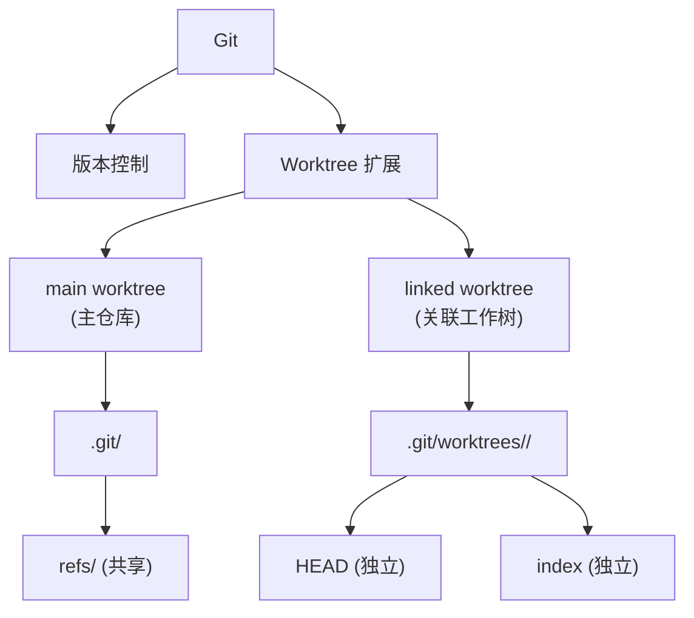
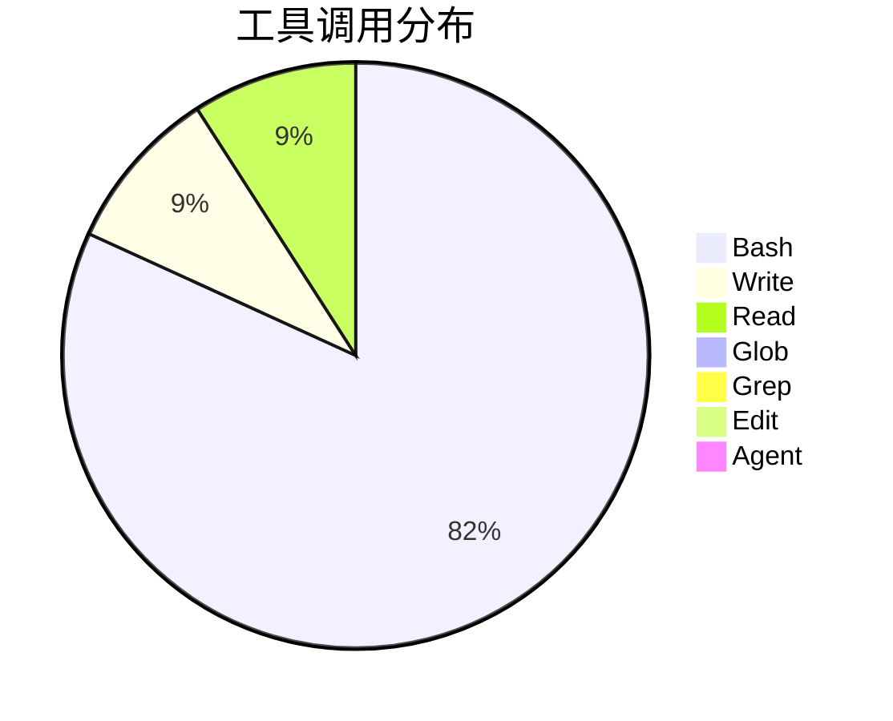
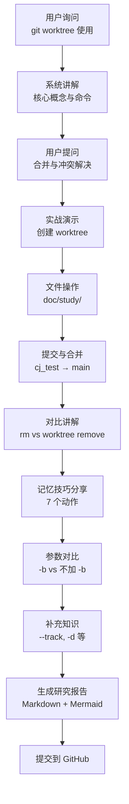
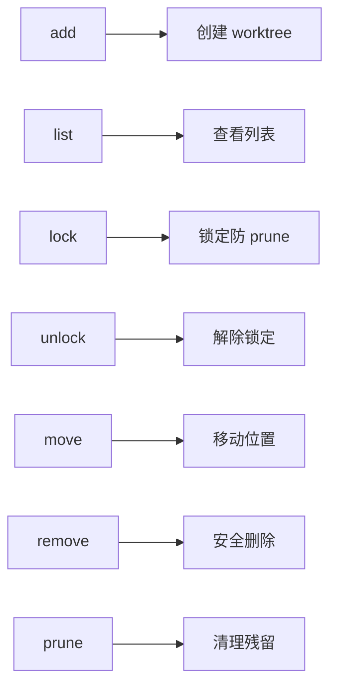
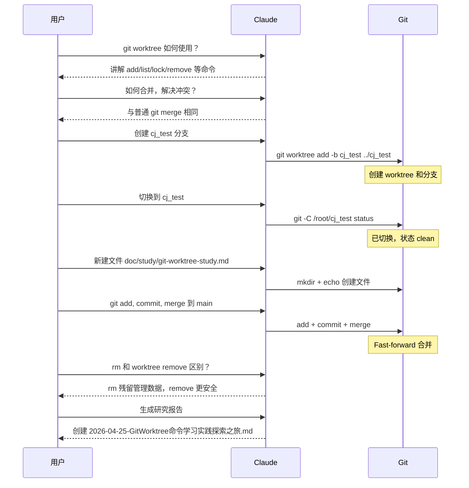
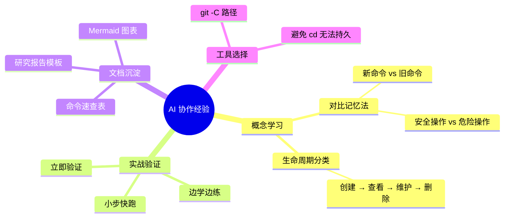

# Git Worktree 命令学习实践探索之旅

> **主题：** Git Worktree 核心命令与实战用法学习
> **日期：** 2026-04-25
> **预计耗时：** 0.5 小时（09:11 ~ 09:41，无长时间空闲）
> **受众：** AI 学习者 / Git 用户
> **会话 ID：** `session-2026-04-25`
> **项目路径：** `/root/sh`
> **GitHub 地址：** git@github.com:chujun/aiubuntu1-sh.git
> **本文档链接：** https://github.com/chujun/aiubuntu1-sh/blob/main/doc/ai-explore/2026-04-25-GitWorktree命令学习实践探索之旅.md
> **本文档链接（编码版）：** https://github.com/chujun/aiubuntu1-sh/blob/main/doc/ai-explore/2026-04-25-GitWorktree%E5%91%BD%E4%BB%A4%E5%AD%A6%E4%B9%A0%E5%AE%9E%E8%B7%B5%E6%8E%A2%E7%B4%A2%E4%B9%8B%E6%97%85.md

---

## 目录

- [一、AI 角色与工作概述](#一ai-角色与工作概述)
- [二、主要用户价值](#二主要用户价值)
- [三、解决的用户痛点](#三解决的用户痛点)
- [四、开发环境](#四开发环境)
- [五、技术栈](#五技术栈)
- [六、AI 模型 / 插件 / Agent / 技能 / MCP 使用统计](#六ai-模型--插件--agent--技能--mcp-使用统计)
- [七、会话主要内容](#七会话主要内容)
- [八、关键决策记录](#八关键决策记录)
- [九、主要挑战与转折点](#九主要挑战与转折点)
- [十、用户提示词清单](#十用户提示词清单)
- [十一、AI 辅助实践经验](#十一ai-辅助实践经验)

---

## 一、AI 角色与工作概述

### 角色定位

| 角色 | 说明 |
|------|------|
| 技术导师 | 系统讲解 git worktree 命令体系，帮助用户建立完整认知 |
| 文档整理者 | 生成结构化的研究报告，包含图表和命令速查表 |

### 具体工作

- 讲解 git worktree 核心概念（main worktree vs linked worktree）
- 演示创建、查看、锁定、移动、删除等 7 个核心命令
- 解释 `-b`、`-d`、`--track` 等关键参数的作用
- 对比 `rm -rf` 与 `git worktree remove` 的安全差异
- 分享记忆技巧（按生命周期分类，7 个动作）
- 实战演示：创建 worktree → 提交 → 合并 → 删除
- 生成图文并茂的 Markdown 研究报告

---

## 二、主要用户价值

1. **系统掌握 git worktree**：从概念到实战，建立完整知识体系
2. **对比记忆法**：通过与常规 git 命令对比、"rm vs git worktree remove"对比，加深理解
3. **实战验证**：通过真实操作（创建、合并、删除）巩固所学
4. **可复用文档**：生成的研究报告可作为日后参考

---

## 三、解决的用户痛点

| # | 用户痛点 | 简要描述 |
|---|---------|---------|
| 1 | 对 git worktree 命令不熟悉 | 知道有这个工具但不会用，不知道有哪些命令 |
| 2 | 不知道如何记忆新命令 | 面对大量新命令，不知道如何组织记忆 |
| 3 | 不清楚 rm 和 git worktree remove 的区别 | 可能误用 rm 导致 worktree 管理数据残留 |
| 4 | 缺乏实战验证 | 只看文档不够，需要实际动手操作加深理解 |

---

## 四、开发环境

| 项目 | 值 |
|------|-----|
| OS | Linux 6.8.0-107-generic |
| Shell | bash |
| Git 仓库 | `/root/sh` (git@github.com:chujun/aiubuntu1-sh.git) |
| 当前分支 | main |
| 工作目录 | /root/sh → /root/cj_test (worktree) |

---

## 五、技术栈



---

## 六、AI 模型 / 插件 / Agent / 技能 / MCP 使用统计

### 6.1 AI 大模型

**配置模型：**

| 模型 ID | 名称 | 用途 |
|---------|------|------|
| MiniMax-M2.7-highspeed | MiniMax M2.7 高速版 | 主对话 |

**实际调用模型：**

| 模型 ID | 模型名称 | 调用场景 | 说明 |
|--------|---------|---------|------|
| MiniMax-M2.7-highspeed | MiniMax M2.7 | 主对话 | 全程使用 |

### 6.2 开发工具

| 工具 | 说明 |
|------|------|
| Git | 版本控制，包含 worktree 子命令 |
| Bash | 执行 git 命令 |

### 6.3 插件（Plugin）

无

### 6.4 Agent（智能代理）

| Agent 名称 | 触发方式 | 执行结果 |
|-----------|---------|---------|
| 无 | - | - |

### 6.5 技能（Skill）

| 技能名称 | 触发命令 | 触发方 | 调用次数 | 是否完整执行 |
|---------|---------|-------|---------|------------|
| my-explore-doc-record | /my-explore-doc-record | 用户 | 1 次 | ✅ 完整 |

### 6.6 MCP 服务

| MCP 服务 | 工具前缀 | 本次调用次数 | 说明 |
|---------|---------|------------|------|
| （无） | — | 0 | 未配置 MCP 服务 |

### 6.7 Claude Code 工具调用统计



> **估算说明：** 基于会话记忆的估算值，Bash 主要用于 git worktree 操作和环境检查。

### 6.8 浏览器插件（用户环境，可选）

无

---

## 七、会话主要内容

### 7.1 任务全景



### 7.2 核心概念讲解

**架构特点：**

| 特点 | 说明 |
|------|------|
| 共享 refs | 所有 worktree 共享分支、tag |
| 独立 HEAD/index | 每个 worktree 有自己的工作状态 |
| 轻量链接 | 不是完整克隆，通过符号链接共享 |

**7 个核心命令：**



### 7.3 实战操作记录



---

## 八、关键决策记录

| 决策点 | 选项 A | 选项 B | 最终选择 | 理由 |
|--------|--------|--------|---------|------|
| 文档命名 | 移动现有文件加日期前缀 | 生成全新探索文档 | 生成全新探索文档 | 现有文件是研究报告，不是探索文档 |

---

## 九、主要挑战与转折点

| 挑战 | 初始判断 | 实际根因 | 转折点 |
|------|---------|---------|--------|
| Claude Code 每次命令后 cwd 重置 | 需要想办法持久切换目录 | Claude Code 设计行为，无法绕过 | 使用 `git -C <path>` 指定目录操作 |
| 用户疑惑 `.git` 目录结构 | 可能需要深入讲解 .git 内部 | 主要理解 worktree 管理机制即可 | 重点讲解 `worktrees/` 子目录作用 |

---

## 十、用户提示词清单（原文，一字未改）

**提示词 1：**
```
git worktree怎么使用
```

**提示词 2：**
```
git worktree如何合并，解决冲突问题
```

**提示词 3：**
```
git workfree 创建一个测试分支cj_test出来
```

**提示词 4：**
```
切换分支到cj_test
```

**提示词 5：**
```
那为什么pwd还是/root/sh
```

**提示词 6：**
```
在cj_test分支在doc/study目录下新建git-worktree-study.md文件，文件内容20260425
```

**提示词 7：**
```
git add ,commit,然后合并到主干分支main中去
```

**提示词 8：**
```
只是这儿有疑惑，继续
```

**提示词 9：**
```
直接使用rm命令删除cj_test目录有什么效果和使用git worktree remove方式删除有什么区别
```

**提示词 10：**
```
了解了，我对git常规命令很熟悉，但是对git worktree命令不熟悉，怎么记忆呢，整理表格还是有什么更好的方式
```

**提示词 11：**
```
git worktree add <path> [-b branch]，加-b参数和不加-b参数有什么区别
```

**提示词 12：**
```
还有哪些git worktree需要传授的吗
```

**提示词 13：**
```
根据本次会话聊天内容，生成XXXX研究报告，整理出markdown文档，图文并茂，要求包含图表，图表使用Mermaid格式，主题为XXXX，支持完整markdown文档文件下载
```

**提示词 14：**
```
git-worktree-study.md文件名添加日期前缀，并移动到 @doc/ai-share/ 目录下
```

**提示词 15：**
```
git add ,commit,push
```

**提示词 16：**
```
[技能调用] my-explore-doc-record
```

---

## 十一、AI 辅助实践经验（面向 AI 学习者）



### 经验表格

| 经验 | 核心教训 |
|------|---------|
| 对比记忆法 | 将新命令与熟悉命令对比（如 rm vs git worktree remove），加深印象 |
| 生命周期分类 | 按创建→查看→维护→删除分类，命令自然记住 |
| 小步实战 | 每学一个命令就实际执行，不要只看文档 |
| 文档即复习 | 写研究报告是对学习的最好检验 |
| 工具限制预判 | 提前预判工具限制（如 cd 不持久），选择替代方案 |

---

*文档生成时间：2026-04-25 | 由 MiniMax M2.7 (`MiniMax-M2.7-highspeed`) 辅助生成*
