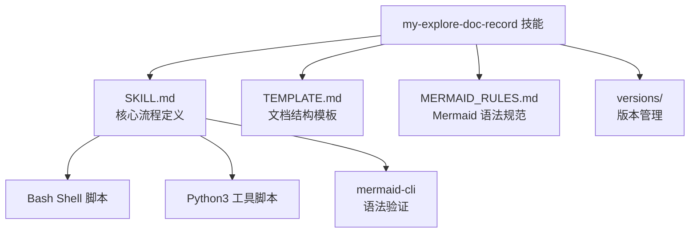
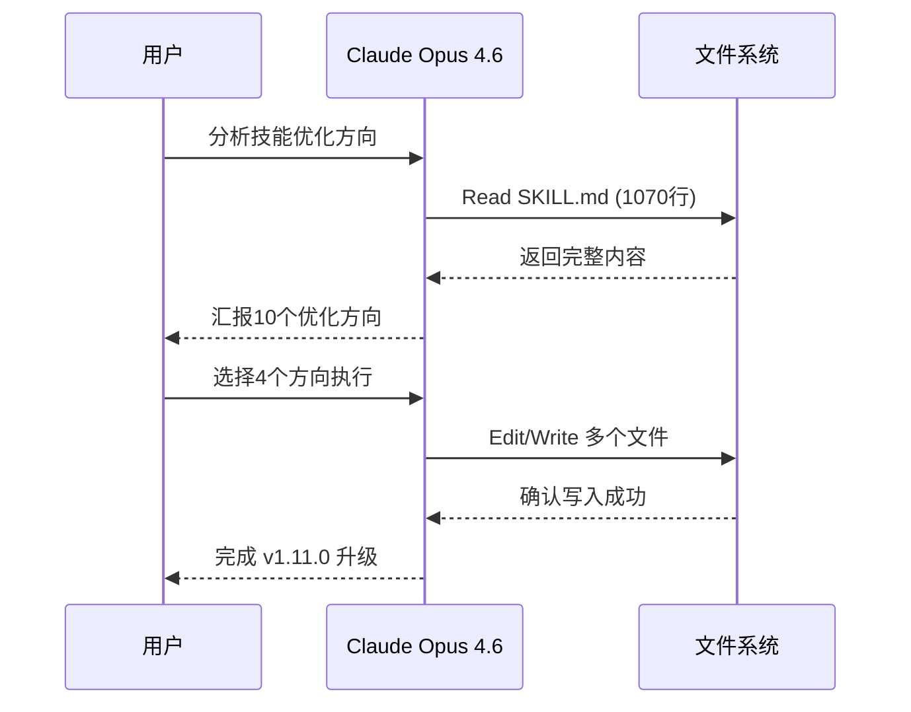
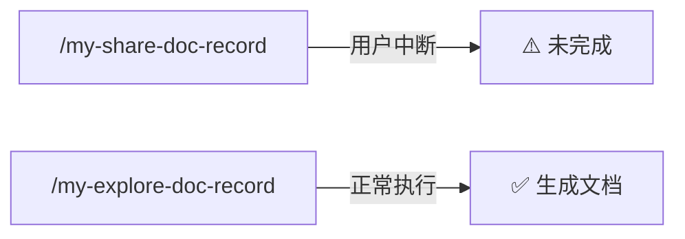
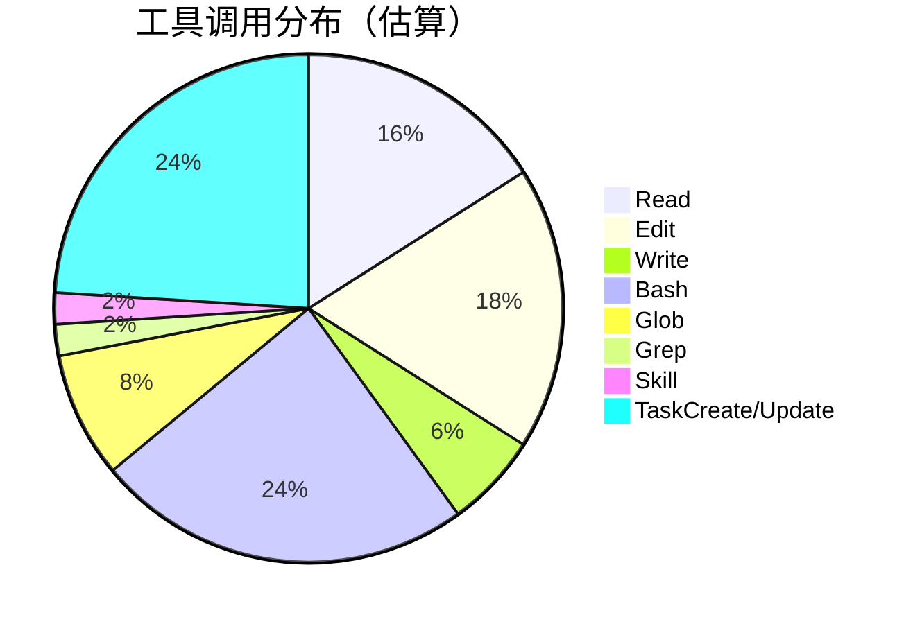
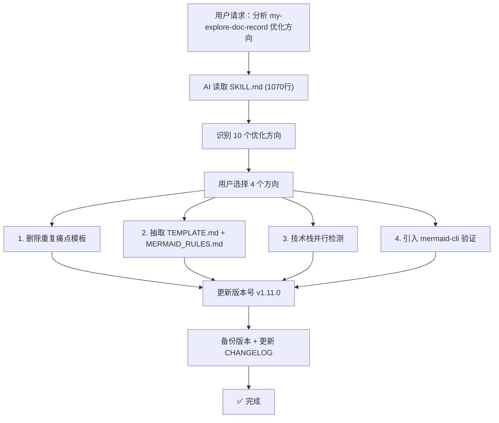
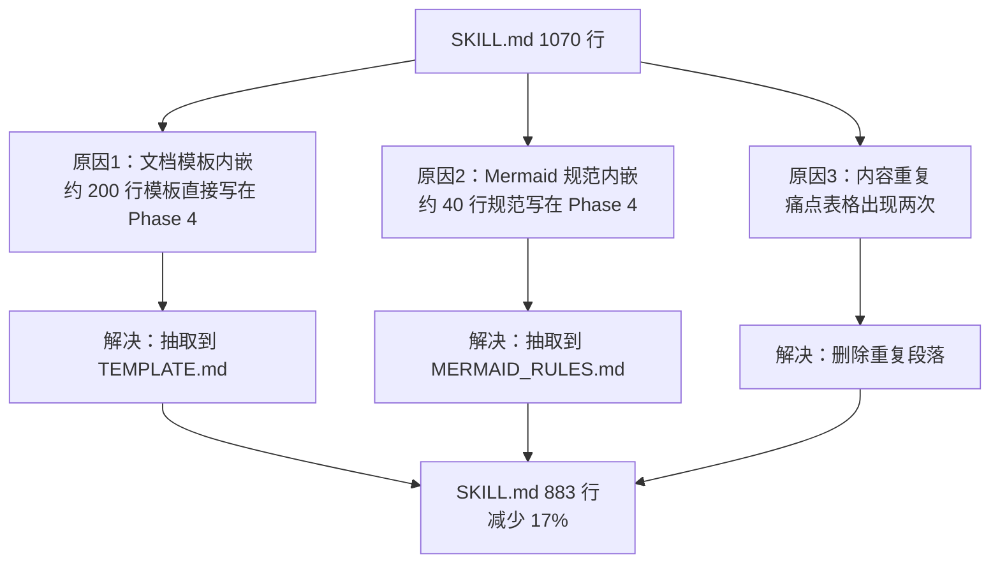
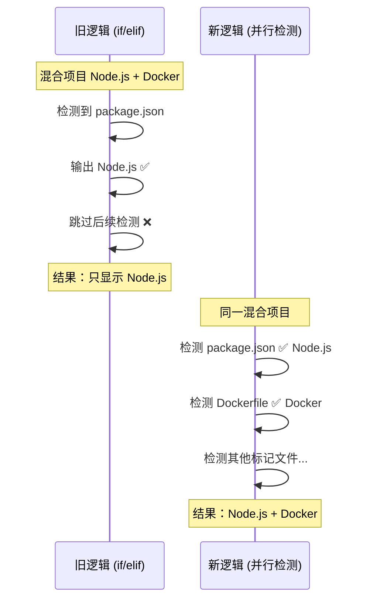
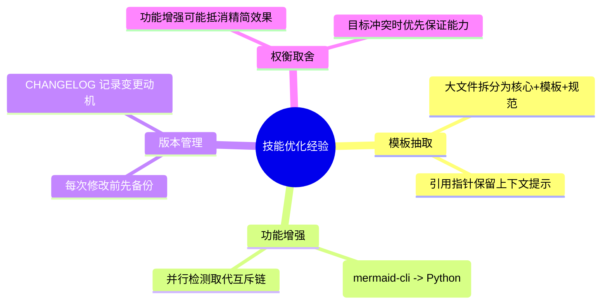

# my-explore-doc-record 技能优化 v4 实践探索之旅

> **主题：** my-explore-doc-record 技能结构优化与能力增强（v1.10.2 → v1.11.0）
> **日期：** 2026-04-25
> **预计耗时：** 0.5 小时（05:00 ~ 05:30，无长时间空闲）
> **受众：** AI 学习者 / Claude Code 使用者
> **会话 ID：** `52c41e24-6858-46c0-bc85-9af78c268486`
> **项目路径：** `/root/sh`
> **GitHub 地址：** https://github.com/chujun/aiubuntu1-sh
> **本文档链接：** https://github.com/chujun/aiubuntu1-sh/blob/main/doc/ai-explore/2026-04-25-my-explore-doc-record技能优化v4实践探索之旅.md
> **本文档链接（编码版）：** https://github.com/chujun/aiubuntu1-sh/blob/main/doc/ai-explore/2026-04-25-my-explore-doc-record%E6%8A%80%E8%83%BD%E4%BC%98%E5%8C%96v4%E5%AE%9E%E8%B7%B5%E6%8E%A2%E7%B4%A2%E4%B9%8B%E6%97%85.md

---

## 目录

- [一、解决的用户痛点](#一解决的用户痛点)
- [二、主要用户价值](#二主要用户价值)
- [三、AI 角色与工作概述](#三ai-角色与工作概述)
- [四、开发环境](#四开发环境)
- [五、技术栈](#五技术栈)
- [六、AI 模型 / 插件 / Agent / 技能 / MCP 使用统计](#六ai-模型--插件--agent--技能--mcp-使用统计)
- [七、会话主要内容](#七会话主要内容)
- [八、关键决策记录](#八关键决策记录)
- [九、主要挑战与转折点](#九主要挑战与转折点)
- [十、用户提示词清单](#十用户提示词清单)
- [十一、AI 辅助实践经验](#十一ai-辅助实践经验)

---

## 一、解决的用户痛点

> 本章从用户视角出发，阐述为什么这个案例值得关注。

### 痛点上下文描述

`my-explore-doc-record` 技能从 v1.3.1 迭代到 v1.10.2，经历了 10+ 次版本升级，SKILL.md 文件膨胀到 1070 行。每次调用技能时，整个文件都会被加载到 AI 的 context window 中，占用大量上下文空间。同时，技术栈检测逻辑过于简单，Mermaid 语法验证能力有限，文档模板和规范内容与核心流程混在一起，维护困难。

### 痛点清单

| # | 用户痛点 | 痛点背景（之前） | 解决后 |
|---|---------|----------------|--------|
| 1 | SKILL.md 体积过大占用 context | 1070 行全部加载到 AI 上下文，挤占其他内容的空间 | 抽取模板和规范到独立文件，SKILL.md 减至 883 行，模板按需读取 |
| 2 | 文档模板与核心流程耦合 | 修改模板需在巨大文件中定位，且存在重复内容（痛点表格出现两次） | 模板独立为 TEMPLATE.md（199 行），规范独立为 MERMAID_RULES.md（42 行） |
| 3 | 技术栈检测只识别单一技术栈 | if/elif 链互斥匹配，混合技术栈项目（如 Node.js + Docker）只显示第一个 | 并行检测 12 种标记文件，输出完整技术栈列表 |
| 4 | Mermaid 语法验证仅靠正则匹配 | Python 静态检查只覆盖 3 种错误模式，大量语法错误无法发现 | 优先使用 mermaid-cli 做真正的语法解析验证，回退模式增加未闭合括号检查 |

---

## 二、主要用户价值

1. **降低 context 占用**：SKILL.md 从 1070 行减至 883 行，模板和规范按需加载而非全量加载
2. **消除内容冗余**：删除重复的痛点模板（约 20 行），避免 AI 生成文档时产生混淆
3. **增强技术栈识别能力**：支持同时识别 12 种技术栈（Node.js、Go、Python、Rust、Java/Kotlin、Ruby、PHP、Swift、C/C++、Docker 等），适配混合技术栈项目
4. **提升 Mermaid 验证可靠性**：引入 mermaid-cli 做真正的语法解析，确保图表在 GitHub/渲染器中正确显示

---

## 三、AI 角色与工作概述

### 角色定位

| 角色 | 说明 |
|------|------|
| 代码审查者 | 分析 SKILL.md 的 1070 行代码，识别冗余、耦合等问题 |
| 重构工程师 | 执行文件拆分、模板抽取、代码优化 |
| 架构师 | 设计模板引用机制和 Mermaid 验证分层策略 |

### 具体工作

- 分析 SKILL.md 找出 10 个可优化方向并向用户汇报
- 删除重复的痛点模板（第 670-690 行与第 601-630 行重复）
- 抽取文档结构模板到独立文件 TEMPLATE.md
- 抽取 Mermaid 语法规范到独立文件 MERMAID_RULES.md
- 将技术栈检测从 if/elif 单选链改为并行检测 12 种标记文件
- 引入 mermaid-cli 语法验证，设计优雅降级策略
- 更新版本号（v1.10.2 → v1.11.0）、VERSIONS.json、CHANGELOG.md

---

## 四、开发环境

| 项目 | 说明 |
|------|------|
| OS | Linux 6.8.0-107-generic |
| Shell | bash |
| Node.js | v24.14.0（用于 npx mermaid-cli） |
| Python | python3（用于脚本工具） |
| Git | 已配置远端 GitHub |

---

## 五、技术栈



| 层次 | 技术 | 用途 |
|------|------|------|
| 技能定义 | Markdown (SKILL.md) | 技能流程和规则描述 |
| 模板 | Markdown (TEMPLATE.md) | 文档结构和示例 |
| 脚本 | Bash / Python3 | 元数据收集、技术栈检测、语法验证 |
| 验证 | @mermaid-js/mermaid-cli | Mermaid 图表真实语法解析 |
| 版本管理 | JSON + Markdown | VERSIONS.json + CHANGELOG.md |

---

## 六、AI 模型 / 插件 / Agent / 技能 / MCP 使用统计

### 6.1 AI 大模型

**配置模型：**

| 模型 ID | 名称 | 用途 |
|---------|------|------|
| `claude-opus-4-6` | Opus 4.6 | 主对话 |

**实际调用模型：**

| 模型 ID | 模型名称 | 调用场景 | 说明 |
|---------|---------|---------|------|
| `claude-opus-4-6` | Opus 4.6 | 主对话 | 全程使用，未切换模型 |

### 6.2 开发工具

| 工具 | 用途 |
|------|------|
| Claude Code CLI | 主开发环境 |
| Git | 版本管理 |

### 6.3 插件（Plugin）

本次会话未使用浏览器插件。

### 6.4 Agent（智能代理）

本次会话未调用 Agent 子代理。



### 6.5 技能（Skill）

| 技能名称 | 触发命令 | 触发方 | 调用次数 | 是否完整执行 |
|---------|---------|-------|---------|------------|
| my-share-doc-record | /my-share-doc-record | 用户 | 1 次 | ⚠️ 用户中断 |
| my-explore-doc-record | /my-explore-doc-record | 用户 | 1 次 | ✅ 执行中 |



### 6.6 MCP 服务

| MCP 服务 | 工具前缀 | 本次调用次数 | 说明 |
|---------|---------|------------|------|
| context7 | mcp__context7__ | 0 | 本次无需查阅外部文档 |
| playwright | mcp__playwright__ | 0 | 本次无需浏览器操作 |

### 6.7 Claude Code 工具调用统计



> ⚠️ 以上数据为基于会话记忆的估算值，非精确统计。TaskCreate/Update 调用次数较多是因为使用了 Task 工具管理 6 个子任务的进度。

### 6.8 浏览器插件

本次会话未涉及浏览器环境。

---

## 七、会话主要内容

### 7.1 任务全景



### 7.2 核心问题 1：SKILL.md 文件膨胀

**问题描述：** SKILL.md 从 v1.3.1 的基础版本经过 10+ 次迭代膨胀到 1070 行，远超推荐的 200-400 行。

**根因分析：**



### 7.3 核心问题 2：技术栈检测与 Mermaid 验证能力不足

**技术栈检测改进：**



---

## 八、关键决策记录

| 决策点 | 选项 A | 选项 B | 最终选择 | 理由 |
|--------|--------|--------|---------|------|
| 模板抽取方式 | 在 SKILL.md 中保留摘要 + 引用指针 | 完全移除，只留文件路径 | 选项 A | 保留简要说明让 AI 知道模板的存在和用途 |
| Mermaid 验证策略 | 完全替换为 mermaid-cli | mermaid-cli 优先 + Python 回退 | 选项 B | mermaid-cli 需要 npx 安装，不是所有环境都可用 |
| 技术栈检测范围 | 只增加 Docker 检测 | 全面扩展到 12 种技术栈 | 选项 B | 一次性覆盖主流技术栈，避免后续反复修改 |
| 版本号递增 | patch (1.10.3) | minor (1.11.0) | minor | 涉及新增能力（mermaid-cli）和新文件（TEMPLATE/MERMAID_RULES） |

---

## 九、主要挑战与转折点

| 挑战 | 初始判断 | 实际根因 | 转折点 |
|------|---------|---------|--------|
| SKILL.md 预期减至 640 行但实际 883 行 | 抽取模板后应大幅减少 | mermaid-cli 验证脚本新增了约 40 行（比原脚本更长），抵消了部分减量 | 认识到增强功能和精简体积是两个可能冲突的目标，需要权衡 |
| mermaid-cli 可用性检测 | 直接调用 `npx @mermaid-js/mermaid-cli --version` | npx 首次运行需要下载包，耗时较长（>10秒） | 在验证脚本中设置 30 秒超时，并加入 `--yes` 参数自动确认安装 |
| 重复痛点模板的定位 | 以为只有简单重复 | 两处模板结构不同（一处 4 列含「痛点背景」和「解决后」，另一处 3 列只有「简要描述」），需确认删除哪个 | 保留内容更丰富的 4 列版本，删除简化的 3 列版本 |

---

## 十、用户提示词清单（原文，一字未改）

### 【上一会话（已归档到摘要）】

（本次会话从 compaction 恢复，上一会话仅有一条 git 操作，无需记录）

### 【当前会话】

**提示词 1：**
```
my-explore-doc-record 这个技能有哪些可以优化的地方
```

**提示词 2：**
```
1. 文档结构冗余。2.精简SKILL.md 将「文档结构模板」（Phase 4 的 markdown 模板）抽取到独立文件如 TEMPLATE.md。 将「Mermaid 语法规范」抽取到 MERMAID_RULES.md。3.改为并行检测所有标记文件，输出所有匹配的技术栈列表。 4.考虑引入 npx @mermaid-js/mermaid-cli 做真正的语法验证（如环境可用）
```

**提示词 3：** `[技能调用]`
```
/my-share-doc-record
```
（用户中断执行）

**提示词 4：** `[技能调用]`
```
/my-explore-doc-record
```

---

## 十一、AI 辅助实践经验（面向 AI 学习者）



| 经验 | 核心教训 |
|------|---------|
| 大文件应按职责拆分 | 模板、规范、核心逻辑分离，降低单文件认知负担，也减少 context 占用 |
| 优雅降级比二选一更好 | mermaid-cli 优先 + Python 回退，确保任何环境都能工作 |
| 并行检测优于互斥匹配 | if/elif 链天然排斥混合场景，并行检测更贴合现实 |
| 删除冗余前先比对差异 | 两处看似重复的模板实际结构不同，需确认保留哪个版本 |
| 版本号递增要匹配变更级别 | 新增文件和新增能力用 minor，纯修复用 patch |

---

*文档生成时间：2026-04-25 | 由 Opus 4.6 (`claude-opus-4-6`) 辅助生成*
