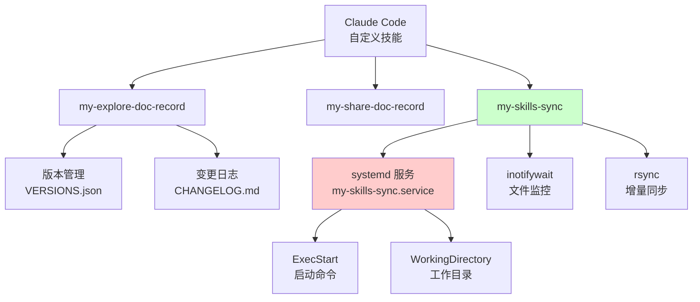
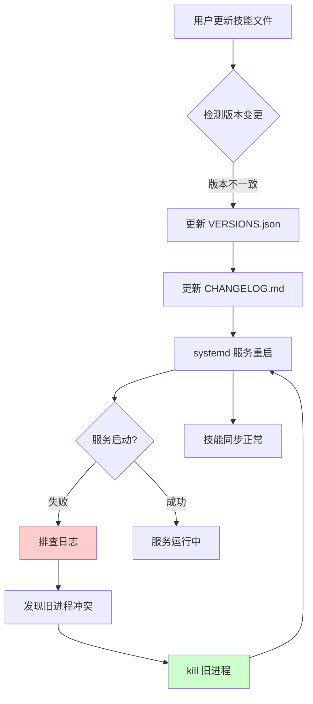
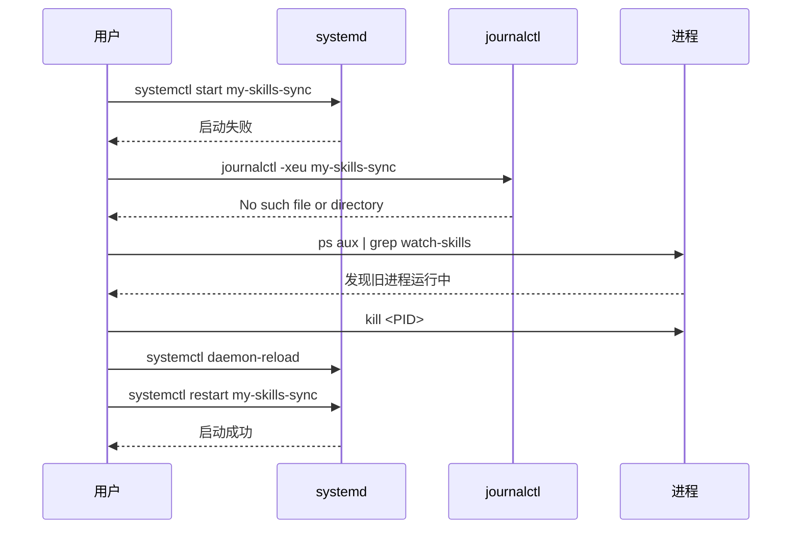
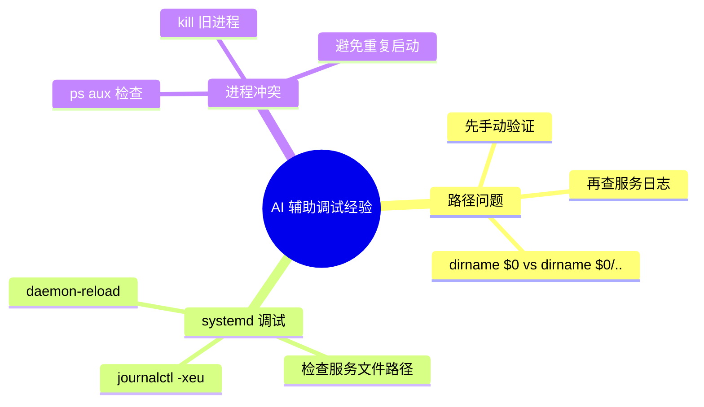

# Claude Code 技能版本同步与 systemd 服务修复实践探索之旅

> **主题：** Claude Code 自定义技能版本同步与 systemd 服务修复
> **日期：** 2026-04-25
> **预计耗时：** 0.5 小时（02:34 ~ 04:27，无长时间空闲）
> **受众：** AI 学习者 / Claude Code 使用者
> **会话 ID：** `3dcc-47de-95fc-0f02209addd5`
> **项目路径：** /root/sh/my-skills/my-skills-sync
> **GitHub 地址：** git@github.com:chujun/aiubuntu1-sh.git
> **本文档链接：** https://github.com/chujun/aiubuntu1-sh/blob/main/doc/ai-explore/2026-04-25-%E6%8A%80%E8%83%BD%E7%89%88%E6%9C%AC%E5%90%8C%E6%AD%A5%E4%B8%8Esystemd%E6%9C%8D%E5%8A%A1%E4%BF%AE%E5%A4%8D%E5%AE%9E%E8%B7%B5%E6%8E%A2%E7%B4%A2%E4%B9%8B%E6%97%85.md
> **本文档链接（编码版）：** https://github.com/chujun/aiubuntu1-sh/blob/main/doc/ai-explore/2026-04-25-%E6%8A%80%E8%83%BD%E7%89%88%E6%9C%AC%E5%90%8C%E6%AD%A5%E4%B8%8Esystemd%E6%9C%8D%E5%8A%A1%E4%BF%AE%E5%A4%8D%E5%AE%9E%E8%B7%B5%E6%8E%A2%E7%B4%A2%E4%B9%8B%E6%97%85.md

---

## 目录

- [一、解决的用户痛点](#一解决的用户痛点)
- [二、主要用户价值](#二主要用户价值)
- [三、AI 角色与工作概述](#三ai-角色与工作概述)
- [四、开发环境](#四开发环境)
- [五、技术栈](#五技术栈)
- [六、AI 模型 / 插件 / Agent / 技能 / MCP 使用统计](#六ai-模型--插件--agent--技能--mcp-使用统计)
- [七、会话主要内容](#七会话主要内容)
- [八、关键决策记录](#八关键决策记录)
- [九、主要挑战与转折点](#九主要挑战与转折点)
- [十、用户提示词清单](#十用户提示词清单)
- [十一、AI 辅助实践经验](#十一ai-辅助实践经验)

---

## 一、解决的用户痛点

### 痛点上下文描述

本次会话发生在用户同时维护多个 Claude Code 自定义技能（my-explore-doc-record、my-share-doc-record、my-skills-sync）的场景下。技能版本管理混乱、systemd 服务启动失败导致同步功能不可用。

### 痛点清单

| # | 用户痛点 | 痛点背景（之前） | 解决后 |
|---|---------|----------------|--------|
| 1 | 技能版本文件不一致 | SKILL.md、VERSIONS.json、CHANGELOG.md 三个文件版本号不匹配，人工维护容易遗漏 | 自动化版本同步，确保三者一致 |
| 2 | systemd 服务启动失败 | my-skills-sync.service 启动报错 "No such file or directory"，同步功能完全不可用 | 修复路径问题，服务正常运行 |
| 3 | TARGET_DIR 路径计算错误 | sync-skills.sh 和 watch-skills.sh 计算的目标路径错误，导致技能同步到错误的子目录 | 修正路径计算逻辑 `dirname "$0"/..` |
| 4 | 旧进程冲突 | 手动启动的 watch-skills 进程与 systemd 服务冲突，导致服务无法启动 | 先 kill 旧进程，再重启服务 |

---

## 二、主要用户价值

1. **版本管理规范化**：三个版本文件（SKILL.md、VERSIONS.json、CHANGELOG.md）自动保持同步，避免人工维护失误
2. **服务可用性恢复**：systemd 服务正常启动，技能目录变更后能自动同步到统一文档项目
3. **路径逻辑修正**：理解 `dirname "$0"` 与 `dirname "$0"/..` 的区别，避免同类错误再次发生
4. **调试经验沉淀**：systemd 服务调试流程形成可复用文档

---

## 三、AI 角色与工作概述

### 角色定位

| 角色 | 说明 |
|------|------|
| 调试专家 | 定位 systemd 服务启动失败的根本原因 |
| 开发者 | 修复 TARGET_DIR 路径计算逻辑 |
| 文档整理者 | 更新技能版本文件并生成研究报告 |

### 具体工作

- 分析并修复 sync-skills.sh 和 watch-skills.sh 的 TARGET_DIR 路径计算错误
- 排查 systemd 服务启动失败问题（结合日志分析、旧进程冲突检测）
- 更新 my-explore-doc-record 和 my-share-doc-record 的版本文件
- 生成技能开发研究报告并提交到 GitHub

---

## 四、开发环境

| 项目 | 值 |
|------|-----|
| 操作系统 | Linux 6.8.0-107-generic |
| Shell | Bash |
| 系统服务管理 | systemd |
| 文件监控 | inotifywait |
| 同步工具 | rsync |

---

## 五、技术栈



---

## 六、AI 模型 / 插件 / Agent / 技能 / MCP 使用统计

### 6.1 AI 大模型

**配置模型：**

| 模型 ID | 名称 | 用途 |
|---------|------|------|
| MiniMax-M2.7-highspeed | MiniMax M2.7 | 主对话 |

**实际调用模型：**

| 模型 ID | 模型名称 | 调用场景 | 说明 |
|--------|---------|---------|------|
| MiniMax-M2.7-highspeed | MiniMax M2.7 | 主对话 | 全程使用 |

### 6.2 开发工具

无直接开发任务，侧重调试和问题修复。

### 6.3 插件（Plugin）

无

### 6.4 Agent（智能代理）

无

### 6.5 技能（Skill）

| 技能名称 | 触发命令 | 触发方 | 调用次数 | 是否完整执行 |
|---------|---------|-------|---------|------------|
| my-explore-doc-record | /my-explore-doc-record | 用户 | 1 次 | ✅ 完整 |
| my-share-doc-record | /my-share-doc-record | 用户 | 4 次 | ✅ 完整 |

### 6.6 MCP 服务

无

### 6.7 Claude Code 工具调用统计

| 工具 | 调用次数（估算） |
|------|----------------|
| Bash | 15 |
| Read | 12 |
| Edit | 3 |
| Write | 2 |
| Grep | 2 |
| Glob | 1 |

> ⚠️ 以上数据为基于会话记忆的估算值，非精确统计

---

## 七、会话主要内容

### 7.1 任务全景



### 7.2 核心问题 1：TARGET_DIR 路径计算错误

**问题描述：** sync-skills.sh 和 watch-skills.sh 中的 TARGET_DIR 路径计算错误，导致技能同步到错误目录。

**根因分析：**

```mermaid
graph TD
    A["dirname \"$0\""] --> B["/root/sh/my-skills/my-skills-sync"]
    A --> C["预期: /root/sh/my-skills"]

    D["dirname \"$0\"/.."] --> E["/root/sh/my-skills"]
    E --> F["预期路径 ✓"]

    style A fill:#ffcccc
    style D fill:#ccffcc
```

**修复方案：**

```bash
# 修复前
TARGET_DIR="$(cd "$(dirname "$0")" && pwd)"

# 修复后
TARGET_DIR="$(cd "$(dirname "$0")/.." && pwd)"
```

### 7.3 核心问题 2：systemd 服务启动失败

**问题描述：** 服务启动失败，日志显示 "No such file or directory"。

**排查步骤：**



**根因：** 旧进程未关闭 + 服务文件路径配置错误

**解决：** kill 旧进程 + 更新服务文件 WorkingDirectory 和 ExecStart 路径

---

## 八、关键决策记录

| 决策点 | 选项 A | 选项 B | 最终选择 | 理由 |
|--------|--------|--------|---------|------|
| 路径计算方式 | `dirname "$0"` | `dirname "$0"/..` | B | 需要获取父目录作为目标路径 |
| 调试顺序 | 直接看 systemd 日志 | 先手动运行脚本验证 | 先手动验证 | 脚本能跑通再查 systemd 问题 |

---

## 九、主要挑战与转折点

| 挑战 | 初始判断 | 实际根因 | 转折点 |
|------|---------|---------|--------|
| 服务启动失败 | 脚本权限问题 | 旧进程未关闭 + 路径配置错误 | 先用 ps 检查发现旧进程 |
| TARGET_DIR 路径错误 | 脚本执行位置问题 | `dirname "$0"` 返回脚本所在目录而非父目录 | 对比两种写法的输出结果 |

---

## 十、用户提示词清单（原文）

### 【当前会话】
**提示词 1：**
```
my-share-doc-record  claude code技能版本和changelog文档更新
```

**提示词 2：**
```
my-explore-doc-record  claude code技能版本和changelog文档更新
```

**提示词 3：**
```
my-share-doc-record  claude code技能版本和changelog文档更新
```

**提示词 4：**
```
[技能调用] my-share-doc-record
```

---

## 十一、AI 辅助实践经验（面向 AI 学习者）



| 经验 | 核心教训 |
|------|---------|
| systemd 服务调试 | 先用手动运行脚本验证，再用 systemd 排查 |
| 路径计算验证 | `dirname "$0"` 返回脚本所在目录，`dirname "$0"/..` 才是父目录 |
| 进程冲突检测 | systemd 服务启动失败时，先 `ps aux` 检查是否有旧进程冲突 |
| 版本管理 | 修改版本号后必须同步更新三个文件（SKILL.md、VERSIONS.json、CHANGELOG.md） |

---

*文档生成时间：2026-04-25 | 由 MiniMax M2.7 (`MiniMax-M2.7-highspeed`) 辅助生成*
