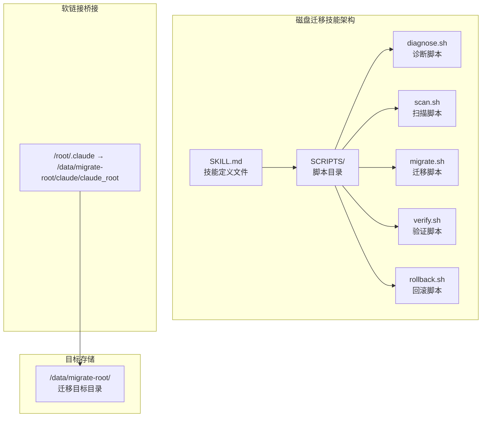
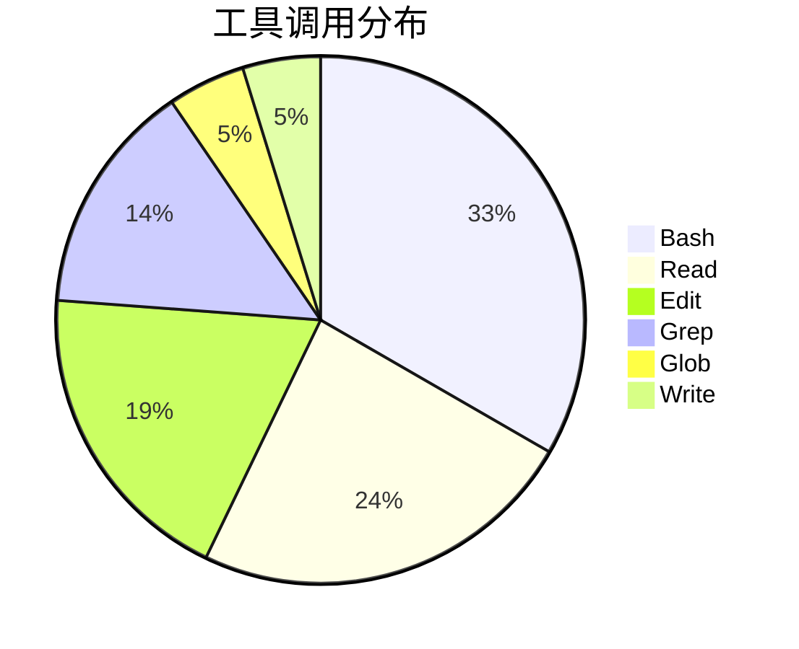
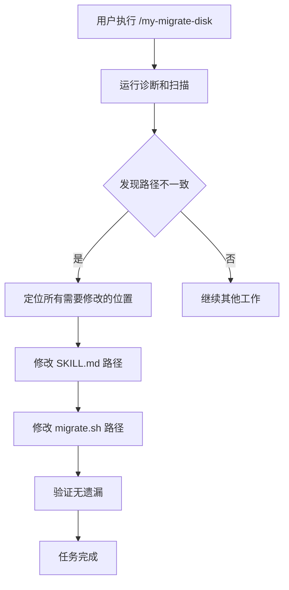
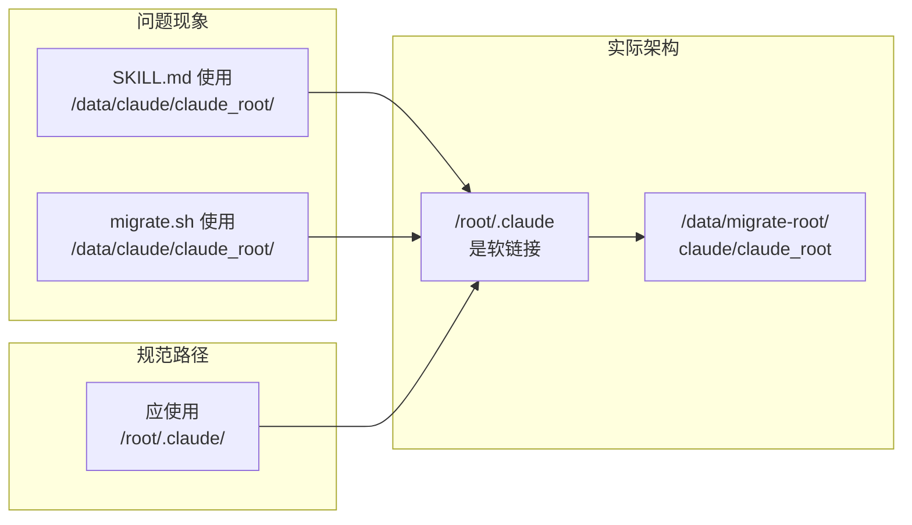
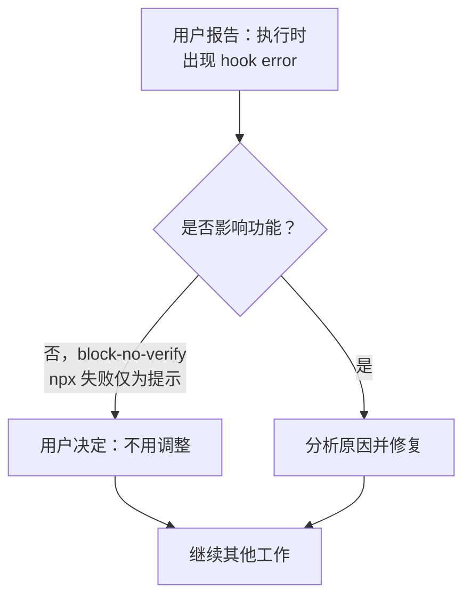
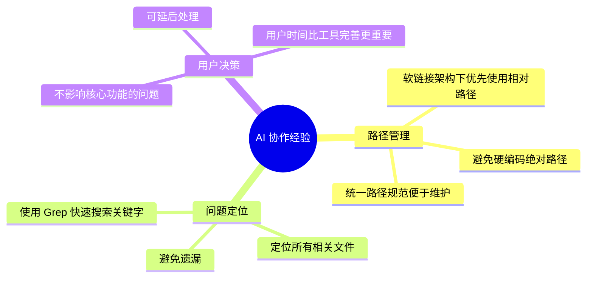

# my-migrate-disk 技能优化实践探索之旅

> **主题：** 通用根目录磁盘迁移技能路径规范化优化
> **日期：** 2026-04-27
> **预计耗时：** 0.6 小时（02:45 ~ 03:05，无长时间空闲）
> **受众：** AI 学习者 / Claude Code 使用者
> **会话 ID：** `e6f0c93c-16cc-40f0-a39a-4afe05b43203`
> **项目路径：** /data/migrate-root/claude/claude_root/skills/my-migrate-disk
> **GitHub 地址：** git@github.com:chujun/aiubuntu1-sh.git
> **本文档链接：** https://github.com/chujun/aiubuntu1-sh/blob/main/doc/ai-explore/2026-04-27-my-migrate-disk技能优化实践探索之旅.md
> **本文档链接（编码版）：** https://github.com/chujun/aiubuntu1-sh/blob/main/doc/ai-explore/2026-04-27-my-migrate-disk%E6%8A%80%E8%83%BD%E4%BC%98%E5%8C%96%E5%AE%9E%E8%B7%B5%E6%8E%A2%E7%B4%A2%E4%B9%8B%E6%97%85.md

---

## 目录

- [一、解决的用户痛点](#一解决的用户痛点)
- [二、主要用户价值](#二主要用户价值)
- [三、AI 角色与工作概述](#三ai-角色与工作概述)
- [四、开发环境](#四开发环境)
- [五、技术栈](#五技术栈)
- [六、AI 模型 / 插件 / Agent / 技能 / MCP 使用统计](#六ai-模型--插件--agent--技能--mcp-使用统计)
- [七、会话主要内容](#七会话主要内容)
- [八、关键决策记录](#八关键决策记录)
- [九、主要挑战与转折点](#九主要挑战与转折点)
- [十、用户提示词清单](#十用户提示词清单)
- [十一、AI 辅助实践经验](#十一ai-辅助实践经验)

---

## 一、解决的用户痛点

### 痛点上下文描述

my-migrate-disk 技能是用于解决根目录磁盘空间不足的通用迁移工具，通过软链接方式将大目录迁移到 /data/migrate-root/。技能在早期版本中使用了硬编码的绝对路径 `/data/claude/claude_root/skills/my-migrate-disk`，但由于 /root/.claude 本身已被软链接到 /data/migrate-root/claude/claude_root，导致路径不一致的问题。

### 痛点清单

| # | 用户痛点 | 痛点背景（之前） | 解决后 |
|---|---------|----------------|--------|
| 1 | 路径不一致导致维护困难 | SKILL.md 和脚本中混用 /data/claude/claude_root/ 和 /root/.claude/ 两种路径，技能文档与实际执行路径不匹配 | 统一使用 /root/.claude/skills/my-migrate-disk/ 路径，与软链接结构一致 |
| 2 | 用户运行命令时产生困惑 | 用户根据文档执行命令时发现路径与实际不符，降低对技能的信任度 | 文档路径与实际路径统一，用户可直接复制执行 |

---

## 二、主要用户价值

1. **路径规范统一** - 消除技能内路径混用问题，提升文档可读性和可维护性
2. **软链接架构清晰** - 由于 /root/.claude 是软链接指向 /data/migrate-root/claude/claude_root，使用 /root/.claude 路径更符合实际架构
3. **用户体验提升** - 用户可直接复制文档中的命令执行，无需手动转换路径
4. **技能健壮性增强** - 避免因路径硬编码导致的潜在维护问题

---

## 三、AI 角色与工作概述

### 角色定位

| 角色 | 说明 |
|------|------|
| 代码审查者 | 发现并指出技能中路径不一致的问题 |
| 优化工程师 | 执行路径规范化的代码修改 |

### 具体工作

- 发现 SKILL.md 中 6 处硬编码路径需要统一修改
- 发现 migrate.sh 中 2 处示例命令路径需要更新
- 使用 Grep 工具快速定位所有需要修改的位置
- 逐个文件执行 Edit 修改，确保修改准确无误
- 验证修改完成，无遗漏

---

## 四、开发环境

- **操作系统：** Linux 6.8.0-107-generic (Ubuntu)
- **Shell：** bash
- **主要工具：** Claude Code CLI
- **技能目录：** /root/.claude/skills/my-migrate-disk/（软链接到 /data/migrate-root/claude/claude_root/skills/my-migrate-disk）

---

## 五、技术栈



| 组件 | 类型 | 说明 |
|------|------|------|
| my-migrate-disk | 技能 | 通用根目录磁盘空间迁移工具 |
| diagnose.sh | Bash 脚本 | 诊断磁盘空间使用情况 |
| scan.sh | Bash 脚本 | 扫描超过阈值的目录 |
| migrate.sh | Bash 脚本 | 执行迁移创建软链接 |
| verify.sh | Bash 脚本 | 验证迁移结果 |
| rollback.sh | Bash 脚本 | 回滚迁移的目录 |
| /data/migrate-root/ | 目录 | 统一迁移目标目录 |

---

## 六、AI 模型 / 插件 / Agent / 技能 / MCP 使用统计

### 6.1 AI 大模型

**配置模型（system-reminder 声明）：**

| 模型 ID | 名称 | 用途 | 调用范围 |
|---------|------|------|---------|
| MiniMax-M2.7-highspeed | MiniMax M2.7 高速版 | 主对话 | 全程 |

**实际调用模型（会话真实使用）：**

| 模型 ID | 模型名称 | 调用场景 | 说明 |
|--------|---------|---------|------|
| MiniMax-M2.7-highspeed | MiniMax M2.7 高速版 | 主对话 | 用户选择的高速模型 |

### 6.2 开发工具

| 工具名称 | 用途 |
|---------|------|
| Bash | 执行诊断、扫描、验证命令 |
| Read | 读取技能文件内容 |
| Edit | 修改路径配置 |
| Grep | 搜索定位需要修改的文件 |
| Glob | 查找钩子配置文件 |
| Write | 生成探索文档 |

### 6.3 插件（Plugin）

| 插件名称 | 状态 | 说明 |
|---------|------|------|
| everything-claude-code | 启用 | Claude Code 生态插件 |

### 6.4 Agent（智能代理）

本次会话未调用 Agent。

### 6.5 技能（Skill）

| 技能名称 | 触发命令 | 触发方 | 调用次数 | 是否完整执行 |
|---------|---------|-------|---------|------------|
| my-migrate-disk | /my-migrate-disk | 用户 | 3次 | ✅完整执行 |
| my-explore-doc-record | /my-explore-doc-record | 用户 | 1次 | 🔄生成中 |

### 6.6 MCP 服务

| MCP 服务 | 工具前缀 | 本次调用次数 | 说明 |
|---------|---------|------------|------|
| context7 | mcp__context7__ | 0 | 未调用 |

### 6.7 Claude Code 工具调用统计



> **估算说明：** 基于会话记忆的估算值，非精确统计。

### 6.8 浏览器插件（用户环境，可选）

未涉及浏览器插件相关问题。

---

## 七、会话主要内容

### 7.1 任务全景



### 7.2 核心问题：路径规范化

**根因分析：**



**修复方案：**
1. 使用 `replace_all` 模式批量替换 SKILL.md 中的路径
2. 逐个定位并修改 migrate.sh 中的两处示例路径
3. 使用 Grep 验证所有路径已统一

### 7.3 钩子错误处理决策



**决策理由：** hook error 来源于 `everything-claude-code` 插件的 PreToolUse 钩子（block-no-verify），在当前目录缺少 package.json 时 npx 失败。不影响核心功能，用户选择接受现状。

---

## 八、关键决策记录

| 决策点 | 选项 A | 选项 B | 最终选择 | 理由 |
|--------|--------|--------|---------|------|
| 路径格式 | 使用 /data/claude/claude_root/（历史路径） | 使用 /root/.claude/（软链接路径） | /root/.claude/ | 更符合软链接架构，文档与实际一致 |
| hook error 处理 | 修复 npx 环境问题 | 不调整，接受提示错误 | 不调整 | 不影响核心功能，用户时间宝贵 |

---

## 九、主要挑战与转折点

| 挑战 | 初始判断 | 实际根因 | 转折点 |
|------|---------|---------|--------|
| 路径不一致问题 | 可能是 skill 配置问题 | 技能早期版本硬编码了具体路径 | 用户指出后逐个文件修复 |

---

## 十、用户提示词清单（原文，一字未改）

### 【当前会话】

**提示词 1：**
```
/my-migrate-disk 磁盘迁移
```

**提示词 2：**
```
技能优化， /data/migrate-root/claude/claude_root/skills/my-migrate-disk/SCRIPTS/scan.sh，这个路径是不是错误了，建议使用/root/.claude下的路径进行执行
```

**提示词 3：**
```
那不用调整了
```

---

## 十一、AI 辅助实践经验（面向 AI 学习者）



| 经验 | 核心教训 |
|------|---------|
| 路径规范统一 | 软链接架构中，应使用链接路径而非目标路径，保持文档与实际一致 |
| 批量修改技巧 | 使用 replace_all 模式可高效完成同类型修改 |
| 用户优先级 | 当问题不影响核心功能时，尊重用户对处理顺序的决策 |

---

*文档生成时间：2026-04-27 | 由 MiniMax M2.7 高速版 (`MiniMax-M2.7-highspeed`) 辅助生成*
