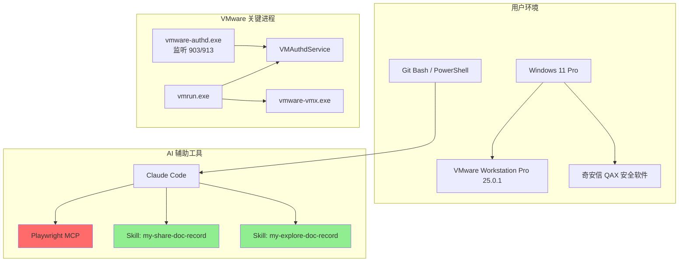
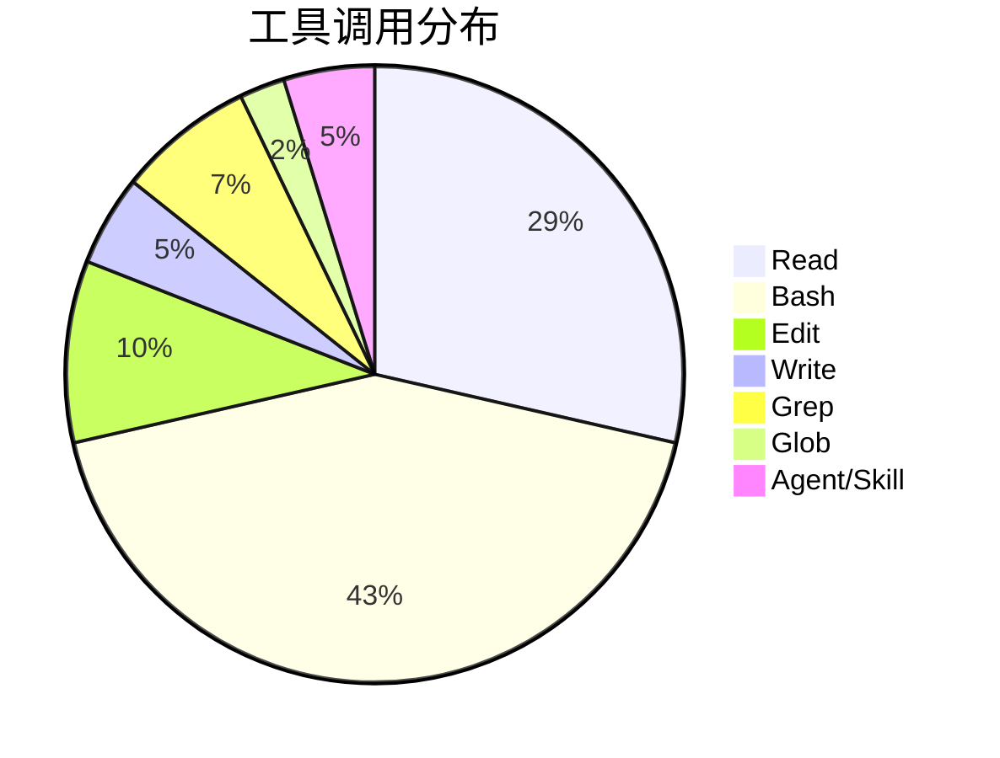
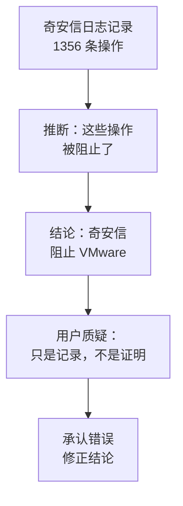
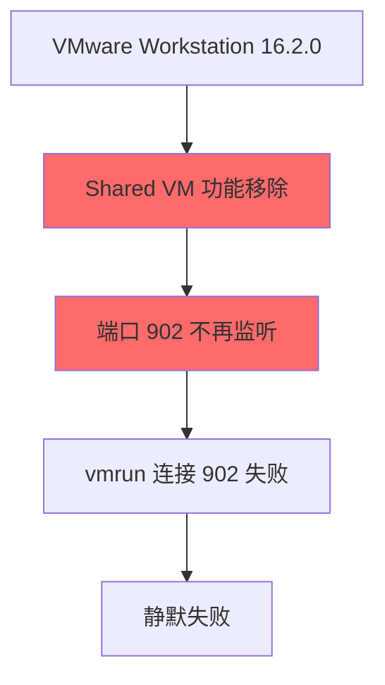
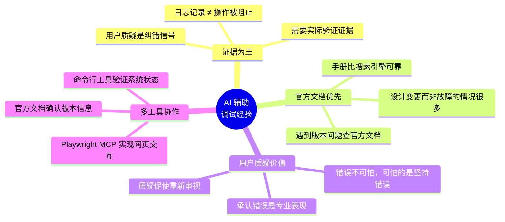

# VMware 虚拟机启动问题排查 实践探索之旅

> **主题：** VMware Workstation 虚拟机启动问题排查与端口变更发现
> **日期：** 2026-04-30
> **预计耗时：** 3.5 小时（08:38 ~ 12:10，无长时间空闲）
> **受众：** AI 学习者 / Claude Code 使用者
> **会话 ID：** `2026-04-30-vmware-startup`
> **项目路径：** `D:\project\my\ai\claudecode\first`
> **GitHub 地址：** git@github.com:chujun/aiubuntu1-sh.git
> **本文档链接：** https://github.com/chujun/aiubuntu1-sh/blob/main/doc/ai-explore/2026-04-30-VMware%E8%99%9A%E6%8C%81%E5%90%AF%E5%8A%A8%E9%97%AE%E9%A2%98%E6%8E%92%E6%9F%A5%E5%AE%9E%E8%B7%B5%E6%8E%A2%E7%B4%A2%E4%B9%8B%E6%97%85.md
> **本文档链接（编码版）：** https://github.com/chujun/aiubuntu1-sh/blob/main/doc/ai-explore/2026-04-30-VMware%E8%99%9A%E6%8C%81%E5%90%AF%E5%8A%A8%E9%97%AE%E9%A2%98%E6%8E%92%E6%9F%A5%E5%AE%9E%E8%B7%B5%E6%8E%A2%E7%B4%A2%E4%B9%8B%E6%97%85.md

---

## 目录

- [一、解决的用户痛点](#一解决的用户痛点)
- [二、主要用户价值](#二主要用户价值)
- [三、AI 角色与工作概述](#三ai-角色与工作概述)
- [四、开发环境](#四开发环境)
- [五、技术栈](#五技术栈)
- [六、AI 模型 / 插件 / Agent / 技能 / MCP 使用统计](#六ai-模型--插件--agent--技能--mcp-使用统计)
- [七、会话主要内容](#七会话主要内容)
- [八、关键决策记录](#八关键决策记录)
- [九、主要挑战与转折点](#九主要挑战与转折点)
- [十、用户提示词清单](#十用户提示词清单)
- [十一、AI 辅助实践经验](#十一ai-辅助实践经验)

---

## 一、解决的用户痛点

### 痛点上下文描述

用户在使用 VMware Workstation Pro 25.0.1 时遭遇虚拟机无法启动的问题。昨日已进行 VMware 清理操作并重置网络配置，NAT Service 已恢复，但点击 "Power On" 无响应。排查过程中遇到多个技术迷雾：端口 902 为何未监听？vmrun 为何静默失败？奇安信日志是否相关？这些问题需要系统性的排查方法论。

### 痛点清单

| # | 用户痛点 | 痛点背景（之前） | 解决后 |
|---|---------|----------------|--------|
| 1 | VMware 虚拟机无法启动，排障方向不明确 | 点击 Power On 无响应，不知从何处入手排查 | 通过端口监听检查、服务状态分析、日志追踪逐步定位问题 |
| 2 | 误判奇安信为"罪魁祸首" | 发现奇安信记录大量 VMware 注册表操作，怀疑被阻止 | 学会审慎解读日志：仅记录操作本身，无法证明阻止发生 |
| 3 | 端口 902 vs 903/913 的困惑 | 一直认为 902 应该是监听端口，实际监听在 903/913 | 发现 16.2.0+ 版本 Shared VM 功能移除是设计变更，非故障 |
| 4 | vmrun 静默失败无错误输出 | vmrun start 命令无任何输出，难以调试 | 通过日志分析和端口检查发现连接目标端口错误 |
| 5 | 缺乏 VMware 官方清理文档指引 | 不确定是否有官方 cleanup 工具，手动清理步骤不完整 | 从 Broadcom 官方文档获取完整清理方案 |

---

## 二、主要用户价值

1. **根因发现**：通过 Playwright MCP 访问 Broadcom 官方文档，发现 VMware Workstation 16.2.0+ 移除了 Shared VM 功能，导致端口 902 不再监听，这是正常设计变更而非故障
2. **方法论建立**：建立"数据流追踪 + 官方文档验证 + 日志分析"的 AI 辅助调试方法论
3. **错误纠正**：发现对奇安信日志的误判，学会区分"记录操作"与"阻止操作"的本质差异
4. **知识沉淀**：生成完整的 VMware 排查研究报告和探索实践文档，可供后续参考

---

## 三、AI 角色与工作概述

### 角色定位

| 角色 | 说明 |
|------|------|
| 调试专家 | 排查 VMware 虚拟机启动问题，分析端口监听和服务状态 |
| 文档研究员 | 访问 Broadcom 官方文档，查找 VMware 清理工具和端口变更说明 |
| 知识整理者 | 生成阶段性研究报告和探索实践文档 |

### 具体工作

- 分析 VMware 端口监听情况，发现 903/913 监听但 902 未监听
- 检查奇安信安全日志，误判后主动承认错误并修正结论
- 使用 Playwright MCP 访问 Broadcom 官网，完成用户登录和文档搜索
- 发现 VMware 16.2.0+ Shared VM 功能移除的关键信息
- 生成并持续更新 VMware 研究报告，提交到 GitHub

---

## 四、开发环境

- **操作系统：** Windows 11 Pro 10.0.26200
- **Shell：** bash (Git Bash)
- **包管理器：** npm (Node.js)
- **浏览器：** Playwright 控制
- **VMware：** VMware Workstation Pro 25.0.1
- **安全软件：** 奇安信 QAX (360 Enterprise Security)

---

## 五、技术栈



| 类别 | 技术 |
|------|------|
| 虚拟化平台 | VMware Workstation Pro 25.0.1 |
| 操作系统 | Windows 11 Pro |
| 安全软件 | 奇安信 QAX Enterprise Security |
| AI 工具 | Claude Code + Playwright MCP |
| 文档技能 | my-share-doc-record, my-explore-doc-record |

---

## 六、AI 模型 / 插件 / Agent / 技能 / MCP 使用统计

### 6.1 AI 大模型

**配置模型：**

| 模型 ID | 名称 | 用途 |
|---------|------|------|
| MiniMax-M2.7-highspeed | MiniMax 高速版 | 主对话全程使用 |

**实际调用模型：**

| 模型 ID | 模型名称 | 调用场景 |
|---------|---------|---------|
| MiniMax-M2.7-highspeed | MiniMax 高速版 | 主对话、文档生成、代码分析 |

### 6.2 开发工具

| 工具 | 用途 |
|------|------|
| Bash | 执行诊断命令（netstat、tasklist、reg query 等） |
| PowerShell | Windows 系统管理命令 |
| Git | 文档版本管理 |

### 6.3 插件（Plugin）

无第三方插件调用。

### 6.4 Agent（智能代理）

无 Agent 子代理调用。

### 6.5 技能（Skill）

| 技能名称 | 触发命令 | 触发方 | 调用次数 | 是否完整执行 |
|---------|---------|-------|---------|------------|
| my-share-doc-record | /my-share-doc-record | 用户 | 1 次 | ✅ 完整 |
| my-explore-doc-record | /my-explore-doc-record | 用户 | 1 次 | 执行中 |

### 6.6 MCP 服务

| MCP 服务 | 工具前缀 | 本次调用次数 | 说明 |
|---------|---------|------------|------|
| **playwright** | mcp__playwright__ | 15+ 次 | 访问 Broadcom 官网、搜索 VMware 文档、完成用户登录交互 |

### 6.7 Claude Code 工具调用统计

> ⚠️ 以下数据为估算值，非精确统计



### 6.8 浏览器插件（用户环境，可选）

无浏览器插件相关问题。

---

## 七、会话主要内容

### 7.1 任务全景

```mermaid
flowchart TD
    A["用户报告 VMware<br/>虚拟机无法启动"] --> B["检查 NAT Service<br/>状态"]
    B --> C["NAT Service 已恢复<br/>但 Power On 无响应"]
    C --> D["检查端口监听<br/>902 vs 903/913"]
    D --> E["发现 902 未监听<br/>903/913 在监听"]
    E --> F["检查奇安信日志<br/>1356 条注册表操作"]
    F --> G{"日志分析结论"}
    G -->|"误判" H["奇安信阻止了<br/>注册表修改"]
    H --> I["用户质疑<br/>需要证据"]
    I --> J["承认误判<br/>重新审视"]
    J --> K["访问 Broadcom<br/>官方文档"]
    K --> L["发现 16.2.0+ 版本<br/>Shared VM 功能移除"]
    L --> M["端口 902 不监听<br/>是正常设计变更"]
    M --> N["获取 VMware<br/>官方清理方案"]
    N --> O["更新研究报告<br/>提交 GitHub"]
```

### 7.2 核心问题 1：vmrun 静默失败

**排查过程：**

```mermaid
flowchart LR
    A["vmrun start 命令"] --> B["连接 VMAuthdService"]
    B --> C{"902 端口状态"}
    C -->|"未监听" D["RPC 调用失败"]
    C -->|"监听中" E["创建 vmware-vmx 进程"]
    D --> F["静默失败<br/>无错误输出"]
    E --> G["虚拟机启动"]
```

**根因分析：**

| 检查项 | 预期 | 实际 |
|--------|------|------|
| 902 端口 | 监听 | ❌ 未监听 |
| 903 端口 | - | ✅ 监听中 |
| 913 端口 | - | ✅ 监听中 |
| vmrun list | 正常 | ✅ 正常 |
| vmrun start | 创建 VMX | ❌ 静默失败 |

### 7.3 核心问题 2：奇安信日志误判

**错误推理链：**



**正确理解：**

| 日志字段 | 实际含义 |
|---------|---------|
| 事件：可疑操作 | 操作被记录 |
| 行为：注册表修改 | 操作类型 |
| 结果/状态 | ❌ 日志中无此列 |

**教训：** 日志记录操作 ≠ 操作被阻止，需要实际验证。

### 7.4 核心发现：Shared VM 功能移除



---

## 八、关键决策记录

| 决策点 | 选项 A | 选项 B | 最终选择 | 理由 |
|--------|--------|--------|---------|------|
| 奇安信日志分析 | 将日志记录等同于"阻止" | 仅承认记录了操作，无法证明阻止 | 选择 B | 用户质疑后确认，日志无结果列 |
| 端口 902 问题归因 | 认为是 VMware 配置异常/故障 | 承认这是 16.2.0+ 正常设计变更 | 选择 B | Broadcom 官方文档证实 |
| 继续排查方向 | 继续深挖奇安信 | 转向官方文档查证 | 选择 B | 官方文档提供了决定性证据 |

---

## 九、主要挑战与转折点

| 挑战 | 初始判断 | 实际根因 | 转折点 |
|------|---------|---------|--------|
| **奇安信日志误判** | 1356 条操作记录 = 操作被阻止 | 日志仅记录操作，无结果列，无法证明阻止 | 用户明确质疑后，承认缺乏直接证据 |
| **端口 902 预期错误** | 一直认为 902 应该是监听端口 | 16.2.0+ 版本 Shared VM 移除，902 不再监听是正常设计 | 访问 Broadcom 官方文档后发现 |
| **vmrun 静默失败原因** | 归咎于 VMAuthdService 配置异常 | vmrun 默认连接 902，但该端口已不监听 | 端口检查和官方文档双重验证 |
| **缺乏 VMware 官方清理工具认知** | 期望有独立 cleanup 工具 | 官方只提供 `/clean` 参数和手动清理步骤 | Broadcom 搜索结果确认 |

---

## 十、用户提示词清单（原文，一字未改）

### 【当前会话】

**提示词 1：**
```
根据对话内容生成阶段性总结报告，要求有实际依据，比如最直接的错误日志等
```

**提示词 2：**
```
这个只是记录了注册表修改信息吧，并没有阻止修改注册表吧
```

**提示词 3：**
```
需要给出关键证据证明奇安信阻止了注册表操作
```

**提示词 4：**
```
需要
```

**提示词 5：**
```
查看注册表对应配置，查看奇安信是否确实阻止了，还只是提醒
```

**提示词 6：**
```
有相关配置吗，修改该902端口，还是说最新版本调整了监听端口号
```

**提示词 7：**
```
查看官网VMware Workstation 25.0.1 ，变更说明文档
```

**提示词 8：**
```
使用Playwright mcp服务访问官网文档
```

**提示词 9：**
```
登录完成
```

**提示词 10：**
```
登录完成
```

**提示词 11：**
```
使用全英文搜索，官方文档不支持中文
```

**提示词 12：**
```
再用其他关键字搜索下，收集到其他信息
```

**提示词 13：**
```
更新阶段性研究报告文档
```

**提示词 14：**
```
需要
```

**提示词 15：**
```
my-explore-doc-record
```

---

## 十一、AI 辅助实践经验（面向 AI 学习者）



| 经验 | 核心教训 |
|------|---------|
| 日志分析要严谨 | "记录了操作"不等于"操作被阻止"，需要实际证据支撑结论 |
| 版本变更要关注 | 遇到"以前正常现在异常"时，优先考虑版本变更而非配置问题 |
| 用户质疑是纠错机会 | 当用户质疑时，应该重新审视推理链，而非防御性坚持 |
| 官方文档是最终权威 | 遇到争议问题时，访问官方文档比猜测更有效 |
| 主动承认错误 | 承认错误比坚持错误更能赢得信任，也避免浪费更多时间 |

---

*文档生成时间：2026-04-30 | 由 MiniMax-M2.7-highspeed 辅助生成*
