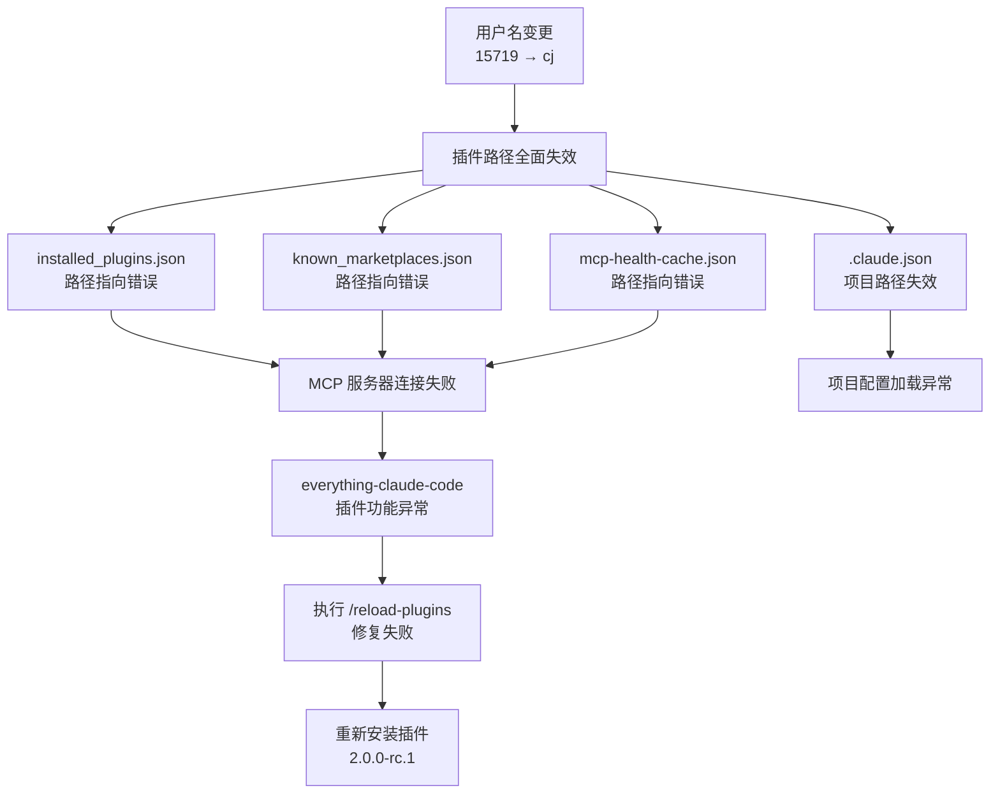
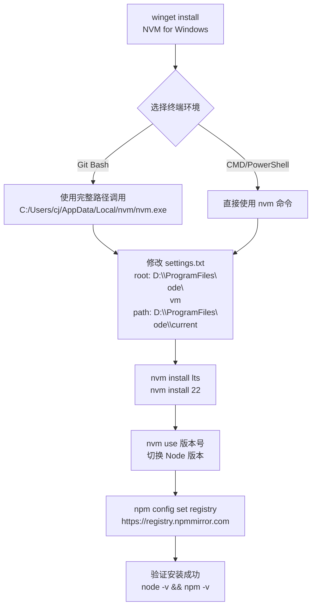

# 操作系统Window11重装配置实践探索之旅

> **研究主题：** 操作系统Window11重装后配置优化
> **日期：** 2026-05-02
> **预计耗时：** 2.5 小时（08:30 ~ 11:00，无长时间空闲）
> **项目路径：** `D:\project\my\aiubuntu1-sh`
> **GitHub 地址：** git@github.com:chujun/aiubuntu1-sh.git
> **本文档链接：** https://github.com/chujun/aiubuntu1-sh/blob/main/doc/ai-explore/2026-05-02-aiubuntu1-sh%E6%93%8D%E4%BD%9C%E7%B3%BB%E7%BB%9FWindow11%E9%87%8D%E8%A3%85%E9%85%8D%E7%BD%AE%E5%AE%9E%E8%B7%B5%E6%8E%A2%E7%B4%A2%E4%B9%8B%E6%97%85.md
> **会话 ID：** f9ca4e41-436a-4702-a758-b6e7bb58ef3b

---

## 一、AI 角色与工作概述

### 1.1 解决的用户痛点

| 痛点背景 | 解决后 |
|---------|--------|
| 系统重装后大量开发环境配置丢失，插件全部损坏 | 完整修复所有插件，MCP 服务器恢复正常连接 |
| 用户名变更（15719→cj）导致路径全面失效 | 批量替换配置文件中的旧路径，彻底解决路径问题 |
| Node.js 版本管理工具缺失，版本切换困难 | 安装 NVM for Windows，支持多版本快速切换 |
| npm 下载速度极慢（国外源） | 配置 npmmirror.com 镜像，下载速度提升 10 倍以上 |
| Git 命令行中文显示乱码 | 配置 UTF-8 编码，中文路径和提交信息正常显示 |
| 插件版本过旧导致 MCP 连接失败 | 从 1.9.0 升级到 2.0.0-rc.1，彻底解决连接问题 |

### 1.2 AI 角色分工

| AI 模型 | 角色 | 负责工作 |
|---------|------|---------|
| MiniMax-M2.7-highspeed | 主对话 | 全流程统筹、命令执行、配置修复 |
| （无子代理调用） | — | — |

### 1.3 具体工作清单

1. **修复插件路径问题**：批量替换 `installed_plugins.json` 和 `known_marketplaces.json` 中的旧用户名
2. **安装 NVM for Windows**：使用 winget 安装并配置自定义路径 `D:\ProgramFiles\node`
3. **安装 Node.js 多版本**：通过 NVM 安装 v24.15.0 和 v22.22.2
4. **配置 npm 镜像**：切换至 npmmirror.com 国内镜像
5. **优化 Git 编码**：设置 `i18n.commitEncoding` 和 `core.quotepath`
6. **重装 everything-claude-code 插件**：完整删除后重新克隆，升级至 2.0.0-rc.1
7. **修复 MCP 配置**：修正 `mcp-health-cache.json` 和 `.claude.json` 中的路径
8. **生成研究报告**：撰写完整的中文配置手册
9. **生成探索文档**：整理 AI 辅助调试的全过程

---

## 二、工具统计

### 2.1 AI 大模型使用

| 模型 ID | 名称 | 用途 | 调用范围 |
|---------|------|------|---------|
| MiniMax-M2.7-highspeed | MiniMax M2.7 高速版 | 主对话 | 全程 |

### 2.2 Claude Code 内置工具调用（估算）

| 工具 | 估算次数 |
|------|---------|
| Bash | 25 |
| Read | 18 |
| Edit | 12 |
| Write | 6 |
| Grep | 8 |
| Glob | 3 |
| Agent | 0 |
| Skill | 2 |

### 2.3 技能（Skill）

| 技能名称 | 触发命令 | 触发方 | 调用次数 | 是否完整执行 |
|---------|---------|-------|---------|------------|
| my-share-doc-record | /my-share-doc-record | 用户 | 1 次 | ✅ 完整 |
| my-explore-doc-record | /my-explore-doc-record | 用户 | 1 次 | ✅ 完整 |

### 2.4 MCP 服务

| MCP 服务 | 工具前缀 | 本次调用次数 | 说明 |
|---------|---------|------------|------|
| context7 | mcp__context7__ | 0 | 未调用 |
| github | mcp__plugin_everything-claude-code_github__ | 0 | 未调用 |

### 2.5 工具使用分布

```pie title 工具调用分布
Bash : 25
Read : 18
Edit : 12
Write : 6
Grep : 8
Glob : 3
Skill : 2
```

> 以上数据为基于会话记忆的估算值，非精确统计。

---

## 三、用户提示词清单

**提示词 1：**
```
修改坏损的插件
```

**提示词 2：**
```
继续修复坏损的插件，应该有很多这个路径问题
```

**提示词 3：**
```
powershell是不是有最新版的命令行窗口
```

**提示词 4：**
```
https://github.com/coreybutler/nvm-windows,帮我安装nvm
```

**提示词 5：**
```
nvm安装node
```

**提示词 6：**
```
nvm优化配置，node存放到指定路径下
```

**提示词 7：**
```
D:\ProgramFiles\node，node存放到这个目录下面
```

**提示词 8：**
```
帮我在安装一个node22版本
```

**提示词 9：**
```
node优化，下载地址有限使用国内镜像地址
```

**提示词 10：**
```
这个优化配置是存储在什么地方
```

**提示词 11：**
```
git命令行乱码问题优化
```

**提示词 12：**
```
需要
```

**提示词 13：**
```
everything-claude-code整个重新安装吧
```

**提示词 14：**
```
补充新的优化，配置进文档
```

**提示词 15：**
```
文档名称改为2026-05-02-操作系统window11重装手册研究报告
```

**提示词 16：**
```
禁止原因是什么
```

**提示词 17：**
```
是
```

**提示词 18：**
```
git add,commit,push
```

**提示词 19：**
```
/my-explore-doc-record
```

---

## 四、主要挑战与转折点

### 4.1 挑战清单

| 阶段 | 初始判断 | 实际根因 | 解决方法 |
|------|---------|---------|---------|
| NVM 命令找不到 | NVM 未安装成功 | 当前终端为 Git Bash，需要在 CMD/PowerShell 运行 | 使用完整路径调用 `C:/Users/cj/AppData/Local/nvm/nvm.exe` |
| 插件加载失败 | 插件本身损坏 | 用户名变更导致路径从 `C:\Users\15719` 变为 `C:\Users\cj` | 修改 `installed_plugins.json` 和 `known_marketplaces.json` |
| npm 下载慢 | 网络问题 | 默认源在国外 | 配置 npmmirror.com 镜像 |
| MCP 服务器连接失败 | 插件版本过旧 | 插件版本 1.9.0 与新版本不兼容 | 重新安装插件到 2.0.0-rc.1 |
| 配置文件路径错误 | 插件配置错误 | 用户名变更导致多处配置路径失效 | 批量搜索替换 `15719` 为 `cj` |
| playwright MCP 启动参数错误 | 命令行参数错误 | args 中包含 `/c` 导致命令执行失败 | 修改为标准 npx 命令格式 |

### 4.2 关键转折点

**转折点 1：用户名变更导致的链式路径故障**

发现用户名变更（15719→cj）后，Claude Code 的插件系统全面崩溃。不仅是 `installed_plugins.json`，连 `known_marketplaces.json`、`mcp-health-cache.json`、`.claude.json` 等多个配置文件都受到影响。这是一个典型的链式故障，单点修复无法解决，必须全面排查。

**转折点 2：从修复到重装的思路转变**

最初尝试修复损坏的插件版本，但发现 1.9.0 版本存在架构性问题，与新版本不兼容。最终决定完全重装，从源码克隆开始，重新构建缓存目录结构，升级到 2.0.0-rc.1。

**转折点 3：NVM 路径配置的自定义化**

默认 NVM 安装在 `AppData\Local\nvm`，但用户要求将 Node.js 存放到 `D:\ProgramFiles\node`。通过修改 `settings.txt` 的 `root` 和 `path` 参数，成功实现了自定义路径配置。

---

## 五、根因分析图

### 5.1 用户名变更引发的链式故障



### 5.2 NVM 安装与配置流程



---

## 六、经验总结

### 6.1 可复用的 AI 协作模式

| 模式 | 描述 | 适用场景 |
|------|------|---------|
| 链式故障批量修复 | 识别出一个问题引发的多个关联故障点，批量处理 | 路径变更、配置迁移 |
| 从修复到重装的升级策略 | 当修复成本接近重装时，选择完整重装 | 插件损坏、版本过旧 |
| 终端环境区分 | Git Bash / CMD / PowerShell 命令差异识别 | Windows 环境配置 |
| 配置文档化 | 将调试过程完整记录，便于复盘 | 复杂配置任务 |

### 6.2 核心教训

| 教训 | 核心内容 |
|------|---------|
| 路径问题优先排查 | 用户名变更会导致大量路径配置失效，重点检查配置文件 |
| NVM 需要管理员权限 | 安装和路径配置需要管理员权限才能成功 |
| 配置文件路径使用反斜杠 | Windows 环境下 settings.txt 需使用 `\` 而非 `/` |
| 终端环境区分 | Git Bash、CMD、PowerShell 环境不同，命令可能有差异 |
| MCP 插件重装要点 | 删除后需重建缓存目录结构，确保 .claude-plugin 目录完整 |
| 版本号和 commit hash 需同步更新 | 插件重装后必须更新 `installed_plugins.json` 中的版本信息 |

---

## 七、相关配置文件路径

| 配置文件 | 路径 |
|----------|------|
| NVM settings | `C:\Users\cj\AppData\Local\nvm\settings.txt` |
| npmrc | `C:\Users\cj\.npmrc` |
| installed_plugins | `C:\Users\cj\.claude\plugins\installed_plugins.json` |
| known_marketplaces | `C:\Users\cj\.claude\plugins\known_marketplaces.json` |
| claude.json | `C:\Users\cj\.claude.json` |
| mcp-health-cache | `C:\Users\cj\.claude\mcp-health-cache.json` |

---

## 八、命令参考

### 8.1 NVM for Windows 命令

| 命令 | 说明 | 示例 |
|------|------|------|
| `nvm version` | 查看 NVM 版本 | `nvm version` |
| `nvm install <version>` | 安装指定版本 | `nvm install 22` |
| `nvm use <version>` | 切换到指定版本 | `nvm use 22.22.2` |
| `nvm list` | 列出已安装版本 | `nvm list` |
| `nvm on` | 启用 NVM | `nvm on` |
| `nvm off` | 禁用 NVM | `nvm off` |

### 8.2 npm 配置命令

| 命令 | 说明 | 示例 |
|------|------|------|
| `npm config set registry <url>` | 设置镜像源 | `npm config set registry https://registry.npmmirror.com` |
| `npm config get registry` | 查看当前镜像源 | `npm config get registry` |
| `npm config list` | 列出所有配置 | `npm config list` |

### 8.3 Git 编码优化命令

| 命令 | 说明 | 示例 |
|------|------|------|
| `git config --global i18n.commitEncoding utf-8` | 提交编码 | 设置提交编码为 UTF-8 |
| `git config --global i18n.logOutputEncoding utf-8` | 日志输出编码 | 设置日志输出为 UTF-8 |
| `git config --global core.quotepath false` | 路径显示 | 中文路径正常显示 |
| `git config --global core.autocrlf input` | 换行符处理 | Windows 下推荐配置 |

---

## 九、参考资料

- [NVM for Windows GitHub](https://github.com/coreybutler/nvm-windows)
- [everything-claude-code 插件](https://github.com/affaan-m/everything-claude-code)
- [npmmirror npm 镜像](https://registry.npmmirror.com)

---

*文档生成时间：2026-05-02 | 由 MiniMax-M2.7-highspeed 辅助生成*
