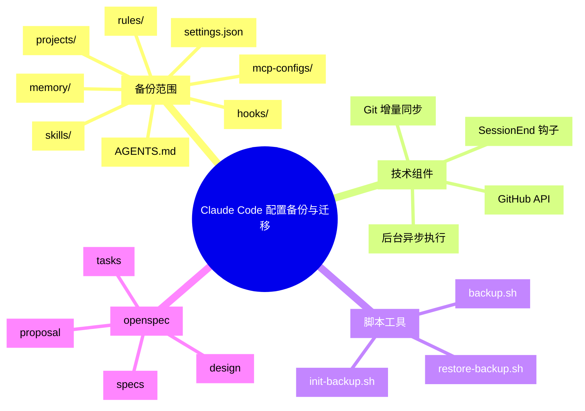
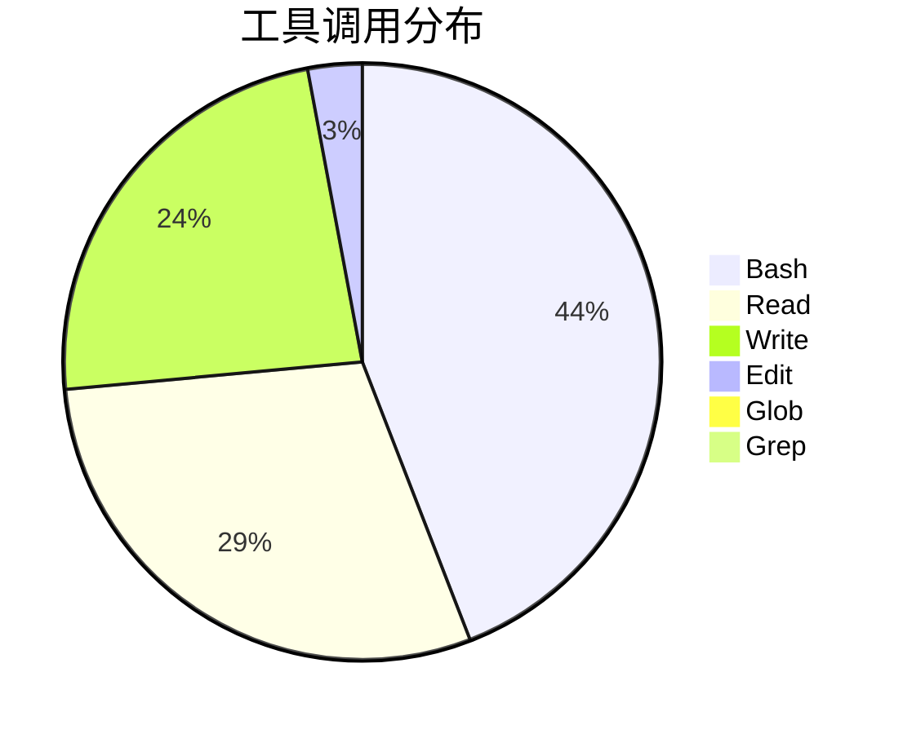
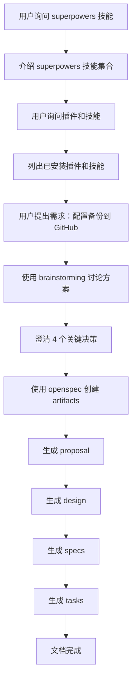
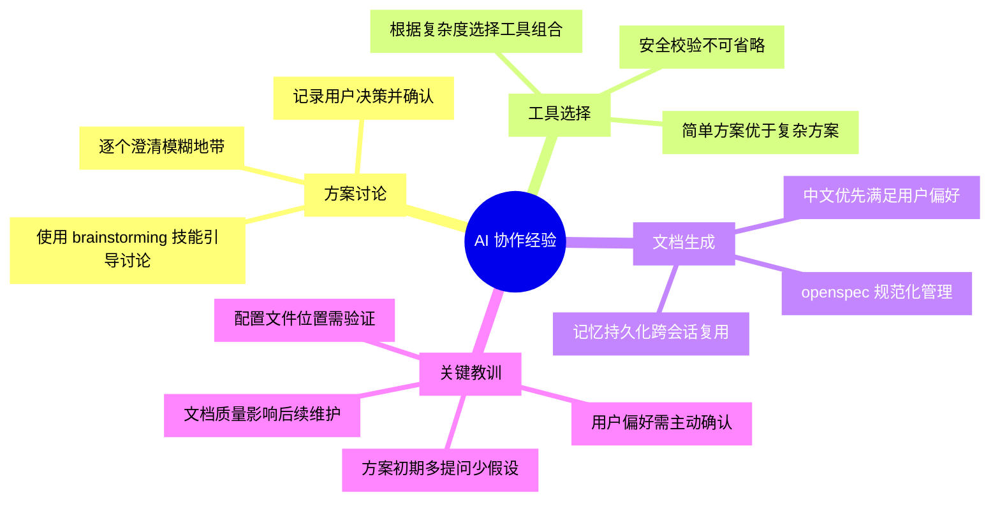

# Claude Code 配置备份与迁移实践探索之旅

> **主题：** 使用 brainstorming + openspec 实现配置私有化存储与跨系统迁移
> **日期：** 2026-05-11
> **预计耗时：** 0.6 小时（07:00 ~ 07:36，无长时间空闲）
> **受众：** AI 学习者 / Claude Code 使用者
> **会话 ID：** `-root-sh-0600`
> **项目路径：** `/root/sh`
> **GitHub 地址：** git@github.com:chujun/aiubuntu1-sh.git
> **本文档链接：** https://github.com/chujun/aiubuntu1-sh/blob/main/doc/ai-explore/2026-05-11-ClaudeCode配置备份与迁移实践探索之旅.md
> **本文档链接（编码版）：** https://github.com/chujun/aiubuntu1-sh/blob/main/doc/ai-explore/2026-05-11-ClaudeCode%E9%85%8D%E7%BD%AE%E5%A4%87%E4%BB%BD%E4%B8%8E%E8%BF%81%E7%A7%BB%E5%AE%9E%E8%B7%B5%E6%8E%A2%E7%B4%A2%E4%B9%8B%E6%97%85.md

---

## 目录

- [一、解决的用户痛点](#一解决的用户痛点)
- [二、主要用户价值](#二主要用户价值)
- [三、AI 角色与工作概述](#三ai-角色与工作概述)
- [四、开发环境](#四开发环境)
- [五、技术栈](#五技术栈)
- [六、AI 模型 / 插件 / Agent / 技能 / MCP 使用统计](#六ai-模型--插件--agent--技能--mcp-使用统计)
- [七、会话主要内容](#七会话主要内容)
- [八、关键决策记录](#八关键决策记录)
- [九、主要挑战与转折点](#九主要挑战与转折点)
- [十、用户提示词清单](#十用户提示词清单)
- [十一、AI 辅助实践经验](#十一ai-辅助实践经验)

---

## 一、解决的用户痛点

### 痛点上下文描述

Claude Code 的配置数据（settings.json、skills、rules、项目记忆、会话历史等）存储在本地 `~/.claude/` 目录，缺乏持久化和跨设备同步机制。用户希望将这些配置备份到 GitHub 私有仓库，实现永久存储和跨系统迁移。

### 痛点清单

| # | 用户痛点 | 痛点背景（之前） | 解决后 |
|---|---------|----------------|--------|
| 1 | 配置散落难以统一管理 | Claude Code 配置分布在多个目录（settings.json、rules/、skills/、projects/），缺乏统一备份机制 | 通过 brainstorming 确定备份范围和同步策略 |
| 2 | 跨系统迁移需手动重建 | 切换到新系统时，所有配置和会话历史需要手动复制，容易遗漏 | 设计一键初始化和恢复脚本 |
| 3 | 敏感信息泄露风险 | 直接同步到公开仓库会暴露 API token | 通过仓库可见性校验拒绝同步到公开仓库 |
| 4 | 同步流程模糊不清 | 方案讨论初期，同步机制（rsync vs git）、触发时机（钩子类型）等存在多个模糊地带 | 通过 brainstorming 逐一澄清并形成决策 |

---

## 二、主要用户价值

1. **永久存储保障**：将配置同步到 GitHub 私有仓库，避免本地磁盘损坏导致配置丢失
2. **跨系统快速迁移**：在新系统上运行恢复脚本，一键还原完整配置环境
3. **自动化同步**：通过 SessionEnd 钩子实现退出时自动备份，无需手动操作
4. **安全校验机制**：同步前校验仓库可见性，防止敏感信息泄露到公开仓库
5. **增量同步效率**：使用 git 管理变更，只同步有变化的文件

---

## 三、AI 角色与工作概述

### 角色定位

| 角色 | 说明 |
|------|------|
| 方案架构师 | 通过 brainstorming 与用户讨论并确定备份方案的技术决策 |
| 文档整理者 | 整理 brainstorming 结果，生成规范的 proposal、design、specs、tasks 文档 |
| 工具探索者 | 探索 Claude Code 钩子系统，介绍不同触发方式的原理供用户决策 |

### 具体工作

- 通过 brainstorming 技能引导用户逐一澄清方案中的模糊地带
- 探索 Claude Code 钩子类型（PreToolUse、PostToolUse、Stop、SessionEnd），解释各触发方式的原理
- 将讨论结果整理为 openspec artifacts（proposal、design、specs、tasks）
- 识别出 4 个关键决策点并逐一与用户确认

---

## 四、开发环境

| 项目 | 值 |
|------|-----|
| OS | Linux 6.8.0-107-generic |
| Shell | bash |
| Git | 已安装 |
| GitHub CLI | 已安装（gh） |
| Claude Code | 最新版本 |
| 工作目录 | `/root/sh` |

---

## 五、技术栈



| 类别 | 组件 | 说明 |
|------|------|------|
| 配置源 | `~/.claude/` | Claude Code 配置主目录 |
| 备份目标 | GitHub 私有仓库 | 通过 gh CLI 管理 |
| 同步工具 | Git | 增量同步、冲突检测 |
| 触发机制 | SessionEnd 钩子 | 会话结束时自动触发 |
| 文档工具 | openspec | 规范化方案文档 |

---

## 六、AI 模型 / 插件 / Agent / 技能 / MCP 使用统计

### 6.1 AI 大模型

**配置模型：**

| 模型 ID | 名称 | 用途 | 调用范围 |
|---------|------|------|---------|
| MiniMax-M2.7-highspeed | MiniMax M2.7 高速版 | 主对话 | 全程 |

**实际调用模型：**

| 模型 ID | 模型名称 | 调用场景 | 说明 |
|---------|---------|---------|------|
| MiniMax-M2.7-highspeed | MiniMax M2.7 高速版 | 主对话 | 用户选择的主模型 |

### 6.2 开发工具

| 工具 | 用途 |
|------|------|
| Bash | 执行 git 命令、检查文件、运行脚本 |
| Read | 读取配置文件、钩子文档、模板文件 |
| Write | 生成 proposal、design、specs、tasks 文档 |
| Edit | 更新记忆文件 |

### 6.3 插件（Plugin）

| 插件 | 状态 |
|------|------|
| context7 | 已安装 |
| frontend-design | 已安装 |
| skill-creator | 已安装 |
| superpowers | 已安装 |
| everything-claude-code | 已安装 |
| claude-hud | 未使用 |

### 6.4 Agent（智能代理）

本次会话未调用 Agent。

### 6.5 技能（Skill）

| 技能名称 | 触发命令 | 触发方 | 调用次数 | 是否完整执行 |
|---------|---------|-------|---------|------------|
| brainstorming | /superpowers:brainstorming | 用户 | 1 次 | ✅ 完整 |
| my-explore-doc-record | /my-explore-doc-record | 用户 | 1 次 | ✅ 完整 |

### 6.6 MCP 服务

| MCP 服务 | 工具前缀 | 本次调用次数 | 说明 |
|---------|---------|------------|------|
| 无 | - | 0 | 本次会话未使用 MCP 服务 |

### 6.7 Claude Code 工具调用统计

> 以下数据为基于会话记忆的估算值，非精确统计。



### 6.8 浏览器插件（用户环境，可选）

无

---

## 七、会话主要内容

### 7.1 任务全景



### 7.2 核心决策讨论

#### 决策 1：备份仓库与源目录关系

| 方案 | 描述 | 选择 |
|------|------|------|
| 方案 A | 独立备份目录 `~/.claude-config-backup/` | - |
| 方案 B | 直接在 `~/.claude/` 初始化 git | ✅ 选用 |

**讨论过程**：用户最初使用方案 B，直接在源目录初始化 git，简化了架构。

#### 决策 2：同步流程

| 方案 | 描述 | 选择 |
|------|------|------|
| rsync + git | 先 rsync 复制再用 git 管理 | - |
| 直接使用 git | 直接用 git add/commit/push | ✅ 选用 |

#### 决策 3：退出钩子触发方式

| 钩子类型 | 触发频率 | 选择 |
|---------|---------|------|
| PreToolUse / PostToolUse | 每次工具执行 | - |
| Stop | 每次响应后（过于频繁） | - |
| SessionEnd | 会话结束时 | ✅ 选用 |
| PreCompact | 上下文压缩前 | - |

**讨论过程**：用户选择 SessionEnd 作为触发方式，因为它是专门为会话结束设计的钩子，触发频率适中。

#### 决策 4：冲突处理策略

| 方案 | 描述 | 选择 |
|------|------|------|
| 方案 A | 先 pull 再 push，无法解决时提示用户 | ✅ 选用 |
| 方案 B | 强制覆盖 | - |
| 方案 C | 冲突时放弃 | - |
| 方案 D | 手动解决 | - |

**讨论过程**：用户选择了方案 A + 无法解决时提示用户手动解决。

---

## 八、关键决策记录

| 决策点 | 选项 A | 选项 B | 最终选择 | 理由 |
|--------|--------|--------|---------|------|
| 备份仓库位置 | 独立目录 `~/.claude-config-backup/` | 直接在 `~/.claude/` 初始化 git | **方案 B** | 简化架构，无需 rsync |
| 同步工具 | rsync + git | 直接使用 git | **直接使用 git** | 简化流程 |
| 触发时机 | PreToolUse/PostToolUse/Stop | SessionEnd | **SessionEnd** | 专为会话结束设计，频率适中 |
| 冲突处理 | 强制覆盖/放弃/手动 | 先 pull 再 push + 提示用户 | **方案 A** | 自动合并大多数冲突，无法解决时提示用户 |

---

## 九、主要挑战与转折点

| 挑战 | 初始判断 | 实际根因 | 转折点 |
|------|---------|---------|--------|
| 方案初期模糊 | 用户描述需求时，同步机制、触发方式、冲突处理等存在多个模糊地带 | 缺乏对 Claude Code 钩子系统、git 管理方式的整体了解 | 通过 brainstorming 逐一澄清每个决策点 |
| 工具选择 | 最初考虑了 rsync 作为同步工具 | git 可以直接管理目录内的变更 | 确定直接使用 git，简化架构 |
| 文档语言 | 初次生成的 spec.md 使用了英文 | 未确认用户语言偏好 | 用户明确要求使用简体中文，并更新记忆 |

---

## 十、用户提示词清单（原文，一字未改）

### 【当前会话】

**提示词 1：**
```
superpowers
```

**提示词 2：**
```
介绍superpower
```

**提示词 3：**
```
使用简体中文，并持久化到记忆中
```

**提示词 4：**
```
我想就方案进行详细讨论，应该使用哪个技能
```

**提示词 5：**
```
除了superpower中的技能之外，还有其他插件或者官网插件推荐的技能吗
```

**提示词 6：**
```
我想存储claude code中的所有配置到github上左永久存储和迁移到其他系统
```

**提示词 7：**
```
projects配置中的内容是什么
```

**提示词 8：**
```
2.需要
```

**提示词 9：**
```
方案B听起来不错，展开聊聊一聊怎么实现的
```

**提示词 10：**
```
加入因为网络问题导致同步失败，会影响claude code正常退出吗
```

**提示词 11：**
```
B
```

**提示词 12：**
```
调整方案，考虑到是私有化仓库，直接使用明文存储吧
```

**提示词 13：**
```
补充同步私有仓库，对github仓库访问权限进行校验，如果是公开仓库则拒绝同步
```

**提示词 14：**
```
上面提到的还有那些待确认事项
```

**提示词 15：**
```
1.在首次初始化仓库的时候确认， 2.每次退出claude code 4.需要一件初始化脚本 3.两种有什么区别
```

**提示词 16：**
```
使用git管理进行增量同步
```

**提示词 17：**
```
根据前面的聊天记录，整理claude code数据私有化存储和系统迁移
```

**提示词 18：**
```
名字包括迁移，然后继续
```

**提示词 19：**
```
根据前面的所有聊天记录，整理需求
```

**提示词 20：**
```
先别急，聊一下整个系统方案中文件同步的工作机制，目前感觉还是存在模糊地带
```

**提示词 21：**
```
我们一个一个讨论，1. 备份仓库与源目录的关系，这两种方案优缺点进行对比
```

**提示词 22：**
```
先采用方案B吧，第二个问题同步流程，直接使用git ，第三个问题：退出钩子的触发方式，介绍下几种触发方式原理，好让我进行决策
```

**提示词 23：**
```
使用 SessionEnd 作为触发方式
```

**提示词 24：**
```
方案A，补充冲突解决方案，如果发生冲突无法自动解决，提示用户手动解决冲突
```

**提示词 25：**
```
目前没有了，继续
```

**提示词 26：**
```
spec.md文件内容调整为简体中文，怎么用英文了，持久化到永久记忆文件中去
```

---

## 📌 增量更新（2026-05-11 10:00）

### 本次新增内容概要

- 补充 .gitignore 配置，说明忽略文件的作用
- 修正 hooks 配置位置（settings.json 而非 hooks/hooks.json）
- 修复同步到错误仓库的问题
- 验证同步功能正常工作

### 新增提示词

**提示词 27：**
```
.gitignore更新 sessions/ shell-snapshots/ backups/, file-history/
```

**提示词 28：**
```
回退这次修改
```

**提示词 29：**
```
Update(.gitignore) 添加 6 行
```

**提示词 30：**
```
你搞错误了.gitignore应该放到~/.claude目录下面
```

**提示词 31：**
```
/root/sh/.gitignore文件回退到12375d457264cc772adaeaeddb4cd1f28d53c750版本
```

**提示词 32：**
```
/root/.claude/.gitignore提交
```

**提示词 33：**
```
发现一个命令行窗口clude code退出后，并没有自动同步到github仓库，分析原因
```

**提示词 34：**
```
git@github.com:chujun/my-security-claude-code.git，重新初始化，同步到这个私有仓库上去
```

**提示词 35：**
```
我退出试试
```

**提示词 36：**
```
我退出了，检查下
```

**提示词 37：**
```
@/root/.claude/.gitignore文件内容更新到设计文档中，并对忽略文件路径做说明
```

**提示词 38：**
```
对hook钩子跟新设计文档
```

**提示词 39：**
```
不对，hooks配置在~/.claude/settings.json文件下才起作用，配置在hooks/hooks.json不起作用
```

**提示词 40：**
```
git add,commit,push
```

### 关键问题与解决

| 问题 | 症状 | 根因 | 解决方法 |
|------|------|------|---------|
| 同步未生效 | 退出后 GitHub 无更新 | 同步到了错误的仓库（my-security-test-error-public） | 更新 remote URL 到正确的私有仓库 |
| hooks 配置位置错误 | 配置不生效 | 误以为在 hooks/hooks.json | 实际配置在 settings.json 的 hooks 字段 |

### 实际验证结果

```
[Mon May 11 09:42:39] Remote: git@github.com:chujun/my-security-claude-code.git
[Mon May 11 09:42:43] Remote access: OK
[Mon May 11 09:42:43] Changed files:
   M history.jsonl
   M projects/-root-sh/3cc59ec2-....jsonl
   M projects/-root-sh/dd6c7312-....jsonl
[Mon May 11 09:42:43] Committed: 8366934
[Mon May 11 09:42:46] Pull: OK (rebased)
[Mon May 11 09:42:51] BACKUP SUCCESS ✅
```

---

## 十一、AI 辅助实践经验（面向 AI 学习者）



| 经验 | 核心教训 |
|------|---------|
| brainstorming 引导讨论 | 通过一个一个问题引导用户澄清需求，比直接给出方案更有效 |
| 方案对比帮助决策 | 提供清晰的方案对比表，帮助用户在理解利弊后做出选择 |
| 语言偏好主动确认 | 初次生成文档时未确认语言，应在早期就确认用户偏好 |
| 记忆持久化价值 | 将用户偏好（简体中文）写入记忆，避免重复确认 |
| 配置文件位置需验证 | Claude Code 实际读取 settings.json 而非 hooks/hooks.json，配置前先验证 |

---

*文档生成时间：2026-05-11 | 由 MiniMax-M2.7-highspeed 辅助生成*
*最后更新时间：2026-05-11 10:00（增量更新）*
