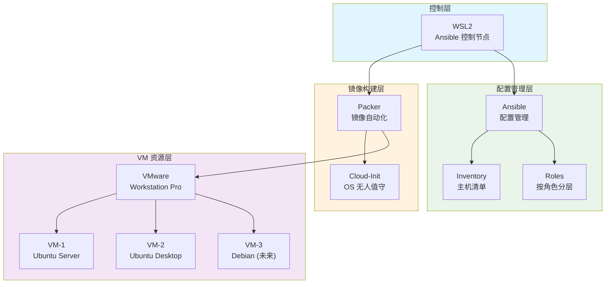
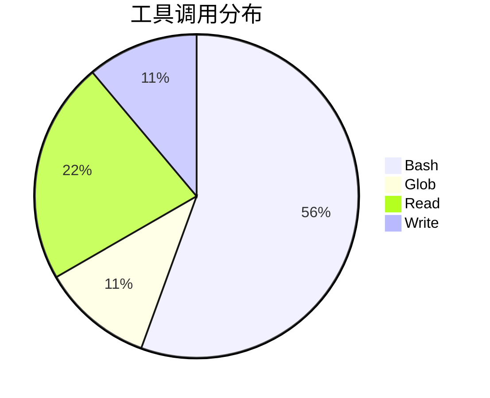
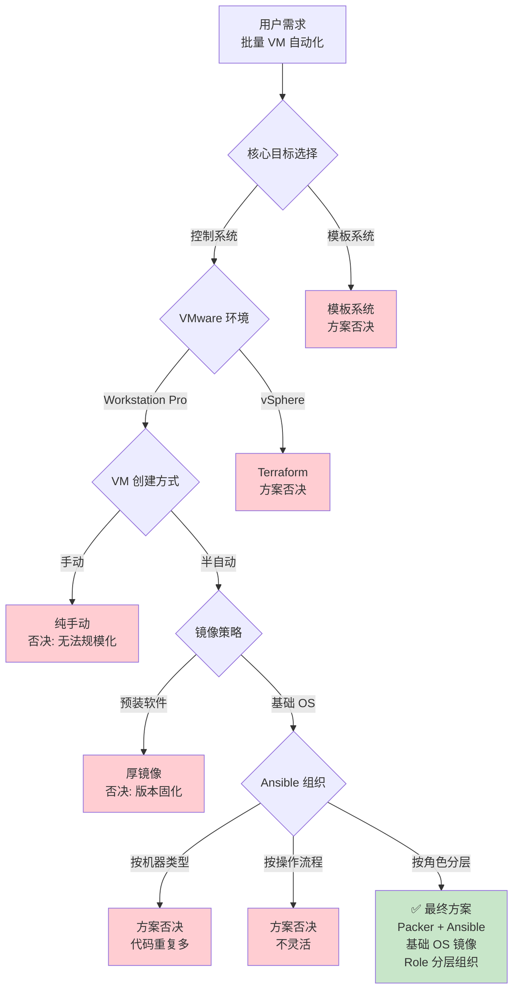
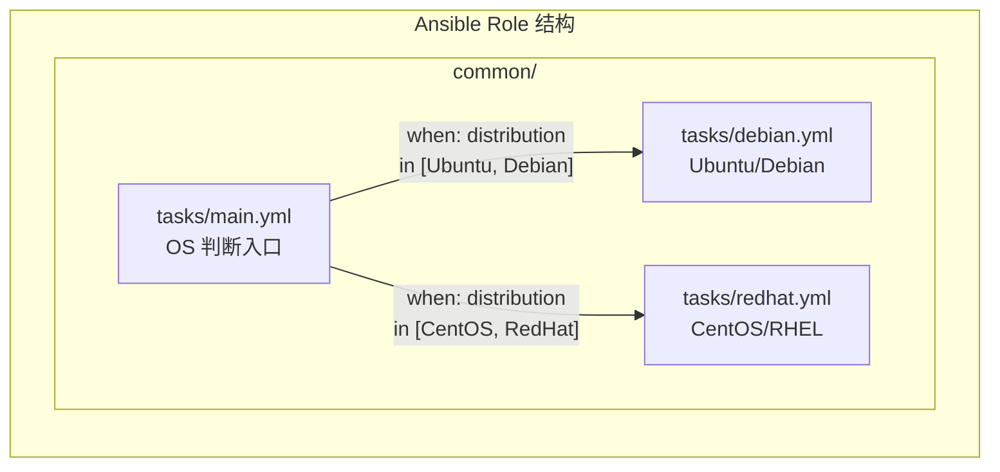
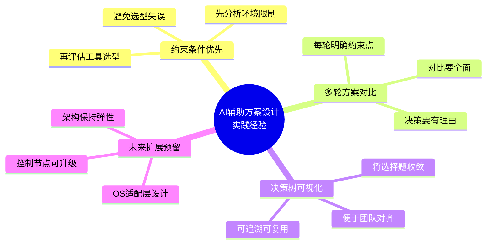

# VMware 自动化批量服务器搭建方案设计 实践探索之旅

> **主题：** VMware 虚拟机自动化批量搭建和管理系统设计方案
> **日期：** 2026-05-12
> **预计耗时：** 0.3 小时（06:09 ~ 06:27，无长时间空闲）
> **受众：** AI 学习者 / Claude Code 使用者
> **会话 ID：** 2026-05-12-main
> **项目路径：** `/root/sh`
> **GitHub 地址：** git@github.com:chujun/aiubuntu1-sh.git
> **本文档链接：** https://github.com/chujun/aiubuntu1-sh/blob/main/doc/ai-explore/2026-05-12-VMware%E8%87%AA%E5%8A%A8%E5%8C%96%E6%89%B9%E9%87%8F%E6%9C%8D%E5%8A%A1%E5%99%A8%E6%90%AD%E5%BB%BA%E6%96%B9%E6%A1%88%E8%AE%BE%E8%AE%A1%E5%AE%9E%E8%B7%B5%E6%8E%A2%E7%B4%A2%E4%B9%8B%E6%97%85.md
> **本文档链接（编码版）：** https://github.com/chujun/aiubuntu1-sh/blob/main/doc/ai-explore/2026-05-12-VMware%E8%87%AA%E5%8A%A8%E5%8C%96%E6%89%B9%E9%87%8F%E6%9C%8D%E5%8A%A1%E5%99%A8%E6%90%AD%E5%BB%BA%E6%96%B9%E6%A1%88%E8%AE%BE%E8%AE%A1%E5%AE%9E%E8%B7%B5%E6%8E%A2%E7%B4%A2%E4%B9%8B%E6%97%85.md

---

## 目录

- [一、解决的用户痛点](#一解决的用户痛点)
- [二、主要用户价值](#二主要用户价值)
- [三、AI 角色与工作概述](#三ai-角色与工作概述)
- [四、开发环境](#四开发环境)
- [五、技术栈](#五技术栈)
- [六、AI 模型 / 插件 / Agent / 技能 / MCP 使用统计](#六ai-模型--插件--agent--技能--mcp-使用统计)
- [七、会话主要内容](#七会话主要内容)
- [八、关键决策记录](#八关键决策记录)
- [九、主要挑战与转折点](#九主要挑战与转折点)
- [十、用户提示词清单](#十用户提示词清单)
- [十一、AI 辅助实践经验](#十一ai-辅助实践经验)

---

## 一、解决的用户痛点

### 痛点上下文描述

用户计划使用 VMware Workstation Pro 在 Windows 11 上搭建一批虚拟机服务器，涉及 Ubuntu 24 Server/Desktop，未来计划扩展到其他 Linux 发行版。当前处于方案设计阶段，需要一套自动化配置、软件安装、性能优化的系统。目标从学习用途起步，未来成熟后商业化。

### 痛点清单

| # | 用户痛点 | 痛点背景（之前） | 解决后 |
|---|---------|----------------|--------|
| 1 | 手动创建 VM 耗时耗力 | 每次在 VMware UI 创建 VM 需要 15-30 分钟人工等待，规模化后成为瓶颈 | Packer 自动化镜像构建，5-10 分钟无人值守完成 |
| 2 | 软件版本难以统一管理 | 手动安装软件版本不一致，升级麻烦，难以审计 | Ansible 集中配置管理，所有机器软件版本一致且可追溯 |
| 3 | 多操作系统支持复杂 | 从 Ubuntu 扩展到 Debian/CentOS 时配置无法复用 | Ansible Role 按 OS 分层设计，扩展新 OS 只需新增 task 文件 |
| 4 | 配置变更难以审计 | 手动修改配置无记录，无法追踪"谁在什么时候改了什么" | 配置以代码形式存在于 Git，每次变更有 commit 记录 |
| 5 | 模板 vs 控制系统难以抉择 | 不确定该用模板克隆还是 Ansible 集中管理，方案选型困难 | AI 辅助分析约束条件，决策树推导最优方案 |

---

## 二、主要用户价值

1. **约束条件驱动的工具选型**：通过分析 VMware Workstation Pro vs vSphere 的 API 差异，确定 Packer 而非 Terraform 作为镜像构建工具，避免选型失误

2. **多轮方案对比培养决策框架**：5 轮方案选型（模板 vs 控制、VM 创建方式、镜像策略、Ansible 组织、多 OS 支持），每轮都有明确的约束点和对比维度

3. **决策树可复用于未来场景**：生成的完整决策树可复用于其他基础设施选型项目

4. **兼顾当前需求和未来扩展**：方案既满足少量机器起步，又为商业化扩展预留 Ansible Tower/AWX 升级路径

---

## 三、AI 角色与工作概述

### 角色定位

| 角色 | 说明 |
|------|------|
| 方案设计者 | 分析用户需求，梳理约束条件，设计系统架构 |
| 技术选型顾问 | 对比多种工具组合，分析优劣，帮助用户做决策 |
| 决策树构建师 | 将多轮方案对比抽象为可追溯的决策树结构 |

### 具体工作

- 梳理用户需求：VMware 环境、VM 类型、软件栈、商业化目标
- 分析约束条件：Workstation Pro API 限制、少量起步逐步扩展
- 执行 5 轮方案选型：模板 vs 控制 → VM 创建方式 → 镜像策略 → Ansible 组织 → 多 OS 支持
- 构建决策树：将发散的选择题收敛为最优路径
- 生成设计方案文档：包含架构图、目录结构、工作流程

---

## 四、开发环境

| 组件 | 版本/说明 |
|------|---------|
| Host OS | Windows 11 |
| 虚拟化平台 | VMware Workstation Pro 25H2 |
| Guest OS (目标) | Ubuntu 24 Server / Desktop |
| 控制节点 | WSL2 (Ansible 运行环境) |
| 镜像构建工具 | Packer |
| 配置管理工具 | Ansible |
| OS 初始化 | Cloud-Init |

---

## 五、技术栈



### 技术栈明细

| 层级 | 工具 | 用途 | 备选方案 |
|------|------|------|---------|
| 镜像构建 | Packer | 自动化 VM 镜像构建 | 手动、Golden Image |
| OS 初始化 | Cloud-Init | 无人值守 OS 配置 | 手动应答文件 |
| 配置管理 | Ansible | 主机配置、软件安装 | Chef、Puppet、SaltStack |
| 基础设施编排 | Terraform (未来) | vSphere 环境 VM 创建 | 暂不需要 |
| 控制节点 | WSL2 | Ansible 运行平台 | 独立 Linux VM |

---

## 六、AI 模型 / 插件 / Agent / 技能 / MCP 使用统计

### 6.1 AI 大模型

**配置模型（system-reminder 声明）：**

| 模型 ID | 名称 | 用途 |
|---------|------|------|
| MiniMax-M2.7-highspeed | MiniMax 高速模型 | 主对话 |

**实际调用模型：**

| 模型 ID | 模型名称 | 调用场景 | 说明 |
|--------|---------|---------|------|
| MiniMax-M2.7-highspeed | MiniMax M2 | 主对话 | 全程使用，未调用子代理 |

---

### 6.2 开发工具

| 工具 | 用途 |
|------|------|
| Claude Code | AI 对话与方案设计辅助 |
| Git | 文档版本控制 |

---

### 6.3 插件（Plugin）

无插件使用

---

### 6.4 Agent（智能代理）

| Agent 名称 | 触发方式 | 执行结果 |
|-----------|---------|---------|
| 无 | - | - |

---

### 6.5 技能（Skill）

| 技能名称 | 触发命令 | 触发方 | 调用次数 | 是否完整执行 |
|---------|---------|-------|---------|------------|
| my-share-doc-record | /my-share-doc-record | 用户 | 1 次 | ✅ 完整 |
| brainstorming | /superpowers:brainstorming | 用户 | 1 次 | ✅ 完整 |

---

### 6.6 MCP 服务

| MCP 服务 | 工具前缀 | 本次调用次数 | 说明 |
|---------|---------|------------|------|
| 无 | - | 0 | 会话中未使用 MCP 工具 |

---

### 6.7 Claude Code 工具调用统计



> ⚠️ 以上数据为基于会话记忆的估算值，非精确统计。实际工具调用包括：元数据收集(4次Bash)、文档生成(1次Bash)、文件读取(2次Read)、文档写入(1次Write)。

---

### 6.8 浏览器插件（用户环境，可选）

无浏览器插件相关记录

---

## 七、会话主要内容

### 7.1 任务全景



### 7.2 决策节点 1：模板系统 vs 控制系统

**核心问题**：用户需要一个可持续优化和审计跟踪的系统

| 方案 | 优势 | 劣势 | 适用场景 |
|------|------|------|---------|
| 模板系统 | 部署快、配置一致 | 配置固化、更新麻烦 | 需求固定、数量少 |
| **控制系统** | 灵活、可审计、可持续优化 | 首次配置慢 | **本次选择：异构环境、商业化** |

**决策理由**：用户明确表示需要"持续优化和审计跟踪"，控制系统更适合

---

### 7.3 决策节点 2：VM 创建自动化方式

**核心问题**：VMware Workstation Pro 环境限制下如何自动化 VM 创建

**关键约束**：Workstation Pro 没有 vSphere 的 REST API，Terraform 无法直接使用

| 方案 | 可行性 | 决策 |
|------|--------|------|
| Terraform + VMware Provider | ❌ Workstation 不支持 | 排除 |
| Packer + vmrun | ✅ Workstation 官方支持 | **入选** |
| 纯手动 | ✅ 可行但不规模化 | 备选 |

**决策理由**：Packer 是 VMware 官方推荐的 Workstation 自动化工具，使用 vmrun 而非 REST API

---

### 7.4 决策节点 3：镜像策略

**核心问题**：Packer 构建的镜像应该包含多少内容

| 方案 | 优势 | 劣势 | 决策 |
|------|------|------|------|
| 预装软件镜像 | 部署快 | 版本固化、维护成本高、镜像数量膨胀 | 排除 |
| **基础 OS 镜像** | 维护简单、版本更新灵活、镜像单一 | 首次 Ansible 配置需 5-15 分钟 | **入选** |

**决策理由**：软件版本更新是常态，Ansible 改配置比重新构建镜像成本低得多

---

### 7.5 决策节点 4：Ansible 组织方式

**核心问题**：如何组织 Ansible 剧本以支持多种软件栈混合场景

| 方案 | 复用性 | 维护成本 | 灵活性 | 决策 |
|------|--------|---------|--------|------|
| 按机器类型 | 低 | 高 | 低 | 排除 |
| 按操作流程 | 中 | 中 | 低 | 排除 |
| **按角色分层** | 高 | 低 | 高 | **入选** |

**决策理由**：SSH/NTP/Docker/Java/Node/AI 软件栈有大量重叠，角色分层复用率最高

---

### 7.6 决策节点 5：多 OS 扩展策略

**核心问题**：当前 Ubuntu，未来扩展 Debian/CentOS，如何设计 OS 适配层



**OS 适配策略**：
- Role 内部通过 `ansible_facts['distribution']` 判断加载哪个 task 文件
- 变量层通过 `vars/debian.yml` / `vars/redhat.yml` 隔离 OS 专属变量
- Playbook 逻辑完全不用改，扩展新 OS 只需新增 OS 分支

---

## 八、关键决策记录

| 决策点 | 选项 A | 选项 B | 最终选择 | 核心理由 |
|--------|--------|--------|---------|---------|
| **系统类型** | 模板系统 | **控制系统** | 控制系统 | 便于持续优化和审计跟踪 |
| **VM 创建** | 纯手动 | **Packer 半自动** | Packer | Workstation Pro API 限制，Terraform 不可用 |
| **镜像策略** | 预装软件镜像 | **基础 OS 镜像** | 基础 OS | 软件版本更新频繁，镜像更新成本高 |
| **Ansible 组织** | 按机器类型/流程 | **按角色分层** | 按角色分层 | 多种软件栈重叠，复用率高 |
| **控制节点** | 独立 Linux VM | **WSL2** | WSL2 | Windows 11 原生支持，无需额外资源 |

---

## 九、主要挑战与转折点

| 挑战 | 初始判断 | 实际根因 | 转折点 |
|------|---------|---------|--------|
| Terraform 无法用于 Workstation | 认为 VMware 虚拟化产品都支持 Terraform | Workstation Pro 定位桌面虚拟化，缺乏 vSphere 的 REST API | 改为 Packer + vmrun 方案 |
| 模板 vs 控制难以权衡 | 两者各有优劣难以选择 | 没有明确用户的核心需求（持续优化 vs 快速部署） | 通过追问"核心目标"确定控制系统 |
| 多 OS 适配复杂度未知 | 认为只需处理 apt vs yum 差异 | 防火墙(sudo/ufw vs firewalld)、时区服务(systemd-timesyncd vs chrony)、包名等多维度差异 | 在 Role 内设计 OS 专属 task 文件分层隔离 |

---

## 十、用户提示词清单（原文，一字未改）

### 【当前会话】

**提示词 1：**
```
我准备使用vmware搭建一批服务器，目前考虑使用ubuntu 24server和desktop，后续也考虑扩展到其他操作系统，想搭建一套自动配置，和软件自动安装，自动优化配置的系统设计方案出来
```

**提示词 2：**
```
从方案选型对比来看，倾向于搭建一套控制系统，便于持续优化和审计跟踪
```

**提示词 3：**
```
现阶段是少量，未来成熟后考虑商业化
```

**提示词 4：**
```
有ssh，ntp通用基础服务，也可能有开发环境，例如node，docker，java等等，还有ai相关应用
```

**提示词 5：**
```
vmware版本是25H2，我目前在widnow11上使用的这个产品
```

**提示词 6：**
```
采用 Packer + Ansible 组合
```

**提示词 7：**
```
选方案 A（基础 OS 镜像）
```

---

## 十一、AI 辅助实践经验



### 经验总结

| 经验 | 核心教训 |
|------|---------|
| **约束条件是第一过滤网** | 在 VMware 环境选型中，Workstation API 限制直接排除了 Terraform，避免了后续返工 |
| **核心需求决定方向** | "持续优化和审计跟踪"这一需求直接指向控制系统，模板系统虽快但不适合 |
| **厚镜像是维护噩梦** | 软件版本更新频率高时，预装软件的镜像维护成本远超预期，薄镜像 + Ansible 是更优解 |
| **角色分层是高复用的关键** | 多种软件栈有大量重叠（都要 Docker/SSH），按角色分层比按机器分层复用率高得多 |
| **决策树让选择有据可查** | 将方案对比收敛为决策树后，不仅当前方案清晰，未来新问题也能参考同一框架 |

---

*文档生成时间：2026-05-12 | 由 MiniMax M2 (MiniMax-M2.7-highspeed) 辅助生成*
