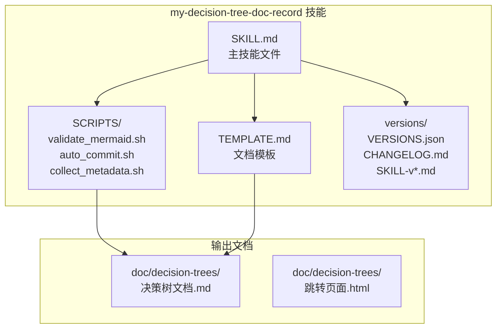
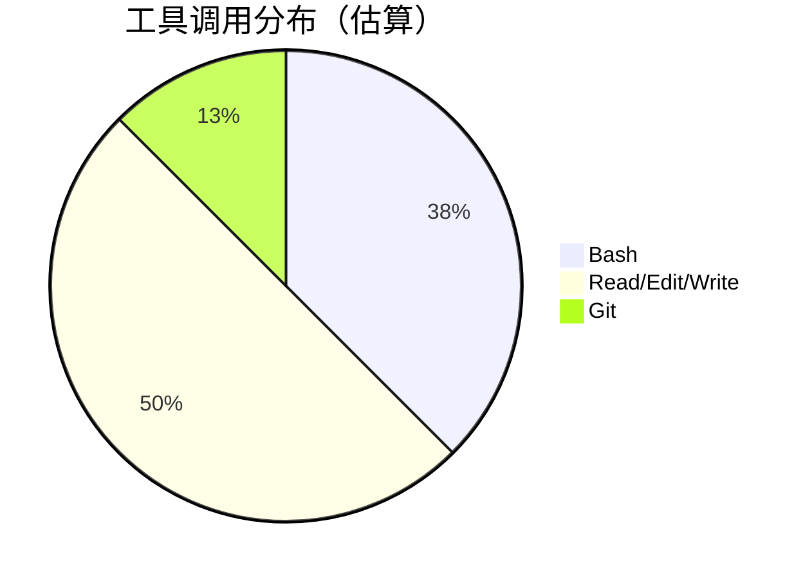
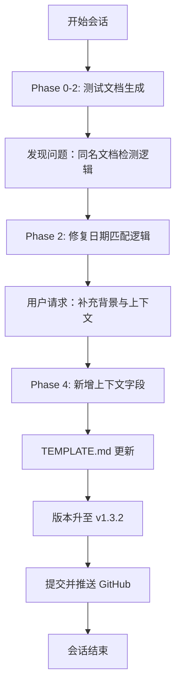
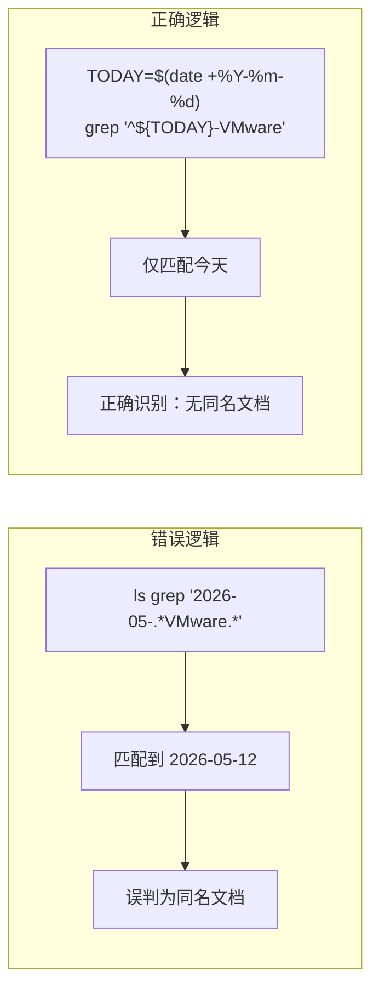
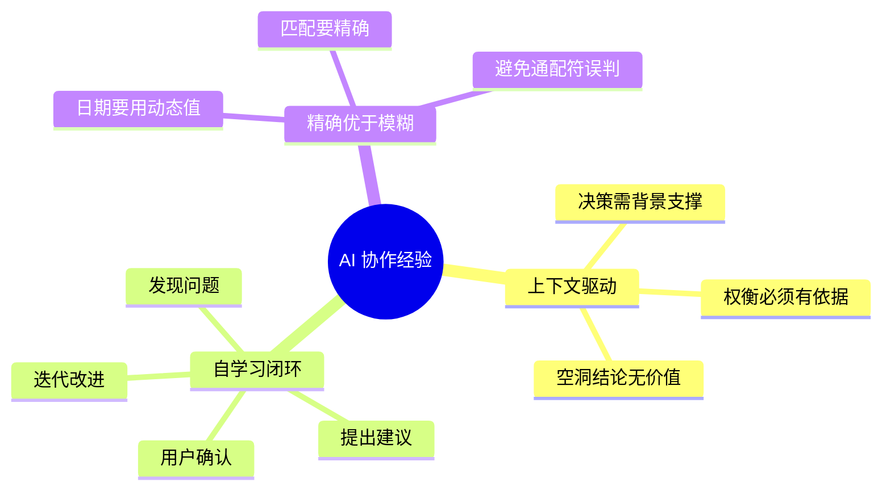

# my-decision-tree-doc-record 技能优化实践探索之旅

> **主题：** 决策树文档生成技能优化
> **日期：** 2026-05-13
> **会话来源：** 压缩恢复会话（续）
> **受众：** AI 学习者 / Claude Code 使用者
> **会话 ID：** `21206d1c-f8cc-4593-8eaf-ae18cf54ba2b`
> **项目路径：** /root/sh
> **GitHub 地址：** git@github.com:chujun/aiubuntu1-sh.git
> **本文档链接：** https://github.com/chujun/aiubuntu1-sh/blob/main/doc/ai-explore/2026-05-13-my-decision-tree-doc-record%E6%8A%80%E8%83%BD%E4%BC%98%E5%8C%96%E5%AE%9E%E8%B7%B5%E6%8E%A2%E7%B4%A2%E4%B9%8B%E6%97%85.md

---

## 目录

- [一、解决的用户痛点](#一解决的用户痛点)
- [二、主要用户价值](#二主要用户价值)
- [三、AI 角色与工作概述](#三ai-角色与工作概述)
- [四、开发环境](#四开发环境)
- [五、技术栈](#五技术栈)
- [六、AI 模型 / 插件 / Agent / 技能 / MCP 使用统计](#六ai-模型--插件--agent--技能--mcp-使用统计)
- [七、会话主要内容](#七会话主要内容)
- [八、关键决策记录](#八关键决策记录)
- [九、主要挑战与转折点](#九主要挑战与转折点)
- [十、用户提示词清单](#十用户提示词清单)
- [十一、AI 辅助实践经验](#十一ai-辅助实践经验)

---

## 一、解决的用户痛点

### 痛点上下文描述

本次会话是压缩恢复的会话，主要是对 my-decision-tree-doc-record 技能进行优化。用户在测试文档生成效果时，发现了技能逻辑中的问题并进行了修复。

### 痛点清单

| # | 用户痛点 | 痛点背景（之前） | 解决后 |
|---|---------|----------------|--------|
| 1 | 同名文档检测逻辑错误 | 使用固定日期匹配，导致不同日期的同名主题文档被误判为重复 | 改用动态日期 `$(date +%Y-%m-%d)` 精确匹配今天 |
| 2 | 脚本调用方式错误 | 用 bash 调用 Python 脚本导致语法错误 | 改为 `python3` 调用 |
| 3 | 决策文档缺乏上下文 | 生成的决策树只有选项和结论，缺少决策背景 | 新增「背景与上下文」章节，记录权衡过程 |

---

## 二、主要用户价值

1. **提升文档生成质量**：新增背景与上下文章节，使决策记录从「结论」变为「有根有据的权衡过程」
2. **修复关键 Bug**：Phase 2 和 Phase 9 的问题修复，提升技能可靠性
3. **积累技能优化方法论**：通过自学习机制发现问题→提出建议→用户确认→应用的闭环流程

---

## 三、AI 角色与工作概述

### 角色定位

| 角色 | 说明 |
|------|------|
| 技能优化工程师 | 发现并修复技能本身的逻辑问题 |
| 文档生成器 | 生成测试用决策树文档 |
| 自学习闭环执行者 | 按 Phase 11 流程提出并应用改进建议 |

### 具体工作

- 修复 Phase 2 同名文档检测逻辑（日期匹配问题）
- 修复 Phase 9 validate_mermaid.sh 调用命令（bash → python3）
- 新增「背景与上下文」章节，增强决策文档的信息密度
- 验证文档生成流程，执行完整的 Phase 0-11

---

## 四、开发环境

- **操作系统：** Linux 6.8.0-107-generic (Ubuntu)
- **Shell：** bash
- **工作目录：** /root/sh
- **技能目录：** /root/.claude/skills/my-decision-tree-doc-record

---

## 五、技术栈



| 组件 | 说明 |
|------|------|
| SKILL.md | 技能主文件，定义 Phase 0-11 执行流程 |
| TEMPLATE.md | 决策树文档模板 |
| validate_mermaid.sh | Mermaid 语法验证脚本（Python） |
| auto_commit.sh | 自动提交脚本 |
| collect_metadata.sh | 元数据收集脚本 |

---

## 六、AI 模型 / 插件 / Agent / 技能 / MCP 使用统计

### 6.1 AI 大模型

**配置模型（本次会话）：**

| 模型 ID | 名称 | 用途 |
|---------|------|------|
| MiniMax-M2.7-highspeed | MiniMax 高速模型 | 主对话 |

### 6.2 开发工具

| 工具 | 说明 |
|------|------|
| Git | 版本控制 |
| Bash | 脚本执行 |
| Claude Code | 主对话界面 |

### 6.3 Agent（智能代理）

本次会话未主动调用 Agent。

### 6.4 技能（Skill）

| 技能名称 | 触发命令 | 触发方 | 调用次数 |
|---------|---------|-------|---------|
| my-decision-tree-doc-record | /my-decision-tree-doc-record | 用户 | 1 次 |

### 6.5 MCP 服务

本次会话无 MCP 服务调用。

### 6.6 Claude Code 工具调用统计



> ⚠️ 以上数据为基于会话记忆的估算值，非精确统计。

---

## 七、会话主要内容

### 7.1 任务全景



### 7.2 核心问题 1：同名文档检测逻辑错误

**问题描述：**
用户指出 2026-05-13 生成的文档被错误地识别为与 2026-05-12 的文档同名。

**根因分析：**


### 7.3 核心问题 2：脚本调用方式错误

**问题描述：**
用 `bash` 调用 Python 编写的 `validate_mermaid.sh` 导致语法错误。

**根因分析：**
- 脚本 shebang 是 `#!/usr/bin/env python3`
- 但调用时用了 `bash SCRIPTS/validate_mermaid.sh`
- bash 不认识 Python 语法

**修复：**
```diff
- bash SCRIPTS/validate_mermaid.sh <文件路径>
+ python3 SCRIPTS/validate_mermaid.sh <文件路径>
```

---

## 八、关键决策记录

| 决策点 | 选项 A | 选项 B | 最终选择 | 理由 |
|--------|--------|--------|---------|------|
| 检测到同名文档时 | 询问用户 | 自动处理 | 询问用户 | 用户偏好明确选择 |
| 改进建议应用 | 全部应用 | 逐条选择 | 全部应用 | 效率优先 |

---

## 九、主要挑战与转折点

| 挑战 | 初始判断 | 实际根因 | 转折点 |
|------|---------|---------|--------|
| 同名文档误判 | 认为检测逻辑正确 | 检测命令未限定日期，用了通配符匹配 | 用户指出问题后修复 |
| 脚本调用失败 | 认为可能是脚本问题 | 用 bash 调用 Python 脚本 | 改为 python3 调用 |

---

## 十、用户提示词清单（原文，一字未改）

### 【当前会话】（压缩恢复，上下文有限）

**提示词 1：**
```
my-decision-tree-doc-record
```

**提示词 2：**
```
目前主要是测试验证文档生成效果
```

**提示词 3：**
```
这儿同名文档检测机制是不是有问题，今天是20260513应该不算同名文档呢
```

**提示词 4：**
```
全部应用
```

**提示词 5：**
```
my-decision-tree-doc-record 技能优化，生成文档中补充架构决策记录中的背景和上下文信息，所有决策都是权衡之术，必然伴随着上下文信息，没有上下文的决策是空想
```

---

## 十一、AI 辅助实践经验（面向 AI 学习者）



| 经验 | 核心教训 |
|------|---------|
| 上下文驱动决策 | 没有上下文的决策是空想，决策树必须记录权衡过程 |
| 自学习机制价值 | 技能能在执行中自我改进，形成闭环 |
| 精确优于模糊 | 日期匹配要用动态值，避免通配符误判 |

---

*文档生成时间：2026-05-13 | 由 MiniMax-M2.7-highspeed 辅助生成*
