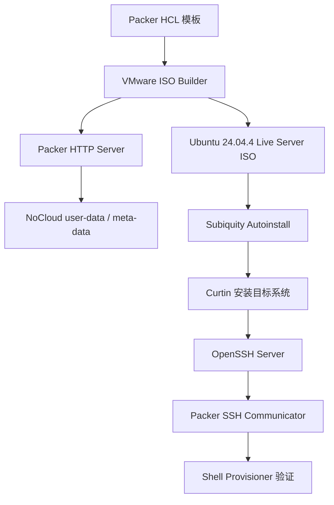
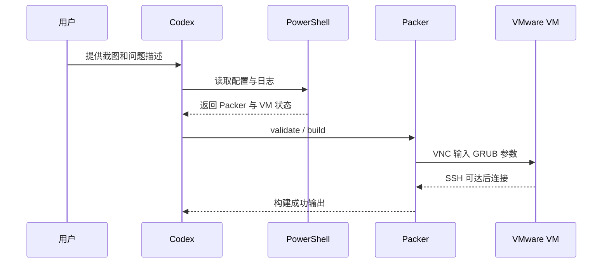
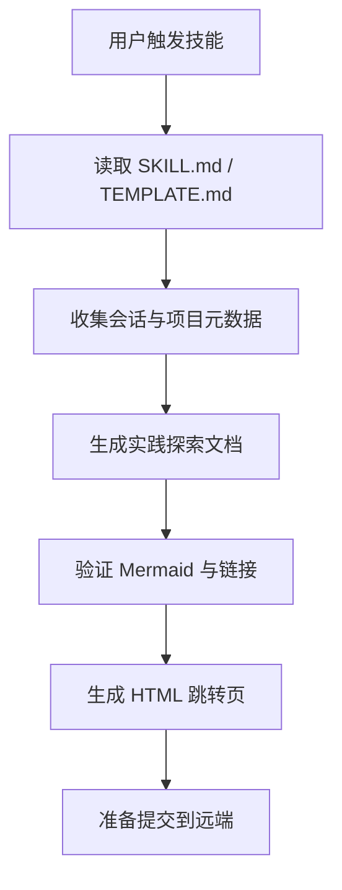
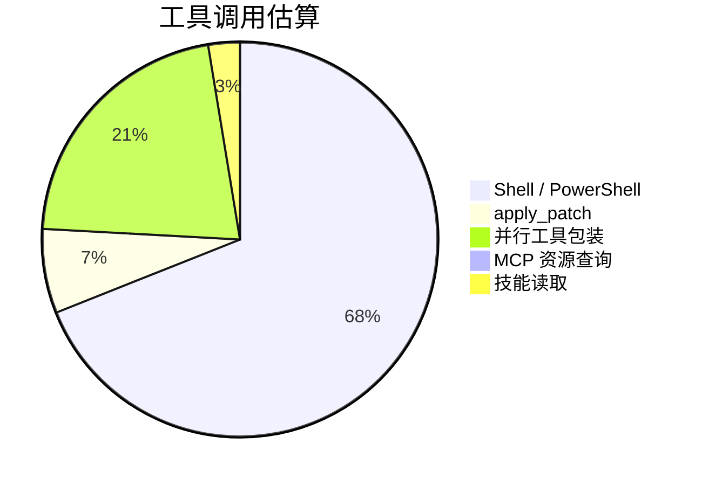
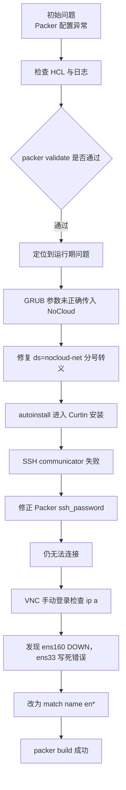
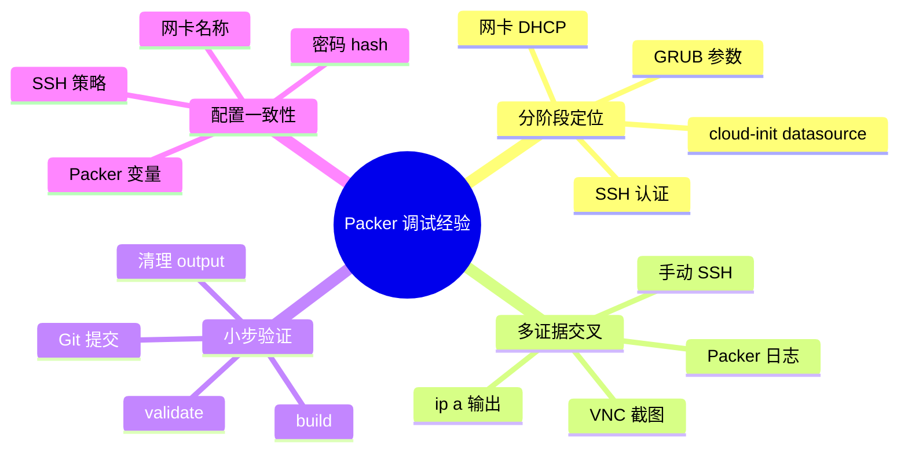
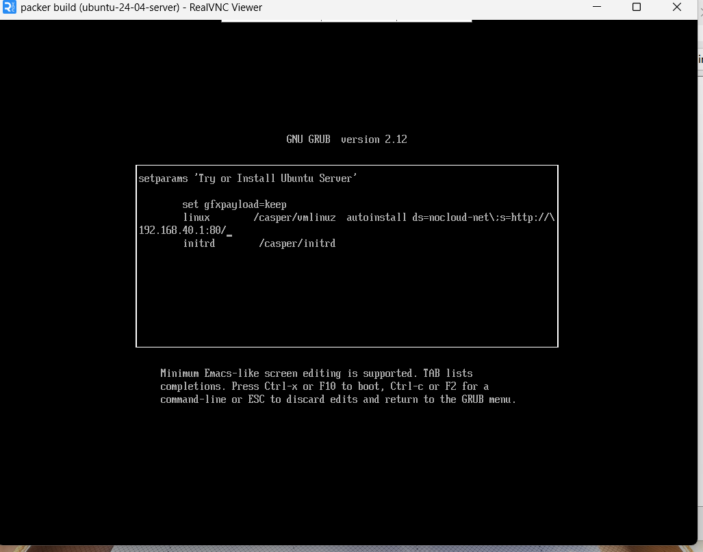
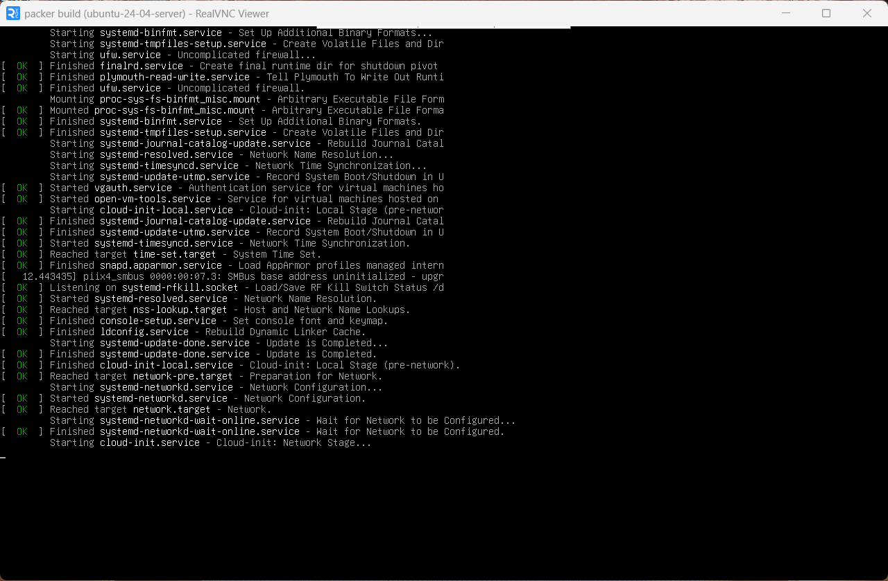
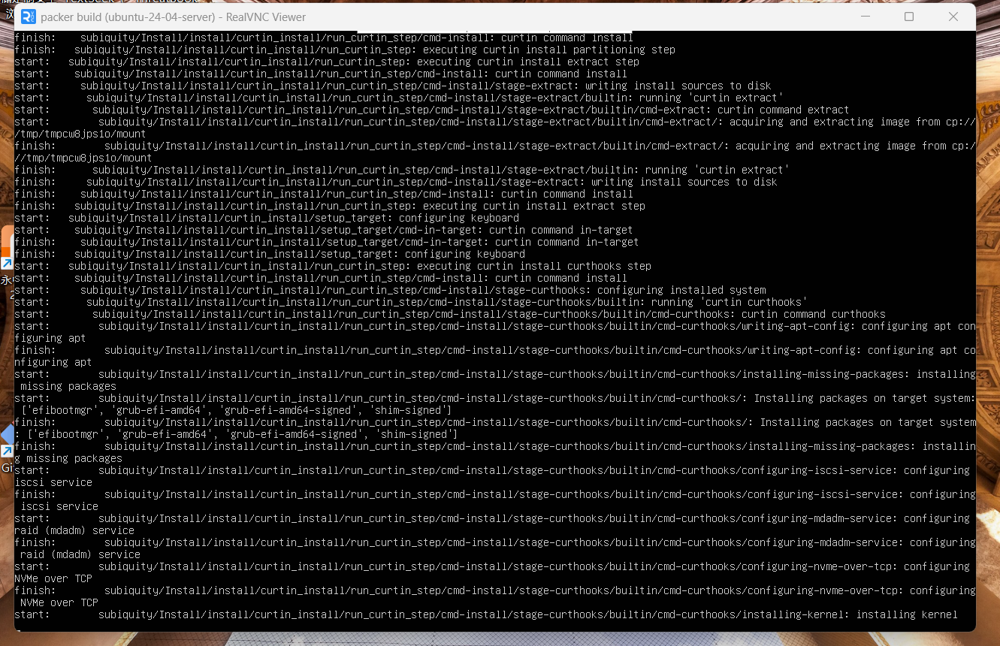
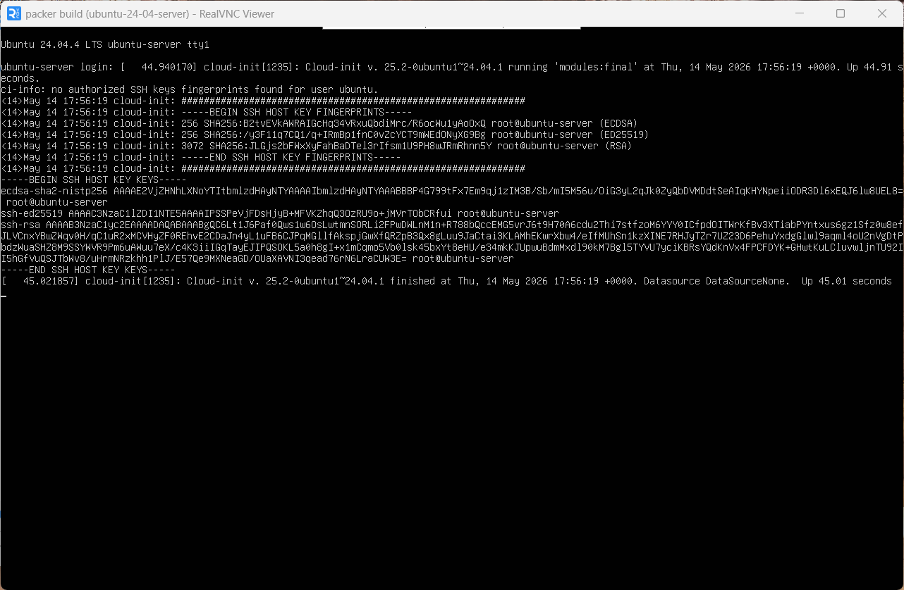

# aiubuntu1-sh Packer 镜像构建 Bug 修复实践探索之旅

> **主题：** Windows + VMware Workstation 环境下 Ubuntu 24.04 Server Packer 自动化镜像构建调试  
> **日期：** 2026-05-14  
> **预计耗时：** 3.4 小时（15:49 ~ 19:13，无长时间空闲）  
> **受众：** AI 学习者 / Codex 使用者 / Packer 与 VMware 自动化实践者  
> **会话 ID：** `local-codex-desktop-2026-05-14-aiubuntu1-sh`  
> **项目路径：** `D:\project\my\aiubuntu1-sh`  
> **GitHub 地址：** https://github.com/chujun/aiubuntu1-sh  
> **本文档链接：** https://github.com/chujun/aiubuntu1-sh/blob/main/doc/ai-explore/2026-05-14-aiubuntu1-sh-Packer镜像构建Bug修复实践探索之旅.md  
> **本文档链接（编码版）：** https://github.com/chujun/aiubuntu1-sh/blob/main/doc/ai-explore/2026-05-14-aiubuntu1-sh-Packer%E9%95%9C%E5%83%8F%E6%9E%84%E5%BB%BABug%E4%BF%AE%E5%A4%8D%E5%AE%9E%E8%B7%B5%E6%8E%A2%E7%B4%A2%E4%B9%8B%E6%97%85.md

---

## 目录

- [一、解决的用户痛点](#一解决的用户痛点)
- [二、主要用户价值](#二主要用户价值)
- [三、AI 角色与工作概述](#三ai-角色与工作概述)
- [四、开发环境](#四开发环境)
- [五、技术栈](#五技术栈)
- [六、AI 模型 / 插件 / Agent / 技能 / MCP 使用统计](#六ai-模型--插件--agent--技能--mcp-使用统计)
- [七、会话主要内容](#七会话主要内容)
- [八、测试结果](#八测试结果)
- [九、主要挑战与转折点](#九主要挑战与转折点)
- [十、用户提示词清单](#十用户提示词清单)
- [十一、AI 辅助实践经验](#十一ai-辅助实践经验)
- [附录 A：关键错误截图与代码改动点](#附录-a关键错误截图与代码改动点)

---

## 一、解决的用户痛点

### 痛点上下文描述

本次会话围绕 `packer/ubuntu-24-server` 的 VMware 镜像构建配置展开。用户希望通过 `packer build .` 自动完成 Ubuntu 24.04 Server 安装、SSH 连接、验证和关机收尾，但实际过程连续卡在 GRUB、cloud-init、SSH communicator、网卡 DHCP 等多个阶段。每个阶段的表象都相似：Packer 在等待，VNC 画面停住，日志中出现 EOF 或 DataSourceNone，人工判断成本很高。

### 痛点清单

| # | 用户痛点 | 痛点背景（之前） | 解决后 |
|---|---------|----------------|--------|
| 1 | Packer 自动安装不进入 autoinstall | GRUB 参数只追加 `autoinstall` 或 datasource 参数被分号截断，最终进入语言选择或 live 环境 | 明确使用 `ds=nocloud-net\;s=http://{{ .HTTPIP }}:{{ .HTTPPort }}/`，安装器能读取 HTTP seed |
| 2 | 构建卡在 cloud-init / SSH，难以判断正常还是异常 | VNC 显示 `DataSourceNone`、`cloud-init network stage`、`login:` 等信息，缺乏判断依据 | 通过日志、VNC、手动 SSH、网卡状态逐层拆解，区分安装阶段、首次启动阶段和 SSH 阶段 |
| 3 | Packer SSH 一直失败 | 系统用户密码 hash 对应 `ubuntucj`，但 Packer 变量仍是 `ubuntu` | 将 `variables.pkr.hcl` 的 `ssh_password` 改成 `ubuntucj`，认证信息一致 |
| 4 | 装好的系统没有网络 | `user-data` 写死 `ens33`，但 VMware 实际网卡是 `ens160` / `enp3s0` | 改为 `match: name: "en*"`，最终系统能通过 DHCP 获得地址 |
| 5 | 临时 VM 和 output 文件反复残留 | 多次中断构建后 `vmware-vmx`、`packer` 进程、output 虚拟机文件残留 | 建立了停止 Packer、关闭 VM、删除 output 的清理流程 |

---

## 二、主要用户价值

- 把一个“看起来只是 Packer 卡住”的问题拆成了 GRUB 参数、cloud-init datasource、SSH 密码、网卡命名四个独立根因。
- 用 `packer_debug.log`、VNC 截图、手动 SSH、`ip a` 输出形成证据链，避免靠猜测反复改配置。
- 最终使 `packer build .` 完整成功，生成 VMware 可用的 Ubuntu 24.04.4 Server 虚拟机目录。
- 沉淀了 Windows + VMware Workstation + Packer 的 autoinstall 调试方法。
- 明确了哪些文件应提交，哪些是构建缓存和日志，不污染 Git 历史。

---

## 三、AI 角色与工作概述

### 角色定位

| 角色 | 说明 |
|------|------|
| 调试专家 | 通过日志、截图和命令输出逐步定位 Packer 构建失败根因 |
| DevOps 工程师 | 调整 Packer、cloud-init、VMware 构建流程并验证自动化链路 |
| Linux 系统工程师 | 分析 SSH、netplan、cloud-init、网卡命名和 DHCP 问题 |
| Git 协作者 | 分阶段提交、推送修复，并避免提交缓存和日志 |
| 文档整理者 | 将本次会话整理为可复用的 AI 辅助调试案例 |

### 具体工作

- 检查 `ubuntu-24-server.pkr.hcl`、`variables.pkr.hcl`、`http/user-data` 和 Packer 日志。
- 修复 GRUB datasource 参数，处理 `;` 在 GRUB 中的转义问题。
- 调整 `late-commands`，显式启用 SSH 密码登录。
- 将 Packer SSH 密码与 `user-data` 中的用户密码 hash 对齐。
- 根据 VNC 手动排查结果，修复网卡从 `ens33` 到 `en*` 的匹配规则。
- 多次运行 `packer validate .` 和 `packer build .`，最终验证构建成功。
- 管理临时 VMware 虚拟机与 output 清理。

---

## 四、开发环境

| 项目 | 内容 |
|------|------|
| 操作系统 | Windows 11 |
| Shell | PowerShell |
| 工作目录 | `D:\project\my\aiubuntu1-sh` |
| Packer | `1.15.3` |
| Packer 插件 | `github.com/hashicorp/vmware`，日志中实际插件版本 `v2.1.2` |
| 虚拟化 | VMware Workstation 25.0.0 |
| 客户机系统 | Ubuntu 24.04.4 Live Server ISO |
| 网络 | VMware VMnet8 NAT，宿主机地址 `192.168.40.1` |
| VNC | Packer 自动分配端口，例如 `127.0.0.1:5904` |
| Debug 日志 | `D:\project\my\aiubuntu1-sh\packer\ubuntu-24-server\packer_debug.log` |

---

## 五、技术栈



| 类型 | 具体技术 | 本次用途 |
|------|----------|----------|
| 镜像构建 | Packer | 自动创建 VMware 虚拟机并驱动安装 |
| 虚拟化 | VMware Workstation | 本地运行 Ubuntu Server 安装流程 |
| 自动安装 | Ubuntu autoinstall / Subiquity | 无人值守安装 |
| 配置注入 | cloud-init NoCloud | 通过 Packer HTTP server 提供 `user-data` |
| 安装执行 | curtin | 写入目标系统、执行 late-commands |
| 远程连接 | OpenSSH | Packer provisioner 登录目标 VM |
| 网络 | VMnet8 DHCP | 分配客户机 IP |

---

## 六、AI 模型 / 插件 / Agent / 技能 / MCP 使用统计

### 6.1 AI 大模型

| 模型 ID | 名称 | 用途 | 调用范围 |
|---------|------|------|---------|
| `gpt-5` | Codex / GPT-5 系列 | 主对话、代码修改、日志分析、文档生成 | 全程 |

本次没有调用子代理，也没有显式切换模型。

### 6.2 开发工具

| 工具 | 用途 | 估算调用次数 |
|------|------|--------------|
| PowerShell shell command | 文件读取、Git、Packer、VMware 进程管理 | 80+ |
| apply_patch | 修改 Packer HCL、user-data、变量文件、生成文档 | 8 |
| multi_tool_use.parallel | 并行读取日志、状态、配置 | 25+ |
| Web / Browser | 用户通过浏览器查看 `user-data`，AI 主要使用本地 shell 分析 | 0 次直接浏览 |

### 6.3 插件（Plugin）

| 插件 | 本次使用 | 说明 |
|------|----------|------|
| Browser | 间接涉及 | 用户在内置浏览器打开 `http://127.0.0.1:8900/user-data`，AI 未直接自动化浏览器 |

### 6.4 Agent（智能代理）

| Agent 名称 | 触发方式 | 执行结果 | 失败原因 |
|-----------|---------|----------|----------|
| 无 | 未调用 | 不适用 | 不适用 |



### 6.5 技能（Skill）

| 技能名称 | 触发命令 | 触发方 | 调用次数 | 是否完整执行 |
|---------|---------|-------|---------|-------------|
| `my-explore-doc-record` | `[$my-explore-doc-record](...)` | 用户 | 1 | 完整执行 |



### 6.6 MCP 服务

| MCP 服务 | 工具前缀 | 本次调用次数 | 说明 |
|---------|---------|-------------|------|
| 无已暴露资源 | 无 | 0 | `list_mcp_resources` 返回空列表 |

### 6.7 Codex 工具调用统计



> 以上数据为基于会话记忆的估算值，非精确统计。重点用于展示 AI 协作中“读取证据、修改配置、验证结果”的比例关系。

### 6.8 浏览器插件

本次没有发现浏览器插件干扰。用户在内置浏览器打开 Packer HTTP server 的 `user-data`，用于确认 HTTP seed 内容可访问。

---

## 七、会话主要内容

### 7.1 任务全景



### 7.2 核心问题 1：GRUB datasource 参数被截断

最初模板中只追加了 `autoinstall`，安装器不知道要从哪里读取 Packer HTTP server 提供的 NoCloud 数据。随后加入 `ds=nocloud-net;s=...` 后，又遇到 GRUB 将分号视为命令分隔符的风险。最终采用 HCL 中写 `\\;`，让 GRUB 中实际输入 `\;`。

关键修复：

```hcl
"<bs><bs><bs><bs><wait> autoinstall ds=nocloud-net\\;s=http://{{ .HTTPIP }}:{{ .HTTPPort }}/ ---<wait><f10>"
```

### 7.3 核心问题 2：Packer SSH 密码与系统用户密码不一致

`user-data` 中的密码 hash 对应 `ubuntucj`，但 `variables.pkr.hcl` 里 `ssh_password` 默认值仍是 `ubuntu`。用户手动确认后，将 Packer 密码改为 `ubuntucj`。

关键修复：

```hcl
variable "ssh_password" {
  type      = string
  default   = "ubuntucj"
  sensitive = true
  description = "SSH 密码"
}
```

### 7.4 核心问题 3：最终系统网卡名称不是 ens33

VNC 手动登录后执行 `ip a`，看到真实网卡是 `ens160`，状态为 DOWN。此前 `user-data` 写死 `ens33`，导致目标系统 netplan 没有给真实网卡启用 DHCP。

关键修复：

```yaml
network:
  version: 2
  ethernets:
    primary:
      match:
        name: "en*"
      dhcp4: true
      optional: true
```

### 7.5 成功输出

最终 `packer build .` 输出：

```text
Connected to SSH!
SSH connection verified
ubuntu-server
PRETTY_NAME="Ubuntu 24.04.4 LTS"
Build 'ubuntu-24-server.vmware-iso.ubuntu-24-server' finished after 8 minutes 49 seconds.
```

---

## 八、测试结果

| 测试 / 验证项 | 结果 | 说明 |
|---------------|------|------|
| `packer validate .` | 通过 | 多次修改后均验证 HCL 配置有效 |
| Packer HTTP server 访问 | 通过 | 宿主机可访问 `/user-data` |
| GRUB 参数输入 | 通过 | 日志显示输入 `ds=nocloud-net\;s=http://192.168.40.1:<port>/` |
| autoinstall 进入安装流程 | 通过 | VNC 显示 Subiquity / Curtin 安装日志 |
| 手动 SSH 登录 | 通过 | 用户确认 `ubuntu / ubuntucj` 可登录 |
| 最终 `packer build .` | 通过 | Packer 成功 SSH、执行 provisioner、关机和清理 |


---

## 九、主要挑战与转折点

| 挑战 | 初始判断 | 实际根因 | 转折点 |
|------|---------|---------|--------|
| GRUB 后进入语言选择 | 以为只是 boot_command 时序问题 | NoCloud datasource 没正确传给内核 | 日志与截图显示 GRUB 只出现部分参数 |
| cloud-init 显示 DataSourceNone | 一度判断为 NoCloud 未生效 | 安装阶段已生效，首次启动阶段 DataSourceNone 不必然失败 | 第一张 Curtin 安装截图证明 autoinstall 已进入 |
| SSH EOF | 初始怀疑 sshd 配置 | 密码不一致、系统安装切换、后续又发现网卡无 IP | 用户手动登录确认密码是 `ubuntucj` |
| Packer 找到 IP 但连不上 | 以为 DHCP 正常但认证失败 | VMware 租约中的 IP 不代表最终系统网卡已配置 | 用户在 VNC 执行 `ip a`，发现 `ens160 DOWN` |
| 临时 VM 残留 | 中断后容易误用旧 VM 状态 | output 目录和进程未清理会污染判断 | 多次建立 stop VM、stop Packer、delete output 的节奏 |

---

## 十、用户提示词清单（原文，一字未改）

### 【当前会话】

**提示词 1：**
```text
帮我检查packer的配置有什么问题
```

**提示词 2：**
```text
帮我修复问题
```

**提示词 3：**
```text
git add,commit,push
```

**提示词 4：**
```text
使用简体中文备注
```

**提示词 5：**
```text
packer build .命令之后，进入GRUB界面，输入如下内容，不过最终还是进入语言选择界面，一直卡在这儿
```

**提示词 6：**
```text
帮我运行packer build .
```

**提示词 7：**
```text
好像安装顺利执行下去了，帮我提交 git add,commit,push，这是一个重大的BUG修复
```

**提示词 8：**
```text
现在卡在这个页面，不知道这是正常还是异常情况
```

**提示词 9：**
```text
停止packer build .
```

**提示词 10：**
```text
对应临时虚拟机关闭，然后删除output下的虚拟机文件
```

**提示词 11：**
```text
packer build .并输出debug日志到日志文件
```

**提示词 12：**
```text
疑问1，分析日志 D:\project\my\aiubuntu1-sh\packer\ubuntu-24-server\packer_debug.log，界面卡在starting cloud-init.service -cloud init :network stage
```

**提示词 13：**
```text
grud界面是否正常，分析截图中的配置，autoinstall配置在 /casper/vmlinuz后面命令格式是否正确
```

**提示词 14：**
```text
那为什么GRUB命令行中的地址是192.168.40.1:80/，这个端口对吗
```

**提示词 15：**
```text
停止packer build .
```

**提示词 16：**
```text
对应临时虚拟机关闭，然后删除output下的虚拟机文件
```

**提示词 17：**
```text
packer build .并输出debug日志到日志文件
```

**提示词 18：**
```text
重大进展，好像安装顺利推进下去了，这是VNC连接中获取到的中间过程的截图信息，，不过最后好像还是停留在这个页面上了
```

**提示词 19：**
```text
暂停packer build .程序，对应临时虚拟机关闭，然后删除output下的虚拟机文件
```

**提示词 20：**
```text
cloud-init中的http/user-data下面3个命令有什么作用，不写有什么影响，是不是就不会卡住了
late-commands: 
    - sleep 5
    - curtin in-target --target=/target -- systemctl enable ssh
    - curtin in-target --target=/target -- cloud-init clean --logs
```

**提示词 21：**
```text
那按照你的建议- curtin in-target --target=/target -- bash -c "printf 'PasswordAuthentication yes\nKbdInteractiveAuthentication yes\nUsePAM yes\n' > /etc/ssh/sshd_config.d/99-packer.conf" ，，补充这个配置吧
```

**提示词 22：**
```text
packer build .并输出debug日志到日志文件，再继续重试
```

**提示词 23：**
```text
正常结束状态应该是什么样子的呢
```

**提示词 24：**
```text
还是卡在了这一步，==> <sensitive>-24-server.vmware-iso.<sensitive>-24-server: Using SSH communicator to connect: 192.168.40.138 这一步的作用是什么
```

**提示词 25：**
```text
我手动ssh登录成功了，对的，user-data中的密文密码是ubuntucj
```

**提示词 26：**
```text
调整配置
```

**提示词 27：**
```text
暂停packer build .程序，对应临时虚拟机关闭，然后删除output下的虚拟机文件
```

**提示词 28：**
```text
packer build .并输出debug日志到日志文件，再继续重试
```

**提示词 29：**
```text
查看日志定位原因，好像还是卡在相同的问题上了
```

**提示词 30：**
```text
我在VNC中手动指定截图如上
```

**提示词 31：**
```text
暂停packer build .程序，对应临时虚拟机关闭，然后删除output下的虚拟机文件
```

**提示词 32：**
```text
packer build .并输出debug日志到日志文件，再继续重试
```

**提示词 33：**
```text
[$my-explore-doc-record](C:\\Users\\cj\\.codex\\skills\\my-explore-doc-record\\SKILL.md) 
```

---

## 十一、AI 辅助实践经验（面向 AI 学习者）



| 经验 | 核心教训 |
|------|----------|
| 看到 `DataSourceNone` 不要立刻下结论 | 要区分安装器阶段和装好后系统首次启动阶段 |
| Packer 找到 IP 不代表系统网络正常 | DHCP 租约可能来自中间阶段，最终系统还要看 `ip a` |
| SSH 失败要拆成网络、握手、认证三层 | EOF、timeout、unable to authenticate 分别代表不同方向 |
| 自动化构建要清理临时 VM | 中断后旧 output 和旧进程会污染下一次判断 |
| 与用户一起观察 VNC 很重要 | 图形控制台信息能补齐 Packer 日志看不到的系统内状态 |

---

## 附录 A：关键错误截图与代码改动点

本节把会话中的关键截图和最终代码改动放在一起，便于读者从"现象"直接追到"根因"和"修复点"。

### A.1 GRUB 参数确认：NoCloud datasource 必须在 `/casper/vmlinuz` 行



截图要点：

- `autoinstall` 位于 `linux /casper/vmlinuz` 后面，这是正确位置。
- `ds=nocloud-net\;s=http://...` 中的 `\;` 是关键，避免 GRUB 把分号当作命令分隔符。
- URL 端口必须等于 Packer 日志里的 `Starting HTTP server on port ...`，不能误认为默认 `80`。

对应改动：`packer/ubuntu-24-server/ubuntu-24-server.pkr.hcl`

```hcl
boot_command = [
  "<wait>e<wait5>",
  "<down><wait><down><wait><down><wait2><end><wait5>",
  "<bs><bs><bs><bs><wait> autoinstall ds=nocloud-net\\;s=http://{{ .HTTPIP }}:{{ .HTTPPort }}/ ---<wait><f10>"
]
```

### A.2 cloud-init network stage：说明安装器正在等待网络 / datasource



截图要点：

- 短时间停在 `Cloud-init: Network Stage` 是正常启动过程。
- 长时间停住时，需要确认 NoCloud HTTP seed 是否可访问，以及 guest 网络是否正常。
- 本次后续通过 Curtin 安装截图证明 autoinstall 已经开始工作。

### A.3 Curtin 安装推进：证明 autoinstall 已经生效



截图要点：

- 出现 `subiquity/Install/install/curtin_install`、`curtin command install`、`installing kernel`。
- 这说明安装器已经读取 `http/user-data`，不是还停留在 live server 语言选择流程。
- 这一阶段之后，问题焦点从 datasource 转向目标系统 SSH 和网络。

### A.4 DataSourceNone 登录页：安装完成后仍需验证 SSH 与目标网卡



截图要点：

- `ubuntu-server login:` 表明系统已经安装并启动。
- 这里的 `Datasource DataSourceNone` 不再等价于 autoinstall 失败，因为安装阶段已经完成。
- 后续真正根因是目标系统网卡没有 DHCP 地址，以及 Packer 密码配置不匹配。

### A.5 SSH 与网络相关最终修复

Packer SSH 密码必须和 `user-data` 中 hash 对应的明文一致。用户确认明文是 `ubuntucj` 后，修改 `variables.pkr.hcl`：

```hcl
variable "ssh_password" {
  type      = string
  default   = "ubuntucj"
  sensitive = true
  description = "SSH 密码"
}
```

目标系统需要显式允许密码登录，修改 `http/user-data`：

```yaml
late-commands:
  - sleep 5
  - curtin in-target --target=/target -- mkdir -p /etc/ssh/sshd_config.d
  - curtin in-target --target=/target -- bash -c "printf 'PasswordAuthentication yes\nKbdInteractiveAuthentication yes\nUsePAM yes\n' > /etc/ssh/sshd_config.d/99-packer.conf"
  - curtin in-target --target=/target -- systemctl enable ssh
  - curtin in-target --target=/target -- cloud-init clean --logs
```

目标系统真实网卡是 `ens160` / `enp3s0`，不是原先写死的 `ens33`。最终网络配置改成按 `en*` 匹配：

```yaml
network:
  version: 2
  ethernets:
    primary:
      match:
        name: "en*"
      dhcp4: true
      optional: true
```

这些改动合并后，`packer build .` 最终输出 `Connected to SSH!` 并成功生成 `output/ubuntu-24-04-server`。

---

*文档生成时间：2026-05-14 | 由 Codex / GPT-5 (`gpt-5`) 辅助生成*
