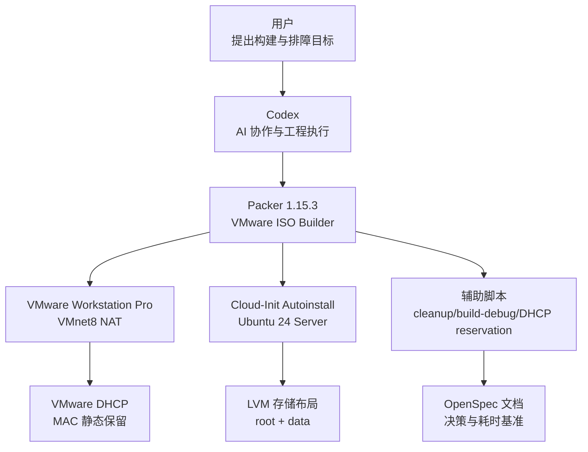
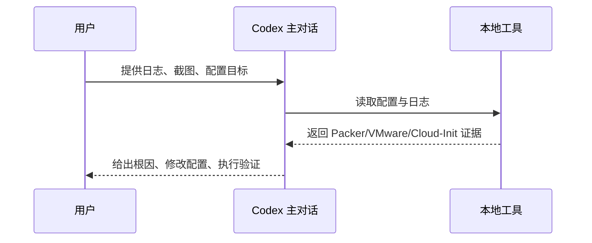
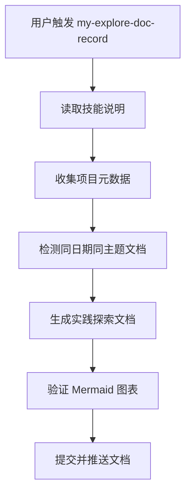
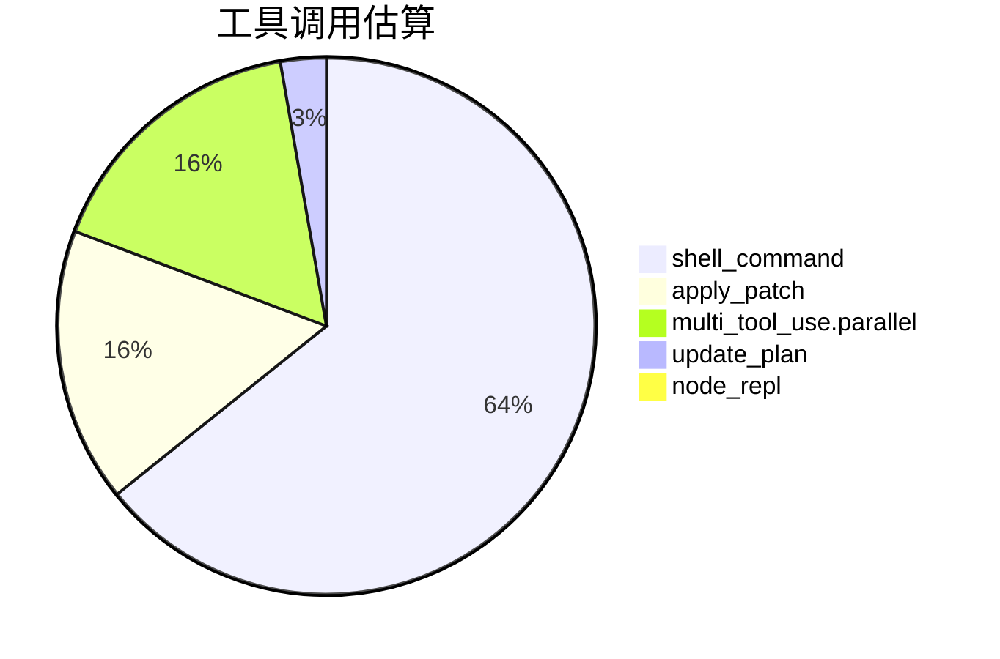
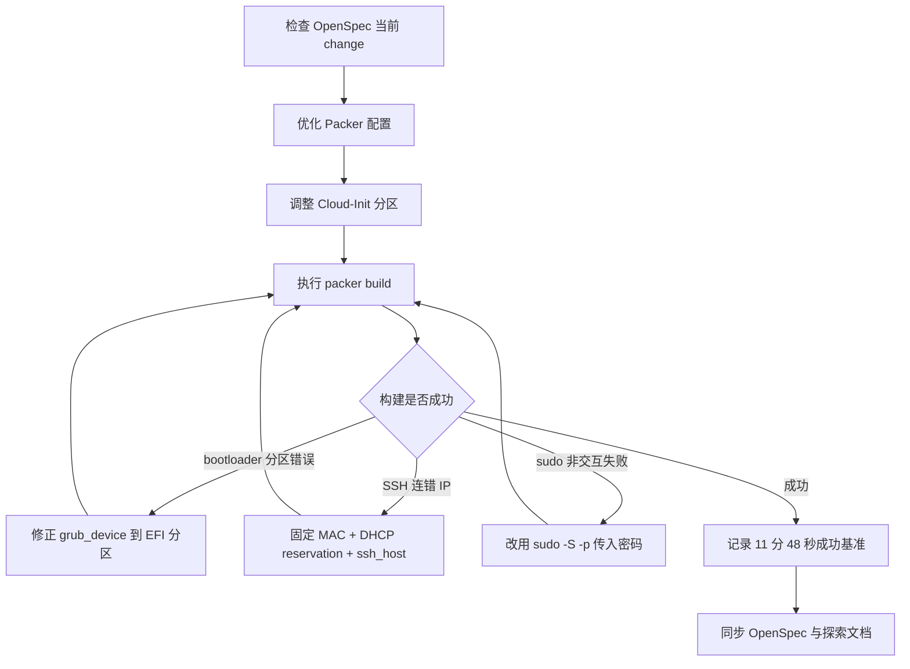
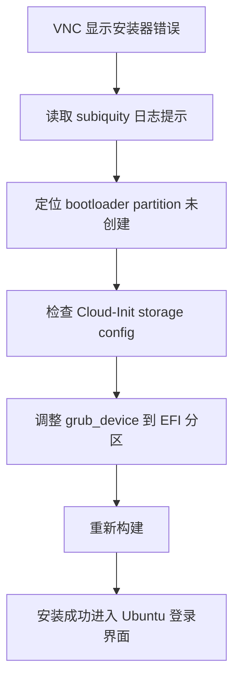
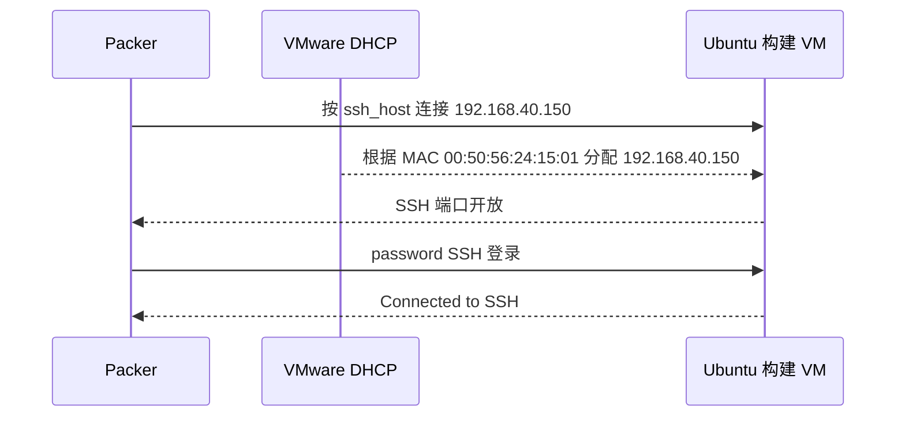
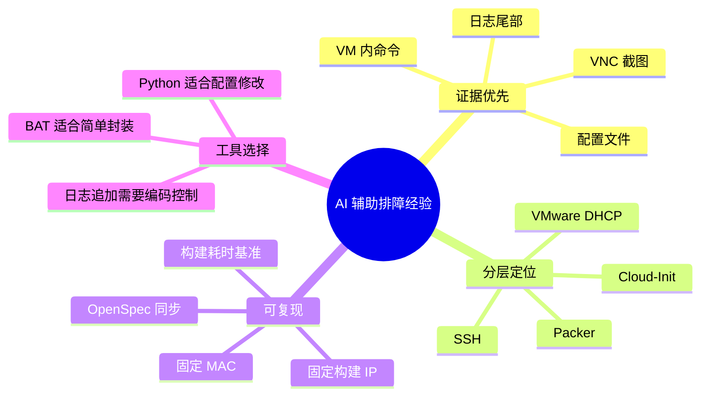

# aiubuntu1-sh Packer 镜像构建成功实践探索之旅

> **主题：** AI 辅助排查 VMware Workstation + Packer + Cloud-Init 自动化构建 Ubuntu 24 Server 镜像的完整过程  
> **日期：** 2026-05-15  
> **预计耗时：** 3.0 小时（约 11:20 ~ 14:35，扣除午间空闲与等待间隔后估算）  
> **受众：** AI 学习者 / Codex 使用者 / VMware Workstation 自动化实践者  
> **会话 ID：** `desktop-codex-session-2026-05-15`  
> **项目路径：** `D:\project\my\aiubuntu1-sh`  
> **GitHub 地址：** git@github.com:chujun/aiubuntu1-sh.git  
> **本文档链接：** https://github.com/chujun/aiubuntu1-sh/blob/main/doc/ai-explore/2026-05-15-aiubuntu1-sh-Packer镜像构建成功实践探索之旅.md  
> **本文档链接（编码版）：** https://github.com/chujun/aiubuntu1-sh/blob/main/doc/ai-explore/2026-05-15-aiubuntu1-sh-Packer%E9%95%9C%E5%83%8F%E6%9E%84%E5%BB%BA%E6%88%90%E5%8A%9F%E5%AE%9E%E8%B7%B5%E6%8E%A2%E7%B4%A2%E4%B9%8B%E6%97%85.md

---

## 目录

- [一、解决的用户痛点](#一解决的用户痛点)
- [二、主要用户价值](#二主要用户价值)
- [三、AI 角色与工作概述](#三ai-角色与工作概述)
- [四、开发环境](#四开发环境)
- [五、技术栈](#五技术栈)
- [六、AI 模型 / 插件 / Agent / 技能 / MCP 使用统计](#六ai-模型--插件--agent--技能--mcp-使用统计)
- [七、会话主要内容](#七会话主要内容)
- [八、关键决策记录](#八关键决策记录)
- [九、主要挑战与转折点](#九主要挑战与转折点)
- [十、用户提示词清单](#十用户提示词清单原文一字未改)
- [十一、AI 辅助实践经验](#十一ai-辅助实践经验面向-ai-学习者)

---

## 一、解决的用户痛点

### 痛点上下文描述

本次实践发生在 Windows 11 + VMware Workstation Pro 25H2 环境下，目标是用 Packer 自动构建 Ubuntu 24 Server 基础镜像。用户希望从“手动安装虚拟机”过渡到“可重复、可审计、可记录耗时”的镜像构建流程。过程中同时涉及 Packer HCL、Cloud-Init autoinstall、VMware NAT DHCP、SSH provisioner、OpenSpec 文档同步和构建脚本。

### 痛点清单

| # | 用户痛点 | 痛点背景（之前） | 解决后 |
|---|---------|----------------|--------|
| 1 | Packer 构建卡在 SSH 阶段 | VM 已安装成功，但 Packer 一直连旧 IP，无法判断是安装失败还是网络探测失败 | 固定构建 MAC，并通过 VMware NAT DHCP 静态保留到 `192.168.40.150`，Packer 稳定连接正确 VM |
| 2 | VMware/Packer/Cloud-Init 错误交织 | VNC、日志、Cloud-Init、Packer 输出各说各话，排查路径不清晰 | 通过日志尾部、VNC 截图、VM 内 IP/MAC、Packer SSH 日志逐层定位 |
| 3 | 构建脚本与日志容易污染仓库 | Packer 输出、缓存、日志和 VM 文件容易被 Git 跟踪 | 更新 `.gitignore` 和清理脚本，保留可复现配置，排除构建产物 |
| 4 | 文档无法复现真实耗时 | “构建需要多久”如果只写估算，后续无法判断性能变化 | OpenSpec 记录首次成功基准：11 分 48 秒、环境、版本、ISO、网络、产物、验证点 |
| 5 | 跨平台脚本编码问题 | `.bat` 中写中文备注会被 Windows `cmd` 误解析 | 改用 Python 脚本写入 VMware DHCP 配置，支持中文说明、备份和 dry-run |

---

## 二、主要用户价值

- 将 Ubuntu 24 Server 镜像构建从手动试错推进到 Packer 自动化成功构建。
- 明确区分了三类问题：Cloud-Init 分区问题、VMware DHCP/IP 问题、Packer provisioner sudo 问题。
- 建立了可复现的构建基准：当前环境下成功构建耗时 `11 分 48 秒`。
- 将 VMware DHCP reservation 写入流程脚本化，并提供 `--dry-run` 预览。
- 将关键配置、失败原因、修复动作同步到 OpenSpec，避免知识只留在聊天记录里。

---

## 三、AI 角色与工作概述

### 角色定位

| 角色 | 说明 |
|------|------|
| DevOps 工程师 | 编写和优化 Packer、Cloud-Init、VMware 构建脚本 |
| 调试专家 | 根据 VNC 截图、Packer 日志、VM 内网络信息逐层定位失败原因 |
| 架构记录者 | 将网络、磁盘、SSH、构建耗时等决策同步到 OpenSpec |
| 工具脚本开发者 | 编写 cleanup、debug build、VMware DHCP reservation 脚本 |
| 文档整理者 | 生成实践探索文档，沉淀 AI 协作过程 |

### 具体工作

- 优化 Ubuntu 24 Server Packer 配置：插件版本、vmxnet3、disk.EnableUUID、固定 MAC、固定 SSH host。
- 调整 Cloud-Init 存储策略：40GB 磁盘，`/` 约 20G，`/data` 使用剩余 LVM 空间。
- 通过 VNC 截图定位 bootloader 分区错误，并修正 `grub_device` 配置位置。
- 通过 Packer 日志定位 SSH IP 错误、DHCP reservation 未生效、sudo 非交互失败。
- 编写 Python 脚本 `configure_vmware_dhcp_reservation.py`，自动备份并写入 VMware DHCP 静态保留。
- 成功执行 `packer build .`，生成 VMware 镜像产物。

---

## 四、开发环境

| 项目 | 内容 |
|------|------|
| 工作目录 | `D:\project\my\aiubuntu1-sh` |
| Shell | Windows PowerShell / cmd |
| 宿主机 OS | Windows 11 |
| 虚拟化平台 | VMware Workstation Pro 25H2，日志识别版本 `25.0.0` |
| Packer | `1.15.3` Windows amd64 |
| VMware Packer 插件 | `github.com/hashicorp/vmware` `v1.2.0` |
| Guest OS | Ubuntu Server 24.04.4 LTS |
| ISO | `D:/repository/iso/ubuntu-24.04.4-live-server-amd64.iso` |
| ISO checksum | `sha256:e907d92eeec9df64163a7e454cbc8d7755e8ddc7ed42f99dbc80c40f1a138433` |
| 成功产物目录 | `packer/ubuntu-24-server/output/ubuntu-24-04-server` |

---

## 五、技术栈



| 层次 | 技术 | 用途 |
|------|------|------|
| 镜像构建 | Packer `vmware-iso` | 自动创建 VM、挂载 ISO、输入 boot command、执行 provisioner |
| 虚拟化 | VMware Workstation Pro | 本地运行 Ubuntu Server 构建 VM |
| OS 初始化 | Cloud-Init autoinstall | 自动安装、用户、SSH、分区、包安装 |
| 网络 | VMnet8 NAT + DHCP reservation | 让 Packer 使用固定构建 IP |
| 脚本 | BAT + Python | 清理构建、追加 debug 日志、写 VMware DHCP 配置 |
| 规格文档 | OpenSpec | 记录方案、任务、验收和耗时基准 |

---

## 六、AI 模型 / 插件 / Agent / 技能 / MCP 使用统计

### 6.1 AI 大模型

| 模型 ID | 名称 | 用途 | 调用范围 |
|---------|------|------|---------|
| GPT-5 系列 | Codex 主对话模型 | 代码修改、脚本编写、日志分析、文档生成 | 全程 |

### 6.2 开发工具

| 工具 | 用途 |
|------|------|
| PowerShell/cmd | 查看日志、执行 Packer、操作文件 |
| `apply_patch` | 修改 HCL、OpenSpec、脚本和文档 |
| Git | 查看状态、历史、远端 |
| RealVNC Viewer | 观察 Ubuntu 安装器和登录状态 |

### 6.3 插件（Plugin）

| 插件 | 本次是否使用 | 说明 |
|------|--------------|------|
| Browser | 否 | 本次主要是本地 CLI 与虚拟机日志排障 |
| Chrome | 否 | 未涉及浏览器登录态 |
| Documents/Presentations/Spreadsheets | 否 | 未涉及 Office 文档 |

### 6.4 Agent（智能代理）

本次未调用子 Agent。所有排查、修改、验证均由主对话完成。



### 6.5 技能（Skill）

| 技能名称 | 触发命令 | 触发方 | 调用次数 | 是否完整执行 |
|---------|---------|-------|---------|------------|
| brainstorming | 隐式触发 | AI | 1 | 部分使用，用于配置方案思考 |
| my-explore-doc-record | `$my-explore-doc-record` | 用户 | 1 | 本文档生成中完整执行 |



### 6.6 MCP 服务

| MCP 服务 | 工具前缀 | 本次调用次数 | 说明 |
|---------|---------|------------|------|
| node_repl | `mcp__node_repl__` | 1 | 尝试计算产物大小时调用，受沙箱刷新失败影响未完成 |

### 6.7 Codex 工具调用统计



> 说明：以上为基于会话记忆的估算值，非精确统计。真实工具调用还包括多次并行读取日志、配置、进程和 Git 状态。

### 6.8 浏览器插件

未涉及浏览器插件问题。

---

## 七、会话主要内容

### 7.1 任务全景



### 7.2 核心问题 1：Cloud-Init 存储配置导致安装器报错

VNC 截图中曾出现：

```text
autoinstall config did not create needed bootloader partition
```

根因是 bootloader 所需分区标记没有放在正确位置。修复后，EFI 分区、`/boot`、LVM root/data 布局成功应用。



### 7.3 核心问题 2：Packer SSH 连到错误 IP

第一次安装成功后，VM 实际拿到 `192.168.40.140/141`，但 Packer 连接旧地址或固定地址失败。最终方案是固定构建 MAC，并在 VMware NAT DHCP 中静态保留到 `192.168.40.150`。



### 7.4 核心问题 3：sudo 非交互失败

Packer 已经成功登录 SSH 后，第二个 shell provisioner 失败：

```text
sudo: a terminal is required to read the password
sudo: a password is required
```

修复方式是将 `sudo` 命令改成：

```hcl
echo '${var.ssh_password}' | sudo -S -p '' ...
```

这样 provisioner 无需 TTY，也能删除临时 SSH 配置并 reload/restart SSH。

### 7.5 成功构建结果

| 项目 | 值 |
|------|----|
| Packer build 开始 | 2026-05-15 14:18:52 |
| Packer build 完成 | 2026-05-15 14:30:40 |
| Packer 报告耗时 | 11 分 48 秒 |
| 产物目录 | `packer/ubuntu-24-server/output/ubuntu-24-04-server` |
| 产物文件数 | 16 |
| 产物大小 | 约 5.11 GiB |
| 根分区 | 约 20G |
| `/data` | 约 19G |

---

## 八、关键决策记录

| 决策点 | 选项 A | 选项 B | 最终选择 | 理由 |
|--------|--------|--------|---------|------|
| 网络定位 | 依赖 Packer 自动探测 DHCP IP | 固定 MAC + DHCP 静态保留 + `ssh_host` | 选项 B | 自动探测多次命中过期 lease，固定构建 IP 更稳定 |
| 镜像网络配置 | 在 Cloud-Init 写死静态 IP | 仅构建期固定 DHCP reservation | 仅构建期固定 | 避免克隆镜像后 IP 冲突 |
| 分区方案 | GPT 普通分区 | LVM | LVM | 后续扩容更灵活，适合作为服务器模板 |
| 根分区大小 | 15G | 20G | 20G | 系统包、日志、缓存增长空间更稳 |
| VMware DHCP 配置脚本 | BAT | Python | Python | BAT 中文编码和复杂字符串处理不稳定 |
| provisioner sudo | 直接 `sudo` | `echo password | sudo -S -p ''` | 后者 | 非交互 SSH 环境需要显式传入密码 |

---

## 九、主要挑战与转折点

| 挑战 | 初始判断 | 实际根因 | 转折点 |
|------|---------|---------|--------|
| VM 安装后 Packer 一直等 SSH | 可能是 SSH 服务没起来 | Packer 连接到了错误或未保留的 IP | VNC 登录后 `ip a` 看到实际 IP 与 Packer 日志不一致 |
| bootloader 分区错误 | 可能是 Cloud-Init 整体 storage 配置不可用 | `grub_device` 标记位置不正确 | VNC 中 subiquity 明确报 bootloader partition 缺失 |
| DHCP reservation 方案首次失败 | 可能是 HCL 固定 MAC 未生效 | VMware `vmnetdhcp.conf` 没有 reservation block | 查看 VM 内 MAC 与 DHCP 配置后确认 |
| BAT 脚本中文备注异常 | 以为 `chcp 65001` 可解决 | `cmd` 对 UTF-8 `.bat` 中文注释仍可能误解析 | 改用 Python 脚本 |
| provisioner 失败 | SSH 已连上，应当构建完成 | sudo 非交互没有密码输入 | 日志出现 `sudo: a terminal is required` 后改用 `sudo -S` |

---

## 十、用户提示词清单（原文，一字未改）

### 【上一会话（已归档到摘要）】

**提示词 1：**
```text
查看openspec当前change中提案的任务清单
```

**提示词 2：**
```text
查看packer下的ubuntu的配置是否可以优化的地方
```

**提示词 3：**
```text
优化如下选项
1.Packer 缓存和日志已经被 git 跟踪
2.插件版本约束太宽
3.镜像默认启用了密码 SSH
4.ubuntu-24-server.pkr.hcl (line 45) 使用 e1000e，兼容性好但性能一般。Ubuntu 24 通常可以考虑 vmxnet3。
5.ubuntu-24-server.pkr.hcl (line 60) 里可以补充 disk.EnableUUID = "TRUE"，对 Linux/VMware 场景下磁盘 UUID、后续自动化识别更友好。
```

**提示词 4：**
```text
同意
```

**提示词 5：**
```text
配置调整地方添加必要的优化原因说明
```

**提示词 6：**
```text
git add,commit,push
```

**提示词 7：**
```text
优化packer和cloud-init配置，磁盘空间分配，磁盘总量要求40GB，15G分配给/根分区，25G分配给/data分区
```

**提示词 8：**
```text
方案1
```

**提示词 9：**
```text
安装Python的PyYAML
```

**提示词 10：**
```text
D:/project/my/aiubuntu1-sh/packer/ubuntu-24-server/http/user-data,这个关于磁盘的存储分区配置怎么这么复杂，满足需求的情况下，可以简化配置项嘛
```

**提示词 11：**
```text
方案选型对比，LVM和GPT分区
```

**提示词 12：**
```text
GPT 普通分区，假如后续扩展/和/data磁盘空间大小可以满足需求吗
```

**提示词 13：**
```text
按照你的建议调整磁盘空间大小
```

**提示词 14：**
```text
然后讲今天会话中的这些配置同步更新到openspec对应提案的相关文档中去
```

**提示词 15：**
```text
很好，现在开始packer build .，并启动debug级别输出到日志文件中去
```

**提示词 16：**
```text
实时显示日志文件最新内容
```

**提示词 17：**
```text
停止吧，这明显是卡住了，这么长时间
```

**提示词 18：**
```text
直接分析问题原因
```

**提示词 19：**
```text
关闭packer build .进程，删除packer/output/ubuntu-24-server虚拟机目录
```

**提示词 20：**
```text
清理完环境后，在重新开始packer build .，并启动debug级别输出到日志文件中去
```

**提示词 21：**
```text
vnc提示发生一个错误
<image>
```

**提示词 22：**
```text
帮我写一个清理脚本bat，关闭packer build .进程，删除output下的虚拟机文件
```

**提示词 23：**
```text
packer validate .,在重新开始packer build .，并启动debug级别输出到追日志文件中去，日志采用追加模式，这个也生成一个bat脚本
```

**提示词 24：**
```text
执行build-debug.bat脚本
```

**提示词 25：**
```text
packer_debug.log文件乱码了
<image>
```

**提示词 26：**
```text
查看执行日志情况
```

**提示词 27：**
```text
[build-debug.bat](packer/ubuntu-24-server/build-debug.bat) 执行
```

**提示词 28：**
```text
这是截图，查看日志确认执行情况

<image>
```

### 【当前会话】

**提示词 29：**
```text
请你给出这个问题的最佳解决方案
```

**提示词 30：**
```text
方案选型，按照你提出的方案进行配置调整
```

**提示词 31：**
```text
[cleanup-build.bat](packer/ubuntu-24-server/cleanup-build.bat) 先清理，再 [build-debug.bat](packer/ubuntu-24-server/build-debug.bat) 
```

**提示词 32：**
```text
proposal文档中补充相关章节  packer成功初始化镜像文件花费时间，帮助用户了解整体工作耗时情况
```

**提示词 33：**
```text
查看执行日志定位packer镜像构建情况
<image>
```

**提示词 34：**
```text
[cleanup-build.bat](packer/ubuntu-24-server/cleanup-build.bat) 先暂停
```

**提示词 35：**
```text
执行 [cleanup-build.bat](packer/ubuntu-24-server/cleanup-build.bat) 脚本
```

**提示词 36：**
```text
下午继续 你针对问题给出的解决建议，并且写一个脚本bat,用于写入vmware配置文件
```

**提示词 37：**
```text
为什么这么长，能简化下配置吗
```

**提示词 38：**
```text
脚本自带备份文件的功能吗，脚本带上功能说明和备注，不然都不知道在干什么
```

**提示词 39：**
```text
备注改为简体中文
```

**提示词 40：**
```text
bat脚本这么麻烦的话，改成python脚本吧
```

**提示词 41：**
```text
[configure_vmware_dhcp_reservation.py](packer/ubuntu-24-server/configure_vmware_dhcp_reservation.py) 管理员权限执行
```

**提示词 42：**
```text
[cleanup-build.bat](packer/ubuntu-24-server/cleanup-build.bat) 执行脚本
```

**提示词 43：**
```text
[build-debug.bat](packer/ubuntu-24-server/build-debug.bat) 执行脚本
```

**提示词 44：**
```text
查看执行日志情况
```

**提示词 45：**
```text
优化配置， [cleanup-build.bat](packer/ubuntu-24-server/cleanup-build.bat) 
```

**提示词 46：**
```text
[build-debug.bat](packer/ubuntu-24-server/build-debug.bat) 
```

**提示词 47：**
```text
查看执行日志情况
```

**提示词 48：**
```text
本次镜像终于构建成功了，更新相关文档，记录本次packer成功初始化镜像文件花费时间，包括环境+配置信息，这样才能真正还原，稳定复现耗时情况
```

**提示词 49：**
```text
继续openspec后续任务
```

**提示词 50：**
```text
[$my-explore-doc-record](C:\\Users\\cj\\.codex\\skills\\my-explore-doc-record\\SKILL.md) 
```

---

## 十一、AI 辅助实践经验（面向 AI 学习者）



| 经验 | 核心教训 |
|------|----------|
| 不要只看 Packer 是否等待 SSH | VM 可能已经装好，Packer 只是连错 IP |
| 截图是重要证据 | VNC 中的 subiquity 错误和 VM 内 `ip a` 能迅速缩小范围 |
| 构建期固定 IP 不等于镜像写死 IP | DHCP reservation 放在 VMware 层，镜像仍保持通用 |
| 成功耗时要带环境上下文 | 只有记录 Packer、VMware、ISO、资源、网络、产物，耗时才可复现 |
| 脚本语言要适配任务复杂度 | BAT 处理编码和复杂文本不稳时，应果断换 Python |
| 文档要跟着配置走 | OpenSpec 及时同步，可以减少“聊天里知道、仓库里没有”的知识断层 |

---

*文档生成时间：2026-05-15 | 由 Codex（GPT-5 系列）辅助生成*
