---
AIGC:
    ContentProducer: Minimax Agent AI
    ContentPropagator: Minimax Agent AI
    Label: AIGC
    ProduceID: a09f838e95d206baf0736a4ad702e0d8
    PropagateID: a09f838e95d206baf0736a4ad702e0d8
    ReservedCode1: 3044022028e19ac3ac2311f06780c967f9a6b2cf4666464f18312b21c3be7baa9790877502201742d961ed20e5e4b9bd30bf7c754e9c32106c17a2633ac0a8c7762c2c3528c7
    ReservedCode2: 304502203ec73a2092eed68bfadac75e75a9c91fbee32797153f2129ca9b743280f2139702210094c8b8b0f39a7f611127c291e2fbfc0871beccaa9375d232639403c277ce3b76
---

# Hermes Agent 综合分析报告

> 文档版本：1.0
> 
> 生成日期：2026年4月24日
> 
> 制作工具：MiniMax Agent

---

## 目录

1. [项目概述](#1-项目概述)
2. [技术架构解析](#2-技术架构解析)
3. [工作原理与机制](#3-工作原理与机制)
4. [与传统AI Agent对比](#4-与传统ai-agent对比)
5. [局限性分析](#5-局限性分析)
6. [技能与记忆跨机器迁移](#6-技能与记忆跨机器迁移)
7. [飞书与企业微信接入](#7-飞书与企业微信接入)
8. [内网穿透配置](#8-内网穿透配置)
9. [总结与展望](#9-总结与展望)

---

## 1. 项目概述

### 1.1 Hermes Agent 是什么

Hermes Agent 是由 NousResearch 开发的开源自主 AI 智能体，于2026年2月正式发布。项目采用 MIT 开源协议，GitHub 星标已超过7.7万，是当前最活跃的开源 Agent 项目之一。NousResearch 作为知名 AI 研究实验室，曾推出 Hermes、Nomos 等知名开源模型系列，在开源社区具有重要影响力。

Hermes Agent 的核心定位是“一款能自我改进、跨会话持久记忆、越用越聪明的个人及轻量化企业级AI助手”。与传统 AI 助手采用“金鱼式”记忆模式不同，Hermes Agent 致力于构建“记忆形”的智能交互范式，用户告诉过它的事情会被记住，教给它的技能会被复用，使用时间越长，它对用户的理解就越深刻。

### 1.2 核心特性一览

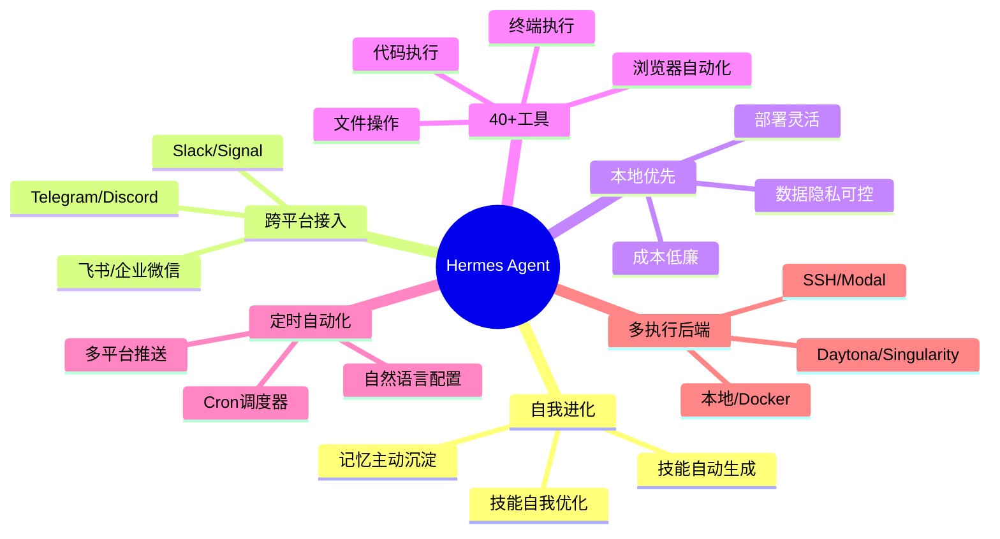

### 1.3 技术栈概览

| 技术指标 | 详情 |
|---------|------|
| 开发语言 | Python (90%), TeX (5.5%), BibTeX (2%), Shell (0.8%) |
| 当前版本 | v0.2.0 (2026.3.12) |
| GitHub Stars | 7.7k+ |
| 贡献者 | 105+ |
| 代码提交 | 1,968+ |
| 开源协议 | MIT |
| 支持系统 | Linux, macOS, WSL2 |

---

## 2. 技术架构解析

### 2.1 整体架构设计

Hermes Agent 采用模块化设计思想，将复杂的 Agent 功能分解为多个协同工作的组件。以下是系统架构的全景视图：

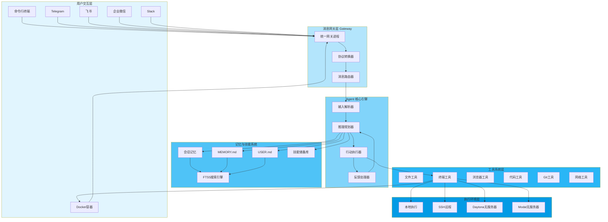

### 2.2 核心组件详解

**消息网关层（Gateway Layer）**

消息网关是 Hermes Agent 实现跨平台统一接入的关键组件。它采用单进程多连接的设计架构，一个网关进程可以同时维护与多个消息平台的连接，用户通过任何平台发送的消息都会路由到同一个 Agent 实例处理。

网关负责协议转换和数据格式化。不同平台（如 Telegram、Discord、飞书）使用不同的消息协议和数据格式，网关将这些差异抽象为统一的内部消息格式。这种设计使 Agent 核心只需处理标准化后的消息，无需关心具体平台的实现细节。

**Agent 核心引擎（Core Engine）**

Agent 核心遵循感知-推理-执行-反馈的经典循环，但融入了独特的自进化机制。输入解析器负责对话压缩、意图识别和上下文注入；推理规划器利用 LLM 能力分析任务并制定执行策略；行动执行器负责工具调用和命令执行；反馈处理器评估执行结果并决定后续行动。

**记忆与技能系统（Memory & Skills）**

这是 Hermes Agent 区别于传统 Agent 的核心创新所在。记忆系统采用三层架构：会话记忆记录当前对话上下文；MEMORY.md 存储环境事实和技术知识；USER.md 记录用户偏好。技能系统则管理和执行 Agent 从经验中学习到的最佳实践。

**工具系统（Tool System）**

工具系统包含超过40种内置工具，涵盖文件操作、终端执行、网页浏览、代码执行、Git 操作、网络搜索、视觉识别、语音合成等。工具采用注册机制，支持动态添加或移除。

**执行环境层（Execution Environment）**

支持六种终端执行后端：本地执行提供最直接的命令执行能力；Docker 容器化执行确保任务隔离；SSH 远程执行允许在远程服务器运行；Daytona 和 Modal 提供无服务器计算能力；Singularity 则面向高性能计算场景。

### 2.3 项目目录结构

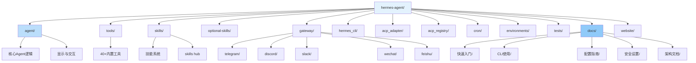

---

## 3. 工作原理与机制

### 3.1 Agent 执行循环详解

Hermes Agent 的核心运行逻辑遵循经典的感知-决策-执行循环，但融入了独特的自进化机制。以下是每次处理用户输入时的工作流程：

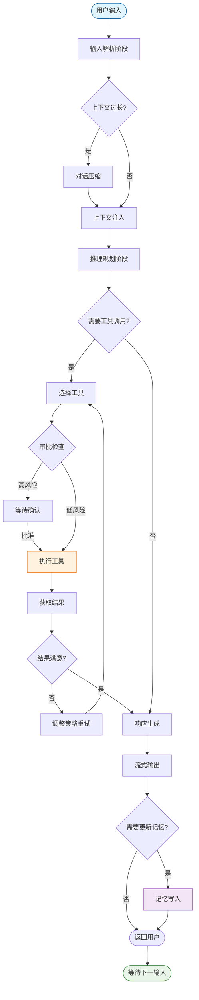

**第一阶段：输入解析**

系统对用户输入进行预处理，包括对话压缩（当上下文过长时自动压缩历史信息以节省令牌）、意图识别和上下文注入。上下文注入是一个关键步骤，Agent 会将 MEMORY.md 和 USER.md 的内容作为系统提示词的一部分注入到当前会话中。

**第二阶段：推理规划**

Agent 利用底层 LLM 的推理能力分析当前任务，制定执行策略。如果任务涉及多步骤操作，Agent 会将任务分解为有序的子任务序列。对于熟悉的操作类型，Agent 会尝试加载已有的技能文件以获取最佳实践指导。

**第三阶段：工具调用**

根据规划策略，Agent 决定是否需要调用外部工具以及调用哪些工具。工具调用采用 RPC 机制，通过标准化接口执行具体的操作命令。每次工具调用后，Agent 会获得执行结果作为反馈信息。

**第四阶段：响应生成**

结合工具执行结果和 LLM 的生成能力，Agent 产生最终响应并返回给用户。响应以流式方式实时输出，用户可以即时看到 Agent 的思考过程和生成内容。

### 3.2 分层记忆系统

Hermes Agent 的记忆系统是其最具创新性的组件之一，采用分层架构设计以平衡性能、容量和可维护性。

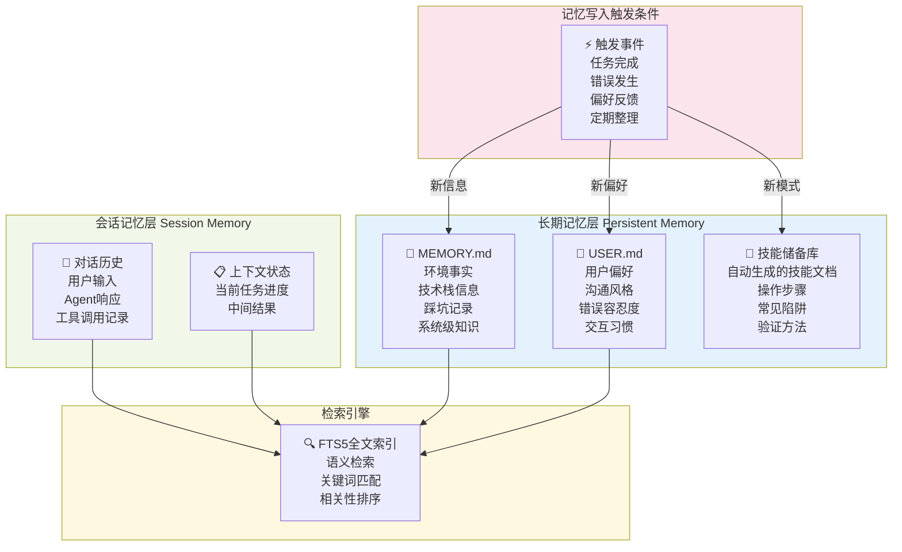

**会话记忆层**：负责记录当前会话的完整上下文。采用 FTS5 全文索引技术，支持高效的语义检索。

**持久记忆层**：MEMORY.md 存储环境事实、技术栈信息和踩坑记录；USER.md 记录用户的沟通风格偏好、技术栈倾向和交互习惯。两个文件都采用 Markdown 格式。

**技能储备层**：存储 Agent 从经验中学习到的结构化技能文档，侧重于“最佳实践”的抽象和复用。

### 3.3 技能自进化机制

技能自动生成是 Hermes Agent 学习循环的核心环节。当 Agent 判断某个任务值得创建技能时，它会在后台进行分析，提取任务的关键步骤、识别关键决策点、总结常见陷阱和注意事项。

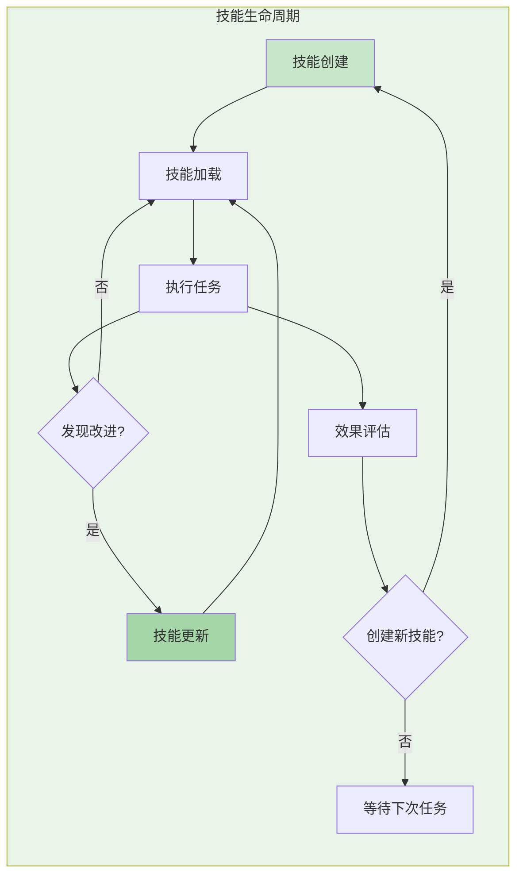

### 3.4 工具系统架构

工具系统采用注册中心模式进行管理，系统启动时会扫描预定义的工具目录，将可用的工具注册到工具注册中心。

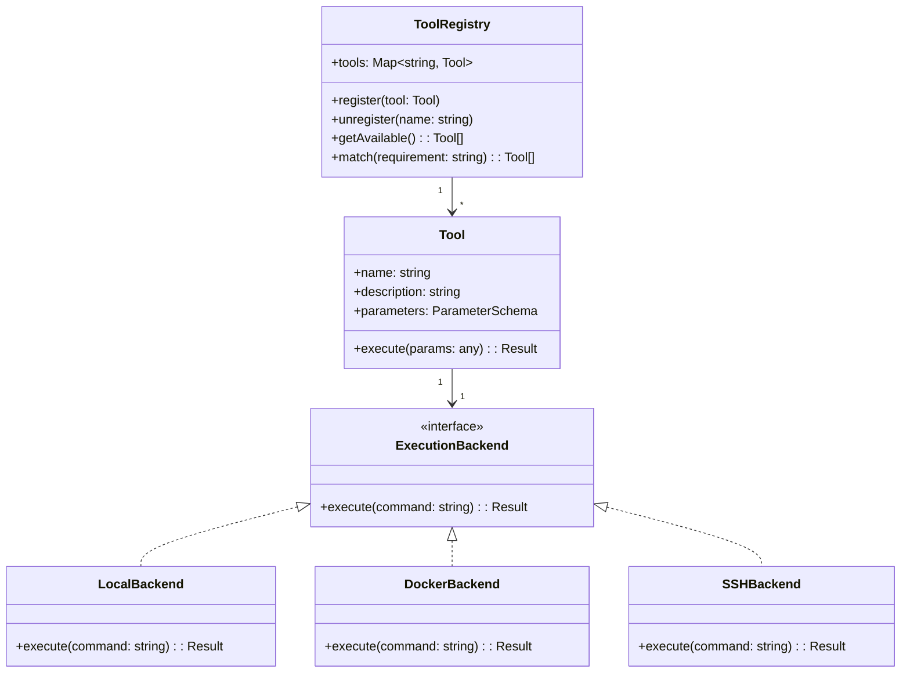

---

## 4. 与传统AI Agent对比

### 4.1 核心差异对比

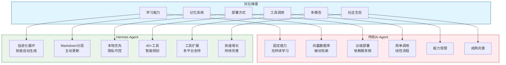

### 4.2 详细对比表

| 特性维度 | 传统AI Agent | Hermes Agent | 差异说明 |
|---------|-------------|--------------|---------|
| 学习模式 | 一次性训练 | 持续终身学习 | Hermes Agent通过技能系统实现真正的持续学习 |
| 记忆方式 | 外部向量数据库 | 精简Markdown文件 | Hermes Agent的设计更轻量、可读性更强 |
| 记忆更新 | 被动检索 | 主动沉淀 | Hermes Agent会根据使用自动优化记忆 |
| 部署模式 | 云端服务 | 本地优先 | Hermes Agent数据不出用户服务器 |
| 工具能力 | 简单线性调用 | 40+工具+智能规划 | Hermes Agent工具生态更丰富 |
| 技能管理 | 人工编写 | 自动生成+自优化 | Hermes Agent降低技能维护成本 |
| 跨平台 | 各平台独立 | 统一网关+会话同步 | Hermes Agent用户体验更一致 |
| 成本结构 | API调用费用 | 部署成本可控 | Hermes Agent长期成本更低 |

### 4.3 适用场景分析

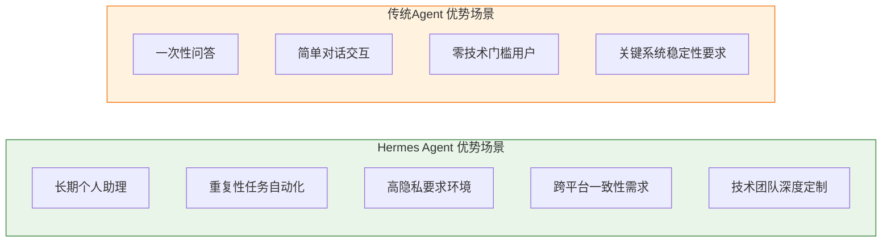

---

## 5. 局限性分析

### 5.1 技术层面局限

**记忆系统可扩展性瓶颈**

MEMORY.md 和 USER.md 作为核心记忆载体，在早期阶段表现出高效和轻量的优势，但随着使用时间的增长可能面临可扩展性挑战。当前版本尚未实现记忆内容的自动分层和淘汰机制。

**技能生成质量控制**

自动生成的技能文档质量高度依赖底层 LLM 能力，用户缺乏有效方法验证技能准确性，可能导致错误信息被错误固化。

**对底层 LLM 的强依赖**

Agent 的能力上限受限于所选模型的性能表现，无法从根本上突破现有 LLM 的能力边界。

### 5.2 部署运维局限

**本地部署技术门槛**

本地部署对用户技术能力要求较高，需要处理服务器配置、网络设置、安全防护等一系列技术问题。

**持续运维成本**

项目处于活跃开发状态，需要频繁进行版本升级，可能与稳定性优先的运维策略产生冲突。

### 5.3 安全合规局限

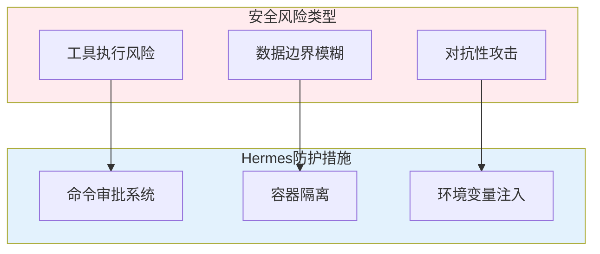

---

## 6. 技能与记忆跨机器迁移

### 6.1 数据存储结构

Hermes Agent 将所有用户数据集中存储在 `~/.hermes/` 目录下，这种集中式存储极大简化了迁移操作。

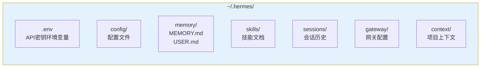

### 6.2 全量迁移流程

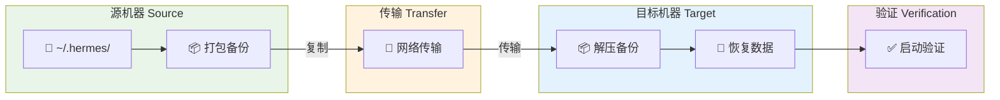

### 6.3 操作命令汇总

```bash
# 1. 源机器打包
tar -czvf hermes_backup.tar.gz ~/.hermes/ --exclude='*.log'

# 2. 复制到目标机器
scp hermes_backup.tar.gz user@target:/home/user/

# 3. 目标机器解压
tar -xzvf hermes_backup.tar.gz -C ~/

# 4. 启动验证
hermes doctor
```

### 6.4 选择性迁移

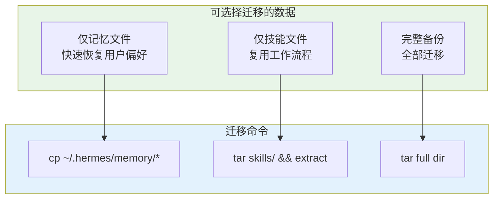

---

## 7. 飞书与企业微信接入

### 7.1 支持的通讯平台

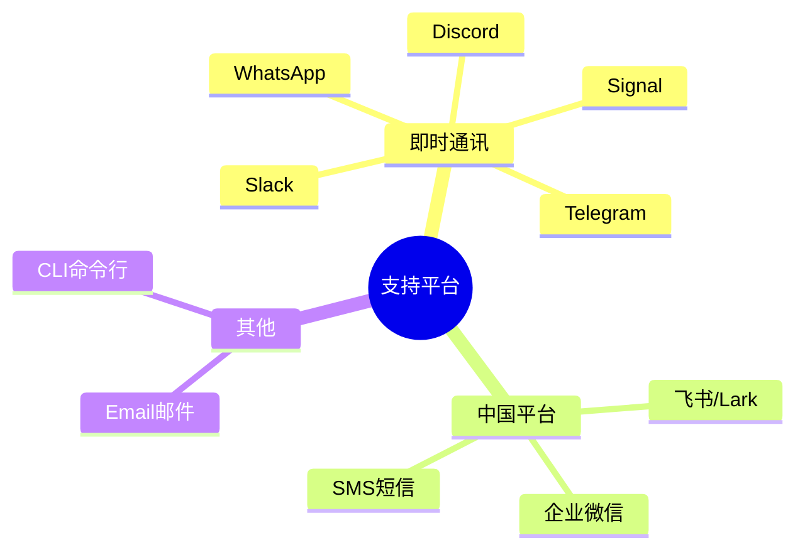

### 7.2 飞书接入配置

**前置准备**

1. 在飞书开放平台创建企业自建应用
2. 获取 App ID 和 App Secret
3. 启用机器人能力
4. 配置事件订阅

**配置步骤**

```bash
# 配置飞书凭证
hermes config set FEISHU_APP_ID <your-app-id>
hermes config set FEISHU_APP_SECRET <your-app-secret>

# 启动网关
hermes gateway --platforms feishu,telegram
```

### 7.3 功能特点

| 功能 | 说明 |
|-----|------|
| 单聊模式 | 私聊对话，跨会话记忆 |
| 群组模式 | @机器人触发，支持关键词规则 |
| 会话同步 | 与其他平台共享Agent会话状态 |
| 语音支持 | 语音消息转文字处理 |

---

## 8. 内网穿透配置

### 8.1 为什么需要内网穿透

消息网关需要接收来自外部平台（如飞书、Telegram）的Webhook回调。当Hermes Agent部署在内网环境时，需要内网穿透技术将服务暴露给外部访问。

### 8.2 主流方案对比

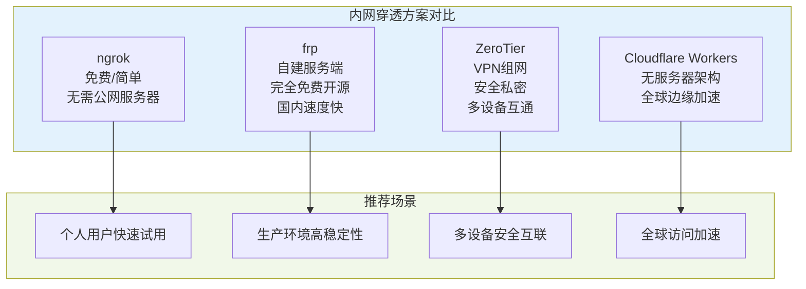

### 8.3 ngrok 配置示例

```bash
# 1. 安装ngrok
wget https://bin.equinox.io/c/4VmDzA7iaHb/ngrok-stable-linux-amd64.tgz
tar -xzvf ngrok-stable-linux-amd64.tgz
sudo mv ngrok /usr/local/bin/

# 2. 配置认证
ngrok config add-authtoken <your-token>

# 3. 启动隧道
ngrok http 8080

# 4. 配置Hermes Agent
hermes config set EXTERNAL_BASE_URL https://abc123.ngrok-free.app
```

### 8.4 frp 配置示例

**服务端（frps）配置**

```toml
[common]
bind_port = 7000
vhost_http_port = 8080
auth method = "token"
auth token = "your-secure-token"
```

**客户端（frpc）配置**

```toml
[common]
server_addr = <your-vps-ip>
server_port = 7000
auth token = "your-secure-token"

[[proxies]]
name = "hermes-http"
type = "http"
local_ip = "127.0.0.1"
local_port = 8080
custom_domains = ["hermes.example.com"]
```

### 8.5 架构对比图

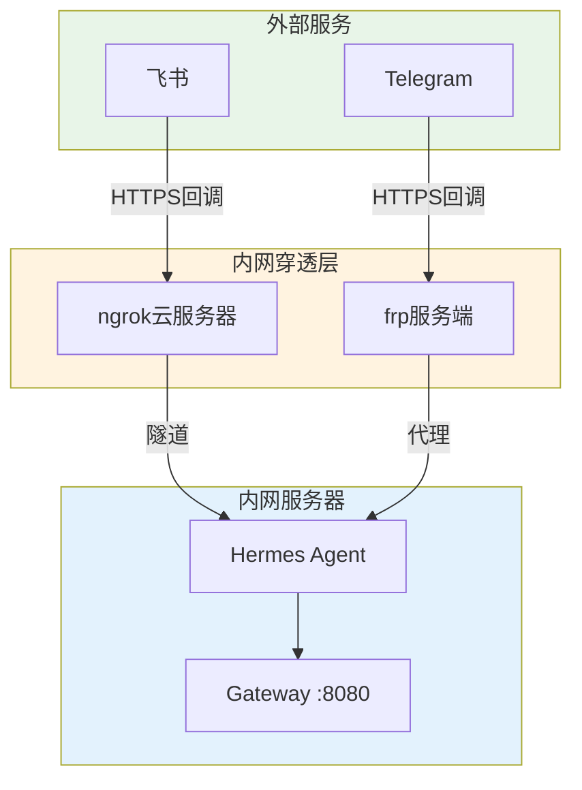

---

## 9. 总结与展望

### 9.1 核心价值总结

Hermes Agent 代表了 AI Agent 技术的重要演进方向，其核心创新体现在以下几个方面：

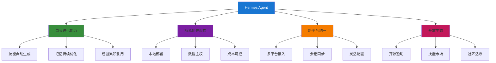

### 9.2 适用用户画像

| 用户类型 | 推荐指数 | 适用原因 |
|---------|---------|---------|
| 开发者用户 | ⭐⭐⭐⭐⭐ | 技术能力强，可充分利用定制化能力 |
| 隐私敏感用户 | ⭐⭐⭐⭐⭐ | 数据本地存储，隐私完全可控 |
| 技术爱好者 | ⭐⭐⭐⭐ | 享受探索和配置的乐趣 |
| 普通用户 | ⭐⭐⭐ | 需要一定技术基础，但配置已大幅简化 |
| 企业用户 | ⭐⭐⭐⭐ | 需评估运维成本和商业支持需求 |

### 9.3 未来发展方向

根据项目发展轨迹和社区反馈，以下方向值得关注：

- 记忆系统智能分层和自动淘汰机制
- 技能质量验证框架和可信度评级
- 更丰富的多模态能力和实时交互
- 更完善的社区生态和商业支持体系

### 9.4 快速入门命令

```bash
# 安装
curl -fsSL https://raw.githubusercontent.com/NousResearch/hermes-agent/main/scripts/install.sh | bash

# 配置模型
hermes model openai:gpt-4

# 配置工具
hermes tools

# 启动网关
hermes gateway

# 查看帮助
hermes --help
```

---

## 参考资料

1. NousResearch. Hermes Agent GitHub Repository. https://github.com/NousResearch/hermes-agent
2. Hermes Agent Official Documentation. https://hermes-agent.nousresearch.com/docs/
3. CSDN. Hermes Agent全面介绍. https://blog.csdn.net/yht874690625/article/details/160052759
4. 36氪. Hermes Agent深度解析. https://www.36kr.com/p/3759493153653253
5. 腾讯网. Nous Research联合创始人访谈. https://news.qq.com/rain/a/20260412A03JXE00

---

*本文档由 MiniMax Agent 基于 Hermes Agent 公开资料和社区讨论整理生成。*
