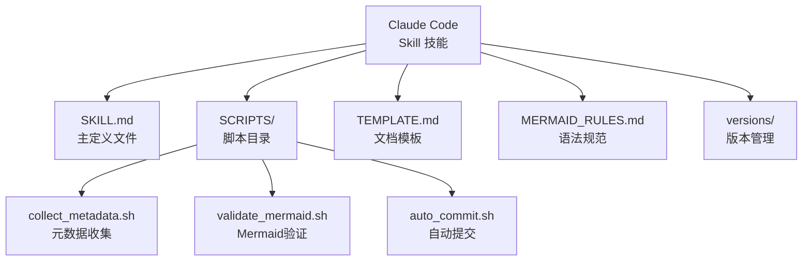
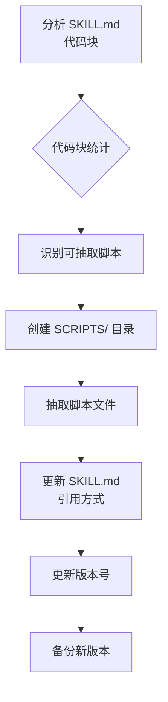
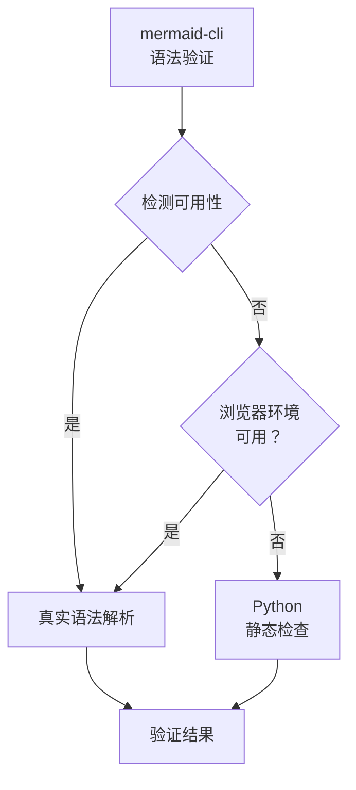
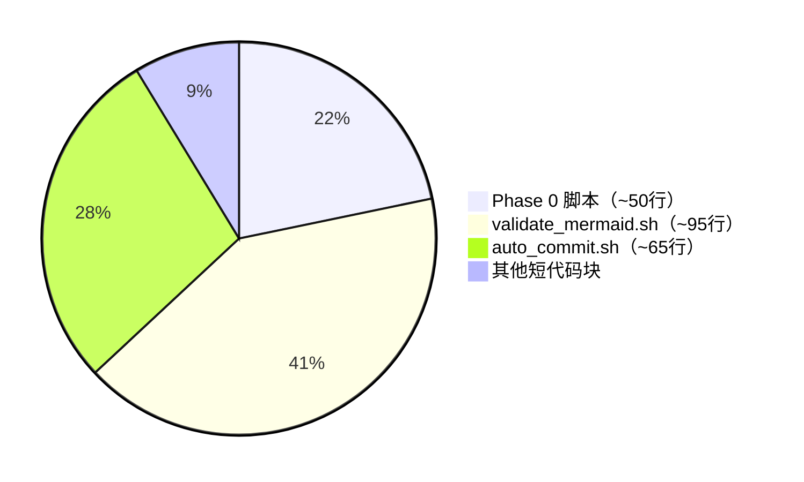

# Claude Code AI 技能 SKILL 代码模块化实践研究报告

> **研究主题：** Claude Code AI 技能 SKILL 代码模块化实践
> **日期：** 2026-04-25
> **预计耗时：** 3.5 小时（02:34 ~ 06:07，无长时间空闲）
> **项目路径：** `/root/sh`
> **GitHub 地址：** git@github.com:chujun/aiubuntu1-sh.git
> **本文档链接：** https://github.com/chujun/aiubuntu1-sh/blob/main/doc/ai-share/2026-04-25-ClaudeCodeAISKILL%E4%BB%A3%E7%A0%81%E6%A8%A1%E5%9D%97%E5%8C%96%E5%AE%9E%E8%B7%B5%E7%A0%94%E7%A9%B6%E6%8A%A5%E5%91%8A.md

---

## 目录

- [一、研究概述](#一研究概述)
- [二、工作原理](#二工作原理)
- [三、核心概念](#三核心概念)
- [四、应用场景](#四应用场景)
- [五、命令参考](#五命令参考)
- [六、注意事项](#六注意事项)
- [七、实战案例](#七实战案例)
- [八、相关工具对比](#八相关工具对比)
- [九、用户提示词清单](#九用户提示词清单)
- [十、难点与挑战](#十难点与挑战)
- [十一、经验总结](#十一经验总结)

---

## 一、研究概述

### 1.1 研究背景

Claude Code 技能（Skill）的核心文件 `SKILL.md` 随功能增强而不断膨胀，内嵌大量代码块导致：
- 文件过大难以阅读和维护
- 脚本逻辑无法独立测试
- 相同脚本在多个技能中重复存在

### 1.2 研究目标

将 `SKILL.md` 中的长代码块抽取为独立脚本文件，实现：
- 主文件精简，提升可维护性
- 脚本可独立运行测试
- 模块化结构便于复用

### 1.3 版本信息

| 技能 | 优化前版本 | 优化后版本 | SKILL.md 行数变化 |
|------|-----------|-----------|------------------|
| my-explore-doc-record | v1.11.0 | v1.12.0 | 883 → 677（-23%） |
| my-share-doc-record | v1.2.0 | v1.3.0 | 572 → 396（-31%） |

---

## 二、工作原理

### 2.1 技能文件结构



### 2.2 抽取流程



### 2.3 mermaid-cli 降级机制



---

## 三、核心概念

| 概念 | 说明 |
|------|------|
| SKILL.md | Claude Code 技能的核心定义文件，包含 frontmatter 元数据和使用说明 |
| SCRIPTS/ | 存放抽取后的独立脚本文件的目录 |
| mermaid-cli | Mermaid 图表的命令行语法验证工具 |
| Python 静态检查 | 当 mermaid-cli 不可用时的降级验证方案 |
| 双目录机制 | 原始文档在统一项目，触发跳转页在当前项目 |

---

## 四、应用场景

### 4.1 适用场景

| 场景 | 适用性 | 说明 |
|------|--------|------|
| SKILL.md 膨胀 | ✅ 适合 | 代码块多、文件过大时抽取 |
| 脚本需独立测试 | ✅ 适合 | 抽取后可直接运行验证 |
| 多技能脚本复用 | ✅ 适合 | 共用验证脚本、提交脚本 |
| mermaid-cli 不可用 | ✅ 适合 | 自动降级到 Python 检查 |

### 4.2 抽取判定标准



> 判定依据：行数超过 40 行的代码块优先抽取

---

## 五、命令参考

### 5.1 脚本执行命令

| 命令 | 说明 |
|------|------|
| `bash SCRIPTS/collect_metadata.sh` | Phase 0 元数据收集 |
| `python3 SCRIPTS/validate_mermaid.sh <文件>` | Mermaid 语法验证 |
| `bash SCRIPTS/auto_commit.sh <项目路径> <标题>` | 自动提交到 GitHub |

### 5.2 验证命令

| 命令 | 说明 |
|------|------|
| `wc -l SKILL.md` | 统计文件行数 |
| `grep -n '```' SKILL.md` | 定位代码块位置 |

---

## 六、注意事项

| 注意点 | 说明 | 建议 |
|--------|------|------|
| 脚本路径 | SKILL.md 引用脚本时使用相对路径 | 确保 SCRIPTS/ 目录存在 |
| 浏览器环境 | mermaid-cli 需要 puppeteer/Chrome | 不可用时自动降级 |
| 版本备份 | 修改 SKILL.md 前先备份 | 防止回滚丢失 |
| 权限设置 | 抽取的脚本需要执行权限 | `chmod +x SCRIPTS/*.sh` |

---

## 七、实战案例

### 案例：mermaid-cli 浏览器环境不可用问题解决

**问题：** mermaid-cli 安装成功但运行时提示 `Failed to launch the browser process!`

**分析：**
```
npx @mermaid-js/mermaid-cli --version  # 返回 11.12.0，说明 CLI 可用
# 但实际验证图表时失败
```

**解决：** 增加浏览器可用性检测，探测失败时自动切换 Python 静态检查

**关键代码：**
```python
# 浏览器可用性检测（创建测试图表）
if use_mmdc:
    test_mmd = "graph TD\n    A[Test] --> B[OK]"
    with tempfile.NamedTemporaryFile(mode='w', suffix='.mmd', delete=False) as tmp:
        tmp.write(test_mmd)
    # 尝试渲染，失败则切换
```

**结果：** 验证脚本在浏览器不可用时自动降级，验证通过

---

## 八、相关工具对比

| 工具 | 优点 | 缺点 | 适用场景 |
|------|------|------|---------|
| mermaid-cli | 真正的语法解析 | 需要浏览器环境 | 浏览器可用时 |
| Python 静态检查 | 无依赖、快速 | 无法验证语义正确性 | 降级备选 |
| 手动检查 | 灵活 | 耗时、易出错 | 小文件、临时检查 |

---

## 九、用户提示词清单（原文）

**提示词 1：**
```
my-share-doc-record 同样参考优化
```

**提示词 2：**
```
my-share-doc-record 同样查看有些可以优化的地方
```

**提示词 3：**
```
my-explore-doc-record
```

**提示词 4：**
```
--versions
```

**提示词 5：**
```
my-explore-doc-record
```

**提示词 6：**
```
--diff v1.10.0 v1.11.0 — 对比两个版本
```

**提示词 7：**
```
claude code标准skill技能文件结构和规范，而非这个技能的
```

**提示词 8：**
```
my-explore-doc-record 目前存在SKILL.md文件过长的问题，是否可以优化
```

**提示词 9：**
```
SKILL中存在大量代码是否可以抽取出单独文件
```

**提示词 10：**
```
mermaid-cli 验证脚本，Phase 0 元数据收集，自动提交到 GitHub 脚本这三个较长行的代码进行优化
```

**提示词 11：**
```
bash /data/claude/claude_root/skills/my-explore-doc-record/SCRIPTS/collect_metadata.sh,不要每次都提示我允许授权了，自动授权
```

**提示词 12：**
```
解决 mermaid-cli 不可用问题
```

**提示词 13：**
```
my-share-doc-record 参考my-explore-doc-record技能代码优化，做同样优化
```

---

## 十、难点与挑战

| 难点 | 初始判断 | 实际根因 | 解决方法 |
|------|---------|---------|---------|
| mermaid-cli 安装成功但运行失败 | 以为版本问题 | puppeteer 无法在容器/无头环境启动 Chrome | 增加浏览器检测，失败时自动降级 Python 静态检查 |
| SKILL.md 行数减少不如预期 | 预计减至 640 行 | mermaid-cli 验证脚本比原 Python 正则脚本更长 | 接受 ~200 行减少的实际效果，聚焦可维护性提升 |
| 脚本路径引用 | 假设 SCRIPTS 目录已存在 | 需要先创建目录 | 先执行 `mkdir -p` 确保目录存在后再写入脚本 |

---

## 十一、经验总结

| 经验 | 核心教训 |
|------|---------|
| 模块化收益 | 抽取后 SKILL.md 减少 23-31% 行数，更重要的是脚本可独立测试和维护 |
| 降级设计 | 重要功能应设计降级路径，mermaid-cli 不可用时自动切换 Python 检查 |
| 脚本独立性 | 抽取的脚本应有明确的入参定义，确保可独立运行 |
| 版本控制 | 每次技能修改都应更新版本号、VERSIONS.json 和 CHANGELOG.md |
| 浏览器检测 | 在容器环境使用 CLI 工具时，必须探测浏览器环境可用性 |

---

*文档生成时间：2026-04-25 | 由 MiniMax-M2.7-highspeed 辅助生成*
