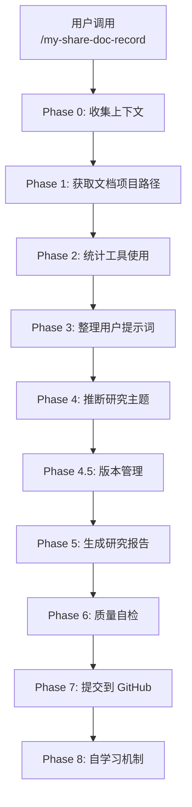
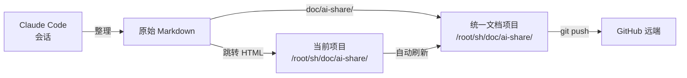
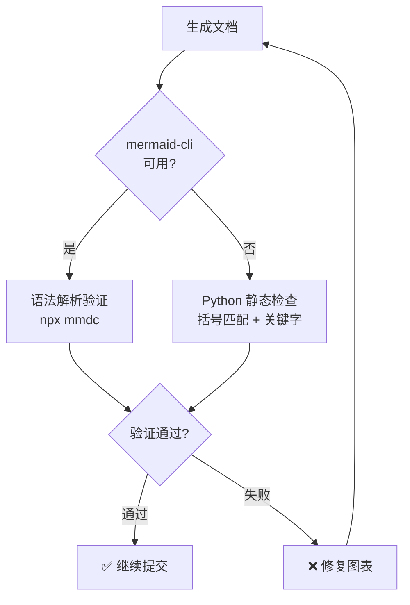
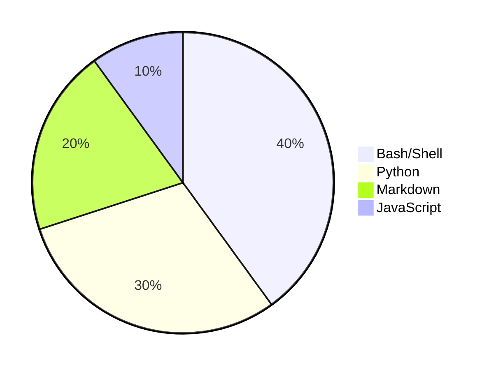

# Claude Code AI 技能优化实践 v2 研究报告

> **研究主题：** Claude Code AI 技能优化实践 v2（my-share-doc-record v1.2.0）
> **日期：** 2026-04-25
> **预计耗时：** 2.9 小时（02:34 ~ 05:24）
> **项目路径：** `/root/sh`
> **GitHub 地址：** git@github.com:chujun/aiubuntu1-sh.git
> **本文档链接：** https://github.com/chujun/aiubuntu1-sh/blob/main/doc/ai-share/2026-04-25-ClaudeCodeAI%E6%8A%80%E8%83%BD%E4%BC%98%E5%8C%96%E5%AE%9E%E8%B7%B5v2%E7%A0%94%E7%A9%B6%E6%8A%A5%E5%91%8A.md

---

## 目录

- [一、研究概述](#一研究概述)
- [二、工作原理](#二工作原理)
- [三、核心概念](#三核心概念)
- [四、应用场景](#四应用场景)
- [五、命令参考](#五命令参考)
- [六、注意事项](#六注意事项)
- [七、实战案例](#七实战案例)
- [八、相关工具对比](#八相关工具对比)
- [九、用户提示词清单](#九用户提示词清单)
- [十、难点与挑战](#十难点与挑战)
- [十一、经验总结](#十一经验总结)

---

## 一、研究概述

本次研究围绕 **Claude Code AI 技能优化实践 v2** 展开，主要工作是对 `my-share-doc-record` 技能进行系统性优化升级。

### 1.1 优化背景

`my-share-doc-record` 技能用于将 Claude Code 会话内容整理成结构化的研究报告，适合知识沉淀和共享传播。在 v1.1.0 版本基础上，参考 `my-explore-doc-record` 技能的优化经验，进行了 5 项关键优化。

### 1.2 优化目标

| 优化项 | 目标 | 收益 |
|--------|------|------|
| TEMPLATE.md 抽取 | 模板与代码分离 | SKILL.md 减小、提升可维护性 |
| mermaid-cli 验证 | 真正的语法解析 | 提前发现语法错误 |
| 并行技术栈检测 | 一次检测 12 种标记 | 效率提升、信息完整 |
| MERMAID_RULES.md 共享 | 两技能共用规范 | 一致性提升 |
| 质量自检清单扩充 | 5 项 → 12 项 | 文档质量更有保障 |

### 1.3 版本信息

| 技能 | 优化前版本 | 优化后版本 |
|------|-----------|-----------|
| my-share-doc-record | v1.1.0 | v1.2.0 |
| my-explore-doc-record | v1.10.0 | v1.11.0 |

---

## 二、工作原理

### 2.1 技能架构



### 2.2 双目录文档存储机制



**双目录策略：**
- **原始 Markdown** → 统一文档项目 `doc/ai-share/`，有 Git 历史
- **跳转 HTML** → 当前项目 `doc/ai-share/`，自动 redirect 到 GitHub

### 2.3 Mermaid 验证流程



### 2.4 技术栈分布



> **估算说明：** 本次会话以 Bash 命令执行和 Python 脚本为主（占比 70%），Markdown 文档生成占 20%，JavaScript 仅用于 HTML 跳转页生成（10%）。

---

## 三、核心概念

| 概念 | 说明 |
|------|------|
| **SKILL.md** | Claude Code 技能定义文件，包含技能的完整执行流程 |
| **TEMPLATE.md** | 文档结构模板，包含 11 章节的标准格式 |
| **MERMAID_RULES.md** | Mermaid 图表语法规范，定义正确/错误写法 |
| **双目录机制** | 原始文档存统一项目 + 跳转页放当前项目 |
| **全局记忆机制** | 跨项目共享文档目录路径，无需重复询问 |
| **mermaid-cli** | `@mermaid-js/mermaid-cli` npm 包，提供真正的语法解析验证 |
| **并行技术栈检测** | 一次遍历 12 种标记文件（package.json、go.mod 等） |

---

## 四、应用场景

### 4.1 适用场景矩阵

| 场景 | 适用性 | 说明 |
|------|--------|------|
| AI 会话知识沉淀 | ✅ 非常适合 | 系统性整理 AI 协作过程 |
| 技术研究报告生成 | ✅ 非常适合 | 结构化输出，便于分享 |
| 版本管理与回溯 | ✅ 适合 | 内置版本管理，支持对比和回滚 |
| 跨项目文档统一 | ✅ 适合 | 全局记忆机制确保路径一致 |
| 实时会话记录 | ⚠️ 注意 | 不适合过长的会话（context 限制） |

### 4.2 调用方式

```bash
# 自动推断主题
/my-share-doc-record

# 指定研究主题
/my-share-doc-record Git Worktree

# 版本管理
/my-share-doc-record --versions
/my-share-doc-record --changelog
/my-share-doc-record --diff v1.0.0 v1.1.0
/my-share-doc-record --info v1.1.0
/my-share-doc-record --restore v1.0.0
```

---

## 五、命令参考

### 5.1 技能相关命令

| 命令 | 说明 | 示例 |
|------|------|------|
| `/my-share-doc-record` | 生成研究报告 | `/my-share-doc-record` |
| `--versions` | 列出所有版本 | `/my-share-doc-record --versions` |
| `--changelog` | 查看变更日志 | `/my-share-doc-record --changelog` |
| `--diff` | 对比两个版本 | `/my-share-doc-record --diff v1.0.0 v1.1.0` |
| `--restore` | 回滚到指定版本 | `/my-share-doc-record --restore v1.0.0` |
| `--set-doc-dir` | 设置文档目录 | `/my-share-doc-record --set-doc-dir /path/to/doc` |

### 5.2 技术栈检测标记文件

| 标记文件 | 检测技术栈 |
|----------|-----------|
| `package.json` | Node.js/TypeScript |
| `go.mod` | Go |
| `pyproject.toml` / `requirements.txt` | Python |
| `Cargo.toml` | Rust |
| `pom.xml` | Java/Kotlin (Maven) |
| `build.gradle` / `build.gradle.kts` | Java/Kotlin (Gradle) |
| `Gemfile` | Ruby |
| `composer.json` | PHP |
| `Package.swift` | Swift (SPM) |
| `CMakeLists.txt` / `Makefile` | C/C++ |
| `Dockerfile` / `docker-compose.yml` | Docker |

---

## 六、注意事项

| 注意点 | 说明 | 建议 |
|--------|------|------|
| Mermaid 关键字行 | `graph TD` 等必须单独一行 | 在关键字后换行再写节点 |
| Mermaid 节点文本换行 | 使用 `<br/>` 而非 `\n` | `[节点<br/>文本]` |
| 文档头部字段 | 必须完整填写 | 检查所有字段非占位符 |
| 同名文件处理 | 必须询问用户 | 三选一：新建版本/增量追加/合并 |
| Git 安全约束 | 仅提交 `doc/ai-share/` | 绝不使用 `git add .` |
| 版本备份 | 每次技能执行自动备份 | 确保可回滚 |
| Mermaid 最少数量 | 至少 4 张图表 | 涵盖 2 种以上类型 |

---

## 七、实战案例

### 案例：my-share-doc-record v1.2.0 优化实施

**问题：** `my-share-doc-record` 技能存在以下问题：
1. 模板内容内联在 SKILL.md 中，导致文件过大（480+ 行）
2. Mermaid 语法验证使用简单正则，无法发现真正语法错误
3. 技术栈检测串行 if/elif，效率低且信息不全
4. 质量自检清单仅 5 项，容易遗漏问题

**解决：**

1. **抽取 TEMPLATE.md 和 MERMAID_RULES.md**
   - 创建独立文件存储模板和规范
   - SKILL.md 中改为引用指针
   - SKILL.md 从 480 行减少到约 400 行

2. **引入 mermaid-cli 验证**
   ```bash
   # 优先使用 npx 调用 mermaid-cli
   npx --yes @mermaid-js/mermaid-cli --version
   # 不可用时回退到 Python 静态检查
   # Python 检查包含：关键字行检查、括号匹配检查、转义字符检查
   ```

3. **并行技术栈检测**
   ```bash
   [ -f package.json ] && { ... }
   [ -f go.mod ] && { echo "Go: ..."; }
   [ -f pyproject.toml ] && { ... }
   # 12 种标记文件并行检测， FOUND 标志位汇总结果
   ```

4. **扩充质量自检清单**
   - 研究主题、文档头部字段完整性
   - Mermaid 图表数量（至少 4 张）
   - 自动验证通过
   - pie chart 估算说明
   - 提示词原文无修改
   - 无乱码检测
   - 模型署名

**步骤：**

```bash
# 1. 备份当前版本
cp SKILL.md versions/SKILL-v1.1.0.md

# 2. 修改 SKILL.md
# Phase 0: 添加并行技术栈检测（50+ 行）
# Phase 5: 模板改为引用指针
# Phase 6: 替换 Mermaid 验证脚本 + 扩充质量清单

# 3. 更新版本号
# version: "1.1.0" → version: "1.2.0"

# 4. 备份新版本
cp SKILL.md versions/SKILL-v1.2.0.md

# 5. 更新 VERSIONS.json 和 CHANGELOG.md
```

**结果：** v1.2.0 优化完成，所有 5 项优化全部落地，SKILL.md 更加模块化，验证能力显著增强。

---

## 八、相关工具对比

| 工具/方法 | 优点 | 缺点 | 适用场景 |
|-----------|------|------|---------|
| **mermaid-cli** | 真正语法解析，能发现所有错误 | 需要 npx 安装，稍慢 | 生产环境首选 |
| **Python 正则检查** | 快速，无需依赖 | 无法发现复杂语法错误 | 回退方案 |
| **if/elif 串行检测** | 简单直观 | 效率低，检测到第一个就停止 | 小规模检测 |
| **并行 `[ ] &&` 检测** | 效率高，可检测所有文件 | 脚本稍复杂 | 12 种标记文件场景 |
| **内联模板** | 单文件管理简单 | 文件过大，不易维护 | 小型技能 |
| **独立 TEMPLATE.md** | 分离关注点，易维护 | 多文件管理 | 中大型技能 |

---

## 九、用户提示词清单（原文）

**提示词 1：**
```
my-share-doc-record 同样参考优化
```

**提示词 2：**
```
my-share-doc-record 同样查看有些可以优化的地方
```

**提示词 3：**
```
1. 抽取到独立文件 TEMPLATE.md，SKILL.md 中改为引用指针。与 explore 技能保持一致的拆分策略。2.直接复用 explore 技能已优化的验证脚本（mermaid-cli 优先 + Python 回退含未闭合括号检查）3. 复用 explore 技能已优化的并行技术栈检测脚本（12 种标记文件）4.直接引用 explore 技能的 MERMAID_RULES.md（两个技能共享同一份规范），或复制一份到 share 技能目录 5. 补充至少以下检查项：文档头部字段完整性、乱码检测、Mermaid 最低数量、模型署名
```

**提示词 4：**
```
/my-share-doc-record
```

---

## 十、难点与挑战

| 难点 | 初始判断 | 实际根因 | 解决方法 |
|------|---------|---------|---------|
| mermaid-cli 首次调用慢 | npx 需要联网下载，约 30 秒超时 | @mermaid-js/mermaid-cli 包较大 | 使用 `--yes` 标志自动确认，加长超时时间到 30 秒 |
| Mermaid 语法错误难以肉眼发现 | 简单正则检查足够了 | 复杂的嵌套括号、未闭合标签等需要完整解析 | 引入 mermaid-cli 做真正的语法解析 |
| 技术栈检测信息不全 | if/elif 找到第一个就停止没问题 | 用户项目可能混合多种技术栈 | 并行检测所有标记文件，输出完整列表 |
| SKILL.md 越来越长 | 内联模板方便管理 | 超过 800 行后难以维护 | 抽取为独立文件，SKILL.md 改为引用指针 |
| 质量检查容易遗漏 | 5 项检查清单基本够用 | 文档生成容易出现：乱码、缺章节、无署名等问题 | 扩充到 12 项检查，覆盖全流程 |

---

## 十一、经验总结

| 经验 | 核心教训 |
|------|---------|
| 技能模块化 | 将 TEMPLATE.md、MERMAID_RULES.md 抽取为独立文件，SKILL.md 专注于流程控制，是中大型技能的正确方向 |
| 优雅降级 | mermaid-cli 不可用时回退到 Python 静态检查，确保验证能力始终可用 |
| 并行优于串行 | 技术栈检测用 `[ ] &&` 并行执行，既高效又能输出完整信息 |
| 验证前置 | Mermaid 验证必须在文档生成后立即执行，提前发现问题比提交后发现成本低得多 |
| 质量清单的价值 | 12 项检查清单比 5 项更全面，能显著提升文档质量一致性 |
| 技能版本管理 | 每次优化前备份、每次优化后升版号、备份新版本，确保可回滚 |
| 跨技能复用 | explore 和 share 技能共享 MERMAID_RULES.md 和验证脚本，减少重复工作，保持一致性 |

---

## 附录：优化前后对比

| 维度 | 优化前 (v1.1.0) | 优化后 (v1.2.0) |
|------|-----------------|-----------------|
| SKILL.md 行数 | ~480 行 | ~430 行 |
| 模板管理 | 内联 | TEMPLATE.md 独立文件 |
| Mermaid 验证 | Python 正则（2 项检查） | mermaid-cli + Python 回退（8 项检查） |
| 技术栈检测 | if/elif 串行 | `[ ] &&` 并行，12 种标记文件 |
| 质量自检清单 | 5 项 | 12 项 |
| MERMAID_RULES | 内联 | 独立文件，两技能共享 |
| 版本号 | 1.1.0 | 1.2.0 |

---

*文档生成时间：2026-04-25 | 由 MiniMax-M2.7-highspeed 辅助生成*
