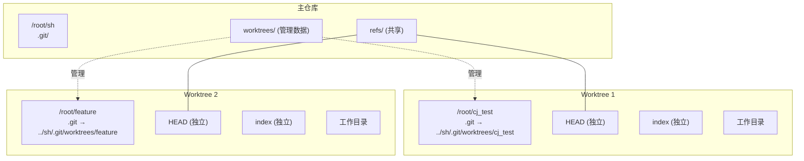
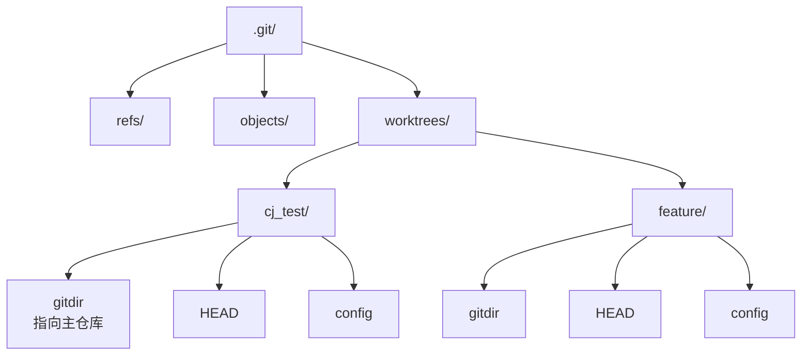
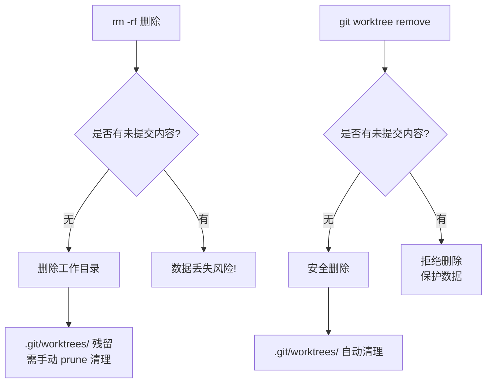

# Git Worktree 研究报告

> 研究日期：2026-04-25
> 研究背景：基于 Claude Code 交互式学习

---

## 目录

1. [概述](#1-概述)
2. [核心概念](#2-核心概念)
3. [命令详解](#3-命令详解)
4. [工作原理](#4-工作原理)
5. [使用场景](#5-使用场景)
6. [冲突解决](#6-冲突解决)
7. [安全删除 vs 暴力删除](#7-安全删除-vs-暴力删除)
8. [局限性](#8-局限性)
9. [实战工作流](#9-实战工作流)
10. [命令速查表](#10-命令速查表)

---

## 1. 概述

Git Worktree 是 Git 2.5 引入的功能，允许在**同一个仓库**中同时检出**多个分支**到不同目录。

### 解决的问题

| 痛点 | 传统方式 | Worktree 方式 |
|------|---------|---------------|
| 同时开发多个功能 | 反复切换分支/ stash | 每个功能一个目录 |
| 紧急修复打断开发 | stash 暂存，可能丢东西 | 开新 worktree，并行开发 |
| 查看旧版本 | rebase 或 reset | 直接 worktree 检出旧 commit |

---

## 2. 核心概念

### 架构图



### 核心特点

- **共享**：所有 worktree 共享同一个 `.git` 中的 `refs/`（分支、tag）
- **独立**：每个 worktree 有自己的 `HEAD`、`index`、工作目录
- **轻量**：不是完整克隆，而是通过符号链接共享仓库数据

---

## 3. 命令详解

### 3.1 创建 worktree

```bash
# 基础用法（目录名 = 分支名）
git worktree add ../feature

# 指定分支名
git worktree add -b new-feature ../feature

# 检出远程分支并跟踪
git worktree add -b login --track origin/login

# 游离模式（检出指定 commit，不在任何分支）
git worktree add -d ../debug abc1234
```

| 参数 | 作用 |
|------|------|
| `-b <branch>` | 创建新分支并检出 |
| `-d` | detached HEAD 模式 |
| `--track` | 跟踪远程分支 |
| `-f` / `--force` | 强制创建（覆盖已有） |
| `--lock` | 创建后锁定 |

### 3.2 查看 worktree

```bash
git worktree list
```

输出示例：
```
/root/sh       d8378d3 [main]
/root/cj_test  ebddc17 [cj_test]
```

### 3.3 锁定与解锁

```bash
# 锁定（防止被 prune）
git worktree lock ../cj_test --reason "便携设备"

# 解锁
git worktree unlock ../cj_test
```

### 3.4 移动与删除

```bash
# 移动
git worktree move ../old ../new

# 安全删除（会检查未提交内容）
git worktree remove ../cj_test

# 强制删除
git worktree remove --force ../cj_test
```

### 3.5 清理

```bash
# 预览要清理的内容
git worktree prune -n

# 执行清理
git worktree prune -v
```

---

## 4. 工作原理

### 目录结构



### 关键文件

每个 linked worktree 根目录有一个 `.git` 文件（不是目录）：

```
# /root/cj_test/.git 内容
gitdir: /root/sh/.git/worktrees/cj_test
```

这使得 worktree 能找到主仓库。

---

## 5. 使用场景

### 场景矩阵

| 场景 | 推荐用法 |
|------|---------|
| 同时开发多个功能 | `git worktree add -b feature1 ../feature1` |
| 紧急 hotfix 打断开发 | `git worktree add -b hotfix ../hotfix` |
| 查看/调试旧版本 | `git worktree add -d ../v1.0 v1.0.0` |
| 保持工作区干净 | 创建临时 worktree 替代 stash |
| 跑测试同时开发 | `git worktree add ../test` |

### 典型工作流


---

## 6. 冲突解决

Worktree 内的合并操作与普通 git 操作**完全相同**。

### 合并流程

```bash
# 1. 在 worktree 中切换到目标分支
cd ../feature
git checkout feature

# 2. 合并主分支
git merge main

# 3. 如有冲突，解决后
git add .
git commit -m "resolve merge conflict"
```

### 冲突解决步骤

```bash
# 查看冲突文件
git status
git diff --name-only --diff-filter=U

# 编辑冲突标记
# <<<<<<< HEAD
# 你的代码
# =======
# 被合并的代码
# >>>>>>> main

# 标记解决
git add <file>

# 完成提交
git commit -m "merge main into feature"
```

### 跨 Worktree 操作

```bash
# 在主仓库合并 worktree 分支
git -C /root/sh merge cj_test

# 查看分支差异
git log --graph --oneline main...cj_test
```

---

## 7. 安全删除 vs 暴力删除

### 对比表格

| 方式 | 命令 | 工作目录 | 管理数据 | 安全性 |
|------|------|---------|---------|--------|
| 暴力删除 | `rm -rf /root/cj_test` | 删除 | 残留（prunable） | 低 |
| 安全删除 | `git worktree remove /root/cj_test` | 删除 | 清理 | 高 |

### 流程对比



### 结论

> **始终使用 `git worktree remove`**，除非你确定 worktree 里没有任何重要内容。

---

## 8. 局限性

### 支持情况

| 功能 | 支持情况 |
|------|---------|
| 普通仓库 | ✅ 完全支持 |
| 裸仓库 | ✅ 支持（列表显示 `bare`） |
| 子模块 | ⚠️ 不完整，不推荐 |
| 同一分支多 worktree | ❌ 不支持 |

### 约束

- **同一分支只能被一个 worktree 检出**
- 删除前确保没有未提交的更改（除非用 `--force`）
- 不要手动移动 worktree 目录，用 `git worktree move`

---

## 9. 实战工作流

### 完整示例

```bash
# 1. 创建新功能 worktree
git worktree add -b login ../login

# 2. 在新 worktree 中开发
git -C ../login add .
git -C ../login commit -m "feat: 添加登录功能"

# 3. 切换回主仓库
cd /root/sh

# 4. 合并功能分支
git merge login

# 5. 删除 worktree
git worktree remove ../login
```

### 实战场景

#### 场景 1：开发被紧急修复打断

```bash
# 当前在 feature 分支开发，被叫去修 bug
git worktree add -b hotfix ../hotfix
cd ../hotfix
# ... 修复 bug ...
git add . && git commit -m "fix: 紧急修复"
git checkout main && git merge hotfix
git worktree remove ../hotfix
# 回到原分支继续开发
```

#### 场景 2：并行开发多个功能

```bash
git worktree add -b feature-a ../feature-a
git worktree add -b feature-b ../feature-b
# 同时在两个目录工作，互不干扰
```

---

## 10. 命令速查表

### 按生命周期分类

| 阶段 | 命令 |
|------|------|
| **创建** | `git worktree add <path> [-b branch]` |
| **查看** | `git worktree list` |
| **锁定** | `git worktree lock <path>` |
| **解锁** | `git worktree unlock <path>` |
| **移动** | `git worktree move <old> <new>` |
| **删除** | `git worktree remove <path>` |
| **清理** | `git worktree prune` |

### 速记技巧

> **动作就 7 个**：add、list、lock、unlock、move、remove、prune

```
git worktree <动作> <worktree路径>
```

### 选项速查

| 选项 | 说明 |
|------|------|
| `-b <branch>` | 创建新分支 |
| `-d` | detached HEAD |
| `-f` | 强制 |
| `--track` | 跟踪远程分支 |
| `--lock` | 创建后锁定 |
| `--reason <string>` | 锁定原因 |

---

## 附录

### 环境说明

- **Shell 限制**：Claude Code 每次命令后工作目录重置，需用 `git -C <path>` 操作
- **主仓库路径**：/root/sh
- **创建示例**：/root/cj_test

### 参考资料

- `git worktree --help`
- Git 官方文档

---

*本报告由 Claude Code 生成，基于 2026-04-25 交互式学习记录*
