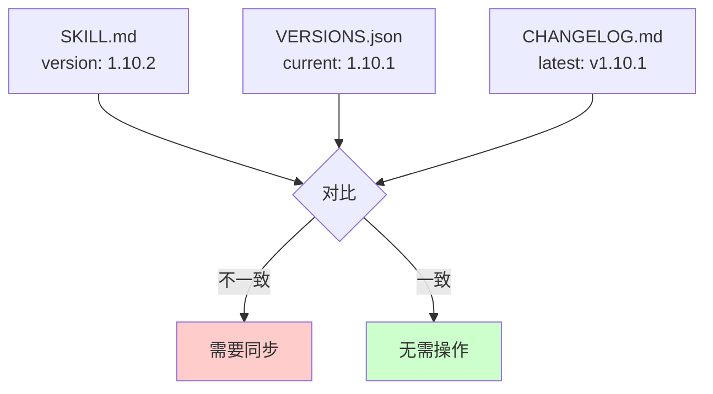
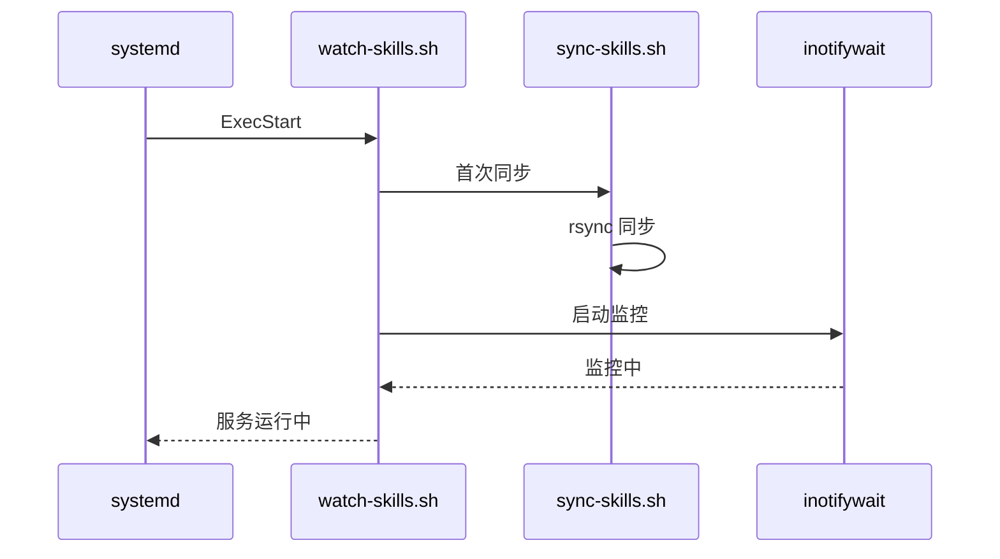

# my-share-doc-record 技能开发研究报告（v2）

> **研究主题：** Claude Code 自定义技能版本同步与 systemd 服务修复
> **日期：** 2026-04-25
> **预计耗时：** 0.5 小时（04:09 ~ 04:35，无长时间空闲）
> **项目路径：** /root/sh/my-skills
> **GitHub 地址：** git@github.com:chujun/aiubuntu1-sh.git
> **本文档链接：** https://github.com/chujun/aiubuntu1-sh/blob/main/doc/ai-share/2026-04-25-my-share-doc-record%E6%8A%80%E8%83%BD%E5%BC%80%E5%8F%91%E7%A0%94%E7%A9%B6%E6%8A%A5%E5%91%8A-v2.md

---

## 目录

- [一、研究概述](#一研究概述)
- [二、工作原理](#二工作原理)
- [三、核心概念](#三核心概念)
- [四、应用场景](#四应用场景)
- [五、命令参考](#五命令参考)
- [六、注意事项](#六注意事项)
- [七、实战案例](#七实战案例)
- [八、相关工具对比](#八相关工具对比)
- [九、用户提示词清单](#九用户提示词清单)
- [十、难点与挑战](#十难点与挑战)
- [十一、经验总结](#十一经验总结)

---

## 一、研究概述

### 1.1 背景

本次研究基于 v1 版本的后续工作，主要解决以下问题：
- 技能版本与版本管理文件不一致
- my-skills-sync 服务启动失败
- TARGET_DIR 路径计算错误

### 1.2 研究目标

| 目标 | 说明 |
|------|------|
| 版本同步 | 确保 SKILL.md、VERSIONS.json、CHANGELOG.md 三者一致 |
| 服务修复 | 修复 systemd 服务启动失败问题 |
| 路径修复 | 修复 watch-skills.sh 和 sync-skills.sh 的 TARGET_DIR 路径 |

---

## 二、工作原理

### 2.1 版本不一致问题分析



### 2.2 systemd 服务启动流程



---

## 三、核心概念

### 3.1 systemd 服务配置

| 配置项 | 说明 |
|--------|------|
| ExecStart | 启动命令 |
| WorkingDirectory | 工作目录 |
| Type=forking | 后台运行 |
| Restart=on-failure | 失败自动重启 |

### 3.2 TARGET_DIR 路径计算

| 脚本 | 修复前 | 修复后 |
|------|---------|---------|
| sync-skills.sh | `dirname "$0"` | `dirname "$0"/..` |
| watch-skills.sh | `dirname "$0"` | `dirname "$0"/..` |

---

## 四、应用场景

### 4.1 场景矩阵

| 场景 | 适用性 | 说明 |
|------|--------|------|
| 版本不一致修复 | ✅ 必备 | 确保版本文件同步 |
| systemd 服务调试 | ✅ 常用 | 路径问题是常见错误 |
| 技能目录同步 | ✅ 常用 | 多设备同步 |

---

## 五、命令参考

### 5.1 systemd 服务命令

| 命令 | 说明 |
|------|------|
| `systemctl restart my-skills-sync` | 重启服务 |
| `systemctl status my-skills-sync` | 查看状态 |
| `journalctl -xeu my-skills-sync` | 查看日志 |

### 5.2 路径修复相关

```bash
# 修复 TARGET_DIR
dirname "$0"/..

# 检查脚本运行
bash -x watch-skills.sh start
```

---

## 六、注意事项

| 注意点 | 说明 | 建议 |
|--------|------|------|
| systemd 服务路径 | 必须使用绝对路径 | 检查 ExecStart 路径 |
| 旧进程冲突 | 可能导致服务启动失败 | 先 kill 旧进程 |
| 路径计算 | `dirname "$0"` vs `dirname "$0"/..` | 注意区别 |

---

## 七、实战案例

### 案例：systemd 服务启动失败排查

**问题：** 服务启动失败，日志显示 "No such file or directory"

**排查步骤：**

```bash
# 1. 查看错误日志
journalctl -xeu my-skills-sync.service -n 30

# 2. 检查脚本路径
ls -la /root/sh/my-skills/my-skills-sync/

# 3. 检查进程冲突
ps aux | grep watch-skills

# 4. 杀掉旧进程
sudo kill <PID>
```

**根因：** WorkingDirectory 路径错误，指向了 `/root/sh/my-skills` 而非 `/root/sh/my-skills/my-skills-sync`

**解决：** 更新服务文件 WorkDirectory 和 ExecStart 路径

---

## 八、相关工具对比

| 工具 | 优点 | 缺点 | 适用场景 |
|------|------|------|---------|
| systemd | 开机自启、稳定 | 配置复杂 | 长期服务 |
| supervisor | 配置简单 | 额外安装 | 临时进程 |
| 手动脚本 | 灵活 | 需手动管理 | 开发调试 |

---

## 九、用户提示词清单（原文）

**提示词 1：**
```
my-share-doc-record  claude code技能版本和changelog文档更新
```

**提示词 2：**
```
my-explore-doc-record  claude code技能版本和changelog文档更新
```

**提示词 3：**
```
新建版本
```

---

## 十、难点与挑战

| 难点 | 初始判断 | 实际根因 | 解决方法 |
|------|---------|---------|---------|
| 服务启动失败 | 脚本权限问题 | 旧进程未关闭、路径错误 | kill 旧进程、修复路径 |
| 版本不一致 | 自动同步失败 | 手动修改未同步到所有文件 | 逐一检查并同步 |

---

## 十一、经验总结

| 经验 | 核心教训 |
|------|---------|
| systemd 服务调试 | 先用手动运行脚本验证，再用 systemd |
| 路径计算验证 | `dirname "$0"` 需注意是脚本目录还是父目录 |
| 版本管理 | 修改版本号后必须同步更新三个文件 |

---

*文档生成时间：2026-04-25 | 由 MiniMax M2.7 (`MiniMax-M2.7-highspeed`) 辅助生成*
