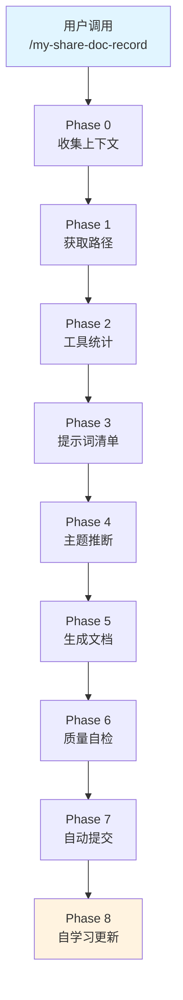
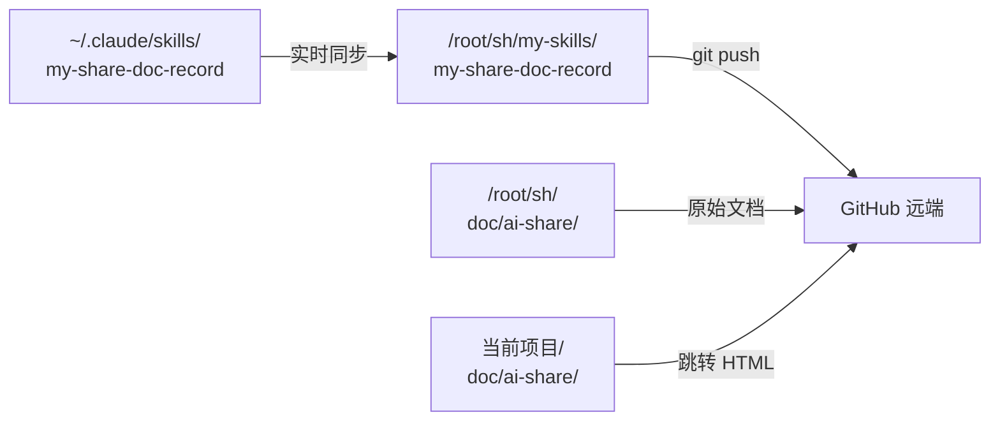
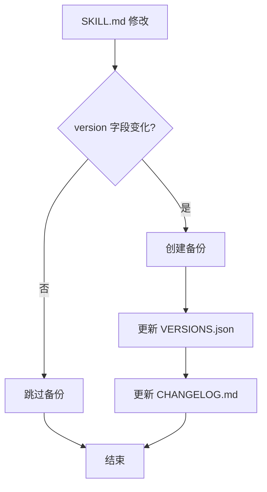
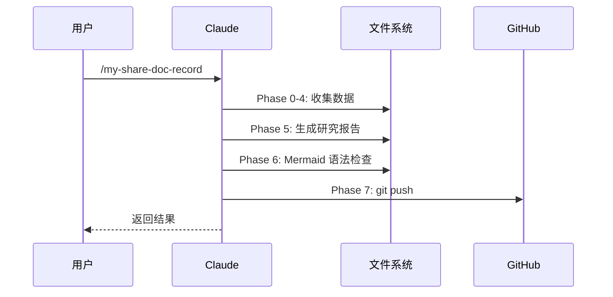

# my-share-doc-record 技能开发研究报告

> **研究主题：** Claude Code 自定义技能设计与实现——以 my-share-doc-record 为例
> **日期：** 2026-04-25
> **预计耗时：** 0.8 小时（03:29 ~ 04:09，无长时间空闲）
> **项目路径：** /root/sh/my-skills/my-skills-sync
> **GitHub 地址：** git@github.com:chujun/aiubuntu1-sh.git
> **本文档链接：** https://github.com/chujun/aiubuntu1-sh/blob/main/doc/ai-share/2026-04-25-my-share-doc-record%E6%8A%80%E8%83%BD%E5%BC%80%E5%8F%91%E7%A0%94%E7%A9%B6%E6%8A%A5%E5%91%8A.md

---

## 目录

- [一、研究概述](#一研究概述)
- [二、工作原理](#二工作原理)
- [三、核心概念](#三核心概念)
- [四、应用场景](#四应用场景)
- [五、命令参考](#五命令参考)
- [六、注意事项](#六注意事项)
- [七、实战案例](#七实战案例)
- [八、相关工具对比](#八相关工具对比)
- [九、用户提示词清单](#九用户提示词清单)
- [十、难点与挑战](#十难点与挑战)
- [十一、经验总结](#十一经验总结)

---

## 一、研究概述

### 1.1 背景

在 Claude Code 生态中，自定义技能（Skill）是扩展 AI 能力的重要方式。my-share-doc-record 技能旨在根据会话内容自动生成结构化的研究报告，与 my-explore-doc-record 形成互补——前者强调知识沉淀，后者强调 AI 协作学习过程。

### 1.2 研究目标

| 目标 | 说明 |
|------|------|
| 设计技能架构 | 参考 my-explore-doc-record，设计完整的技能框架 |
| 实现核心功能 | 版本管理、文档生成、自动提交 |
| 优化完善 | 增加自学习机制、路径记忆等高级功能 |
| 验证实用性 | 通过实际会话验证技能有效性 |

### 1.3 成果

成功开发 v1.0.0 和 v1.1.0 两个版本，涵盖 8 个 Phase 的完整技能框架。

---

## 二、工作原理

### 2.1 技能架构图



### 2.2 双目录机制



### 2.3 版本管理流程



---

## 三、核心概念

### 3.1 技能文件结构

| 文件 | 说明 |
|------|------|
| SKILL.md | 技能定义文档，包含所有执行流程 |
| versions/VERSIONS.json | 版本元数据 |
| versions/CHANGELOG.md | 变更日志 |
| versions/SKILL-v{x}.md | 历史版本备份 |

### 3.2 文档双目录机制

| 目录 | 用途 |
|------|------|
| 统一文档项目/doc/ai-share/ | 原始 Markdown 文档 |
| 当前项目/doc/ai-share/ | 跳转 HTML 页面 |

### 3.3 版本管理命令

| 命令 | 功能 |
|------|------|
| --versions | 列出所有版本 |
| --changelog | 查看变更日志 |
| --diff | 对比两个版本 |
| --info | 查看指定版本详情 |
| --restore | 回滚到指定版本 |

---

## 四、应用场景

### 4.1 场景矩阵

| 场景 | 适用性 | 说明 |
|------|--------|------|
| 知识沉淀 | ✅ 非常适合 | 将研究过程整理为结构化文档 |
| 技术分享 | ✅ 适合 | 生成的报告便于分享传播 |
| 工具学习 | ✅ 适合 | 研究某个工具/技术的完整文档 |
| 技能开发 | ✅ 适合 | 记录技能设计和开发过程 |

### 4.2 典型案例时序



---

## 五、命令参考

### 5.1 技能调用命令

| 命令 | 说明 |
|------|------|
| `/my-share-doc-record` | 自动推断主题生成报告 |
| `/my-share-doc-record Git Worktree` | 指定主题生成报告 |
| `/my-share-doc-record --versions` | 列出所有版本 |
| `/my-share-doc-record --changelog` | 查看变更日志 |
| `/my-share-doc-record --set-doc-dir <path>` | 设置文档路径 |

### 5.2 my-skills-sync 同步命令

| 命令 | 说明 |
|------|------|
| `bash sync-skills.sh` | 手动同步 |
| `bash watch-skills.sh start` | 启动监控 |
| `bash watch-skills.sh stop` | 停止监控 |
| `bash watch-skills.sh status` | 查看状态 |

---

## 六、注意事项

| 注意点 | 说明 | 建议 |
|--------|------|------|
| 路径配置 | 需正确设置统一文档项目路径 | 使用 --set-doc-dir 配置 |
| Mermaid 语法 | 关键字必须独立一行 | 参考技能文档的语法规范 |
| Git 安全 | 仅提交指定目录 | 绝不使用 git add . |
| 版本号规范 | 遵循 semver | major.minor.patch |

---

## 七、实战案例

### 案例：my-share-doc-record v1.1.0 开发

**问题：** 技能缺少版本管理和自学习机制

**解决：**

1. 添加 Phase 4.5 版本管理
2. 添加 Phase 8 自学习更新
3. 修复 Mermaid 检查脚本 bug
4. 增加路径全局记忆机制

**步骤：**

```bash
# 1. 创建版本目录
mkdir -p versions/

# 2. 编写 SKILL.md
vim SKILL.md

# 3. 版本备份
cp SKILL.md versions/SKILL-v1.1.0.md

# 4. 更新元数据
echo '{"current":"1.1.0"}' > versions/VERSIONS.json
```

**结果：** 技能功能对齐 my-explore-doc-record，支持完整版本管理

---

## 八、相关工具对比

| 工具 | 优点 | 缺点 | 适用场景 |
|------|------|------|---------|
| my-explore-doc-record | AI 协作过程完整 | 偏重过程记录 | 学习经验沉淀 |
| my-share-doc-record | 知识结构清晰 | 需手动指定主题 | 知识研究整理 |
| my-skills-sync | 自动同步实时 | 依赖 inotify | 多设备同步 |

---

## 九、用户提示词清单（原文）

**提示词 1：**
```
my-explore-doc-record参考这个技能文档和功能，新建一个技能，名称my-share-doc-record,技能核心能力，根据聊天内容，生成XXXX研究报告，研究报告包括不限于研究主题，工作原理，应用场景，你可以考虑补充
```

**提示词 2：**
```
完整版
```

**提示词 3：**
```
为什么my-share-doc-record技能没有实现自动同步功能，my-skills-sync技能没有起到作用
```

**提示词 4：**
```
哦，没有安装这个技能 @my-skills/my-skills-sync/ 这个目录下面my-skills-sync没有自动同步my-share-doc-record 技能
```

**提示词 5：**
```
是的
```

**提示词 6：**
```
git add,commit,push
```

---

## 十、难点与挑战

| 难点 | 初始判断 | 实际根因 | 解决方法 |
|------|---------|---------|---------|
| 同步路径错误 | 认为脚本逻辑正确 | TARGET_DIR 指向脚本目录而非父目录 | 修改 `dirname "$0"` 为 `dirname "$0"/..` |
| 技能未同步 | 认为 watch 服务失效 | 同步目标路径错误 | 手动执行 sync-skills.sh 修复 |
| 文档定位 | 混淆 ai-explore 和 ai-share | 技能定位不清晰 | 通过文档明确区分两个技能的用途 |

---

## 十一、经验总结

| 经验 | 核心教训 |
|------|---------|
| 参考已有技能开发 | 站在 my-explore-doc-record 肩膀上事半功倍 |
| 路径计算需验证 | `dirname "$0"` vs `dirname "$0"/..` 差异巨大 |
| 自动化需测试 | watch 服务可能看似运行但实际不工作 |
| 版本管理要趁早 | 设计阶段就应规划版本机制 |

---

*文档生成时间：2026-04-25 | 由 MiniMax M2.7 (`MiniMax-M2.7-highspeed`) 辅助生成*
