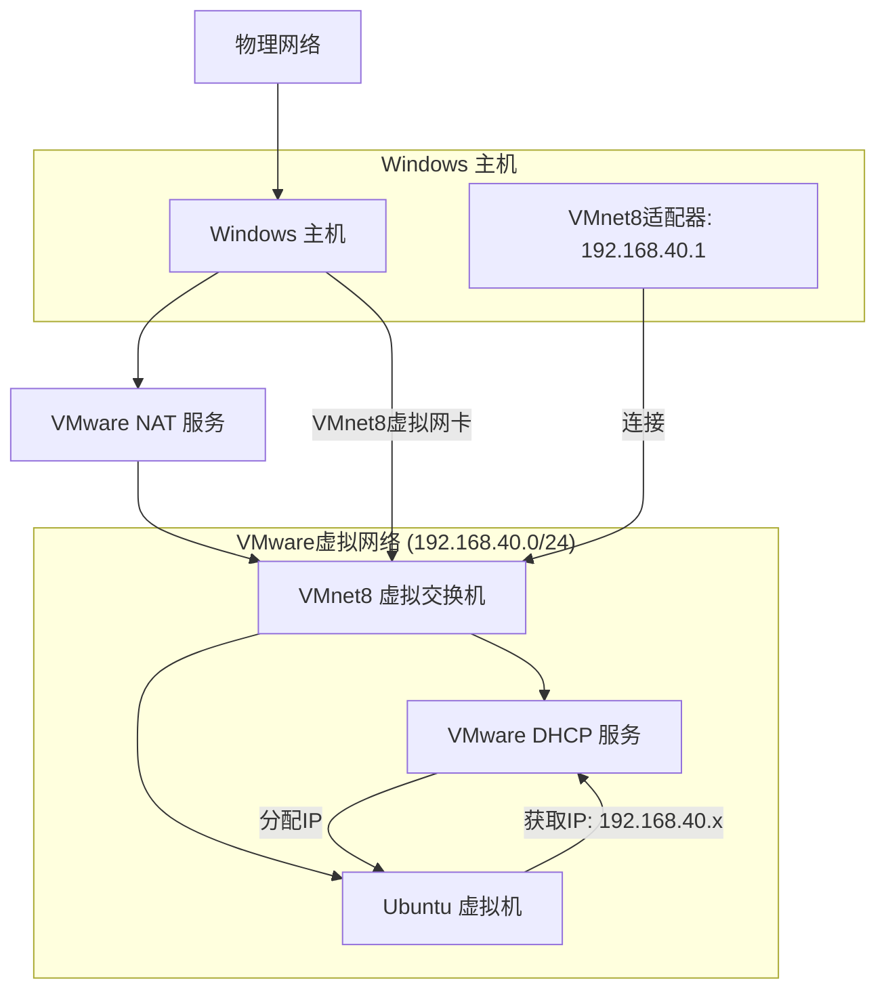
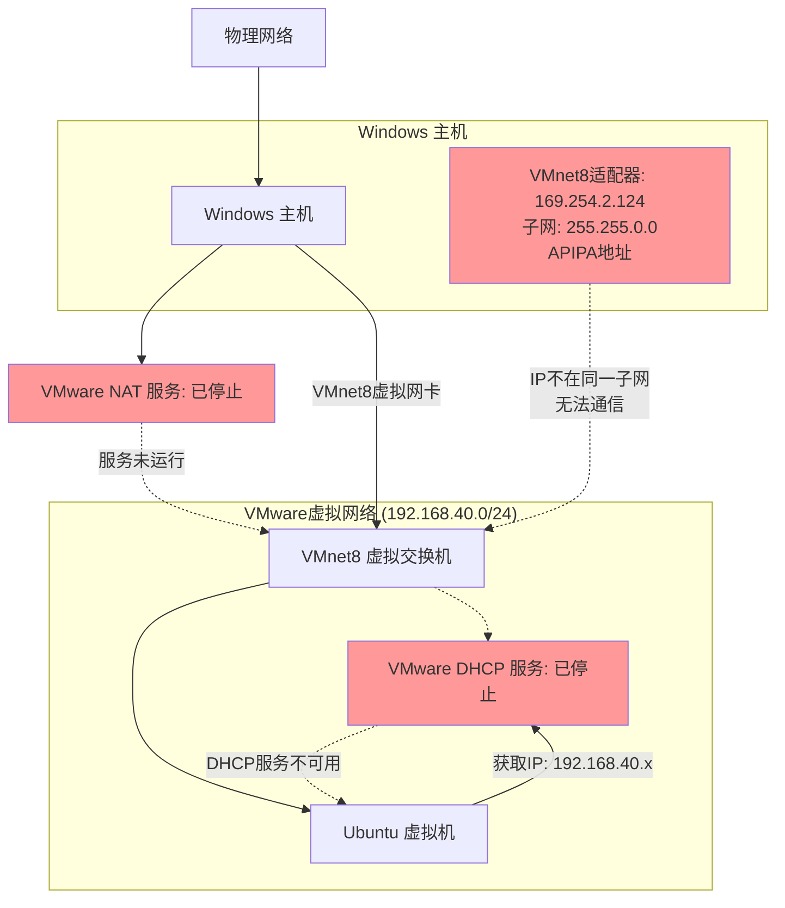
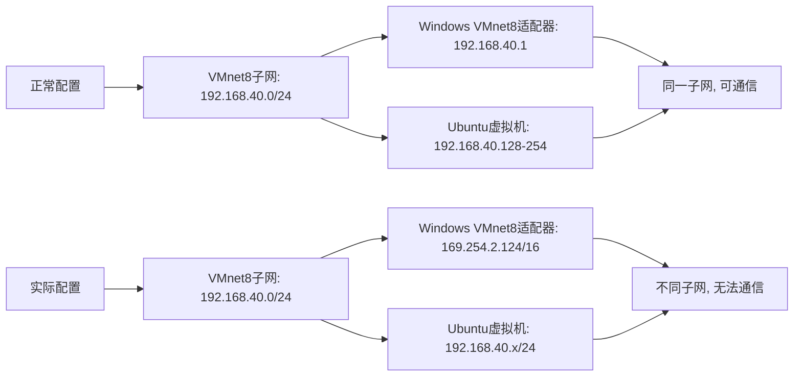
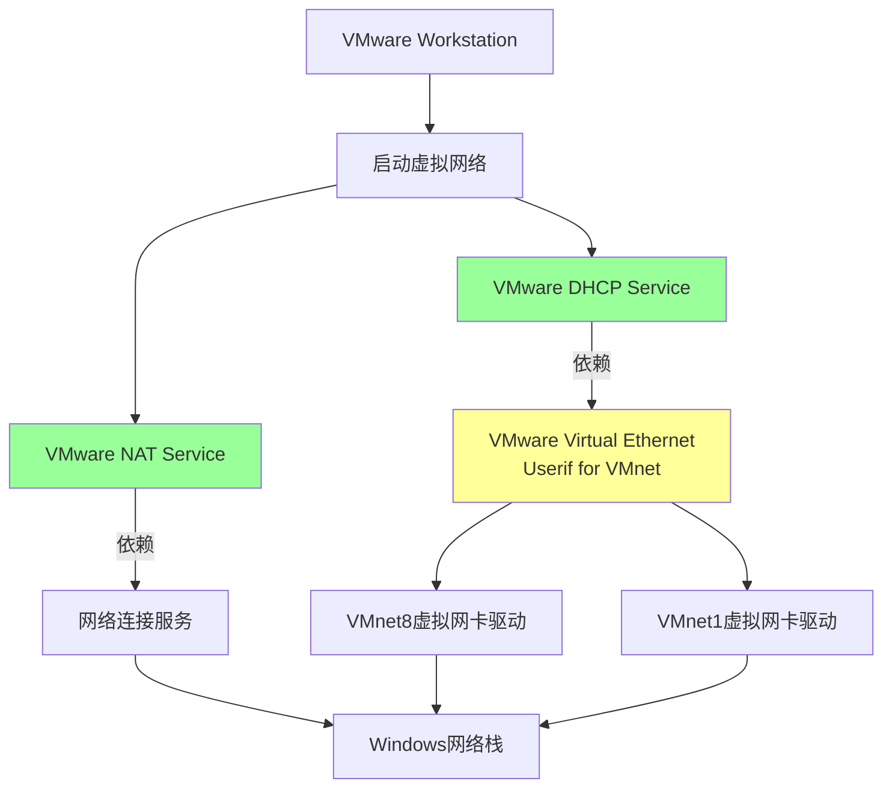
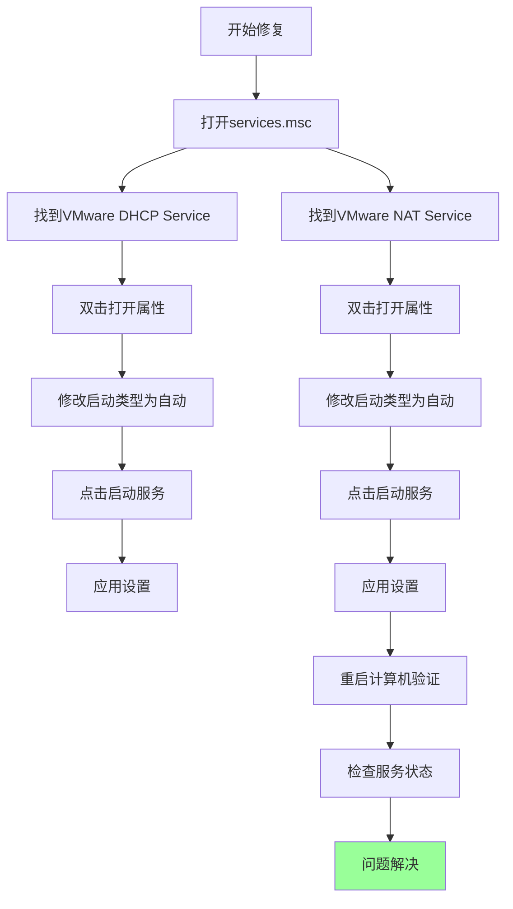
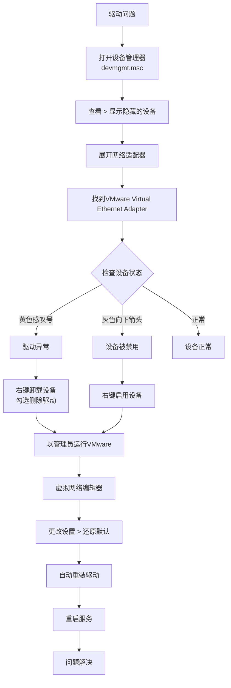

# VMware开机网络异常总结报告

## 文档信息

| 项目 | 内容 |
|------|------|
| 报告主题 | Windows 11环境下VMware NAT网络异常分析与解决方案 |
| 问题类型 | 虚拟机网络连接故障 |
| 影响范围 | Ubuntu Server 24虚拟机无法访问宿主机 |
| 文档版本 | 1.0 |
| 更新日期 | 2026年4月28日 |

## 1. 问题概述

### 1.1 问题现象

用户在使用Windows 11操作系统运行VMware Workstation时，启动Ubuntu Server 24虚拟机后，出现以下网络异常：

- 虚拟机无法访问宿主机（Windows 11）
- 虚拟机采用NAT网络模式，网段配置为192.168.40.0/24
- 宿主机VMnet8虚拟网卡获取到异常的APIPA地址：169.254.2.124
- VMware核心服务（DHCP和NAT服务）未能自动启动

### 1.2 用户原始输入

以下是用户在咨询过程中提供的完整输入信息：

> "window11环境现在启动vmware，ubuntu server24开机启动后无法访问宿主机，虚拟机使用的是NAT模式，网段是192.168.40.0，但是本地window系统ipconfig却显示169.254.2.124，分析ubuntu server24开机启动后无法访问宿主机的原因，网络不同的原因"

（用户提供了两张图片信息）

**图片1：Windows命令提示符中执行ipconfig的结果截图**

显示内容：

```
以太网适配器 VMware Network Adapter VMnet8:
   连接特定的 DNS 后缀 . . . . . . . :
   本地链接 IPv6 地址. . . . . . . . : fe80::xxxx:xxxx:xxxx:xxxx%xxx
   IPv4 地址 . . . . . . . . . . . . : 169.254.2.124
   子网掩码  . . . . . . . . . . . . : 255.255.0.0
   默认网关. . . . . . . . . . . . . :
```

**图片2：VMware Virtual Network Editor配置截图**

显示内容：

- VMnet8配置为NAT模式
- 子网地址：192.168.40.0
- 子网掩码：255.255.255.0
- NAT设置中网关为：192.168.40.2
- DHCP服务状态：Enabled
- DHCP地址范围：192.168.40.128 - 192.168.40.254

> "VMware DHCP Service，VMware NAT Service这两个服务确实没有启动，但是我明明启动了vmware程序了呢，以前也不需要手动启动这两个服务呢"

> "确实依赖了一个系统组件，这个VMnet组件怎么判断是否正常"

> "确实最近安装了腾讯管家了，优化了下开机启动项，可能把这两个服务关闭了"

## 2. 网络拓扑与问题分析

### 2.1 正常NAT网络拓扑



### 2.2 异常情况网络拓扑



### 2.3 问题根本原因分析

#### 2.3.1 IP地址冲突分析



#### 2.3.2 服务依赖关系



## 3. 详细诊断过程

### 3.1 初始状态检查

#### 3.1.1 Windows网络配置检查

用户提供的ipconfig输出显示：

| 项目 | 内容 |
|------|------|
| 适配器 | VMware Network Adapter VMnet8 |
| 状态 | 异常 |
| IP地址 | 169.254.2.124 (APIPA地址) |
| 子网掩码 | 255.255.0.0 (/16) |
| 网关 | 无 |
| DNS | 未显示 |

#### 3.1.2 VMware网络配置检查

VMware Virtual Network Editor配置：

| 项目 | 内容 |
|------|------|
| 虚拟网络 | VMnet8 |
| 类型 | NAT |
| 子网IP | 192.168.40.0 |
| 子网掩码 | 255.255.255.0 |
| 网关 | 192.168.40.2 |
| DHCP | 已启用 |
| 地址池 | 192.168.40.128 - 192.168.40.254 |

### 3.2 服务状态诊断

#### 3.2.1 关键服务状态

用户确认以下服务未运行：

| 服务名称 | 预期状态 | 实际状态 | 启动类型 |
|---------|---------|---------|---------|
| VMware DHCP Service | 自动运行 | 已停止 | 手动/禁用 |
| VMware NAT Service | 自动运行 | 已停止 | 手动/禁用 |

#### 3.2.2 依赖组件检查

通过Windows服务管理器查看，发现：

- VMware DHCP Service依赖 VMware Virtual Ethernet Userif for VMnet组件
- 该组件对应的系统设备为：VMware Virtual Ethernet Adapter for VMnet8

## 4. 根本原因确定

### 4.1 直接原因

1. VMware核心服务未启动：DHCP和NAT服务未能自动启动
2. IP地址分配失败：由于DHCP服务停止，VMnet8适配器无法获取192.168.40.0/24网段的IP
3. 网络隔离：宿主机(169.254.2.124/16)与虚拟机(192.168.40.x/24)处于不同子网

### 4.2 根本原因

腾讯电脑管家优化导致：

- 将VMware DHCP和NAT服务的启动类型从"自动"改为"手动"或"禁用"
- 可能禁用了相关的虚拟网卡驱动
- 破坏了VMware服务的自启动依赖链

## 5. 完整解决方案

### 5.1 紧急恢复步骤

**步骤1：手动启动关键服务**

```powershell
# 以管理员身份运行PowerShell或命令提示符
sc start "VMware DHCP Service"
sc start "VMware NAT Service"
```

**步骤2：检查IP地址恢复**

```powershell
ipconfig /renew "VMware Network Adapter VMnet8"
ipconfig | findstr "VMnet8"
```

### 5.2 永久解决方案

#### 5.2.1 修复服务启动类型



#### 5.2.2 腾讯管家白名单配置

1. 打开腾讯电脑管家
2. 进入"工具箱" → "开机加速"
3. 在"已禁用"列表中找到VMware相关服务
4. 恢复启动状态：

| 服务项 | 操作 | 状态 |
|--------|------|------|
| VMware DHCP Service | 点击"恢复启动" | 已启用 |
| VMware NAT Service | 点击"恢复启动" | 已启用 |
| VMware 相关进程 | 添加到信任区 | 不再优化 |

#### 5.2.3 驱动与网络重置

如果问题仍然存在，执行以下高级修复：



### 5.3 验证步骤

**验证1：服务状态验证**

```powershell
# 检查服务状态
Get-Service "VMware DHCP Service", "VMware NAT Service" | Format-Table Name, Status, StartType -AutoSize
```

预期输出：

```
Name                 Status StartType
----                 ------ ---------
VMware DHCP Service Running    Auto
VMware NAT Service  Running    Auto
```

**验证2：网络配置验证**

```powershell
# 检查VMnet8适配器IP
ipconfig | Select-String -Pattern "VMnet8" -Context 0,5
```

预期输出：

```
以太网适配器 VMware Network Adapter VMnet8:
   连接特定的 DNS 后缀 . . . . . . . :
   IPv4 地址 . . . . . . . . . . . . : 192.168.40.1
   子网掩码  . . . . . . . . . . . . : 255.255.255.0
   默认网关. . . . . . . . . . . . . :
```

**验证3：虚拟机连接测试**

```powershell
# 从宿主机ping虚拟机
ping 192.168.40.128

# 从虚拟机ping宿主机
# 在Ubuntu中执行
ping 192.168.40.1
```

## 6. 预防措施

### 6.1 优化软件配置建议

**腾讯电脑管家设置:**

- **开机加速:**
  - 模式: 手动优化
  - 忽略列表: 添加VMware相关服务
- **优化记录:**
  - 定期检查优化项
  - 避免优化开发工具服务

**系统维护建议:**

- 创建系统还原点: 安装开发工具前
- 服务备份: 导出服务配置
- 文档记录: 记录所有自定义配置

### 6.2 VMware最佳实践

**定期维护：**

- 每月检查一次服务状态
- 更新前备份虚拟网络配置

**故障排查清单：**

- [ ] 服务状态: VMware DHCP/NAT Service
- [ ] 网络适配器: VMnet8 IP地址
- [ ] 防火墙设置: 允许VMware相关进程
- [ ] 虚拟网络: NAT配置正确性
- [ ] 虚拟机设置: 网络适配器类型

### 6.3 快速恢复脚本

创建批处理文件 `fix_vmware_network.bat`：

```batch
@echo off
echo 正在修复VMware网络问题...
echo.

echo 1. 停止VMware相关服务...
net stop "VMware DHCP Service" >nul 2>&1
net stop "VMware NAT Service" >nul 2>&1
net stop "VMware Authorization Service" >nul 2>&1

echo 2. 重新设置服务启动类型...
sc config "VMware DHCP Service" start= auto
sc config "VMware NAT Service" start= auto
sc config "VMware Authorization Service" start= auto

echo 3. 启动VMware相关服务...
net start "VMware Authorization Service"
net start "VMware DHCP Service"
net start "VMware NAT Service"

echo 4. 更新网络配置...
ipconfig /release "VMware Network Adapter VMnet8" >nul 2>&1
timeout /t 3 /nobreak >nul
ipconfig /renew "VMware Network Adapter VMnet8" >nul 2>&1

echo 5. 显示当前网络状态...
ipconfig | findstr /C:"VMnet8"

echo.
echo 修复完成！建议重启计算机使所有更改生效。
pause
```

## 7. 附录

### 7.1 关键文件路径

| 组件 | 路径 | 说明 |
|------|------|------|
| VMware主程序 | `C:\Program Files (x86)\VMware\VMware Workstation` | 主安装目录 |
| DHCP服务 | `C:\Program Files (x86)\VMware\VMware Workstation\vmware-dhcp.exe` | DHCP服务程序 |
| NAT服务 | `C:\Program Files (x86)\VMware\VMware Workstation\vmware-nat.exe` | NAT服务程序 |
| 配置文件 | `C:\ProgramData\VMware\vmnetnat.conf` | NAT配置文件 |
| DHCP配置 | `C:\ProgramData\VMware\vmnetdhcp.conf` | DHCP配置文件 |

### 7.2 常见错误代码

| 错误代码 | 含义 | 解决方案 |
|---------|------|---------|
| 错误 1068 | 依赖服务或组无法启动 | 检查依赖服务，修复VMware网络组件 |
| 错误 1053 | 服务没有及时响应 | 增加服务启动超时，或重新安装服务 |
| 错误 2 | 系统找不到指定文件 | VMware组件损坏，需要修复安装 |
| 错误 5 | 访问被拒绝 | 以管理员身份运行 |

### 7.3 网络配置参考

正常NAT网络配置示例：

```
# VMware Virtual Network Editor配置
VERSION=1.0.0
virtualNetwork.0.name=VMnet8
virtualNetwork.0.device=vmnet8
virtualNetwork.0.network=192.168.40.0
virtualNetwork.0.mask=255.255.255.0
virtualNetwork.0.nat.enabled=true
virtualNetwork.0.dhcp.enabled=true
virtualNetwork.0.dhcp.start=192.168.40.128
virtualNetwork.0.dhcp.end=192.168.40.254
```

### 7.4 联系支持

如果问题仍未解决，请提供以下信息：

- VMware版本信息
- Windows系统版本和更新历史
- 已安装的安全软件列表
- 完整的ipconfig /all输出
- 事件查看器中相关错误日志

## 文档总结

本报告详细分析了Windows 11环境下VMware NAT网络异常的问题，根本原因为第三方优化软件（腾讯电脑管家）禁用了VMware核心服务，导致DHCP和NAT服务无法自动启动。通过重新配置服务启动类型、修复网络驱动、设置软件白名单等步骤，可彻底解决此问题。

**经验教训：** 在使用系统优化软件时，应避免"一键优化"，特别是对于开发者和需要使用虚拟化技术的用户，应手动审查优化项目，确保关键服务不被禁用。

---

**文档结束**

本报告基于实际故障排查案例编写，适用于类似VMware网络故障的排查与修复
