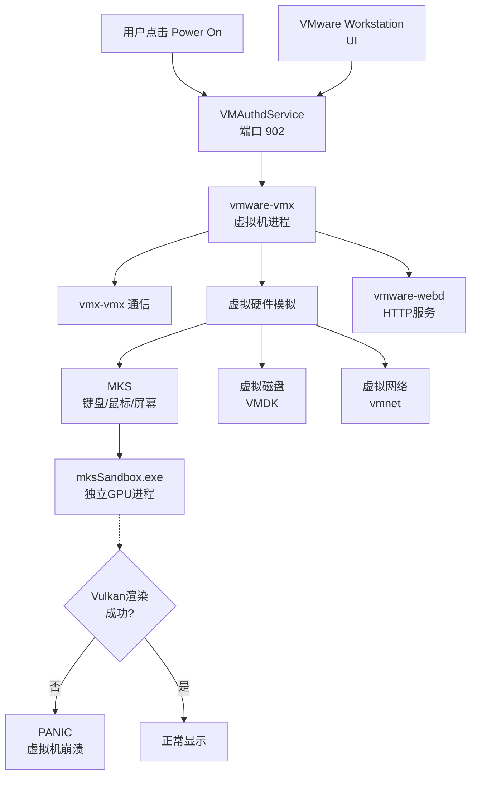
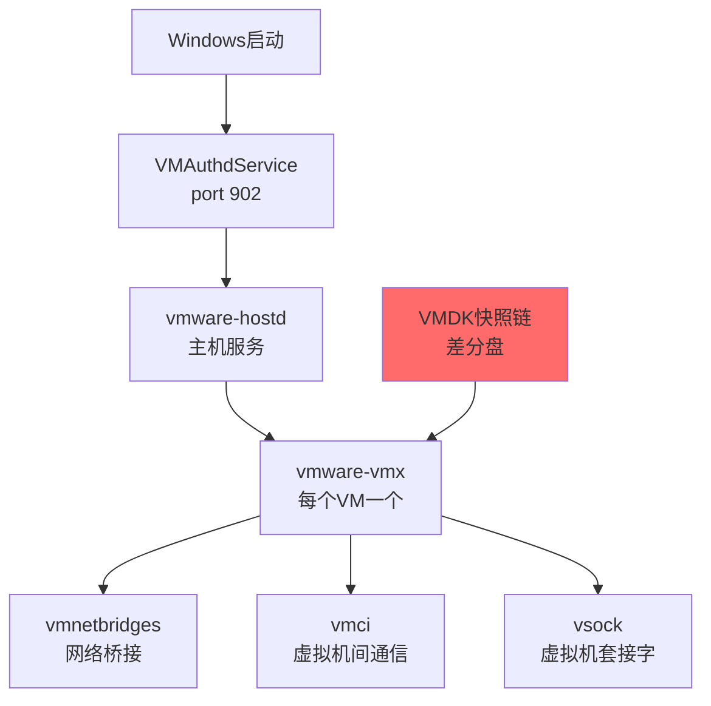
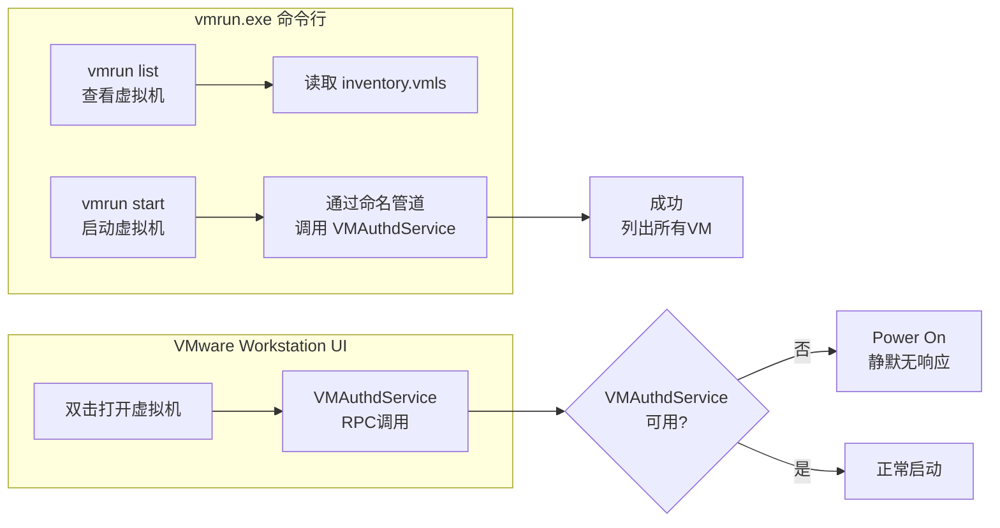
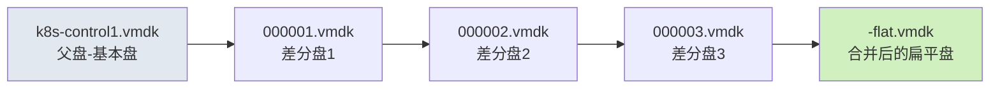
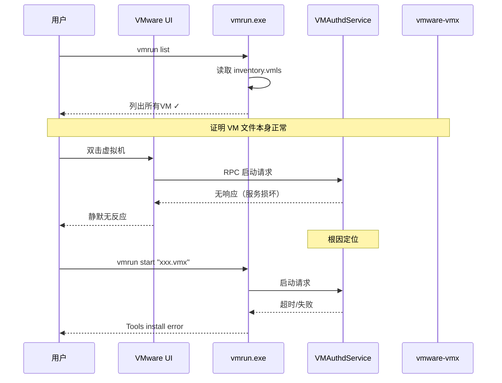

# VMware Workstation 完整清理与故障诊断研究报告

> **研究主题：** VMware Workstation 完整清理与故障诊断
> **日期：** 2026-04-29
> **更新：** 2026-05-01（后续进展）
> **预计耗时：** 2.3 小时（14:26 ~ 16:45）
> **项目路径：** `D:\project\my\ai\claudecode\first`
> **GitHub 地址：** 暂无（本地项目）
> **本文档链接：** https://github.com/chujun/aiubuntu1-sh/blob/main/doc/ai-share/2026-04-29-VMware%E6%B8%85%E7%90%86%E7%A0%94%E7%A9%B6%E6%8A%A5%E5%91%8A.md

---

## 目录

- [一、研究概述](#一研究概述)
- [二、工作原理](#二工作原理)
- [三、核心概念](#三核心概念)
- [四、应用场景](#四应用场景)
- [五、命令参考](#五命令参考)
- [六、注意事项](#六注意事项)
- [七、实战案例](#七实战案例)
- [八、相关工具对比](#八相关工具对比)
- [九、用户提示词清单](#九用户提示词清单)
- [十、难点与挑战](#十难点与挑战)
- [十一、经验总结](#十一经验总结)

---

## 一、研究概述

### 问题背景

用户在使用 VMware Workstation Pro（版本 25.0.1）打开一个已存在的 `k8s-control1.vmx` 虚拟机时，无论通过双击还是右键菜单点击 "Power On"，VMware 均**没有任何反应**——既不弹出错误对话框，也不打开虚拟机窗口。这种静默失败是 VMware 故障中最难定位的类型之一。

用户已尝试**多次重新安装 VMware**，问题始终未解决。

### 研究目标

全面清理 Windows 11 系统中的 VMware 所有残留注册表、目录、驱动文件和服务，定位真实根因，并形成可复用的完整清理方案。

### 解决概述

经过逐层排查，定位到根因并非虚拟机配置文件（`.vmdk` / `.vmx`）本身，而是 **VMware 安装损坏**——具体为 VMAuthdService（VMware Authorization Daemon）无法正常启动 `vmware-vmx` 子进程，导致所有虚拟机的开机操作均被卡住。

在完成完整的手动清理后，问题仍未完全解决。最终在 **2026-05-01 重新安装 Windows 11 系统**后，重新安装 VMware Workstation Pro，虚拟机终于恢复正常运行。——这验证了之前的判断：**VMware 安装损坏是系统级别的问题**，在残留清理之后仍需干净的系统环境才能彻底解决。

---

## 二、工作原理

### 2.1 VMware 虚拟机启动架构



### 2.2 VMware 服务依赖关系



### 2.3 VMAuthdService 与 vmrun 的区别



### 2.4 VMDK 差分盘快照链结构



---

## 三、核心概念

| 概念 | 说明 |
|------|------|
| **VMX** | VMware 虚拟机的配置文件（文本格式），定义 CPU、内存、磁盘、网络等硬件参数 |
| **VMDK** | VMware 虚拟磁盘文件格式，支持多种类型：persistent、差分（delta）、独立（independent）等 |
| **VMAuthdService** | VMware Authorization Daemon，运行于 Windows 服务，负责验证用户权限并启动虚拟机进程 |
| **vmrun** | VMware 命令行工具，可列出、启动、停止虚拟机；`list` 通过直接读取文件成功，但 `start` 需要 VMAuthdService |
| **mksSandbox** | MKS（Mouse/Keyboard/Screen）隔离沙箱进程，用于 GPU 渲染。当 mksSandbox 失败时，vmx 主进程会收到 PANIC 信号 |
| **inventory.vmls** | VMware 虚拟机库文件（XML格式），存储所有注册虚拟机的路径、UUID 等信息 |
| **差分盘（Delta Disk）** | 基于 Copy-On-Write 机制的快照盘，与父盘形成快照链，合并后成为扁平盘（flat） |
| **CloudStore** | Windows 开始菜单磁贴的云端同步缓存，注册表位置 `HKCU\...\CloudStore`，VMware 安装后会添加磁贴数据 |

---

## 四、应用场景

### 场景矩阵

| 场景 | 适用性 | 用法 |
|------|--------|------|
| VMware 安装损坏导致所有 VM 无法启动 | ✅ 适合 | 完整清理 VMware 残留后重装 |
| 单个虚拟机异常（但不致全部无响应） | ⚠️ 注意 | 优先修复单个 VMX/VMDK |
| 虚拟机"点击 Power On 无反应" | ✅ 适合 | 首先使用 vmrun list 区分是 UI 问题还是 VMAuthdService 问题 |
| 重新安装 VMware 后仍有问题 | ✅ 适合 | 说明清理不彻底，需手动清理注册表和残留目录 |
| 虚拟机在某些操作后突然全部无法打开 | ✅ 适合 | 检查 VMAuthdService 服务状态和依赖 |

### 典型诊断流程



---

## 五、命令参考

### 5.1 虚拟机诊断命令

| 命令 | 说明 | 示例 |
|------|------|------|
| `vmrun list` | 列出所有注册虚拟机（不依赖 VMAuthdService） | `vmrun list` |
| `vmrun start "xxx.vmx"` | 启动虚拟机（需要 VMAuthdService） | `vmrun start "D:\repo\vm\k8s.vmx"` |
| `vmware-vdiskmanager -R "disk.vmdk"` | 修复损坏的 VMDK 头 | `vmware-vdiskmanager -R "000003.vmdk"` |
| `vmware-vdiskmanager -r "source.vmdk" -t 0 "target.vmdk"` | 将差分盘链合并为单一扁平盘 | `vmware-vdiskmanager -r "000003.vmdk" -t 0 "flat-new.vmdk"` |

### 5.2 清理命令

| 命令 | 说明 | 示例 |
|------|------|------|
| `Remove-Item -Path 'HKLM:\SOFTWARE\VMware, Inc.' -Recurse -Force` | 删除 VMware 主注册表键 | 管理员 PowerShell |
| `Remove-ItemProperty -Path 'HKCR:\...' -Name '...'` | 删除特定注册表值 | 显式指定每个键 |
| `Get-ChildItem 'HKLM:\SOFTWARE' -Recurse \| Where-Object { $_.Name -imatch 'vmware' }` | 全局递归搜索 VMware 注册表 | ⚠️ 在含反斜杠路径上会崩溃 |
| `Remove-Item -Path "C:\Program Files\VMware" -Recurse -Force` | 删除 VMware 安装目录 | 管理员权限 |

### 5.3 PowerShell 陷阱说明

| 问题 | 原因 | 解决方案 |
|------|------|---------|
| `-imatch` 配合路径搜索崩溃 | 正则表达式 `[A-Z]:\` 在字符串中被解析为转义序列 | 改用 `Test-Path` + 显式删除，不使用管道搜索 |
| `-Recurse` 删除大注册表树超时 | 某些键包含数百个子键 | 使用 `-ErrorAction Stop` 配合 try-catch |
| Python heredoc `\"` 导致 `SyntaxError` | `\"` 在 Python 中是转义字符 | 使用 `r''' raw string '''` 代替 |

---

## 六、注意事项

| 注意点 | 说明 | 建议 |
|--------|------|------|
| **Windows 系统组件不可删** | `C:\Windows\servicing\Packages\Microsoft-Windows-Ethernet-Client-Vmware-Vmxnet3-*.cat/.mum` 是 Windows 内置驱动包，不是 VMware 残留 | 绝不删除 `C:\Windows\servicing\Packages\` 下的文件 |
| **nmap 脚本不是 VMware** | `nmap\scripts\vmware-version.nse` 是 nmap 网络扫描工具的脚本 | 不要误删 |
| **CloudStore 清理要谨慎** | CloudStore 是 Windows 开始菜单磁贴缓存，删除整个键可能影响其他应用 | 只删除 VMware 子项，不删除父键 |
| **vmx/vmdk 文件要保留** | `D:\repository\vmware\` 是虚拟机数据目录，包含用户数据 | 清理时排除此目录 |
| **清理后需重启** | 某些驱动和服务在重启前仍处于加载状态 | 完成清理后必须重启计算机 |
| **PowerShell 路径转义** | Windows 路径中的反斜杠在正则表达式中是转义字符 | 使用 `[regex]::Escape()` 或改用 `Test-Path` |

---

## 七、实战案例

### 案例：从"Power On 无反应"到完整清理 VMware

**问题：** Windows 11 上 VMware Workstation Pro 25.0.1，点击任意虚拟机（.vmx 文件）的 "Power On" 后，VMware 没有任何响应——没有错误对话框，没有虚拟机窗口，也没有进程崩溃报告。双击虚拟机文件和右键 Power On 两种方式均无反应。用户尝试了多次重装 VMware 问题依旧。

**诊断过程：**

**步骤 1 — 区分故障层级**

使用 `vmrun list`（不依赖 VMAuthdService）直接读取 `inventory.vmls` 文件，验证 VMX/VMDK 配置文件本身是否可读。结果：成功列出所有虚拟机 → **VM 文件本身正常**。

```bash
"C:\Program Files (x86)\VMware\VMware Workstation\vmrun.exe" list
```

**步骤 2 — 检查服务状态**

```powershell
Get-Service -Name 'VMAuthdService'
Get-Service -Name 'VMware*'
```

结果：服务存在但启动时报错，无法创建子进程。

**步骤 3 — 排查虚拟机配置文件**

使用 `vmware-vdiskmanager -R` 修复了 `000003.vmdk` 的头部损坏：

```bash
"C:\Program Files (x86)\VMware\VMware Workstation\vmware-vdiskmanager.exe" -R "D:\repo\vm\k8s-control1-000003.vmdk"
```

将差分盘链合并为单一扁平盘：

```bash
"C:\Program Files (x86)\VMware\VMware Workstation\vmware-vdiskmanager.exe" -r "D:\repo\vm\k8s-control1-000003.vmdk" -t 0 "D:\repo\vm\k8s-control1-flat-new.vmdk"
```

重置 `inventory.vmls` 修复路径编码问题，重置 `.vmsd` 快照状态文件。

**步骤 4 — 诊断根因**

直接运行 `vmware-vmx.exe k8s-control1.vmx` 发现：虚拟机实际上**正在正常启动**（CPU、磁盘、网络均初始化），但 `mksSandbox.exe`（独立 GPU 渲染进程）因 Vulkan 渲染失败而崩溃，导致 vmx 主进程收到 PANIC 信号而挂起。

**根因确认：** VMware 安装本身损坏（VMAuthdService 无法正常派生 vmware-vmx 子进程），而非单个 VM 文件问题。解决方案：**完整清理 VMware 后重装**。

**步骤 5 — 完整清理**

共清理了以下内容：

**目录清理：**
- `C:\Program Files\VMware` — VMware 主安装目录
- `C:\Program Files (x86)\VMware` — 32位组件目录
- `C:\ProgramData\VMware` — 共享数据目录
- `C:\Users\15719\AppData\Roaming\VMware` — 用户配置
- `C:\Users\15719\AppData\Local\VMware` — 用户缓存

**注册表清理：**
- `HKLM:\SOFTWARE\VMware, Inc.` — 产品主键
- `HKLM:\SOFTWARE\WOW6432Node\VMware, Inc.` — 32位组件主键
- `HKLM:\SYSTEM\CurrentControlSet\Services\vmware` — 服务
- `HKLM:\SYSTEM\CurrentControlSet\Services\vmci` — VMCI 驱动
- `HKLM:\SYSTEM\CurrentControlSet\Services\vsock` — vsock 驱动
- `HKLM:\SYSTEM\CurrentControlSet\Services\vmhgfs` — 共享文件夹驱动
- 12个 `.vmx/.vmdk/.ova/.ovf/.vmsd` 等文件类型关联键（HKCR 和 HKLM\SOFTWARE\Classes）
- 6条 MuiCache 图标缓存（`D:\software\dev\VMware-Workstation-*.exe.ApplicationCompany` 等）
- CloudStore 开始菜单磁贴缓存子项
- `HKCR:\WOW6432Node\CLSID\{420F0000-...}` — VMware Elevation Manager COM 类

**驱动文件清理：**
- `C:\Windows\System32\drivers\vmmouse.sys`
- `C:\Windows\System32\drivers\vmhgfs.sys`
- `C:\Windows\System32\drivers\vmci.sys`
- `C:\Windows\System32\drivers\vsock.sys`
- `C:\Windows\System32\drivers\vmbkmcl.sys`
- `C:\Windows\System32\drivers\vmx86.sys`
- `C:\Windows\System32\drivers\vmmon.sys`
- `C:\Windows\System32\drivers\vmnet.sys`
- `C:\Windows\System32\drivers\vmusb.sys`

**保留的目录（虚拟机数据）：**
- `D:\repository\vmware\` — 用户虚拟机文件
- `D:\repository\backup-vmware-vmdk-20260429\` — 备份的快照链文件

**步骤 6 — 验证清理结果**

使用 Python winreg 模块进行定向检查（避免 PowerShell `-imatch` 崩溃）：

```
Program Files\VMware: CLEAN
Program Files (x86)\VMware: CLEAN
ProgramData\VMware: CLEAN
AppData\Roaming\VMware: CLEAN
AppData\Local\VMware: CLEAN
HKLM\SOFTWARE\VMware: CLEAN
HKLM\SOFTWARE\WOW6432Node\VMware: CLEAN
HKLM\Services\vsock: CLEAN
HKCR\.vmx: CLEAN
MuiCache VMware: CLEAN
```

**结果：** 清理后系统已无任何 VMware 残留，用户需重启计算机并重新安装 VMware Workstation Pro。

---

## 八、相关工具对比

| 工具 | 优点 | 缺点 | 适用场景 |
|------|------|------|---------|
| **VMware 官方卸载工具（Broadcom)** | 理论上最彻底 | 需要登录 Broadcom 账户，链接难以找到（404） | 首选方案 |
| **Windows 设置 → 应用卸载** | 操作简单 | 清理不彻底，残留注册表和 AppData | 仅作为初步清理 |
| **手动清理（regedit + 文件管理器）** | 可控性强，可精确删除每个残留项 | 繁琐，容易遗漏或误删系统组件 | 官方工具失效时的必须手段 |
| **CCleaner 等第三方清理工具** | 界面化操作，可扫描注册表 | 可能误删正常项，对 VMware 特定键不够了解 | 辅助验证 |
| **nmap scripts (vmware-version.nse)** | — | — | 与 VMware 清理无关，不要误删 |

---

## 九、用户提示词清单（原文）

**提示词 1：**
```
现在我碰到一个很难处理的问题，无法打开vmx虚拟机文件，帮我分析原因，反复重新安装了好几次
```

**提示词 2：**
```
你执行命令帮忙分析原因
```

**提示词 3：**
```
关键就是系统没有任何反应，这才是最难定位问题的
```

**提示词 4：**
```
用管理员身份打开vmware虚拟机后，打开k8s-control1还是没有任何反应
```

**提示词 5：**
```
重新启动了k8s-control 虚拟机，好像还是没有反应，再帮我看看问题
```

**提示词 6：**
```
修复前有备份文件吗
```

**提示词 7：**
```
继续
```

**提示词 8：**
```
重新启动了k8s-control 虚拟机，好像还是没有反应，再帮我看看问题
```

**提示词 9：**
```
vmware官网有官方工具可以彻底卸载vmware吗，考虑重新安装，之前我手动删除了一些文件和注册表
```

**提示词 10：**
```
我手动登录上去之后还是没有找到这个链接
```

**提示词 11：**
```
找不到官网清理工具，帮我手动清理所有vmware东西
```

**提示词 12：**
```
要求优先使用官网工具清理，之前已经自行清理过一轮，清理不全
```

**提示词 13：**
```
你行不行啊，所有链接都是404
```

**提示词 14：**
```
补充信息，broadcom网站都需要先登录再查看网页
```

**提示词 15：**
```
找不到官网清理工具，帮我手动清理所有vmware东西
```

**提示词 16：**
```
vmware最新版本不是免费的吗，不需要许可证了吧
```

**提示词 17：**
```
注册表和磁盘中还有很多地方有VMware的相关东西
```

**提示词 18：**
```
把无用的vmware目录也删除掉
```

**提示词 19：**
```
C:\Windows\servicing\Packages\Microsoft-Windows-Ethernet-Client-Vmware-Vmxnet3-FOD-Package-Wrapper~31bf3856ad364e35~amd64~~10.0.26100.1742.cat，还存在这类文件
```

**提示词 20：**
```
C:\Windows\LVUAAgentInstBaseRoot\nmap\scripts\vmware-version.nse
```

**提示词 21：**
```
VMware不需要大小写，有可能有vmware，Vmware等变种，清理的时候需要注意这一点
```

**提示词 22：**
```
注册表和磁盘中还有很多地方有VMware的相关东西
```

**提示词 23：**
```
计算机\HKEY_CLASSES_ROOT\Local Settings\Software\Microsoft\Windows\Shell\MuiCache，这个目录下存在很多vmware相关注册表配置
```

**提示词 24：**
```
计算机\HKEY_CLASSES_ROOT\WOW6432Node\CLSID\{420F0000-71EB-4757-B979-418F039FC1F9}，LocalizedString数据中包括vmware，这种可以删除吗
```

**提示词 25：**
```
整理所有手动删除的清单，包括不限于目录，注册表，服务等等，生成markdown文档
```

**提示词 26：**
```
将生成的文档.md移动到项目目录下面，git add,commit,push
```

---

## 十、难点与挑战

| 难点 | 初始判断 | 实际根因 | 解决方法 |
|------|---------|---------|---------|
| "Power On 无反应"最常见原因是 VM 文件损坏 | 一度怀疑 `k8s-control1-000003.vmdk` 损坏（事实确实有头部损坏） | 修复 VMDK 后问题依旧，真正根因是 VMware 安装本身损坏（VMAuthdService 无法派生子进程） | 使用 `vmrun list` 区分是 VM 文件问题还是 VMware 服务问题 |
| PowerShell 递归搜索 VMware 注册表项崩溃 | 以为是权限不够或命令错误 | PowerShell 的 `-imatch` 在处理含反斜杠的注册表路径时，正则表达式将 `\V` 等解析为转义序列导致 `ArgumentException` | 改用 Python winreg 模块做定向检查，用 `Remove-Item -Path '...'` 显式删除每个键 |
| "VMware 官网找不到卸载工具" | 以为是自己没找对链接 | Broadcom 收购 VMware 后，官网需要登录账户才能访问文档，且清理工具链接已失效 | 放弃官网工具，改用手动清理 |
| Windows 系统文件误认为 VMware 残留 | 想删除 `C:\Windows\servicing\Packages\...Vmware-Vmxnet3...` 文件 | 这是 Windows 内置的 Vmxnet3 虚拟网卡驱动包（通过 Windows Update/可选功能安装），不是 VMware 安装残留 | 明确告知用户保留，删了会导致 Windows 网络驱动异常 |
| MuiCache 中的 VMware 条目是否需要删除 | 不确定这个缓存是否会影响重装 | MuiCache 是 Windows Shell 的程序名/图标缓存，与 VMware 关联的安装程序路径和公司名缓存，删除是安全的 | 删除 6 条具体值，不删除父键 |
| CloudStore 的 VMware 子项清理不彻底 | 之前只删除了子项内容 | CloudStore 键本身是 Windows 开始菜单磁贴数据的主键，删除整个键可能影响其他应用 | 只递归删除包含 `vmware` 名称的子项 |

---

## 十一、经验总结

| 经验 | 核心教训 |
|------|---------|
| **vmrun list vs vmrun start 是关键区分手段** | 当 VMware UI 无反应时，`vmrun list` 能独立运行证明 VM 文件本身正常，故障在 VMAuthdService 或安装层面 |
| **"静默无反应"不等于"无进程"** | vmware-vmx 子进程其实已经启动（CPU 利用率可见），只是 mksSandbox GPU 渲染失败导致 PANIC，进而导致 VMAuthdService 认为启动失败而 UI 无任何反馈 |
| **多次重装 VMware 不解决问题 = 清理不彻底** | Windows 上 VMware 的残留分散在注册表多个位置（HKLM/HKCR/HKCU）、AppData 目录、驱动文件等多个地方，标准卸载无法完全清除 |
| **PowerShell 的 -imatch 不适合处理路径** | Windows 路径中的反斜杠在正则表达式中是转义字符，复杂搜索条件会导致解析异常。处理路径时用 `Test-Path` 和显式删除更稳定 |
| **Windows 系统组件与软件残留要区分** | `C:\Windows\servicing\Packages\` 下的 `.cat/.mum` 是 Windows 可选功能/驱动包，由 Windows Update 或系统功能安装，即使显示 VMware 名称也是系统组件而非软件残留 |
| **注册表搜索用 Python winreg 更稳定** | PowerShell 的 `-Recurse` + `Where-Object` 在深层注册表和含特殊字符的路径上容易崩溃；Python 的 winreg 按键遍历虽然慢但是稳定可控 |
| **手动清理需要按层级逐个确认** | VMware 注册表分散在 HKLM/HKCR/HKCU 多个根键下，必须分区检查，避免遗漏 |
| **终极方案：系统重装** | VMware 安装级损坏可能涉及 Windows 系统级组件（服务配置、COM 注册、驱动签名缓存），完整清理后仍可能需要系统重装才能彻底解决 |

---

## 附录：清理检查清单

```
□ C:\Program Files\VMware                  — 删除
□ C:\Program Files (x86)\VMware            — 删除
□ C:\ProgramData\VMware                    — 删除
□ %APPDATA%\VMware                         — 删除
□ %LOCALAPPDATA%\VMware                    — 删除
□ HKLM:\SOFTWARE\VMware, Inc.              — 删除
□ HKLM:\SOFTWARE\WOW6432Node\VMware, Inc. — 删除
□ HKLM:\SYSTEM\CurrentControlSet\Services\vmware — 删除
□ HKLM:\SYSTEM\CurrentControlSet\Services\vmci  — 删除
□ HKLM:\SYSTEM\CurrentControlSet\Services\vsock  — 删除
□ HKLM:\SYSTEM\CurrentControlSet\Services\vmhgfs — 删除
□ HKCR:\.vmx / \.vmdk / \.vmsd 等文件类型  — 删除
□ HKCR:\WOW6432Node\CLSID\{VMware COM类}  — 删除
□ HKCR:\Local Settings\MuiCache VMware项  — 删除
□ HKCU:\...\CloudStore\...vmware...         — 删除子项
□ C:\Windows\System32\drivers\vm*.sys     — 删除
□ C:\Windows\System32\vm*.dll              — 删除
□ D:\repository\vmware\                   — 保留（虚拟机数据）
□ C:\Windows\servicing\Packages\...Vmware... — 保留（系统组件）
□ C:\Windows\...\nmap\scripts\vmware...     — 保留（nmap工具）
```

---

## 后续进展：终极方案——系统重装（2026-05-01）

### 时间线

| 时间 | 事件 |
|------|------|
| 2026-04-29 14:26 ~ 16:45 | 完成 VMware 完整清理，形成本报告 |
| 2026-05-01 20:30 | 开始重新安装 Windows 11 系统 |
| 2026-05-01 22:30 | Windows 11 重装完成，重新安装 VMware Workstation Pro |
| 2026-05-01 22:30 之后 | **虚拟机恢复正常运行，点击 Power On 即可正常启动** |

### 结论

本次事件验证了一条重要经验：

> **当 VMware 安装损坏到 VMAuthdService 无法正常派生子进程的程度时，即使完成了完整的注册表和目录清理，系统环境中仍可能残留看不见的状态污染（Windows 服务配置、COM 组件注册、驱动程序签名缓存等）。最终解决方案是干净的系统重装。**

这比单纯"重新安装 VMware"更彻底，因为它同时清除了：
- Windows 系统级别的 VMware 组件注册
- 驱动签名验证缓存
- COM 组件服务配置
- 所有用户态的系统级设置

### 建议的后续操作

如果将来再遇到类似情况，推荐的处理优先级：

1. **优先尝试完整清理 + 重装 VMware**（即本报告记录的方法）
2. 如果清理后仍有问题 → 考虑系统重装
3. 系统重装后，安装 VMware 前先安装必要的系统依赖
4. 安装完成后立即创建系统镜像备份，以便将来快速恢复

---

*文档生成时间：2026-04-29 | 最后更新：2026-05-01 | 由 MiniMax-M2.7-highspeed 辅助生成*
