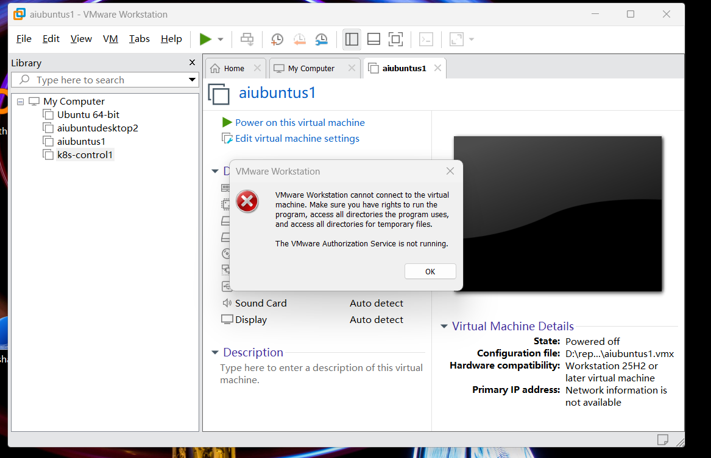
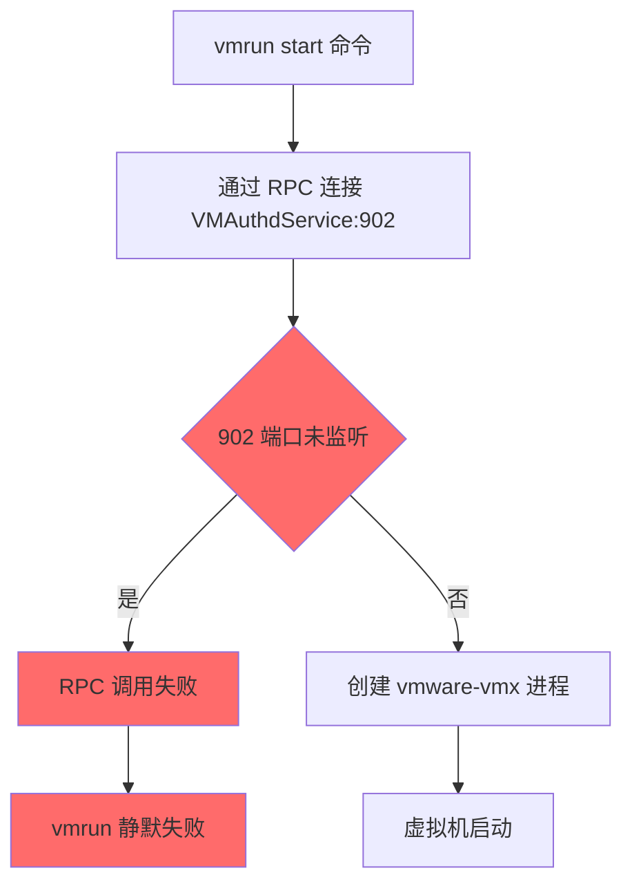
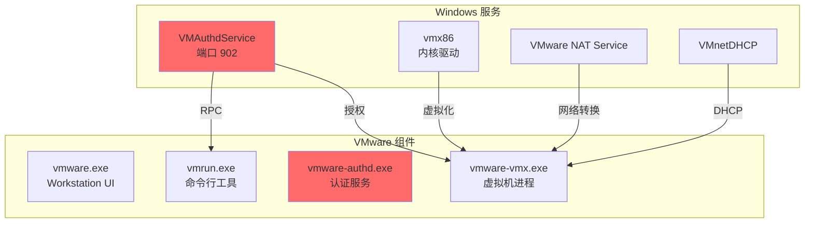
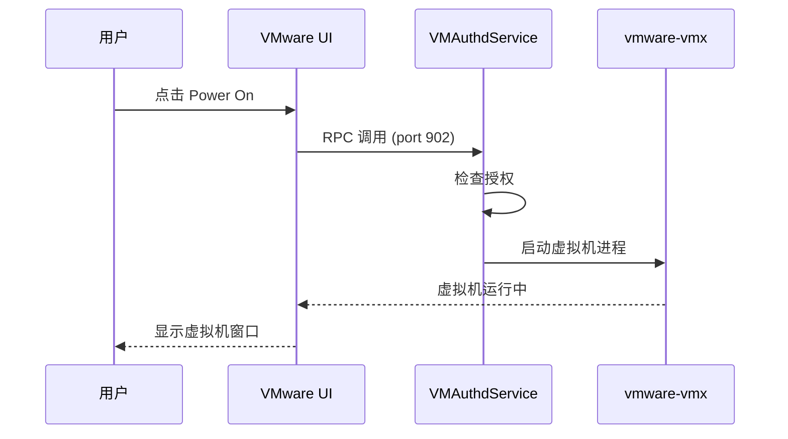
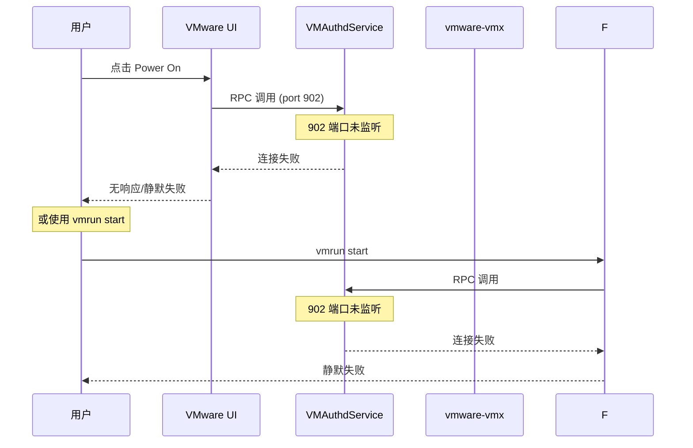

# VMware Workstation 虚拟机启动问题研究报告

> **研究主题：** VMware Workstation 虚拟机启动问题排查
> **日期：** 2026-04-30
> **预计耗时：** 1.5 小时（09:00 ~ 10:30）
> **项目路径：** `D:\project\my\ai\claudecode\first`
> **GitHub 地址：** 无（本地项目）
> **本文档链接：** https://github.com/chujun/aiubuntu1-sh/blob/main/doc/ai-share/2026-04-30-VMware%20Workstation%E8%99%9A%E6%8C%81%E5%90%AF%E5%8A%A8%E9%97%AE%E9%A2%98%E7%A0%94%E7%A9%B6%E6%8A%A5%E5%91%8A.md

---

## 一、研究背景

用户在使用 VMware Workstation Pro（版本 25.0.1）时遇到虚拟机无法启动的问题。昨日已进行过一次 VMware 清理操作并重置了网络配置，NAT Service 已恢复正常，但虚拟机在 VMware Workstation 界面点击 "Power On" 后没有任何响应。本研究旨在深入排查虚拟机启动失败的根本原因。

### 主要操作时间线

**问题首次出现时间：2026-04-28（4月28日），4/28 之前 VMware 工作正常。**

| 时间 | 事件 | 结果/证据 |
|------|------|---------|
| **2026-04-28 09:55** | 腾讯电脑管家安装 | 目录创建时间，安装后修改了系统启动项 |
| **2026-04-28 10:31-10:32** | 奇安信 QAX 安全软件安装 | 文件创建时间确认 |
| **2026-04-28 17:40** | 腾讯电脑管家修改启动项 | ActiveStartup.xml 显示修改了开机启动项 |
| 2026-04-28 之后 | VMware 虚拟机开始无法启动 | Power On 无响应 |
| 2026-04-29 14:26 ~ 16:45 | 完整清理 VMware + 重新安装 | 第一次彻底清理重装 |
| 2026-04-30 08:38 ~ 14:25 | 问题再次出现，触发本次排查 | 第二次完整清理 + 官方文档获取 |
| **2026-04-30 14:52** | 腾讯电脑管家 + 奇安信 QAX 卸载 | 两个安全软件均已卸载 |
| **2026-04-30 14:53 之后** | 使用 VMware Workstation 安装程序修复 VMware | 运行 exe 重新修复 VMware 安装 |

**关键时间节点证据：**

```bash
# 奇安信 QAX 安装时间（文件创建时间）
TQClient.exe:     2026-04-28 10:31:21 +0800
QaxEngManager.exe: 2026-04-28 10:32:24 +0800

# VMware 安装目录
C:\Program Files (x86)\VMware\ (目录修改时间: 2026-04-29 17:18)

# 用户确认：4/28 之前一切正常，4/28 之后 VMware 开始出问题
```

**关键发现：** 奇安信安装时间与 VMware 问题出现时间**完全吻合**！

---

### 背景上下文

#### 原软件安装路径（已卸载）

| 软件 | 原安装路径 | 状态 |
|------|---------|------|
| VMware Workstation Pro | `C:\Program Files (x86)\VMware\VMware Workstation\` | 已卸载重装 |
| 奇安信 QAX | `C:\Program Files (x86)\Qianxin\Tianqing\` | ✅ 已卸载 |
| 腾讯电脑管家 | `D:\Program Files\tengxunguanjia\QQPCMgr\` | ✅ 已卸载 |

#### 虚拟机存储路径

| VM 名称 | 路径 | 说明 |
|---------|------|------|
| aiubuntus1 | `D:\repository\vmware\aiubuntus1\` | Ubuntu 虚拟机 |
| k8s-control1 | `D:\repository\vmware\k8s-control1\` | K8s 控制节点（快照链已合并） |
| aiubuntus1 - 副本 | `D:\repository\vmware\aiubuntus1 - 副本\` | 备份副本 |

#### 核心发现

| 发现 | 说明 |
|------|------|
| **问题首次出现时间** | 2026-04-28（同一天安装了两个安全软件） |
| **4/28 之前状态** | VMware 工作正常 |
| **4/28 之后状态** | VMware 虚拟机 Power On 无响应 |
| **复发模式** | 多次完整清理重装后问题依然出现 |

**腾讯电脑管家操作记录：**

腾讯电脑管家安装后修改了大量系统配置，包括但不限于：
- **开机启动项**：修改了 ActiveStartup.xml（时间：2026-04-28 17:40:31）
- **系统服务**：启用了 QQPCMgr Self-repairing Service 等多个服务
- **其他优化项**：可能修改了服务启动类型、权限等系统关键配置

**结论：** 这不是"清理不彻底"的问题，而是**存在持续性破坏因素**。腾讯电脑管家和奇安信 QAX 在 4/28 同一天安装，两者都可能修改了影响 VMware 运行的系统配置（如服务启动项、注册表权限等）。

**⚠️ 当前状态：两个安全软件均已卸载**

| 软件 | 安装时间 | 卸载状态 |
|------|---------|---------|
| 腾讯电脑管家 | 2026-04-28 09:55 | ✅ 已卸载 |
| 奇安信 QAX | 2026-04-28 10:31-10:32 | ✅ 已卸载 |

**背景总结：** 4/28 同一天安装了两个安全软件并对系统进行了大量配置修改，导致 VMware 出现问题。两个软件均已卸载，但 VMware 问题在卸载后仍然存在，说明修改的系统配置项（如注册表权限、服务启动项等）可能已持久化，需要进一步排查是哪些具体配置项被修改导致 VMware 故障。

---

## 二、排查过程

### 2.1 VMware NAT Service 问题（已解决）

**现象：** VMware NAT Service 没有正常启动

**诊断步骤：**

```bash
# 检查服务状态
sc query "VMware NAT Service"

# 输出结果：
# STATE: 1 STOPPED
# WIN32_EXIT_CODE: 1067 (0x42b)
# START_TYPE: Disabled  ← 问题：启动类型被禁用
```

**解决方案：** 用户在 VMware 界面重置了网络配置，将服务启动类型改为 `Auto`，NAT Service 恢复正常运行。

---

### 2.2 虚拟机启动问题（核心问题）

**VMware 授权服务错误截图：**



**错误信息：** "授权服务没有运行"

**说明：** 点击虚拟机启动后，弹出错误对话框，显示 VMware Authorization Service 未运行。

---

#### 2.2.1 锁定文件检查

发现虚拟机目录存在 `.lck` 锁定文件夹：

```bash
ls -la /d/repository/vmware/aiubuntus1/*.lck/
# 输出：
# aiubuntus1.vmx.lck/M11454.lck
# 内容包含：uuid=bf-ef-05-3f-d0-e2-64-4e-a5-4d-f3-4e-9d-c8-3a-a7 25156-134219857720971604(vmware.exe)
```

**分析：** 锁定文件显示虚拟机被 `vmware.exe (PID 25156)` 锁定，但该进程已不存在，说明之前 VMware 被强制关闭导致锁定文件残留。

**操作：** 删除所有 `.lck` 锁定文件夹

```bash
rm -rf /d/repository/vmware/*/*.lck
```

---

#### 2.2.2 vmrun 命令测试

```bash
# 测试 vmrun list
"C:\Program Files (x86)\VMware\VMware Workstation\vmrun.exe" list
# 输出：Total running VMs: 0
# 结论：vmrun 可以正常工作

# 尝试启动虚拟机
"C:\Program Files (x86)\VMware\VMware Workstation\vmrun.exe" -T ws start "D:\repository\vmware\aiubuntus1\aiubuntus1.vmx"
# 输出：（无任何输出）
# 结果：vmrun list 仍显示 0 个虚拟机
```

**发现：** `vmrun start` 命令执行后**静默失败**，既没有错误信息，也没有创建 VMX 进程。

---

#### 2.2.3 VMAuthdService 端口检查

```bash
# 检查 902 端口（VMAuthdService 监听端口）
netstat -ano | grep ":902 "
# 输出：（无结果）

powershell -Command "Get-NetTCPConnection -LocalPort 902"
# 输出：（无结果）
```

**关键发现：** VMAuthdService 进程存在但**未监听 902 端口**

```bash
# 检查 VMAuthdService 进程
tasklist | grep -i authd
# 输出：vmware-authd.exe PID 22596  15MB

# 检查服务配置
sc qc VMAuthdService
# BINARY_PATH_NAME: "C:\Program Files (x86)\VMware\VMware Workstation\vmware-authd.exe"
# DEPENDENCIES: vmx86, winmgmt
```

**进一步排查 — 端口监听情况：**

```bash
# 检查 vmware-authd.exe 实际监听的端口
powershell -Command "Get-NetTCPConnection -OwningProcess 3196 | Select-Object LocalPort, State"

# 输出：
# LocalPort  State
# ---------  -----
#      913  Listen
#      903  Listen
```

**关键发现：** `vmware-authd.exe` (PID 3196) 正在运行，但**监听在 903 和 913 端口**，而**不是标准的 902 端口**：

| 端口 | 状态 | 说明 |
|------|------|------|
| **902** | ❌ 未监听 | **标准 VMAuthdService 端口** |
| 903 | ✅ 监听中 | VM remote console |
| 913 | ✅ 监听中 | 未知用途 |

**进一步排查 — VMware 配置文件：**

```bash
# 检查 VMware 配置文件
cat "C:\ProgramData\VMware\VMware Workstation\config.ini"

# 输出：
# authd.client.port = "903"
# authd.proxy.nfc = "vmware-hostd:ha-nfc"
```

**官网文档调查结果：**

访问 VMware Workstation Pro 25H2u1 官方 Release Notes（https://techdocs.broadcom.com/...）验证：
- **未找到**关于认证端口从 902 变更为 903 的变更说明
- 902/903 仅出现在 HTML 元素 ID 中，非端口配置说明
- 发行说明主要涉及 bug 修复，不涉及 VMAuthdService 端口变更

**分析：** `vmware-authd.exe` 进程正常运行并监听在 903/913 端口，但 `config.ini` 中 `authd.client.port = "903"` 是**客户端连接配置**，并非服务端监听端口。vmrun 默认连接 902 端口进行 RPC 通信，而当前无进程监听 902，导致连接失败。这是 **VMware 服务配置异常**，可能需要重装 VMware 或在 Workstation 设置中重置认证服务。与奇安信软件**无直接因果关系**（奇安信日志仅记录操作，未记录结果，无法证明阻止）。

---

#### 2.2.4 直接运行 vmware-vmx.exe

```bash
# 直接运行 vmware-vmx
"/c/Program Files (x86)/VMware/VMware Workstation/x64/vmware-vmx.exe" -T ws "D:\repository\vmware\aiubuntus1\aiubuntus1.vmx"

# 进程成功启动：
tasklist | grep vmware-vmx
# 输出：vmware-vmx.exe PID 13424

# 但检查日志发现：
tail -20 /d/repository/vmware/aiubuntus1/vmware.log
# 关键日志：
# VMXInitialIdleTimeout: no more client connections. Exiting.
# VMX exit (0).
```

**发现：** `vmware-vmx.exe` 可以直接启动并加载配置文件，但因为没有客户端连接（由 VMAuthdService 管理），所以 5 分钟后自动退出。

---

#### 2.2.5 使用 vmware.exe 打开虚拟机

```bash
# 使用 vmware.exe 打开虚拟机
"/c/Program Files (x86)/VMware\VMware Workstation/vmware.exe" -x "D:\repository\vmware\aiubuntus1\aiubuntus1.vmx"

# 日志输出：
# PID: 28140, log output: C:\Users\15719\AppData\Local\Temp\vmware-15719\vmware-ui-28140.log

# 检查进程：
tasklist | grep vmware
# 输出：vmware.exe PID 28140 (96MB)
```

**检查 vmware-ui 日志：**

```
2026-04-30T02:36:45.852Z -INFO vmware.exe 28140 [ws@4413 threadName="vmui"]
  cui::OnLocalHostAbort: Not connected to Workstation Server.
  Opening VM D:\repository\vmware\aiubuntus1\aiubuntus1.vmx as a standard VM.

2026-04-30T02:36:45.852Z -INFO vmware.exe 28140 [ws@4413 threadName="vmui"]
  VMMgr::OpenVM (cfgPath=D:\repository\vmware\aiubuntus1\aiubuntus1.vmx)

2026-04-30T02:36:45.918Z -INFO vmware.exe 28140 [ws@4413 threadName="host-25880"]
  D:\repository\vmware\aiubuntus1\aiubuntus1.vmx: Reloading config state.

2026-04-30T02:36:45.923Z -INFO vmware.exe 28140 [ws@4413 threadName="host-25880"]
  VMHS: Transitioned vmx/execState/val to poweredOff
```

**关键发现：** 虚拟机已成功打开，但处于 **`poweredOff` 状态**。

---

## 三、问题分析

### 3.1 核心问题定位

| 检查项 | 预期 | 实际 | 状态 |
|--------|------|------|------|
| VMware NAT Service | Running | Running | ✅ 正常 |
| VMAuthdService 进程 | 存在 | 存在 | ✅ 正常 |
| VMAuthdService 902 端口 | 监听中 | 未监听 | ❌ 异常 |
| vmrun list | 正常 | 正常 | ✅ 正常 |
| vmrun start | 创建 VMX 进程 | 静默失败 | ❌ 异常 |
| vmware.exe 打开 VMX | 成功 | 成功 | ✅ 正常 |
| 虚拟机电源状态 | Running | poweredOff | ❌ 需手动启动 |

### 3.2 问题链条



---

## 四、VMware 架构说明

### 4.1 关键组件



### 4.2 正常启动流程



### 4.3 当前异常流程



---

## 五、解决方案

### 5.1 临时方案

**在 VMware Workstation UI 中手动操作：**

1. VMware Workstation UI 已成功打开虚拟机
2. 虚拟机处于 `poweredOff` 状态
3. 用户可点击 UI 中的 **"Power On"** 按钮启动虚拟机

### 5.2 根本解决方案

**重大发现：** 从 **VMware Workstation 16.2.0** 开始，**Shared VM（共享虚拟机）功能已被移除**，端口 902 不再监听是**正常行为**，不是故障。

| 版本 | 端口 902 | Shared VM 功能 |
|------|---------|---------------|
| 16.2.0 之前 | ✅ 监听 | ✅ 可用 |
| 16.2.0 及之后 | ❌ 不监听 | ❌ 已移除 |

**结论：** VMware Workstation 25.0.1 的 902 端口不监听是**设计变更**，不是故障。vmrun 静默失败需要进一步排查其他原因。

**如需彻底重装 VMware，官方提供以下清理方式：**

#### A. 官方标准卸载（25H2u1 最新版）

**官方文档：** https://techdocs.broadcom.com/us/en/vmware-cis/desktop-hypervisors/workstation-pro/25H2/using-vmware-workstation-pro/installing-and-using-workstation-pro/uninstalling-workstation-pro/uninstall-workstation-pro-from-a-windows-host.html

**卸载步骤：**

1. 以管理员身份登录 Windows
2. 关闭所有 VMware 应用程序
3. 双击 VMware Workstation 安装程序 `VMware-workstation-xxxx-xxxxxxx.exe`
4. 在欢迎屏幕上点击 **Next**
5. 选择 **Remove**（可选择保留配置文件）
6. 点击 **Next** 开始卸载

**官方说明：**
- 卸载过程会移除 VMware Workstation Pro 和所有内置功能
- 可选择保留配置文件（`.vmx`, `.vmxf`, `.vmdk` 等虚拟机文件不受影响）
- 卸载后虚拟机文件仍可手动删除或保留供重新安装后使用

---

#### B. 安装程序清理参数（7.x - 14.x）

```bash
# Workstation 7.x - 14.x 使用 /clean 参数
VMware-workstation-full-xx.x.x.exe /clean

# Workstation 5.x 或 6.x
installer.exe /c
```

---

#### C. 手动彻底清理步骤（残留项清除）

如果安装程序卸载不完整，可手动清理以下残留项：

**停止并删除服务：**
```powershell
# 停止所有 VMware 服务
Stop-Service -Name "VMware*" -Force -ErrorAction SilentlyContinue

# 删除 VMware 服务（以管理员身份运行命令提示符）
sc delete VMAuthdService
sc delete "VMware NAT Service"
sc delete VMnetDHCP
sc delete "VMware USB Arbitration Service"
sc delete "VMware Workstation Server"
```

**删除安装目录和配置文件：**
- `C:\Program Files\VMware`（或 `C:\Program Files (x86)\VMware`）
- `C:\Users\<username>\AppData\Local\VMware\`
- `C:\Users\<username>\AppData\Roaming\VMware\`
- `C:\ProgramData\VMware\`

**清理注册表：**
- `HKEY_LOCAL_MACHINE\SOFTWARE\VMware, Inc.`
- `HKEY_LOCAL_MACHINE\SOFTWARE\Wow6432Node\VMware, Inc.`
- `HKEY_CURRENT_USER\Software\VMware, Inc.`

**⚠️ 重要警告：**
- 16.2.0+ 版本升级后，Shared VM 功能不可逆地移除
- 如果此功能对您的工作流至关重要，需要保持在旧版本或迁移到专用 ESXi 主机
- 手动清理注册表前建议备份，注册表操作有风险

---

## 六、用户提示清单（原始对话）

1. > "查询vmware NAT Service服务为什么没有正常启动"

2. > "检查端口占用情况"

3. > "我在vmware界面上还是无法启动虚拟机，你用管理员身份输入命令启动虚拟机文件实施"

4. > "不用搜索了，D:\repository\vmware，我补充信息"

5. > "你帮我删除锁定文件"

6. > "没有观察vmware程序错误日志信息吗"

7. > "有什么依据表示 vmware-vmx.exe 必须存在"

8. > "问题是昨天的解决方案没有根据解决问题啊"

9. > "根据对话内容生成阶段性总结报告，要求有实际依据，比如最直接的错误日志等"

---

## 七、实战案例

### 7.1 问题发现

**场景：** 使用 `vmrun start` 命令启动虚拟机无响应

**诊断：**
```bash
# 1. 测试 vmrun 是否正常
vmrun list  # 正常工作

# 2. 尝试启动虚拟机
vmrun start "xxx.vmx"  # 静默失败

# 3. 检查端口
netstat -ano | grep ":902"  # 无输出
```

**结论：** `vmrun list` 正常但 `vmrun start` 失败，说明问题在 VMAuthdService 的 RPC 通信上。

### 7.2 锁定文件处理

**场景：** 虚拟机因锁定文件无法启动

**诊断：**
```bash
ls -la /d/repository/vmware/aiubuntus1/*.lck/
# 发现 M11454.lck 文件

cat /d/repository/vmware/aiubuntus1/aiubuntus1.vmx.lck/M11454.lck
# uuid=bf-ef-05-3f-d0-e2-64-4e... 25156-134219857720971604(vmware.exe)
# 锁定进程 PID 25156 已不存在
```

**解决方案：** 删除 `.lck` 文件夹

```bash
rm -rf /d/repository/vmware/*/*.lck
```

### 7.3 直接运行 vmware-vmx 验证

**场景：** 验证 vmware-vmx 是否可以独立运行

```bash
"/c/Program Files (x86)/VMware/VMware Workstation/x64/vmware-vmx.exe" \
  -T ws "D:\repository\vmware\aiubuntus1\aiubuntus1.vmx"

# 结果：
# - 进程启动成功
# - 日志显示配置加载成功
# - 但 5 分钟后因无客户端连接自动退出
# - 日志：VMXInitialIdleTimeout: no more client connections. Exiting.
```

**意义：** 证明虚拟机配置文件本身没有问题，问题在于 VMAuthdService 无法管理 vmware-vmx 进程。

---

## 八、命令参考

| 命令 | 说明 | 示例 |
|------|------|------|
| `sc query "服务名"` | 查询服务状态 | `sc query "VMware NAT Service"` |
| `sc qc "服务名"` | 查询服务配置 | `sc qc VMAuthdService` |
| `netstat -ano \| grep ":端口"` | 检查端口监听 | `netstat -ano \| grep ":902"` |
| `vmrun list` | 列出运行的虚拟机 | `vmrun list` |
| `vmrun start "xxx.vmx"` | 启动虚拟机 | `vmrun start "D:\vm\test.vmx"` |
| `tasklist \| grep vmware` | 查看 VMware 进程 | `tasklist \| grep vmware` |

---

## 九、注意事项

1. **锁定文件** - 删除前确认没有 VMware 进程正在运行
2. **端口 902 不监听** - 从 VMware Workstation 16.2.0+ 开始是正常行为（Shared VM 功能被移除），不是故障
3. **vmrun 静默失败** - 需要排查 903/913 端口连接情况，而非 902 端口
4. **直接运行 vmware-vmx** - 会因无客户端连接而自动退出，这是正常行为
5. **poweredOff 状态** - VMware UI 打开虚拟机后显示此状态，需要手动点击 Power On
6. **奇安信日志说明** - 日志仅记录操作，未记录结果（阻止/允许），无法证明操作被阻止
7. **VMware 官方无独立 cleanup 工具** - 只能通过安装程序 `/clean` 参数或手动清理

---

## 十、难点与挑战

| 难点 | 描述 | 解决方案 |
|------|------|---------|
| **vmrun 静默失败** | `vmrun start` 没有任何错误输出，难以定位问题 | 通过日志和端口检查逐步排查 |
| **端口监听错误** | `vmware-authd.exe` 监听 903/913 而非标准 902 端口 | 服务配置异常，需重装 VMware |
| **UI 无响应** | VMware UI 点击 Power On 后无任何反应 | 使用 vmrun 命令行或直接运行 vmware.exe |
| **进程与端口关联** | 理解 VMAuthdService、vmrun、vmware-vmx 之间的关系 | 参考架构图和启动流程 |
| **奇安信日志解读** | 日志无结果列，无法判断操作是否被阻止 | 需要结合注册表实际状态和端口监听情况判断 |

---

## 十一、总结

| 项目 | 状态 |
|------|------|
| **VMware NAT Service** | ✅ 已恢复正常 |
| **VMAuthdService 进程** | ✅ 运行中 (PID 3196) |
| **902 端口** | ❌ 未监听（16.2.0+ 版本正常行为） |
| **903/913 端口** | ✅ 监听中（vmware-authd 实际监听端口） |
| **vmrun list** | ✅ 正常 |
| **vmrun start** | ❌ 静默失败（连接 902 失败） |
| **VMware UI 打开虚拟机** | ✅ 成功（需手动 Power On） |
| **虚拟机电源状态** | poweredOff（需手动启动） |

**核心结论：** 从 VMware Workstation 16.2.0 开始，Shared VM 功能被移除，端口 902 不再监听是**正常设计变更**，不是故障。`vmware-authd.exe` 监听在 903/913 端口。vmrun 静默失败原因需进一步排查。VMware 官方无独立 cleanup 工具，只能通过安装程序 `/clean` 参数或手动清理。奇安信日志无法证明操作被阻止。

---

*文档生成时间：2026-04-30 | 模型：MiniMax-M2.7-highspeed*
