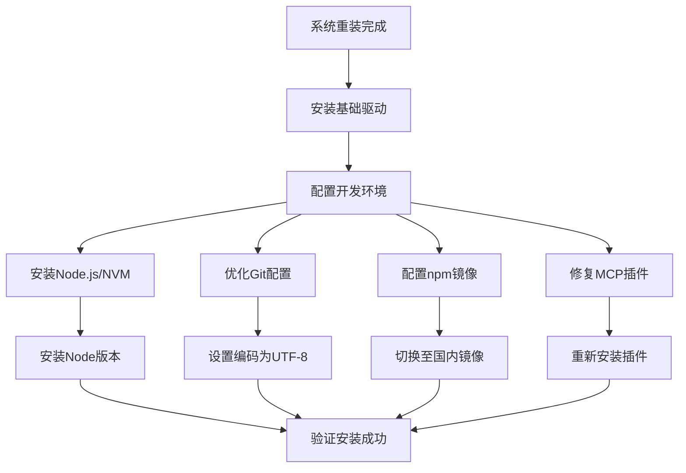
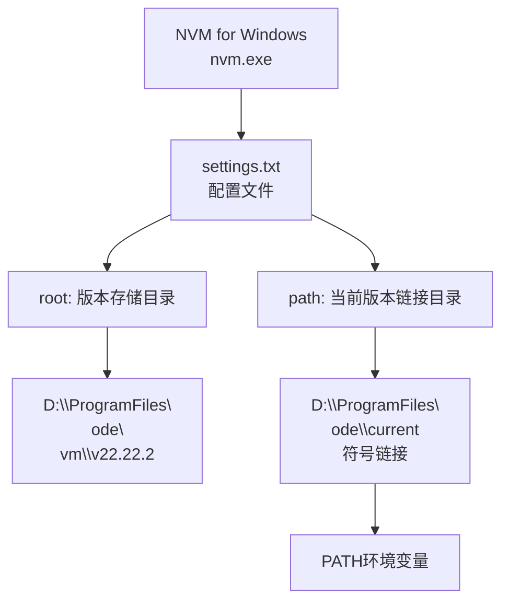
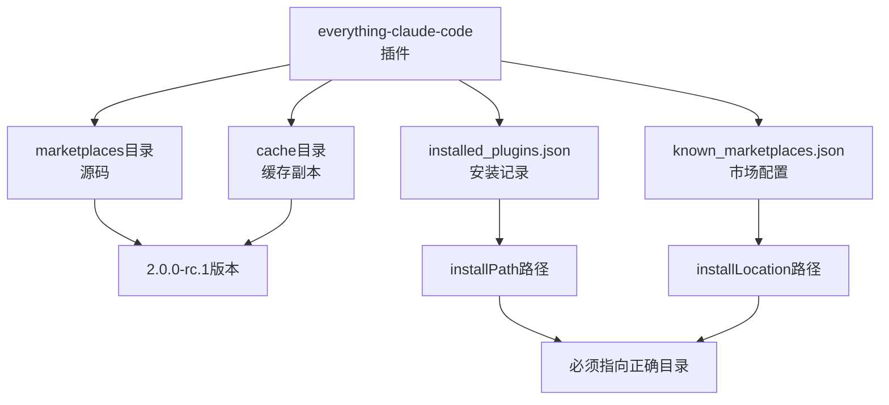
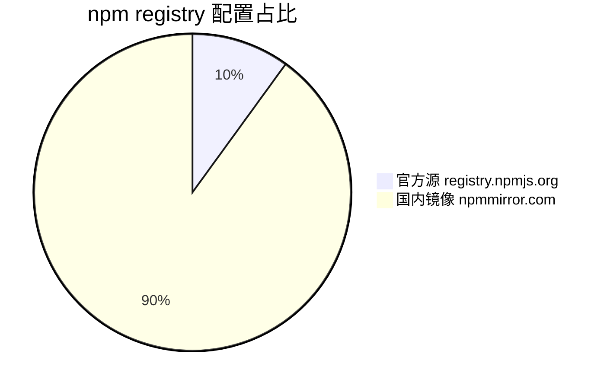
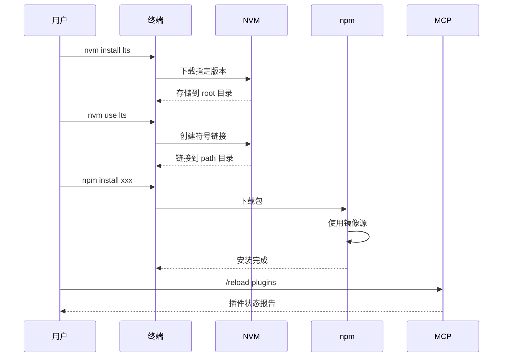
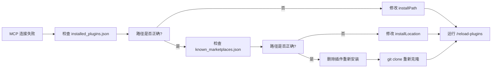

# 操作系统Window11重装手册研究报告

> **研究主题：** 操作系统Window11重装手册
> **日期：** 2026-05-02（第二版）
> **预计耗时：** 0.5 小时（09:30 ~ 10:00）
> **项目路径：** `D:\project\my\aiubuntu1-sh`
> **GitHub 地址：** git@github.com:chujun/aiubuntu1-sh.git
> **本文档链接：** https://github.com/chujun/aiubuntu1-sh/blob/main/doc/ai-share/2026-05-02-%E6%93%8D%E4%BD%9C%E7%B3%BB%E7%BB%9Fwindow11%E9%87%8D%E8%A3%85%E6%89%8B%E5%86%8C%E7%A0%94%E7%A9%B6%E6%8A%A5%E5%91%8A.md

---

## 目录

- [零、前置操作](#零前置操作)
- [一、研究概述](#一研究概述)
- [二、工作原理](#二工作原理)
- [三、核心概念](#三核心概念)
- [四、应用场景](#四应用场景)
- [五、命令参考](#五命令参考)
- [六、注意事项](#六注意事项)
- [七、实战案例](#七实战案例)
- [八、相关工具对比](#八相关工具对比)
- [九、用户提示词清单](#九用户提示词清单)
- [十、难点与挑战](#十难点与挑战)
- [十一、经验总结](#十一经验总结)

---

## 零、前置操作

Windows 11 重装后，在执行本手册优化配置前，需先完成以下基础软件的手动安装和数据迁移。

### 0.1 必装软件清单

| 序号 | 软件 | 版本要求 | 用途 | 安装方式 | 下载地址 | 后置配置 |
|------|------|---------|------|----------|----------|----------|
| 1 | Git | 最新版 | 版本控制 | 官网下载 | https://git-scm.com/download/win | 优化 Git 编码（见 5.3 节） |
| 2 | Google Chrome | 最新版 | 浏览器 | 官网下载 | https://www.google.com/chrome/ | 登录账号同步 |
| 3 | Python 3 | 3.10+ | 开发环境 | 官网下载 | https://www.python.org/downloads/ | 配置 pip 镜像（见下方） |
| 4 | Windows Terminal | 最新版 | 终端 | Microsoft Store | 搜索 "Windows Terminal" | 配置默认终端 |
| 5 | V2RayN | 最新版 | 代理工具 | GitHub 下载 | https://github.com/2dust/v2rayn/releases | 配置代理服务器 |
| 6 | 飞书 | 最新版 | 办公通讯 | 官网下载 | https://www.feishu.cn/download | 登录账号 |
| 7 | 7-Zip | 最新版 | 压缩工具 | 官网下载 | https://www.7-zip.org/download.html | 关联文件格式 |
| 8 | Sublime Text | 最新版 | 代码编辑器 | 官网下载 | https://www.sublimetext.com/ | 安装 Package Control |
| 9 | Everything | 最新版 | 文件搜索 | 官网下载 | https://www.voidtools.com/downloads/ | 开机启动配置 |
| 10 | VMware Workstation | 17+ | 虚拟机 | 官网下载 | https://www.vmware.com/products/workstation-pro.html | 导入旧虚拟机 |
| 11 | CC Switcher | 最新版 | 代理切换 | GitHub 下载 | https://github.com/search?q=cc+switcher+windows | 配置代理规则 |
| 12 | Claude Code | 最新版 | AI 编程助手 | 官网下载 | https://claude.com/download | 迁移插件数据（见 0.2） |
| 13 | NVM for Windows | 最新版 | Node 版本管理 | winget/官网 | https://github.com/coreybutler/nvm-windows | 配置存储路径 |
| 14 | Node.js | LTS/22 | JavaScript 运行时 | NVM 安装 | 通过 NVM 安装 | 配置 npm 镜像 |
| 15 | npm | 最新版 | 包管理器 | 随 Node 附赠 | — | 切换至 npmmirror |
| 16 | Windows Sandbox | 最新版 | 沙盒环境 | Windows 功能 | 启用 Windows 功能 "沙盒" | 测试软件用 |
| 17 | VS Code | 最新版 | IDE 编辑器 | 官网下载 | https://code.visualstudio.com/Download | 配置同步设置 |
| 18 | Notepad++ | 最新版 | 文本编辑器 | 官网下载 | https://notepad-plus-plus.org/downloads/ | 配置自动更新 |
| 19 | Bandizip | 最新版 | 压缩工具备选 | 官网下载 | https://www.bandizip.com/ | 关联压缩格式 |
| 20 | PowerShell | 7+ | 高级终端 | GitHub/ winget | https://github.com/PowerShell/PowerShell/releases | 配置别名 |

### 0.1.1 核心软件版本优先级

```
P0（系统重装后第一时间安装）:
├── Git          # 版本控制，所有项目的基础
├── Chrome       # 浏览器，下载其他软件的入口
├── Claude Code  # AI 编程助手，后续工作依赖
├── NVM + Node   # JavaScript 运行时环境
└── V2RayN      # 代理工具，下载加速必备

P1（日常开发必备）:
├── Windows Terminal  # 现代化终端
├── VS Code          # 代码编辑器
├── Sublime Text     # 轻量编辑器备选
└── Python 3         # Python 开发环境

P2（提升效率工具）:
├── 7-Zip / Bandizip  # 压缩工具
├── Everything         # 文件搜索
├── Notepad++         # 快速文本编辑
├── PowerShell 7+     # 高级终端
└── 飞书              # 办公通讯

P3（特定场景）:
├── VMware Workstation  # 虚拟机
└── CC Switcher         # 多代理切换
```

### 0.2 数据迁移清单

从旧系统迁移以下数据目录和配置文件：

| 序号 | 数据项 | 源路径 | 目标路径 | 说明 |
|------|--------|--------|----------|------|
| 1 | Claude Code 配置目录 | `C:\Users\{旧用户}\.claude` | `C:\Users\cj\.claude` | 插件、记忆、规则 |
| 2 | Claude Code 全局设置 | `C:\Users\{旧用户}\.claude.json` | `C:\Users\cj\.claude.json` | 全局配置 |
| 3 | Claude Code 项目数据 | `C:\Users\{旧用户}\AppData\Roaming\Claude` | `C:\Users\cj\AppData\Roaming\Claude` | 项目数据 |
| 4 | NVM 配置 | `C:\Users\{旧用户}\AppData\Local\nvm\settings.txt` | `C:\Users\cj\AppData\Local\nvm\settings.txt` | 版本存储路径 |
| 5 | npm 配置 | `C:\Users\{旧用户}\.npmrc` | `C:\Users\cj\.npmrc` | 镜像源配置 |
| 6 | Git 配置 | `C:\Users\{旧用户}\.gitconfig` | `C:\Users\cj\.gitconfig` | 用户信息、编码设置 |
| 7 | SSH 密钥 | `C:\Users\{旧用户}\.ssh` | `C:\Users\cj\.ssh` | GitHub 认证 |
| 8 | Sublime Text 配置 | `C:\Users\{旧用户}\AppData\Roaming\Sublime Text` | `C:\Users\cj\AppData\Roaming\Sublime Text` | 用户配置、插件 |
| 9 | VS Code 配置 | `C:\Users\{旧用户}\AppData\Roaming\Code` | `C:\Users\cj\AppData\Roaming\Code` | 设置同步 |
| 10 | Everything 配置 | `C:\Users\{旧用户}\AppData\Roaming\Everything` | `C:\Users\cj\AppData\Roaming\Everything` | 索引配置 |

**迁移步骤：**

```bash
# 1. 在旧系统执行备份（建议使用外部存储）
xcopy /E /H /I "C:\Users\{旧用户}\.claude" "D:\Backup\.claude"
xcopy /E /H /I "C:\Users\{旧用户}\.ssh" "D:\Backup\.ssh"
xcopy /H "C:\Users\{旧用户名}\.claude.json" "D:\Backup\.claude.json"
xcopy /H "C:\Users\{旧用户名}\.gitconfig" "D:\Backup\.gitconfig"
xcopy /H "C:\Users\{旧用户名}\.npmrc" "D:\Backup\.npmrc"
xcopy /E /H /I "C:\Users\{旧用户}\AppData\Roaming\Sublime Text" "D:\Backup\SublimeText"
xcopy /E /H /I "C:\Users\{旧用户}\AppData\Roaming\Claude" "D:\Backup\Claude"
xcopy /E /H /I "C:\Users\{旧用户}\AppData\Roaming\Everything" "D:\Backup\Everything"

# 2. 在新系统恢复数据
xcopy /E /H /I "D:\Backup\.claude" "C:\Users\cj\.claude"
xcopy /E /H /I "D:\Backup\.ssh" "C:\Users\cj\.ssh"
xcopy /H "D:\Backup\.claude.json" "C:\Users\cj\.claude.json"
xcopy /H "D:\Backup\.gitconfig" "C:\Users\cj\.gitconfig"
xcopy /H "D:\Backup\.npmrc" "C:\Users\cj\.npmrc"
xcopy /E /H /I "D:\Backup\SublimeText" "C:\Users\cj\AppData\Roaming\Sublime Text"
xcopy /E /H /I "D:\Backup\Claude" "C:\Users\cj\AppData\Roaming\Claude"
xcopy /E /H /I "D:\Backup\Everything" "C:\Users\cj\AppData\Roaming\Everything"

# 3. 修复路径问题（关键步骤）
# 用户名从 {旧用户} 变更为 cj 后，需批量替换以下文件中的路径:
#   - .claude/plugins/installed_plugins.json
#   - .claude/plugins/known_marketplaces.json
#   - .claude/mcp-health-cache.json
#   - .claude.json
#   - AppData\Local\nvm\settings.txt（如已迁移）

# 4. 验证迁移完整性
dir "C:\Users\cj\.claude" /s /b | find /c "\"
git config --global --list
npm config list
```

**路径批量修复命令（PowerShell）：**

```powershell
# 修复 JSON 配置文件中的旧用户名
$oldUser = "{旧用户名}"
$newUser = "cj"
$files = @(
    "$env:USERPROFILE\.claude\plugins\installed_plugins.json",
    "$env:USERPROFILE\.claude\plugins\known_marketplaces.json",
    "$env:USERPROFILE\.claude\mcp-health-cache.json",
    "$env:USERPROFILE\.claude.json"
)

foreach ($file in $files) {
    if (Test-Path $file) {
        $content = Get-Content $file -Raw -Encoding UTF8
        $newContent = $content -replace [regex]::Escape($oldUser), $newUser
        Set-Content -Path $file -Value $newContent -Encoding UTF8 -NoNewline
        Write-Host "已修复: $file"
    }
}
```

### 0.3 前置操作检查清单

#### 阶段一：基础环境确认

- [ ] 确认系统版本（Windows 11 xxH2）
- [ ] 确认用户名（如 `cj`，旧用户名如 `15719`）
- [ ] 确认磁盘空间充足（系统盘建议 100GB+）
- [ ] 准备 U 盘或移动硬盘用于数据备份

#### 阶段二：数据备份（旧系统）

- [ ] 备份 `.claude` 配置目录
- [ ] 备份 `.claude.json` 全局设置
- [ ] 备份 `.ssh` 目录（GitHub 认证密钥）
- [ ] 备份 `.gitconfig`（用户信息）
- [ ] 备份 `.npmrc`（npm 镜像配置）
- [ ] 备份 `Sublime Text` 配置
- [ ] 备份 `Everything` 配置
- [ ] 备份 `VMware` 虚拟机文件（如有）
- [ ] 备份浏览器书签和密码
- [ ] 确认备份完整性（校验文件数量）

#### 阶段三：软件清单确认

**P0 核心工具（重装后第一时间安装）：**

- [ ] Git for Windows
- [ ] Google Chrome
- [ ] Claude Code
- [ ] V2RayN（代理工具）
- [ ] NVM for Windows
- [ ] Node.js (LTS)

**P1 开发必备：**

- [ ] Windows Terminal
- [ ] VS Code
- [ ] Python 3.10+
- [ ] Docker Desktop

**P2 效率工具：**

- [ ] Sublime Text
- [ ] 7-Zip / Bandizip
- [ ] Everything
- [ ] Notepad++
- [ ] PowerShell 7+

**P3 特定场景：**

- [ ] VMware Workstation
- [ ] CC Switcher
- [ ] 飞书

#### 阶段四：系统重装后恢复

- [ ] 安装所有 P0 核心工具
- [ ] 配置 V2RayN 代理
- [ ] 恢复 Claude Code 配置
- [ ] 修复用户名路径问题
- [ ] 安装 P1 开发工具
- [ ] 安装 P2 效率工具
- [ ] 安装 P3 特定工具
- [ ] 验证所有工具正常运行

#### 阶段五：最终验证

- [ ] `git config --global --list` 显示正确用户信息
- [ ] `node -v` 和 `npm -v` 正常
- [ ] Claude Code 插件全部正常加载
- [ ] MCP 服务器连接正常（`/mcp` 命令验证）
- [ ] 浏览器可正常访问 Google
- [ ] `Everything` 索引正常

---

## 一、研究概述

本报告总结操作系统重装后的必备配置与优化流程，涵盖开发环境搭建、常用工具配置、以及常见的路径问题修复。重装系统后，正确配置开发环境能显著提升工作效率。

主要解决问题：
- 插件路径修复（用户名变更导致）
- Node.js 版本管理工具安装与配置
- Git 命令行编码优化
- npm 下载源镜像配置
- Claude Code MCP 插件修复

---

## 二、工作原理

### 2.1 操作系统重装配置流程



### 2.2 NVM for Windows 架构



### 2.3 Claude Code 插件架构



### 2.4 npm 镜像配置机制



---

## 三、核心概念

| 概念 | 说明 |
|------|------|
| NVM | Node Version Manager，Node.js 版本管理工具 |
| settings.txt | NVM 配置文件，控制版本存储路径 |
| npm registry | npm 包下载源服务器地址 |
| i18n.commitEncoding | Git 提交信息编码配置 |
| core.quotepath | Git 路径显示是否转义 |
| MCP | Model Context Protocol，Claude Code 插件通信协议 |
| installed_plugins.json | Claude Code 插件安装记录文件 |

---

## 四、应用场景

### 4.1 场景矩阵

| 场景 | 适用性 | 用法 |
|------|--------|------|
| 新系统重装配置 | ✅ 适合 | 完整按此流程操作 |
| 用户名变更后修复 | ✅ 适合 | 修复插件路径配置 |
| Node 版本切换 | ✅ 适合 | 使用 nvm use 命令 |
| 国内加速 npm 下载 | ✅ 适合 | 配置 npmmirror 镜像 |
| MCP 插件连接失败 | ✅ 适合 | 重新安装插件 |

### 4.2 典型操作流程



### 4.3 MCP 插件修复流程



---

## 五、命令参考

### 5.1 NVM for Windows 命令

| 命令 | 说明 | 示例 |
|------|------|------|
| `nvm version` | 查看 NVM 版本 | `nvm version` |
| `nvm install <version>` | 安装指定版本 | `nvm install 22` |
| `nvm use <version>` | 切换到指定版本 | `nvm use 22.22.2` |
| `nvm list` | 列出已安装版本 | `nvm list` |
| `nvm on` | 启用 NVM | `nvm on` |
| `nvm off` | 禁用 NVM | `nvm off` |

### 5.2 npm 配置命令

| 命令 | 说明 | 示例 |
|------|------|------|
| `npm config set registry <url>` | 设置镜像源 | `npm config set registry https://registry.npmmirror.com` |
| `npm config get registry` | 查看当前镜像源 | `npm config get registry` |
| `npm config list` | 列出所有配置 | `npm config list` |

### 5.3 pip 镜像配置命令

| 命令 | 说明 | 示例 |
|------|------|------|
| `pip config set global.index-url https://mirrors.aliyun.com/pypi/simple/` | 设置阿里云镜像 | pip 安装加速 |
| `pip config set global.index-url https://pypi.tuna.tsinghua.edu.cn/simple` | 设置清华镜像 | 学术/教育网络 |
| `pip config list` | 查看当前 pip 配置 | 验证镜像是否生效 |
| `pip install <package>` | 安装包（使用镜像） | `pip install numpy` |

### 5.4 Git 编码优化命令

| 命令 | 说明 | 示例 |
|------|------|------|
| `git config --global i18n.commitEncoding utf-8` | 提交编码 | 设置提交编码为 UTF-8 |
| `git config --global i18n.logOutputEncoding utf-8` | 日志输出编码 | 设置日志输出为 UTF-8 |
| `git config --global core.quotepath false` | 路径显示 | 中文路径正常显示 |
| `git config --global core.autocrlf input` | 换行符处理 | Windows 下推荐配置 |

### 5.5 Claude Code 插件命令

| 命令 | 说明 | 示例 |
|------|------|------|
| `/reload-plugins` | 重新加载插件 | 验证插件状态 |
| `/plugin` | 查看插件信息 | 查看已安装插件 |
| `/mcp` | 查看 MCP 状态 | 查看 MCP 服务器连接状态 |

---

## 六、注意事项

| 注意点 | 说明 | 建议 |
|--------|------|------|
| NVM 安装路径 | 默认在 `AppData\Local\nvm` | 修改 settings.txt 自定义 |
| settings.txt 路径格式 | Windows 路径使用反斜杠 | `D:\ProgramFiles\node\nvm` |
| Node 版本存储位置 | 由 settings.txt 的 root 控制 | 与 path 区分开 |
| npm 镜像源 | 国内推荐 npmmirror | 显著提升下载速度 |
| 终端重启 | 配置修改后需重启终端 | 特别是 PATH 变更 |
| 插件路径修复 | 用户名变更后必须更新 | 检查所有配置文件 |
| MCP 重新安装 | 删除后需重新克隆 | 使用 git clone |

---

## 七、实战案例

### 案例 1：NVM 安装 Node.js 并配置自定义路径

**问题：** 系统重装后需要重新安装 Node.js，希望将版本文件存放到 D:\ProgramFiles\node 目录。

**解决：** 修改 NVM settings.txt 配置文件，指定 root 和 path 路径。

**步骤：**

```bash
# 1. 安装 NVM for Windows (使用 winget)
winget install --id CoreyButler.NVMforWindows -e --accept-source-agreements --accept-package-agreements

# 2. 修改 NVM 配置 (以管理员权限)
# 编辑 C:\Users\cj\AppData\Local\nvm\settings.txt
# 内容如下:
# root: D:\ProgramFiles\node\nvm
# path: D:\ProgramFiles\node\current

# 3. 安装 Node.js LTS
nvm install lts

# 4. 使用安装的版本
nvm use 24.15.0

# 5. 配置 npm 国内镜像
npm config set registry https://registry.npmmirror.com

# 6. 验证安装
node -v    # v24.15.0
npm -v     # 11.12.1
```

**结果：** Node.js 安装成功，版本文件存储在 D:\ProgramFiles\node\nvm\ 目录。

### 案例 2：修复 Claude Code MCP 插件连接失败

**问题：** Claude Code 中多个 MCP 服务器显示 ✘ failed 状态，无法正常使用插件功能。

**解决：** 重新安装 everything-claude-code 插件，修复路径和配置问题。

**步骤：**

```bash
# 1. 删除旧插件目录
rm -rf ~/.claude/plugins/marketplaces/everything-claude-code
rm -rf ~/.claude/plugins/cache/everything-claude-code

# 2. 重新克隆插件
cd ~/.claude/plugins/marketplaces
git clone https://github.com/affaan-m/everything-claude-code.git everything-claude-code

# 3. 创建缓存目录结构
mkdir -p ~/.claude/plugins/cache/everything-claude-code/everything-claude-code
cp -r ~/.claude/plugins/marketplaces/everything-claude-code/* ~/.claude/plugins/cache/everything-claude-code/everything-claude-code/

# 4. 更新安装记录
# 编辑 installed_plugins.json
# 修改 version 为 "2.0.0-rc.1"
# 修改 gitCommitSha 为新的 commit hash

# 5. 运行 /reload-plugins 验证
/reload-plugins
```

**结果：** 插件从 1.9.0 升级到 2.0.0-rc.1，MCP 连接状态恢复正常。

---

## 八、相关工具对比

| 工具 | 优点 | 缺点 | 适用场景 |
|------|------|------|---------|
| NVM for Windows | 轻量、安装简单 | 不支持 npm 管理 | Windows Node 版本切换 |
| nvm-windows (coreybutler) | 速度快、配置灵活 | 需要手动处理符号链接 | 日常开发环境 |
| n (n 命令行) | Unix/Linux 原生体验 | Windows 兼容性差 | Linux/Mac 开发 |

---

## 九、用户提示词清单（原文）

**提示词 1：**
```
修改坏损的插件
```

**提示词 2：**
```
继续修复坏损的插件，应该有很多这个路径问题
```

**提示词 3：**
```
powershell是不是有最新版的命令行窗口
```

**提示词 4：**
```
https://github.com/coreybutler/nvm-windows,帮我安装nvm
```

**提示词 5：**
```
nvm安装node
```

**提示词 6：**
```
nvm优化配置，node存放到指定路径下
```

**提示词 7：**
```
D:\ProgramFiles\node，node存放到这个目录下面
```

**提示词 8：**
```
帮我在安装一个node22版本
```

**提示词 9：**
```
node优化，下载地址有限使用国内镜像地址
```

**提示词 10：**
```
这个优化配置是存储在什么地方
```

**提示词 11：**
```
git命令行乱码问题优化
```

**提示词 12：**
```
需要
```

**提示词 13：**
```
nvm优化配置，node存放到指定路径下
```

**提示词 14：**
```
everything-claude-code整个重新安装吧
```

**提示词 15：**
```
补充新的优化，配置进文档
```

---

## 十、难点与挑战

| 难点 | 初始判断 | 实际根因 | 解决方法 |
|------|---------|---------|---------|
| NVM 命令找不到 | NVM 未安装成功 | 当前终端为 Git Bash，需要在 CMD/PowerShell 运行 | 使用完整路径调用 nvm.exe |
| 插件加载失败 | 插件本身损坏 | 用户名变更导致路径从 `C:\Users\15719` 变为 `C:\Users\cj` | 修改 installed_plugins.json 和 known_marketplaces.json |
| npm 下载慢 | 网络问题 | 默认源在国外 | 配置 npmmirror.com 镜像 |
| MCP 服务器连接失败 | 插件版本过旧 | 插件版本 1.9.0 与新版本不兼容 | 重新安装插件到 2.0.0-rc.1 |
| 配置文件路径错误 | 插件配置错误 | 用户名变更导致多处配置路径失效 | 批量搜索替换 `15719` 为 `cj` |
| playwright MCP 启动参数错误 | 命令行参数错误 | args 中包含 `/c` 导致命令执行失败 | 修改为标准 npx 命令格式 |

---

## 十一、经验总结

| 经验 | 核心教训 |
|------|---------|
| 路径问题优先排查 | 用户名变更会导致大量路径配置失效，重点检查配置文件 |
| NVM 需要管理员权限 | 安装和路径配置需要管理员权限才能成功 |
| 配置文件路径使用反斜杠 | Windows 环境下 settings.txt 需使用 `\` 而非 `/` |
| 终端环境区分 | Git Bash、CMD、PowerShell 环境不同，命令可能有差异 |
| MCP 插件重装要点 | 删除后需重建缓存目录结构，确保 .claude-plugin 目录完整 |
| 版本号和 commit hash 需同步更新 | 插件重装后必须更新 installed_plugins.json 中的版本信息 |

---

## 附录：配置文件路径参考

| 配置文件 | 路径 |
|----------|------|
| NVM settings | `C:\Users\cj\AppData\Local\nvm\settings.txt` |
| npmrc | `C:\Users\cj\.npmrc` |
| installed_plugins | `C:\Users\cj\.claude\plugins\installed_plugins.json` |
| known_marketplaces | `C:\Users\cj\.claude\plugins\known_marketplaces.json` |
| claude.json | `C:\Users\cj\.claude.json` |
| mcp-health-cache | `C:\Users\cj\.claude\mcp-health-cache.json` |

---

*文档生成时间：2026-05-02（第二版） | 由 MiniMax-M2.7-highspeed 辅助生成*
