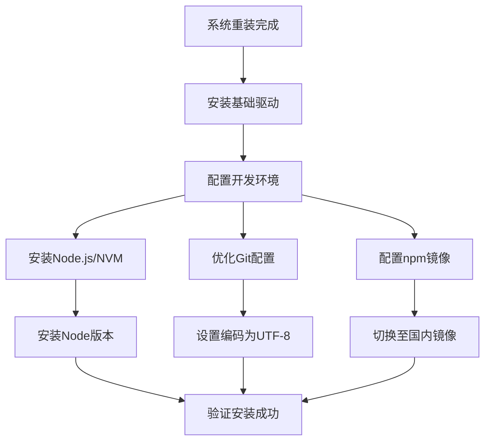
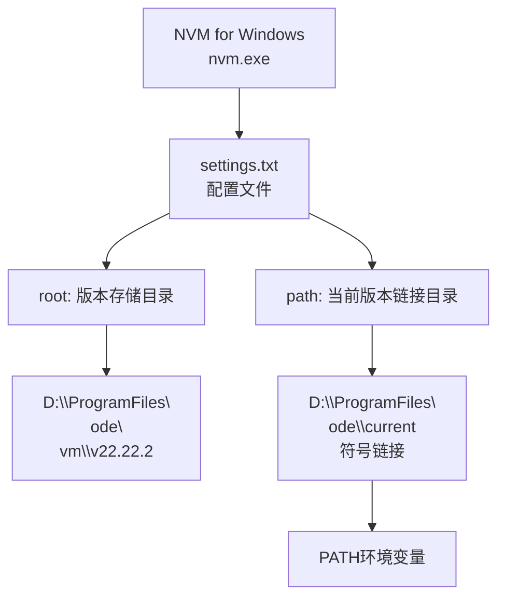
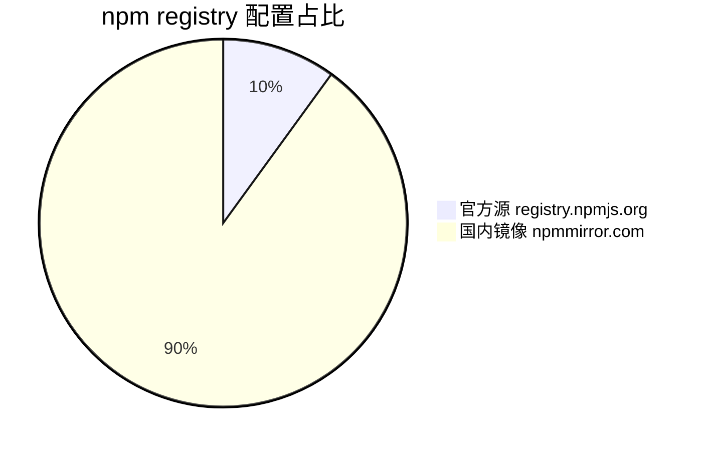
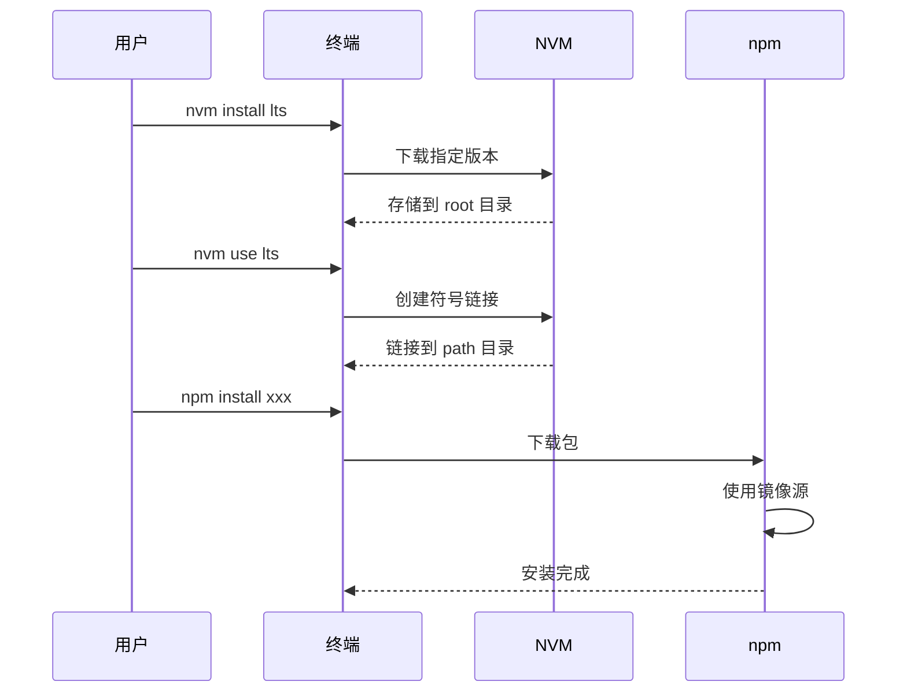

# 操作系统重装手册研究报告

> **研究主题：** 操作系统重装手册
> **日期：** 2026-05-02
> **预计耗时：** 0.3 小时（09:30 ~ 10:00）
> **项目路径：** `D:\project\my\aiubuntu1-sh`
> **GitHub 地址：** git@github.com:chujun/aiubuntu1-sh.git
> **本文档链接：** https://github.com/chujun/aiubuntu1-sh/blob/main/doc/ai-share/2026-05-02-%E6%93%8D%E4%BD%9C%E7%B3%BB%E7%BB%9F%E9%87%8D%E8%A3%85%E6%89%8B%E5%86%8C%E7%A0%94%E7%A9%B6%E6%8A%A5%E5%91%8A.md

---

## 目录

- [一、研究概述](#一研究概述)
- [二、工作原理](#二工作原理)
- [三、核心概念](#三核心概念)
- [四、应用场景](#四应用场景)
- [五、命令参考](#五命令参考)
- [六、注意事项](#六注意事项)
- [七、实战案例](#七实战案例)
- [八、相关工具对比](#八相关工具对比)
- [九、用户提示词清单](#九用户提示词清单)
- [十、难点与挑战](#十难点与挑战)
- [十一、经验总结](#十一经验总结)

---

## 一、研究概述

本报告总结操作系统重装后的必备配置与优化流程，涵盖开发环境搭建、常用工具配置、以及常见的路径问题修复。重装系统后，正确配置开发环境能显著提升工作效率。

主要解决问题：
- 插件路径修复（用户名变更导致）
- Node.js 版本管理工具安装与配置
- Git 命令行编码优化
- npm 下载源镜像配置

---

## 二、工作原理

### 2.1 操作系统重装配置流程



### 2.2 NVM for Windows 架构



### 2.3 npm 镜像配置机制



---

## 三、核心概念

| 概念 | 说明 |
|------|------|
| NVM | Node Version Manager，Node.js 版本管理工具 |
| settings.txt | NVM 配置文件，控制版本存储路径 |
| npm registry | npm 包下载源服务器地址 |
| i18n.commitEncoding | Git 提交信息编码配置 |
| core.quotepath | Git 路径显示是否转义 |

---

## 四、应用场景

### 4.1 场景矩阵

| 场景 | 适用性 | 用法 |
|------|--------|------|
| 新系统重装配置 | ✅ 适合 | 完整按此流程操作 |
| 用户名变更后修复 | ✅ 适合 | 修复插件路径配置 |
| Node 版本切换 | ✅ 适合 | 使用 nvm use 命令 |
| 国内加速 npm 下载 | ✅ 适合 | 配置 npmmirror 镜像 |

### 4.2 典型操作流程



---

## 五、命令参考

### 5.1 NVM for Windows 命令

| 命令 | 说明 | 示例 |
|------|------|------|
| `nvm version` | 查看 NVM 版本 | `nvm version` |
| `nvm install <version>` | 安装指定版本 | `nvm install 22` |
| `nvm use <version>` | 切换到指定版本 | `nvm use 22.22.2` |
| `nvm list` | 列出已安装版本 | `nvm list` |
| `nvm on` | 启用 NVM | `nvm on` |
| `nvm off` | 禁用 NVM | `nvm off` |

### 5.2 npm 配置命令

| 命令 | 说明 | 示例 |
|------|------|------|
| `npm config set registry <url>` | 设置镜像源 | `npm config set registry https://registry.npmmirror.com` |
| `npm config get registry` | 查看当前镜像源 | `npm config get registry` |
| `npm config list` | 列出所有配置 | `npm config list` |

### 5.3 Git 编码优化命令

| 命令 | 说明 | 示例 |
|------|------|------|
| `git config --global i18n.commitEncoding utf-8` | 提交编码 | 设置提交编码为 UTF-8 |
| `git config --global i18n.logOutputEncoding utf-8` | 日志输出编码 | 设置日志输出为 UTF-8 |
| `git config --global core.quotepath false` | 路径显示 | 中文路径正常显示 |
| `git config --global core.autocrlf input` | 换行符处理 | Windows 下推荐配置 |

---

## 六、注意事项

| 注意点 | 说明 | 建议 |
|--------|------|------|
| NVM 安装路径 | 默认在 `AppData\Local\nvm` | 修改 settings.txt 自定义 |
| settings.txt 路径格式 | Windows 路径使用反斜杠 | `D:\ProgramFiles\node\nvm` |
| Node 版本存储位置 | 由 settings.txt 的 root 控制 | 与 path 区分开 |
| npm 镜像源 | 国内推荐 npmmirror | 显著提升下载速度 |
| 终端重启 | 配置修改后需重启终端 | 特别是 PATH 变更 |

---

## 七、实战案例

### 案例：NVM 安装 Node.js 并配置自定义路径

**问题：** 系统重装后需要重新安装 Node.js，希望将版本文件存放到 D:\ProgramFiles\node 目录。

**解决：** 修改 NVM settings.txt 配置文件，指定 root 和 path 路径。

**步骤：**

```bash
# 1. 安装 NVM for Windows (使用 winget)
winget install --id CoreyButler.NVMforWindows -e --accept-source-agreements --accept-package-agreements

# 2. 修改 NVM 配置 (以管理员权限)
# 编辑 C:\Users\cj\AppData\Local\nvm\settings.txt
# 内容如下:
# root: D:\ProgramFiles\node\nvm
# path: D:\ProgramFiles\node\current

# 3. 安装 Node.js LTS
nvm install lts

# 4. 使用安装的版本
nvm use 24.15.0

# 5. 配置 npm 国内镜像
npm config set registry https://registry.npmmirror.com

# 6. 验证安装
node -v    # v24.15.0
npm -v     # 11.12.1
```

**结果：** Node.js 安装成功，版本文件存储在 D:\ProgramFiles\node\nvm\ 目录。

---

## 八、相关工具对比

| 工具 | 优点 | 缺点 | 适用场景 |
|------|------|------|---------|
| NVM for Windows | 轻量、安装简单 | 不支持 npm 管理 | Windows Node 版本切换 |
| nvm-windows (coreybutler) | 速度快、配置灵活 | 需要手动处理符号链接 | 日常开发环境 |
| n (n 命令行) | Unix/Linux 原生体验 | Windows 兼容性差 | Linux/Mac 开发 |

---

## 九、用户提示词清单（原文）

**提示词 1：**
```
修改坏损的插件
```

**提示词 2：**
```
继续修复坏损的插件，应该有很多这个路径问题
```

**提示词 3：**
```
powershell是不是有最新版的命令行窗口
```

**提示词 4：**
```
https://github.com/coreybutler/nvm-windows,帮我安装nvm
```

**提示词 5：**
```
nvm安装node
```

**提示词 6：**
```
nvm优化配置，node存放到指定路径下
```

**提示词 7：**
```
D:\ProgramFiles\node，node存放到这个目录下面
```

**提示词 8：**
```
帮我在安装一个node22版本
```

**提示词 9：**
```
node优化，下载地址有限使用国内镜像地址
```

**提示词 10：**
```
这个优化配置是存储在什么地方
```

**提示词 11：**
```
git命令行乱码问题优化
```

---

## 十、难点与挑战

| 难点 | 初始判断 | 实际根因 | 解决方法 |
|------|---------|---------|---------|
| NVM 命令找不到 | NVM 未安装成功 | 当前终端为 Git Bash，需要在 CMD/PowerShell 运行 | 使用完整路径调用 nvm.exe |
| 插件加载失败 | 插件本身损坏 | 用户名变更导致路径从 `C:\Users\15719` 变为 `C:\Users\cj` | 修改 installed_plugins.json 和 known_marketplaces.json |
| npm 下载慢 | 网络问题 | 默认源在国外 | 配置 npmmirror.com 镜像 |

---

## 十一、经验总结

| 经验 | 核心教训 |
|------|---------|
| 路径问题优先排查 | 用户名变更会导致大量路径配置失效，重点检查配置文件 |
| NVM 需要管理员权限 | 安装和路径配置需要管理员权限才能成功 |
| 配置文件路径使用反斜杠 | Windows 环境下 settings.txt 需使用 `\` 而非 `/` |
| 终端环境区分 | Git Bash、CMD、PowerShell 环境不同，命令可能有差异 |

---

*文档生成时间：2026-05-02 | 由 MiniMax-M2.7-highspeed 辅助生成*
