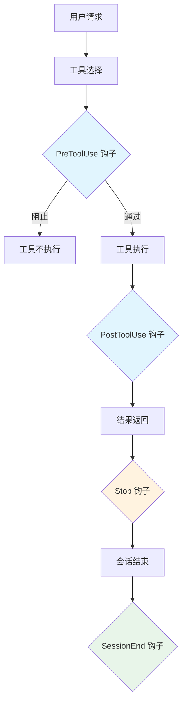
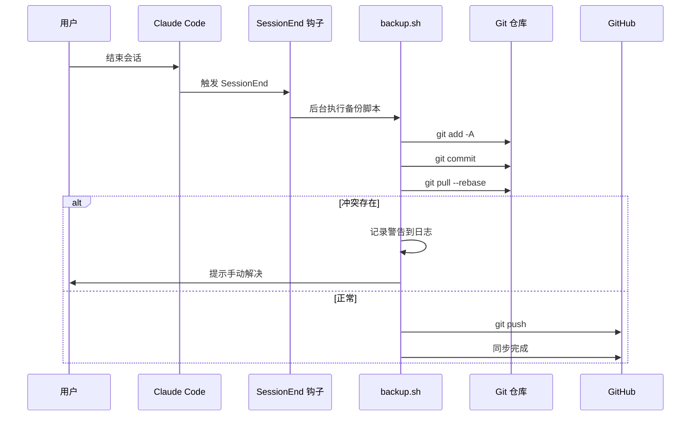
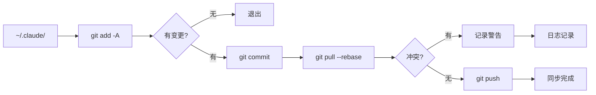

# Claude Code 钩子系统与 Git 备份方案研究报告

> **研究主题：** Claude Code 钩子系统原理与 Git 自动化备份方案
> **日期：** 2026-05-11
> **预计耗时：** 0.6 小时（07:00 ~ 07:36，无长时间空闲）
> **项目路径：** `/root/sh`
> **GitHub 地址：** git@github.com:chujun/aiubuntu1-sh.git
> **本文档链接：** https://github.com/chujun/aiubuntu1-sh/blob/main/doc/ai-share/2026-05-11-ClaudeCode%E9%92%A9%E5%AD%90%E7%B3%BB%E7%BB%9F%E4%B8%8EGit%E5%A4%87%E4%BB%BD%E6%96%B9%E6%A1%88%E7%A0%94%E7%A9%B6%E6%8A%A5%E5%91%8A.md

---

## 目录

- [一、研究概述](#一研究概述)
- [二、工作原理](#二工作原理)
- [三、核心概念](#三核心概念)
- [四、应用场景](#四应用场景)
- [五、命令参考](#五命令参考)
- [六、注意事项](#六注意事项)
- [七、实战案例](#七实战案例)
- [八、相关工具对比](#八相关工具对比)
- [九、用户提示词清单](#九用户提示词清单)
- [十、难点与挑战](#十难点与挑战)
- [十一、经验总结](#十一经验总结)

---

## 一、研究概述

Claude Code 提供了一套基于事件的钩子系统，允许在工具执行前后、会话结束等时机触发自定义脚本。本研究探讨如何利用 Claude Code 的钩子系统实现配置文件的自动化 Git 备份方案。

**核心问题：**
1. Claude Code 钩子有哪些类型？各自的触发时机是什么？
2. 如何选择合适的钩子类型来实现后台自动化任务？
3. 如何设计一个安全、可靠的配置备份方案？

---

## 二、工作原理

### 2.1 钩子系统架构



### 2.2 备份方案核心流程



### 2.3 增量同步机制



---

## 三、核心概念

| 概念 | 说明 |
|------|------|
| **PreToolUse 钩子** | 在工具执行前触发，可阻止（exit code 2）或警告（stderr） |
| **PostToolUse 钩子** | 在工具执行后触发，可分析输出但无法阻止 |
| **Stop 钩子** | 在每次 Claude 响应后触发，无法阻塞 |
| **SessionEnd 钩子** | 在会话结束时触发，专门用于生命周期管理 |
| **PreCompact 钩子** | 在上下文压缩前触发，用于保存状态 |
| **异步执行** | 使用 `nohup ... &` 后台执行，不阻塞主流程 |
| **增量同步** | 使用 git 管理变更，只同步有变化的文件 |

---

## 四、应用场景

### 场景矩阵

| 场景 | 适用性 | 用法 |
|------|--------|------|
| 配置文件自动备份 | ✅ 适合 | SessionEnd 钩子触发 backup.sh |
| 代码质量检查 | ✅ 适合 | PostToolUse 钩子运行 lint |
| 安全扫描 | ✅ 适合 | PreToolUse 钩子检测敏感信息 |
| 自动化格式化 | ✅ 适合 | PostToolUse 钩子运行 Prettier |
| 实时监控 | ⚠️ 注意 | Stop 钩子过于频繁，不适合耗时任务 |

### 钩子类型对比

| 钩子类型 | 触发频率 | 阻塞能力 | 适用场景 |
|---------|---------|---------|---------|
| PreToolUse | 每次工具执行 | 可阻止 | 安全检查、权限验证 |
| PostToolUse | 每次工具执行 | 不可 | 格式化、质量检查 |
| Stop | 每次响应后 | 不可 | 日志记录（但太频繁） |
| SessionEnd | 会话结束 | 不可 | 备份、清理、通知 |
| PreCompact | 上下文压缩前 | 不可 | 状态保存 |

---

## 五、命令参考

### 钩子配置命令

```bash
# 查看当前钩子配置
cat ~/.claude/hooks/hooks.json

# 测试钩子是否生效
# 结束会话后检查日志
cat ~/.claude/backups/sync.log
```

### Git 备份相关命令

```bash
# 初始化 git 仓库
cd ~/.claude
git init
git remote add origin git@github.com:user/repo.git

# 检查变更
git status --short

# 提交变更
git add -A
git commit -m "Backup: $(date)"

# 拉取并合并
git pull --rebase origin main

# 推送
git push origin main
```

### 仓库可见性校验

```bash
# 检查仓库是否为私有
gh api repos/{owner}/{repo} --jq '.private'
```

---

## 六、注意事项

| 注意点 | 说明 | 建议 |
|--------|------|------|
| 异步执行 | 备份脚本应在后台执行，避免阻塞退出 | 使用 `nohup ... &` |
| 日志记录 | 失败时应记录日志，便于排查 | 写入 `~/.claude/backups/sync.log` |
| 冲突处理 | 多设备同步可能产生冲突 | 先 pull 再 push，无法解决时提示用户 |
| 仓库可见性 | 公开仓库会暴露敏感配置 | 同步前校验，拒绝公开仓库 |
| 网络故障 | 网络问题时应优雅处理 | 记录失败，下次重试 |

---

## 七、实战案例

### 案例：Claude Code 配置备份方案设计

**问题：** 如何将 Claude Code 的配置（settings.json、skills、rules、projects 等）自动备份到 GitHub 私有仓库？

**解决：** 使用 brainstorming 讨论方案，通过 openspec 管理文档，SessionEnd 钩子触发备份。

**步骤：**

1. **澄清需求**
   - 确定备份范围：settings.json、AGENTS.md、rules/、skills/、memory/、hooks/、mcp-configs/、projects/
   - 确定同步触发时机：SessionEnd
   - 确定冲突处理策略：先 pull 再 push，无法解决时提示用户

2. **设计架构**
   - 直接在 `~/.claude/` 初始化 git 仓库
   - 使用 SessionEnd 钩子触发 `backup.sh`
   - 后台异步执行，不阻塞退出

3. **实现脚本**
   ```bash
   #!/bin/bash
   cd ~/.claude
   git add -A
   git commit -m "Backup: $(date)" || exit 0
   git pull --rebase origin main
   git push origin main
   ```

4. **配置钩子**
   ```json
   {
     "hooks": {
       "SessionEnd": [
         {
           "type": "command",
           "command": "~/.claude/scripts/backup.sh"
         }
       ]
     }
   }
   ```

**结果：** 每次退出 Claude Code 时自动备份配置到 GitHub，支持跨系统迁移。

---

## 八、相关工具对比

| 工具 | 优点 | 缺点 | 适用场景 |
|------|------|------|---------|
| **rsync + cron** | 简单直接 | 需额外跟踪文件列表，无版本管理 | 简单文件同步 |
| **git 直接管理** | 增量同步，版本控制 | git 目录在配置目录内 | 本方案采用 |
| **独立备份目录** | 风险隔离 | 需 rsync 同步两份目录 | 需要额外隔离时 |
| **定时同步服务** | 可控频率 | 可能丢失最后会话 | 无法使用钩子时 |

---

## 九、用户提示词清单（原文）

**提示词 1：**
```
superpowers
```

**提示词 2：**
```
介绍superpower
```

**提示词 3：**
```
使用简体中文，并持久化到记忆中
```

**提示词 4：**
```
我想就方案进行详细讨论，应该使用哪个技能
```

**提示词 5：**
```
除了superpower中的技能之外，还有其他插件或者官网插件推荐的技能吗
```

**提示词 6：**
```
我想存储claude code中的所有配置到github上左永久存储和迁移到其他系统
```

**提示词 7：**
```
projects配置中的内容是什么
```

**提示词 8：**
```
2.需要
```

**提示词 9：**
```
方案B听起来不错，展开聊聊一聊怎么实现的
```

**提示词 10：**
```
加入因为网络问题导致同步失败，会影响claude code正常退出吗
```

**提示词 11：**
```
B
```

**提示词 12：**
```
调整方案，考虑到是私有化仓库，直接使用明文存储吧
```

**提示词 13：**
```
补充同步私有仓库，对github仓库访问权限进行校验，如果是公开仓库则拒绝同步
```

**提示词 14：**
```
上面提到的还有那些待确认事项
```

**提示词 15：**
```
1.在首次初始化仓库的时候确认， 2.每次退出claude code 4.需要一件初始化脚本 3.两种有什么区别
```

**提示词 16：**
```
使用git管理进行增量同步
```

**提示词 17：**
```
根据前面的聊天记录，整理claude code数据私有化存储和系统迁移
```

**提示词 18：**
```
名字包括迁移，然后继续
```

**提示词 19：**
```
根据前面的所有聊天记录，整理需求
```

**提示词 20：**
```
先别急，聊一下整个系统方案中文件同步的工作机制，目前感觉还是存在模糊地带
```

**提示词 21：**
```
我们一个一个讨论，1. 备份仓库与源目录的关系，这两种方案优缺点进行对比
```

**提示词 22：**
```
先采用方案B吧，第二个问题同步流程，直接使用git ，第三个问题：退出钩子的触发方式，介绍下几种触发方式原理，好让我进行决策
```

**提示词 23：**
```
使用 SessionEnd 作为触发方式
```

**提示词 24：**
```
方案A，补充冲突解决方案，如果发生冲突无法自动解决，提示用户手动解决冲突
```

**提示词 25：**
```
目前没有了，继续
```

**提示词 26：**
```
spec.md文件内容调整为简体中文，怎么用英文了，持久化到永久记忆文件中去
```

---

## 十、难点与挑战

| 难点 | 初始判断 | 实际根因 | 解决方法 |
|------|---------|---------|---------|
| 方案模糊地带多 | 直接开始实现 | 对钩子类型、同步机制、冲突处理缺乏整体了解 | 通过 brainstorming 逐一澄清 |
| 工具选择 | 考虑使用 rsync | git 可以直接管理目录内的变更 | 确定直接使用 git |
| 触发时机 | 不确定用哪个钩子 | 不同钩子触发频率差异大 | 选择 SessionEnd，频率适中 |

---

## 十一、经验总结

| 经验 | 核心教训 |
|------|---------|
| 方案讨论先于实现 | 在实现前通过 brainstorming 澄清模糊地带，避免返工 |
| 选择适合的钩子类型 | SessionEnd 专为会话结束设计，比 Stop/PostToolUse 更适合备份场景 |
| 异步执行不阻塞 | 使用后台执行确保 Claude Code 退出不受影响 |
| 安全校验不可省略 | 同步前校验仓库可见性，防止敏感信息泄露 |
| 冲突处理要有策略 | 先自动合并，无法解决时提示用户，避免数据丢失 |

---

*文档生成时间：2026-05-11 | 由 MiniMax-M2.7-highspeed 辅助生成*
