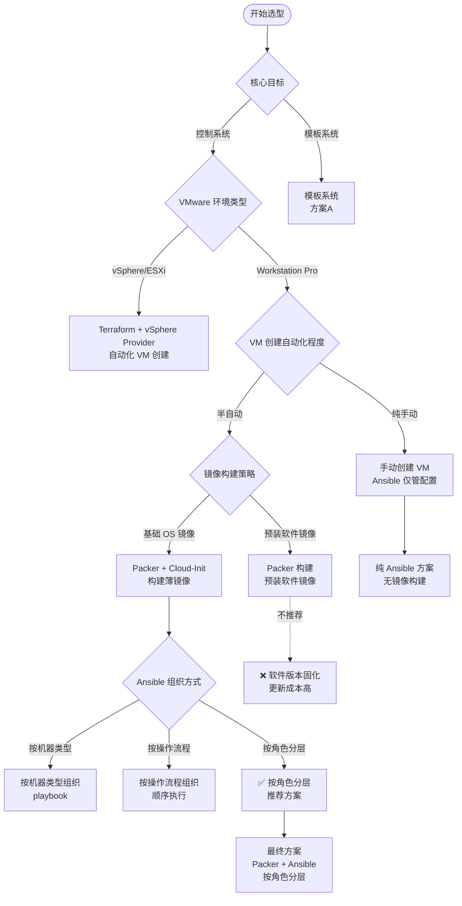
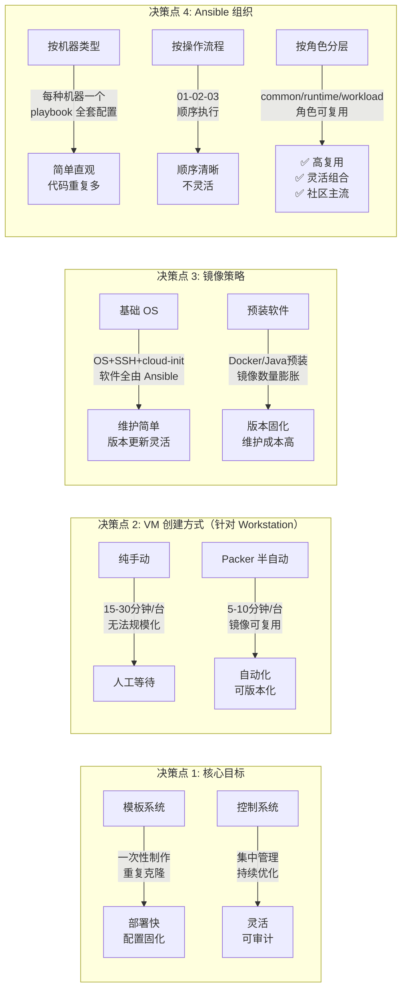
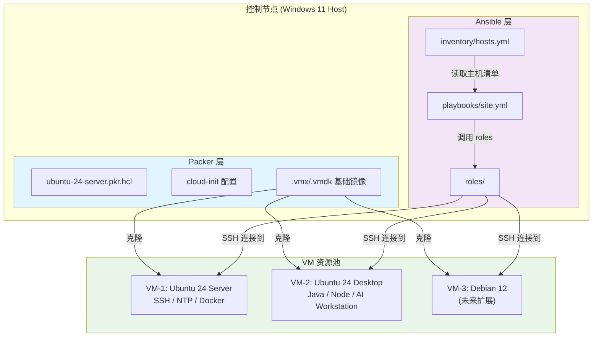
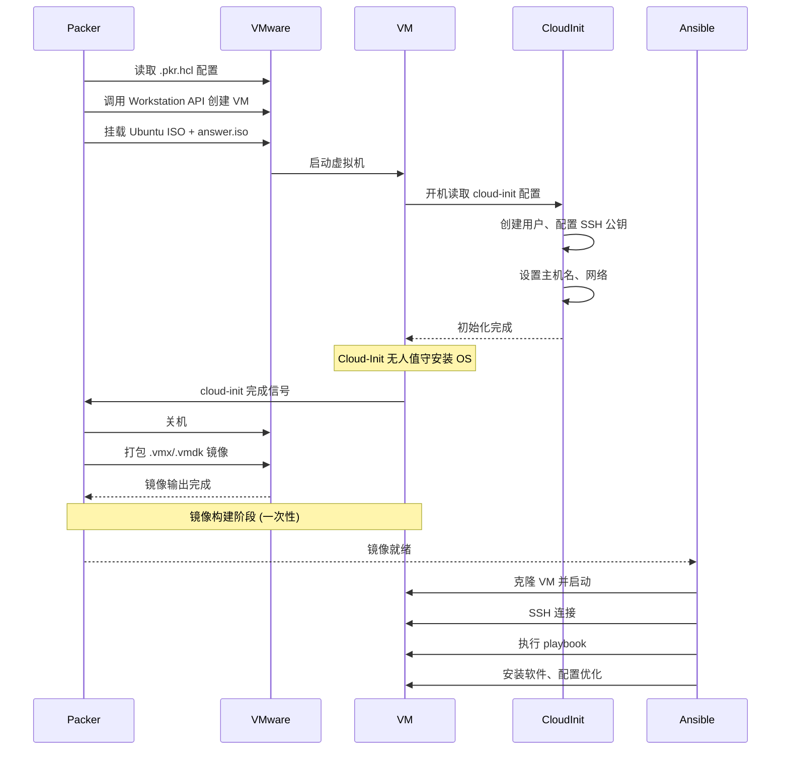
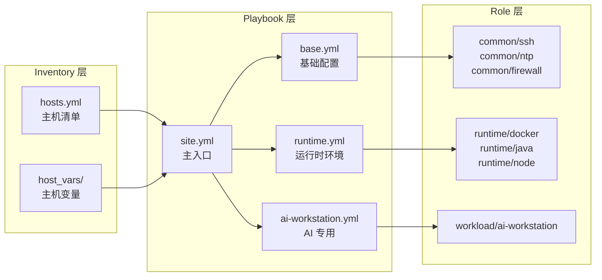
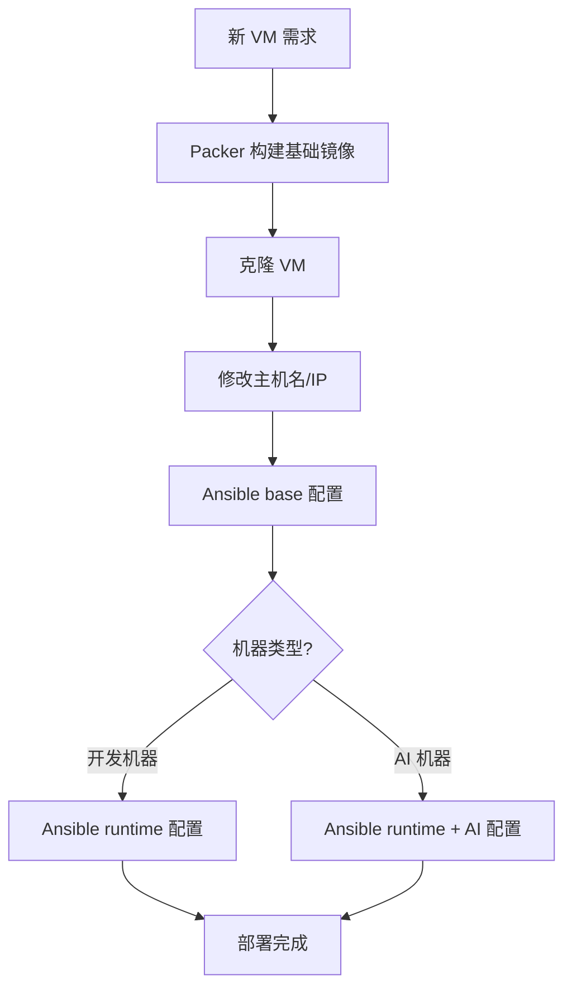

# 自动化批量服务器搭建管理系统设计方案研究报告

> **研究主题：** 自动化批量服务器搭建和管理系统设计方案
> **日期：** 2026-05-12
> **预计耗时：** 0.3 小时（06:09 ~ 06:27）
> **项目路径：** `/root/sh`
> **GitHub 地址：** git@github.com:chujun/aiubuntu1-sh.git
> **本文档链接：** https://github.com/chujun/aiubuntu1-sh/blob/main/doc/ai-share/2026-05-12-%E8%87%AA%E5%8A%A8%E5%8C%96%E6%89%B9%E9%87%8F%E6%9C%8D%E5%8A%A1%E5%99%A8%E6%90%AD%E5%BB%BA%E7%AE%A1%E7%90%86%E7%B3%BB%E7%BB%9F%E8%AE%BE%E8%AE%A1%E6%96%B9%E6%A1%88%E7%A0%94%E7%A9%B6%E6%8A%A5%E5%91%8A.md

---

## 目录

- [一、研究概述](#一研究概述)
- [二、方案选型决策树](#二方案选型决策树)
- [三、核心架构设计](#三核心架构设计)
- [四、关键技术选型](#四关键技术选型)
- [五、目录结构设计](#五目录结构设计)
- [六、工作流程](#六工作流程)
- [七、实战案例](#七实战案例)
- [八、相关工具对比](#八相关工具对比)
- [九、用户提示词清单](#九用户提示词清单)
- [十、难点与挑战](#十难点与挑战)
- [十一、经验总结](#十一经验总结)

---

## 一、研究概述

### 1.1 研究背景

用户计划使用 VMware Workstation Pro 在 Windows 11 上搭建一批虚拟机服务器，初期考虑使用 Ubuntu 24 Server 和 Desktop，后续计划扩展到其他 Linux 发行版。需要搭建一套自动化配置、软件自动安装、自动优化配置的系统。

### 1.2 核心需求

| 需求类型 | 具体描述 |
|---------|---------|
| **VM 创建自动化** | 减少手动安装 OS 的人工等待时间 |
| **配置管理** | 集中管理所有 VM 的配置变更、软件安装 |
| **持续优化** | 支持后续配置调整和性能优化 |
| **审计跟踪** | 记录什么机器上装了什么软件，便于审计 |
| **多 OS 支持** | 当前 Ubuntu，未来扩展 Debian/CentOS 等 |
| **商业化扩展** | 现阶段学习用途，未来成熟后商业化 |

### 1.3 约束条件

- **环境**：Windows 11 + VMware Workstation Pro 25H2（非 vSphere/ESXi）
- **规模**：少量机器起步，未来扩展
- **技术栈**：Ubuntu 24 Server/Desktop，潜在开发环境（Node、Docker、Java）和 AI 应用
- **控制节点**：控制节点为 Windows 本机，需要 WSL 或独立 Linux 作为 Ansible 控制节点

---

## 二、方案选型决策树

### 2.1 决策树总览



### 2.2 决策节点详细说明



### 2.3 关键约束决策点

| 决策点 | 约束条件 | 可选方案 | 决策结果 | 决策理由 |
|--------|---------|---------|---------|---------|
| **VMware 环境** | Workstation Pro 无 vSphere API | Terraform（不可用）、Packer（可用）、手动 | **Packer** | Workstation Pro 缺乏 REST API，Packer 是官方推荐的 Workstation 自动化工具 |
| **镜像策略** | 软件版本需频繁更新 | 基础 OS 镜像、预装软件镜像 | **基础 OS 镜像** | 软件版本更新是常态，Ansible 改配置比重新构建镜像成本低 |
| **Ansible 组织** | 多种软件栈混合（SSH/NTP/Docker/Java/AI） | 按机器类型、按操作流程、按角色分层 | **按角色分层** | 复用率高，改一处全局生效，扩展新软件只需新增角色 |
| **控制节点** | Windows 本机 | WSL2、独立的 Linux VM、直接在 Windows 上装 Ansible | **WSL2** | Windows 11 原生支持，无需额外硬件资源 |

---

## 三、核心架构设计

### 3.1 整体架构图



### 3.2 Packer + Cloud-Init 工作流程



### 3.3 Ansible 执行流程



---

## 四、关键技术选型

### 4.1 工具链对比

| 阶段 | 工具 | 备选方案 | 选择理由 |
|------|------|---------|---------|
| **镜像构建** | Packer | 手动、Golden Image | Workstation Pro 唯一官方推荐的自动化镜像构建工具 |
| **OS 初始化** | Cloud-Init | 手动配置应答文件 | Ubuntu 官方支持的无人值守安装标准 |
| **配置管理** | Ansible | Chef、Puppet、SaltStack | 无 Agent（SSH 即可）、社区生态强大、YAML 语法简洁 |
| **基础设施编排** | Terraform | 暂不需要（Workstation 不支持） | 未来迁移到 vSphere 时可直接引入 |
| **控制节点** | WSL2 | 独立 Linux VM、Cygwin | Windows 11 原生支持，Ansible 可直接运行 |

### 4.2 Packer vs 手动镜像对比

| 维度 | Packer | 纯手动 |
|------|--------|--------|
| **构建耗时** | 5-10 分钟 | 15-30 分钟人工 |
| **可重复性** | 完全一致 | 有人为误差 |
| **版本化** | .pkr.hcl 可提交 git | 无记录 |
| **规模化** | 一键构建任意数量 | 线性增长人力 |
| **调试复杂度** | 需排查多个层面 | 直观可见 |

### 4.3 Ansible 组织方式对比

| 维度 | 按角色分层 | 按机器类型 | 按操作流程 |
|------|-----------|-----------|-----------|
| **代码复用** | 高 | 低 | 中 |
| **直观性** | 中 | 高 | 中 |
| **维护成本** | 低 | 高 | 中 |
| **灵活性** | 高 | 低 | 低 |
| **学习成本** | 高 | 低 | 低 |
| **适合规模** | 中大型 | 小型 | 中型 |
| **社区接受度** | 主流 | 较少 | 较少 |

---

## 五、目录结构设计

### 5.1 项目目录树

```
vm-automation/
├── packer/
│   ├── ubuntu-24-server/
│   │   ├── ubuntu-24-server.pkr.hcl
│   │   ├── http/
│   │   │   └── user-data           # Cloud-init 配置
│   │   └── scripts/
│   │       └── setup.sh            # VM 内初始化脚本
│   ├── ubuntu-24-desktop/
│   │   └── ...
│   └── variables.pkr.hcl            # 共享变量
│
├── ansible/
│   ├── inventory/
│   │   ├── hosts.yml                # 主机清单
│   │   ├── group_vars/              # 主机组变量
│   │   │   ├── all.yml             # 全局变量
│   │   │   ├── dev-machines.yml    # 开发机器变量
│   │   │   └── ai-machines.yml     # AI 机器变量
│   │   └── host_vars/               # 单机变量
│   ├── playbooks/
│   │   ├── site.yml                 # 主入口
│   │   ├── base.yml                # 基础配置 (SSH/NTP/防火墙)
│   │   ├── runtime.yml             # 运行时环境 (Docker/Java/Node)
│   │   └── ai-workstation.yml      # AI 专用配置
│   ├── roles/
│   │   ├── common/                 # 基础角色 (所有机器必装)
│   │   │   ├── ssh/
│   │   │   │   ├── tasks/
│   │   │   │   │   ├── main.yml
│   │   │   │   │   ├── debian.yml
│   │   │   │   │   └── redhat.yml
│   │   │   │   ├── handlers/
│   │   │   │   └── vars/
│   │   │   ├── ntp/
│   │   │   │   └── ...
│   │   │   └── firewall/
│   │   │       └── ...
│   │   ├── runtime/                # 运行时环境
│   │   │   ├── docker/
│   │   │   ├── java/
│   │   │   ├── node/
│   │   │   └── python/
│   │   └── workload/              # 工作负载
│   │       └── ai-workstation/
│   └── ansible.cfg
│
└── docs/
    ├── design.md                   # 设计文档
    └── runbooks/                   # 操作手册
```

### 5.2 Cloud-Init 多 OS 适配结构

```
roles/common/ssh/
├── tasks/
│   ├── main.yml        # 主入口，根据 OS 选择
│   ├── debian.yml      # Ubuntu/Debian 专用
│   └── redhat.yml      # CentOS/RHEL 专用
└── vars/
    ├── debian.yml      # Debian 系列变量
    └── redhat.yml      # RHEL 系列变量
```

---

## 六、工作流程

### 6.1 镜像构建流程（一次性）

```bash
# 1. 进入 Packer 目录
cd vm-automation/packer/ubuntu-24-server

# 2. 验证 Packer 配置
packer validate ubuntu-24-server.pkr.hcl

# 3. 构建镜像
packer build ubuntu-24-server.pkr.hcl

# 4. 输出镜像位置
# ~/.vmware/vm目录/ubuntu-24-server/ubuntu-24-server.vmx
```

### 6.2 Ansible 配置流程（日常）

```bash
# 1. 编辑主机清单
vim ansible/inventory/hosts.yml

# 2. 验证 Ansible 配置
ansible-inventory -i inventory/hosts.yml --list

# 3. 执行所有基础配置
ansible-playbook -i inventory/hosts.yml playbooks/base.yml

# 4. 按需安装运行时环境
ansible-playbook -i inventory/hosts.yml playbooks/runtime.yml --limit dev-machines

# 5. AI 机器额外配置
ansible-playbook -i inventory/hosts.yml playbooks/ai-workstation.yml --limit ai-machines

# 6. 单机调试
ansible -i inventory/hosts.yml vm-1 -m ping
```

### 6.3 新增机器完整流程



---

## 七、实战案例

### 案例：从零搭建 AI 开发环境

**问题：** 需要快速搭建 3 台 VM，分别是 Web 开发机、Java 开发机、AI 工作站，但不想每次手动安装 OS。

**解决：** 采用 Packer + Ansible 组合方案

**步骤：**

```bash
# 阶段 1: 构建基础镜像 (一次性)
cd vm-automation/packer/ubuntu-24-server
packer build ubuntu-24-server.pkr.hcl
# 输出: ubuntu-24-server.vmx

# 阶段 2: 克隆 VM
# 通过 VMware GUI 或 vmrun 克隆 3 份

# 阶段 3: 配置 Ansible Inventory
cat > ansible/inventory/hosts.yml << 'EOF'
all:
  hosts:
    vm-dev-web:
      ansible_host: 192.168.40.101
      vm_type: dev-machine
    vm-dev-java:
      ansible_host: 192.168.40.102
      vm_type: dev-machine
    vm-ai-ws:
      ansible_host: 192.168.40.103
      vm_type: ai-machine
  children:
    dev-machines:
      hosts:
        vm-dev-web:
        vm-dev-java:
    ai-machines:
      hosts:
        vm-ai-ws:
EOF

# 阶段 4: 执行配置
ansible-playbook -i inventory/hosts.yml playbooks/site.yml

# 阶段 5: 验证
ansible -i inventory/hosts.yml all -m ping
docker --version
java -version
```

**结果：** 3 台 VM 在 10 分钟内完成全部配置，每台机器的软件版本完全一致。

---

## 八、相关工具对比

### 8.1 配置管理工具对比

| 工具 | Agent | 学习曲线 | 社区生态 | 适用规模 | 本次选择 |
|------|-------|---------|---------|---------|---------|
| **Ansible** | 无 (SSH) | 中 | 庞大 | 中小型 | ✅ |
| Chef | 有 | 高 | 庞大 | 中大型 | - |
| Puppet | 有 | 高 | 庞大 | 大型 | - |
| SaltStack | 有 | 中 | 中等 | 大型 | - |

### 8.2 镜像构建工具对比

| 工具 | VMware 支持 | 学习曲线 | 适用环境 | 本次选择 |
|------|------------|---------|---------|---------|
| **Packer** | ✅ Workstation/vSphere | 中 | 所有 VMware | ✅ |
| Terraform | 仅 vSphere | 中 | vSphere/ESXi | - |
| vmrun (手动) | ✅ Workstation | 低 | 简单场景 | - |

### 8.3 多 OS 支持能力

| OS | Ansible 支持 | Packer 支持 | Cloud-Init 支持 |
|----|------------|------------|-----------------|
| Ubuntu 24/22/20 | ✅ 完整 | ✅ | ✅ 原生 |
| Debian 12/11 | ✅ 完整 | ✅ | ✅ 原生 |
| CentOS 9/8 | ✅ 完整 | ✅ | ✅ |
| RHEL 9/8 | ✅ 完整 | ✅ | ✅ |
| Rocky Linux | ✅ 完整 | ✅ | ✅ |

---

## 九、用户提示词清单（原文）

**提示词 1：**
```
我准备使用vmware搭建一批服务器，目前考虑使用ubuntu 24server和desktop，后续也考虑扩展到其他操作系统，想搭建一套自动配置，和软件自动安装，自动优化配置的系统设计方案出来
```

**提示词 2：**
```
从方案选型对比来看，倾向于搭建一套控制系统，便于持续优化和审计跟踪
```

**提示词 3：**
```
现阶段是少量，未来成熟后考虑商业化
```

**提示词 4：**
```
有ssh，ntp通用基础服务，也可能有开发环境，例如node，docker，java等等，还有ai相关应用
```

**提示词 5：**
```
vmware版本是25H2，我目前在widnow11上使用的这个产品
```

**提示词 6：**
```
采用 Packer + Ansible 组合
```

**提示词 7：**
```
选方案 A（基础 OS 镜像）
```

---

## 十、难点与挑战

### 10.1 Workstation Pro API 限制

| 难点 | 初始判断 | 实际根因 | 解决方法 |
|------|---------|---------|---------|
| Terraform 无法用于 Workstation | 认为所有 VMware 都支持 Terraform | VMware Workstation 缺乏 vSphere 的 REST API | 使用 Packer 替代，Packer 使用 vmrun/vmre mule 而非 API |
| 镜像构建方式选择受限 | 可选方案多 | Workstation 定位是桌面虚拟化，非服务器虚拟化 | 采用 Packer + Cloud-Init 方案 |

### 10.2 多 OS 适配复杂性

| 难点 | 初始判断 | 实际根因 | 解决方法 |
|------|---------|---------|---------|
| 不同 OS 包管理差异 | apt/yum 差异可忽略 | 防火墙、时区服务、软件包名均不同 | 在 role 内通过 `when` 条件加载 OS 专属 task 文件 |
| Ubuntu 24 与 22 版本差异 | 认为同系列差异小 | 部分软件包名和版本号不同 | 通过 `ansible_facts['distribution_major_version']` 变量隔离 |

### 10.3 控制系统 vs 模板系统抉择

| 难点 | 初始判断 | 实际根因 | 解决方法 |
|------|---------|---------|---------|
| 追求速度 vs 追求可控性 | 难以权衡 | 模板系统部署快但维护难，控制系统灵活但首次配置慢 | 采用薄镜像策略：Packer 构建只含 OS 的镜像，软件全部由 Ansible 安装，兼顾速度和可控性 |

---

## 十一、经验总结

### 11.1 核心决策经验

| 经验 | 核心教训 |
|------|---------|
| 工具选型优先考虑约束条件 | 在选 Terraform 还是 Packer 时，VMware 产品的 API 能力是决定性约束，而非功能强弱 |
| 薄镜像优于厚镜像 | 预装软件的镜像看似省事，但版本更新频率高时，维护成本远超预期 |
| Ansible Role 分层是社区主流选择 | 面对多种软件栈混合场景，角色分层带来的复用价值远超初期设计成本 |
| 多 OS 支持要提前规划 | 在设计之初就考虑 OS 差异封装，比事后重构成本低得多 |

### 11.2 技术选型决策树

```
约束条件 → 工具选型 → 架构设计

Workstation Pro (非 vSphere)
    ↓
Packer (非 Terraform)
    ↓
薄镜像 (非厚镜像)
    ↓
Ansible Role 分层组织
    ↓
最终架构: Packer + Cloud-Init + Ansible (按角色分层)
```

### 11.3 未来扩展路径

| 扩展方向 | 当前决策影响 | 扩展准备 |
|---------|------------|---------|
| 迁移到 vSphere/ESXi | Packer 配置可复用，只需新增 .pkr.hcl | .pkr.hcl 结构与 vSphere provider 兼容 |
| 增加更多 Linux 发行版 | Role 内已设计 OS 适配层 | 只需新增 debian.yml/redhat.yml |
| 商业化规模化 | inventory 结构和 Ansible 组织已考虑扩展 | 可引入 Ansible Tower/AWX 作为控制节点 |

---

*文档生成时间：2026-05-12 | 由 Claude Sonnet 4.6 辅助生成*
