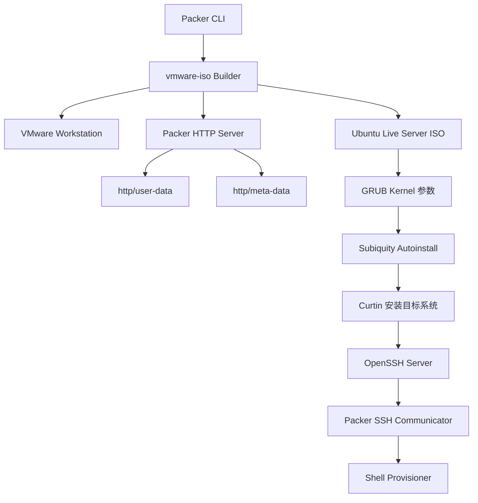
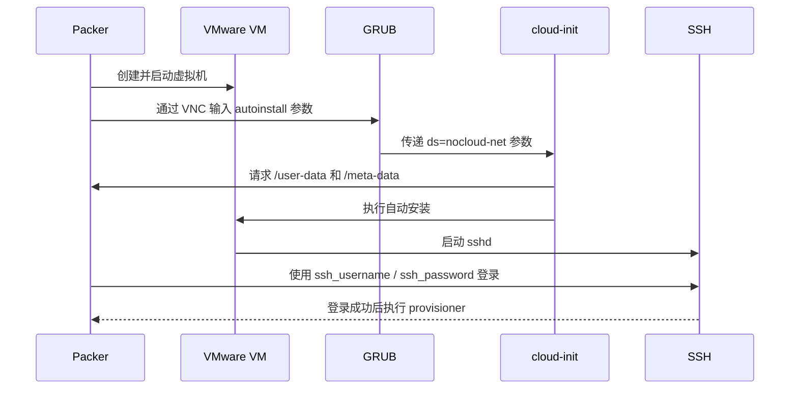
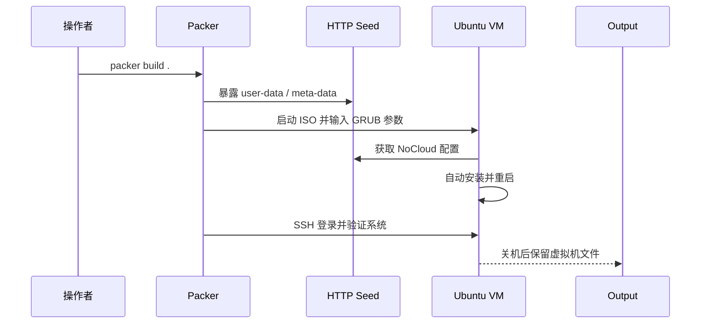
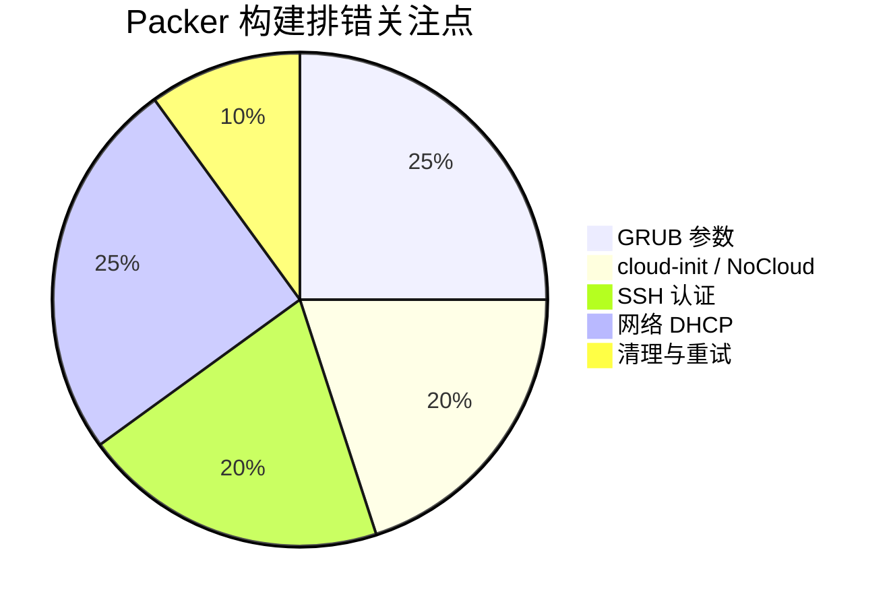

# Packer 自动化构建 Ubuntu Server 镜像研究报告

> **研究主题：** Packer + VMware Workstation + Ubuntu autoinstall 自动化构建 Ubuntu Server 镜像  
> **日期：** 2026-05-14  
> **预计耗时：** 3.5 小时（15:49 ~ 19:18，无长时间空闲）  
> **项目路径：** `D:\project\my\aiubuntu1-sh`  
> **GitHub 地址：** https://github.com/chujun/aiubuntu1-sh  
> **本文档链接：** https://github.com/chujun/aiubuntu1-sh/blob/main/doc/ai-share/2026-05-14-Packer%E8%87%AA%E5%8A%A8%E5%8C%96%E6%9E%84%E5%BB%BAUbuntuServer%E9%95%9C%E5%83%8F%E7%A0%94%E7%A9%B6%E6%8A%A5%E5%91%8A.md

---

## 目录

- [一、研究概述](#一研究概述)
- [二、工作原理](#二工作原理)
- [三、核心概念](#三核心概念)
- [四、应用场景](#四应用场景)
- [五、命令参考](#五命令参考)
- [六、注意事项](#六注意事项)
- [七、实战案例](#七实战案例)
- [八、相关工具对比](#八相关工具对比)
- [九、用户提示词清单](#九用户提示词清单)
- [十、难点与挑战](#十难点与挑战)
- [十一、经验总结](#十一经验总结)

---

## 一、研究概述

Packer 可以把“手工安装一台虚拟机”的过程变成可重复执行的镜像构建流水线。在 Windows + VMware Workstation 环境中，它通过 `vmware-iso` builder 创建虚拟机、挂载 Ubuntu Server ISO、使用 VNC 向 GRUB 输入启动参数，再通过 HTTP server 提供 cloud-init NoCloud 数据，最后用 SSH 登录新系统执行验证和收尾。

本报告基于一次真实排错过程，研究如何让 Ubuntu 24.04.4 Server 在 VMware Workstation 中完成无人值守安装，并总结常见卡点：GRUB 参数格式、NoCloud datasource、SSH 密码、网卡命名、VMware DHCP 租约与真实系统网络不一致等。

---

## 二、工作原理

### 2.1 架构图



### 2.2 核心流程


### 2.3 关键数据流



---

## 三、核心概念

| 概念 | 说明 |
|------|------|
| `vmware-iso` | Packer 的 VMware ISO 构建器，负责创建 VM、启动 ISO、输入启动命令 |
| `boot_command` | Packer 通过 VNC 向 GRUB 输入的按键序列 |
| `autoinstall` | Ubuntu Server 的无人值守安装入口参数 |
| NoCloud datasource | cloud-init 的数据源之一，可从 HTTP、ISO、磁盘目录读取 `user-data` |
| `user-data` | 定义用户、密码、网络、包、late-commands 等安装配置 |
| `meta-data` | NoCloud 所需元数据，通常包含 `instance-id` 和 `local-hostname` |
| Curtin | Ubuntu 安装器底层执行安装、分区、写入目标系统的工具 |
| SSH communicator | Packer 用来进入装好系统执行 provisioner 的连接器 |
| VMnet8 | VMware NAT 网络，通常由 VMware DHCP 分配客户机 IP |

---

## 四、应用场景

### 场景矩阵

| 场景 | 适用性 | 用法 |
|------|--------|------|
| 批量生成 Ubuntu Server 模板 | 适合 | 固化 Packer HCL 与 cloud-init 配置，稳定输出 VM 目录 |
| 本地验证自动化安装流程 | 适合 | 通过 VNC 和 `packer_debug.log` 观察安装阶段 |
| 生产级镜像流水线 | 注意 | 建议补充版本锁定、校验、镜像发布和安全凭证管理 |
| 动态多网卡环境 | 注意 | 避免写死 `ens33`，优先使用 `match` 或 MAC 绑定 |

### 典型构建链路



---

## 五、命令参考

### 核心命令

| 命令 | 说明 | 示例 |
|------|------|------|
| `packer validate .` | 校验当前目录下 Packer HCL 配置 | `packer validate .` |
| `packer build .` | 执行完整镜像构建 | `packer build .` |
| 设置 debug 日志 | 输出详细日志到文件 | `$env:PACKER_LOG='1'; $env:PACKER_LOG_PATH='packer_debug.log'; packer build .` |
| 停止 VMware VM | 关闭 Packer output 中的临时 VM | `vmrun.exe -T ws stop path\to\vmx hard` |
| 查看 Packer 进程 | 判断构建是否残留 | `Get-Process | Where-Object { $_.ProcessName -like '*packer*' }` |
| 删除 output | 清理失败构建产物 | `Remove-Item -Recurse -Force output\ubuntu-24-04-server` |

### 关键配置片段

GRUB datasource 参数需要转义分号：

```hcl
boot_command = [
  "<wait>e<wait5>",
  "<down><wait><down><wait><down><wait2><end><wait5>",
  "<bs><bs><bs><bs><wait> autoinstall ds=nocloud-net\\;s=http://{{ .HTTPIP }}:{{ .HTTPPort }}/ ---<wait><f10>"
]
```

网络配置不要写死 `ens33`：

```yaml
network:
  version: 2
  ethernets:
    primary:
      match:
        name: "en*"
      dhcp4: true
      optional: true
```

---

## 六、注意事项

| 注意点 | 说明 | 建议 |
|--------|------|------|
| HTTP 端口不是固定 80 | Packer 会动态分配端口，例如 `8571` | 以日志 `Starting HTTP server on port ...` 为准 |
| GRUB 中分号会被解析 | `ds=nocloud-net;s=...` 可能被截断 | 在 HCL 中写 `\\;`，让 GRUB 看到 `\;` |
| 密码 hash 与 Packer 明文必须一致 | `user-data` 里是 hash，Packer 用明文变量登录 | 确保 `ssh_password` 等于 hash 对应明文 |
| VMware 网卡名不稳定 | 可能是 `ens33`、`ens160`、`enp3s0` | 使用 `match: name: "en*"` 或明确 MAC 匹配 |
| `DataSourceNone` 不一定总是失败 | 安装后新系统首次启动可能没有 datasource | 结合 Curtin 安装日志和 SSH 结果判断 |
| DHCP 租约不等于系统真实 IP | Packer 可能从 VMware 租约读到旧 IP | 必要时在 VNC 中执行 `ip a` 验证 |

---

## 七、实战案例

### 案例：Ubuntu 24.04 Server Packer 构建从卡死到成功

**问题：**  
`packer build .` 多次卡住：先进入语言选择界面，随后卡在 cloud-init network stage，后续又卡在 SSH communicator。

**解决：**  
逐层修复四个根因：

1. GRUB 参数补齐 NoCloud datasource。
2. 将分号改为 GRUB 转义形式。
3. 将 Packer `ssh_password` 改成 `ubuntucj`，匹配 `user-data` 的密码 hash。
4. 将 `user-data` 网络配置从写死 `ens33` 改成匹配 `en*`。

**步骤：**

```powershell
packer validate .

$env:PACKER_LOG='1'
$env:PACKER_LOG_PATH='D:\project\my\aiubuntu1-sh\packer\ubuntu-24-server\packer_debug.log'
packer build .
```

**结果：**

```text
Connected to SSH!
SSH connection verified
ubuntu-server
PRETTY_NAME="Ubuntu 24.04.4 LTS"
Build 'ubuntu-24-server.vmware-iso.ubuntu-24-server' finished after 8 minutes 49 seconds.
```

---

## 八、相关工具对比

| 工具 | 优点 | 缺点 | 适用场景 |
|------|------|------|---------|
| Packer + VMware | 本地可重复构建，适合桌面虚拟化 | VNC/GRUB/网络细节较多 | 本地模板镜像、实验室环境 |
| Packer + vSphere | 更接近企业环境，可集成数据中心 | 需要 vCenter / ESXi 权限 | 企业镜像流水线 |
| cloud-init 手工 seed ISO | 不依赖 Packer HTTP 网络 | 需要额外生成 ISO | 防火墙或 HTTP 不稳定场景 |
| 手工安装 VM | 直观、低门槛 | 不可重复、易遗漏 | 临时验证或单次实验 |

---

## 九、用户提示词清单（原文）

**提示词 1：**
```text
帮我检查packer的配置有什么问题
```

**提示词 2：**
```text
帮我修复问题
```

**提示词 3：**
```text
packer build .并输出debug日志到日志文件，再继续重试
```

**提示词 4：**
```text
我手动ssh登录成功了，对的，user-data中的密文密码是ubuntucj
```

**提示词 5：**
```text
我在VNC中手动指定截图如上
```

**提示词 6：**
```text
[$my-share-doc-record](C:\\Users\\cj\\.codex\\skills\\my-share-doc-record\\SKILL.md) 
```

> 注：本报告聚焦研究主题本身，提示词清单保留关键代表性输入；完整逐条提示词已记录在同日 `doc/ai-explore` 实践探索文档中。

---

## 十、难点与挑战

| 难点 | 初始判断 | 实际根因 | 解决方法 |
|------|---------|---------|---------|
| 进入语言选择界面 | boot wait 或按键时序问题 | datasource 没完整传入安装器 | 添加 `ds=nocloud-net` 并转义分号 |
| cloud-init 卡住 | HTTP server 不可访问 | 后续证明安装阶段已读取 seed，需要分阶段判断 | 结合 VNC 安装日志与 Packer 日志判断 |
| SSH 认证失败 | sshd 未启动 | Packer 明文密码与用户 hash 不一致 | 将 `ssh_password` 改为 `ubuntucj` |
| SSH EOF / timeout | 密码或 SSH 配置问题 | 目标系统网卡没拿到 DHCP | 修复 netplan 网卡匹配 |
| 日志与画面互相矛盾 | 单一证据误导 | 不同阶段的信息含义不同 | 同时看 Packer 日志、VNC、手动命令 |

---

## 十一、经验总结



> 该比例为基于本次实战的经验估算，不代表通用统计。

| 经验 | 核心教训 |
|------|---------|
| Packer 构建要分阶段排错 | GRUB、安装器、目标系统、SSH 是四个不同阶段 |
| 日志中的 IP 需要验证 | VMware DHCP 租约不等于目标系统真实网络状态 |
| 不要写死 Linux 网卡名 | 桌面虚拟化环境下网卡名可能随硬件类型变化 |
| 密码要统一管理 | hash 与明文变量不一致会让 SSH 卡住很久 |
| 成功标志看 Packer 输出 | VNC 登录页不是最终成败，`Connected to SSH!` 和 build finished 才是关键 |

---

*文档生成时间：2026-05-14 | 由 Codex / GPT-5 辅助生成*
