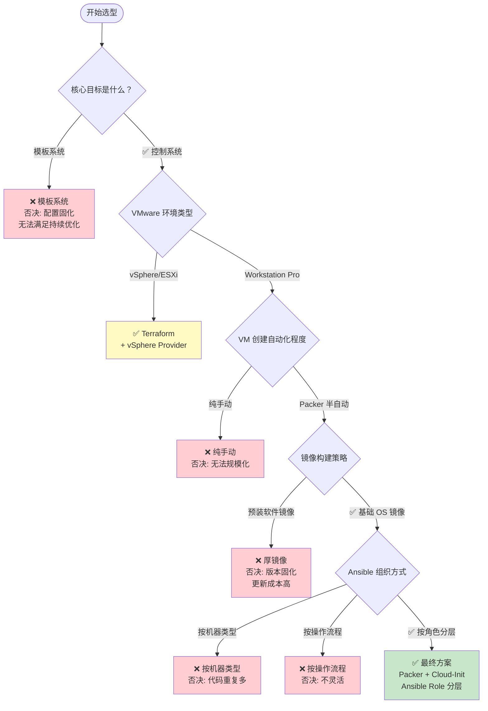

# VMware 自动化方案 决策树

> **决策主题：** VMware 虚拟机自动化批量搭建和管理系统设计方案
> **生成日期：** 2026-05-12
> **会话来源：** brainstorming 对话

---

## 决策树总览

---

## 决策记录表

| 决策节点 | 选项 A | 选项 B | 最终选择 | 核心理由 |
|---------|--------|--------|---------|---------|
| Q1: 核心目标 | 模板系统 | **控制系统** | 控制系统 | 便于持续优化和审计跟踪 |
| Q2: VMware 环境 | vSphere/ESXi | **Workstation Pro** | Workstation Pro | 用户当前环境 |
| Q3: VM 创建方式 | 纯手动 | **Packer 半自动** | Packer | Workstation API 限制，Terraform 不可用 |
| Q4: 镜像策略 | 预装软件镜像 | **基础 OS 镜像** | 基础 OS | 软件版本更新频繁，镜像更新成本高 |
| Q5: Ansible 组织 | 按机器类型/流程 | **按角色分层** | 按角色分层 | 多种软件栈重叠，复用率最高 |

---

## 约束条件追踪

| 约束来源 | 约束内容 | 影响决策 | 处理方式 |
|---------|---------|---------|---------|
| VMware 环境 | Workstation Pro 无 REST API | Q2→Q3: 排除 Terraform | 改为 Packer + vmrun |
| 商业化目标 | 需要可审计、可追溯 | Q1: 选择控制系统 | Ansible 配置存入 Git |
| 软件更新频率 | Docker/Java/Node 版本更新频繁 | Q4: 选择基础 OS 镜像 | 软件由 Ansible 安装，版本灵活 |
| 多种软件栈 | SSH/NTP/Docker/Java/AI 应用混合 | Q5: 选择角色分层 | 角色复用，减少重复代码 |
| 未来扩展 | 可能支持 Debian/CentOS | Q5: Ansible 内置 OS 适配层 | tasks/debian.yml/redhat.yml 分层 |

---

## 各决策节点详情

### Q1: 核心目标是什么？

**约束条件**：
- 规模：少量起步，未来商业化
- 目标：持续优化和审计跟踪

**方案对比**：

| 维度 | 模板系统 | 控制系统 |
|------|---------|---------|
| 部署速度 | 快（克隆 1-2 分钟） | 慢（首次配置 5-15 分钟） |
| 扩展性 | 差（模板数量膨胀） | 强（inventory 管理） |
| 配置更新 | 需重新制作模板 | 直接执行 playbook |
| 审计能力 | 弱（无版本化） | 强（Git 版本化） |

**决策结果**：控制系统

**决策理由**：用户明确表示需要"便于持续优化和审计跟踪"，控制系统更适合

---

### Q2: VMware 环境类型

**约束条件**：
- 当前环境：Windows 11 + VMware Workstation Pro 25H2
- 目标环境：未来可能迁移到 vSphere/ESXi

**方案对比**：

| 维度 | vSphere/ESXi | Workstation Pro |
|------|-------------|-----------------|
| API 支持 | REST API 完整 | API 有限 |
| Terraform 支持 | ✅ 完整支持 | ❌ 不支持 |
| Packer 支持 | ✅ 完整支持 | ✅ 支持 |
| 适用场景 | 服务器虚拟化 | 桌面虚拟化 |

**决策结果**：Workstation Pro

**决策理由**：用户当前环境是 Workstation Pro，只能选择 Packer 而非 Terraform

---

### Q3: VM 创建自动化程度

**约束条件**：
- Workstation Pro API 限制
- 目标：自动化但不过度复杂

**方案对比**：

| 维度 | 纯手动 | Packer 半自动 |
|------|--------|-------------|
| 耗时 | 15-30 分钟/台 | 5-10 分钟/台 |
| 规模化 | 差 | 强 |
| 学习成本 | 低 | 中 |
| 可重复性 | 差 | 强 |

**决策结果**：Packer 半自动

**决策理由**：Workstation Pro 无法用 Terraform，Packer 是官方推荐的自动化镜像构建工具

---

### Q4: 镜像构建策略

**约束条件**：
- 软件版本更新频繁（Docker/Java/Node）
- 需要保持镜像数量少

**方案对比**：

| 维度 | 预装软件镜像 | 基础 OS 镜像 |
|------|------------|------------|
| 部署速度 | 快 | 慢（Ansible 执行） |
| 软件版本 | 固化 | 灵活 |
| 维护成本 | 高（镜像数量膨胀） | 低 |
| 故障排查 | 难（黑箱） | 易（Ansible 日志） |

**决策结果**：基础 OS 镜像

**决策理由**：软件版本更新是常态，Ansible 改配置比重新构建镜像成本低得多

---

### Q5: Ansible 组织方式

**约束条件**：
- 多种软件栈混合（SSH/NTP/Docker/Java/AI）
- 需要高复用性
- 未来可能扩展到其他 OS

**方案对比**：

| 维度 | 按机器类型 | 按操作流程 | 按角色分层 |
|------|-----------|-----------|-----------|
| 代码复用 | 低 | 中 | **高** |
| 维护成本 | 高 | 中 | 低 |
| 灵活性 | 低 | 低 | 高 |
| 多 OS 支持 | 差 | 差 | **好** |

**决策结果**：按角色分层

**决策理由**：多种软件栈有大量重叠（都要 Docker/SSH），角色分层复用率最高，且天然支持多 OS 扩展

---

## 最终方案汇总

**选型结果**：Packer + Cloud-Init + Ansible（按角色分层）

| 层级 | 选型 | 工具/方案 | 说明 |
|------|------|-----------|------|
| 镜像构建 | Packer | 基础 OS 镜像 | 仅 OS + SSH + Cloud-Init |
| OS 初始化 | Cloud-Init | user-data | 无人值守安装 |
| 配置管理 | Ansible | Role 分层组织 | common/runtime/workload |
| 控制节点 | WSL2 | Ansible 运行环境 | Windows 11 原生支持 |

---

## 未来扩展路径

| 扩展方向 | 当前决策影响 | 扩展准备 |
|---------|------------|---------|
| 迁移到 vSphere | Packer 配置可复用 | .pkr.hcl 与 vSphere provider 兼容 |
| 增加 Debian/CentOS | Role 内已设计 OS 适配层 | 只需新增 debian.yml/redhat.yml |
| 商业化规模化 | 可引入 Ansible Tower/AWX | inventory 结构已考虑扩展 |

---

*决策树生成时间：2026-05-12*
