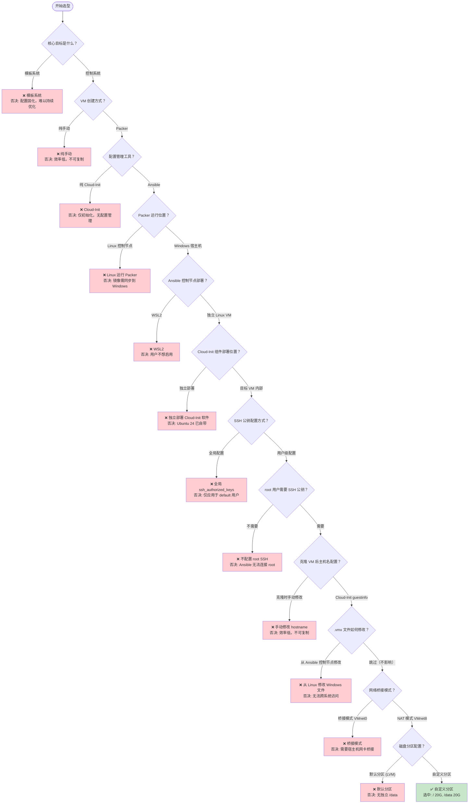

# VMware 自动化方案决策树

> **决策主题：** VMware 自动化批量服务器搭建方案
> **生成日期：** 2026-05-13
> **会话来源：** 方案选型对话
> **预计耗时：** 0.8 小时（00:36 ~ 09:15）

---

## 背景与上下文

**背景 (Background)**：
> 需要在 Windows 11 环境下使用 VMware Workstation Pro 25H2 搭建自动化批量服务器部署系统，当前采用纯手动方式效率低下且不可复制。

**上下文 (Context)**：
> - **技术环境：** Windows 11 + VMware Workstation Pro 25H2，Ansible 控制节点为独立 Linux VM
> - **架构特点：** Packer 在 Windows、Ansible 在 Linux VM、Cloud-Init 在目标 VM
> - **历史背景：** 前期已完成 Q1-Q6 决策（架构选型、Packer 位置、Ansible 部署位置）

**决策动机 (Motivation)**：
> 完善 Cloud-Init 用户配置、SSH 认证、主机名和网络配置等细节，实现完整的自动化流程。

**权衡考量 (Trade-offs)**：

| 维度 | 优先级 | 说明 |
|------|--------|------|
| 可复制性 | 高 | 一次配置，处处部署 |
| 简洁性 | 中 | 避免过度设计 |
| 兼容性 | 高 | 确保各组件协同工作 |

---

## 决策树总览



---

## 决策记录表

| 决策节点 | 选项 A | 选项 B | 最终选择 | 核心理由 |
|---------|--------|--------|---------|---------|
| Q1: 核心目标 | 模板系统 | 控制系统 | 控制系统 | 便于持续优化和审计跟踪 |
| Q2: VM 创建 | 纯手动 | Packer | Packer | 镜像构建自动化，可复制 |
| Q3: 配置管理 | Cloud-Init | Ansible | Ansible | 配置管理、幂等性、审计 |
| Q4: Packer 位置 | Linux 控制节点 | Windows 宿主机 | Windows 宿主机 | VMware 是 Windows 原生应用 |
| Q5: Ansible 部署 | WSL2 | 独立 Linux VM | 独立 Linux VM | 用户不想启用 WSL2 |
| Q6: Cloud-Init | 独立部署 | 目标 VM 内部 | 目标 VM 内部 | Ubuntu 24 自带 |
| Q7: SSH 公钥配置 | 全局配置 | 用户级配置 | 用户级配置 | 全局仅作用于 default 用户 |
| Q8: root SSH 公钥 | 不需要 | 需要 | 需要 | Ansible 需连接 root |
| Q9: 主机名配置 | 克隆时手动修改 | Cloud-Init guestinfo | Cloud-Init guestinfo | 自动化、免手动介入 |
| Q10: .vmx 修改 | 从 Ansible 修改 | 跳过 | 跳过 | Linux 无法访问 Windows 文件 |
| Q11: 网络模式 | 桥接 VMnet0 | NAT VMnet8 | NAT VMnet8 | NAT 无需宿主机网卡桥接 |
| Q12: 磁盘分区 | 默认分区 | 自定义分区 | 自定义分区 | 需要 /data 独立分区 |

---

## 约束条件追踪

| 约束来源 | 约束内容 | 影响决策 | 处理方式 |
|---------|---------|---------|---------|
| VMware 环境 | Workstation Pro 无 REST API | Q2: 排除 Terraform | 改用 Packer |
| 商业化目标 | 需要可审计 | Q1: 排除模板系统 | 选择控制系统 |
| 规模目标 | 少量试运行 | Q3: 需可扩展 | Ansible 适用于后续扩展 |
| VMware 环境 | Workstation 是 Windows 原生 | Q4: 排除 Linux 运行 Packer | Packer 在 Windows 上运行 |
| 用户偏好 | 不想启用 WSL2 | Q5: 排除 WSL2 | 独立 Linux VM |
| Cloud-Init 限制 | 全局 ssh_authorized_keys 仅作用于 default | Q7: 排除全局配置 | 每个用户单独配置 |
| Ansible 需求 | 需连接 root 用户 | Q8: root 必须配置 SSH | root 用户添加 SSH 公钥 |
| VMware 环境 | .vmx 在 Windows 上 | Q10: 跳过 .vmx 修改 | Cloud-Init 首次启动已生效 |
| 网络环境 | 不想依赖宿主机网卡 | Q11: 选择 NAT | NAT 模式无需桥接 |
| 存储需求 | 需要独立 /data 分区 | Q12: 自定义分区 | Autoinstall layout 配置 |

---

## 各决策节点详情

### Q1-Q6: 前期决策节点

（详见文档历史版本，核心结论：Packer Windows + Ansible Linux VM + Cloud-Init 目标 VM）

---

### Q7: SSH 公钥配置方式？

**约束条件**：
- 需要为 ubuntu 和 root 用户同时配置 SSH 公钥
- Ansible 控制节点公钥需添加到所有用户

**方案对比**：

| 维度 | 全局配置 (ssh_authorized_keys 在 users 顶部) | 用户级配置 (每个用户单独列出) |
|------|---------------------------------------------|----------------------------|
| 配置位置 | 集中在 users 顶部 | 分散在每个用户下方 |
| 维护性 | 一次配置 | 需多次重复 |
| Cloud-Init 兼容性 | 仅作用于 default 用户 | 全部用户生效 |

**决策结果**：用户级配置

**决策理由**：Cloud-Init 官方文档明确指出，`ssh_authorized_keys` 放在 users 列表内部时，仅作用于 default 用户。全局配置不会自动应用到后续用户，必须使用用户级配置。

**否决方案处理**：
- 全局配置：否决原因 = Cloud-Init 仅将全局 ssh_authorized_keys 应用于 default 用户，root 和 ubuntu 用户不会自动继承

---

### Q8: root 用户是否需要 SSH 公钥？

**约束条件**：
- Ansible 控制节点需要 SSH 连接目标 VM
- 后续操作统一使用 root 用户执行

**方案对比**：

| 维度 | 不配置 root SSH | 配置 root SSH |
|------|----------------|--------------|
| Ansible 连接 | 只能用 ubuntu | root 和 ubuntu 都可 |
| 权限 | 需 sudo | 直接 root 权限 |
| 安全性 | 稍高 | 需确保密钥安全 |

**决策结果**：需要配置 root SSH 公钥

**决策理由**：用户明确后续所有操作使用 root 用户执行，Ansible 需能 SSH 到 root 进行配置管理。

**否决方案处理**：
- 不配置 root SSH：否决原因 = Ansible 无法连接 root，后续操作无法使用 root 用户

---

### Q9: 克隆 VM 后主机名配置？

**约束条件**：
- VMware Workstation 无 vSphere 自定义规范功能
- 克隆后所有 VM 有相同主机名会导致冲突

**方案对比**：

| 维度 | 克隆时手动修改 | Cloud-Init guestinfo | Packer 参数化 |
|------|--------------|---------------------|--------------|
| 自动化程度 | 低 | 高 | 中 |
| 灵活性 | 高 | 高 | 低（需构建多镜像） |
| 实现复杂度 | 低 | 中 | 低 |

**决策结果**：Cloud-Init guestinfo + Ansible 自动修改

**决策理由**：方案 B（Cloud-Init guestinfo）需要 vSphere 自定义规范，VMware Workstation 不支持。因此采用混合方案：Packer 构建时设置默认 guestinfo.local-hostname，克隆后通过 Ansible Playbook 自动修改 /etc/hostname 和 /etc/hosts。

**否决方案处理**：
- 克隆时手动修改：否决原因 = 效率低，不可复制，不符合自动化目标

---

### Q10: .vmx 文件如何修改？

**约束条件**：
- .vmx 文件位于 Windows 宿主机
- Ansible 控制节点是 Linux VM
- Cloud-Init 仅在首次启动时读取 guestinfo.local-hostname

**方案对比**：

| 维度 | 从 Ansible 控制节点修改 | 跳过 .vmx 修改 |
|------|----------------------|---------------|
| 可行性 | 不可行（跨系统） | 可行 |
| 影响 | 无法实现 | 无（首次启动后已生效） |

**决策结果**：跳过 .vmx 修改

**决策理由**：.vmx 文件在 Windows 上，Linux Ansible 控制节点无法直接访问。而且 Cloud-Init 在 VM 首次启动后已将 guestinfo.local-hostname 写入 /etc/hostname，后续不再读取 .vmx 文件。Ansible 只需修改 /etc/hostname 和 /etc/hosts 即可完成 hostname 变更。

**否决方案处理**：
- 从 Ansible 修改 .vmx：否决原因 = Linux 无法访问 Windows 文件系统

---

### Q11: 网络桥接模式？

**约束条件**：
- 宿主机网络环境可能变化
- 不想依赖宿主机网卡配置

**方案对比**：

| 维度 | 桥接模式 (VMnet0) | NAT 模式 (VMnet8) |
|------|------------------|------------------|
| 网络访问 | 直接接入宿主机网络 | 通过 VMware NAT 访问外网 |
| IP 分配 | 依赖宿主机 DHCP | VMware 内置 DHCP |
| 依赖性 | 依赖宿主机网卡 | 不依赖宿主机网卡 |
| 适用场景 | 需要与宿主机同网段 | 隔离环境、测试环境 |

**决策结果**：NAT 模式 (VMnet8)

**决策理由**：NAT 模式不依赖宿主机网卡配置，VM 通过 VMware 内置 NAT 访问外部网络，适合隔离测试环境。桥接模式需要宿主机网卡支持，可能受网络环境限制。

**否决方案处理**：
- 桥接模式：否决原因 = 需要宿主机网卡桥接，网络环境变化时需重新配置

---

### Q12: 磁盘分区配置？

**约束条件**：
- 需要独立的 /data 分区用于数据存储
- 采用 UEFI 启动模式
- 总磁盘大小 40GB

**方案对比**：

| 维度 | 默认分区 (LVM) | 自定义分区 (layout) |
|------|--------------|-------------------|
| / 分区 | 全部或 LVM | 20GB |
| /data 分区 | 无 | 20GB |
| swap | LVM swap | 无 (rest 空间) |
| 灵活性 | 低 | 高 |

**决策结果**：自定义分区 (layout)

**决策理由**：需要独立的 /data 分区方便数据管理，自定义分区可以明确控制每个挂载点的大小。Autoinstall 的 layout 格式简洁，支持 UEFI 自动创建 EFI 和 BIOS Boot 分区。

**分区配置**：
```yaml
storage:
  layout:
    - name: root
      devices:
        - sda
      partitions:
        - sizing: 20G
          mount: /
        - sizing: 20G
          mount: /data
        - sizing: rest
          mount: none
```

**UEFI 自动分区**：
- EFI 系统分区 (ESP): 512MB
- BIOS Boot 分区: 1MB (如果需要)
- root 分区: 20GB
- data 分区: 20GB
- rest: 剩余空间 (未使用)

---

## 最终方案汇总（完整版）

**选型结果**：混合架构（Packer Windows + Ansible Linux VM + Cloud-Init 目标 VM）

| 层级 | 选型 | 工具/方案 | 运行位置 |
|------|------|-----------|----------|
| 镜像构建 | Packer | Packer + Cloud-Init | Windows 11 宿主机 |
| OS 初始化 | Cloud-Init | Ubuntu 自带 | 目标 VM 内部 |
| 配置管理 | Ansible | Role 分层组织 | 独立 Linux VM |
| 虚拟机平台 | VMware Workstation | VMware | Windows 11 |
| 网络模式 | NAT | VMnet8 | VMware 内置 |
| 启动模式 | UEFI | 非安全启动 | VMware VM 配置 |
| 磁盘分区 | Autoinstall layout | / 20G, /data 20G | Cloud-Init 配置 |

**用户配置策略**：
- ubuntu 用户：保留，密码 ubuntucj
- root 用户：添加，密码 chujuncj，SSH 公钥已配置
- Ansible 连接：使用 root 用户 (ansible_user: root)

**SSH 公钥配置**：
- 采用用户级配置，ubuntu 和 root 用户各自配置 ssh_authorized_keys
- 公钥为 Ansible 控制节点公钥

**hostname 配置流程**：
1. Packer 构建时设置默认 guestinfo.local-hostname = ubuntu-server
2. 克隆 VM
3. Ansible Playbook 自动修改 /etc/hostname 和 /etc/hosts
4. .vmx 文件无需修改（Cloud-Init 首次启动后已生效）

**架构图**：
```
Windows 11 (Host)
├── VMware Workstation Pro 25H2 (NAT 模式 VMnet8)
│   ├── VM-0: Ansible 控制节点 (Ubuntu Server)
│   │   └── 运行: Ansible, Python, Git
│   └── 其他目标 VM... (克隆后 Ansible 自动配置 hostname)
│
├── Packer (Windows 原生安装)
│   └── 构建镜像到 VMware 目录
└── Cloud-Init 配置
    ├── user-data: 用户、SSH、密码配置
    └── meta-data: 主机名、网络配置
```

---

## 未来扩展路径

| 扩展方向 | 当前决策影响 | 扩展准备 |
|---------|------------|---------|
| 其他操作系统 | Packer 模板可复用 | 提前规划 OS 差异化 |
| 大规模部署 | Ansible 可扩展 | 考虑 AWX/Tower |
| 云平台扩展 | Packer 支持多平台 | 保留接口设计 |
| vSphere 迁移 | Packer 配置可复用 | .pkr.hcl 与 vSphere provider 兼容 |

---

## 新增决策节点记录

### 新增时间线

| 时间 | 决策节点 | 简要结论 |
|------|---------|---------|
| 2026-05-13 06:39 | Q1-Q6 | 架构选型完成 |
| 2026-05-13 09:02 | Q7 | SSH 公钥：用户级配置 |
| 2026-05-13 09:02 | Q8 | root 用户需配置 SSH 公钥 |
| 2026-05-13 09:02 | Q9 | hostname：Ansible 自动修改 |
| 2026-05-13 09:02 | Q10 | .vmx 修改：跳过 |
| 2026-05-13 09:02 | Q11 | 网络模式：NAT VMnet8 |
| 2026-05-13 09:20 | Q12 | 磁盘分区：/ 20G, /data 20G |

---

*决策树更新时间：2026-05-13 09:20*
*新增决策：Q7 (SSH公钥配置)、Q8 (root SSH)、Q9 (hostname配置)、Q10 (.vmx跳过)、Q11 (NAT模式)、Q12 (磁盘分区)*
