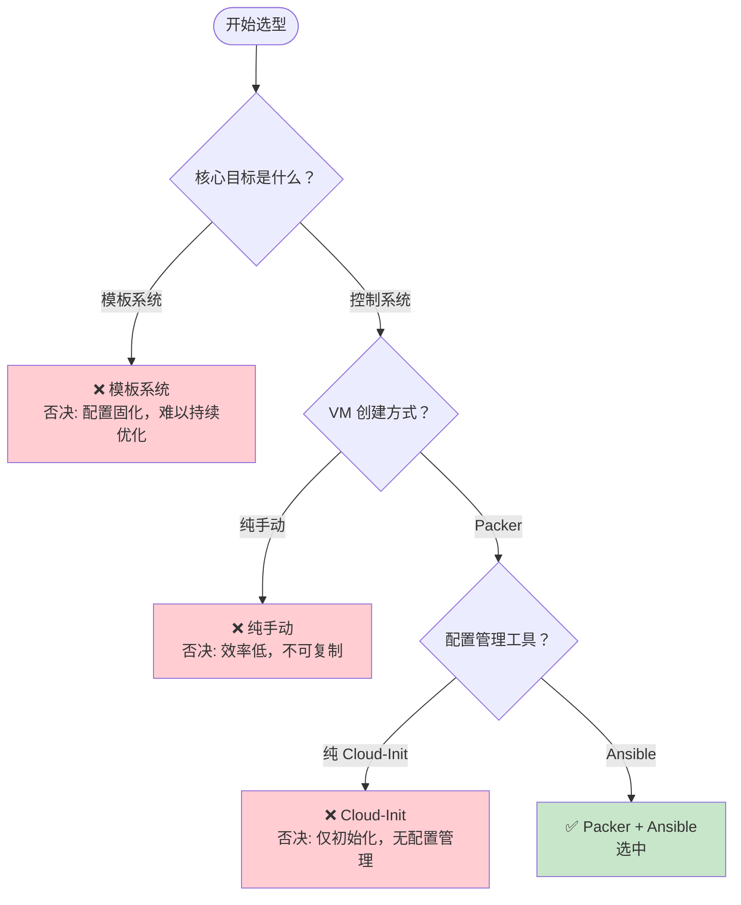

# VMware 自动化方案决策树

> **决策主题：** VMware 自动化批量服务器搭建方案
> **生成日期：** 2026-05-13
> **会话来源：** 方案选型对话
> **预计耗时：** 0.5 小时（00:36 ~ 01:09）

---

## 决策树总览



---

## 决策记录表

| 决策节点 | 选项 A | 选项 B | 最终选择 | 核心理由 |
|---------|--------|--------|---------|---------|
| Q1: 核心目标 | 模板系统 | 控制系统 | 控制系统 | 便于持续优化和审计跟踪 |
| Q2: VM 创建 | 纯手动 | Packer | Packer | 镜像构建自动化，可复制 |
| Q3: 配置管理 | Cloud-Init | Ansible | Ansible | 配置管理、幂等性、审计 |

---

## 约束条件追踪

| 约束来源 | 约束内容 | 影响决策 | 处理方式 |
|---------|---------|---------|---------|
| VMware 环境 | Workstation Pro 无 REST API | Q2: 排除 Terraform | 改用 Packer |
| 商业化目标 | 需要可审计 | Q1: 排除模板系统 | 选择控制系统 |
| 规模目标 | 少量试运行 | Q3: 需可扩展 | Ansible 适用于后续扩展 |

---

## 各决策节点详情

### Q1: 核心目标是什么？

**约束条件**：
- 规模：少量试运行
- 目标：未来考虑商业化
- 要求：可审计、可追溯

**方案对比**：

| 维度 | 模板系统 | 控制系统 |
|------|---------|---------|
| 优势 | 快速部署 | 持续优化、审计跟踪 |
| 劣势 | 配置固化、难以迭代 | 初期建设成本较高 |
| 适用场景 | 静态环境、不变更 | 动态环境、需要迭代 |

**决策结果**：控制系统

**决策理由**：便于持续优化和审计跟踪，满足商业化目标的可审计要求。

**否决方案处理**：
- 模板系统：否决原因 = 配置固化，难以持续优化和审计

---

### Q2: VM 创建方式？

**约束条件**：
- VMware 环境：Workstation Pro 25H2
- 限制：无 REST API，无法使用 Terraform

**方案对比**：

| 维度 | 纯手动 | Packer |
|------|-------|--------|
| 优势 | 灵活 | 自动化、可复制 |
| 劣势 | 效率低、不可复制 | 需要学习成本 |
| 适用场景 | 一次性环境 | 批量部署 |

**决策结果**：Packer

**决策理由**：Workstation API 限制，无法使用 Terraform，Packer 是最佳自动化镜像构建方案。

**否决方案处理**：
- 纯手动：否决原因 = 效率低，不可复制

---

### Q3: 配置管理工具？

**约束条件**：
- 需要配置管理能力
- 需要幂等性
- 需要审计支持

**方案对比**：

| 维度 | Cloud-Init | Ansible |
|------|-----------|---------|
| 优势 | 云原生、轻量 | 配置管理、幂等、审计 |
| 劣势 | 仅初始化，无配置管理 | 需要 Agent 或 SSH |
| 适用场景 | 云 VM 初始化 | 配置管理场景 |

**决策结果**：Packer + Ansible

**决策理由**：Cloud-Init 仅能做初始化，无法满足配置管理和审计需求。Ansible 提供幂等性和完整的配置管理能力。

**否决方案处理**：
- Cloud-Init：否决原因 = 仅初始化，无配置管理能力

---

## 新增决策节点（2026-05-13 06:39）

---

### Q4: Packer 运行位置？

**约束条件**：
- VMware Workstation Pro 是 Windows 原生应用
- 需要直接访问 VMware 目录（如 `C:\Users\<用户>\Documents\Virtual Machines\`）

**方案对比**：

| 维度 | Packer 在 Linux 控制节点 | Packer 在 Windows 宿主机 |
|------|------------------------|------------------------|
| 优势 | 统一在 Linux 环境管理 | 直接访问 VMware 目录 |
| 劣势 | 镜像需同步到 Windows | Packer 配置与 Ansible 分离 |
| 镜像存储 | Linux VM 虚拟磁盘 | Windows VMware 目录 |

**决策结果**：Packer 在 Windows 宿主机上运行

**决策理由**：VMware Workstation 是 Windows 原生应用，无法在 Linux 控制节点上直接运行。Packer 在 Windows 上可直接调用 vmrun，访问 VMware 目录最简单，无需跨系统同步镜像文件。

**否决方案处理**：
- Packer 在 Linux：否决原因 = 镜像需同步到 Windows，架构复杂

---

### Q5: Ansible 控制节点如何部署？

**约束条件**：
- 用户不想启用 WSL2
- Windows 直接安装 Ansible 兼容性差

**方案对比**：

| 维度 | WSL2 | 独立 Linux VM |
|------|------|--------------|
| 优势 | 原生支持、资源占用小 | 完全 Linux 环境、无兼容性问题 |
| 劣势 | 用户不想启用 | 需要额外 VM 资源（2C/4GB） |
| Ansible 兼容性 | 需 WSL2 | 完全兼容 |

**决策结果**：独立的 Linux VM（Ubuntu Server）

**决策理由**：用户明确不想启用 WSL2，Windows 直接安装 Ansible 有 Python 依赖问题。独立 VM 完全模拟真实 Linux 环境，Ansible 运行无兼容性问题。

**否决方案处理**：
- WSL2：否决原因 = 用户不想启用
- Windows 直接安装：否决原因 = Python 依赖复杂、路径问题多

---

### Q6: Cloud-Init 组件部署在哪里？

**约束条件**：
- Cloud-Init 是 Ubuntu 24 自带的组件
- Packer 在 Windows 上运行

**架构澄清**：

| 组件 | 运行位置 | 说明 |
|------|---------|------|
| Packer | Windows 11 宿主机 | 调用 VMware Workstation API |
| Cloud-Init 软件 | 目标 VM 内部 | Ubuntu 24 自带，无需单独部署 |
| Cloud-Init 配置 | 通过 ISO 注入 | Packer 构建时挂载配置 ISO |

**决策结果**：Cloud-Init 运行在目标 VM 内部

**决策理由**：Cloud-Init 是 Ubuntu 官方的无人值守安装标准，Ubuntu 24 Server/Desktop 默认已自带。Packer 只需挂载包含 `user-data` 的配置 ISO，Cloud-Init 在 VM 启动后自动读取并执行。

---

## 最终方案汇总（更新版）

**选型结果**：混合架构（Packer Windows + Ansible Linux）

| 层级 | 选型 | 工具/方案 | 运行位置 |
|------|------|-----------|----------|
| 镜像构建 | Packer | Packer + Cloud-Init | Windows 11 宿主机 |
| OS 初始化 | Cloud-Init | Ubuntu 自带 | 目标 VM 内部 |
| 配置管理 | Ansible | Role 分层组织 | 独立 Linux VM |
| 虚拟机平台 | VMware Workstation | VMware | Windows 11 |

**架构图**：
```
Windows 11 (Host)
├── VMware Workstation Pro 25H2
│   ├── VM-0: Ansible 控制节点 (Ubuntu Server)
│   │   └── 运行: Ansible, Python, Git
│   └── 其他目标 VM...
│
└── Packer (Windows 原生安装)
    └── 构建镜像到 VMware 目录
```

---

## 未来扩展路径

| 扩展方向 | 当前决策影响 | 扩展准备 |
|---------|------------|---------|
| 其他操作系统 | Packer 模板可复用 | 提前规划 OS 差异化 |
| 大规模部署 | Ansible 可扩展 | 考虑 AWX/Tower |
| 云平台扩展 | Packer 支持多平台 | 保留接口设计 |
| vSphere 迁移 | Packer 配置可复用 | .pkr.hcl 与 vSphere provider 兼容 |

---

*决策树更新时间：2026-05-13 06:39*
*新增决策：Q4 (Packer运行位置)、Q5 (Ansible控制节点部署)、Q6 (Cloud-Init部署位置)*
