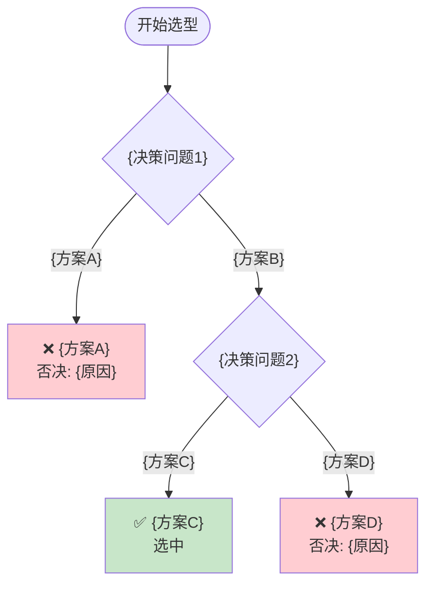

# 决策树文档模板

## 完整输出模板

```markdown
# {决策主题} 决策树

> **决策主题：** {主题名称}
> **生成日期：** {YYYY-MM-DD}
> **会话来源：** {brainstorming 对话 / 会议纪要等}

---

## 决策树总览



---

## 决策记录表

| 决策节点 | 选项 A | 选项 B | 最终选择 | 核心理由 |
|---------|--------|--------|---------|---------|
| Q1: {问题1} | {方案A} | {方案B} | {方案B} | {理由} |
| Q2: {问题2} | {方案C} | {方案D} | {方案C} | {理由} |

---

## 约束条件追踪

| 约束来源 | 约束内容 | 影响决策 | 处理方式 |
|---------|---------|---------|---------|
| {来源1} | {约束内容} | Q{节点}: {影响} | {处理} |
| {来源2} | {约束内容} | Q{节点}: {影响} | {处理} |

---

## 各决策节点详情

### Q1: {决策问题}

**约束条件**：
- {约束1}
- {约束2}

**方案对比**：

| 维度 | {方案A} | {方案B} |
|------|---------|---------|
| 优势 | {优势列表} | {优势列表} |
| 劣势 | {劣势列表} | {劣势列表} |
| 适用场景 | {场景} | {场景} |

**决策结果**：{最终选择}

**决策理由**：{理由}

**否决方案处理**：
- {方案A}：否决原因 = {原因}

---

### Q2: {决策问题}

（同上结构）

---

## 最终方案汇总

**选型结果**：{最终方案组合}

| 层级 | 选型 | 工具/方案 | 版本/规格 |
|------|------|-----------|----------|
| 镜像构建 | {工具} | {方案} | {版本} |
| 配置管理 | {工具} | {方案} | {版本} |
| 控制节点 | {工具} | {方案} | {版本} |

---

## 未来扩展路径

| 扩展方向 | 当前决策影响 | 扩展准备 |
|---------|------------|---------|
| {方向1} | {影响} | {准备} |
| {方向2} | {影响} | {准备} |

---

*决策树生成时间：{YYYY-MM-DD HH:MM}*
```

---

## 决策树节点样式参考

### 开始节点
```
START(["开始选型"])
```

### 决策节点
```
Q1{"核心目标是什么？"}
```

### 方案分支
```
Q1 -->|"模板系统"| TEMPLATE_END["❌ 模板系统<br/>否决: 配置固化"]
Q1 -->|"✅ 控制系统"| Q2
```

### 最终方案节点
```
FINAL["✅ 最终方案<br/>Packer + Ansible"]
```

### 样式定义
```
style TEMPLATE_END fill:#ffcdd2    # 红色 = 否决
style FINAL fill:#c8e6c9           # 绿色 = 选中
style Q2 fill:#fff9c4              # 黄色 = 待定
```

---

## Mermaid 语法要点

1. **节点 ID 唯一性**：每个节点 ID 必须唯一
2. **标签换行**：使用 `<br/>` 而非 `\n`
3. **节点形状**：
   - 开始/结束：`(["文本"])`
   - 决策：`{"文本"}`
   - 普通：`["文本"]`
4. **连接线**：
   - 实线：`-->`
   - 虚线：`-.->`
5. **条件标签**：`|条件| 目标`
