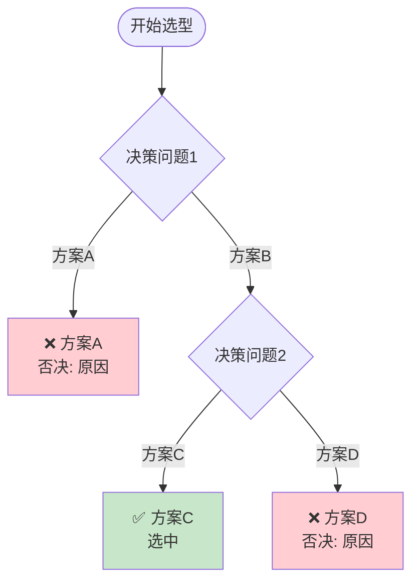
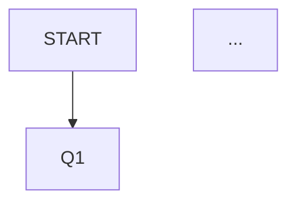

# My Decision Tree Doc Builder

从方案选型对话中提取决策节点，构建可视化的 Mermaid 决策树文档。

## 定位差异

| 技能 | 目标 | 输入 | 输出 |
|------|------|------|------|
| brainstorming | 方案设计与多轮对话 | 用户需求描述 | 设计方案 |
| my-decision-tree-doc-builder | 决策追踪与可视化 | 方案选型对话 | 决策树文档 |

**协作流程**：
```
brainstorming（方案设计）
    ↓ 对话结果
my-decision-tree-doc-builder（提取决策树）
    ↓ 文档
doc/decision-trees/（决策树 Markdown）
```

---

## 使用场景

- 方案选型讨论后的决策记录
- 技术架构决策的文档化
- 基础设施选型的决策追踪
- 团队决策对齐与回溯

## 调用方式

```
/my-decision-tree-doc-builder [可选：决策主题]
```

### 版本管理模式

- `/my-decision-tree-doc-builder --versions` — 列出所有版本
- `/my-decision-tree-doc-builder --changelog` — 查看变更日志
- `/my-decision-tree-doc-builder --diff v1.0.0 v1.1.0` — 对比两个版本
- `/my-decision-tree-doc-builder --restore v1.0.0` — 回滚到指定版本
- `/my-decision-tree-doc-builder --set-doc-dir <path>` — 设置默认输出目录

---

## 执行流程

### Phase 0：收集上下文元数据

运行以下命令收集项目信息：

```bash
bash SCRIPTS/collect_metadata.sh
```

> 脚本内容见 [SCRIPTS/collect_metadata.sh](./SCRIPTS/collect_metadata.sh)

从会话 system-reminder 中提取：
- **会话 ID**：从 session summary 或文件路径提取 UUID 部分
- **AI 模型**：从 system-reminder 中的模型信息读取

---

### Phase 1：获取输出目录偏好

**全局记忆机制（跨项目生效）：**

```bash
# 尝试从全局 memory 读取
cat ~/.claude/memory/decision_tree_doc_dir.md 2>/dev/null || echo "暂无"
```

- 首次执行时询问用户默认输出目录
- 保存到全局 memory：`~/.claude/memory/decision_tree_doc_dir.md`
- 后续在**任何项目**中执行技能时，直接读取使用
- 用户可通过 `--set-doc-dir <path>` 重新设置

---

### Phase 2：检测同名文档

生成文档前，检查目标目录是否已存在同名文档：

```bash
# 检测同名文档（精确匹配 + 带版本号后缀）
ls doc/decision-trees/ | grep "^{YYYY-MM-DD}-{决策主题}.*\.md$"
```

**处理策略（三选一）：**

| 选项 | 说明 | 适用场景 |
|------|------|---------|
| **新建版本** | 在文件名末尾追加 `-v2`、`-v3` 等 | 内容差异较大，保留独立快照 |
| **增量追加** | 追加到最新版本末尾 | 同一主题的持续演进 |
| **覆盖文档** | 直接覆盖原文件 | 用户明确确认 |

若检测到同名文档，**必须询问用户**选择处理方式。

---

### Phase 3：识别决策节点

从会话中识别所有决策节点，包括：
- 明确的选择题（"方案 A vs 方案 B"）
- 包含约束条件的讨论
- 用户做出的最终选择
- AI 给出的否决理由

**识别关键词**：
- "方案选型对比"、"优缺点"
- "选择"、"决策"、"最终采用"
- "约束"、"限制"、"不能"
- "否决"、"排除"、"不行"

---

### Phase 4：提取决策数据

为每个决策节点提取：

| 字段 | 说明 | 示例 |
|------|------|------|
| `question` | 决策问题 | "核心目标是什么？" |
| `constraints` | 约束条件列表 | ["规模：少量", "目标：商业化"] |
| `options` | 可选方案及属性 | 见下方结构 |
| `selected` | 最终选择 | "控制系统" |
| `rationale` | 决策理由 | "便于持续优化和审计跟踪" |

**option 结构**：
```yaml
options:
  - id: "A"
    label: "方案A名称"
    pros: ["优势1", "优势2"]
    cons: ["劣势1"]
    selected: false
    eliminated: true
    elimination_reason: "不满足XX约束"
  - id: "B"
    label: "方案B名称"
    pros: ["优势1"]
    cons: ["劣势1"]
    selected: true
    elimination_reason: null
```

---

### Phase 5：生成 Mermaid 决策树

### 5.1 决策树格式



### 5.2 节点样式规范

| 节点类型 | Mermaid style | 颜色代码 |
|---------|---------------|---------|
| 开始 | `["开始"]` | 无 |
| 决策节点 | `{"问题"}` | 无 |
| 最终方案 | `["✅ 名称"]` | `fill:#c8e6c9` 绿色 |
| 否决方案 | `["❌ 名称"]` | `fill:#ffcdd2` 红色 |
| 待定/备选 | `["方案名称"]` | `fill:#fff9c4` 黄色 |

### 5.3 节点 ID 命名

- 开始节点：`START`
- 决策节点：`Q1`, `Q2`, `Q3`...
- 方案节点：`方案A_END`, `方案B_END`, `FINAL`
- 每个节点用 `-->` 或 `-.->` 连接

---

### Phase 6：生成决策记录表

```markdown
| 决策节点 | 选项 A | 选项 B | 最终选择 | 核心理由 |
|---------|--------|--------|---------|---------|
| Q1: 核心目标 | 模板系统 | 控制系统 | 控制系统 | 便于持续优化和审计 |
| Q2: VM 创建 | 纯手动 | Packer | Packer | Workstation API 限制 |
```

---

### Phase 7：生成约束条件追踪表

```markdown
## 约束条件追踪

| 约束来源 | 约束内容 | 影响决策 | 备注 |
|---------|---------|---------|------|
| VMware 环境 | Workstation Pro 无 REST API | Q2: 排除 Terraform | 改为 Packer |
| 商业化目标 | 需要可审计 | Q1: 排除模板系统 | 控制系统更适合 |
```

---

### Phase 8：输出文档

**文件命名**：
```
doc/decision-trees/{YYYY-MM-DD}-{决策主题}-decision-tree.md
```

若检测到同名文档，根据用户选择的策略处理：
- 新建版本：追加 `-v2`、`-v3` 等后缀
- 覆盖文档：直接覆盖

---

### Phase 9：质量自检

生成文档后检查：

- [ ] 决策树节点数量与识别到的决策节点一致
- [ ] 否决方案标注了 elimination_reason
- [ ] 最终方案标注了 selected
- [ ] Mermaid 语法正确（节点 ID 唯一）
- [ ] 决策记录表包含所有决策节点
- [ ] 约束条件追踪表完整
- [ ] 无乱码（运行 `grep -n "�" <文件路径>` 确认）

---

### Phase 10：自动提交到 GitHub

```bash
bash SCRIPTS/auto_commit.sh <项目路径> <文档标题> <决策节点数> <最终方案>
```

**Git 提交格式**：
```
docs: 新增 {决策主题} 决策树文档

- 决策节点数: N 个
- 最终方案: {方案名称}
- 关键约束: {约束1}, {约束2}
```

---

## 版本管理

### 版本元数据

```bash
# 查看当前版本
cat versions/VERSIONS.json

# 查看变更日志
cat versions/CHANGELOG.md
```

### 版本对比

```bash
# 对比任意两个版本
diff versions/SKILL-v1.0.0.md versions/SKILL-v1.1.0.md
```

### 版本回滚

```bash
# 回滚到指定版本
cp versions/SKILL-v${TARGET_VERSION}.md SKILL.md
```

---

## 输出文档结构

### 完整文档模板

```markdown
# {决策主题} 决策树

> **决策主题：** {主题名称}
> **生成日期：** {YYYY-MM-DD}
> **会话来源：** {brainstorming 对话 / 会议纪要等}

---

## 决策树总览



---

## 决策记录表

| 决策节点 | 选项 A | 选项 B | 最终选择 | 核心理由 |
|---------|--------|--------|---------|---------|

---

## 约束条件追踪

| 约束来源 | 约束内容 | 影响决策 |
|---------|---------|---------|
| | | |

---

## 各决策节点详情

### Q1: {决策问题}

**约束条件**：{约束列表}

**方案对比**：

| 维度 | 方案A | 方案B |
|------|-------|-------|
| 优势 | ... | ... |
| 劣势 | ... | ... |

**决策结果**：{最终选择}

**决策理由**：{理由}

---

## 最终方案汇总

**选型结果**：{最终方案组合}

| 层级 | 选型 | 工具/方案 |
|------|------|-----------|
| | | |

---

## 未来扩展路径

| 扩展方向 | 当前决策影响 | 扩展准备 |
|---------|------------|---------|
| | | |

---

*决策树生成时间：{YYYY-MM-DD HH:MM}*
```
