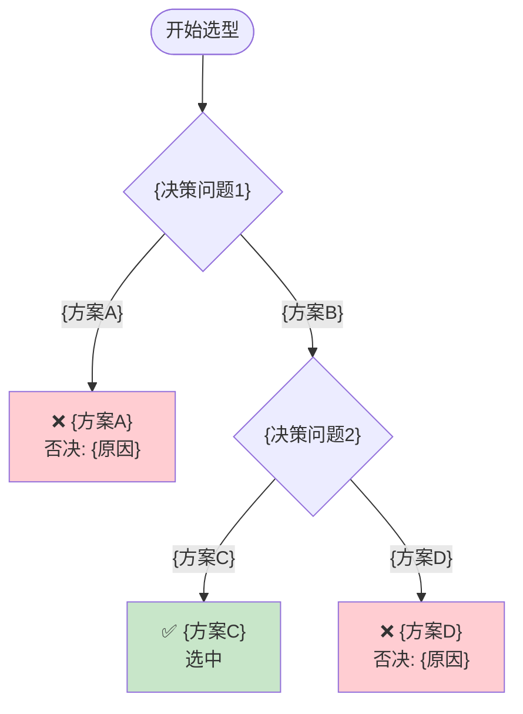

# 决策树文档模板

## 完整输出模板

```markdown
# {决策主题} 决策树

> **决策主题：** {主题名称}
> **生成日期：** {YYYY-MM-DD}
> **会话来源：** {brainstorming 对话 / 会议纪要等}

---

## 背景与上下文

**背景 (Background)**：
> 描述这个决策是在什么情况下产生的，项目的现状是什么，为什么需要进行这个决策。
>
> 示例：需要在 Windows 11 环境下使用 VMware Workstation Pro 25H2 搭建自动化批量服务器部署系统，当前采用纯手动方式效率低下且不可复制。

**上下文 (Context)**：
> 决策所处的环境信息、相关利益方、已有的技术积累或限制。
>
> - **技术环境：** {操作系统、虚拟化平台、网络环境等}
> - **团队能力：** {已有的技术栈、学习能力等}
> - **时间约束：** {交付时间、迭代周期等}
> - **历史背景：** {之前尝试过什么、为什么失败或需要改进}

**决策动机 (Motivation)**：
> 要解决的核心问题是什么，为什么这个问题必须解决。
>
> 示例：手动创建 VM 效率低，每次搭建需要 2-3 小时，且无法保证一致性，急需自动化。

**权衡考量 (Trade-offs)**：
> 做这个决策时，我们认为什么更重要、什么可以牺牲。
>
> | 维度 | 优先级 | 说明 |
> |------|--------|------|
> | 可复制性 | 高 | 一次配置，处处部署 |
> | 学习成本 | 中 | 初期投入可接受 |
> | 灵活性 | 低 | 当前场景需求明确，可牺牲部分灵活性 |

---

## 决策树总览



---

## 决策记录表

| 决策节点 | 选项 A | 选项 B | 最终选择 | 核心理由 |
|---------|--------|--------|---------|---------|
| Q1: {问题1} | {方案A} | {方案B} | {方案B} | {理由} |
| Q2: {问题2} | {方案C} | {方案D} | {方案C} | {理由} |

---

## 约束条件追踪

| 约束来源 | 约束内容 | 影响决策 | 处理方式 |
|---------|---------|---------|---------|
| {来源1} | {约束内容} | Q{节点}: {影响} | {处理} |
| {来源2} | {约束内容} | Q{节点}: {影响} | {处理} |

---

## 各决策节点详情

### Q1: {决策问题}

**约束条件**：
- {约束1}
- {约束2}

**权衡考量**：
| 我们更看重 | 相应牺牲 | 说明 |
|-----------|---------|------|
| {维度A} | {维度B} | {说明} |
| 可持续性 | 短期速度 | 宁可初期多投入，也要便于后续维护 |

**方案对比**：

| 维度 | {方案A} | {方案B} |
|------|---------|---------|
| 优势 | {优势列表} | {优势列表} |
| 劣势 | {劣势列表} | {劣势列表} |
| 适用场景 | {场景} | {场景} |

**决策结果**：{最终选择}

**决策理由**：{理由}

**否决方案处理**：
- {方案A}：否决原因 = {原因}

---

### Q2: {决策问题}

（同上结构）

---

## 最终方案汇总

**选型结果**：{最终方案组合}

| 层级 | 选型 | 工具/方案 | 版本/规格 |
|------|------|-----------|----------|
| 镜像构建 | {工具} | {方案} | {版本} |
| 配置管理 | {工具} | {方案} | {版本} |
| 控制节点 | {工具} | {方案} | {版本} |

---

## 未来扩展路径

| 扩展方向 | 当前决策影响 | 扩展准备 |
|---------|------------|---------|
| {方向1} | {影响} | {准备} |
| {方向2} | {影响} | {准备} |

---

*决策树生成时间：{YYYY-MM-DD HH:MM}*
```

---

## 决策树节点样式参考

### 开始节点
```
START(["开始选型"])
```

### 决策节点
```
Q1{"核心目标是什么？"}
```

### 方案分支
```
Q1 -->|"模板系统"| TEMPLATE_END["❌ 模板系统<br/>否决: 配置固化"]
Q1 -->|"✅ 控制系统"| Q2
```

### 最终方案节点
```
FINAL["✅ 最终方案<br/>Packer + Ansible"]
```

### 样式定义
```
style TEMPLATE_END fill:#ffcdd2    # 红色 = 否决
style FINAL fill:#c8e6c9           # 绿色 = 选中
style Q2 fill:#fff9c4              # 黄色 = 待定
```

---

## Mermaid 语法要点

1. **节点 ID 唯一性**：每个节点 ID 必须唯一
2. **标签换行**：使用 `<br/>` 而非 `\n`
3. **节点形状**：
   - 开始/结束：`(["文本"])`
   - 决策：`{"文本"}`
   - 普通：`["文本"]`
4. **连接线**：
   - 实线：`-->`
   - 虚线：`-.->`
5. **条件标签**：`|条件| 目标`
